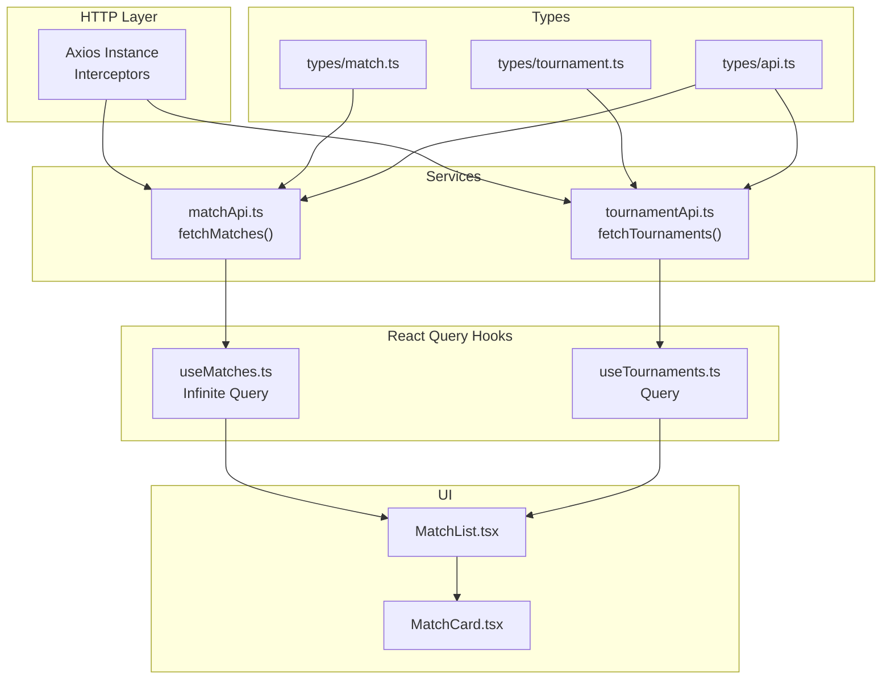
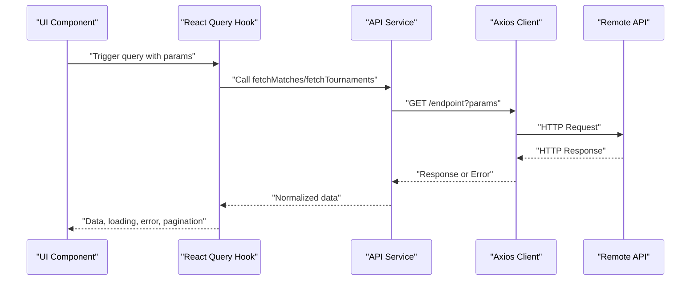
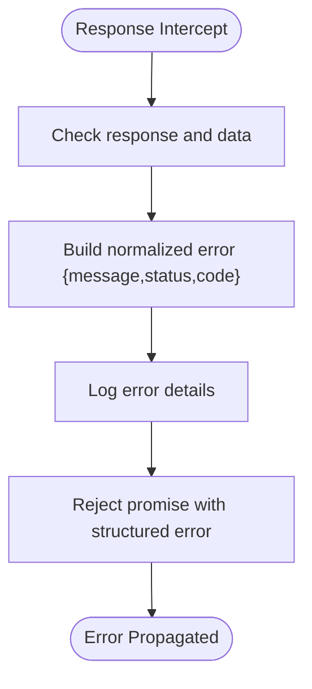
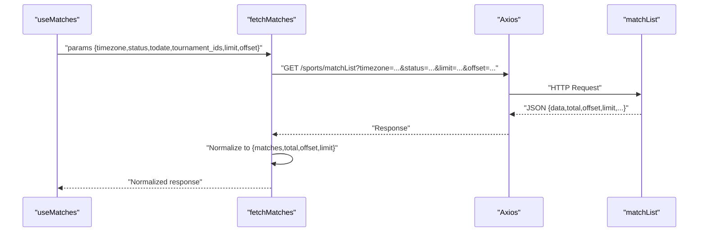
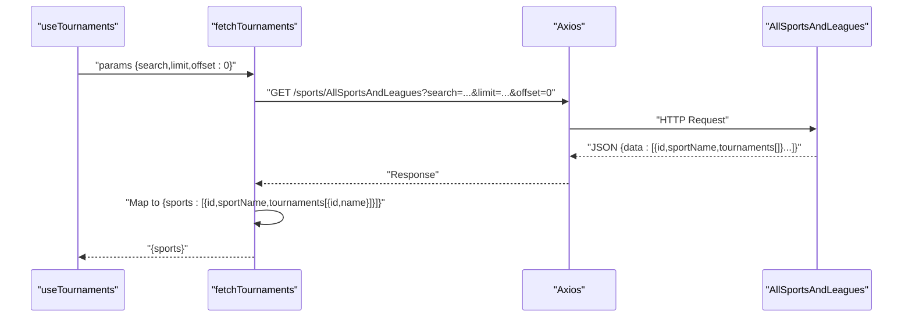
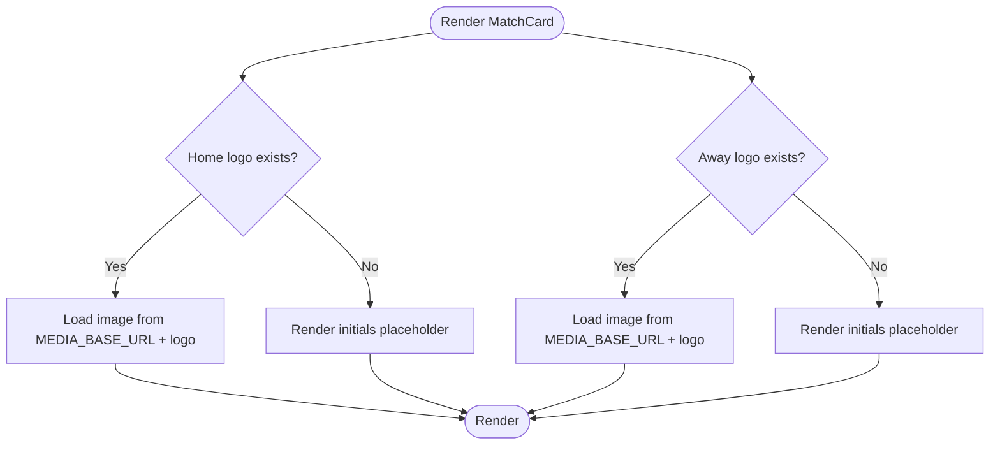
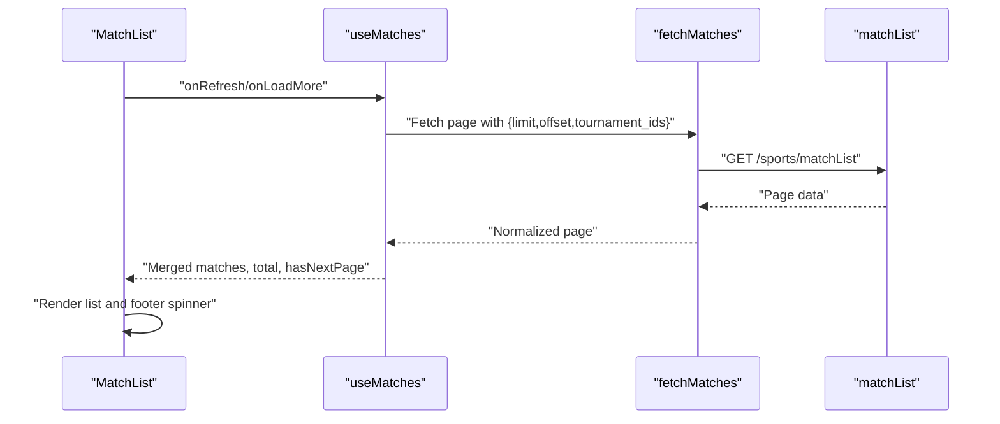
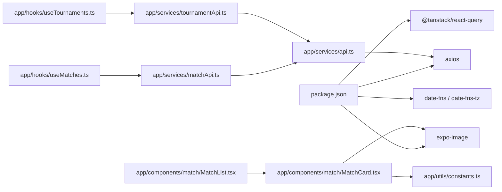

# API Integration

<cite>
**Referenced Files in This Document**
- [app/services/api.ts](file://app/services/api.ts)
- [app/services/matchApi.ts](file://app/services/matchApi.ts)
- [app/services/tournamentApi.ts](file://app/services/tournamentApi.ts)
- [app/hooks/useMatches.ts](file://app/hooks/useMatches.ts)
- [app/hooks/useTournaments.ts](file://app/hooks/useTournaments.ts)
- [app/types/api.ts](file://app/types/api.ts)
- [app/types/match.ts](file://app/types/match.ts)
- [app/types/tournament.ts](file://app/types/tournament.ts)
- [app/utils/constants.ts](file://app/utils/constants.ts)
- [app/utils/dateUtils.ts](file://app/utils/dateUtils.ts)
- [app/utils/formatters.ts](file://app/utils/formatters.ts)
- [app/components/match/MatchCard.tsx](file://app/components/match/MatchCard.tsx)
- [app/components/match/MatchList.tsx](file://app/components/match/MatchList.tsx)
- [app/context/FilterContext.tsx](file://app/context/FilterContext.tsx)
- [package.json](file://package.json)
</cite>

## Table of Contents
1. [Introduction](#introduction)
2. [Project Structure](#project-structure)
3. [Core Components](#core-components)
4. [Architecture Overview](#architecture-overview)
5. [Detailed Component Analysis](#detailed-component-analysis)
6. [Dependency Analysis](#dependency-analysis)
7. [Performance Considerations](#performance-considerations)
8. [Troubleshooting Guide](#troubleshooting-guide)
9. [Conclusion](#conclusion)
10. [Appendices](#appendices)

## Introduction
This document explains the API integration for the sports match application. It covers HTTP client configuration using Axios, request/response interceptors, and error handling. It details the match data service and tournament data service, including pagination and filtering parameters, data transformation patterns, and media service integration for team logos with fallback mechanisms. It also outlines endpoint specifications, request/response schemas, authentication considerations, rate limiting, caching strategies, and offline behavior.

## Project Structure
The API integration is organized around three main services:
- Shared HTTP client with interceptors
- Match data service for fetching match lists with pagination and filters
- Tournament data service for retrieving sports and tournaments metadata
- React Query hooks for caching and pagination
- Type definitions for requests, responses, and shared pagination models
- Media service integration for team logos with fallbacks

**Diagram sources**
- [app/services/api.ts](file://app/services/api.ts#L1-L40)
- [app/services/matchApi.ts](file://app/services/matchApi.ts#L1-L36)
- [app/services/tournamentApi.ts](file://app/services/tournamentApi.ts#L1-L35)
- [app/hooks/useMatches.ts](file://app/hooks/useMatches.ts#L1-L56)
- [app/hooks/useTournaments.ts](file://app/hooks/useTournaments.ts#L1-L45)
- [app/components/match/MatchList.tsx](file://app/components/match/MatchList.tsx#L1-L117)
- [app/components/match/MatchCard.tsx](file://app/components/match/MatchCard.tsx#L1-L142)
- [app/types/match.ts](file://app/types/match.ts#L1-L46)
- [app/types/tournament.ts](file://app/types/tournament.ts#L1-L31)
- [app/types/api.ts](file://app/types/api.ts#L1-L24)

**Section sources**
- [app/services/api.ts](file://app/services/api.ts#L1-L40)
- [app/services/matchApi.ts](file://app/services/matchApi.ts#L1-L36)
- [app/services/tournamentApi.ts](file://app/services/tournamentApi.ts#L1-L35)
- [app/hooks/useMatches.ts](file://app/hooks/useMatches.ts#L1-L56)
- [app/hooks/useTournaments.ts](file://app/hooks/useTournaments.ts#L1-L45)
- [app/types/match.ts](file://app/types/match.ts#L1-L46)
- [app/types/tournament.ts](file://app/types/tournament.ts#L1-L31)
- [app/types/api.ts](file://app/types/api.ts#L1-L24)
- [app/utils/constants.ts](file://app/utils/constants.ts#L1-L38)
- [app/components/match/MatchList.tsx](file://app/components/match/MatchList.tsx#L1-L117)
- [app/components/match/MatchCard.tsx](file://app/components/match/MatchCard.tsx#L1-L142)

## Core Components
- HTTP Client and Interceptors
  - Base URL and headers are configured globally.
  - Request interceptor currently passes requests unchanged.
  - Response interceptor normalizes errors, logs them, and rejects with structured error data.
- Match Data Service
  - Fetches match lists with timezone, optional status, todate, tournament_ids, limit, and offset.
  - Transforms raw data into a normalized shape with matches, total, offset, and limit.
- Tournament Data Service
  - Fetches sports and tournaments metadata with optional search, limit, and offset.
  - Transforms nested sport/tournament data into a simplified structure.
- React Query Hooks
  - Infinite query for paginated matches with stale/gc times.
  - Standard query for tournaments with search and caching.
- Types
  - Strongly typed request/response models for matches and tournaments.
  - Shared pagination interfaces and error model.

**Section sources**
- [app/services/api.ts](file://app/services/api.ts#L1-L40)
- [app/services/matchApi.ts](file://app/services/matchApi.ts#L1-L36)
- [app/services/tournamentApi.ts](file://app/services/tournamentApi.ts#L1-L35)
- [app/hooks/useMatches.ts](file://app/hooks/useMatches.ts#L1-L56)
- [app/hooks/useTournaments.ts](file://app/hooks/useTournaments.ts#L1-L45)
- [app/types/match.ts](file://app/types/match.ts#L1-L46)
- [app/types/tournament.ts](file://app/types/tournament.ts#L1-L31)
- [app/types/api.ts](file://app/types/api.ts#L1-L24)

## Architecture Overview
The application uses a layered architecture:
- HTTP client encapsulates transport and error handling.
- Services encapsulate endpoint-specific logic and data transformation.
- Hooks integrate with React Query for caching, pagination, and state.
- UI components consume normalized data and present it with fallbacks.

**Diagram sources**
- [app/services/matchApi.ts](file://app/services/matchApi.ts#L1-L36)
- [app/services/tournamentApi.ts](file://app/services/tournamentApi.ts#L1-L35)
- [app/services/api.ts](file://app/services/api.ts#L1-L40)
- [app/hooks/useMatches.ts](file://app/hooks/useMatches.ts#L1-L56)
- [app/hooks/useTournaments.ts](file://app/hooks/useTournaments.ts#L1-L45)

## Detailed Component Analysis

### HTTP Client and Interceptors
- Configuration
  - Base URL is set via a constant.
  - Timeout is configured.
  - Content-Type and Accept headers are standardized.
- Interceptors
  - Request: currently passthrough.
  - Response: extracts message/status/code, logs, and rejects with a normalized error object.

**Diagram sources**
- [app/services/api.ts](file://app/services/api.ts#L22-L37)

**Section sources**
- [app/services/api.ts](file://app/services/api.ts#L1-L40)
- [app/utils/constants.ts](file://app/utils/constants.ts#L1-L38)

### Match Data Service
- Endpoint
  - GET /sports/matchList
- Query Parameters
  - timezone (required)
  - status (optional)
  - todate (optional)
  - tournament_ids (optional)
  - limit (optional)
  - offset (optional)
- Response Transformation
  - Normalizes data to include matches[], total, offset, and limit.
  - Applies defaults for limit if missing.
- Pagination Behavior
  - Uses limit/offset for server-side pagination.
  - Hook computes next page param based on offset and limit.

**Diagram sources**
- [app/services/matchApi.ts](file://app/services/matchApi.ts#L4-L35)
- [app/hooks/useMatches.ts](file://app/hooks/useMatches.ts#L21-L41)
- [app/types/match.ts](file://app/types/match.ts#L31-L45)

**Section sources**
- [app/services/matchApi.ts](file://app/services/matchApi.ts#L1-L36)
- [app/hooks/useMatches.ts](file://app/hooks/useMatches.ts#L1-L56)
- [app/types/match.ts](file://app/types/match.ts#L1-L46)

### Tournament Data Service
- Endpoint
  - GET /sports/AllSportsAndLeagues
- Query Parameters
  - search (optional)
  - limit (optional)
  - offset (implicit 0 in hook)
- Response Transformation
  - Flattens nested sports/tournaments into a simplified array of sport objects with tournament arrays.
- Hook Behavior
  - Provides search, limit, and enable/disable controls.
  - Exposes a flattened list of tournaments enriched with sport metadata.

**Diagram sources**
- [app/services/tournamentApi.ts](file://app/services/tournamentApi.ts#L4-L34)
- [app/hooks/useTournaments.ts](file://app/hooks/useTournaments.ts#L14-L28)
- [app/types/tournament.ts](file://app/types/tournament.ts#L12-L20)

**Section sources**
- [app/services/tournamentApi.ts](file://app/services/tournamentApi.ts#L1-L35)
- [app/hooks/useTournaments.ts](file://app/hooks/useTournaments.ts#L1-L45)
- [app/types/tournament.ts](file://app/types/tournament.ts#L1-L31)

### Media Service Integration (Team Logos)
- Media Base URL
  - Used to construct absolute image URLs for team logos.
- Fallback Mechanism
  - If a logo URL is present, the UI renders an image.
  - If absent, a colored initials placeholder is shown derived from team name.
- UI Integration
  - Implemented in MatchCard to display home/away team logos with placeholders.

**Diagram sources**
- [app/components/match/MatchCard.tsx](file://app/components/match/MatchCard.tsx#L20-L70)
- [app/utils/constants.ts](file://app/utils/constants.ts#L2-L38)

**Section sources**
- [app/components/match/MatchCard.tsx](file://app/components/match/MatchCard.tsx#L1-L142)
- [app/utils/constants.ts](file://app/utils/constants.ts#L1-L38)

### UI Integration and Pagination
- MatchList
  - Renders a FlatList of MatchCard items.
  - Handles loading, empty, and error states.
  - Triggers load-more when nearing the end.
- Filtering
  - FilterContext manages selected tournament IDs and applies them to queries.
- Infinite Pagination
  - useMatches computes next page offsets and exposes total count and has-more flags.

**Diagram sources**
- [app/components/match/MatchList.tsx](file://app/components/match/MatchList.tsx#L83-L107)
- [app/hooks/useMatches.ts](file://app/hooks/useMatches.ts#L21-L41)
- [app/context/FilterContext.tsx](file://app/context/FilterContext.tsx#L26-L43)

**Section sources**
- [app/components/match/MatchList.tsx](file://app/components/match/MatchList.tsx#L1-L117)
- [app/context/FilterContext.tsx](file://app/context/FilterContext.tsx#L1-L72)
- [app/hooks/useMatches.ts](file://app/hooks/useMatches.ts#L1-L56)

## Dependency Analysis
- External Dependencies
  - axios for HTTP requests
  - @tanstack/react-query for caching and pagination
  - date-fns and date-fns-tz for time formatting and timezone conversions
  - expo-image for optimized image rendering
- Internal Dependencies
  - Services depend on the shared Axios client.
  - Hooks depend on services and expose normalized data to UI.
  - UI depends on types and constants for rendering and fallbacks.

**Diagram sources**
- [package.json](file://package.json#L13-L49)
- [app/services/api.ts](file://app/services/api.ts#L1-L40)
- [app/services/matchApi.ts](file://app/services/matchApi.ts#L1-L36)
- [app/services/tournamentApi.ts](file://app/services/tournamentApi.ts#L1-L35)
- [app/hooks/useMatches.ts](file://app/hooks/useMatches.ts#L1-L56)
- [app/hooks/useTournaments.ts](file://app/hooks/useTournaments.ts#L1-L45)
- [app/components/match/MatchCard.tsx](file://app/components/match/MatchCard.tsx#L1-L142)
- [app/components/match/MatchList.tsx](file://app/components/match/MatchList.tsx#L1-L117)
- [app/utils/constants.ts](file://app/utils/constants.ts#L1-L38)

**Section sources**
- [package.json](file://package.json#L13-L49)
- [app/services/api.ts](file://app/services/api.ts#L1-L40)
- [app/services/matchApi.ts](file://app/services/matchApi.ts#L1-L36)
- [app/services/tournamentApi.ts](file://app/services/tournamentApi.ts#L1-L35)
- [app/hooks/useMatches.ts](file://app/hooks/useMatches.ts#L1-L56)
- [app/hooks/useTournaments.ts](file://app/hooks/useTournaments.ts#L1-L45)
- [app/components/match/MatchCard.tsx](file://app/components/match/MatchCard.tsx#L1-L142)
- [app/components/match/MatchList.tsx](file://app/components/match/MatchList.tsx#L1-L117)
- [app/utils/constants.ts](file://app/utils/constants.ts#L1-L38)

## Performance Considerations
- Caching and Staleness
  - Matches: staleTime and gcTime configured in the infinite query to balance freshness and memory usage.
  - Tournaments: similar caching with longer stale times given static-like nature.
- Pagination
  - Server-side limit/offset reduces payload sizes and improves responsiveness.
- Image Loading
  - expo-image with placeholder and transitions improves perceived performance.
- Timezone Formatting
  - date-fns-tz ensures accurate local time rendering without heavy computations in render loops.

[No sources needed since this section provides general guidance]

## Troubleshooting Guide
- Error Handling
  - Centralized in the response interceptor; logs message, status, and URL; rejects with structured error.
  - UI surfaces errors via ErrorState and retry actions.
- Common Issues
  - Network failures: inspect interceptor logs and status codes.
  - Pagination gaps: verify limit/offset and total counts.
  - Missing logos: confirm MEDIA_BASE_URL and presence of logo paths.
- Debugging Approaches
  - Enable network logging in the development client.
  - Inspect React Query cache keys and data shapes.
  - Verify timezone and date formatting utilities.

**Section sources**
- [app/services/api.ts](file://app/services/api.ts#L22-L37)
- [app/components/match/MatchList.tsx](file://app/components/match/MatchList.tsx#L56-L61)
- [app/utils/dateUtils.ts](file://app/utils/dateUtils.ts#L1-L64)

## Conclusion
The API integration leverages a clean separation of concerns: a robust HTTP client with interceptors, strongly typed services and hooks, and a responsive UI with caching and fallbacks. Pagination and filtering are handled efficiently, while media loading is optimized. The architecture supports maintainability, testability, and scalability.

[No sources needed since this section summarizes without analyzing specific files]

## Appendices

### API Endpoints and Schemas

- Match List
  - Method: GET
  - Path: /sports/matchList
  - Query Parameters:
    - timezone: string (required)
    - status: string (optional)
    - todate: string (optional)
    - tournament_ids: string (optional, comma-separated)
    - limit: number (optional)
    - offset: number (optional)
  - Response Schema:
    - matches: array of Match
    - total: number
    - offset: number
    - limit: number

- Tournament Metadata
  - Method: GET
  - Path: /sports/AllSportsAndLeagues
  - Query Parameters:
    - search: string (optional)
    - limit: number (optional)
    - offset: number (implicit 0)
  - Response Schema:
    - sports: array of SportWithTournaments
      - id: number
      - sportName: string
      - tournaments: array of TournamentItem
        - id: number
        - name: string

**Section sources**
- [app/services/matchApi.ts](file://app/services/matchApi.ts#L4-L25)
- [app/services/tournamentApi.ts](file://app/services/tournamentApi.ts#L4-L18)
- [app/types/match.ts](file://app/types/match.ts#L31-L45)
- [app/types/tournament.ts](file://app/types/tournament.ts#L12-L20)

### Authentication and Rate Limiting
- Authentication
  - No explicit authentication headers are set in the HTTP client.
  - If required, add Authorization headers in the request interceptor.
- Rate Limiting
  - No client-side throttling is implemented.
  - Consider adding exponential backoff and retry policies in interceptors if backend enforces strict limits.

**Section sources**
- [app/services/api.ts](file://app/services/api.ts#L13-L20)

### Usage Patterns and Examples
- Fetch Matches with Pagination
  - Use useMatches with timezone, status, and pageSize.
  - Handle hasNextPage and isFetchingNextPage to trigger onLoadMore.
- Apply Filters
  - Use FilterContext to toggle and apply tournament filters; pass selected IDs to the matches hook.
- Retrieve Tournaments
  - Use useTournaments with search and limit; flatten and enrich tournaments as needed.

**Section sources**
- [app/hooks/useMatches.ts](file://app/hooks/useMatches.ts#L13-L55)
- [app/context/FilterContext.tsx](file://app/context/FilterContext.tsx#L26-L43)
- [app/hooks/useTournaments.ts](file://app/hooks/useTournaments.ts#L11-L44)

### Offline Behavior
- Current Implementation
  - No explicit offline storage or service worker is configured.
- Recommendations
  - Persist React Query data locally for offline reads.
  - Add a network status listener to disable prefetching when offline.
  - Consider background sync for future writes if applicable.

[No sources needed since this section provides general guidance]