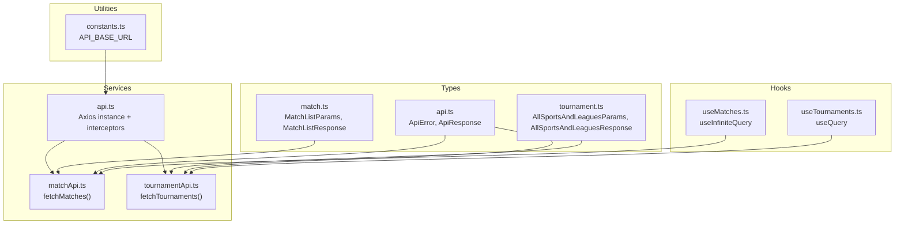
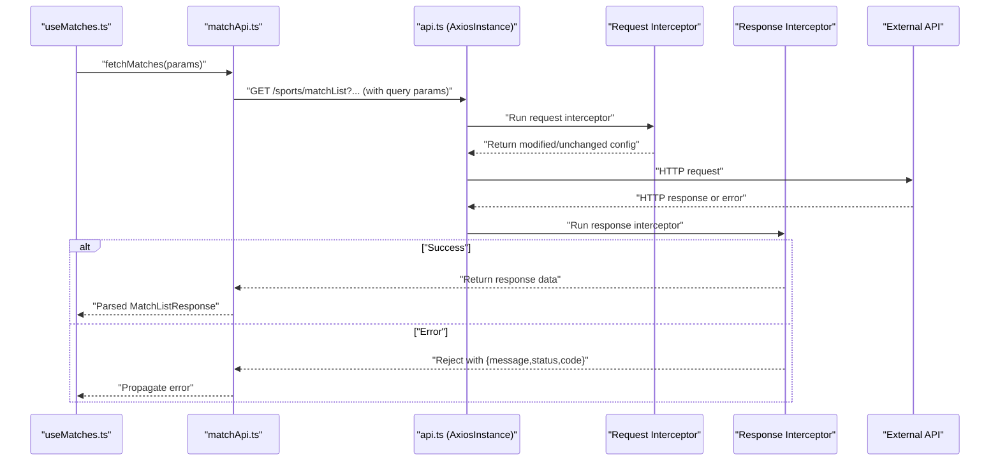
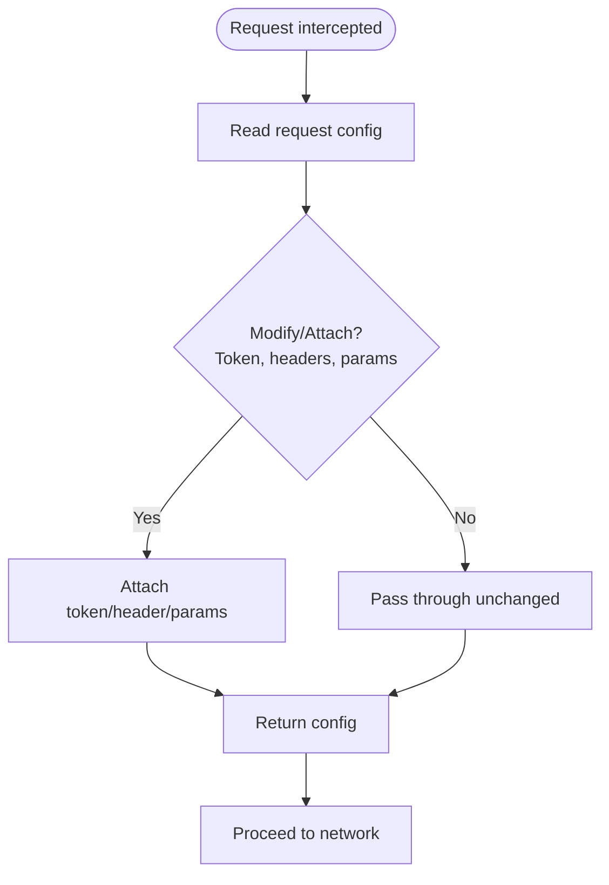
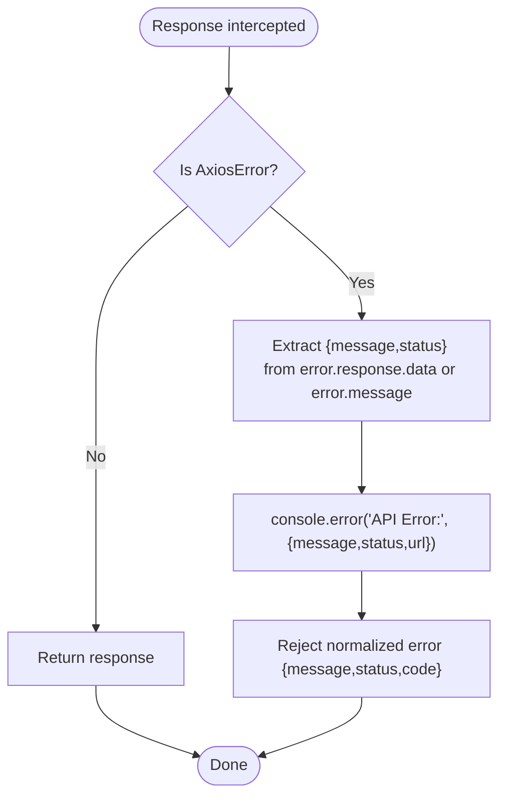
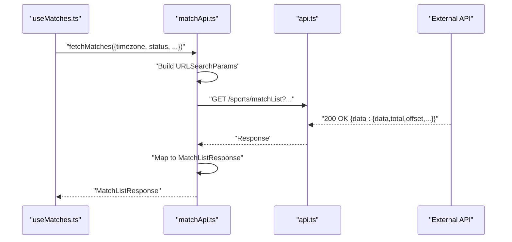
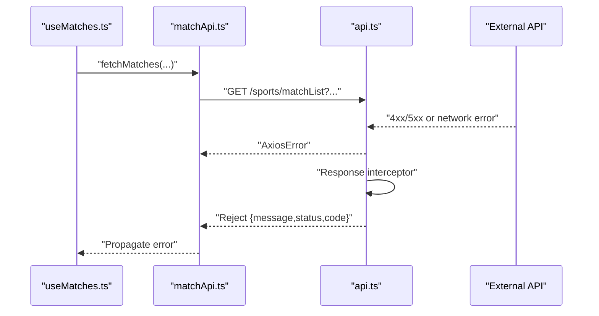
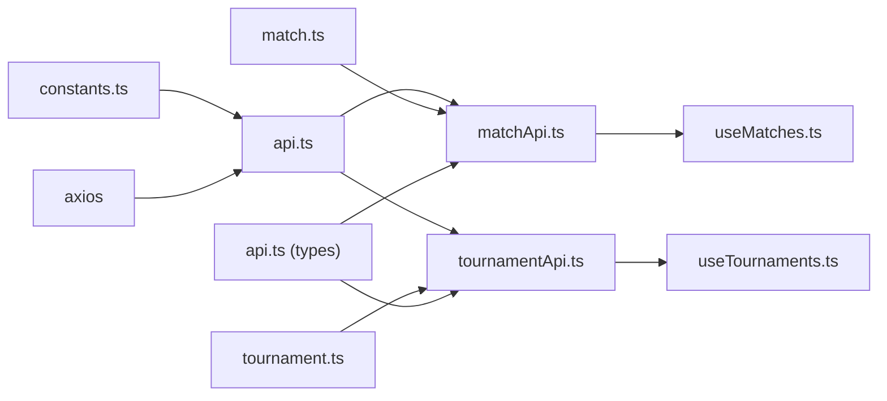

# HTTP Client Configuration

<cite>
**Referenced Files in This Document**
- [app/services/api.ts](file://app/services/api.ts)
- [app/utils/constants.ts](file://app/utils/constants.ts)
- [app/services/matchApi.ts](file://app/services/matchApi.ts)
- [app/services/tournamentApi.ts](file://app/services/tournamentApi.ts)
- [app/types/api.ts](file://app/types/api.ts)
- [app/types/match.ts](file://app/types/match.ts)
- [app/types/tournament.ts](file://app/types/tournament.ts)
- [app/hooks/useMatches.ts](file://app/hooks/useMatches.ts)
- [app/hooks/useTournaments.ts](file://app/hooks/useTournaments.ts)
- [app/_layout.tsx](file://app/_layout.tsx)
- [app/index.tsx](file://app/index.tsx)
</cite>

## Table of Contents
1. [Introduction](#introduction)
2. [Project Structure](#project-structure)
3. [Core Components](#core-components)
4. [Architecture Overview](#architecture-overview)
5. [Detailed Component Analysis](#detailed-component-analysis)
6. [Dependency Analysis](#dependency-analysis)
7. [Performance Considerations](#performance-considerations)
8. [Troubleshooting Guide](#troubleshooting-guide)
9. [Conclusion](#conclusion)

## Introduction
This document explains the HTTP client configuration built with Axios in the project. It covers base URL setup, timeout configuration, and header settings. It also documents the request and response interceptors, including how authentication tokens and pre-flight requests are handled, and how errors are centrally processed. Finally, it provides examples of successful request handling and error scenarios, along with best practices, debugging, and logging strategies for API communication.

## Project Structure
The HTTP client is encapsulated in a single Axios instance exported from the services layer. Supporting utilities define the base URL, while service modules consume the client to perform API calls. Hooks orchestrate data fetching via React Query, and types define the shape of API responses and errors.

**Diagram sources**
- [app/services/api.ts](file://app/services/api.ts#L1-L40)
- [app/utils/constants.ts](file://app/utils/constants.ts#L1-L5)
- [app/services/matchApi.ts](file://app/services/matchApi.ts#L1-L36)
- [app/services/tournamentApi.ts](file://app/services/tournamentApi.ts#L1-L35)
- [app/types/api.ts](file://app/types/api.ts#L1-L24)
- [app/types/match.ts](file://app/types/match.ts#L31-L46)
- [app/types/tournament.ts](file://app/types/tournament.ts#L12-L21)
- [app/hooks/useMatches.ts](file://app/hooks/useMatches.ts#L1-L56)
- [app/hooks/useTournaments.ts](file://app/hooks/useTournaments.ts#L1-L45)

**Section sources**
- [app/services/api.ts](file://app/services/api.ts#L1-L40)
- [app/utils/constants.ts](file://app/utils/constants.ts#L1-L5)
- [app/services/matchApi.ts](file://app/services/matchApi.ts#L1-L36)
- [app/services/tournamentApi.ts](file://app/services/tournamentApi.ts#L1-L35)
- [app/types/api.ts](file://app/types/api.ts#L1-L24)
- [app/types/match.ts](file://app/types/match.ts#L31-L46)
- [app/types/tournament.ts](file://app/types/tournament.ts#L12-L21)
- [app/hooks/useMatches.ts](file://app/hooks/useMatches.ts#L1-L56)
- [app/hooks/useTournaments.ts](file://app/hooks/useTournaments.ts#L1-L45)

## Core Components
- Axios instance creation and configuration:
  - Base URL is configured from a constant.
  - Timeout is set to a fixed value.
  - Default headers include Content-Type and Accept for JSON.
- Interceptors:
  - Request interceptor currently passes the config through unchanged.
  - Response interceptor centralizes error handling, extracting status, message, and URL, and logs to the console.

**Section sources**
- [app/services/api.ts](file://app/services/api.ts#L4-L11)
- [app/services/api.ts](file://app/services/api.ts#L13-L20)
- [app/services/api.ts](file://app/services/api.ts#L22-L37)
- [app/utils/constants.ts](file://app/utils/constants.ts#L1-L2)

## Architecture Overview
The application composes an Axios instance with shared configuration and interceptors. Service modules call this instance to perform GET requests. Hooks integrate with React Query to manage caching, pagination, and retries. Types define the contract for request parameters and response shapes.

**Diagram sources**
- [app/hooks/useMatches.ts](file://app/hooks/useMatches.ts#L21-L33)
- [app/services/matchApi.ts](file://app/services/matchApi.ts#L4-L35)
- [app/services/api.ts](file://app/services/api.ts#L13-L37)

## Detailed Component Analysis

### Axios Instance Creation and Configuration
- Base URL:
  - Defined centrally and injected into the Axios instance.
- Timeout:
  - Set to a fixed duration suitable for mobile environments.
- Headers:
  - JSON content type and accept headers are standardized.

Best practices:
- Keep base URL configurable via environment variables for different environments.
- Centralize header defaults to enforce content negotiation consistently.
- Consider adding a retry policy at the instance level or via React Query for transient failures.

**Section sources**
- [app/services/api.ts](file://app/services/api.ts#L4-L11)
- [app/utils/constants.ts](file://app/utils/constants.ts#L1-L2)

### Request Interceptor
Current behavior:
- The interceptor receives the request config and returns it unchanged.
- Any synchronous error thrown is forwarded to the response interceptor chain.

Recommended enhancements:
- Add authentication token injection by reading from secure storage or context.
- Normalize URLs and append default query parameters if needed.
- Implement pre-flight handling by setting credentials and exposing headers as required.

**Diagram sources**
- [app/services/api.ts](file://app/services/api.ts#L13-L20)

**Section sources**
- [app/services/api.ts](file://app/services/api.ts#L13-L20)

### Response Interceptor
Current behavior:
- On success, the response is returned as-is.
- On error:
  - Extracts message from response data if present, otherwise falls back to the error message or a default.
  - Captures status code and URL from the failed request config.
  - Logs an error object containing message, status, and URL.
  - Rejects a normalized error payload with message, status, and code.

**Diagram sources**
- [app/services/api.ts](file://app/services/api.ts#L22-L37)

**Section sources**
- [app/services/api.ts](file://app/services/api.ts#L22-L37)

### Service Layer Usage Examples

#### Successful Request Handling
- Matches endpoint:
  - Builds query parameters from input, performs a GET request, and maps the response to a typed structure.
- Tournaments endpoint:
  - Constructs a query string, performs a GET request, and transforms nested data into a flat structure.

**Diagram sources**
- [app/hooks/useMatches.ts](file://app/hooks/useMatches.ts#L21-L33)
- [app/services/matchApi.ts](file://app/services/matchApi.ts#L4-L35)

**Section sources**
- [app/services/matchApi.ts](file://app/services/matchApi.ts#L4-L35)
- [app/services/tournamentApi.ts](file://app/services/tournamentApi.ts#L4-L35)
- [app/hooks/useMatches.ts](file://app/hooks/useMatches.ts#L21-L33)
- [app/hooks/useTournaments.ts](file://app/hooks/useTournaments.ts#L14-L28)

#### Error Scenarios
- Network error or server error:
  - The response interceptor extracts the message and status, logs the error, and rejects a normalized error object.
- Client-side error in interceptor:
  - Any thrown error in the request interceptor is forwarded to the response interceptor chain.

**Diagram sources**
- [app/services/api.ts](file://app/services/api.ts#L22-L37)
- [app/services/matchApi.ts](file://app/services/matchApi.ts#L25-L27)

**Section sources**
- [app/services/api.ts](file://app/services/api.ts#L22-L37)

### Type Contracts
- ApiError and ApiResponse define a consistent error envelope and data wrapper.
- MatchListParams and MatchListResponse describe the shape of match listings.
- AllSportsAndLeaguesParams and AllSportsAndLeaguesResponse describe the shape of tournaments data.

These types guide service functions to return strongly-typed results and help consumers handle success and error states predictably.

**Section sources**
- [app/types/api.ts](file://app/types/api.ts#L1-L24)
- [app/types/match.ts](file://app/types/match.ts#L31-L46)
- [app/types/tournament.ts](file://app/types/tournament.ts#L12-L21)

## Dependency Analysis
- api.ts depends on:
  - constants.ts for the base URL.
  - axios for the instance and error typing.
- matchApi.ts and tournamentApi.ts depend on:
  - api.ts for the HTTP client.
  - Their respective type definitions for parameters and responses.
- Hooks depend on:
  - Services for data retrieval.
  - React Query for caching and pagination.

**Diagram sources**
- [app/utils/constants.ts](file://app/utils/constants.ts#L1-L2)
- [app/services/api.ts](file://app/services/api.ts#L1-L11)
- [app/services/matchApi.ts](file://app/services/matchApi.ts#L1-L2)
- [app/services/tournamentApi.ts](file://app/services/tournamentApi.ts#L1-L2)
- [app/types/match.ts](file://app/types/match.ts#L31-L46)
- [app/types/tournament.ts](file://app/types/tournament.ts#L12-L21)
- [app/types/api.ts](file://app/types/api.ts#L1-L24)
- [app/hooks/useMatches.ts](file://app/hooks/useMatches.ts#L1-L3)
- [app/hooks/useTournaments.ts](file://app/hooks/useTournaments.ts#L1-L3)

**Section sources**
- [app/services/api.ts](file://app/services/api.ts#L1-L11)
- [app/services/matchApi.ts](file://app/services/matchApi.ts#L1-L2)
- [app/services/tournamentApi.ts](file://app/services/tournamentApi.ts#L1-L2)
- [app/utils/constants.ts](file://app/utils/constants.ts#L1-L2)
- [app/types/match.ts](file://app/types/match.ts#L31-L46)
- [app/types/tournament.ts](file://app/types/tournament.ts#L12-L21)
- [app/types/api.ts](file://app/types/api.ts#L1-L24)
- [app/hooks/useMatches.ts](file://app/hooks/useMatches.ts#L1-L3)
- [app/hooks/useTournaments.ts](file://app/hooks/useTournaments.ts#L1-L3)

## Performance Considerations
- Timeout:
  - The fixed timeout should be tuned for network conditions and user experience expectations.
- Retry and caching:
  - React Query manages retries and caching; configure defaultOptions appropriately to balance freshness and performance.
- Pagination:
  - Infinite scrolling uses offset/limit; ensure backend supports efficient pagination and consider cursor-based pagination for large datasets.
- Logging:
  - Centralized logging in the response interceptor helps identify slow endpoints and frequent errors.

[No sources needed since this section provides general guidance]

## Troubleshooting Guide
- Enable request/response logging:
  - Temporarily log the request config and response in interceptors to inspect headers, body, and URL.
- Inspect error payloads:
  - The response interceptor logs message, status, and URL; use this to correlate with backend logs.
- Verify base URL and environment:
  - Confirm the base URL matches the target environment.
- Token handling:
  - If authentication is required, implement token injection in the request interceptor and refresh logic as needed.

**Section sources**
- [app/services/api.ts](file://app/services/api.ts#L22-L37)

## Conclusion
The project’s HTTP client is a focused Axios instance with centralized configuration and interceptors. The request interceptor is ready for authentication and pre-flight enhancements, while the response interceptor provides robust, centralized error handling. Services consume the client to deliver typed responses, and hooks integrate with React Query for efficient data fetching. By extending the request interceptor with token management and adopting environment-specific base URLs, the client can be hardened for production use.