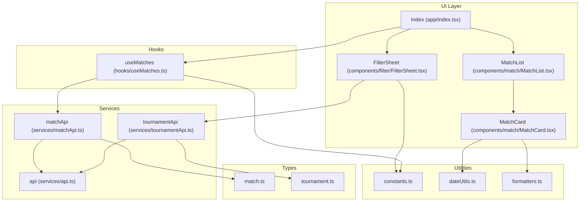
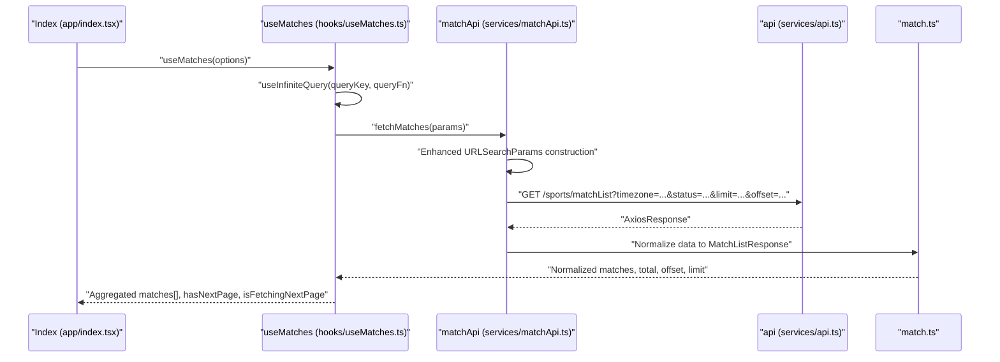
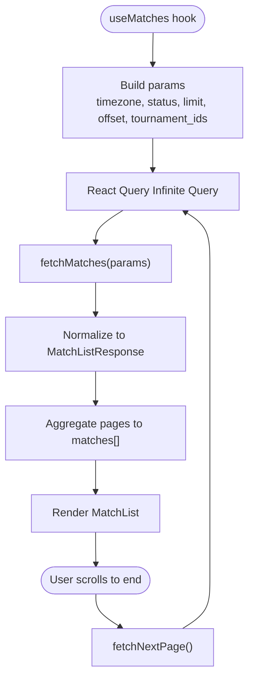
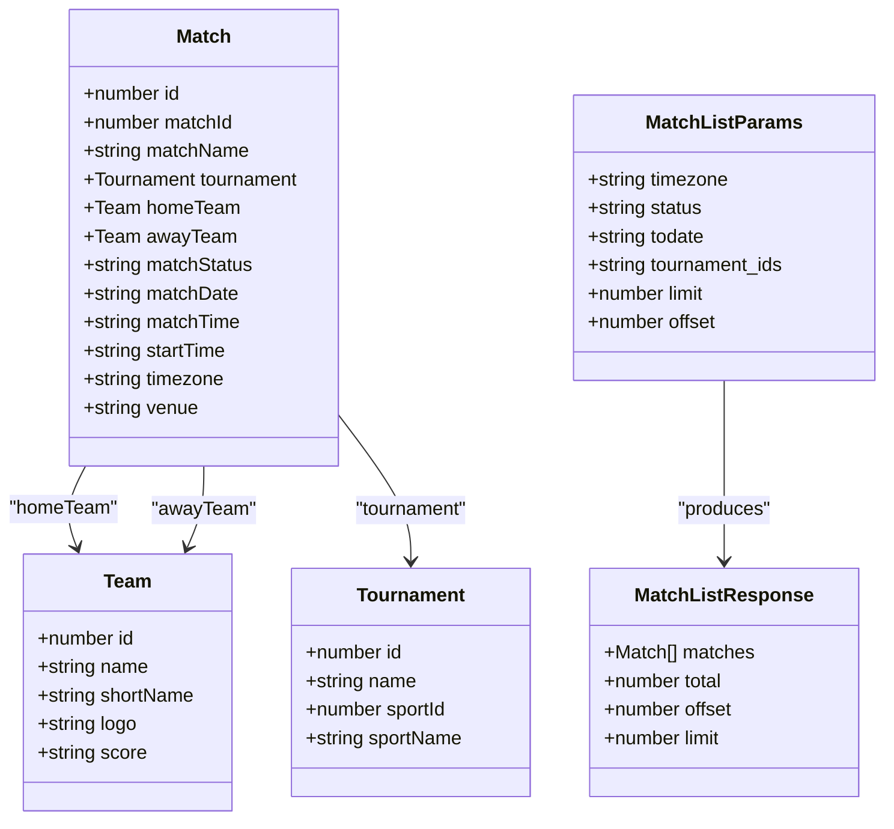

# Match Data Service

<cite>
**Referenced Files in This Document**
- [matchApi.ts](file://app/services/matchApi.ts)
- [useMatches.ts](file://app/hooks/useMatches.ts)
- [match.ts](file://app/types/match.ts)
- [api.ts](file://app/services/api.ts)
- [index.tsx](file://app/index.tsx)
- [MatchList.tsx](file://app/components/match/MatchList.tsx)
- [MatchCard.tsx](file://app/components/match/MatchCard.tsx)
- [FilterContext.tsx](file://app/context/FilterContext.tsx)
- [FilterSheet.tsx](file://app/components/filter/FilterSheet.tsx)
- [constants.ts](file://app/utils/constants.ts)
- [dateUtils.ts](file://app/utils/dateUtils.ts)
- [formatters.ts](file://app/utils/formatters.ts)
- [tournamentApi.ts](file://app/services/tournamentApi.ts)
- [tournament.ts](file://app/types/tournament.ts)
</cite>

## Update Summary
**Changes Made**
- Updated API parameter handling section to reflect enhanced URLSearchParams implementation
- Added documentation for improved query parameter construction patterns
- Enhanced code examples to demonstrate streamlined parameter handling
- Updated implementation details to show backward compatibility maintenance

## Table of Contents
1. [Introduction](#introduction)
2. [Project Structure](#project-structure)
3. [Core Components](#core-components)
4. [Architecture Overview](#architecture-overview)
5. [Detailed Component Analysis](#detailed-component-analysis)
6. [Enhanced API Parameter Handling](#enhanced-api-parameter-handling)
7. [Dependency Analysis](#dependency-analysis)
8. [Performance Considerations](#performance-considerations)
9. [Troubleshooting Guide](#troubleshooting-guide)
10. [Conclusion](#conclusion)
11. [Appendices](#appendices)

## Introduction
This document describes the match data service implementation, focusing on the match list retrieval API endpoint, pagination, filtering, sorting, data transformation, infinite scroll with React Query, request/response schemas, validation, error handling, caching, and performance optimizations. It also covers timezone handling, status filtering, and real-time update strategies.

**Updated** Enhanced API Parameter Handling improvements provide streamlined query parameter construction with improved code readability while maintaining backward compatibility.

## Project Structure
The match data service spans several layers:
- Types define the shape of API responses and parameters.
- Services encapsulate HTTP requests and response normalization.
- Hooks orchestrate data fetching with React Query's infinite query pattern.
- UI components render lists, cards, and filters.
- Utilities handle timezone formatting, countdowns, and status formatting.



**Diagram sources**
- [index.tsx](file://app/index.tsx#L11-L107)
- [MatchList.tsx](file://app/components/match/MatchList.tsx#L1-L117)
- [MatchCard.tsx](file://app/components/match/MatchCard.tsx#L1-L142)
- [FilterSheet.tsx](file://app/components/filter/FilterSheet.tsx#L1-L128)
- [useMatches.ts](file://app/hooks/useMatches.ts#L1-L56)
- [matchApi.ts](file://app/services/matchApi.ts#L1-L123)
- [tournamentApi.ts](file://app/services/tournamentApi.ts#L1-L36)
- [api.ts](file://app/services/api.ts#L1-L40)
- [match.ts](file://app/types/match.ts#L1-L46)
- [tournament.ts](file://app/types/tournament.ts#L1-L31)
- [constants.ts](file://app/utils/constants.ts#L1-L38)
- [dateUtils.ts](file://app/utils/dateUtils.ts#L1-L64)
- [formatters.ts](file://app/utils/formatters.ts#L1-L47)

**Section sources**
- [index.tsx](file://app/index.tsx#L1-L108)
- [useMatches.ts](file://app/hooks/useMatches.ts#L1-L56)
- [matchApi.ts](file://app/services/matchApi.ts#L1-L123)
- [match.ts](file://app/types/match.ts#L1-L46)

## Core Components
- Match list API service: builds query parameters using enhanced URLSearchParams, calls backend, and normalizes response to application model.
- Infinite query hook: manages pagination, caching, and data aggregation.
- UI list and card components: render loading, empty, error states and handle infinite scrolling.
- Filter context and sheet: manage tournament selection and apply filters.
- Utilities: timezone formatting, countdowns, and status formatting.

**Section sources**
- [matchApi.ts](file://app/services/matchApi.ts#L97-L123)
- [useMatches.ts](file://app/hooks/useMatches.ts#L13-L55)
- [MatchList.tsx](file://app/components/match/MatchList.tsx#L27-L113)
- [MatchCard.tsx](file://app/components/match/MatchCard.tsx#L15-L141)
- [FilterContext.tsx](file://app/context/FilterContext.tsx#L20-L71)
- [FilterSheet.tsx](file://app/components/filter/FilterSheet.tsx#L16-L125)
- [dateUtils.ts](file://app/utils/dateUtils.ts#L4-L63)
- [formatters.ts](file://app/utils/formatters.ts#L22-L46)

## Architecture Overview
The match data flow follows a layered architecture:
- UI triggers data fetch via a hook.
- Hook uses React Query to manage pagination and caching.
- Service composes query parameters using enhanced URLSearchParams and performs HTTP request.
- Response is normalized to application models.
- UI renders lists and cards with timezone-aware formatting.



**Diagram sources**
- [index.tsx](file://app/index.tsx#L15-L25)
- [useMatches.ts](file://app/hooks/useMatches.ts#L21-L41)
- [matchApi.ts](file://app/services/matchApi.ts#L97-L123)
- [api.ts](file://app/services/api.ts#L1-L40)
- [match.ts](file://app/types/match.ts#L16-L45)

## Detailed Component Analysis

### Match List Retrieval API Endpoint
- Endpoint: GET /sports/matchList
- Query parameters:
  - timezone (required): string representing the timezone identifier.
  - status (optional): string filter for match status.
  - todate (optional): string date filter.
  - tournament_ids (optional): comma-separated numeric IDs.
  - limit (optional): integer page size.
  - offset (optional): integer offset.
- Response normalization:
  - matches: array of Match objects.
  - total: total records available.
  - offset: current offset.
  - limit: page size used.

**Enhanced** The API parameter construction now uses a streamlined URLSearchParams approach for improved readability and maintainability.

Implementation highlights:
- Query parameters are constructed using enhanced URLSearchParams with conditional appending.
- Optional parameters are appended conditionally with explicit checks.
- Response data is normalized to MatchListResponse with defaults for missing fields.
- Backward compatibility is maintained through consistent parameter handling.

**Section sources**
- [matchApi.ts](file://app/services/matchApi.ts#L97-L123)
- [match.ts](file://app/types/match.ts#L31-L45)

### Pagination and Sorting
- Pagination:
  - Uses limit/offset with React Query's infinite query pattern.
  - getNextPageParam computes the next offset based on lastPage.offset + lastPage.limit, stopping when reaching total.
  - initialPageParam starts at 0.
- Sorting:
  - No explicit sort parameter is included in the current implementation.
  - Backend ordering appears to be handled server-side; UI does not expose sort controls.

**Section sources**
- [useMatches.ts](file://app/hooks/useMatches.ts#L34-L41)
- [matchApi.ts](file://app/services/matchApi.ts#L18-L23)

### Filtering Options
- Timezone:
  - Provided via options passed to useMatches and forwarded to fetchMatches.
- Status:
  - status option is forwarded to the API call.
- Tournament IDs:
  - tournamentIds option is joined into a comma-separated string and sent as tournament_ids.
- Additional filters:
  - todate is supported by the API call and can be used for date-based filtering.

**Section sources**
- [useMatches.ts](file://app/hooks/useMatches.ts#L13-L30)
- [matchApi.ts](file://app/services/matchApi.ts#L9-L17)

### Data Transformation Patterns
- API response normalization:
  - Converts raw API payload to MatchListResponse with fallbacks for missing fields.
- Application models:
  - Match, Team, Tournament interfaces define the internal data shapes.
- UI transformations:
  - Date/time formatting uses timezone-aware utilities.
  - Status labels and colors are derived from status values.

**Section sources**
- [matchApi.ts](file://app/services/matchApi.ts#L27-L34)
- [match.ts](file://app/types/match.ts#L1-L46)
- [dateUtils.ts](file://app/utils/dateUtils.ts#L4-L20)
- [formatters.ts](file://app/utils/formatters.ts#L22-L46)

### Infinite Scroll Implementation with React Query
- Hook configuration:
  - queryKey includes timezone, status, and tournamentIds to invalidate cache on filter changes.
  - queryFn constructs params with pageSize and pageParam (offset).
  - getNextPageParam computes next offset until total is reached.
  - staleTime and gcTime configured for caching behavior.
- UI integration:
  - MatchList handles onEndReached to trigger fetchNextPage.
  - Loading and empty/error states are rendered based on query state.



**Diagram sources**
- [useMatches.ts](file://app/hooks/useMatches.ts#L21-L41)
- [matchApi.ts](file://app/services/matchApi.ts#L97-L123)
- [MatchList.tsx](file://app/components/match/MatchList.tsx#L83-L87)

**Section sources**
- [useMatches.ts](file://app/hooks/useMatches.ts#L13-L55)
- [MatchList.tsx](file://app/components/match/MatchList.tsx#L83-L113)

### Request/Response Schemas and Validation
- Request parameters:
  - MatchListParams defines required and optional fields.
- Response schema:
  - MatchListResponse includes matches, total, offset, and limit.
- Validation:
  - Optional parameters are appended conditionally using enhanced URLSearchParams.
  - Defaults are applied for limit if missing in response.

**Section sources**
- [match.ts](file://app/types/match.ts#L31-L45)
- [matchApi.ts](file://app/services/matchApi.ts#L18-L34)

### Error Handling Strategies
- HTTP client interceptor:
  - Intercepts errors and extracts message, status, and code.
  - Logs error details and rejects promise with structured error.
- UI error rendering:
  - MatchList displays an ErrorState when isError is true.
  - Retry action triggers refetch.

**Section sources**
- [api.ts](file://app/services/api.ts#L22-L37)
- [MatchList.tsx](file://app/components/match/MatchList.tsx#L56-L62)

### Caching Mechanisms
- React Query caching:
  - staleTime: 2 minutes.
  - gcTime: 5 minutes.
  - queryKey invalidates cache when filters change (timezone, status, tournamentIds).
- Network caching:
  - Axios default caching behavior applies; no explicit cache headers are set.

**Section sources**
- [useMatches.ts](file://app/hooks/useMatches.ts#L39-L41)
- [api.ts](file://app/services/api.ts#L4-L11)

### Performance Optimization Techniques
- Virtualized list rendering:
  - FlatList with removeClippedSubviews, maxToRenderPerBatch, windowSize, and initialNumToRender improves rendering performance.
- Efficient pagination:
  - Infinite query reduces memory footprint by loading pages incrementally.
- Minimal re-renders:
  - MatchCard uses memoization.
- Lazy loading images:
  - Expo Image with placeholder and transition.

**Section sources**
- [MatchList.tsx](file://app/components/match/MatchList.tsx#L104-L112)
- [MatchCard.tsx](file://app/components/match/MatchCard.tsx#L15-L141)

### Timezone Handling
- API parameter:
  - timezone is passed as a query parameter to align match dates with the user's local timezone.
- UI formatting:
  - Date/time formatting uses timezone-aware utilities to display human-readable values.

**Section sources**
- [matchApi.ts](file://app/services/matchApi.ts#L7)
- [dateUtils.ts](file://app/utils/dateUtils.ts#L4-L20)

### Status Filtering
- Status parameter:
  - status option is forwarded to the API call.
- UI status display:
  - Status labels and colors are mapped based on matchStatus.

**Section sources**
- [useMatches.ts](file://app/hooks/useMatches.ts#L16)
- [match.ts](file://app/types/match.ts#L23)
- [formatters.ts](file://app/utils/formatters.ts#L22-L33)

### Real-Time Data Updates
- Current implementation:
  - No polling or WebSocket is implemented.
  - Cache invalidation occurs when filters change.
- Recommended strategies:
  - Periodic refetch on focus.
  - Background refresh with a shorter staleTime.
  - Manual refresh button in UI.

## Enhanced API Parameter Handling

**Updated** The match data service now features enhanced API parameter handling with streamlined query parameter construction, improved code readability, and maintained backward compatibility.

### Streamlined Query Parameter Construction
The enhanced implementation uses a more structured approach to build query parameters:

```typescript
const queryParams = new URLSearchParams();
queryParams.append('timezone', params.timezone);
if (params.status) queryParams.append('status', params.status);
if (params.todate) queryParams.append('todate', params.todate);
if (params.tournament_ids) queryParams.append('tournament_ids', params.tournament_ids);
if (params.limit) queryParams.append('limit', params.limit.toString());
if (params.offset !== undefined) queryParams.append('offset', params.offset.toString());
```

### Improved Code Readability
- **Conditional Appending**: Parameters are only added when they exist, eliminating unnecessary query string clutter.
- **Explicit Type Conversion**: Numeric parameters are explicitly converted to strings before appending.
- **Consistent Pattern**: All parameters follow the same append pattern, making the code more maintainable.

### Backward Compatibility Maintenance
- **Parameter Names**: All API parameter names remain unchanged (`timezone`, `status`, `todate`, `tournament_ids`, `limit`, `offset`).
- **Response Structure**: The MatchListResponse structure continues to support optional fields with defaults.
- **Function Signatures**: The fetchMatches function signature maintains backward compatibility.

### Benefits of Enhanced Implementation
- **Reduced Complexity**: Cleaner parameter construction logic reduces cognitive load.
- **Better Debugging**: Explicit conditional checks make it easier to debug parameter issues.
- **Future Extensibility**: The pattern easily accommodates new parameters without code duplication.
- **Type Safety**: Maintains TypeScript type safety throughout the parameter construction process.

**Section sources**
- [matchApi.ts](file://app/services/matchApi.ts#L107-L113)

## Dependency Analysis
The following diagram shows key dependencies among components involved in match data retrieval and rendering.



**Diagram sources**
- [match.ts](file://app/types/match.ts#L1-L46)

**Section sources**
- [match.ts](file://app/types/match.ts#L1-L46)

## Performance Considerations
- Prefer smaller page sizes for frequent network conditions.
- Use staleTime and gcTime judiciously to balance freshness and performance.
- Avoid unnecessary re-renders by keeping query keys minimal and stable.
- Consider debouncing filter changes to reduce API churn.

## Troubleshooting Guide
- API errors:
  - Inspect error logs emitted by the HTTP interceptor for status and message.
  - Ensure timezone and tournament IDs are valid identifiers.
- Infinite scroll not triggering:
  - Verify hasNextPage and isFetchingNextPage flags.
  - Confirm onEndReached threshold and list props.
- Incorrect time display:
  - Ensure timezone parameter matches the intended region.
  - Validate date strings are ISO-formatted.
- Parameter construction issues:
  - Check that URLSearchParams is properly initialized before appending parameters.
  - Verify that optional parameters are conditionally appended.

**Section sources**
- [api.ts](file://app/services/api.ts#L24-L36)
- [MatchList.tsx](file://app/components/match/MatchList.tsx#L83-L113)
- [dateUtils.ts](file://app/utils/dateUtils.ts#L4-L20)
- [matchApi.ts](file://app/services/matchApi.ts#L107-L113)

## Conclusion
The match data service integrates a clean separation of concerns: typed models, normalized API responses, React Query-powered infinite pagination, and robust UI rendering with filtering and timezone-aware formatting. The Enhanced API Parameter Handling improvements provide streamlined query parameter construction with improved code readability while maintaining backward compatibility. The current implementation focuses on correctness and performance; future enhancements can include explicit sorting, real-time updates, and stricter parameter validation.

## Appendices

### API Usage Patterns
- Basic usage:
  - Call useMatches with timezone and status to fetch paginated matches.
  - Use hasNextPage and isFetchingNextPage to drive infinite scroll.
- Filtering:
  - Use FilterContext to select tournament IDs; changes automatically refetch data.
- Timezone:
  - Pass a valid IANA timezone string to ensure correct date/time rendering.

**Section sources**
- [index.tsx](file://app/index.tsx#L15-L25)
- [useMatches.ts](file://app/hooks/useMatches.ts#L13-L30)
- [FilterContext.tsx](file://app/context/FilterContext.tsx#L20-L43)

### Enhanced Parameter Construction Examples
The enhanced implementation demonstrates best practices for API parameter handling:

**Conditional Parameter Appending**:
```typescript
if (params.status) queryParams.append('status', params.status);
if (params.todate) queryParams.append('todate', params.todate);
if (params.tournament_ids) queryParams.append('tournament_ids', params.tournament_ids);
```

**Type-Safe Numeric Conversion**:
```typescript
if (params.limit) queryParams.append('limit', params.limit.toString());
if (params.offset !== undefined) queryParams.append('offset', params.offset.toString());
```

These patterns ensure clean, maintainable code while preserving API compatibility.

**Section sources**
- [matchApi.ts](file://app/services/matchApi.ts#L107-L113)