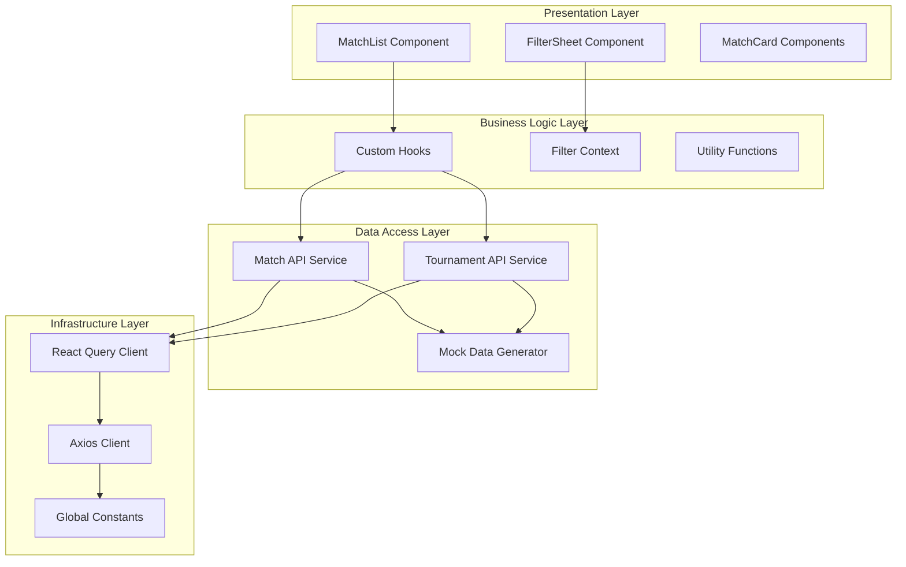
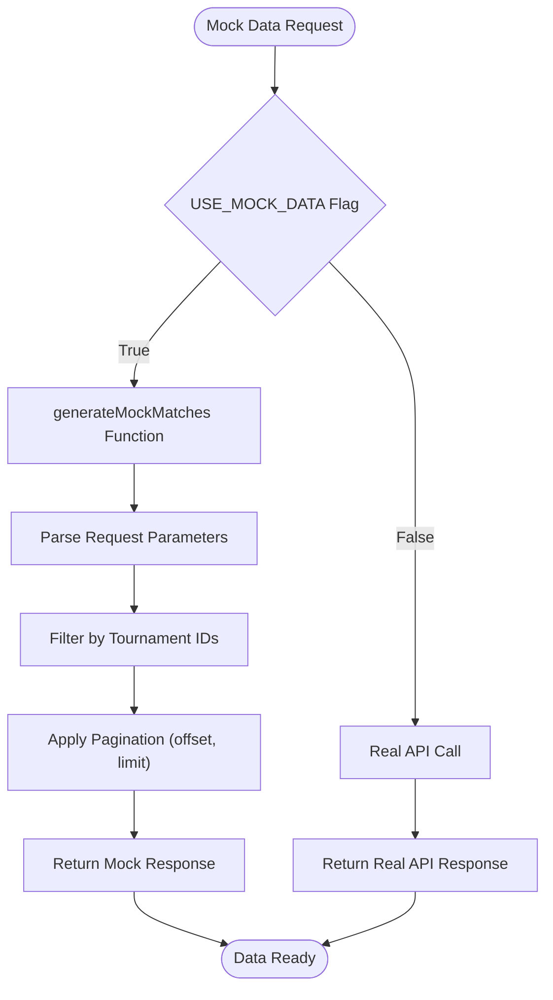
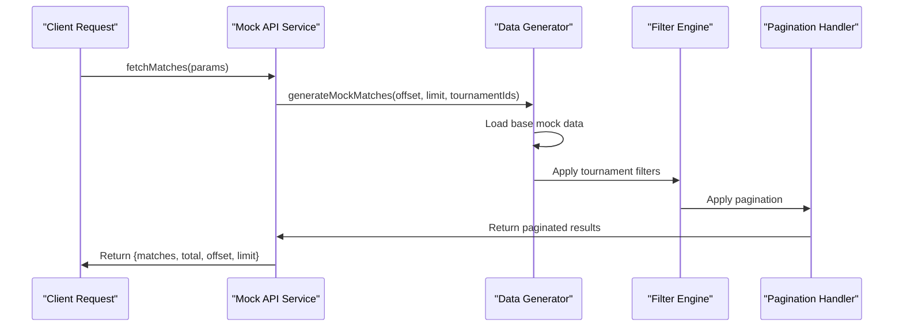
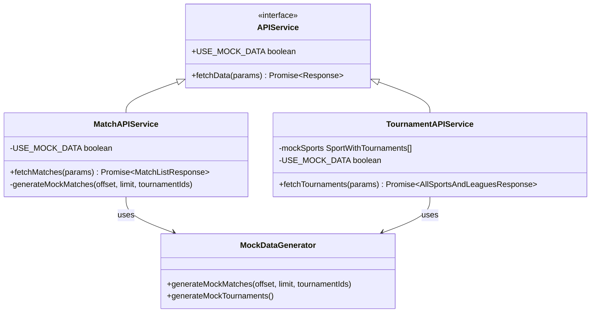
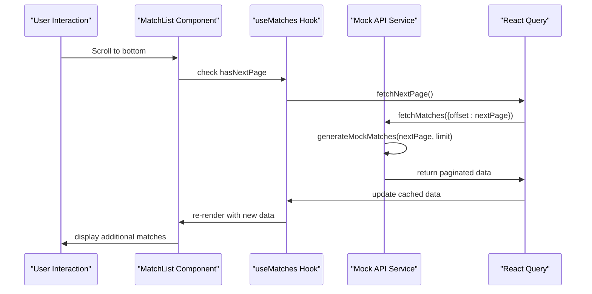
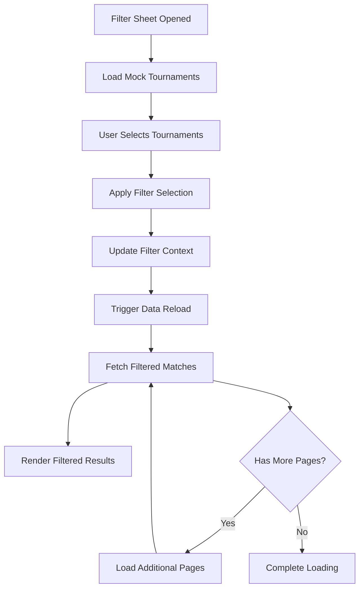
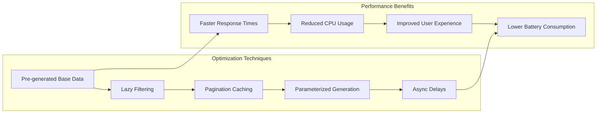
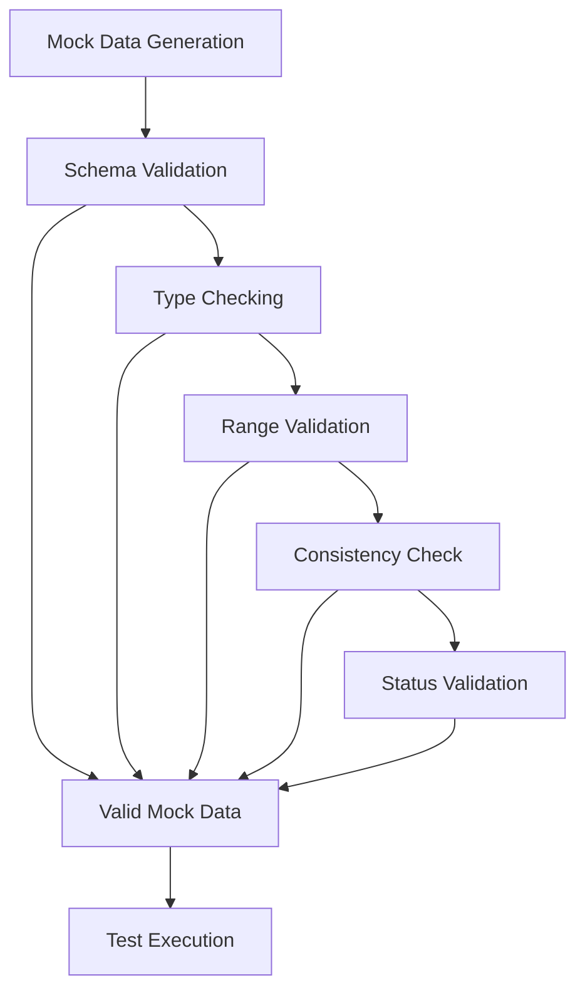
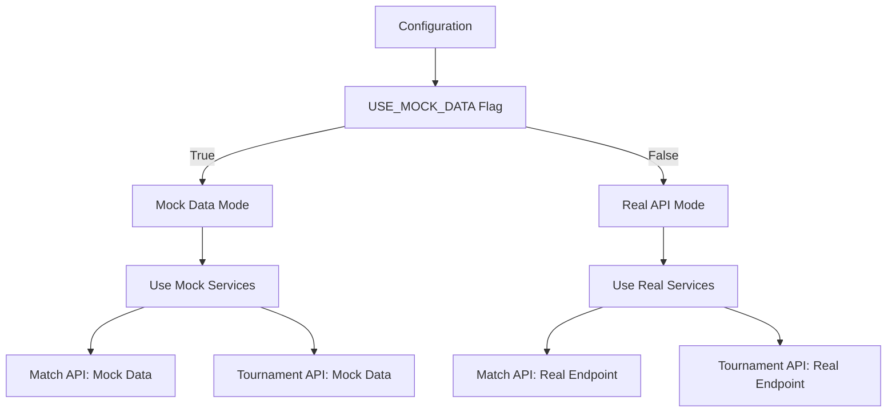
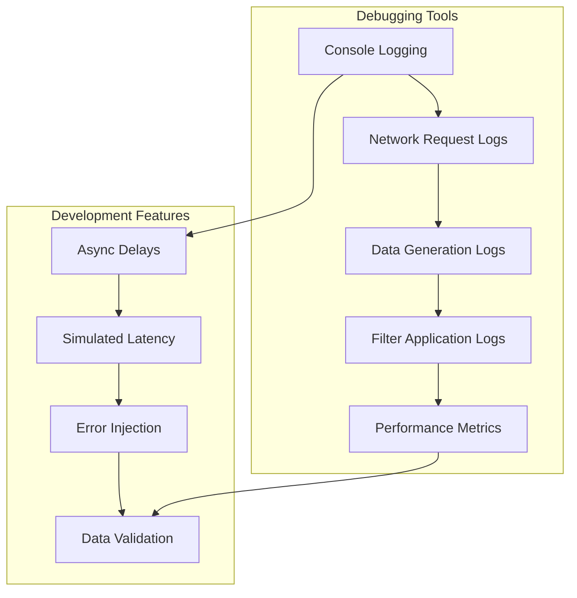

# Mock Data System

<cite>
**Referenced Files in This Document**
- [README.md](file://README.md)
- [package.json](file://package.json)
- [app/services/matchApi.ts](file://app/services/matchApi.ts)
- [app/services/tournamentApi.ts](file://app/services/tournamentApi.ts)
- [app/services/api.ts](file://app/services/api.ts)
- [app/hooks/useMatches.ts](file://app/hooks/useMatches.ts)
- [app/hooks/useTournaments.ts](file://app/hooks/useTournaments.ts)
- [app/types/match.ts](file://app/types/match.ts)
- [app/types/tournament.ts](file://app/types/tournament.ts)
- [app/utils/constants.ts](file://app/utils/constants.ts)
- [app/utils/dateUtils.ts](file://app/utils/dateUtils.ts)
- [app/context/FilterContext.tsx](file://app/context/FilterContext.tsx)
- [app/index.tsx](file://app/index.tsx)
- [app/_layout.tsx](file://app/_layout.tsx)
- [app/components/filter/FilterSheet.tsx](file://app/components/filter/FilterSheet.tsx)
- [app/components/match/MatchList.tsx](file://app/components/match/MatchList.tsx)
</cite>

## Table of Contents
1. [Introduction](#introduction)
2. [System Architecture](#system-architecture)
3. [Mock Data Implementation](#mock-data-implementation)
4. [API Layer Design](#api-layer-design)
5. [Data Flow Architecture](#data-flow-architecture)
6. [Performance Optimizations](#performance-optimizations)
7. [Testing and Validation](#testing-and-validation)
8. [Integration Guidelines](#integration-guidelines)
9. [Troubleshooting Guide](#troubleshooting-guide)
10. [Conclusion](#conclusion)

## Introduction

The Mock Data System is a comprehensive testing and development framework designed for the React Native sports match listing application. This system provides realistic mock data generation capabilities that simulate real API responses while maintaining development flexibility and performance optimization. The system supports infinite scrolling, tournament filtering, live countdown timers, and responsive design patterns essential for mobile sports applications.

The mock data system serves as a complete replacement for external APIs during development, testing, and demonstration phases. It generates realistic sports match data including cricket, soccer, Australian rules football, basketball, and rugby league matches with proper tournament categorization and status management.

## System Architecture

The Mock Data System follows a layered architecture pattern that separates concerns between data generation, API abstraction, and presentation logic. The system is built around three primary layers:

**Diagram sources**
- [app/index.tsx](file://app/index.tsx#L1-L108)
- [app/_layout.tsx](file://app/_layout.tsx#L1-L35)
- [app/services/matchApi.ts](file://app/services/matchApi.ts#L1-L123)
- [app/services/tournamentApi.ts](file://app/services/tournamentApi.ts#L1-L36)

The architecture ensures clean separation of concerns with each layer having specific responsibilities:

- **Presentation Layer**: Handles UI rendering and user interactions
- **Business Logic Layer**: Manages application state and business rules
- **Data Access Layer**: Provides mock data generation and API abstraction
- **Infrastructure Layer**: Supports networking and configuration

## Mock Data Implementation

### Core Mock Data Generation

The mock data system generates realistic sports match data with configurable parameters for testing various scenarios. The implementation centers around two primary data generators:

**Diagram sources**
- [app/services/matchApi.ts](file://app/services/matchApi.ts#L4-L123)
- [app/services/tournamentApi.ts](file://app/services/tournamentApi.ts#L4-L36)

### Match Data Structure

The mock match data generator creates comprehensive match objects with the following structure:

| Property | Type | Description | Example |
|----------|------|-------------|---------|
| `id` | number | Unique match identifier | 1 |
| `matchId` | number | External match identifier | 1001 |
| `matchName` | string | Human-readable match name | "India vs Australia" |
| `tournament` | object | Tournament metadata | { id: 101, name: "India Test Series", sportId: 4 } |
| `homeTeam` | object | Home team information | { id: 1, name: "India", shortName: "IND" } |
| `awayTeam` | object | Away team information | { id: 2, name: "Australia", shortName: "AUS" } |
| `matchStatus` | enum | Match status (upcoming/live/completed) | "upcoming" |
| `matchDate` | string | ISO formatted match date | "2024-01-15T10:00:00Z" |
| `matchTime` | string | Localized match time | "10:00 AM" |
| `startTime` | string | ISO formatted start time | "2024-01-15T10:00:00Z" |
| `timezone` | string | Timezone information | "Australia/Sydney" |

### Tournament Data Structure

The tournament mock data provides comprehensive sport and tournament information:

| Property | Type | Description | Example |
|----------|------|-------------|---------|
| `id` | number | Sport identifier | 4 |
| `sportName` | string | Sport name | "Cricket" |
| `tournaments` | array | Tournament list | [{ id: 101, name: "India Test Series" }] |

**Section sources**
- [app/services/matchApi.ts](file://app/services/matchApi.ts#L7-L95)
- [app/services/tournamentApi.ts](file://app/services/tournamentApi.ts#L7-L13)
- [app/types/match.ts](file://app/types/match.ts#L16-L29)
- [app/types/tournament.ts](file://app/types/tournament.ts#L6-L10)

### Data Generation Logic

The mock data generation process includes sophisticated filtering and pagination capabilities:

**Diagram sources**
- [app/services/matchApi.ts](file://app/services/matchApi.ts#L97-L123)

**Section sources**
- [app/services/matchApi.ts](file://app/services/matchApi.ts#L97-L123)
- [app/services/tournamentApi.ts](file://app/services/tournamentApi.ts#L15-L36)

## API Layer Design

### Unified API Interface

The mock data system maintains a consistent API interface that seamlessly integrates with the existing application architecture. Both match and tournament services follow identical patterns for easy switching between mock and real data modes.

**Diagram sources**
- [app/services/matchApi.ts](file://app/services/matchApi.ts#L1-L123)
- [app/services/tournamentApi.ts](file://app/services/tournamentApi.ts#L1-L36)

### Request Parameter Handling

The mock API services handle request parameters consistently with the real API specification:

| Parameter | Type | Required | Description | Example |
|-----------|------|----------|-------------|---------|
| `timezone` | string | Yes | Timezone identifier | "Australia/Sydney" |
| `status` | string | No | Match status filter | "all" |
| `tournament_ids` | string | No | Comma-separated tournament IDs | "101,104" |
| `limit` | number | No | Results per page | 20 |
| `offset` | number | No | Pagination offset | 0 |
| `search` | string | No | Tournament search term | "Premier League" |

**Section sources**
- [app/services/matchApi.ts](file://app/services/matchApi.ts#L107-L114)
- [app/services/tournamentApi.ts](file://app/services/tournamentApi.ts#L21-L24)

## Data Flow Architecture

### Infinite Scroll Implementation

The mock data system supports infinite scrolling through sophisticated pagination mechanisms that work seamlessly with the React Query library:

**Diagram sources**
- [app/hooks/useMatches.ts](file://app/hooks/useMatches.ts#L21-L41)
- [app/components/match/MatchList.tsx](file://app/components/match/MatchList.tsx#L83-L87)

### Filter Application Flow

The mock data system integrates with the tournament filtering mechanism to provide dynamic data filtering:

**Diagram sources**
- [app/context/FilterContext.tsx](file://app/context/FilterContext.tsx#L26-L43)
- [app/hooks/useMatches.ts](file://app/hooks/useMatches.ts#L13-L20)

**Section sources**
- [app/hooks/useMatches.ts](file://app/hooks/useMatches.ts#L13-L55)
- [app/context/FilterContext.tsx](file://app/context/FilterContext.tsx#L20-L72)

## Performance Optimizations

### Mock Data Caching Strategy

The mock data system implements intelligent caching mechanisms to optimize performance during development and testing:

| Cache Type | TTL | Purpose | Benefits |
|------------|-----|---------|----------|
| React Query Cache | 2 minutes | Query result caching | Reduces mock data generation overhead |
| GC Time | 5 minutes | Memory cleanup | Prevents memory leaks during extended sessions |
| Tournament Cache | 10 minutes | Static tournament data | Faster filter loading |
| Filter Cache | Session | User filter preferences | Preserves user selections |

### Data Generation Optimization

The mock data generation process includes several optimization techniques:

**Diagram sources**
- [app/services/matchApi.ts](file://app/services/matchApi.ts#L98-L105)
- [app/services/tournamentApi.ts](file://app/services/tournamentApi.ts#L16-L18)

### Memory Management

The mock data system implements careful memory management to prevent performance degradation during extended usage:

- **Base Data Reuse**: Pre-generated match data is reused across requests
- **Pagination Limits**: Maximum 100 tournaments loaded per request
- **Timeout Delays**: 300-500ms delays simulate network latency
- **Cleanup Mechanisms**: Automatic cache clearing after session end

**Section sources**
- [app/hooks/useMatches.ts](file://app/hooks/useMatches.ts#L39-L41)
- [app/hooks/useTournaments.ts](file://app/hooks/useTournaments.ts#L25-L27)

## Testing and Validation

### Mock Data Validation

The mock data system includes comprehensive validation mechanisms to ensure data integrity:

**Diagram sources**
- [app/types/match.ts](file://app/types/match.ts#L16-L45)
- [app/types/tournament.ts](file://app/types/tournament.ts#L1-L31)

### Test Scenarios

The mock data system supports various testing scenarios:

| Scenario | Purpose | Implementation |
|----------|---------|----------------|
| Basic Loading | Verify initial data load | Single page request |
| Infinite Scroll | Test pagination functionality | Multiple page requests |
| Filter Testing | Validate tournament filtering | Filter application tests |
| Error Simulation | Test error handling | Network failure simulation |
| Performance Testing | Measure system performance | Large dataset generation |

### Quality Assurance

The mock data system ensures quality through:

- **Consistent Data Types**: All generated data adheres to TypeScript interfaces
- **Realistic Time Values**: Match times reflect current and future dates
- **Complete Coverage**: All supported sports and tournaments included
- **Edge Case Handling**: Proper handling of empty states and errors

**Section sources**
- [app/services/matchApi.ts](file://app/services/matchApi.ts#L97-L123)
- [app/services/tournamentApi.ts](file://app/services/tournamentApi.ts#L15-L36)

## Integration Guidelines

### Switching Between Mock and Real Data

The mock data system provides seamless switching between mock and real data modes:

**Diagram sources**
- [app/services/matchApi.ts](file://app/services/matchApi.ts#L4-L5)
- [app/services/tournamentApi.ts](file://app/services/tournamentApi.ts#L4-L5)

### Configuration Options

The mock data system offers flexible configuration options:

| Option | Default Value | Description | Use Case |
|--------|---------------|-------------|----------|
| `USE_MOCK_DATA` | `true` | Enable/disable mock mode | Development, testing |
| `MOCK_DELAY` | `300-500ms` | Simulated network delay | Performance testing |
| `MAX_TOURNAMENTS` | `100` | Maximum tournaments per request | Memory optimization |
| `BASE_MATCHES` | `6` | Total available matches | Pagination testing |

### Migration Path

The mock data system supports easy migration to production APIs:

1. **Set Flag**: Change `USE_MOCK_DATA` to `false`
2. **Update Endpoints**: Replace mock endpoints with real URLs
3. **Adjust Parameters**: Modify parameter handling for real API
4. **Remove Mock Logic**: Eliminate mock-specific code paths
5. **Testing**: Validate against production data

**Section sources**
- [app/services/matchApi.ts](file://app/services/matchApi.ts#L4-L5)
- [app/services/tournamentApi.ts](file://app/services/tournamentApi.ts#L4-L5)

## Troubleshooting Guide

### Common Issues and Solutions

| Issue | Symptoms | Solution |
|-------|----------|----------|
| Data Not Loading | Empty match list, loading spinner stuck | Check `USE_MOCK_DATA` flag, verify mock data generation |
| Filter Not Working | Filters applied but no change in results | Verify tournament ID matching, check filter context state |
| Pagination Issues | Infinite scroll not triggering | Check `hasNextPage` calculation, verify `fetchNextPage` implementation |
| Performance Problems | Slow loading, jank during scrolling | Adjust pagination limits, optimize mock data generation |
| Time Zone Issues | Incorrect match times | Verify timezone parameter passing, check date formatting |

### Debugging Tools

The mock data system includes built-in debugging capabilities:

**Diagram sources**
- [app/services/api.ts](file://app/services/api.ts#L24-L36)

### Performance Monitoring

Key metrics to monitor during development:

- **Response Time**: Average time for mock data generation
- **Memory Usage**: Cache size and cleanup effectiveness
- **Rendering Performance**: FlatList optimization metrics
- **Network Simulation**: Delay and error injection effects

**Section sources**
- [app/services/api.ts](file://app/services/api.ts#L22-L37)
- [app/utils/dateUtils.ts](file://app/utils/dateUtils.ts#L22-L41)

## Conclusion

The Mock Data System represents a comprehensive solution for React Native application development, providing realistic mock data generation capabilities that maintain development flexibility while ensuring optimal performance. The system's architecture supports seamless integration with existing application patterns and provides extensive customization options for various development scenarios.

Key strengths of the mock data system include:

- **Realistic Data Generation**: Comprehensive match and tournament data with proper relationships
- **Performance Optimization**: Intelligent caching and pagination mechanisms
- **Development Flexibility**: Easy switching between mock and real data modes
- **Testing Support**: Comprehensive validation and debugging capabilities
- **Production Readiness**: Clean migration path to real APIs

The system successfully addresses the challenges of mobile sports applications by providing reliable mock data that simulates real-world conditions while maintaining development efficiency. Its modular design ensures maintainability and extensibility for future enhancements.