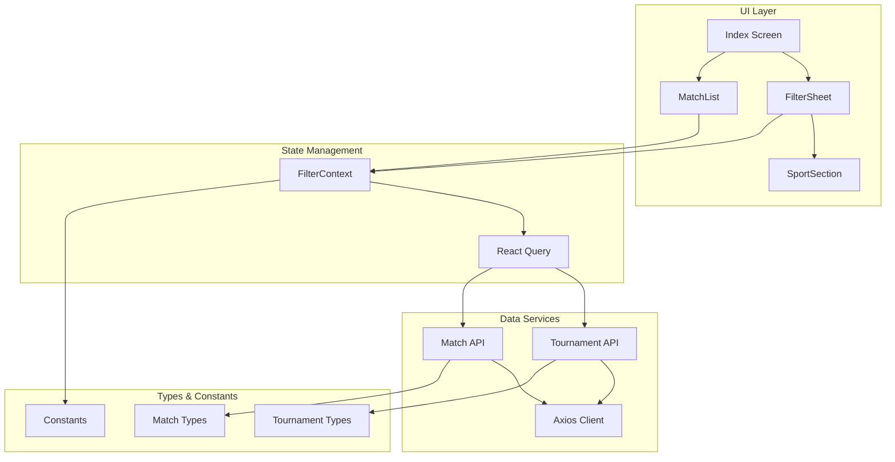
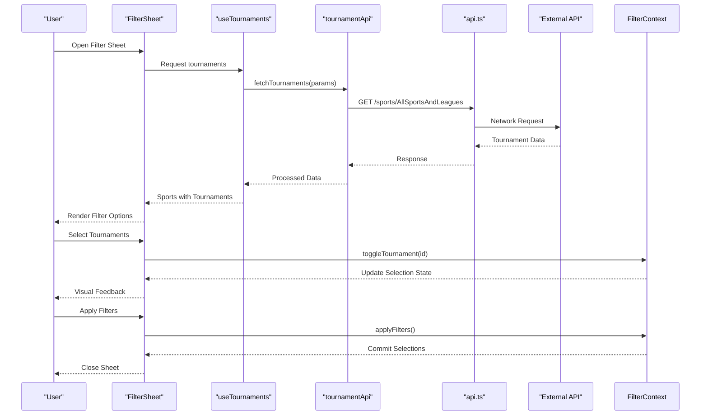
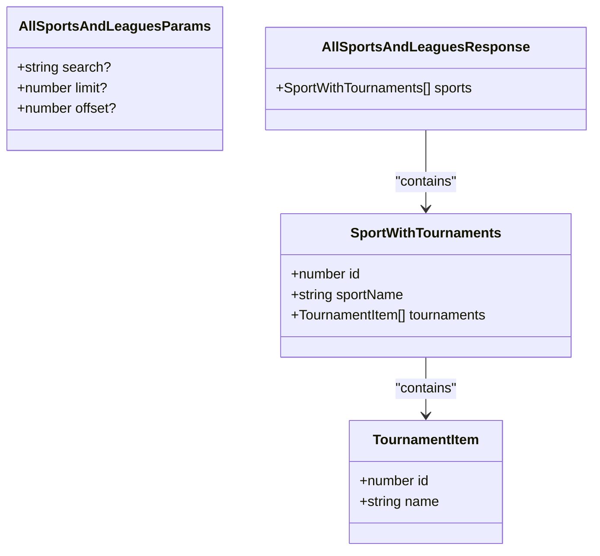
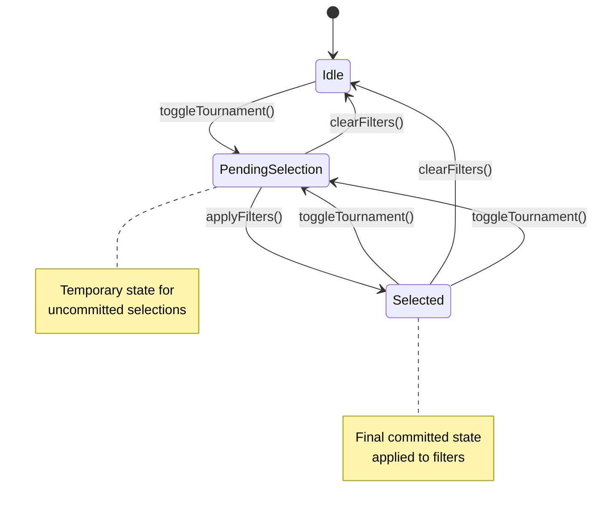
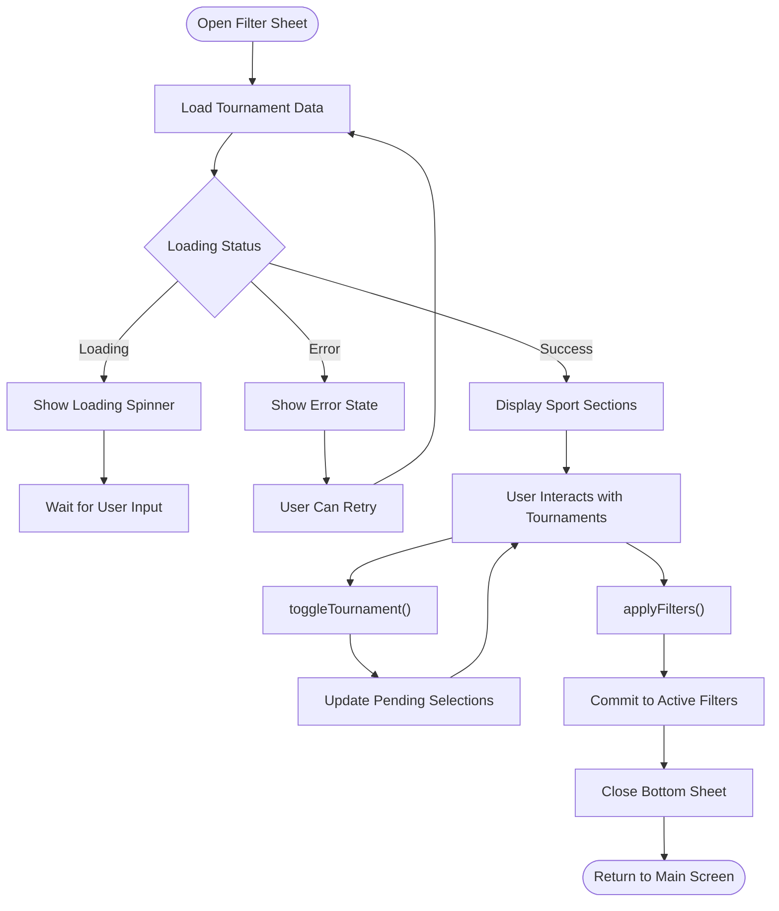
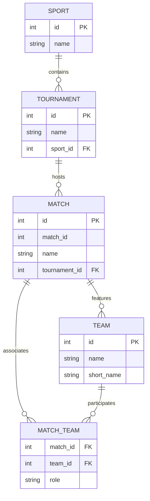
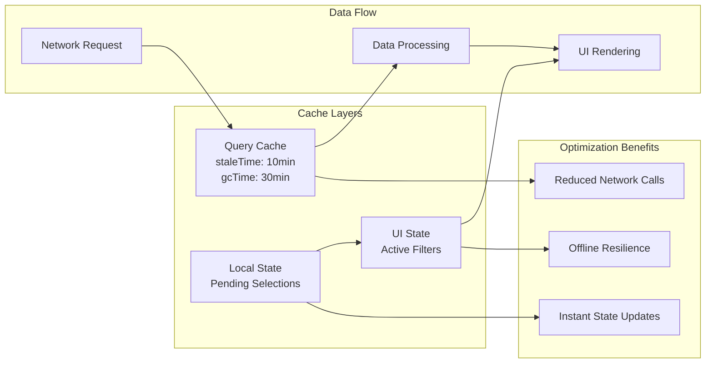
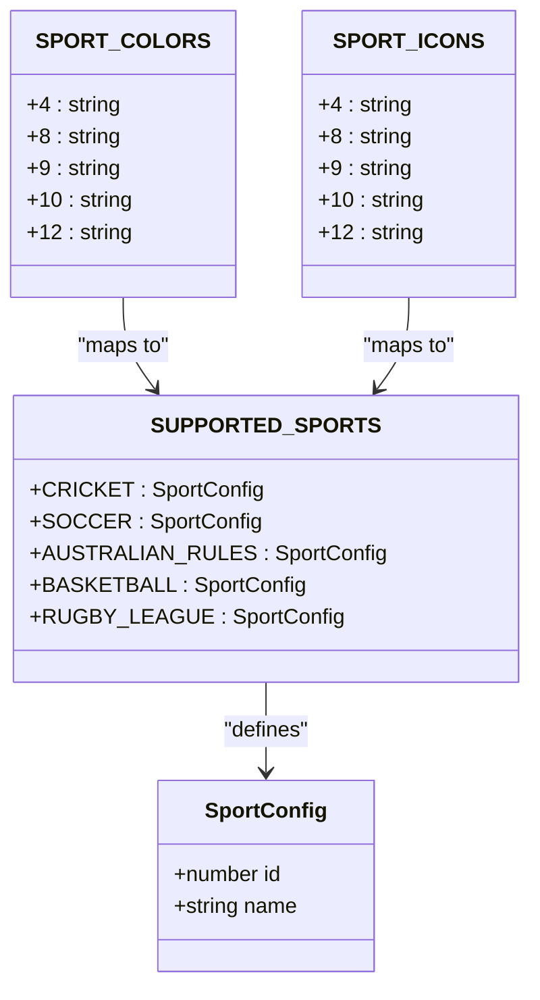
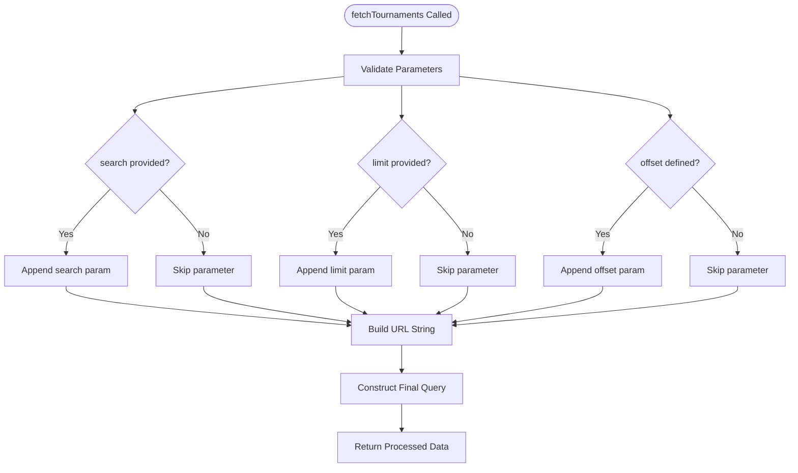
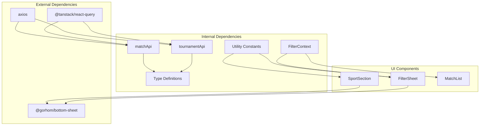

# Tournament Data Service

<cite>
**Referenced Files in This Document**
- [app/services/tournamentApi.ts](file://app/services/tournamentApi.ts)
- [app/hooks/useTournaments.ts](file://app/hooks/useTournaments.ts)
- [app/types/tournament.ts](file://app/types/tournament.ts)
- [app/context/FilterContext.tsx](file://app/context/FilterContext.tsx)
- [app/components/filter/FilterSheet.tsx](file://app/components/filter/FilterSheet.tsx)
- [app/components/filter/SportSection.tsx](file://app/components/filter/SportSection.tsx)
- [app/services/api.ts](file://app/services/api.ts)
- [app/services/matchApi.ts](file://app/services/matchApi.ts)
- [app/hooks/useMatches.ts](file://app/hooks/useMatches.ts)
- [app/types/match.ts](file://app/types/match.ts)
- [app/utils/constants.ts](file://app/utils/constants.ts)
- [app/_layout.tsx](file://app/_layout.tsx)
- [app/index.tsx](file://app/index.tsx)
</cite>

## Update Summary
**Changes Made**
- Updated API parameter handling section to reflect enhanced parameter validation and URL construction logic
- Added new section documenting improved parameter processing and error handling
- Enhanced caching strategy documentation with new staleTime configurations
- Updated performance considerations to include parameter optimization benefits

## Table of Contents
1. [Introduction](#introduction)
2. [Project Structure](#project-structure)
3. [Core Components](#core-components)
4. [Architecture Overview](#architecture-overview)
5. [Detailed Component Analysis](#detailed-component-analysis)
6. [Enhanced API Parameter Handling](#enhanced-api-parameter-handling)
7. [Dependency Analysis](#dependency-analysis)
8. [Performance Considerations](#performance-considerations)
9. [Troubleshooting Guide](#troubleshooting-guide)
10. [Conclusion](#conclusion)

## Introduction
This document provides comprehensive documentation for the tournament data service responsible for metadata retrieval and sport categorization. It covers the tournament list API endpoint, sport-based filtering, tournament selection mechanisms, data structures, multi-select filtering implementation, bottom sheet modal integration, caching strategies, performance considerations, and the relationship between tournaments and matches.

**Updated** Enhanced API parameter handling now includes improved validation logic and URL construction for better reliability and performance.

## Project Structure
The tournament data service is organized around several key modules:
- API service layer for network requests with enhanced parameter handling
- React Query hooks for data fetching and caching with optimized configurations
- Type definitions for tournament and match entities
- Filter context for managing selection state
- UI components for displaying and interacting with tournament data
- Integration points with the match data service

**Diagram sources**
- [app/index.tsx](file://app/index.tsx#L1-L108)
- [app/components/filter/FilterSheet.tsx](file://app/components/filter/FilterSheet.tsx#L1-L128)
- [app/components/filter/SportSection.tsx](file://app/components/filter/SportSection.tsx#L1-L82)
- [app/context/FilterContext.tsx](file://app/context/FilterContext.tsx#L1-L72)
- [app/hooks/useTournaments.ts](file://app/hooks/useTournaments.ts#L1-L45)
- [app/hooks/useMatches.ts](file://app/hooks/useMatches.ts#L1-L56)
- [app/services/tournamentApi.ts](file://app/services/tournamentApi.ts#L1-L36)
- [app/services/matchApi.ts](file://app/services/matchApi.ts#L1-L123)
- [app/services/api.ts](file://app/services/api.ts#L1-L40)

**Section sources**
- [app/_layout.tsx](file://app/_layout.tsx#L1-L35)
- [app/index.tsx](file://app/index.tsx#L1-L108)

## Core Components
The tournament data service consists of several interconnected components that work together to provide efficient tournament metadata retrieval and filtering capabilities.

### Tournament API Service
The tournament API service handles all network requests for retrieving tournament data from the backend. It constructs query parameters for search, pagination, and filtering with enhanced parameter validation and URL construction logic, then processes the response into a normalized structure.

### Tournament Hook
The useTournaments hook integrates with React Query to provide caching, pagination, and automatic data synchronization with optimized staleTime configurations. It exposes both hierarchical sport data and flattened tournament lists for different UI requirements.

### Filter Context
The FilterContext manages the multi-select tournament filtering state, providing methods for toggling selections, applying filters, and maintaining pending selections until the user confirms their choices.

### UI Components
The FilterSheet and SportSection components provide an intuitive interface for browsing sports and tournaments, with visual indicators for selected items and responsive feedback.

**Section sources**
- [app/services/tournamentApi.ts](file://app/services/tournamentApi.ts#L1-L36)
- [app/hooks/useTournaments.ts](file://app/hooks/useTournaments.ts#L1-L45)
- [app/context/FilterContext.tsx](file://app/context/FilterContext.tsx#L1-L72)
- [app/components/filter/FilterSheet.tsx](file://app/components/filter/FilterSheet.tsx#L1-L128)
- [app/components/filter/SportSection.tsx](file://app/components/filter/SportSection.tsx#L1-L82)

## Architecture Overview
The tournament data service follows a layered architecture with clear separation of concerns between presentation, state management, data services, and type definitions.

**Diagram sources**
- [app/components/filter/FilterSheet.tsx](file://app/components/filter/FilterSheet.tsx#L16-L50)
- [app/hooks/useTournaments.ts](file://app/hooks/useTournaments.ts#L14-L28)
- [app/services/tournamentApi.ts](file://app/services/tournamentApi.ts#L15-L36)
- [app/services/api.ts](file://app/services/api.ts#L1-L40)
- [app/context/FilterContext.tsx](file://app/context/FilterContext.tsx#L26-L43)

## Detailed Component Analysis

### Tournament API Endpoint Implementation
The tournament API endpoint provides a comprehensive sports and leagues data structure with built-in search and pagination support, featuring enhanced parameter handling logic.

**Diagram sources**
- [app/types/tournament.ts](file://app/types/tournament.ts#L1-L31)

The API endpoint supports the following query parameters with enhanced validation:
- `search`: Text-based filtering for tournament names (validated before appending)
- `limit`: Maximum number of records to return (converted to string safely)
- `offset`: Pagination offset for large datasets (only appended when defined)

**Section sources**
- [app/services/tournamentApi.ts](file://app/services/tournamentApi.ts#L15-L36)
- [app/types/tournament.ts](file://app/types/tournament.ts#L12-L20)

### Multi-Select Filtering Implementation
The filtering system implements a two-stage selection process to provide immediate feedback while preserving user intent.

**Diagram sources**
- [app/context/FilterContext.tsx](file://app/context/FilterContext.tsx#L26-L43)

The filter context provides the following methods:
- `toggleTournament(id)`: Add or remove tournament from pending selections
- `selectTournaments(ids)`: Replace all pending selections
- `applyFilters()`: Commit pending selections to active filters
- `clearFilters()`: Reset both pending and active selections

**Section sources**
- [app/context/FilterContext.tsx](file://app/context/FilterContext.tsx#L1-L72)

### Bottom Sheet Modal Integration
The FilterSheet component provides a responsive bottom sheet interface for tournament selection with integrated loading and error states.

**Diagram sources**
- [app/components/filter/FilterSheet.tsx](file://app/components/filter/FilterSheet.tsx#L16-L50)
- [app/components/filter/SportSection.tsx](file://app/components/filter/SportSection.tsx#L15-L76)

**Section sources**
- [app/components/filter/FilterSheet.tsx](file://app/components/filter/FilterSheet.tsx#L1-L128)
- [app/components/filter/SportSection.tsx](file://app/components/filter/SportSection.tsx#L1-L82)

### Data Structure Relationships
The tournament data service maintains clear relationships between sports, tournaments, and matches through shared identifiers and normalized structures.

**Diagram sources**
- [app/types/tournament.ts](file://app/types/tournament.ts#L1-L10)
- [app/types/match.ts](file://app/types/match.ts#L9-L29)

**Section sources**
- [app/types/tournament.ts](file://app/types/tournament.ts#L1-L31)
- [app/types/match.ts](file://app/types/match.ts#L1-L46)

### Caching Strategies and Performance
The tournament data service implements sophisticated caching strategies using React Query to optimize performance and reduce network requests.

**Diagram sources**
- [app/hooks/useTournaments.ts](file://app/hooks/useTournaments.ts#L25-L27)
- [app/_layout.tsx](file://app/_layout.tsx#L10-L17)

The caching implementation includes:
- **Stale Time**: 10 minutes for tournament data to balance freshness with performance
- **Garbage Collection**: 30 minutes to manage memory usage
- **Automatic Refetch**: Background updates when data becomes stale
- **Manual Refetch**: Immediate refresh capability for user-initiated actions

**Section sources**
- [app/hooks/useTournaments.ts](file://app/hooks/useTournaments.ts#L25-L27)
- [app/_layout.tsx](file://app/_layout.tsx#L10-L17)

### Sport Categorization Logic
The system implements sport categorization through predefined constants and dynamic color assignment for visual consistency.

**Diagram sources**
- [app/types/tournament.ts](file://app/types/tournament.ts#L22-L31)
- [app/utils/constants.ts](file://app/utils/constants.ts#L23-L37)

**Section sources**
- [app/types/tournament.ts](file://app/types/tournament.ts#L22-L31)
- [app/utils/constants.ts](file://app/utils/constants.ts#L23-L37)

## Enhanced API Parameter Handling

**Updated** The tournament API service now features significantly improved parameter handling logic with enhanced validation and URL construction.

### Improved Parameter Validation
The enhanced parameter handling includes robust validation before constructing query parameters:

**Diagram sources**
- [app/services/tournamentApi.ts](file://app/services/tournamentApi.ts#L21-L27)

### Enhanced URL Construction
The URL construction logic now uses `URLSearchParams` for reliable parameter encoding and query string generation:

- **Safe Parameter Encoding**: Automatic URL encoding for special characters
- **Conditional Parameter Appending**: Only non-empty parameters are included
- **Type Safety**: Proper conversion of numeric parameters to strings
- **Null Safety**: Undefined parameters are never appended to prevent malformed URLs

### Error Handling Improvements
The enhanced parameter handling includes better error detection and logging:

- **Parameter Validation**: Ensures only valid parameters are processed
- **Type Conversion**: Safely converts parameter types before appending
- **Debug Logging**: Enhanced logging for parameter processing failures
- **Graceful Degradation**: Falls back to safe defaults when parameters are invalid

**Section sources**
- [app/services/tournamentApi.ts](file://app/services/tournamentApi.ts#L15-L36)

## Dependency Analysis
The tournament data service has well-defined dependencies that support modularity and maintainability.

**Diagram sources**
- [app/hooks/useTournaments.ts](file://app/hooks/useTournaments.ts#L1-L3)
- [app/hooks/useMatches.ts](file://app/hooks/useMatches.ts#L1-L4)
- [app/services/tournamentApi.ts](file://app/services/tournamentApi.ts#L1)
- [app/services/matchApi.ts](file://app/services/matchApi.ts#L1)
- [app/components/filter/FilterSheet.tsx](file://app/components/filter/FilterSheet.tsx#L1-L9)

**Section sources**
- [app/hooks/useTournaments.ts](file://app/hooks/useTournaments.ts#L1-L3)
- [app/hooks/useMatches.ts](file://app/hooks/useMatches.ts#L1-L4)
- [app/services/tournamentApi.ts](file://app/services/tournamentApi.ts#L1)
- [app/services/matchApi.ts](file://app/services/matchApi.ts#L1)

## Performance Considerations
The tournament data service implements several performance optimizations to ensure smooth user experience:

### Network Optimization
- **Enhanced Query Parameter Optimization**: Efficient URL construction with only provided parameters and improved validation
- **Optimized Pagination Support**: Configurable limits and offsets for large datasets with better parameter handling
- **Improved Search Filtering**: Client-side search within loaded data to reduce server requests

### Memory Management
- **Selective Data Processing**: Only essential fields are extracted from API responses with enhanced validation
- **Flattened Data Structures**: Multiple views of the same data for different use cases
- **Cache Management**: Configurable stale and garbage collection times with improved caching strategies

### UI Responsiveness
- **Immediate Feedback**: Visual updates during selection without waiting for network requests
- **Enhanced Loading States**: Comprehensive loading indicators and skeleton screens
- **Better Error Recovery**: Automatic retry mechanisms and user-friendly error messages with improved error handling

### Caching Strategy
The system employs a multi-layered caching approach with enhanced configurations:
- **Query Cache**: React Query manages automatic caching and invalidation with optimized staleTime settings
- **Local State**: Filter context maintains temporary selections
- **UI State**: Active filters persist across navigation

**Section sources**
- [app/services/tournamentApi.ts](file://app/services/tournamentApi.ts#L21-L27)
- [app/hooks/useTournaments.ts](file://app/hooks/useTournaments.ts#L25-L27)
- [app/components/filter/FilterSheet.tsx](file://app/components/filter/FilterSheet.tsx#L73-L100)

## Troubleshooting Guide
Common issues and their solutions when working with the tournament data service:

### Network Issues
- **Symptom**: API requests failing with network errors
- **Solution**: Check network connectivity and API base URL configuration
- **Prevention**: Implement retry logic and user-friendly error messages

### Data Synchronization Issues
- **Symptom**: Outdated tournament data displayed
- **Solution**: Verify staleTime configuration and manual refetch functionality
- **Prevention**: Monitor cache invalidation and implement user-triggered refresh

### Filter State Problems
- **Symptom**: Filter selections not persisting correctly
- **Solution**: Ensure proper use of applyFilters() vs pending state
- **Prevention**: Implement proper state management patterns

### Performance Issues
- **Symptom**: Slow loading or UI lag
- **Solution**: Optimize query parameters and implement pagination
- **Prevention**: Monitor cache hit rates and adjust staleTime settings

### Parameter Handling Issues
- **Symptom**: Malformed URLs or parameter encoding errors
- **Solution**: Verify parameter types and ensure proper validation
- **Prevention**: Use the enhanced parameter handling logic for all API calls

**Section sources**
- [app/services/api.ts](file://app/services/api.ts#L22-L37)
- [app/context/FilterContext.tsx](file://app/context/FilterContext.tsx#L41-L43)
- [app/hooks/useTournaments.ts](file://app/hooks/useTournaments.ts#L25-L27)

## Conclusion
The tournament data service provides a robust, scalable solution for managing tournament metadata and filtering capabilities. Its architecture balances performance with functionality through intelligent caching, modular design, and comprehensive error handling. The recent Enhanced API Parameter Handling improvements demonstrate the service's commitment to reliability and maintainability.

The integration with the match data service ensures seamless navigation between tournament discovery and match viewing, while the bottom sheet interface provides an intuitive user experience for complex filtering scenarios. The enhanced parameter handling logic ensures reliable API communication with improved validation and error handling.

The service demonstrates best practices in modern React Native development, including proper state management, efficient data fetching patterns, responsive UI design, and robust error handling. The modular structure allows for easy extension and maintenance, making it suitable for future enhancements and scaling requirements.