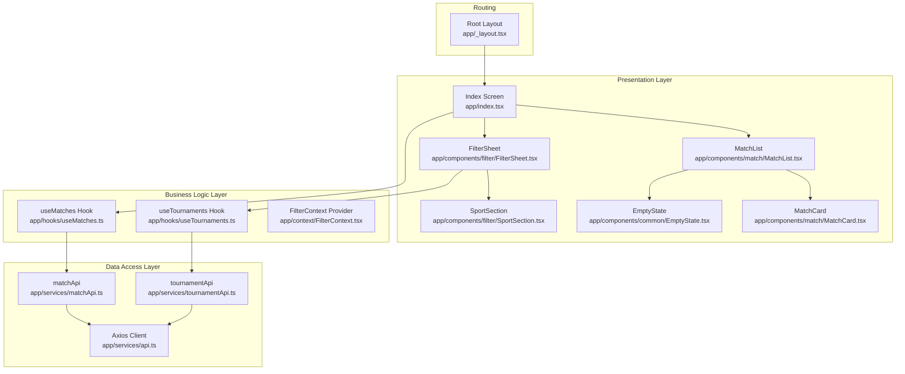
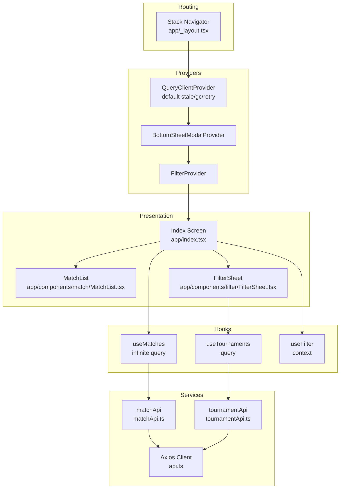
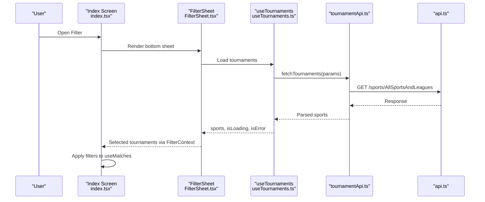
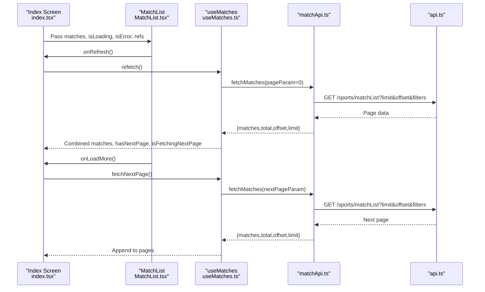
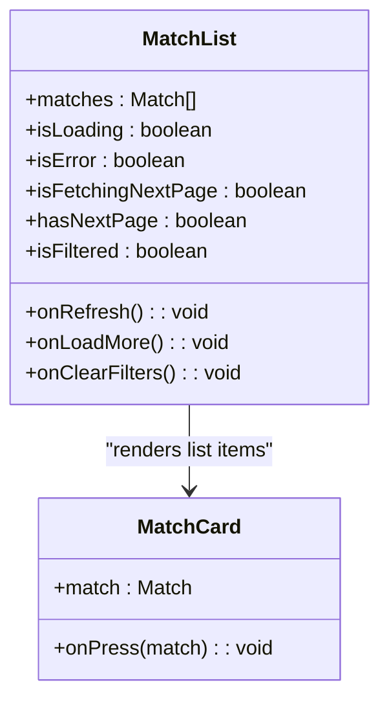
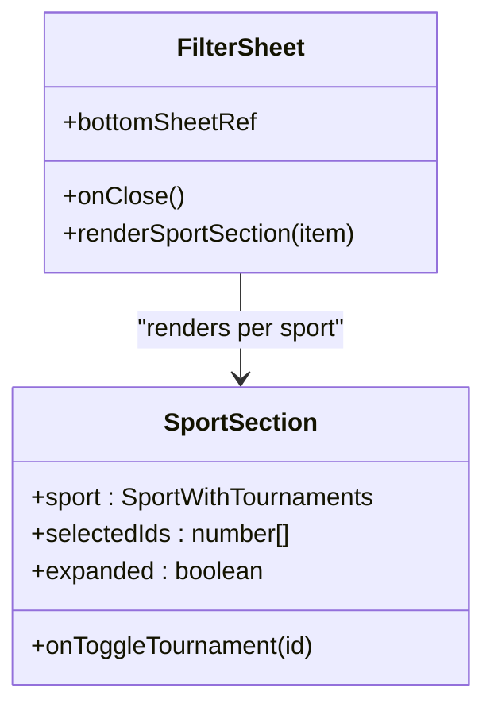
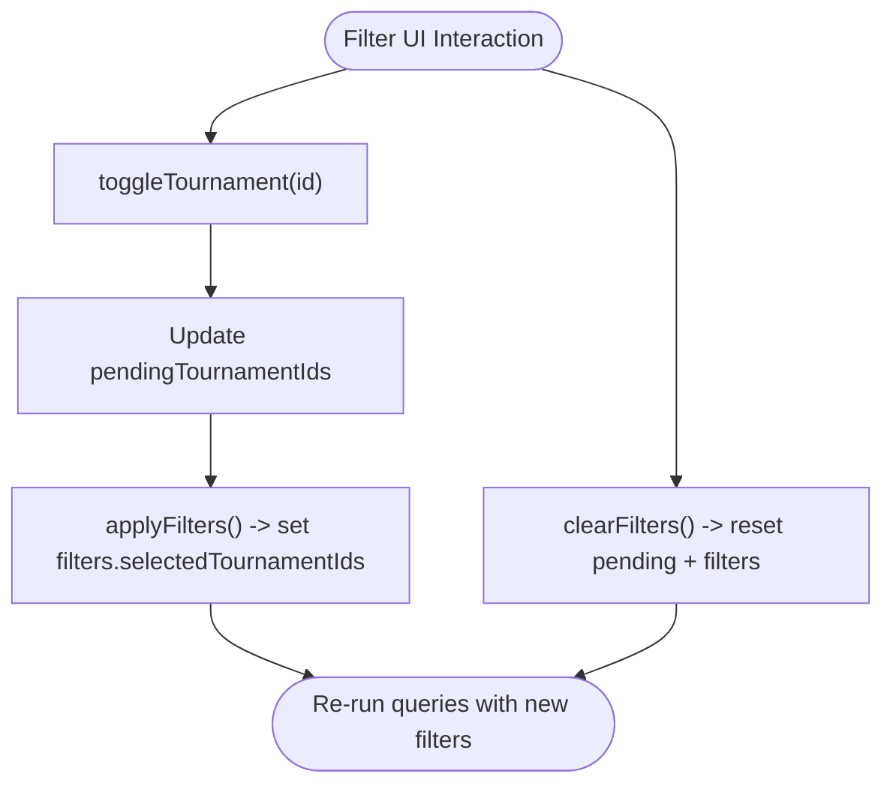
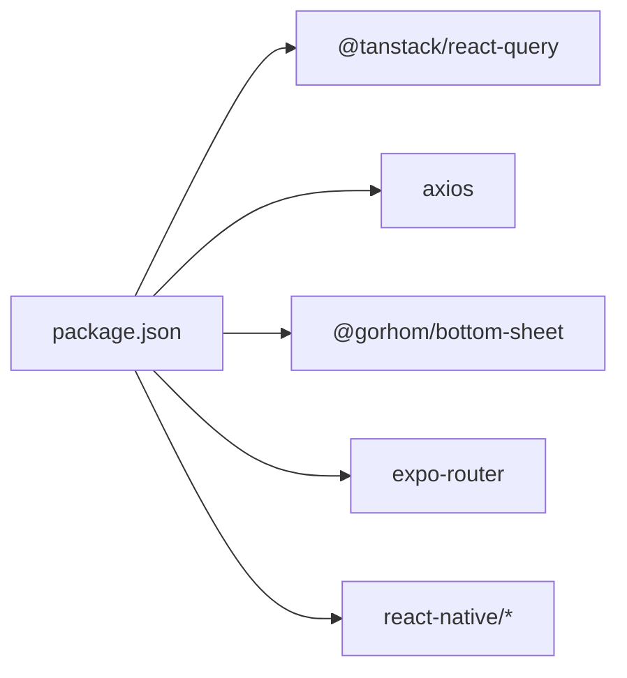

# Architecture Overview

<cite>
**Referenced Files in This Document**
- [app/_layout.tsx](file://app/_layout.tsx)
- [app/index.tsx](file://app/index.tsx)
- [app/context/FilterContext.tsx](file://app/context/FilterContext.tsx)
- [app/hooks/useMatches.ts](file://app/hooks/useMatches.ts)
- [app/hooks/useTournaments.ts](file://app/hooks/useTournaments.ts)
- [app/services/api.ts](file://app/services/api.ts)
- [app/services/matchApi.ts](file://app/services/matchApi.ts)
- [app/services/tournamentApi.ts](file://app/services/tournamentApi.ts)
- [app/components/match/MatchList.tsx](file://app/components/match/MatchList.tsx)
- [app/components/match/MatchCard.tsx](file://app/components/match/MatchCard.tsx)
- [app/components/filter/FilterSheet.tsx](file://app/components/filter/FilterSheet.tsx)
- [app/components/filter/SportSection.tsx](file://app/components/filter/SportSection.tsx)
- [app/components/common/EmptyState.tsx](file://app/components/common/EmptyState.tsx)
- [app/utils/constants.ts](file://app/utils/constants.ts)
- [app/types/match.ts](file://app/types/match.ts)
- [app/types/tournament.ts](file://app/types/tournament.ts)
- [package.json](file://package.json)
</cite>

## Table of Contents
1. [Introduction](#introduction)
2. [Project Structure](#project-structure)
3. [Core Components](#core-components)
4. [Architecture Overview](#architecture-overview)
5. [Detailed Component Analysis](#detailed-component-analysis)
6. [Dependency Analysis](#dependency-analysis)
7. [Performance Considerations](#performance-considerations)
8. [Troubleshooting Guide](#troubleshooting-guide)
9. [Conclusion](#conclusion)

## Introduction
This document describes the architecture of a React Native sports match application. The system follows a component-based design with a clear separation of concerns across four layers:
- Presentation layer: UI components and screens
- Business logic layer: React hooks encapsulating data fetching and transformations
- Data access layer: Service modules interacting with REST APIs
- State management layer: Provider pattern for filters and React Query for caching and synchronization

Routing is powered by Expo Router’s file-based navigation system. The architecture emphasizes scalability, maintainability, and a consistent developer experience through reusable hooks, typed models, and centralized configuration.

## Project Structure
The project is organized by feature and responsibility:
- app/: Application entry and feature modules
  - components/: Reusable UI components grouped by domain (common, filter, match)
  - context/: Global state providers (filters)
  - hooks/: Domain-specific data-fetching hooks (React Query)
  - services/: API clients and service functions
  - types/: TypeScript interfaces and enums
  - utils/: constants, formatting, and helpers
  - _layout.tsx: Root layout with providers and router configuration
  - index.tsx: Main screen composing UI and data hooks

**Diagram sources**
- [app/index.tsx](file://app/index.tsx#L11-L107)
- [app/_layout.tsx](file://app/_layout.tsx#L19-L34)
- [app/context/FilterContext.tsx](file://app/context/FilterContext.tsx#L20-L63)
- [app/hooks/useMatches.ts](file://app/hooks/useMatches.ts#L13-L55)
- [app/hooks/useTournaments.ts](file://app/hooks/useTournaments.ts#L11-L44)
- [app/services/api.ts](file://app/services/api.ts#L4-L39)
- [app/services/matchApi.ts](file://app/services/matchApi.ts#L4-L35)
- [app/services/tournamentApi.ts](file://app/services/tournamentApi.ts#L4-L34)
- [app/components/match/MatchList.tsx](file://app/components/match/MatchList.tsx#L27-L114)
- [app/components/match/MatchCard.tsx](file://app/components/match/MatchCard.tsx#L15-L139)
- [app/components/filter/FilterSheet.tsx](file://app/components/filter/FilterSheet.tsx#L16-L125)
- [app/components/filter/SportSection.tsx](file://app/components/filter/SportSection.tsx#L15-L79)
- [app/components/common/EmptyState.tsx](file://app/components/common/EmptyState.tsx#L14-L49)

**Section sources**
- [app/_layout.tsx](file://app/_layout.tsx#L1-L35)
- [app/index.tsx](file://app/index.tsx#L1-L108)

## Core Components
- Root layout and providers:
  - QueryClientProvider and default options for caching and retries
  - BottomSheetModalProvider for modal-based bottom sheet
  - FilterProvider for global filter state
  - Stack navigator configured with hidden headers
- Main screen:
  - Index screen orchestrates filter UI, match list, and pagination controls
  - Uses useMatches for infinite list and useFilter for filter state
- Hooks:
  - useMatches: Infinite query for match list with pagination and filtering
  - useTournaments: Query for sports and tournaments for filter UI
- Services:
  - api.ts: Axios client with base URL and response interceptor error handling
  - matchApi.ts: Fetches match list with query params
  - tournamentApi.ts: Fetches sports and tournaments
- Components:
  - MatchList: Renders list with empty/error/loading states and pull-to-refresh
  - MatchCard: Renders match details with status, teams, logos, and countdown/live indicator
  - FilterSheet: Bottom sheet with sports and tournaments selection
  - SportSection: Renders a sport group and selectable tournaments
  - EmptyState: Friendly empty state with optional action

**Section sources**
- [app/_layout.tsx](file://app/_layout.tsx#L10-L17)
- [app/index.tsx](file://app/index.tsx#L11-L107)
- [app/hooks/useMatches.ts](file://app/hooks/useMatches.ts#L13-L55)
- [app/hooks/useTournaments.ts](file://app/hooks/useTournaments.ts#L11-L44)
- [app/services/api.ts](file://app/services/api.ts#L4-L39)
- [app/services/matchApi.ts](file://app/services/matchApi.ts#L4-L35)
- [app/services/tournamentApi.ts](file://app/services/tournamentApi.ts#L4-L34)
- [app/components/match/MatchList.tsx](file://app/components/match/MatchList.tsx#L27-L114)
- [app/components/match/MatchCard.tsx](file://app/components/match/MatchCard.tsx#L15-L139)
- [app/components/filter/FilterSheet.tsx](file://app/components/filter/FilterSheet.tsx#L16-L125)
- [app/components/filter/SportSection.tsx](file://app/components/filter/SportSection.tsx#L15-L79)
- [app/components/common/EmptyState.tsx](file://app/components/common/EmptyState.tsx#L14-L49)

## Architecture Overview
The system adheres to layered architecture with explicit boundaries:
- Presentation layer: Components render UI and delegate actions to hooks/providers
- Business logic layer: Hooks encapsulate data fetching, pagination, and transformations
- Data access layer: Services abstract HTTP requests and parameter building
- State management layer: FilterContext manages filter state; React Query manages cache and re-fetching

Routing is file-based via Expo Router. Providers are wired at the root level to make state and services available across the app.

**Diagram sources**
- [app/_layout.tsx](file://app/_layout.tsx#L19-L34)
- [app/index.tsx](file://app/index.tsx#L11-L107)
- [app/hooks/useMatches.ts](file://app/hooks/useMatches.ts#L21-L41)
- [app/hooks/useTournaments.ts](file://app/hooks/useTournaments.ts#L14-L28)
- [app/context/FilterContext.tsx](file://app/context/FilterContext.tsx#L20-L63)
- [app/services/api.ts](file://app/services/api.ts#L4-L39)
- [app/services/matchApi.ts](file://app/services/matchApi.ts#L4-L35)
- [app/services/tournamentApi.ts](file://app/services/tournamentApi.ts#L4-L34)

## Detailed Component Analysis

### Component Relationships and Data Flow
The main screen composes the filter bottom sheet and match list. It delegates data loading and pagination to useMatches and manages filter state via useFilter. The filter sheet loads sports and tournaments via useTournaments and updates pending selections in FilterContext. MatchList renders MatchCard items and handles pull-to-refresh and pagination triggers.

**Diagram sources**
- [app/index.tsx](file://app/index.tsx#L11-L107)
- [app/components/filter/FilterSheet.tsx](file://app/components/filter/FilterSheet.tsx#L16-L125)
- [app/hooks/useTournaments.ts](file://app/hooks/useTournaments.ts#L11-L44)
- [app/services/tournamentApi.ts](file://app/services/tournamentApi.ts#L4-L34)
- [app/services/api.ts](file://app/services/api.ts#L4-L39)

### Data Flow: Match List Pagination and Refresh
The Index screen passes props to MatchList, which triggers pagination and refresh actions. useMatches coordinates infinite pagination and exposes combined matches array and metadata.

**Diagram sources**
- [app/index.tsx](file://app/index.tsx#L15-L25)
- [app/components/match/MatchList.tsx](file://app/components/match/MatchList.tsx#L83-L112)
- [app/hooks/useMatches.ts](file://app/hooks/useMatches.ts#L21-L41)
- [app/services/matchApi.ts](file://app/services/matchApi.ts#L4-L35)
- [app/services/api.ts](file://app/services/api.ts#L4-L39)

### Component Hierarchy: MatchList and MatchCard
MatchList is a container component that renders a FlatList of MatchCard items. It also handles empty, error, and loading states and integrates with pagination and refresh controls.

**Diagram sources**
- [app/components/match/MatchList.tsx](file://app/components/match/MatchList.tsx#L15-L37)
- [app/components/match/MatchCard.tsx](file://app/components/match/MatchCard.tsx#L10-L13)

### Component Hierarchy: FilterSheet and SportSection
FilterSheet manages loading, error, and success states while delegating individual tournament toggling to SportSection. It coordinates pending selections with FilterContext.

**Diagram sources**
- [app/components/filter/FilterSheet.tsx](file://app/components/filter/FilterSheet.tsx#L11-L50)
- [app/components/filter/SportSection.tsx](file://app/components/filter/SportSection.tsx#L8-L74)

### State Management: FilterContext
FilterContext maintains two sets of selections:
- filters: committed selections applied to queries
- pendingTournamentIds: transient selections in the filter UI before applying

It exposes methods to toggle, select, clear, and apply filters, plus a flag indicating whether filters are active.

**Diagram sources**
- [app/context/FilterContext.tsx](file://app/context/FilterContext.tsx#L26-L43)

**Section sources**
- [app/index.tsx](file://app/index.tsx#L11-L107)
- [app/components/match/MatchList.tsx](file://app/components/match/MatchList.tsx#L27-L114)
- [app/components/filter/FilterSheet.tsx](file://app/components/filter/FilterSheet.tsx#L16-L125)
- [app/components/filter/SportSection.tsx](file://app/components/filter/SportSection.tsx#L15-L79)
- [app/context/FilterContext.tsx](file://app/context/FilterContext.tsx#L20-L63)

## Dependency Analysis
External libraries and their roles:
- @tanstack/react-query: Caching, invalidation, pagination, and background refetching
- @gorhom/bottom-sheet: Modal bottom sheet for filter UI
- axios: HTTP client with shared base URL and error handling
- expo-router: File-based routing with Stack navigator
- react-native ecosystem: Gesture handling, safe areas, and platform integrations

**Diagram sources**
- [package.json](file://package.json#L13-L49)

**Section sources**
- [package.json](file://package.json#L13-L49)

## Performance Considerations
- Infinite scrolling and pagination:
  - useMatches paginates with offsets and limits; staleTime and gcTime reduce redundant network calls
  - MatchList disables clipping and tunes rendering parameters for smoother lists
- Caching and retries:
  - QueryClient default options configure retry attempts and staleness windows
- Network error handling:
  - Centralized response interceptor normalizes errors and logs context for debugging
- UI responsiveness:
  - Memoization in components (MatchCard, SportSection) prevents unnecessary re-renders
  - FlatList optimizations (windowSize, initialNumToRender) improve perceived performance

**Section sources**
- [app/_layout.tsx](file://app/_layout.tsx#L10-L17)
- [app/hooks/useMatches.ts](file://app/hooks/useMatches.ts#L39-L41)
- [app/components/match/MatchList.tsx](file://app/components/match/MatchList.tsx#L109-L112)
- [app/services/api.ts](file://app/services/api.ts#L22-L37)
- [app/components/match/MatchCard.tsx](file://app/components/match/MatchCard.tsx#L15-L139)
- [app/components/filter/SportSection.tsx](file://app/components/filter/SportSection.tsx#L15-L79)

## Troubleshooting Guide
- API errors:
  - The Axios interceptor extracts status, message, and URL, then rejects with a normalized shape for consumers to handle
- Network failures:
  - React Query retries twice automatically; staleTime avoids excessive refetches during short intervals
- Filter not applying:
  - Ensure applyFilters is called after selecting tournaments; verify selectedTournamentIds prop passed to useMatches
- Empty states:
  - MatchList displays EmptyState when no matches are found; use onClearFilters to reset filters
- Pagination not loading more:
  - Confirm hasNextPage and isFetchingNextPage flags; avoid triggering onLoadMore when already fetching

**Section sources**
- [app/services/api.ts](file://app/services/api.ts#L22-L37)
- [app/_layout.tsx](file://app/_layout.tsx#L10-L17)
- [app/index.tsx](file://app/index.tsx#L41-L43)
- [app/components/match/MatchList.tsx](file://app/components/match/MatchList.tsx#L64-L77)

## Conclusion
The application employs a clean, layered architecture with strong separation of concerns. The provider pattern centralizes filter state, while React Query manages data lifecycle and caching. Expo Router’s file-based navigation keeps routing declarative and predictable. The design supports scalable enhancements such as adding more filters, integrating real-time updates, or extending the data model with additional sports and tournaments.