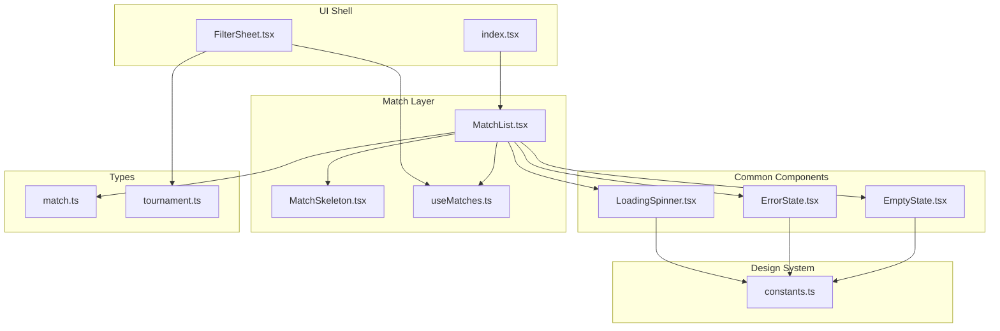
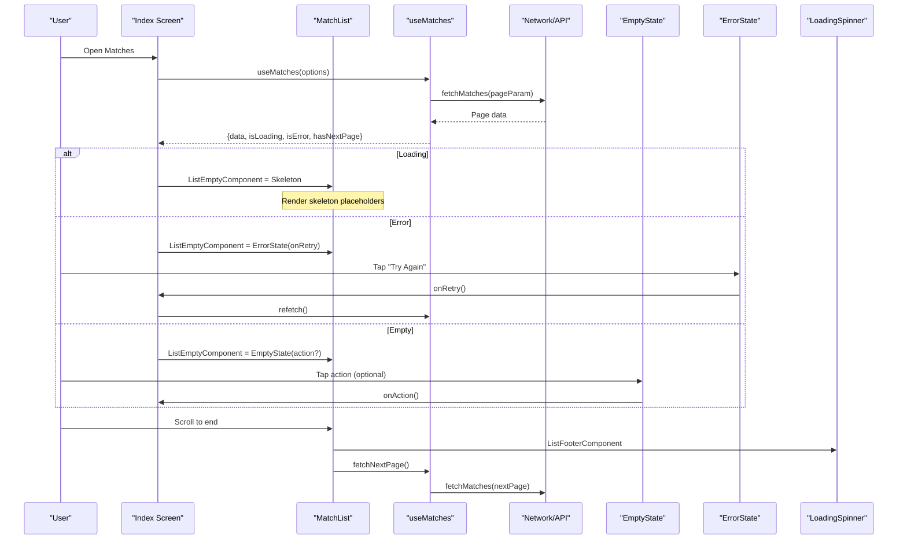
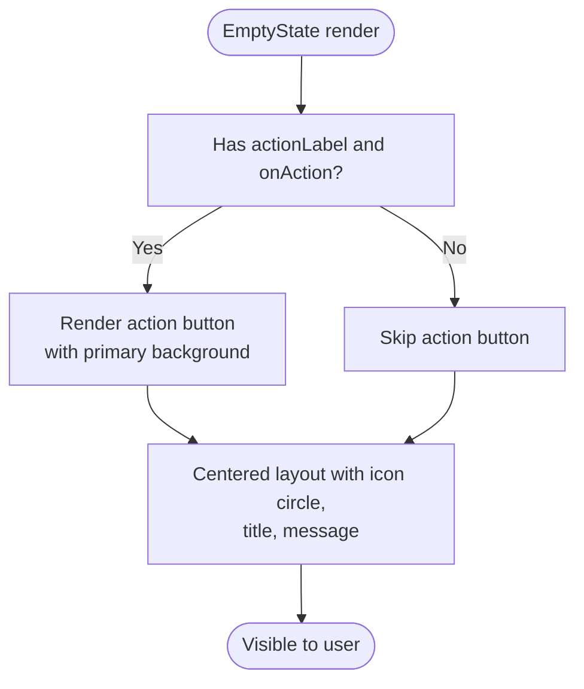
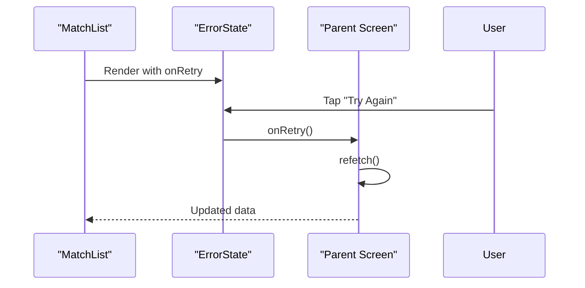
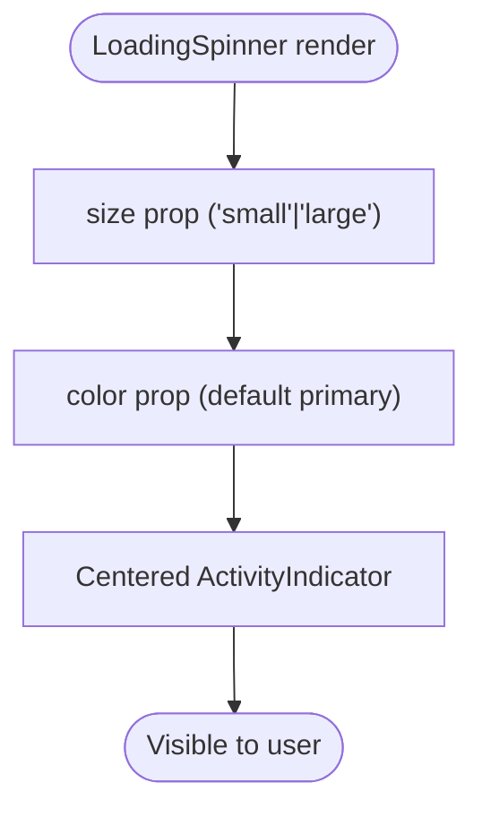
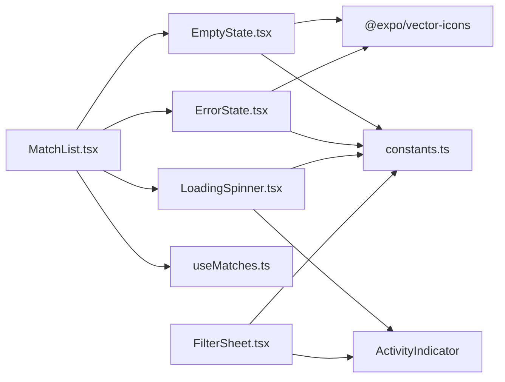

# Common Components

<cite>
**Referenced Files in This Document**
- [EmptyState.tsx](file://app/components/common/EmptyState.tsx)
- [ErrorState.tsx](file://app/components/common/ErrorState.tsx)
- [LoadingSpinner.tsx](file://app/components/common/LoadingSpinner.tsx)
- [constants.ts](file://app/utils/constants.ts)
- [MatchList.tsx](file://app/components/match/MatchList.tsx)
- [useMatches.ts](file://app/hooks/useMatches.ts)
- [MatchSkeleton.tsx](file://app/components/match/MatchSkeleton.tsx)
- [index.tsx](file://app/index.tsx)
- [FilterSheet.tsx](file://app/components/filter/FilterSheet.tsx)
- [match.ts](file://app/types/match.ts)
- [tournament.ts](file://app/types/tournament.ts)
</cite>

## Table of Contents
1. [Introduction](#introduction)
2. [Project Structure](#project-structure)
3. [Core Components](#core-components)
4. [Architecture Overview](#architecture-overview)
5. [Detailed Component Analysis](#detailed-component-analysis)
6. [Dependency Analysis](#dependency-analysis)
7. [Performance Considerations](#performance-considerations)
8. [Troubleshooting Guide](#troubleshooting-guide)
9. [Conclusion](#conclusion)
10. [Appendices](#appendices)

## Introduction
This document provides comprehensive documentation for the common UI components used across the sports match application. It focuses on three reusable components:
- EmptyState: displays friendly messaging and optional actions when no data is available.
- ErrorState: communicates errors and provides retry actions.
- LoadingSpinner: indicates asynchronous operations with a minimal spinner.

It explains the props interface for each component, customization options, composition patterns, accessibility considerations, integration with the design system, usage examples across screens, and performance considerations for loading and error handling.

## Project Structure
The common components are located under app/components/common and integrate with match and filter screens, hooks, and shared design tokens.

**Diagram sources**
- [EmptyState.tsx](file://app/components/common/EmptyState.tsx#L1-L52)
- [ErrorState.tsx](file://app/components/common/ErrorState.tsx#L1-L49)
- [LoadingSpinner.tsx](file://app/components/common/LoadingSpinner.tsx#L1-L22)
- [MatchList.tsx](file://app/components/match/MatchList.tsx#L1-L117)
- [MatchSkeleton.tsx](file://app/components/match/MatchSkeleton.tsx#L1-L56)
- [useMatches.ts](file://app/hooks/useMatches.ts#L1-L56)
- [index.tsx](file://app/index.tsx#L1-L108)
- [FilterSheet.tsx](file://app/components/filter/FilterSheet.tsx#L1-L128)
- [constants.ts](file://app/utils/constants.ts#L1-L38)
- [match.ts](file://app/types/match.ts#L1-L46)
- [tournament.ts](file://app/types/tournament.ts#L1-L31)

**Section sources**
- [EmptyState.tsx](file://app/components/common/EmptyState.tsx#L1-L52)
- [ErrorState.tsx](file://app/components/common/ErrorState.tsx#L1-L49)
- [LoadingSpinner.tsx](file://app/components/common/LoadingSpinner.tsx#L1-L22)
- [MatchList.tsx](file://app/components/match/MatchList.tsx#L1-L117)
- [index.tsx](file://app/index.tsx#L1-L108)
- [constants.ts](file://app/utils/constants.ts#L1-L38)

## Core Components
This section documents the props, behavior, and customization options for each component.

- EmptyState
  - Purpose: Friendly display for empty results with optional action.
  - Props:
    - title?: string (default: "No matches found")
    - message?: string (default: "There are no matches available at the moment.")
    - icon?: Ionicons key (default: "calendar-outline")
    - actionLabel?: string
    - onAction?: () => void
  - Customization:
    - Uses primary color from design system for background and icon tint.
    - Action button background uses primary color.
  - Accessibility:
    - Uses Pressable for touch targets; ensure sufficient hit area.
    - Text is readable with semantic font weights and sizes.
  - Composition:
    - Used conditionally inside MatchList.ListEmptyComponent based on loading/error/empty states.

- ErrorState
  - Purpose: Communicates error conditions and offers retry.
  - Props:
    - title?: string (default: "Something went wrong")
    - message?: string (default: "We couldn't load the matches. Please check your connection and try again.")
    - onRetry?: () => void
  - Customization:
    - Uses error color from design system for background and icon tint.
    - Retry button background uses primary color.
    - Retry action includes an icon and label.
  - Accessibility:
    - Retry button is pressable; ensure focus visibility and adequate spacing.
  - Composition:
    - Used conditionally inside MatchList.ListEmptyComponent when isError is true.

- LoadingSpinner
  - Purpose: Minimal spinner indicator for async operations.
  - Props:
    - size?: 'small' | 'large' (default: 'small')
    - color?: string (default: primary color)
  - Customization:
    - Color can be overridden; size adapts to context.
  - Accessibility:
    - Spinner is not interactive; ensure screen readers announce loading state via surrounding context.
  - Composition:
    - Used in MatchList.ListFooterComponent during pagination and in FilterSheet while loading tournaments.

**Section sources**
- [EmptyState.tsx](file://app/components/common/EmptyState.tsx#L6-L20)
- [ErrorState.tsx](file://app/components/common/ErrorState.tsx#L6-L16)
- [LoadingSpinner.tsx](file://app/components/common/LoadingSpinner.tsx#L5-L13)
- [constants.ts](file://app/utils/constants.ts#L6-L21)

## Architecture Overview
The common components are orchestrated by MatchList, which manages loading, error, and empty states. They integrate with useMatches for data fetching and react-query for caching and pagination. The design system constants define colors and brand tokens.

**Diagram sources**
- [index.tsx](file://app/index.tsx#L11-L107)
- [MatchList.tsx](file://app/components/match/MatchList.tsx#L27-L114)
- [useMatches.ts](file://app/hooks/useMatches.ts#L13-L55)
- [EmptyState.tsx](file://app/components/common/EmptyState.tsx#L14-L49)
- [ErrorState.tsx](file://app/components/common/ErrorState.tsx#L12-L46)
- [LoadingSpinner.tsx](file://app/components/common/LoadingSpinner.tsx#L10-L19)

## Detailed Component Analysis

### EmptyState Component
- Implementation highlights:
  - Renders a centered container with icon circle, title, message, and optional action button.
  - Uses primary color for icon and background tint.
  - Action button is rendered only when both actionLabel and onAction are provided.
- Props interface:
  - title?: string
  - message?: string
  - icon?: Ionicons key
  - actionLabel?: string
  - onAction?: () => void
- Accessibility:
  - Pressable action ensures touch-friendly target.
  - Text styles use semantic weights and sizes for readability.
- Design system integration:
  - Background tint derived from primary color with alpha.
  - Icon color aligned with primary palette.
- Usage examples:
  - MatchList renders EmptyState when matches length is zero and not loading/error.
  - Conditional props depend on filtering state (title, message, icon, actionLabel, onAction).

**Diagram sources**
- [EmptyState.tsx](file://app/components/common/EmptyState.tsx#L14-L49)

**Section sources**
- [EmptyState.tsx](file://app/components/common/EmptyState.tsx#L6-L20)
- [EmptyState.tsx](file://app/components/common/EmptyState.tsx#L21-L49)
- [MatchList.tsx](file://app/components/match/MatchList.tsx#L64-L77)

### ErrorState Component
- Implementation highlights:
  - Renders an alert icon circle, title, message, and a retry button with icon.
  - Uses error color for icon and background tint.
  - Retry button triggers onRetry callback.
- Props interface:
  - title?: string
  - message?: string
  - onRetry?: () => void
- Accessibility:
  - Retry button is pressable; ensure focus and label clarity.
- Design system integration:
  - Background tint derived from error color with alpha.
  - Icon color aligned with error palette.
- Usage examples:
  - MatchList renders ErrorState when isError is true and not loading.
  - Retry action calls the parent’s onRefresh handler.

**Diagram sources**
- [ErrorState.tsx](file://app/components/common/ErrorState.tsx#L12-L46)
- [MatchList.tsx](file://app/components/match/MatchList.tsx#L56-L61)

**Section sources**
- [ErrorState.tsx](file://app/components/common/ErrorState.tsx#L6-L16)
- [ErrorState.tsx](file://app/components/common/ErrorState.tsx#L17-L46)
- [MatchList.tsx](file://app/components/match/MatchList.tsx#L56-L61)

### LoadingSpinner Component
- Implementation highlights:
  - Thin wrapper around ActivityIndicator with centered layout.
  - Supports small/large sizes and color overrides.
- Props interface:
  - size?: 'small' | 'large'
  - color?: string
- Accessibility:
  - Not interactive; rely on surrounding context to indicate loading state.
- Usage examples:
  - MatchList renders LoadingSpinner in ListFooterComponent during pagination.
  - FilterSheet renders a large spinner while loading tournaments.

**Diagram sources**
- [LoadingSpinner.tsx](file://app/components/common/LoadingSpinner.tsx#L10-L19)
- [MatchList.tsx](file://app/components/match/MatchList.tsx#L46-L49)
- [FilterSheet.tsx](file://app/components/filter/FilterSheet.tsx#L73-L77)

**Section sources**
- [LoadingSpinner.tsx](file://app/components/common/LoadingSpinner.tsx#L5-L13)
- [LoadingSpinner.tsx](file://app/components/common/LoadingSpinner.tsx#L14-L19)
- [MatchList.tsx](file://app/components/match/MatchList.tsx#L46-L49)
- [FilterSheet.tsx](file://app/components/filter/FilterSheet.tsx#L73-L77)

## Dependency Analysis
- Component dependencies:
  - EmptyState and ErrorState depend on Ionicons and design system colors.
  - LoadingSpinner depends on ActivityIndicator and design system colors.
  - MatchList composes EmptyState, ErrorState, and LoadingSpinner based on state flags.
  - useMatches provides state flags and data to MatchList.
- Coupling and cohesion:
  - Common components are cohesive and decoupled from business logic.
  - MatchList orchestrates state-driven rendering without embedding UI logic.
- External dependencies:
  - @expo/vector-icons for icons.
  - @gorhom/bottom-sheet for FilterSheet.
  - @tanstack/react-query for data fetching and caching.

**Diagram sources**
- [EmptyState.tsx](file://app/components/common/EmptyState.tsx#L1-L4)
- [ErrorState.tsx](file://app/components/common/ErrorState.tsx#L1-L4)
- [LoadingSpinner.tsx](file://app/components/common/LoadingSpinner.tsx#L1-L3)
- [MatchList.tsx](file://app/components/match/MatchList.tsx#L8-L13)
- [FilterSheet.tsx](file://app/components/filter/FilterSheet.tsx#L1-L8)
- [constants.ts](file://app/utils/constants.ts#L1-L38)
- [useMatches.ts](file://app/hooks/useMatches.ts#L1-L4)

**Section sources**
- [EmptyState.tsx](file://app/components/common/EmptyState.tsx#L1-L5)
- [ErrorState.tsx](file://app/components/common/ErrorState.tsx#L1-L5)
- [LoadingSpinner.tsx](file://app/components/common/LoadingSpinner.tsx#L1-L3)
- [MatchList.tsx](file://app/components/match/MatchList.tsx#L8-L13)
- [FilterSheet.tsx](file://app/components/filter/FilterSheet.tsx#L1-L8)
- [constants.ts](file://app/utils/constants.ts#L6-L21)

## Performance Considerations
- Loading states:
  - MatchList uses a skeleton list while initial loading occurs, reducing perceived latency and improving perceived performance.
  - LoadingSpinner is lightweight and only mounted during pagination.
- Error handling:
  - ErrorState provides immediate retry via onRetry, minimizing repeated network churn by delegating refetch to the parent.
- Pagination:
  - useMatches paginates data with getNextPageParam and limits re-renders using infinite query flags.
  - MatchList disables onLoadMore when isFetchingNextPage is true to prevent duplicate requests.
- Rendering optimization:
  - MatchList employs FlatList optimizations (windowSize, initialNumToRender, maxToRenderPerBatch) to improve scroll performance.
  - MatchSkeleton uses memoization to reduce re-renders.
- Network caching:
  - useMatches sets staleTime and gcTime to balance freshness and performance.

**Section sources**
- [MatchList.tsx](file://app/components/match/MatchList.tsx#L83-L112)
- [MatchSkeleton.tsx](file://app/components/match/MatchSkeleton.tsx#L4-L41)
- [useMatches.ts](file://app/hooks/useMatches.ts#L34-L41)
- [index.tsx](file://app/index.tsx#L35-L39)

## Troubleshooting Guide
- EmptyState not appearing:
  - Verify that isLoading is false and isError is false when matches length is zero.
  - Ensure onClearFilters is passed when isFiltered is true.
- ErrorState not triggering retry:
  - Confirm onRefresh is passed to MatchList and is bound to a refetch function.
  - Ensure onRetry is invoked from ErrorState.
- LoadingSpinner not visible:
  - Check that isFetchingNextPage is true and hasNextPage is true when scrolling to end.
  - Confirm ListFooterComponent is set on FlatList.
- Colors not matching design system:
  - Ensure COLORS.primary and COLORS.error are used consistently.
  - Verify alpha blending for background tints (e.g., primary with alpha).
- Accessibility concerns:
  - Ensure action buttons have sufficient touch targets and labels.
  - Provide context announcements for loading states for assistive technologies.

**Section sources**
- [MatchList.tsx](file://app/components/match/MatchList.tsx#L51-L81)
- [EmptyState.tsx](file://app/components/common/EmptyState.tsx#L38-L46)
- [ErrorState.tsx](file://app/components/common/ErrorState.tsx#L34-L43)
- [LoadingSpinner.tsx](file://app/components/common/LoadingSpinner.tsx#L14-L18)
- [constants.ts](file://app/utils/constants.ts#L6-L21)

## Conclusion
The common components provide a consistent, accessible, and performant way to communicate loading, empty, and error states across the application. Their props-driven design enables easy customization, while integration with the design system and hooks ensures a cohesive user experience. Proper composition patterns and performance optimizations deliver smooth interactions and reliable feedback.

## Appendices
- Props quick reference:
  - EmptyState: title, message, icon, actionLabel, onAction
  - ErrorState: title, message, onRetry
  - LoadingSpinner: size, color
- Integration points:
  - MatchList orchestrates all three components based on state flags.
  - useMatches supplies state flags and data to drive rendering decisions.
  - FilterSheet demonstrates alternative error/loading patterns for bottom sheet content.