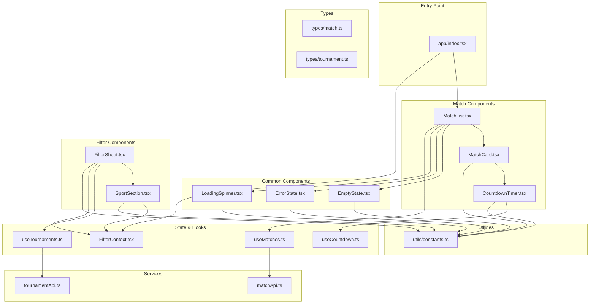
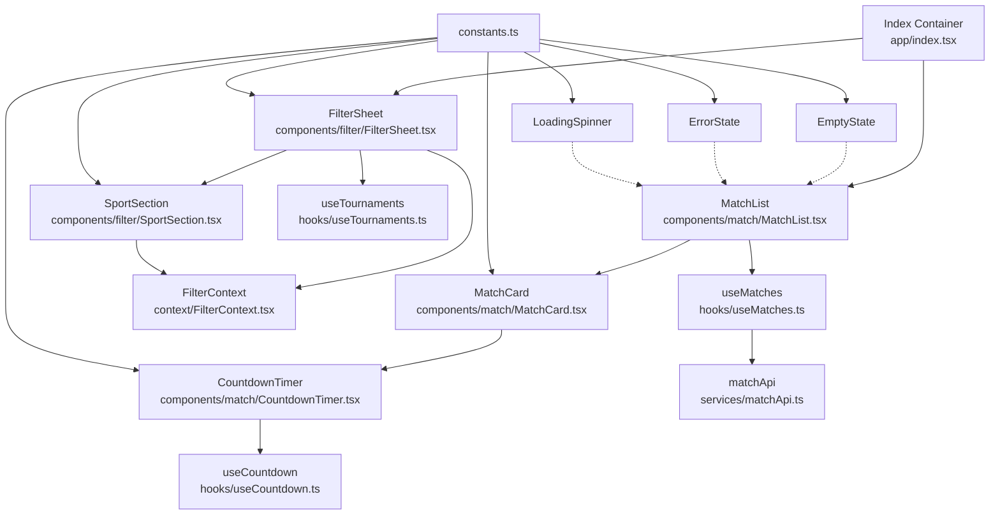
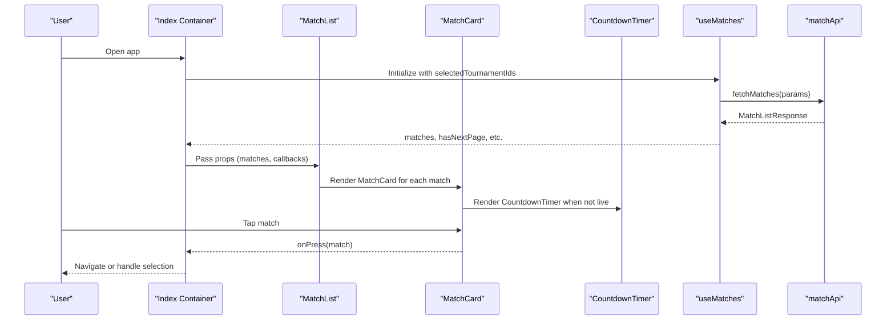
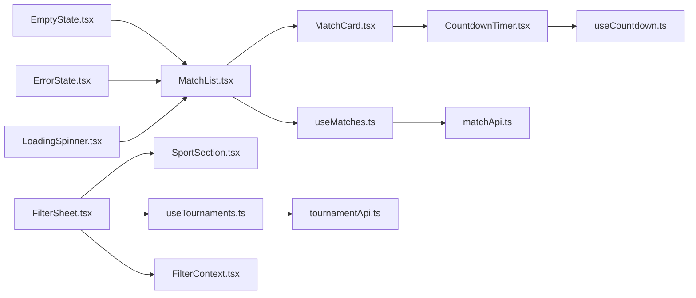

# Component Architecture

<cite>
**Referenced Files in This Document**
- [app/index.tsx](file://app/index.tsx)
- [app/components/common/EmptyState.tsx](file://app/components/common/EmptyState.tsx)
- [app/components/common/ErrorState.tsx](file://app/components/common/ErrorState.tsx)
- [app/components/common/LoadingSpinner.tsx](file://app/components/common/LoadingSpinner.tsx)
- [app/components/match/MatchCard.tsx](file://app/components/match/MatchCard.tsx)
- [app/components/match/MatchList.tsx](file://app/components/match/MatchList.tsx)
- [app/components/match/CountdownTimer.tsx](file://app/components/match/CountdownTimer.tsx)
- [app/components/filter/FilterSheet.tsx](file://app/components/filter/FilterSheet.tsx)
- [app/components/filter/SportSection.tsx](file://app/components/filter/SportSection.tsx)
- [app/context/FilterContext.tsx](file://app/context/FilterContext.tsx)
- [app/hooks/useCountdown.ts](file://app/hooks/useCountdown.ts)
- [app/hooks/useMatches.ts](file://app/hooks/useMatches.ts)
- [app/hooks/useTournaments.ts](file://app/hooks/useTournaments.ts)
- [app/services/matchApi.ts](file://app/services/matchApi.ts)
- [app/services/tournamentApi.ts](file://app/services/tournamentApi.ts)
- [app/types/match.ts](file://app/types/match.ts)
- [app/types/tournament.ts](file://app/types/tournament.ts)
- [app/utils/constants.ts](file://app/utils/constants.ts)
</cite>

## Table of Contents
1. [Introduction](#introduction)
2. [Project Structure](#project-structure)
3. [Core Components](#core-components)
4. [Architecture Overview](#architecture-overview)
5. [Detailed Component Analysis](#detailed-component-analysis)
6. [Dependency Analysis](#dependency-analysis)
7. [Performance Considerations](#performance-considerations)
8. [Accessibility Considerations](#accessibility-considerations)
9. [Testing Strategies](#testing-strategies)
10. [Troubleshooting Guide](#troubleshooting-guide)
11. [Conclusion](#conclusion)

## Introduction
This document describes the component architecture of a React Native sports match application. It focuses on three categories of components:
- Common components: Reusable presentational UI elements such as EmptyState, ErrorState, and LoadingSpinner.
- Match components: Sports-specific display components like MatchCard, MatchList, and CountdownTimer.
- Filter components: Tournament selection UI built with FilterSheet and SportSection, integrated with FilterContext.

The document explains component composition patterns, prop interfaces, state management integration via React Query and Context, lifecycle management, performance optimizations, accessibility considerations, and testing strategies.

## Project Structure
The application follows a feature-based organization under app/, separating concerns into:
- components: Presentational components grouped by domain (common, match, filter)
- context: Global state management for filters
- hooks: Custom hooks for data fetching and derived state
- services: API clients for match and tournament data
- types: TypeScript interfaces for data contracts
- utils: Constants, formatting, and helpers

**Diagram sources**
- [app/index.tsx](file://app/index.tsx#L1-L108)
- [app/components/common/EmptyState.tsx](file://app/components/common/EmptyState.tsx#L1-L52)
- [app/components/common/ErrorState.tsx](file://app/components/common/ErrorState.tsx#L1-L49)
- [app/components/common/LoadingSpinner.tsx](file://app/components/common/LoadingSpinner.tsx#L1-L22)
- [app/components/match/MatchCard.tsx](file://app/components/match/MatchCard.tsx#L1-L142)
- [app/components/match/MatchList.tsx](file://app/components/match/MatchList.tsx#L1-L117)
- [app/components/match/CountdownTimer.tsx](file://app/components/match/CountdownTimer.tsx#L1-L43)
- [app/components/filter/FilterSheet.tsx](file://app/components/filter/FilterSheet.tsx#L1-L128)
- [app/components/filter/SportSection.tsx](file://app/components/filter/SportSection.tsx#L1-L82)
- [app/context/FilterContext.tsx](file://app/context/FilterContext.tsx#L1-L72)
- [app/hooks/useMatches.ts](file://app/hooks/useMatches.ts#L1-L56)
- [app/hooks/useTournaments.ts](file://app/hooks/useTournaments.ts#L1-L45)
- [app/hooks/useCountdown.ts](file://app/hooks/useCountdown.ts#L1-L54)
- [app/services/matchApi.ts](file://app/services/matchApi.ts#L1-L36)
- [app/services/tournamentApi.ts](file://app/services/tournamentApi.ts#L1-L35)
- [app/types/match.ts](file://app/types/match.ts#L1-L46)
- [app/types/tournament.ts](file://app/types/tournament.ts#L1-L31)
- [app/utils/constants.ts](file://app/utils/constants.ts#L1-L38)

**Section sources**
- [app/index.tsx](file://app/index.tsx#L1-L108)

## Core Components
This section documents the reusable and specialized components that form the UI foundation.

- EmptyState
  - Purpose: Render a friendly empty state with optional action button.
  - Props: title, message, icon, actionLabel, onAction.
  - Composition: Used by MatchList to show empty states during loading, errors, or when no matches are returned.
  - Accessibility: Uses pressable targets; ensure touch targets meet minimum size guidelines.
  - Section sources
    - [app/components/common/EmptyState.tsx](file://app/components/common/EmptyState.tsx#L6-L52)

- ErrorState
  - Purpose: Display an error message with a retry action.
  - Props: title, message, onRetry.
  - Composition: Rendered by MatchList when data fetching fails.
  - Section sources
    - [app/components/common/ErrorState.tsx](file://app/components/common/ErrorState.tsx#L6-L49)

- LoadingSpinner
  - Purpose: Provide a lightweight loading indicator.
  - Props: size, color.
  - Composition: Shown while fetching more pages or when MatchList is empty and loading.
  - Section sources
    - [app/components/common/LoadingSpinner.tsx](file://app/components/common/LoadingSpinner.tsx#L5-L22)

- MatchCard
  - Purpose: Display a single match with teams, scores, status, and date/time.
  - Props: match, onPress.
  - Composition: Rendered by MatchList for each item; renders CountdownTimer when not live.
  - Performance: Memoized to prevent unnecessary re-renders.
  - Section sources
    - [app/components/match/MatchCard.tsx](file://app/components/match/MatchCard.tsx#L10-L142)

- MatchList
  - Purpose: Infinite scrolling list of matches with loading, error, and empty states.
  - Props: matches, isLoading, isError, isFetchingNextPage, hasNextPage, onRefresh, onLoadMore, onClearFilters, isFiltered.
  - Composition: Renders MatchCard items; integrates EmptyState, ErrorState, and LoadingSpinner.
  - Performance: Optimized with FlatList configuration, keyExtractor, and skeleton placeholders.
  - Section sources
    - [app/components/match/MatchList.tsx](file://app/components/match/MatchList.tsx#L15-L117)

- CountdownTimer
  - Purpose: Show countdown until kickoff or indicate live status.
  - Props: targetDate, timezone, matchStatus.
  - Composition: Used inside MatchCard; relies on useCountdown hook for timing logic.
  - Performance: Memoized; uses requestAnimationFrame loop with throttled updates.
  - Section sources
    - [app/components/match/CountdownTimer.tsx](file://app/components/match/CountdownTimer.tsx#L7-L43)

- FilterSheet
  - Purpose: Bottom sheet to filter matches by tournament.
  - Props: bottomSheetRef, onClose.
  - Composition: Fetches tournaments via useTournaments; renders SportSection per sport; manages pending vs applied filters via FilterContext.
  - Section sources
    - [app/components/filter/FilterSheet.tsx](file://app/components/filter/FilterSheet.tsx#L11-L128)

- SportSection
  - Purpose: Group tournaments by sport with selectable checkboxes.
  - Props: sport, selectedIds, onToggleTournament, expanded.
  - Composition: Renders a list of tournaments; toggles selection via FilterContext.
  - Performance: Memoized to avoid re-rendering unchanged sections.
  - Section sources
    - [app/components/filter/SportSection.tsx](file://app/components/filter/SportSection.tsx#L8-L82)

**Section sources**
- [app/components/common/EmptyState.tsx](file://app/components/common/EmptyState.tsx#L1-L52)
- [app/components/common/ErrorState.tsx](file://app/components/common/ErrorState.tsx#L1-L49)
- [app/components/common/LoadingSpinner.tsx](file://app/components/common/LoadingSpinner.tsx#L1-L22)
- [app/components/match/MatchCard.tsx](file://app/components/match/MatchCard.tsx#L1-L142)
- [app/components/match/MatchList.tsx](file://app/components/match/MatchList.tsx#L1-L117)
- [app/components/match/CountdownTimer.tsx](file://app/components/match/CountdownTimer.tsx#L1-L43)
- [app/components/filter/FilterSheet.tsx](file://app/components/filter/FilterSheet.tsx#L1-L128)
- [app/components/filter/SportSection.tsx](file://app/components/filter/SportSection.tsx#L1-L82)

## Architecture Overview
The application uses a clear separation of concerns:
- Presentational components (MatchCard, MatchList, EmptyState, ErrorState, LoadingSpinner, CountdownTimer, SportSection) focus on rendering UI.
- Container components (FilterSheet, app/index.tsx) orchestrate data fetching, state, and navigation.
- State management is split:
  - Global filter state via FilterContext.
  - Remote data state via React Query hooks (useMatches, useTournaments).
- Services encapsulate API interactions.

**Diagram sources**
- [app/index.tsx](file://app/index.tsx#L11-L107)
- [app/components/match/MatchList.tsx](file://app/components/match/MatchList.tsx#L27-L117)
- [app/components/match/MatchCard.tsx](file://app/components/match/MatchCard.tsx#L15-L142)
- [app/components/match/CountdownTimer.tsx](file://app/components/match/CountdownTimer.tsx#L13-L43)
- [app/components/filter/FilterSheet.tsx](file://app/components/filter/FilterSheet.tsx#L16-L128)
- [app/components/filter/SportSection.tsx](file://app/components/filter/SportSection.tsx#L15-L82)
- [app/context/FilterContext.tsx](file://app/context/FilterContext.tsx#L20-L72)
- [app/hooks/useMatches.ts](file://app/hooks/useMatches.ts#L13-L55)
- [app/hooks/useTournaments.ts](file://app/hooks/useTournaments.ts#L11-L45)
- [app/hooks/useCountdown.ts](file://app/hooks/useCountdown.ts#L10-L54)
- [app/services/matchApi.ts](file://app/services/matchApi.ts#L4-L36)
- [app/utils/constants.ts](file://app/utils/constants.ts#L6-L38)

## Detailed Component Analysis

### Common Components
- EmptyState
  - Props: title, message, icon, actionLabel, onAction.
  - Behavior: Renders an icon, title, message, and optional action button; action is hidden when not provided.
  - Accessibility: Uses Pressable for interaction; ensure sufficient contrast and label text.
  - Section sources
    - [app/components/common/EmptyState.tsx](file://app/components/common/EmptyState.tsx#L6-L52)

- ErrorState
  - Props: title, message, onRetry.
  - Behavior: Displays an alert icon, title, message, and a Try Again button that triggers onRetry.
  - Section sources
    - [app/components/common/ErrorState.tsx](file://app/components/common/ErrorState.tsx#L6-L49)

- LoadingSpinner
  - Props: size, color.
  - Behavior: Renders ActivityIndicator centered; defaults to small size and primary color.
  - Section sources
    - [app/components/common/LoadingSpinner.tsx](file://app/components/common/LoadingSpinner.tsx#L5-L22)

### Match Components
- MatchCard
  - Props: match, onPress.
  - Rendering logic:
    - Header: Tournament name and status badge with color derived from status.
    - Teams: Logos when available, initials otherwise; shows scores if present.
    - Center: "VS" for live matches, otherwise renders CountdownTimer.
    - Footer: Formatted date and time.
  - Performance: Memoized to avoid re-rendering when props are shallow-equal.
  - Section sources
    - [app/components/match/MatchCard.tsx](file://app/components/match/MatchCard.tsx#L10-L142)

- MatchList
  - Props: matches, isLoading, isError, isFetchingNextPage, hasNextPage, onRefresh, onLoadMore, onClearFilters, isFiltered.
  - Rendering logic:
    - Uses FlatList with custom keyExtractor and renderItem.
    - ListEmptyComponent shows either skeleton placeholders (loading), ErrorState (error), or EmptyState (no results).
    - ListFooterComponent shows LoadingSpinner when fetching more.
    - Pull-to-refresh via RefreshControl; infinite scroll via onEndReached.
  - Performance: Configured with removeClippedSubviews, maxToRenderPerBatch, windowSize, initialNumToRender for efficient rendering.
  - Section sources
    - [app/components/match/MatchList.tsx](file://app/components/match/MatchList.tsx#L15-L117)

- CountdownTimer
  - Props: targetDate, timezone, matchStatus.
  - Rendering logic:
    - If live status: shows animated "LIVE" indicator.
    - If expired: shows "Started".
    - Otherwise: shows formatted countdown display.
  - Hook integration: Delegates timing to useCountdown.
  - Section sources
    - [app/components/match/CountdownTimer.tsx](file://app/components/match/CountdownTimer.tsx#L7-L43)

### Filter Components
- FilterSheet
  - Props: bottomSheetRef, onClose.
  - Data fetching: Uses useTournaments to load sports and tournaments; supports retry via refetch.
  - State management: Uses FilterContext to manage pendingTournamentIds vs applied selectedTournamentIds.
  - Footer actions: Reset clears selections; Apply persists pending selections and closes the sheet.
  - Section sources
    - [app/components/filter/FilterSheet.tsx](file://app/components/filter/FilterSheet.tsx#L11-L128)

- SportSection
  - Props: sport, selectedIds, onToggleTournament, expanded.
  - Rendering logic: Displays sport header with color marker and tournament count; lists tournaments with checkbox indicators.
  - Interaction: Calls onToggleTournament when a tournament is pressed; triggers light haptic feedback.
  - Section sources
    - [app/components/filter/SportSection.tsx](file://app/components/filter/SportSection.tsx#L8-L82)

### State Management Integration
- FilterContext
  - State: filters (selectedTournamentIds), pendingTournamentIds.
  - Actions: toggleTournament, selectTournaments, clearFilters, applyFilters.
  - Computed: isFilterActive indicates whether any filters are applied.
  - Provider wraps the app to expose filter state to FilterSheet and SportSection.
  - Section sources
    - [app/context/FilterContext.tsx](file://app/context/FilterContext.tsx#L3-L72)

- useMatches
  - Query key: ['matches', { timezone, status, tournamentIds }].
  - Infinite pagination: getNextPageParam computes next offset; initialPageParam starts at 0.
  - Exposes: matches array, totalCount, hasNextPage, isFetchingNextPage, plus React Query helpers.
  - Section sources
    - [app/hooks/useMatches.ts](file://app/hooks/useMatches.ts#L13-L55)

- useTournaments
  - Query key: ['tournaments', { search, limit }].
  - Flattens sports into a flat list of tournaments with sport metadata.
  - Section sources
    - [app/hooks/useTournaments.ts](file://app/hooks/useTournaments.ts#L11-L45)

- useCountdown
  - Hook: Computes days/hours/minutes/seconds until targetDate; throttles updates to ~1/sec using requestAnimationFrame.
  - Returns: display string, isExpired flag, and parts object.
  - Cleanup: Cancels animation frame on unmount.
  - Section sources
    - [app/hooks/useCountdown.ts](file://app/hooks/useCountdown.ts#L10-L54)

### Data Flow and Communication
- Props: MatchList passes data and callbacks to MatchCard; FilterSheet receives refs and callbacks from Index.
- Context: FilterContext exposes filter state and actions to FilterSheet and SportSection.
- Events: onPress handlers propagate user interactions up to containers; onRetry triggers refetch; onLoadMore triggers pagination.
- Services: matchApi and tournamentApi encapsulate HTTP requests; types define request/response shapes.

**Diagram sources**
- [app/index.tsx](file://app/index.tsx#L15-L43)
- [app/components/match/MatchList.tsx](file://app/components/match/MatchList.tsx#L27-L117)
- [app/components/match/MatchCard.tsx](file://app/components/match/MatchCard.tsx#L15-L142)
- [app/components/match/CountdownTimer.tsx](file://app/components/match/CountdownTimer.tsx#L13-L43)
- [app/hooks/useMatches.ts](file://app/hooks/useMatches.ts#L21-L41)
- [app/services/matchApi.ts](file://app/services/matchApi.ts#L4-L36)

## Dependency Analysis
- Component dependencies:
  - MatchList depends on MatchCard, EmptyState, ErrorState, LoadingSpinner.
  - MatchCard depends on CountdownTimer and formatters/utils.
  - FilterSheet depends on SportSection, useTournaments, and FilterContext.
  - CountdownTimer depends on useCountdown.
- State and data dependencies:
  - useMatches depends on matchApi and returns paginated matches.
  - useTournaments depends on tournamentApi and returns sports with tournaments.
  - FilterContext manages filter state consumed by FilterSheet and SportSection.
- External libraries:
  - @gorhom/bottom-sheet for FilterSheet UI.
  - @tanstack/react-query for caching and pagination.
  - expo-image for optimized image rendering.
  - @expo/vector-icons for icons.

**Diagram sources**
- [app/components/match/MatchList.tsx](file://app/components/match/MatchList.tsx#L1-L117)
- [app/components/match/MatchCard.tsx](file://app/components/match/MatchCard.tsx#L1-L142)
- [app/components/match/CountdownTimer.tsx](file://app/components/match/CountdownTimer.tsx#L1-L43)
- [app/components/filter/FilterSheet.tsx](file://app/components/filter/FilterSheet.tsx#L1-L128)
- [app/components/filter/SportSection.tsx](file://app/components/filter/SportSection.tsx#L1-L82)
- [app/context/FilterContext.tsx](file://app/context/FilterContext.tsx#L1-L72)
- [app/hooks/useMatches.ts](file://app/hooks/useMatches.ts#L1-L56)
- [app/hooks/useTournaments.ts](file://app/hooks/useTournaments.ts#L1-L45)
- [app/hooks/useCountdown.ts](file://app/hooks/useCountdown.ts#L1-L54)
- [app/services/matchApi.ts](file://app/services/matchApi.ts#L1-L36)
- [app/services/tournamentApi.ts](file://app/services/tournamentApi.ts#L1-L35)

**Section sources**
- [app/components/match/MatchList.tsx](file://app/components/match/MatchList.tsx#L1-L117)
- [app/components/match/MatchCard.tsx](file://app/components/match/MatchCard.tsx#L1-L142)
- [app/components/match/CountdownTimer.tsx](file://app/components/match/CountdownTimer.tsx#L1-L43)
- [app/components/filter/FilterSheet.tsx](file://app/components/filter/FilterSheet.tsx#L1-L128)
- [app/components/filter/SportSection.tsx](file://app/components/filter/SportSection.tsx#L1-L82)
- [app/context/FilterContext.tsx](file://app/context/FilterContext.tsx#L1-L72)
- [app/hooks/useMatches.ts](file://app/hooks/useMatches.ts#L1-L56)
- [app/hooks/useTournaments.ts](file://app/hooks/useTournaments.ts#L1-L45)
- [app/hooks/useCountdown.ts](file://app/hooks/useCountdown.ts#L1-L54)
- [app/services/matchApi.ts](file://app/services/matchApi.ts#L1-L36)
- [app/services/tournamentApi.ts](file://app/services/tournamentApi.ts#L1-L35)

## Performance Considerations
- Memoization:
  - MatchCard and SportSection are memoized to reduce re-renders when props are unchanged.
  - useCallback is used in MatchList for renderItem and keyExtractor to maintain referential equality.
- FlatList optimizations:
  - removeClippedSubviews, maxToRenderPerBatch, windowSize, initialNumToRender configured for efficient virtualization.
  - keyExtractor ensures stable keys across renders.
- Image optimization:
  - expo-image with placeholder and transition improves perceived performance.
- Timing precision:
  - useCountdown throttles updates to ~1/sec using requestAnimationFrame and lastUpdateRef to avoid excessive renders.
- Pagination:
  - useMatches uses infinite query with controlled page sizes and staleTime/gcTime to balance freshness and cache performance.
- Loading states:
  - Skeleton placeholders (MatchSkeleton) are used while loading; LoadingSpinner is shown during pagination.

[No sources needed since this section provides general guidance]

## Accessibility Considerations
- Touch targets:
  - Ensure buttons and pressable areas meet minimum size requirements; verify contrast ratios for text and backgrounds.
- Semantic clarity:
  - Use Text with appropriate font weights and sizes; ensure labels describe actions (e.g., "Try Again", "Clear Filters").
- Focus and navigation:
  - Prefer Pressable for interactive elements; test tab order and keyboard navigation where applicable.
- Dynamic content:
  - Announce dynamic updates (e.g., match status changes) using accessibility APIs if extended.
- Color and icons:
  - Pair icons with text where helpful; ensure color alone does not convey critical information.

[No sources needed since this section provides general guidance]

## Testing Strategies
- Unit tests for hooks:
  - useCountdown: Verify display string, isExpired transitions, and cleanup of animation frames.
  - useMatches: Verify query keys, pagination logic, and data flattening.
  - useTournaments: Verify query keys and flattening of sports into tournaments.
- Component tests:
  - MatchCard: Render with various statuses and scores; assert rendered text and images.
  - MatchList: Mock infinite query; simulate loading, error, and empty states; verify footer and empty components.
  - FilterSheet: Mock useTournaments and FilterContext; simulate toggling and applying filters.
  - SportSection: Mock toggle callback; assert selection state and haptic feedback trigger.
- Snapshot tests:
  - Capture baseline renders of EmptyState, ErrorState, LoadingSpinner, MatchCard, and FilterSheet to detect regressions.
- Integration tests:
  - End-to-end flow: Open filters, select tournaments, apply filters, observe MatchList updates; verify useMatches queryKey reflects selectedTournamentIds.

[No sources needed since this section provides general guidance]

## Troubleshooting Guide
- No matches displayed:
  - Check useMatches queryKey and parameters; verify tournamentIds passed from FilterContext.
  - Confirm pagination logic and hasNextPage/isFetchingNextPage flags.
- Countdown not updating:
  - Verify useCountdown hook runs requestAnimationFrame loop and throttles updates.
  - Ensure targetDate and timezone are valid and match expected format.
- Filter not applying:
  - Confirm applyFilters is called and selectedTournamentIds is updated in FilterContext.
  - Verify FilterSheet footer Apply button invokes applyFilters and closes the sheet.
- Images not loading:
  - Validate MEDIA_BASE_URL and image URIs; confirm placeholder and transition props are set.
- Bottom sheet not opening/closing:
  - Ensure bottomSheetRef is passed correctly and snapToIndex/close are invoked from Index.

**Section sources**
- [app/hooks/useCountdown.ts](file://app/hooks/useCountdown.ts#L17-L50)
- [app/hooks/useMatches.ts](file://app/hooks/useMatches.ts#L21-L41)
- [app/context/FilterContext.tsx](file://app/context/FilterContext.tsx#L41-L58)
- [app/components/filter/FilterSheet.tsx](file://app/components/filter/FilterSheet.tsx#L28-L35)
- [app/utils/constants.ts](file://app/utils/constants.ts#L2-L3)

## Conclusion
The application’s component architecture cleanly separates presentation, data fetching, and global state. Common components provide reusable UI building blocks, match components deliver sports-specific views, and filter components integrate with context and hooks to manage complex user interactions. The use of memoization, FlatList optimizations, and React Query enables scalable performance. Following the outlined testing and accessibility strategies will help maintain reliability and usability as the application evolves.