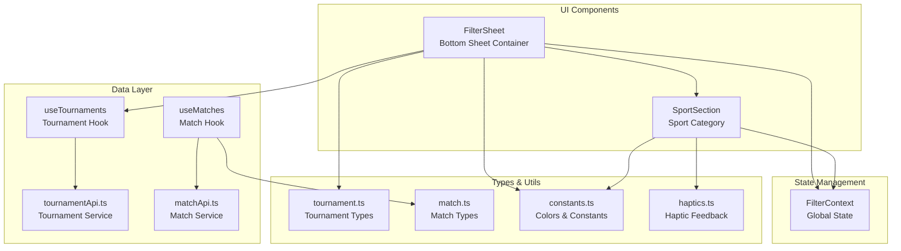
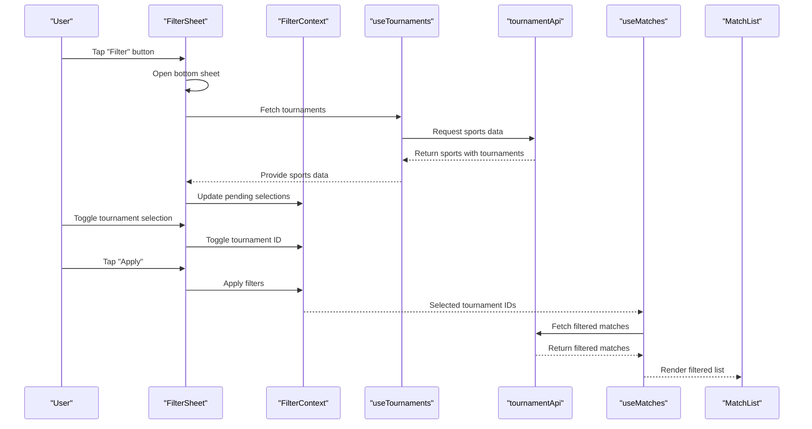
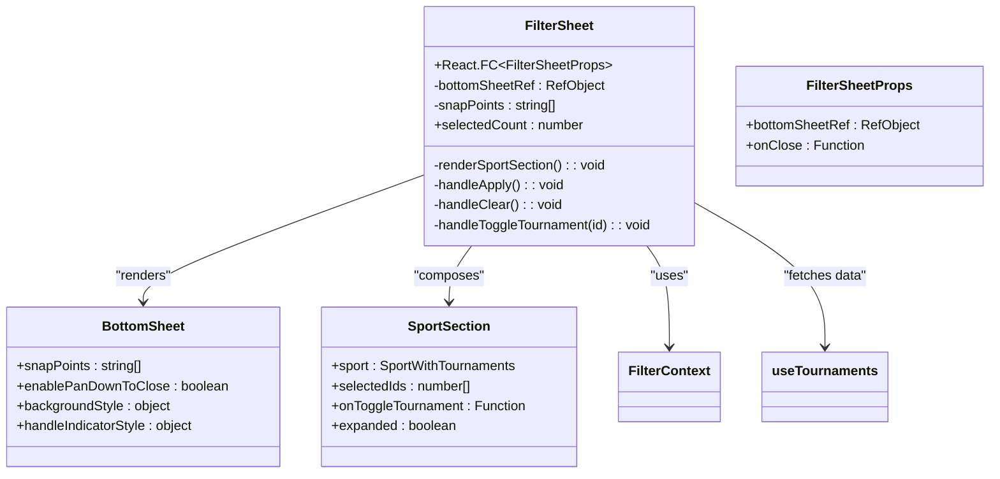
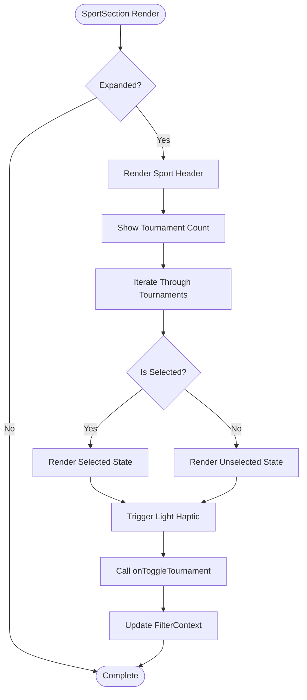
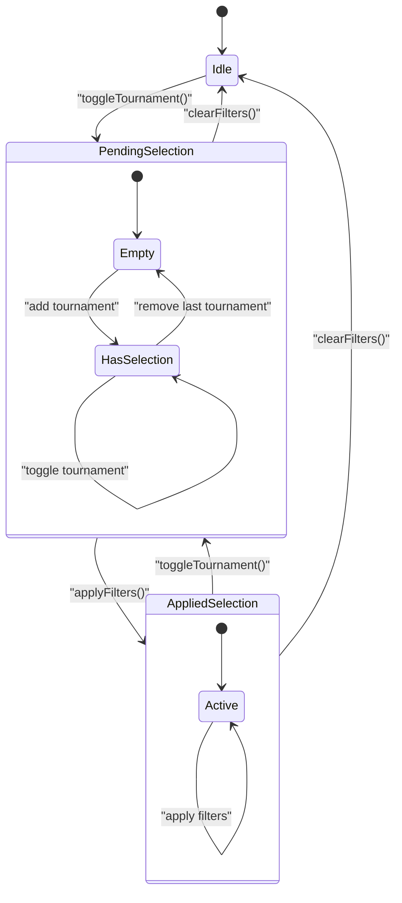
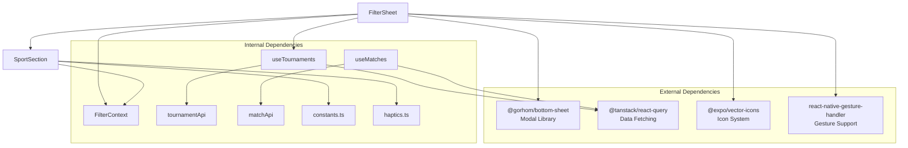

# Filter Components

<cite>
**Referenced Files in This Document**
- [FilterSheet.tsx](file://app/components/filter/FilterSheet.tsx)
- [SportSection.tsx](file://app/components/filter/SportSection.tsx)
- [FilterContext.tsx](file://app/context/FilterContext.tsx)
- [useTournaments.ts](file://app/hooks/useTournaments.ts)
- [useMatches.ts](file://app/hooks/useMatches.ts)
- [index.tsx](file://app/index.tsx)
- [_layout.tsx](file://app/_layout.tsx)
- [tournamentApi.ts](file://app/services/tournamentApi.ts)
- [matchApi.ts](file://app/services/matchApi.ts)
- [constants.ts](file://app/utils/constants.ts)
- [haptics.ts](file://app/utils/haptics.ts)
- [tournament.ts](file://app/types/tournament.ts)
- [match.ts](file://app/types/match.ts)
</cite>

## Table of Contents
1. [Introduction](#introduction)
2. [Project Structure](#project-structure)
3. [Core Components](#core-components)
4. [Architecture Overview](#architecture-overview)
5. [Detailed Component Analysis](#detailed-component-analysis)
6. [Dependency Analysis](#dependency-analysis)
7. [Performance Considerations](#performance-considerations)
8. [Troubleshooting Guide](#troubleshooting-guide)
9. [Conclusion](#conclusion)

## Introduction
This document provides comprehensive documentation for the filter-related UI components that enable tournament-based filtering functionality. It focuses on the FilterSheet component (bottom sheet modal), the SportSection component (sport category organization), and their integration with the FilterContext for state management. The documentation covers modal presentation, gesture handling, multi-select tournament selection, filter application workflow, and user experience considerations for touch interactions and accessibility.

## Project Structure
The filter functionality is implemented across several focused modules:
- FilterSheet: Bottom sheet container that presents tournament options
- SportSection: Individual sport category with expandable tournament list
- FilterContext: Global state management for filter selections
- Hooks: Data fetching for tournaments and matches
- Services: API clients for tournament and match data
- Types: Strongly typed data structures for tournaments and matches

**Diagram sources**
- [FilterSheet.tsx](file://app/components/filter/FilterSheet.tsx#L1-L128)
- [SportSection.tsx](file://app/components/filter/SportSection.tsx#L1-L82)
- [FilterContext.tsx](file://app/context/FilterContext.tsx#L1-L72)
- [useTournaments.ts](file://app/hooks/useTournaments.ts#L1-L45)
- [useMatches.ts](file://app/hooks/useMatches.ts#L1-L56)
- [tournamentApi.ts](file://app/services/tournamentApi.ts#L1-L35)
- [matchApi.ts](file://app/services/matchApi.ts#L1-L36)
- [constants.ts](file://app/utils/constants.ts#L1-L38)
- [haptics.ts](file://app/utils/haptics.ts#L1-L34)
- [tournament.ts](file://app/types/tournament.ts#L1-L31)
- [match.ts](file://app/types/match.ts#L1-L46)

**Section sources**
- [FilterSheet.tsx](file://app/components/filter/FilterSheet.tsx#L1-L128)
- [SportSection.tsx](file://app/components/filter/SportSection.tsx#L1-L82)
- [FilterContext.tsx](file://app/context/FilterContext.tsx#L1-L72)
- [useTournaments.ts](file://app/hooks/useTournaments.ts#L1-L45)
- [useMatches.ts](file://app/hooks/useMatches.ts#L1-L56)

## Core Components
This section analyzes the key components that implement the tournament filtering functionality.

### FilterSheet Component
The FilterSheet component serves as the main bottom sheet interface for tournament selection. It manages:
- Bottom sheet modal behavior with configurable snap points
- Gesture handling for opening/closing and dragging
- Multi-select tournament selection with visual feedback
- Loading and error states for tournament data
- Filter application and reset functionality

Key implementation aspects:
- Uses @gorhom/bottom-sheet for modal presentation
- Implements two snap points (50%, 85%) for flexible positioning
- Supports pan-down-to-close gesture
- Integrates with FilterContext for state management
- Fetches tournament data via useTournaments hook

### SportSection Component
The SportSection component organizes tournaments by sport categories:
- Displays sport name with color-coded indicators
- Shows tournament count for each sport
- Provides expandable section for tournament list
- Implements multi-select with visual checkboxes
- Uses haptic feedback for touch interactions
- Applies sport-specific colors for visual consistency

### FilterContext State Management
The FilterContext provides centralized state management:
- Maintains both pending and applied filter selections
- Supports individual tournament toggling
- Handles bulk tournament selection
- Manages filter clearing and application
- Exposes active filter detection

**Section sources**
- [FilterSheet.tsx](file://app/components/filter/FilterSheet.tsx#L11-L128)
- [SportSection.tsx](file://app/components/filter/SportSection.tsx#L8-L82)
- [FilterContext.tsx](file://app/context/FilterContext.tsx#L3-L72)

## Architecture Overview
The filter system follows a unidirectional data flow with clear separation of concerns:

**Diagram sources**
- [index.tsx](file://app/index.tsx#L27-L33)
- [FilterSheet.tsx](file://app/components/filter/FilterSheet.tsx#L16-L39)
- [FilterContext.tsx](file://app/context/FilterContext.tsx#L26-L43)
- [useTournaments.ts](file://app/hooks/useTournaments.ts#L14-L28)
- [tournamentApi.ts](file://app/services/tournamentApi.ts#L4-L34)
- [useMatches.ts](file://app/hooks/useMatches.ts#L21-L41)
- [matchApi.ts](file://app/services/matchApi.ts#L4-L35)

## Detailed Component Analysis

### FilterSheet Implementation Details
The FilterSheet component implements a comprehensive bottom sheet interface:

**Diagram sources**
- [FilterSheet.tsx](file://app/components/filter/FilterSheet.tsx#L11-L50)
- [SportSection.tsx](file://app/components/filter/SportSection.tsx#L8-L20)

Key features:
- **Modal Presentation**: Configurable snap points (50%, 85%) with visual handle indicator
- **Gesture Handling**: Pan-down-to-close functionality with customizable index
- **Multi-Select Logic**: Individual tournament toggling with visual feedback
- **State Management**: Integration with FilterContext for pending selections
- **Error Handling**: Loading states, error display, and retry mechanism
- **Accessibility**: Proper touch target sizing and visual feedback

### SportSection Organization and Selection
The SportSection component provides structured tournament organization:

**Diagram sources**
- [SportSection.tsx](file://app/components/filter/SportSection.tsx#L15-L76)

Implementation highlights:
- **Sport Organization**: Color-coded sport headers with tournament counts
- **Expandable Sections**: Controlled expansion state for better UX
- **Visual Feedback**: Checkbox indicators with selected/unselected states
- **Touch Interactions**: Haptic feedback for tactile response
- **Accessibility**: Proper contrast ratios and readable text sizes

### FilterContext State Management
The FilterContext implements a dual-state filtering system:

**Diagram sources**
- [FilterContext.tsx](file://app/context/FilterContext.tsx#L20-L63)

State management features:
- **Pending State**: Current selections during bottom sheet session
- **Applied State**: Finalized selections affecting match list
- **Toggle Operations**: Add/remove individual tournament selections
- **Bulk Operations**: Clear all filters and apply pending selections
- **Active Filter Detection**: Boolean flag for UI state updates

**Section sources**
- [FilterSheet.tsx](file://app/components/filter/FilterSheet.tsx#L16-L50)
- [SportSection.tsx](file://app/components/filter/SportSection.tsx#L15-L76)
- [FilterContext.tsx](file://app/context/FilterContext.tsx#L20-L63)

## Dependency Analysis
The filter components have well-defined dependencies that support modularity and maintainability:

**Diagram sources**
- [FilterSheet.tsx](file://app/components/filter/FilterSheet.tsx#L1-L9)
- [SportSection.tsx](file://app/components/filter/SportSection.tsx#L1-L6)
- [FilterContext.tsx](file://app/context/FilterContext.tsx#L1)
- [useTournaments.ts](file://app/hooks/useTournaments.ts#L1-L3)
- [useMatches.ts](file://app/hooks/useMatches.ts#L1-L4)
- [_layout.tsx](file://app/_layout.tsx#L1-L8)

Dependency characteristics:
- **Low Coupling**: Components depend on abstractions rather than concrete implementations
- **Clear Interfaces**: Well-defined props and context contracts
- **External Library Integration**: Strategic use of specialized libraries for complex UI behaviors
- **Type Safety**: Comprehensive TypeScript definitions throughout the system

**Section sources**
- [FilterSheet.tsx](file://app/components/filter/FilterSheet.tsx#L1-L10)
- [SportSection.tsx](file://app/components/filter/SportSection.tsx#L1-L7)
- [FilterContext.tsx](file://app/context/FilterContext.tsx#L1-L1)
- [_layout.tsx](file://app/_layout.tsx#L1-L8)

## Performance Considerations
The filter system implements several performance optimizations:

### Data Fetching Optimizations
- **Caching Strategy**: Tournament data cached for 10 minutes (staleTime: 600000)
- **Background GC**: 30-minute garbage collection period
- **Query Keys**: Unique keys prevent unnecessary re-fetching
- **Pagination**: Infinite scroll for match list with controlled batch rendering

### UI Performance Features
- **Memoization**: SportSection uses React.memo to prevent unnecessary re-renders
- **FlatList Optimization**: Efficient list rendering with windowing and batch rendering
- **Lazy Loading**: Bottom sheet content loads only when opened
- **Image Caching**: Asset caching reduces memory footprint

### State Management Efficiency
- **Separate Pending/Applied States**: Reduces unnecessary re-renders during selection process
- **Callback Memoization**: useCallback prevents function recreation on each render
- **Selective Updates**: Only affected components update when filters change

## Troubleshooting Guide

### Common Issues and Solutions

**Bottom Sheet Not Opening**
- Verify BottomSheetModalProvider is installed at root level
- Check that bottomSheetRef.current is properly initialized
- Ensure snapToIndex is called after component mount

**Tournament Selection Not Working**
- Confirm FilterContext provider wraps the component tree
- Verify toggleTournament function is passed correctly to SportSection
- Check that tournament IDs are numeric and unique

**Filter Not Applying to Match List**
- Ensure applyFilters is called before closing the bottom sheet
- Verify selectedTournamentIds are passed to useMatches hook
- Check that matchApi receives comma-separated tournament IDs

**Performance Issues**
- Monitor console warnings about excessive re-renders
- Verify React.memo is working correctly in SportSection
- Check FlatList optimization parameters (windowSize, maxToRenderPerBatch)

### Accessibility Considerations
The filter system includes several accessibility features:
- **Screen Reader Support**: Proper labeling and semantic structure
- **Touch Target Sizing**: Minimum 44px touch targets for buttons and toggles
- **Color Contrast**: Sufficient contrast ratios for text and interactive elements
- **Focus Management**: Logical tab order and focus indicators
- **Haptic Feedback**: Tactile responses for selection changes

**Section sources**
- [FilterSheet.tsx](file://app/components/filter/FilterSheet.tsx#L55-L124)
- [SportSection.tsx](file://app/components/filter/SportSection.tsx#L45-L71)
- [FilterContext.tsx](file://app/context/FilterContext.tsx#L26-L43)
- [constants.ts](file://app/utils/constants.ts#L23-L37)

## Conclusion
The filter components provide a robust, performant, and user-friendly tournament-based filtering system. The implementation demonstrates excellent separation of concerns with clear component boundaries, comprehensive state management, and thoughtful user experience considerations. The modular architecture supports easy maintenance and future enhancements while maintaining high performance standards.

Key strengths of the implementation include:
- **Modular Design**: Clean separation between UI components and state management
- **Performance Optimization**: Strategic memoization and efficient data fetching
- **User Experience**: Thoughtful gestures, haptic feedback, and visual indicators
- **Accessibility**: Built-in support for screen readers and assistive technologies
- **Extensibility**: Well-defined interfaces for adding new filter types

The system successfully balances functionality with performance, providing users with an intuitive way to discover and filter matches based on their preferred tournaments and sports categories.