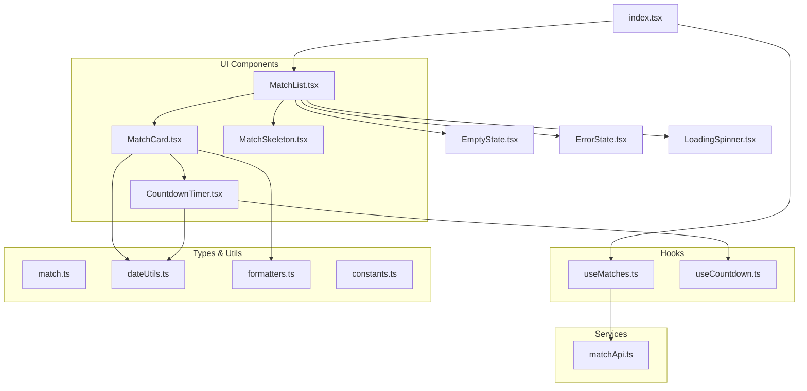
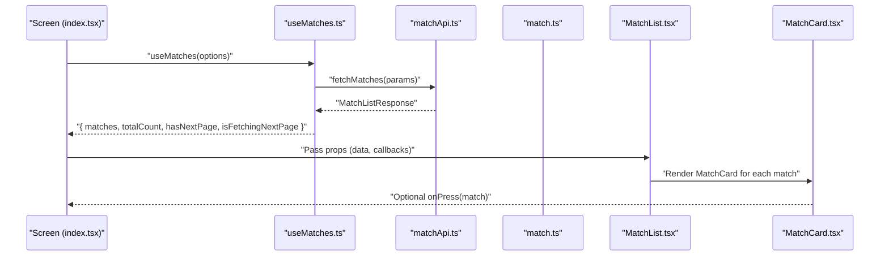
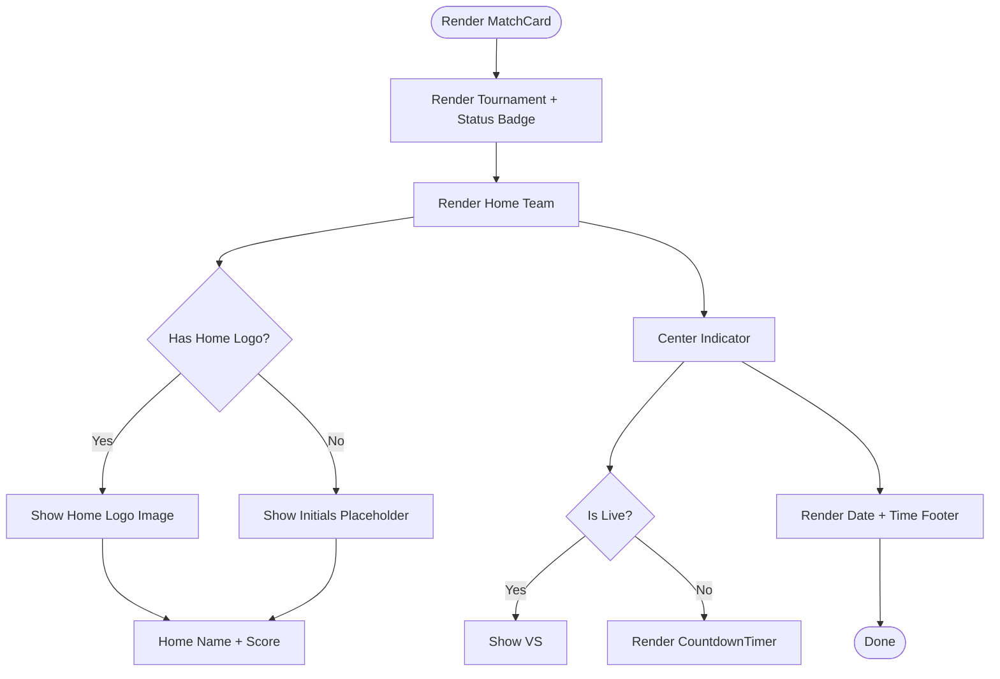
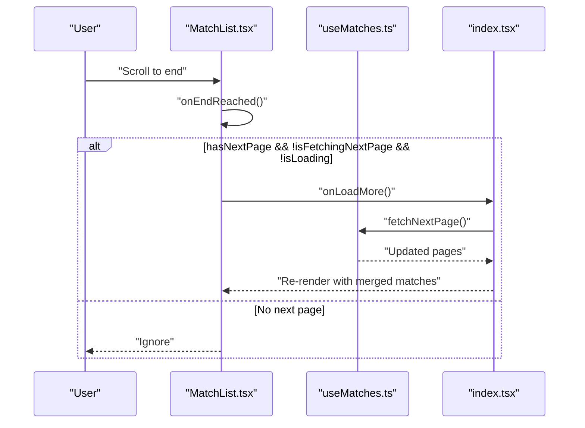
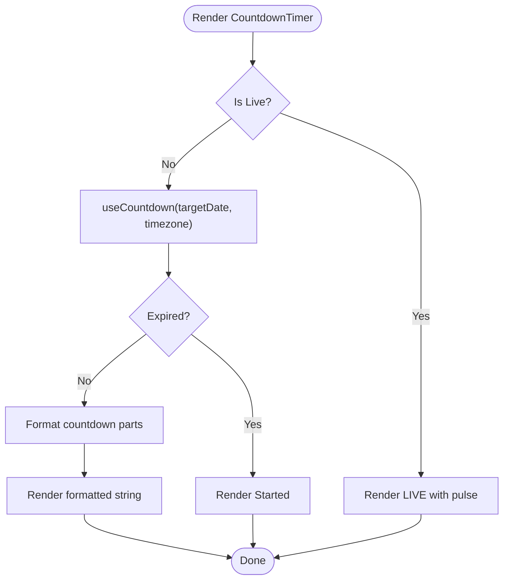
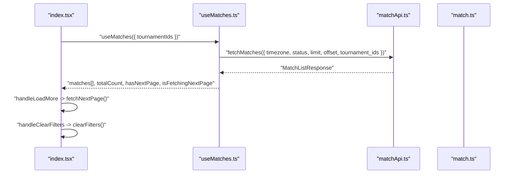
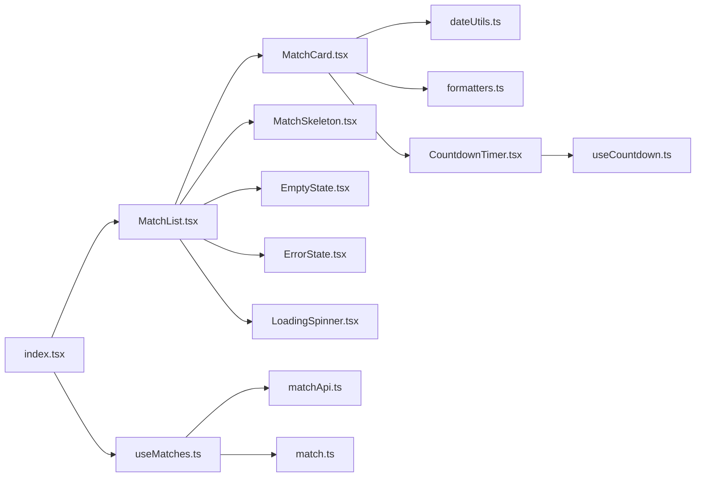

# Match Components

<cite>
**Referenced Files in This Document**
- [MatchCard.tsx](file://app/components/match/MatchCard.tsx)
- [MatchList.tsx](file://app/components/match/MatchList.tsx)
- [CountdownTimer.tsx](file://app/components/match/CountdownTimer.tsx)
- [MatchSkeleton.tsx](file://app/components/match/MatchSkeleton.tsx)
- [useMatches.ts](file://app/hooks/useMatches.ts)
- [useCountdown.ts](file://app/hooks/useCountdown.ts)
- [matchApi.ts](file://app/services/matchApi.ts)
- [match.ts](file://app/types/match.ts)
- [dateUtils.ts](file://app/utils/dateUtils.ts)
- [formatters.ts](file://app/utils/formatters.ts)
- [constants.ts](file://app/utils/constants.ts)
- [index.tsx](file://app/index.tsx)
- [_layout.tsx](file://app/_layout.tsx)
- [EmptyState.tsx](file://app/components/common/EmptyState.tsx)
- [ErrorState.tsx](file://app/components/common/ErrorState.tsx)
- [LoadingSpinner.tsx](file://app/components/common/LoadingSpinner.tsx)
</cite>

## Table of Contents
1. [Introduction](#introduction)
2. [Project Structure](#project-structure)
3. [Core Components](#core-components)
4. [Architecture Overview](#architecture-overview)
5. [Detailed Component Analysis](#detailed-component-analysis)
6. [Dependency Analysis](#dependency-analysis)
7. [Performance Considerations](#performance-considerations)
8. [Troubleshooting Guide](#troubleshooting-guide)
9. [Conclusion](#conclusion)
10. [Appendices](#appendices)

## Introduction
This document provides comprehensive documentation for match-specific UI components responsible for displaying and interacting with sports matches. It covers:
- MatchCard: renders individual match rows with team logos/names, scores, status badges, and time indicators.
- MatchList: manages an infinite scroll list of matches with pagination, pull-to-refresh, and skeleton loading states.
- CountdownTimer: shows countdown or live indicator for a given match start time.
- MatchSkeleton: renders skeleton placeholders during data fetching.
It also explains component props, event handling, integration with data-fetching hooks, responsive design, and accessibility considerations.

## Project Structure
The match UI stack is organized under app/components/match and app/hooks, backed by shared utilities and types. The main screen integrates filtering and data fetching via React Query.

**Diagram sources**
- [MatchCard.tsx](file://app/components/match/MatchCard.tsx#L1-L142)
- [MatchList.tsx](file://app/components/match/MatchList.tsx#L1-L117)
- [CountdownTimer.tsx](file://app/components/match/CountdownTimer.tsx#L1-L43)
- [MatchSkeleton.tsx](file://app/components/match/MatchSkeleton.tsx#L1-L56)
- [useMatches.ts](file://app/hooks/useMatches.ts#L1-L56)
- [useCountdown.ts](file://app/hooks/useCountdown.ts#L1-L54)
- [matchApi.ts](file://app/services/matchApi.ts#L1-L36)
- [match.ts](file://app/types/match.ts#L1-L46)
- [dateUtils.ts](file://app/utils/dateUtils.ts#L1-L64)
- [formatters.ts](file://app/utils/formatters.ts#L1-L47)
- [constants.ts](file://app/utils/constants.ts#L1-L38)
- [index.tsx](file://app/index.tsx#L1-L108)
- [EmptyState.tsx](file://app/components/common/EmptyState.tsx#L1-L52)
- [ErrorState.tsx](file://app/components/common/ErrorState.tsx#L1-L49)
- [LoadingSpinner.tsx](file://app/components/common/LoadingSpinner.tsx#L1-L22)

**Section sources**
- [index.tsx](file://app/index.tsx#L1-L108)
- [_layout.tsx](file://app/_layout.tsx#L1-L35)

## Core Components
- MatchCard: Displays a single match row with tournament info, team logos or initials, scores, VS/live indicator, and formatted date/time. Supports press events via an optional callback prop.
- MatchList: Renders a paginated, scrollable list of matches with pull-to-refresh, footer loading spinner, empty/error/skeleton states, and infinite scroll triggers.
- CountdownTimer: Computes and displays countdown or “LIVE” state based on target start time and current time, using a requestAnimationFrame-driven loop.
- MatchSkeleton: Provides lightweight skeleton placeholders for match cards during loading.

**Section sources**
- [MatchCard.tsx](file://app/components/match/MatchCard.tsx#L10-L142)
- [MatchList.tsx](file://app/components/match/MatchList.tsx#L15-L117)
- [CountdownTimer.tsx](file://app/components/match/CountdownTimer.tsx#L7-L43)
- [MatchSkeleton.tsx](file://app/components/match/MatchSkeleton.tsx#L4-L56)

## Architecture Overview
The UI components integrate with React Query for data fetching and caching, and with shared utilities for formatting and time calculations.

**Diagram sources**
- [index.tsx](file://app/index.tsx#L15-L25)
- [useMatches.ts](file://app/hooks/useMatches.ts#L13-L55)
- [matchApi.ts](file://app/services/matchApi.ts#L4-L35)
- [match.ts](file://app/types/match.ts#L16-L45)
- [MatchList.tsx](file://app/components/match/MatchList.tsx#L27-L114)
- [MatchCard.tsx](file://app/components/match/MatchCard.tsx#L15-L137)

## Detailed Component Analysis

### MatchCard Component
- Purpose: Render a single match row with team information, scores, status badge, and time indicator.
- Props:
  - match: Match object containing teams, tournament, status, and timing.
  - onPress?: Callback invoked when the card is pressed.
- Rendering logic:
  - Tournament name and status badge with color-coded label.
  - Home/Away team sections with either logo image or initials placeholder.
  - Score display if present.
  - Center indicator: “VS” for live matches, otherwise CountdownTimer.
  - Footer with formatted date and time.
- Accessibility and responsiveness:
  - Uses numberOfLines to prevent layout overflow.
  - Tailwind classes provide spacing and alignment; responsive via flex utilities.
  - Touch target sizing via container padding and margins.
- Integration:
  - Consumes status formatting helpers and date formatting utilities.
  - Uses media base URL for logos and fallback initials.

**Diagram sources**
- [MatchCard.tsx](file://app/components/match/MatchCard.tsx#L23-L136)
- [dateUtils.ts](file://app/utils/dateUtils.ts#L13-L20)
- [formatters.ts](file://app/utils/formatters.ts#L22-L46)

**Section sources**
- [MatchCard.tsx](file://app/components/match/MatchCard.tsx#L10-L142)
- [match.ts](file://app/types/match.ts#L1-L46)
- [formatters.ts](file://app/utils/formatters.ts#L15-L46)
- [dateUtils.ts](file://app/utils/dateUtils.ts#L4-L20)
- [constants.ts](file://app/utils/constants.ts#L1-L38)

### MatchList Component
- Purpose: Infinite scroll list of matches with loading, empty, and error states.
- Props:
  - matches: Array of Match.
  - isLoading: Boolean indicating initial load.
  - isError: Boolean indicating fetch error.
  - isFetchingNextPage: Boolean indicating pagination fetch.
  - hasNextPage: Boolean indicating more pages.
  - onRefresh: Function to refetch data.
  - onLoadMore: Function to fetch next page.
  - onClearFilters?: Optional handler to clear filters.
  - isFiltered?: Boolean flag for filtered state.
- Behavior:
  - Pull-to-refresh via RefreshControl.
  - Infinite scroll triggered when near end (threshold 0.5).
  - Footer spinner while fetching next page.
  - Empty state: skeleton loader on initial load, error state on error, or empty state with optional action.
- Performance optimizations:
  - FlatList configuration includes removeClippedSubviews, maxToRenderPerBatch, windowSize, initialNumToRender.
  - Stable key extraction using match id and matchId.
  - Memoized item renderer.

**Diagram sources**
- [MatchList.tsx](file://app/components/match/MatchList.tsx#L83-L87)
- [useMatches.ts](file://app/hooks/useMatches.ts#L34-L41)
- [index.tsx](file://app/index.tsx#L35-L39)

**Section sources**
- [MatchList.tsx](file://app/components/match/MatchList.tsx#L15-L117)
- [EmptyState.tsx](file://app/components/common/EmptyState.tsx#L6-L52)
- [ErrorState.tsx](file://app/components/common/ErrorState.tsx#L6-L49)
- [LoadingSpinner.tsx](file://app/components/common/LoadingSpinner.tsx#L5-L22)

### CountdownTimer Component
- Purpose: Real-time countdown or live indicator for a match’s start time.
- Props:
  - targetDate: ISO string for match start.
  - timezone: String for timezone-aware calculations.
  - matchStatus: Current status string.
- Logic:
  - Delegates time calculation to useCountdown hook.
  - If match is live, renders a pulsing “LIVE” indicator.
  - If expired, renders a static “Started” label.
  - Otherwise, renders a formatted countdown string inside a subtle background box.
- Hook integration:
  - useCountdown uses requestAnimationFrame to update every second and cancels animation frame on unmount.

**Diagram sources**
- [CountdownTimer.tsx](file://app/components/match/CountdownTimer.tsx#L13-L38)
- [useCountdown.ts](file://app/hooks/useCountdown.ts#L10-L54)
- [dateUtils.ts](file://app/utils/dateUtils.ts#L22-L51)

**Section sources**
- [CountdownTimer.tsx](file://app/components/match/CountdownTimer.tsx#L7-L43)
- [useCountdown.ts](file://app/hooks/useCountdown.ts#L10-L54)
- [dateUtils.ts](file://app/utils/dateUtils.ts#L22-L51)

### MatchSkeleton Component
- Purpose: Provide skeleton placeholders while matches are loading.
- Features:
  - Single skeleton card with tournament header, team sections, and date footer.
  - List variant to render multiple skeletons efficiently.
- Implementation:
  - Uses gray background boxes to simulate content areas.
  - Memoized for performance.

**Section sources**
- [MatchSkeleton.tsx](file://app/components/match/MatchSkeleton.tsx#L4-L56)

### Data Fetching and Pagination
- useMatches:
  - Uses React Query infinite query to fetch paginated match lists.
  - Builds query key from timezone, status, and tournament IDs.
  - Calculates next page offset based on returned total and limit.
  - Exposes merged matches array, total count, and pagination booleans.
- matchApi:
  - Constructs URL query parameters and calls backend sports match list endpoint.
  - Returns normalized response with matches, total, offset, and limit.
- Integration in index:
  - Passes query results and handlers to MatchList.
  - Handles load-more and clear-filters actions.

**Diagram sources**
- [useMatches.ts](file://app/hooks/useMatches.ts#L13-L55)
- [matchApi.ts](file://app/services/matchApi.ts#L4-L35)
- [match.ts](file://app/types/match.ts#L31-L45)
- [index.tsx](file://app/index.tsx#L23-L43)

**Section sources**
- [useMatches.ts](file://app/hooks/useMatches.ts#L1-L56)
- [matchApi.ts](file://app/services/matchApi.ts#L1-L36)
- [match.ts](file://app/types/match.ts#L1-L46)
- [index.tsx](file://app/index.tsx#L15-L43)

## Dependency Analysis
- Component dependencies:
  - MatchCard depends on date/time formatting, status formatters, constants, and CountdownTimer.
  - MatchList depends on MatchCard, skeleton components, and common state components.
  - CountdownTimer depends on useCountdown and date utilities.
  - useMatches depends on matchApi and types.
- External libraries:
  - React Native FlatList for virtualized list rendering.
  - Expo Image for optimized image loading.
  - React Query for caching and pagination.
  - date-fns/date-fns-tz for timezone-aware date operations.

**Diagram sources**
- [MatchCard.tsx](file://app/components/match/MatchCard.tsx#L1-L142)
- [MatchList.tsx](file://app/components/match/MatchList.tsx#L1-L117)
- [CountdownTimer.tsx](file://app/components/match/CountdownTimer.tsx#L1-L43)
- [MatchSkeleton.tsx](file://app/components/match/MatchSkeleton.tsx#L1-L56)
- [useMatches.ts](file://app/hooks/useMatches.ts#L1-L56)
- [matchApi.ts](file://app/services/matchApi.ts#L1-L36)
- [match.ts](file://app/types/match.ts#L1-L46)
- [dateUtils.ts](file://app/utils/dateUtils.ts#L1-L64)
- [formatters.ts](file://app/utils/formatters.ts#L1-L47)
- [index.tsx](file://app/index.tsx#L1-L108)

**Section sources**
- [MatchCard.tsx](file://app/components/match/MatchCard.tsx#L1-L142)
- [MatchList.tsx](file://app/components/match/MatchList.tsx#L1-L117)
- [CountdownTimer.tsx](file://app/components/match/CountdownTimer.tsx#L1-L43)
- [MatchSkeleton.tsx](file://app/components/match/MatchSkeleton.tsx#L1-L56)
- [useMatches.ts](file://app/hooks/useMatches.ts#L1-L56)
- [matchApi.ts](file://app/services/matchApi.ts#L1-L36)
- [match.ts](file://app/types/match.ts#L1-L46)
- [dateUtils.ts](file://app/utils/dateUtils.ts#L1-L64)
- [formatters.ts](file://app/utils/formatters.ts#L1-L47)
- [index.tsx](file://app/index.tsx#L1-L108)

## Performance Considerations
- Virtualization and batching:
  - FlatList configured with removeClippedSubviews, maxToRenderPerBatch, windowSize, initialNumToRender to optimize rendering.
- Memoization:
  - Components use memo to avoid unnecessary re-renders.
  - useCallback for renderers and key extractors.
- Image optimization:
  - Expo Image with transitions and placeholders reduces perceived loading time.
- Animation frame updates:
  - useCountdown uses requestAnimationFrame to minimize CPU overhead while keeping updates smooth.
- Pagination:
  - Infinite scrolling with threshold prevents redundant loads and improves UX.

[No sources needed since this section provides general guidance]

## Troubleshooting Guide
- Countdown does not update:
  - Verify targetDate and timezone props are valid ISO string and recognized timezone.
  - Confirm useCountdown hook runs and animation frame is canceled on unmount.
- Match list not loading more:
  - Ensure hasNextPage is true and isFetchingNextPage is false when reaching the end.
  - Confirm onLoadMore calls fetchNextPage and that query keys include filters.
- Images not showing:
  - Check MEDIA_BASE_URL and presence of logo URLs in team objects.
- Status badge color incorrect:
  - Ensure matchStatus values match expected enums and formatters map to correct colors.

**Section sources**
- [useCountdown.ts](file://app/hooks/useCountdown.ts#L10-L54)
- [MatchList.tsx](file://app/components/match/MatchList.tsx#L83-L87)
- [formatters.ts](file://app/utils/formatters.ts#L22-L46)
- [constants.ts](file://app/utils/constants.ts#L6-L21)

## Conclusion
The match UI components provide a robust, performant, and accessible way to display and interact with sports matches. They leverage React Query for efficient data fetching, memoization and FlatList for performance, and shared utilities for consistent formatting. The integration with filtering and timezone-aware calculations ensures a scalable foundation for future enhancements.

[No sources needed since this section summarizes without analyzing specific files]

## Appendices

### Component Prop Interfaces
- MatchCardProps
  - match: Match
  - onPress?: (match: Match) => void
- MatchListProps
  - matches: Match[]
  - isLoading: boolean
  - isError: boolean
  - isFetchingNextPage: boolean
  - hasNextPage: boolean
  - onRefresh: () => void
  - onLoadMore: () => void
  - onClearFilters?: () => void
  - isFiltered?: boolean
- CountdownTimerProps
  - targetDate: string
  - timezone: string
  - matchStatus: string
- MatchSkeletonListProps
  - count?: number

**Section sources**
- [MatchCard.tsx](file://app/components/match/MatchCard.tsx#L10-L13)
- [MatchList.tsx](file://app/components/match/MatchList.tsx#L15-L25)
- [CountdownTimer.tsx](file://app/components/match/CountdownTimer.tsx#L7-L11)
- [MatchSkeleton.tsx](file://app/components/match/MatchSkeleton.tsx#L45-L53)

### Event Handling Patterns
- onPress in MatchCard delegates to parent-provided callback.
- onRefresh in MatchList triggers refetch via React Query.
- onLoadMore in MatchList triggers fetchNextPage when conditions are met.
- onClearFilters in MatchList clears filter context and resets selection.

**Section sources**
- [MatchCard.tsx](file://app/components/match/MatchCard.tsx#L15-L18)
- [MatchList.tsx](file://app/components/match/MatchList.tsx#L27-L37)
- [index.tsx](file://app/index.tsx#L35-L43)

### Responsive Design and Accessibility Notes
- Responsive:
  - Flexbox-based layouts adapt to various widths; Tailwind utilities manage spacing and alignment.
- Accessibility:
  - Touch targets sized appropriately; numberOfLines prevents layout shifts.
  - Semantic text and icons complement interactive elements.

[No sources needed since this section provides general guidance]