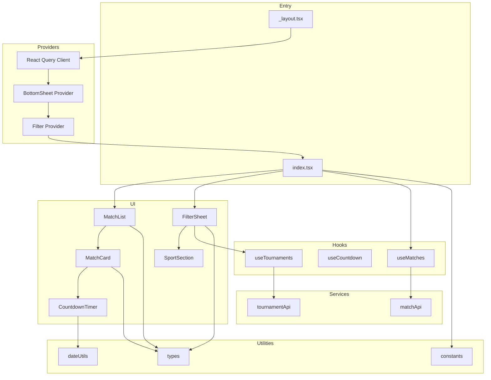
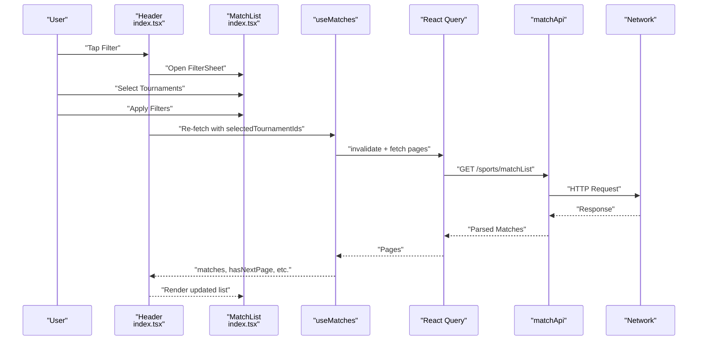
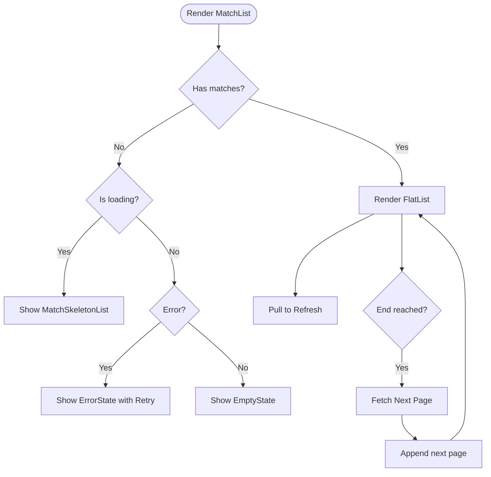
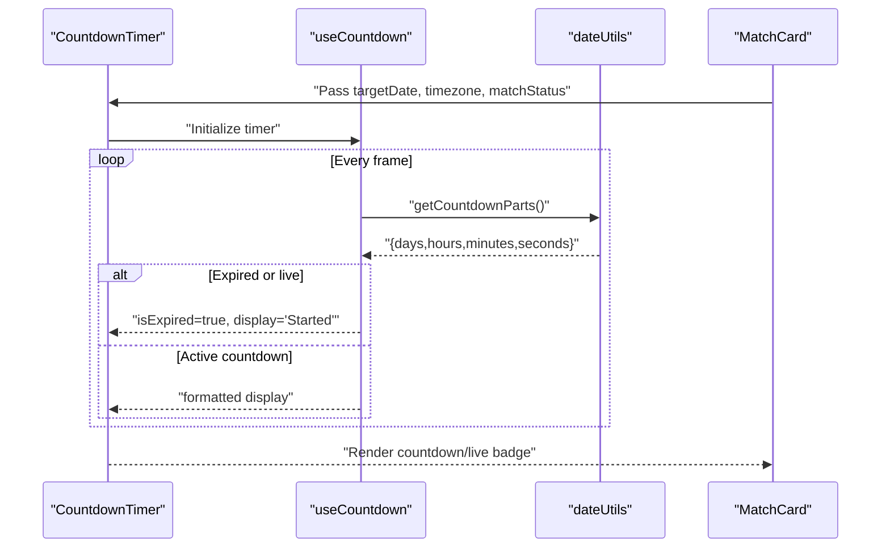
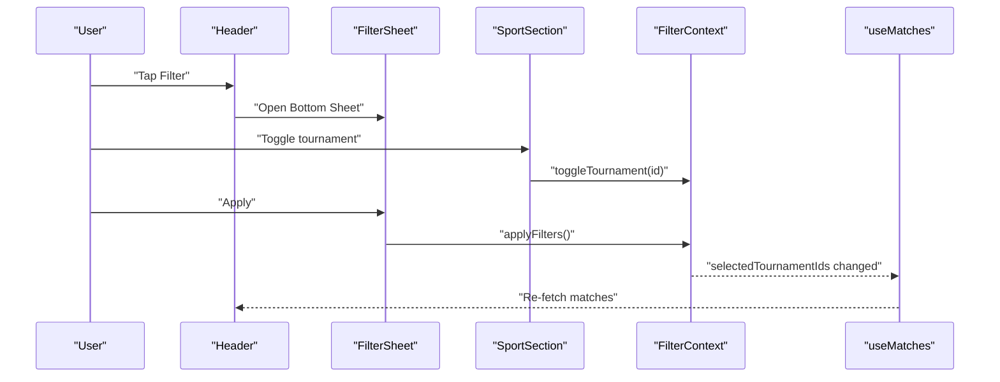
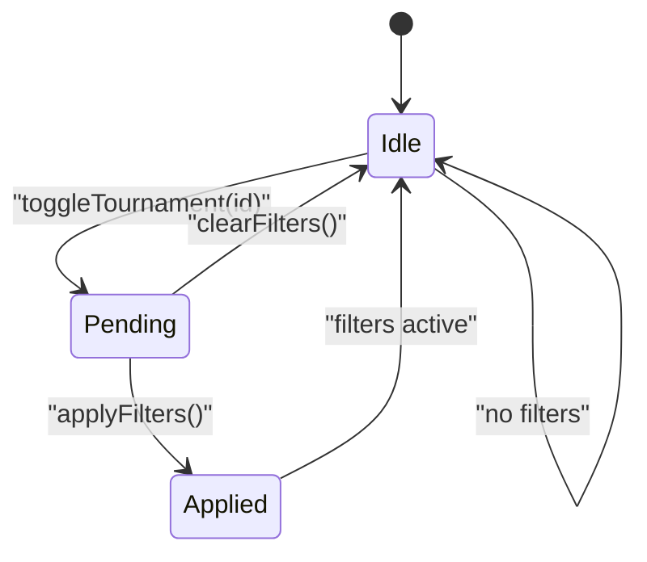
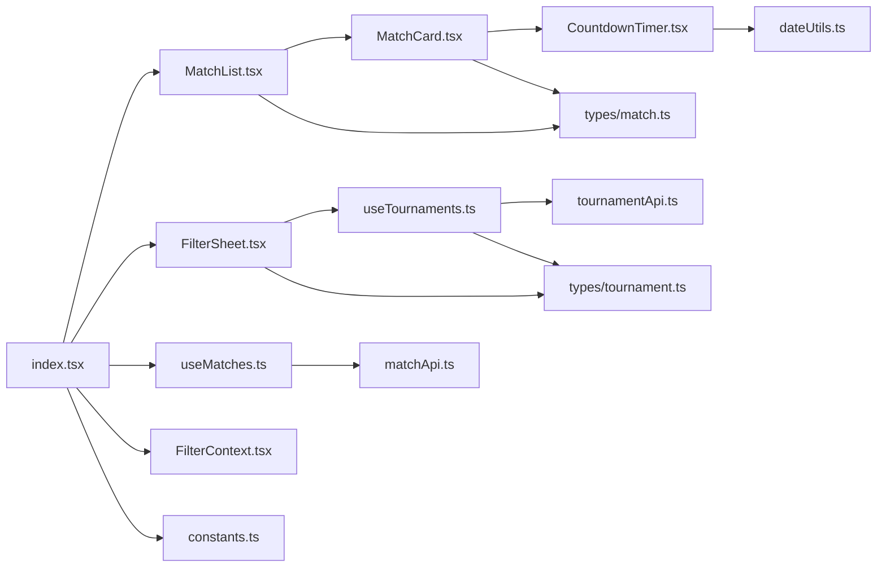

# Core Features

<cite>
**Referenced Files in This Document**
- [app/index.tsx](file://app/index.tsx)
- [app/_layout.tsx](file://app/_layout.tsx)
- [app/context/FilterContext.tsx](file://app/context/FilterContext.tsx)
- [app/hooks/useMatches.ts](file://app/hooks/useMatches.ts)
- [app/hooks/useCountdown.ts](file://app/hooks/useCountdown.ts)
- [app/hooks/useTournaments.ts](file://app/hooks/useTournaments.ts)
- [app/components/match/MatchList.tsx](file://app/components/match/MatchList.tsx)
- [app/components/match/MatchCard.tsx](file://app/components/match/MatchCard.tsx)
- [app/components/match/CountdownTimer.tsx](file://app/components/match/CountdownTimer.tsx)
- [app/components/filter/FilterSheet.tsx](file://app/components/filter/FilterSheet.tsx)
- [app/components/filter/SportSection.tsx](file://app/components/filter/SportSection.tsx)
- [app/services/matchApi.ts](file://app/services/matchApi.ts)
- [app/services/tournamentApi.ts](file://app/services/tournamentApi.ts)
- [app/utils/dateUtils.ts](file://app/utils/dateUtils.ts)
- [app/utils/constants.ts](file://app/utils/constants.ts)
- [app/types/match.ts](file://app/types/match.ts)
- [app/types/tournament.ts](file://app/types/tournament.ts)
</cite>

## Table of Contents
1. [Introduction](#introduction)
2. [Project Structure](#project-structure)
3. [Core Components](#core-components)
4. [Architecture Overview](#architecture-overview)
5. [Detailed Component Analysis](#detailed-component-analysis)
6. [Dependency Analysis](#dependency-analysis)
7. [Performance Considerations](#performance-considerations)
8. [Troubleshooting Guide](#troubleshooting-guide)
9. [Conclusion](#conclusion)

## Introduction
This document explains the core features of the sports match application, focusing on:
- Match display system with infinite scroll and pagination
- Countdown timer system for live match tracking
- Tournament filtering with multi-select capabilities
- State management for filter persistence

It also documents how components, hooks, and services integrate to deliver a cohesive user experience, along with performance considerations, optimization strategies, and error handling approaches.

## Project Structure
The application follows a modular structure:
- Entry layout initializes providers for query caching, bottom sheet modals, and filter state.
- The main screen composes the header, match list, and filter bottom sheet.
- Hooks encapsulate data fetching and timers.
- Services abstract API communication.
- Utilities provide formatting, time zone handling, and constants.
- Types define the shape of match and tournament data.

**Diagram sources**
- [app/_layout.tsx](file://app/_layout.tsx#L1-L35)
- [app/index.tsx](file://app/index.tsx#L1-L108)
- [app/components/match/MatchList.tsx](file://app/components/match/MatchList.tsx#L1-L117)
- [app/components/match/MatchCard.tsx](file://app/components/match/MatchCard.tsx#L1-L142)
- [app/components/match/CountdownTimer.tsx](file://app/components/match/CountdownTimer.tsx#L1-L43)
- [app/components/filter/FilterSheet.tsx](file://app/components/filter/FilterSheet.tsx#L1-L128)
- [app/components/filter/SportSection.tsx](file://app/components/filter/SportSection.tsx#L1-L82)
- [app/hooks/useMatches.ts](file://app/hooks/useMatches.ts#L1-L56)
- [app/hooks/useCountdown.ts](file://app/hooks/useCountdown.ts#L1-L54)
- [app/hooks/useTournaments.ts](file://app/hooks/useTournaments.ts#L1-L45)
- [app/services/matchApi.ts](file://app/services/matchApi.ts#L1-L36)
- [app/services/tournamentApi.ts](file://app/services/tournamentApi.ts#L1-L35)
- [app/utils/dateUtils.ts](file://app/utils/dateUtils.ts#L1-L64)
- [app/utils/constants.ts](file://app/utils/constants.ts#L1-L38)
- [app/types/match.ts](file://app/types/match.ts#L1-L46)
- [app/types/tournament.ts](file://app/types/tournament.ts#L1-L31)

**Section sources**
- [app/_layout.tsx](file://app/_layout.tsx#L1-L35)
- [app/index.tsx](file://app/index.tsx#L1-L108)

## Core Components
- Match display system: Renders a paginated, infinite-scrolling list of matches with pull-to-refresh and skeleton loading.
- Countdown timer: Tracks time until kickoff and displays “LIVE” when appropriate.
- Tournament filtering: Presents a bottom sheet with sports and tournaments for multi-selection with apply/clear actions.
- State management: Centralized filter state persists across navigation and survives re-renders.

**Section sources**
- [app/components/match/MatchList.tsx](file://app/components/match/MatchList.tsx#L1-L117)
- [app/components/match/CountdownTimer.tsx](file://app/components/match/CountdownTimer.tsx#L1-L43)
- [app/components/filter/FilterSheet.tsx](file://app/components/filter/FilterSheet.tsx#L1-L128)
- [app/context/FilterContext.tsx](file://app/context/FilterContext.tsx#L1-L72)

## Architecture Overview
The system integrates UI, hooks, services, and utilities as follows:
- Providers initialize query caching and modal support.
- The main screen composes the header, match list, and filter sheet.
- Hooks encapsulate data fetching and timers.
- Services abstract network requests.
- Utilities centralize formatting and constants.
- Types define data contracts.

**Diagram sources**
- [app/index.tsx](file://app/index.tsx#L11-L107)
- [app/hooks/useMatches.ts](file://app/hooks/useMatches.ts#L13-L55)
- [app/services/matchApi.ts](file://app/services/matchApi.ts#L4-L35)

## Detailed Component Analysis

### Match Display System (Infinite Scroll and Pagination)
- Uses an infinite query hook to paginate matches with configurable page size and offset.
- The list supports pull-to-refresh and loads more when nearing the end.
- Empty states, errors, and skeletons are handled gracefully.
- Optimizations include FlatList windowing, batch rendering, and clipping.

**Diagram sources**
- [app/components/match/MatchList.tsx](file://app/components/match/MatchList.tsx#L27-L113)
- [app/hooks/useMatches.ts](file://app/hooks/useMatches.ts#L21-L41)

**Section sources**
- [app/components/match/MatchList.tsx](file://app/components/match/MatchList.tsx#L1-L117)
- [app/hooks/useMatches.ts](file://app/hooks/useMatches.ts#L1-L56)
- [app/services/matchApi.ts](file://app/services/matchApi.ts#L1-L36)
- [app/types/match.ts](file://app/types/match.ts#L31-L45)

### Countdown Timer System (Live Match Tracking)
- Computes time until kickoff and updates via animation frames with minimal 1-second granularity.
- Switches to “LIVE” indicator when the match is live.
- Integrates with match cards to show either countdown or live badge.

**Diagram sources**
- [app/components/match/CountdownTimer.tsx](file://app/components/match/CountdownTimer.tsx#L13-L38)
- [app/hooks/useCountdown.ts](file://app/hooks/useCountdown.ts#L10-L53)
- [app/utils/dateUtils.ts](file://app/utils/dateUtils.ts#L22-L51)

**Section sources**
- [app/components/match/CountdownTimer.tsx](file://app/components/match/CountdownTimer.tsx#L1-L43)
- [app/hooks/useCountdown.ts](file://app/hooks/useCountdown.ts#L1-L54)
- [app/utils/dateUtils.ts](file://app/utils/dateUtils.ts#L1-L64)
- [app/components/match/MatchCard.tsx](file://app/components/match/MatchCard.tsx#L83-L91)

### Tournament Filtering (Multi-Select)
- Loads sports and tournaments via a dedicated hook and service.
- Bottom sheet presents sports with collapsible tournament lists.
- Multi-select toggles are persisted in a pending set until applied.
- Applying filters updates the main match list via the shared filter context.

**Diagram sources**
- [app/components/filter/FilterSheet.tsx](file://app/components/filter/FilterSheet.tsx#L16-L50)
- [app/components/filter/SportSection.tsx](file://app/components/filter/SportSection.tsx#L15-L76)
- [app/context/FilterContext.tsx](file://app/context/FilterContext.tsx#L26-L43)
- [app/hooks/useTournaments.ts](file://app/hooks/useTournaments.ts#L11-L28)
- [app/hooks/useMatches.ts](file://app/hooks/useMatches.ts#L13-L29)

**Section sources**
- [app/components/filter/FilterSheet.tsx](file://app/components/filter/FilterSheet.tsx#L1-L128)
- [app/components/filter/SportSection.tsx](file://app/components/filter/SportSection.tsx#L1-L82)
- [app/context/FilterContext.tsx](file://app/context/FilterContext.tsx#L1-L72)
- [app/hooks/useTournaments.ts](file://app/hooks/useTournaments.ts#L1-L45)
- [app/services/tournamentApi.ts](file://app/services/tournamentApi.ts#L1-L35)
- [app/types/tournament.ts](file://app/types/tournament.ts#L6-L20)

### State Management for Filter Persistence
- Filter provider maintains two sets: current selection and pending selection.
- Toggling updates the pending set; applying commits to current selection.
- Clearing resets both sets and removes filters from the match query.

**Diagram sources**
- [app/context/FilterContext.tsx](file://app/context/FilterContext.tsx#L26-L43)

**Section sources**
- [app/context/FilterContext.tsx](file://app/context/FilterContext.tsx#L1-L72)

## Dependency Analysis
- UI depends on hooks for data and timers.
- Hooks depend on services for API calls and utilities for formatting.
- Services depend on the base API client and return typed responses.
- Types define contracts across the system.

**Diagram sources**
- [app/index.tsx](file://app/index.tsx#L1-L108)
- [app/components/match/MatchList.tsx](file://app/components/match/MatchList.tsx#L1-L117)
- [app/components/match/MatchCard.tsx](file://app/components/match/MatchCard.tsx#L1-L142)
- [app/components/match/CountdownTimer.tsx](file://app/components/match/CountdownTimer.tsx#L1-L43)
- [app/components/filter/FilterSheet.tsx](file://app/components/filter/FilterSheet.tsx#L1-L128)
- [app/hooks/useMatches.ts](file://app/hooks/useMatches.ts#L1-L56)
- [app/hooks/useTournaments.ts](file://app/hooks/useTournaments.ts#L1-L45)
- [app/services/matchApi.ts](file://app/services/matchApi.ts#L1-L36)
- [app/services/tournamentApi.ts](file://app/services/tournamentApi.ts#L1-L35)
- [app/utils/dateUtils.ts](file://app/utils/dateUtils.ts#L1-L64)
- [app/context/FilterContext.tsx](file://app/context/FilterContext.tsx#L1-L72)
- [app/types/match.ts](file://app/types/match.ts#L1-L46)
- [app/types/tournament.ts](file://app/types/tournament.ts#L1-L31)
- [app/utils/constants.ts](file://app/utils/constants.ts#L1-L38)

**Section sources**
- [app/_layout.tsx](file://app/_layout.tsx#L1-L35)
- [app/index.tsx](file://app/index.tsx#L1-L108)

## Performance Considerations
- Infinite pagination: Configurable page size and offset reduce payload sizes; query caching avoids redundant requests.
- Rendering: FlatList windowing, batch rendering, and clipped subviews improve scroll performance.
- Timers: Animation frames update at approximately 1Hz to balance accuracy and performance.
- Caching: Query client defaults with retry and stale/gc times minimize network churn.
- Images: Lazy image loading with placeholders improves perceived performance.

Recommendations:
- Increase initial render batch and window size gradually for very long lists.
- Debounce filter toggles if the tournament list becomes large.
- Consider virtualization strategies for dense lists of cards.

**Section sources**
- [app/hooks/useMatches.ts](file://app/hooks/useMatches.ts#L34-L41)
- [app/components/match/MatchList.tsx](file://app/components/match/MatchList.tsx#L108-L112)
- [app/hooks/useCountdown.ts](file://app/hooks/useCountdown.ts#L14-L50)
- [app/_layout.tsx](file://app/_layout.tsx#L10-L17)

## Troubleshooting Guide
Common issues and resolutions:
- No matches found when filters are active:
  - Clear filters from the header or bottom sheet footer.
  - Verify that the selected tournament IDs are valid and supported.
- Network failures:
  - Retry from the error state in the list or bottom sheet.
  - Inspect query client retry settings and stale time.
- Timer not updating:
  - Ensure the target date is valid and timezone is correct.
  - Confirm the timer is not expired; expired timers switch to a static label.
- Bottom sheet not opening:
  - Confirm provider wrapping order and ref initialization.
  - Ensure snap points and pan-down-to-close are configured.

**Section sources**
- [app/components/match/MatchList.tsx](file://app/components/match/MatchList.tsx#L56-L81)
- [app/components/filter/FilterSheet.tsx](file://app/components/filter/FilterSheet.tsx#L78-L91)
- [app/hooks/useCountdown.ts](file://app/hooks/useCountdown.ts#L23-L31)
- [app/_layout.tsx](file://app/_layout.tsx#L22-L31)

## Conclusion
The application combines robust data fetching with efficient UI rendering and intuitive filtering. The integration of hooks, services, and providers ensures a responsive and consistent experience. By leveraging infinite pagination, optimized rendering, and precise timer updates, the system delivers a smooth user experience while maintaining clear separation of concerns across modules.