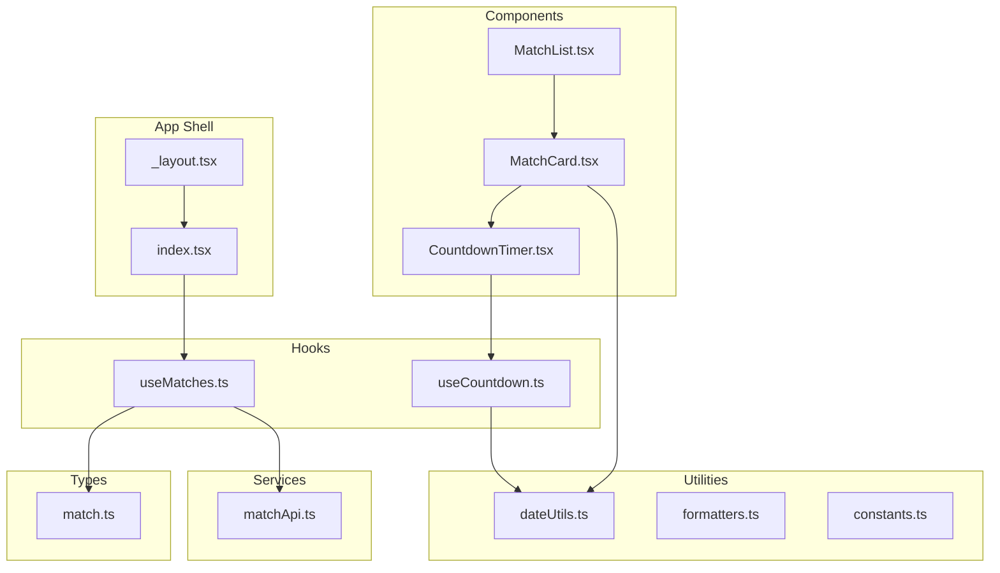
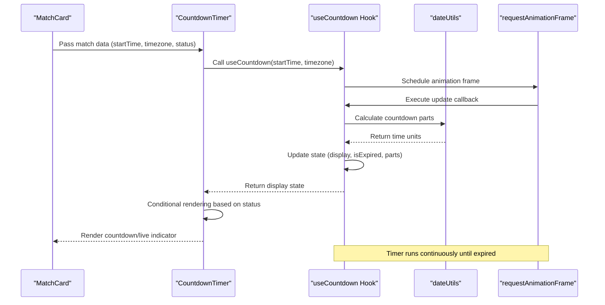
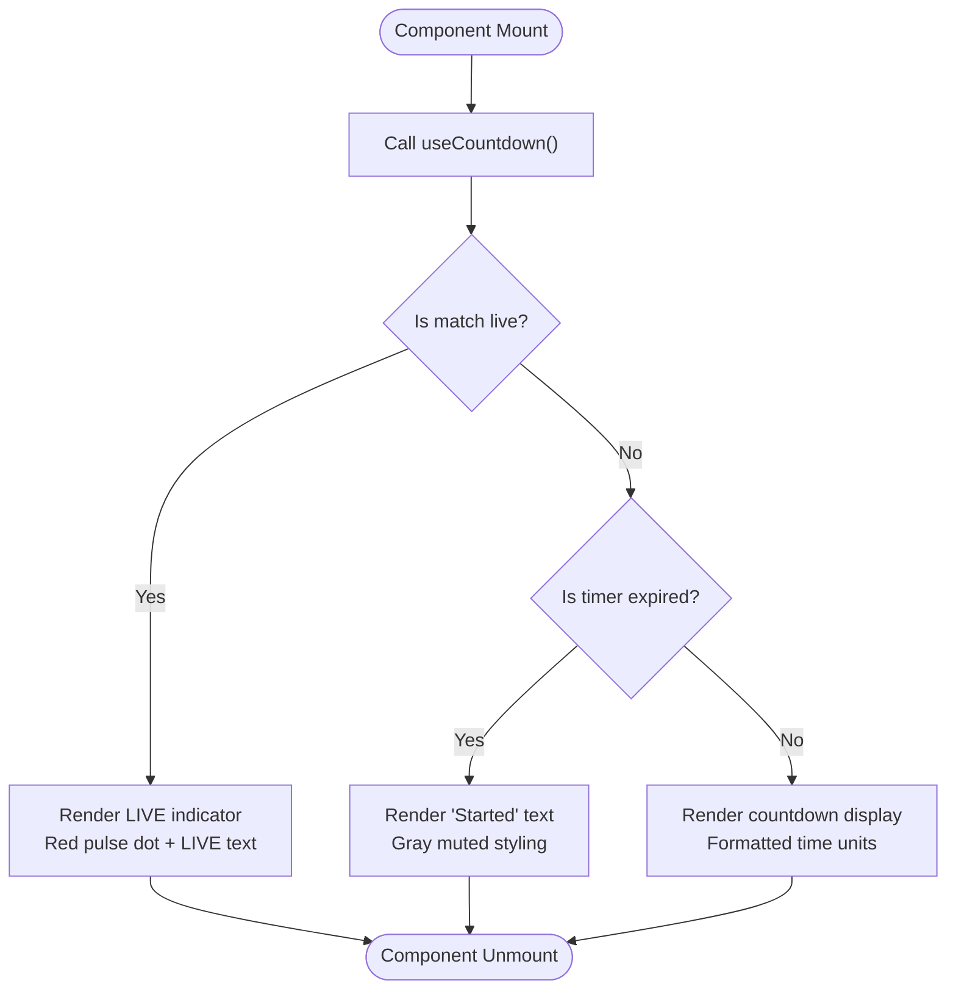
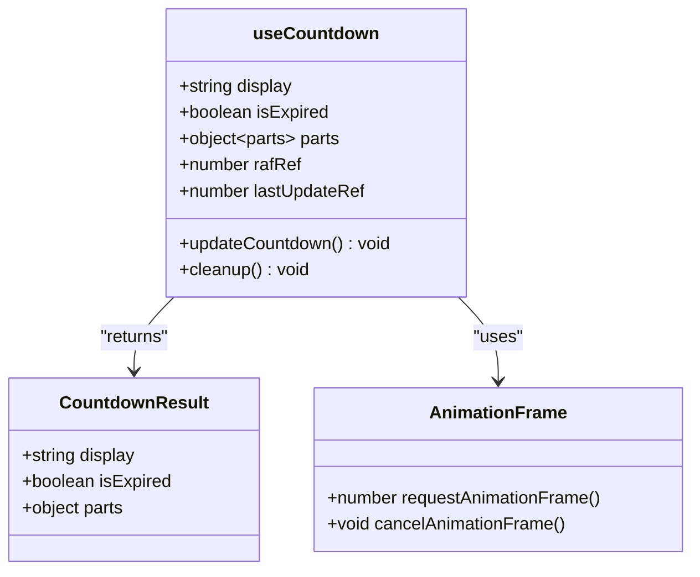
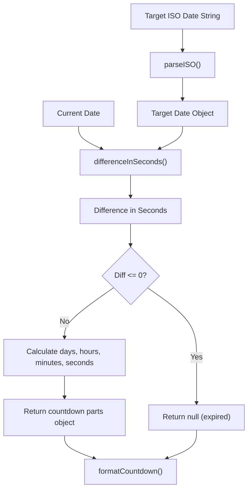
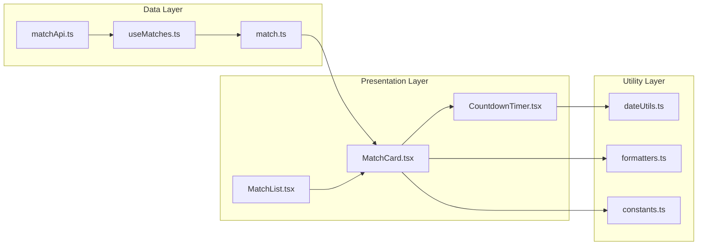
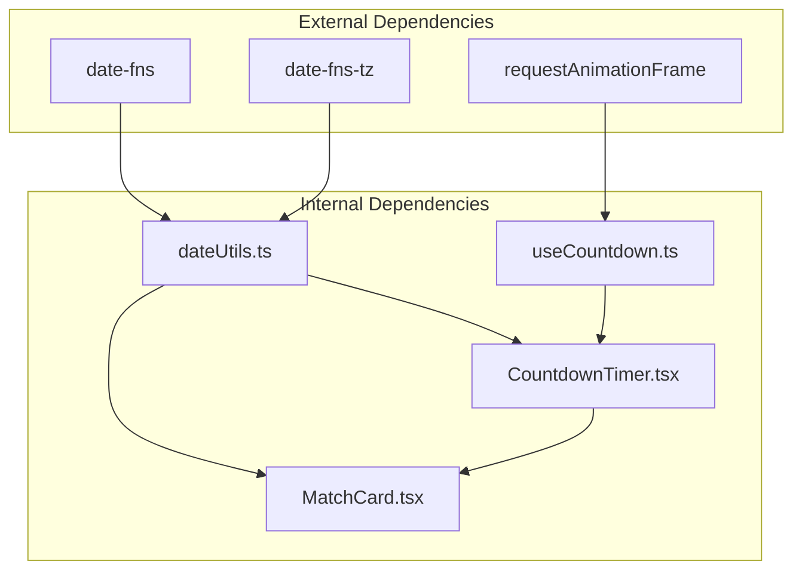

# Countdown Timer System

<cite>
**Referenced Files in This Document**
- [CountdownTimer.tsx](file://app/components/match/CountdownTimer.tsx)
- [useCountdown.ts](file://app/hooks/useCountdown.ts)
- [dateUtils.ts](file://app/utils/dateUtils.ts)
- [match.ts](file://app/types/match.ts)
- [MatchCard.tsx](file://app/components/match/MatchCard.tsx)
- [MatchList.tsx](file://app/components/match/MatchList.tsx)
- [constants.ts](file://app/utils/constants.ts)
- [formatters.ts](file://app/utils/formatters.ts)
- [useMatches.ts](file://app/hooks/useMatches.ts)
- [matchApi.ts](file://app/services/matchApi.ts)
- [_layout.tsx](file://app/_layout.tsx)
- [index.tsx](file://app/index.tsx)
</cite>

## Table of Contents
1. [Introduction](#introduction)
2. [Project Structure](#project-structure)
3. [Core Components](#core-components)
4. [Architecture Overview](#architecture-overview)
5. [Detailed Component Analysis](#detailed-component-analysis)
6. [Dependency Analysis](#dependency-analysis)
7. [Performance Considerations](#performance-considerations)
8. [Troubleshooting Guide](#troubleshooting-guide)
9. [Conclusion](#conclusion)

## Introduction
This document provides comprehensive documentation for the countdown timer system that tracks live match times in the application. The system consists of a React Native component that displays countdown timers for upcoming matches, with real-time updates, timezone-aware time formatting, and status-based display logic. It integrates with a custom hook pattern for managing timer state, interval handling, and cleanup operations, while leveraging date utility functions for timezone handling, time calculations, and match status determination.

## Project Structure
The countdown timer system is organized across several key modules:

**Diagram sources**
- [CountdownTimer.tsx](file://app/components/match/CountdownTimer.tsx#L1-L43)
- [useCountdown.ts](file://app/hooks/useCountdown.ts#L1-L54)
- [dateUtils.ts](file://app/utils/dateUtils.ts#L1-L64)
- [match.ts](file://app/types/match.ts#L1-L46)

**Section sources**
- [CountdownTimer.tsx](file://app/components/match/CountdownTimer.tsx#L1-L43)
- [useCountdown.ts](file://app/hooks/useCountdown.ts#L1-L54)
- [dateUtils.ts](file://app/utils/dateUtils.ts#L1-L64)

## Core Components
The countdown timer system comprises three primary components:

### CountdownTimer Component
The `CountdownTimer` component serves as the presentation layer for displaying match countdown information. It accepts three props: `targetDate`, `timezone`, and `matchStatus`. The component uses the `useCountdown` hook to manage timer state and implements conditional rendering based on match status.

### useCountdown Hook Pattern
The `useCountdown` hook implements a sophisticated timer management system using requestAnimationFrame for optimal performance. It maintains separate state for display text, expiration status, and individual time units (days, hours, minutes, seconds).

### Date Utility Functions
The `dateUtils.ts` module provides timezone-aware time calculations and formatting functions, including countdown part calculation, formatted countdown display, and match status determination functions.

**Section sources**
- [CountdownTimer.tsx](file://app/components/match/CountdownTimer.tsx#L7-L43)
- [useCountdown.ts](file://app/hooks/useCountdown.ts#L4-L54)
- [dateUtils.ts](file://app/utils/dateUtils.ts#L22-L64)

## Architecture Overview
The countdown timer system follows a unidirectional data flow pattern with clear separation of concerns:

**Diagram sources**
- [MatchCard.tsx](file://app/components/match/MatchCard.tsx#L86-L91)
- [CountdownTimer.tsx](file://app/components/match/CountdownTimer.tsx#L13-L38)
- [useCountdown.ts](file://app/hooks/useCountdown.ts#L17-L40)
- [dateUtils.ts](file://app/utils/dateUtils.ts#L22-L41)

## Detailed Component Analysis

### CountdownTimer Component Implementation
The `CountdownTimer` component implements a three-state rendering system:

**Diagram sources**
- [CountdownTimer.tsx](file://app/components/match/CountdownTimer.tsx#L16-L37)

The component utilizes React's `memo` optimization to prevent unnecessary re-renders and implements proper cleanup through the hook's effect cleanup function.

**Section sources**
- [CountdownTimer.tsx](file://app/components/match/CountdownTimer.tsx#L1-L43)

### useCountdown Hook Pattern Analysis
The `useCountdown` hook implements a sophisticated timer management system:

**Diagram sources**
- [useCountdown.ts](file://app/hooks/useCountdown.ts#L4-L54)

Key implementation features include:
- **requestAnimationFrame usage**: Optimizes rendering performance by aligning with browser refresh cycles
- **Debounced updates**: Limits updates to once per second using a timestamp-based mechanism
- **Automatic cleanup**: Cancels animation frames on component unmount to prevent memory leaks
- **State management**: Maintains separate state for display text, expiration status, and individual time units

**Section sources**
- [useCountdown.ts](file://app/hooks/useCountdown.ts#L1-L54)

### Date Utility Functions Implementation
The `dateUtils.ts` module provides comprehensive timezone-aware time manipulation:

**Diagram sources**
- [dateUtils.ts](file://app/utils/dateUtils.ts#L22-L51)

The utility functions support:
- **Timezone-aware parsing**: Uses `date-fns-tz` for accurate timezone handling
- **Flexible formatting**: Adapts countdown display based on remaining time magnitude
- **Robust error handling**: Gracefully handles invalid dates and edge cases

**Section sources**
- [dateUtils.ts](file://app/utils/dateUtils.ts#L1-L64)

### Integration with Match Data System
The countdown timer integrates seamlessly with the broader match data ecosystem:

**Diagram sources**
- [matchApi.ts](file://app/services/matchApi.ts#L4-L35)
- [useMatches.ts](file://app/hooks/useMatches.ts#L13-L55)
- [MatchCard.tsx](file://app/components/match/MatchCard.tsx#L15-L142)
- [MatchList.tsx](file://app/components/match/MatchList.tsx#L27-L117)

**Section sources**
- [matchApi.ts](file://app/services/matchApi.ts#L1-L36)
- [useMatches.ts](file://app/hooks/useMatches.ts#L1-L56)
- [MatchCard.tsx](file://app/components/match/MatchCard.tsx#L1-L142)
- [MatchList.tsx](file://app/components/match/MatchList.tsx#L1-L117)

## Dependency Analysis
The countdown timer system exhibits clean dependency relationships with minimal coupling:

**Diagram sources**
- [dateUtils.ts](file://app/utils/dateUtils.ts#L1-L2)
- [useCountdown.ts](file://app/hooks/useCountdown.ts#L1)
- [CountdownTimer.tsx](file://app/components/match/CountdownTimer.tsx#L1-L5)

**Section sources**
- [dateUtils.ts](file://app/utils/dateUtils.ts#L1-L64)
- [useCountdown.ts](file://app/hooks/useCountdown.ts#L1-L54)
- [CountdownTimer.tsx](file://app/components/match/CountdownTimer.tsx#L1-L43)

## Performance Considerations
The countdown timer system implements several performance optimizations:

### Rendering Optimization
- **React.memo usage**: Prevents unnecessary re-renders of the `CountdownTimer` component
- **requestAnimationFrame**: Aligns updates with browser refresh cycles for smooth animations
- **Debounced updates**: Limits timer updates to once per second to reduce computational overhead

### Memory Management
- **Automatic cleanup**: Animation frames are canceled when components unmount
- **Efficient state updates**: Separate state management prevents cascading re-renders
- **Reference caching**: Uses `useCallback` and `useRef` to minimize function recreation

### Network Integration
- **React Query integration**: Leverages caching and background refetching for match data
- **Stale-time configuration**: Balances freshness with performance using 2-minute stale time
- **Pagination support**: Efficiently handles large datasets with infinite scrolling

**Section sources**
- [useCountdown.ts](file://app/hooks/useCountdown.ts#L14-L50)
- [useMatches.ts](file://app/hooks/useMatches.ts#L39-L41)
- [MatchList.tsx](file://app/components/match/MatchList.tsx#L108-L112)

## Troubleshooting Guide

### Common Issues and Solutions

#### Timer Not Updating
**Symptoms**: Countdown remains static or updates infrequently
**Causes**: 
- Animation frame cancellation on component unmount
- Excessive throttling preventing updates
- Incorrect timezone specification

**Solutions**:
- Verify component lifecycle and cleanup procedures
- Check that `targetDate` prop is properly passed from parent components
- Ensure timezone strings follow IANA format standards

#### Incorrect Timezone Display
**Symptoms**: Countdown shows wrong time or incorrect duration
**Causes**:
- Invalid timezone string format
- Date parsing errors
- Daylight saving time transitions

**Solutions**:
- Validate timezone strings against IANA database
- Implement proper error handling for malformed dates
- Test during DST transition periods

#### Performance Degradation
**Symptoms**: UI becomes sluggish with many timers
**Causes**:
- Too many simultaneous timers
- Inefficient re-rendering
- Memory leaks from uncanceled animation frames

**Solutions**:
- Limit concurrent timers in viewport
- Use virtualized lists for large datasets
- Verify proper cleanup in component unmount

### Edge Cases Handling
The system addresses several edge cases:

**Timezone Differences**: Uses `date-fns-tz` for accurate timezone calculations
**Daylight Saving Changes**: Automatically adjusts for DST transitions
**Timer Synchronization**: Maintains consistent timing across component re-renders
**Invalid Dates**: Gracefully handles malformed or missing date data
**Memory Management**: Prevents memory leaks through proper cleanup

**Section sources**
- [dateUtils.ts](file://app/utils/dateUtils.ts#L22-L41)
- [useCountdown.ts](file://app/hooks/useCountdown.ts#L23-L31)

## Conclusion
The countdown timer system demonstrates excellent architectural principles with clear separation of concerns, efficient performance optimization, and robust error handling. The modular design allows for easy maintenance and extension while providing a smooth user experience through real-time updates and timezone-aware calculations. The integration with the broader match data ecosystem ensures seamless operation within the application's data flow architecture.

The system successfully balances performance requirements with functional completeness, making it suitable for production deployment in mobile applications with demanding real-time update requirements.