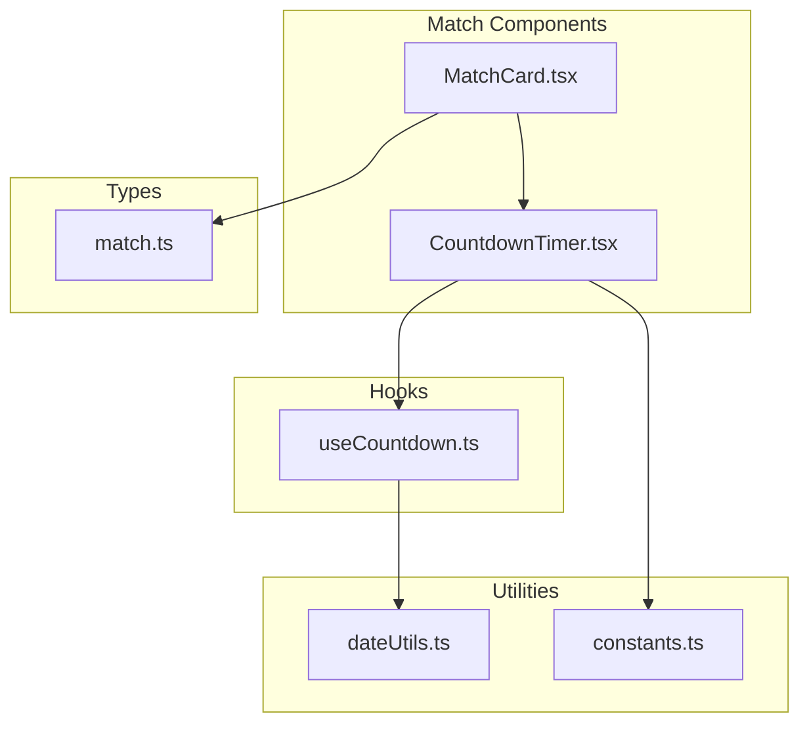
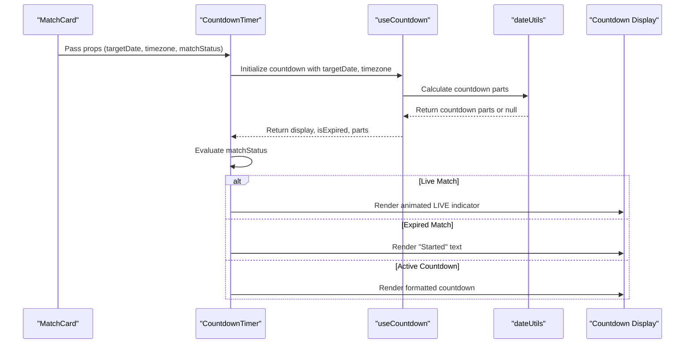
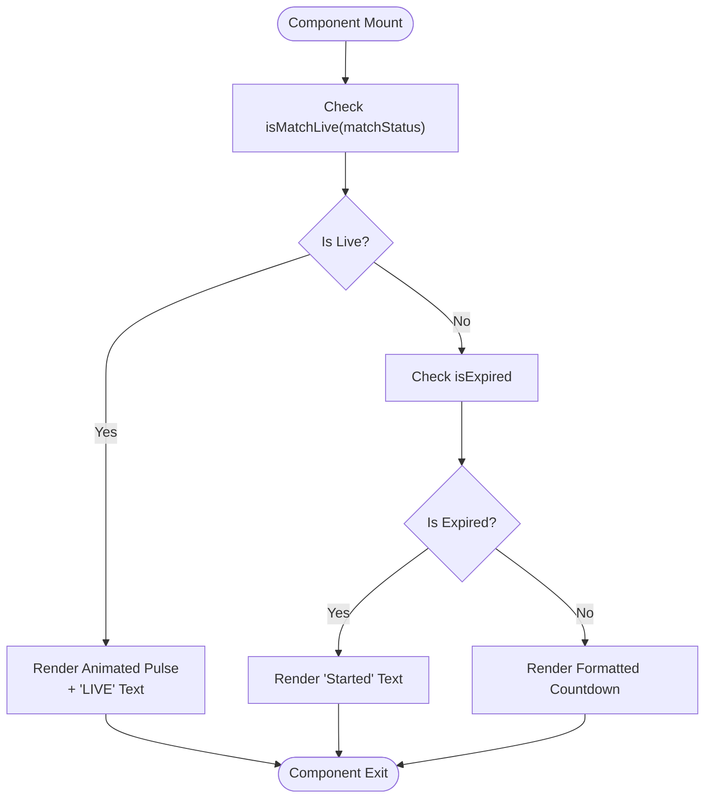
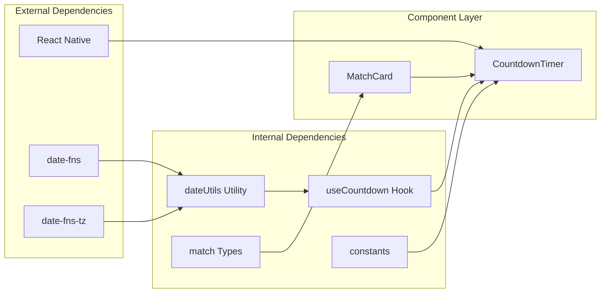

# CountdownTimer Component

<cite>
**Referenced Files in This Document**
- [CountdownTimer.tsx](file://app/components/match/CountdownTimer.tsx)
- [useCountdown.ts](file://app/hooks/useCountdown.ts)
- [MatchCard.tsx](file://app/components/match/MatchCard.tsx)
- [dateUtils.ts](file://app/utils/dateUtils.ts)
- [constants.ts](file://app/utils/constants.ts)
- [match.ts](file://app/types/match.ts)
- [tailwind.config.js](file://tailwind.config.js)
</cite>

## Table of Contents
1. [Introduction](#introduction)
2. [Project Structure](#project-structure)
3. [Core Components](#core-components)
4. [Architecture Overview](#architecture-overview)
5. [Detailed Component Analysis](#detailed-component-analysis)
6. [Dependency Analysis](#dependency-analysis)
7. [Performance Considerations](#performance-considerations)
8. [Troubleshooting Guide](#troubleshooting-guide)
9. [Conclusion](#conclusion)

## Introduction
The CountdownTimer component is a specialized React Native component designed to display countdown information for sports matches. It provides real-time countdown displays, live match indicators, and automatic expiration handling. The component integrates seamlessly with the match card interface and utilizes advanced timing mechanisms for optimal performance.

## Project Structure
The CountdownTimer component is part of the match-related components in the application's component library. It follows a modular architecture with clear separation of concerns between presentation, logic, and data handling.

**Diagram sources**
- [CountdownTimer.tsx](file://app/components/match/CountdownTimer.tsx#L1-L43)
- [useCountdown.ts](file://app/hooks/useCountdown.ts#L1-L54)
- [MatchCard.tsx](file://app/components/match/MatchCard.tsx#L1-L142)

**Section sources**
- [CountdownTimer.tsx](file://app/components/match/CountdownTimer.tsx#L1-L43)
- [MatchCard.tsx](file://app/components/match/MatchCard.tsx#L1-L142)

## Core Components
The CountdownTimer component consists of several key elements that work together to provide comprehensive countdown functionality:

### Props Interface
The component accepts three essential props for proper operation:
- **targetDate**: ISO 8601 formatted string representing the match start time
- **timezone**: String identifier for timezone handling (e.g., 'Australia/Sydney')
- **matchStatus**: String indicating current match status ('upcoming', 'live', 'completed')

### Conditional Rendering Logic
The component implements sophisticated conditional rendering based on match status:
1. **Live Matches**: Displays animated red pulse indicator with "LIVE" text
2. **Expired Matches**: Shows "Started" text in gray for completed matches
3. **Active Countdown**: Renders formatted countdown display with styled typography

### Hook Integration
The component leverages the useCountdown hook for efficient time management and automatic updates.

**Section sources**
- [CountdownTimer.tsx](file://app/components/match/CountdownTimer.tsx#L7-L11)
- [CountdownTimer.tsx](file://app/components/match/CountdownTimer.tsx#L13-L38)
- [useCountdown.ts](file://app/hooks/useCountdown.ts#L10-L53)

## Architecture Overview
The CountdownTimer component follows a unidirectional data flow architecture with clear separation between presentation and logic:

**Diagram sources**
- [MatchCard.tsx](file://app/components/match/MatchCard.tsx#L86-L91)
- [CountdownTimer.tsx](file://app/components/match/CountdownTimer.tsx#L13-L38)
- [useCountdown.ts](file://app/hooks/useCountdown.ts#L17-L40)
- [dateUtils.ts](file://app/utils/dateUtils.ts#L22-L51)

## Detailed Component Analysis

### Component Implementation
The CountdownTimer component implements a clean, functional approach with comprehensive error handling and performance optimizations.

#### Props Interface Definition
The component defines a strict interface for type safety:
- **targetDate**: string (ISO 8601 format)
- **timezone**: string (timezone identifier)
- **matchStatus**: string (status enumeration)

#### Conditional Rendering Logic
The component implements three distinct rendering paths:

**Diagram sources**
- [CountdownTimer.tsx](file://app/components/match/CountdownTimer.tsx#L16-L37)
- [dateUtils.ts](file://app/utils/dateUtils.ts#L53-L55)

#### Memo Optimization
The component utilizes React.memo for performance optimization:
- Prevents unnecessary re-renders when props remain unchanged
- Implements displayName for better debugging
- Optimizes rendering performance in match lists

#### Styling Implementation
The component uses Tailwind CSS classes for consistent styling:
- **Live Indicator**: Red circular pulse with animation
- **Started Text**: Gray text with medium weight
- **Countdown Display**: Light gray background with primary color text
- **Responsive Typography**: Consistent text sizing across components

**Section sources**
- [CountdownTimer.tsx](file://app/components/match/CountdownTimer.tsx#L1-L43)
- [CountdownTimer.tsx](file://app/components/match/CountdownTimer.tsx#L13-L40)

### Hook Integration Analysis
The useCountdown hook provides sophisticated time management with advanced optimization techniques.

#### Advanced Timing Mechanism
The hook implements requestAnimationFrame for optimal performance:
- Uses animation frames for smooth updates
- Limits updates to once per second for efficiency
- Cancels animation frames on component unmount

#### Countdown Calculation Logic
The hook calculates time differences with precision:
- Handles timezone conversions using date-fns-tz
- Provides granular breakdown (days, hours, minutes, seconds)
- Manages expiration states automatically

#### Return Value Structure
The hook returns a comprehensive object:
- **display**: Formatted countdown string
- **isExpired**: Boolean flag for expired matches
- **parts**: Detailed time breakdown object

**Section sources**
- [useCountdown.ts](file://app/hooks/useCountdown.ts#L1-L54)
- [dateUtils.ts](file://app/utils/dateUtils.ts#L22-L51)

### Integration with Match Card
The CountdownTimer integrates seamlessly with the MatchCard component for comprehensive match display.

#### Conditional Display Logic
The MatchCard component conditionally renders either:
- **VS Text**: For live matches displaying "VS"
- **CountdownTimer**: For upcoming matches showing countdown

#### Data Flow Integration
The MatchCard passes essential match data to the CountdownTimer:
- **targetDate**: match.startTime
- **timezone**: match.timezone
- **matchStatus**: match.matchStatus

**Section sources**
- [MatchCard.tsx](file://app/components/match/MatchCard.tsx#L83-L91)
- [match.ts](file://app/types/match.ts#L16-L29)

## Dependency Analysis
The CountdownTimer component has well-defined dependencies that contribute to its modularity and maintainability.

**Diagram sources**
- [CountdownTimer.tsx](file://app/components/match/CountdownTimer.tsx#L1-L6)
- [useCountdown.ts](file://app/hooks/useCountdown.ts#L1-L2)
- [dateUtils.ts](file://app/utils/dateUtils.ts#L1-L2)

### Component Coupling Analysis
The component maintains low coupling through:
- **Interface-based Props**: Clear contract definition
- **Utility Function Dependencies**: Pure function dependencies
- **Hook Abstraction**: Encapsulated timing logic
- **Type Safety**: Strong typing throughout

### Potential Circular Dependencies
No circular dependencies detected in the component architecture, ensuring maintainable code structure.

**Section sources**
- [CountdownTimer.tsx](file://app/components/match/CountdownTimer.tsx#L1-L6)
- [useCountdown.ts](file://app/hooks/useCountdown.ts#L1-L3)
- [dateUtils.ts](file://app/utils/dateUtils.ts#L1-L3)

## Performance Considerations
The component implements several performance optimization strategies:

### Animation Frame Optimization
- Uses requestAnimationFrame for smooth, efficient updates
- Limits calculations to once per second to minimize CPU usage
- Automatically cleans up animation frames on component unmount

### Memoization Benefits
- React.memo prevents unnecessary re-renders in match lists
- Stable prop references reduce component updates
- Optimized rendering performance for large match collections

### Memory Management
- Proper cleanup of animation frames prevents memory leaks
- Efficient state management with minimal re-renders
- Lightweight component structure with minimal DOM nodes

### Responsive Design Considerations
The component leverages Tailwind CSS for responsive behavior:
- Consistent text sizing across different screen sizes
- Flexible layout that adapts to various device widths
- Mobile-first design principles for optimal mobile experience

**Section sources**
- [useCountdown.ts](file://app/hooks/useCountdown.ts#L14-L50)
- [CountdownTimer.tsx](file://app/components/match/CountdownTimer.tsx#L1-L43)
- [tailwind.config.js](file://tailwind.config.js#L1-L21)

## Troubleshooting Guide

### Common Issues and Solutions

#### Timezone Display Problems
**Issue**: Incorrect time display for different timezones
**Solution**: Ensure proper timezone string format is passed to the component
**Validation**: Verify timezone matches supported identifiers

#### Countdown Not Updating
**Issue**: Countdown timer stops updating
**Solution**: Check animation frame cleanup in component unmount
**Debugging**: Verify useCountdown hook initialization

#### Live Match Indicator Not Showing
**Issue**: Live matches don't display animated pulse
**Solution**: Verify matchStatus is correctly set to 'live'
**Validation**: Check isMatchLive function implementation

#### Expiration Handling Issues
**Issue**: Expired matches show incorrect display
**Solution**: Review isExpired state management in useCountdown hook
**Debugging**: Check countdown calculation logic

### Prop Validation Requirements
The component requires specific prop formats:
- **targetDate**: Valid ISO 8601 formatted string
- **timezone**: Valid timezone identifier string
- **matchStatus**: One of 'upcoming', 'live', 'completed'

### Integration Best Practices
- Always pass complete match data from parent components
- Ensure timezone information is accurate and consistent
- Handle component unmount gracefully to prevent memory leaks

**Section sources**
- [CountdownTimer.tsx](file://app/components/match/CountdownTimer.tsx#L7-L11)
- [useCountdown.ts](file://app/hooks/useCountdown.ts#L10-L40)
- [dateUtils.ts](file://app/utils/dateUtils.ts#L53-L55)

## Conclusion
The CountdownTimer component represents a well-architected solution for real-time countdown display in sports applications. Its implementation demonstrates excellent separation of concerns, performance optimization, and maintainable code structure. The component successfully handles complex scenarios including live match detection, countdown formatting, and automatic expiration management while maintaining optimal performance through memoization and animation frame optimization.

The component's integration with the broader match system showcases effective architectural patterns, including proper prop passing, conditional rendering, and utility function usage. The implementation serves as a model for building performant, maintainable React Native components that handle real-time data efficiently.