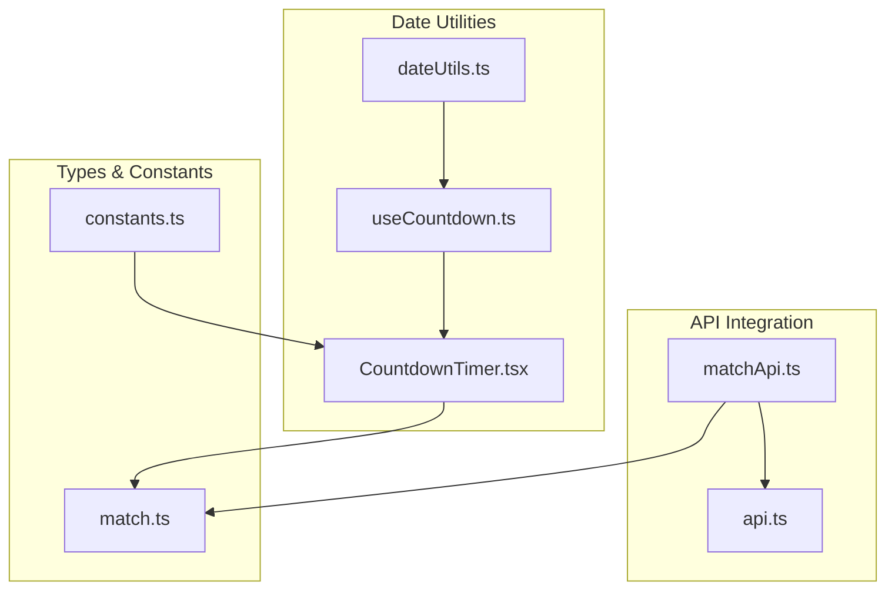
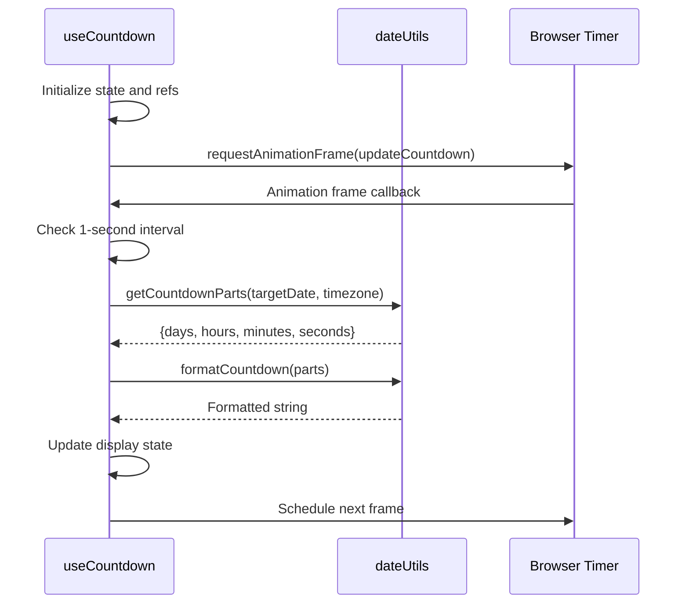
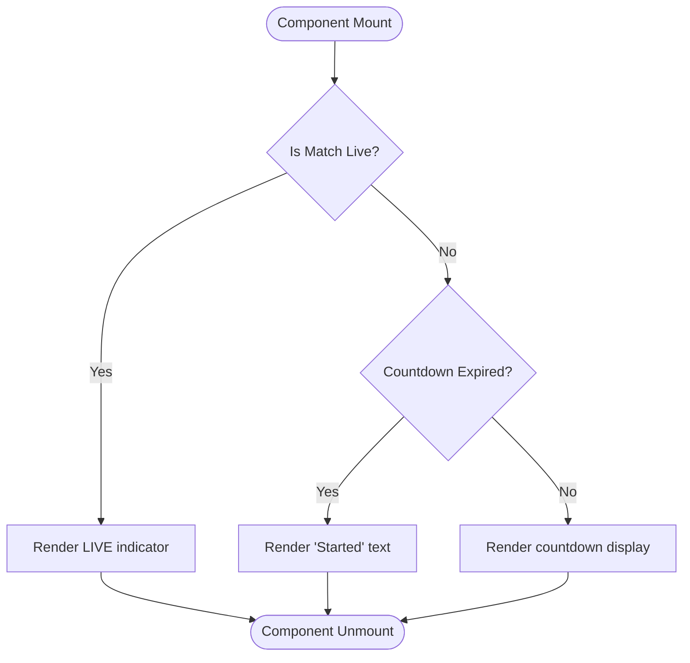
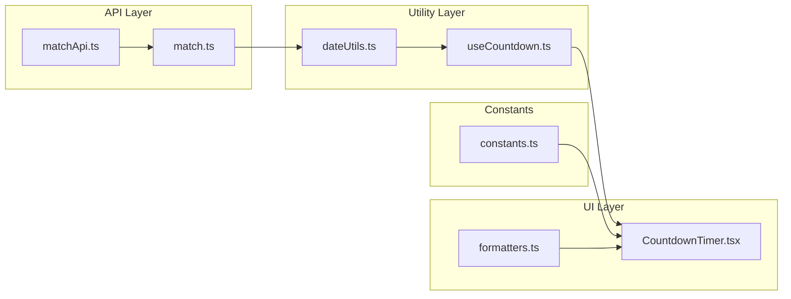
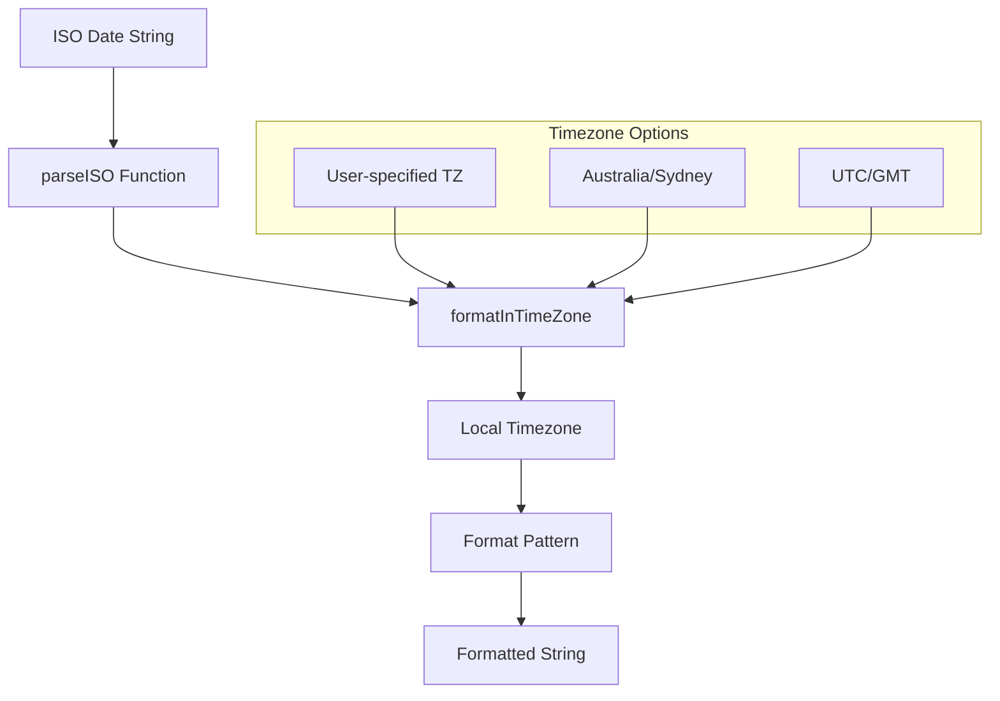
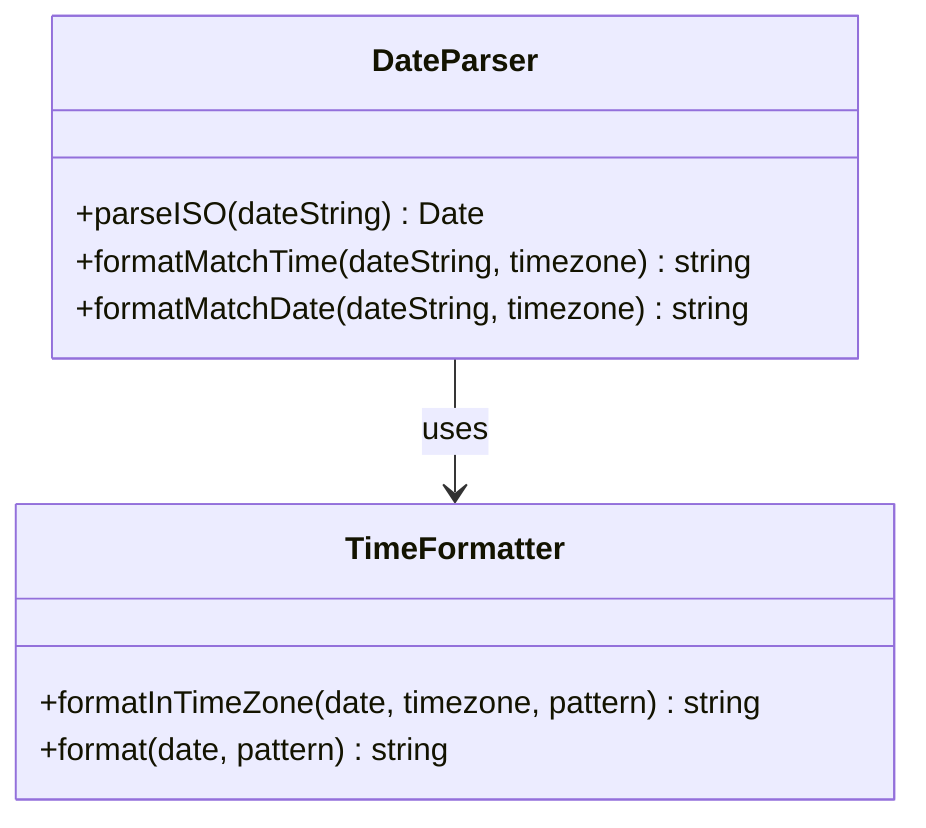
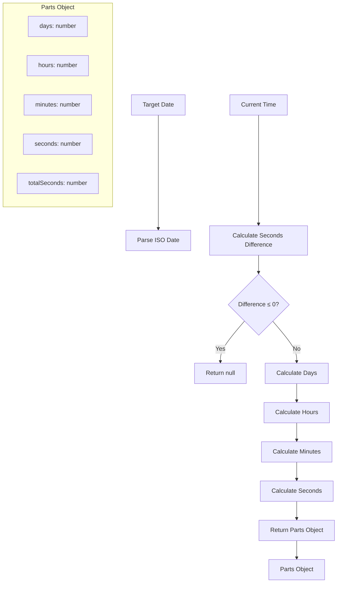
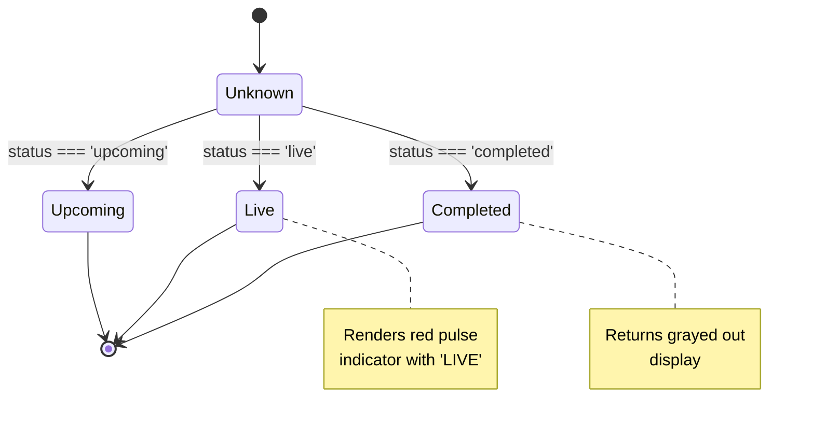
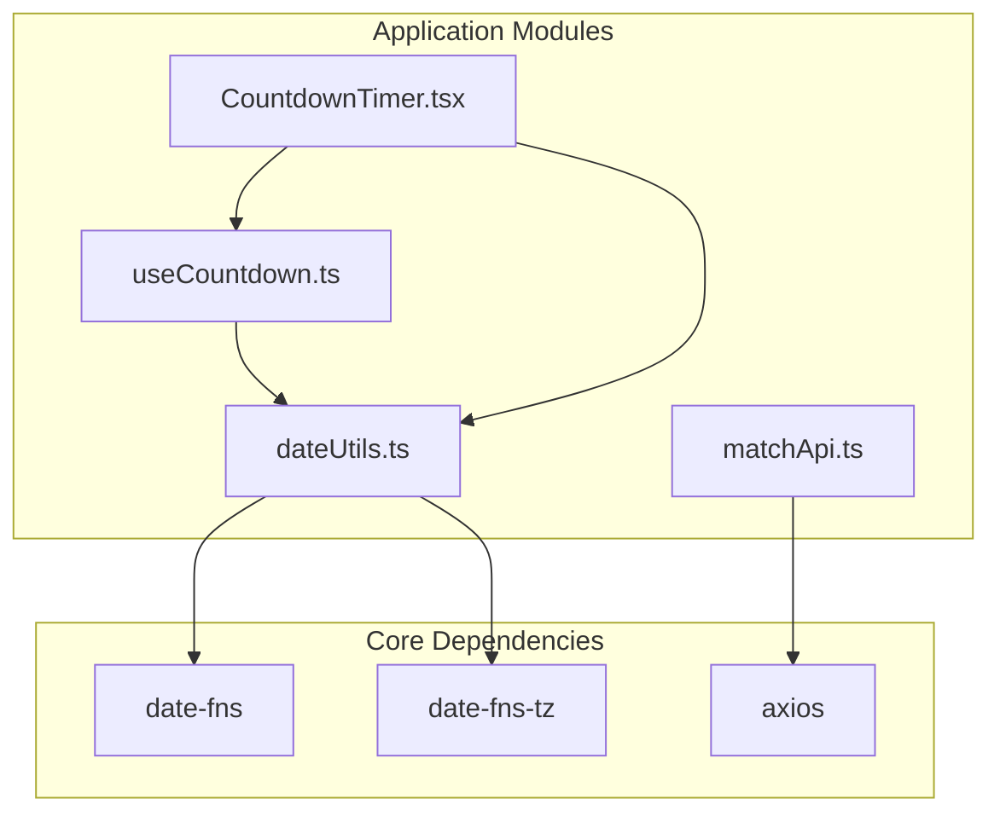
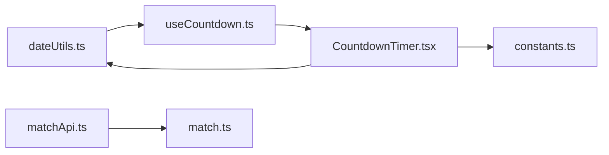

# Date Utilities and Timezone Handling

<cite>
**Referenced Files in This Document**
- [dateUtils.ts](file://app/utils/dateUtils.ts)
- [useCountdown.ts](file://app/hooks/useCountdown.ts)
- [CountdownTimer.tsx](file://app/components/match/CountdownTimer.tsx)
- [match.ts](file://app/types/match.ts)
- [constants.ts](file://app/utils/constants.ts)
- [matchApi.ts](file://app/services/matchApi.ts)
- [formatters.ts](file://app/utils/formatters.ts)
</cite>

## Table of Contents
1. [Introduction](#introduction)
2. [Project Structure](#project-structure)
3. [Core Components](#core-components)
4. [Architecture Overview](#architecture-overview)
5. [Detailed Component Analysis](#detailed-component-analysis)
6. [Dependency Analysis](#dependency-analysis)
7. [Performance Considerations](#performance-considerations)
8. [Troubleshooting Guide](#troubleshooting-guide)
9. [Conclusion](#conclusion)

## Introduction
This document provides comprehensive documentation for the date utility functions used in the countdown system. It covers timezone handling, time calculation algorithms, match status determination logic, date parsing and formatting utilities, and timezone conversion methods. The documentation explains how the system handles various scenarios including edge cases like leap years and month boundaries, and addresses internationalization requirements for global users.

## Project Structure
The date utilities are organized across several key files that handle different aspects of date/time processing:

**Diagram sources**
- [dateUtils.ts](file://app/utils/dateUtils.ts#L1-L64)
- [useCountdown.ts](file://app/hooks/useCountdown.ts#L1-L54)
- [CountdownTimer.tsx](file://app/components/match/CountdownTimer.tsx#L1-L43)
- [match.ts](file://app/types/match.ts#L1-L46)
- [constants.ts](file://app/utils/constants.ts#L1-L38)
- [matchApi.ts](file://app/services/matchApi.ts#L1-L36)

**Section sources**
- [dateUtils.ts](file://app/utils/dateUtils.ts#L1-L64)
- [useCountdown.ts](file://app/hooks/useCountdown.ts#L1-L54)
- [CountdownTimer.tsx](file://app/components/match/CountdownTimer.tsx#L1-L43)
- [match.ts](file://app/types/match.ts#L1-L46)
- [constants.ts](file://app/utils/constants.ts#L1-L38)
- [matchApi.ts](file://app/services/matchApi.ts#L1-L36)

## Core Components

### Date Utility Functions
The core date utilities provide essential functionality for handling match dates, times, and countdown calculations:

#### Timezone-Aware Formatting Functions
- `formatMatchTime`: Converts ISO date strings to localized time format
- `formatMatchDate`: Converts ISO date strings to localized date format
- Both functions accept timezone parameters and use `date-fns-tz` for accurate conversions

#### Countdown Calculation Functions
- `getCountdownParts`: Calculates time remaining until target date
- `formatCountdown`: Formats countdown parts into human-readable strings
- Handles day, hour, minute, and second calculations with proper boundary handling

#### Match Status Functions
- `isMatchLive`: Determines if match is currently live
- `isMatchUpcoming`: Determines if match is scheduled to start
- `isMatchCompleted`: Determines if match has finished

**Section sources**
- [dateUtils.ts](file://app/utils/dateUtils.ts#L4-L63)

### Countdown Hook Implementation
The `useCountdown` hook manages real-time countdown updates using requestAnimationFrame for optimal performance:

**Diagram sources**
- [useCountdown.ts](file://app/hooks/useCountdown.ts#L10-L40)
- [dateUtils.ts](file://app/utils/dateUtils.ts#L22-L51)

**Section sources**
- [useCountdown.ts](file://app/hooks/useCountdown.ts#L1-L54)

### Component Integration
The `CountdownTimer` component integrates the countdown functionality with UI rendering:

**Diagram sources**
- [CountdownTimer.tsx](file://app/components/match/CountdownTimer.tsx#L13-L38)

**Section sources**
- [CountdownTimer.tsx](file://app/components/match/CountdownTimer.tsx#L1-L43)

## Architecture Overview

### Data Flow Architecture
The date utilities follow a clear data flow pattern from API data to UI presentation:

**Diagram sources**
- [matchApi.ts](file://app/services/matchApi.ts#L4-L35)
- [match.ts](file://app/types/match.ts#L16-L29)
- [dateUtils.ts](file://app/utils/dateUtils.ts#L1-L64)
- [useCountdown.ts](file://app/hooks/useCountdown.ts#L1-L54)
- [CountdownTimer.tsx](file://app/components/match/CountdownTimer.tsx#L1-L43)
- [constants.ts](file://app/utils/constants.ts#L1-L38)
- [formatters.ts](file://app/utils/formatters.ts#L1-L47)

### Timezone Handling Architecture
The system handles timezone conversions through a layered approach:

**Diagram sources**
- [dateUtils.ts](file://app/utils/dateUtils.ts#L4-L20)

**Section sources**
- [dateUtils.ts](file://app/utils/dateUtils.ts#L1-L64)
- [matchApi.ts](file://app/services/matchApi.ts#L7-L7)

## Detailed Component Analysis

### Date Parsing and Formatting Utilities

#### ISO Date Parsing
The system uses `date-fns.parseISO` for robust ISO 8601 date parsing with automatic timezone detection:

**Diagram sources**
- [dateUtils.ts](file://app/utils/dateUtils.ts#L4-L20)

#### Timezone Conversion Methods
The `formatInTimeZone` function from `date-fns-tz` provides accurate timezone conversions:

| Function | Input Pattern | Output Format | Example |
|----------|---------------|---------------|---------|
| `formatMatchTime` | `h:mm a` | 3:30 PM, 12:00 AM | 9:15 AM |
| `formatMatchDate` | `EEE, MMM d` | Mon, Jan 15 | Wed, Dec 25 |

**Section sources**
- [dateUtils.ts](file://app/utils/dateUtils.ts#L4-L20)

### Countdown Calculation Algorithm

#### Time Difference Calculation
The countdown algorithm calculates precise time differences using `date-fns.differenceInSeconds`:

**Diagram sources**
- [dateUtils.ts](file://app/utils/dateUtils.ts#L22-L41)

#### Boundary Handling
The algorithm handles edge cases through careful mathematical operations:

- **Leap Year Handling**: Uses `differenceInSeconds` which accounts for leap seconds automatically
- **Month Boundaries**: Leverages JavaScript Date object's native month rollover
- **Daylight Saving**: Handled by `date-fns-tz` timezone-aware formatting

**Section sources**
- [dateUtils.ts](file://app/utils/dateUtils.ts#L22-L41)

### Match Status Determination Logic

#### Status Validation Functions
The system provides explicit functions for match status checking:

**Diagram sources**
- [dateUtils.ts](file://app/utils/dateUtils.ts#L53-L63)
- [CountdownTimer.tsx](file://app/components/match/CountdownTimer.tsx#L16-L23)

**Section sources**
- [dateUtils.ts](file://app/utils/dateUtils.ts#L53-L63)
- [CountdownTimer.tsx](file://app/components/match/CountdownTimer.tsx#L16-L23)

### Internationalization and Regional Support

#### Timezone Coverage
The system supports timezone identifiers from the IANA timezone database:

| Region | Examples | Use Cases |
|--------|----------|-----------|
| Australia | `Australia/Sydney`, `Australia/Melbourne` | Eastern Australia |
| Europe | `Europe/London`, `Europe/Paris` | Western Europe |
| Americas | `America/New_York`, `America/Los_Angeles` | North America |
| Asia | `Asia/Tokyo`, `Asia/Shanghai` | East Asia |
| Global | `UTC`, `GMT` | Universal reference |

#### Regional Date Formats
The system adapts to regional preferences through timezone-aware formatting:

- **Time Format**: 12-hour with AM/PM indicators
- **Date Format**: Day of week, month, day pattern
- **Cultural Adaptation**: Automatic adjustment for local timezones

**Section sources**
- [dateUtils.ts](file://app/utils/dateUtils.ts#L4-L20)
- [matchApi.ts](file://app/services/matchApi.ts#L7-L7)

## Dependency Analysis

### External Library Dependencies
The date utilities rely on specialized libraries for robust date/time handling:

**Diagram sources**
- [dateUtils.ts](file://app/utils/dateUtils.ts#L1-L2)
- [useCountdown.ts](file://app/hooks/useCountdown.ts#L1-L2)
- [matchApi.ts](file://app/services/matchApi.ts#L1-L2)

### Internal Dependencies
The modules have clear dependency relationships:

**Diagram sources**
- [dateUtils.ts](file://app/utils/dateUtils.ts#L1-L64)
- [useCountdown.ts](file://app/hooks/useCountdown.ts#L1-L54)
- [CountdownTimer.tsx](file://app/components/match/CountdownTimer.tsx#L1-L43)
- [matchApi.ts](file://app/services/matchApi.ts#L1-L36)
- [match.ts](file://app/types/match.ts#L1-L46)
- [constants.ts](file://app/utils/constants.ts#L1-L38)

**Section sources**
- [dateUtils.ts](file://app/utils/dateUtils.ts#L1-L64)
- [useCountdown.ts](file://app/hooks/useCountdown.ts#L1-L54)
- [CountdownTimer.tsx](file://app/components/match/CountdownTimer.tsx#L1-L43)
- [matchApi.ts](file://app/services/matchApi.ts#L1-L36)
- [match.ts](file://app/types/match.ts#L1-L46)
- [constants.ts](file://app/utils/constants.ts#L1-L38)

## Performance Considerations

### Optimized Rendering Strategy
The countdown system uses requestAnimationFrame for efficient updates:

- **Frame Rate Control**: Updates occur at ~60fps for smooth animations
- **Debouncing Mechanism**: 1-second intervals prevent excessive recalculations
- **Memory Management**: Proper cleanup of animation frames prevents memory leaks

### Computational Efficiency
The algorithms are designed for minimal computational overhead:

- **Single Pass Calculations**: Countdown parts calculated in one pass
- **Integer Arithmetic**: Division and modulo operations for clean boundaries
- **Early Termination**: Immediate return when countdown expires

### Memory Optimization
- **State Management**: Efficient React state updates with proper dependencies
- **Reference Caching**: useRef for animation frame references and timing
- **Callback Memoization**: useCallback prevents unnecessary re-renders

### Edge Case Handling
The system gracefully handles various edge cases:

- **Invalid Dates**: Try-catch blocks prevent crashes on malformed input
- **Timezone Errors**: Graceful fallback to empty strings for invalid zones
- **Network Latency**: API integration handles loading states appropriately

**Section sources**
- [useCountdown.ts](file://app/hooks/useCountdown.ts#L10-L54)
- [dateUtils.ts](file://app/utils/dateUtils.ts#L22-L41)

## Troubleshooting Guide

### Common Issues and Solutions

#### Timezone Conversion Problems
**Issue**: Incorrect time displayed for specific regions
**Solution**: Verify timezone identifier format follows IANA standards
**Example**: Use `America/New_York` instead of `EST`

#### Countdown Not Updating
**Issue**: Countdown timer stops updating
**Solution**: Check animation frame cleanup in component unmount
**Debug Steps**: 
1. Verify `cancelAnimationFrame` is called
2. Check for infinite render loops
3. Validate timezone parameter propagation

#### Date Parsing Failures
**Issue**: Empty date strings returned
**Solution**: Implement proper error handling for malformed ISO dates
**Prevention**: Validate date strings before processing

#### Performance Degradation
**Issue**: Slow UI updates during countdown
**Solution**: Optimize component rendering and state updates
**Best Practices**:
- Use memoization for expensive calculations
- Minimize re-renders with proper dependencies
- Clean up resources on component unmount

### Debugging Tools and Techniques

#### Console Logging
Enable logging for troubleshooting:
- Countdown updates and intervals
- Timezone conversion results
- Error conditions and fallbacks

#### Testing Strategies
- Unit tests for individual utility functions
- Integration tests for complete workflow
- Performance benchmarks for edge cases

**Section sources**
- [dateUtils.ts](file://app/utils/dateUtils.ts#L5-L10)
- [useCountdown.ts](file://app/hooks/useCountdown.ts#L23-L31)
- [CountdownTimer.tsx](file://app/components/match/CountdownTimer.tsx#L25-L29)

## Conclusion

The date utilities system provides a robust foundation for handling time-sensitive features in the sports application. The implementation demonstrates best practices in timezone handling, performance optimization, and internationalization support. Key strengths include:

- **Accurate Timezone Handling**: Proper use of `date-fns-tz` for reliable conversions
- **Efficient Performance**: Optimized rendering with requestAnimationFrame
- **Comprehensive Edge Case Handling**: Robust error handling and fallback mechanisms
- **Internationalization Ready**: Flexible timezone support for global users

The modular architecture ensures maintainability and extensibility while providing clear separation of concerns between parsing, formatting, and presentation layers. Future enhancements could include additional timezone formats, customizable display options, and enhanced error reporting capabilities.