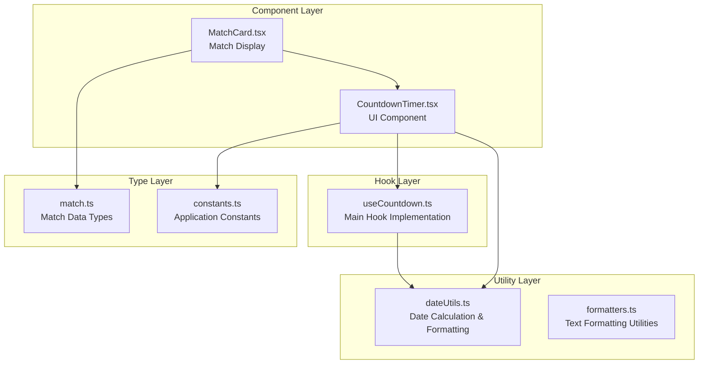
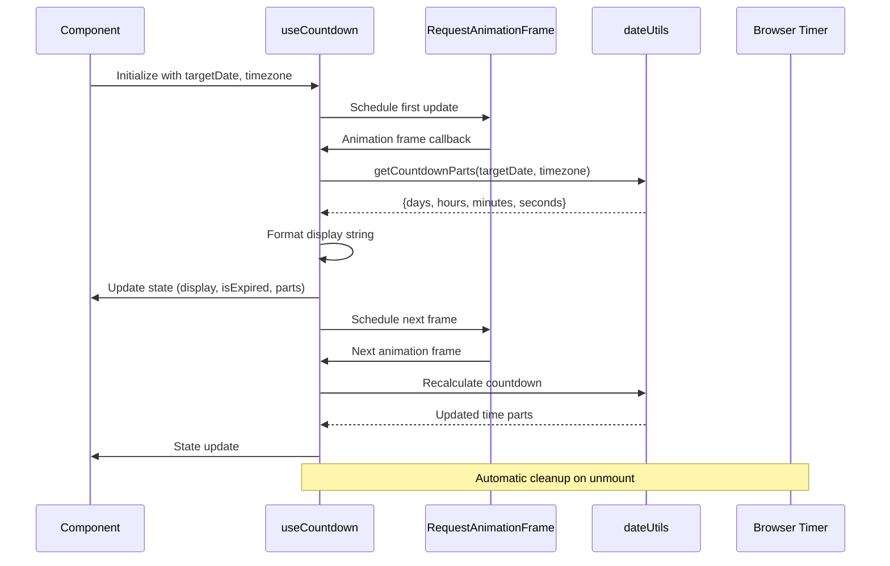
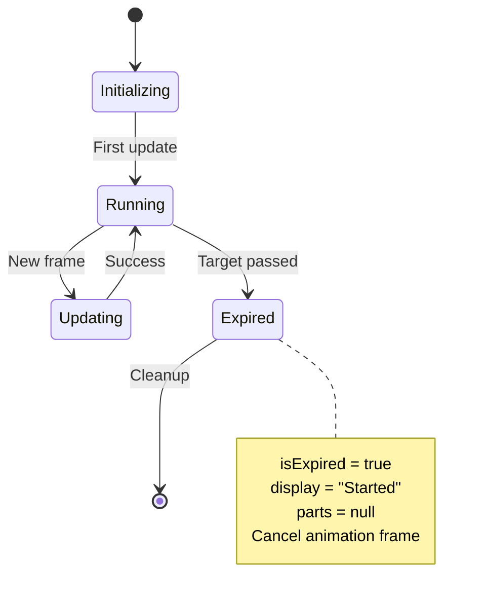
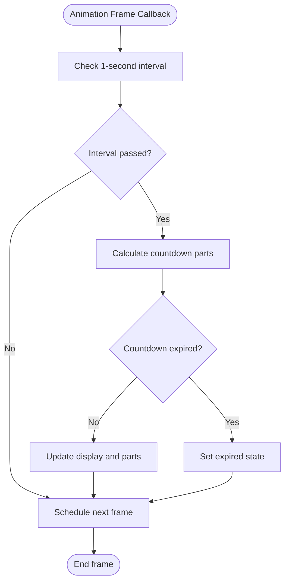
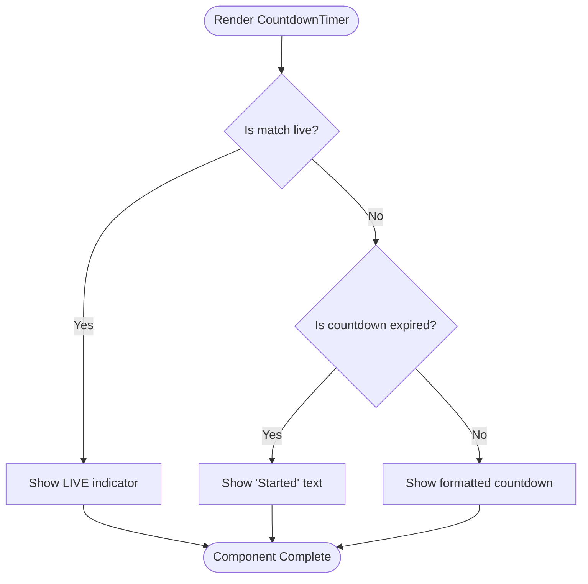
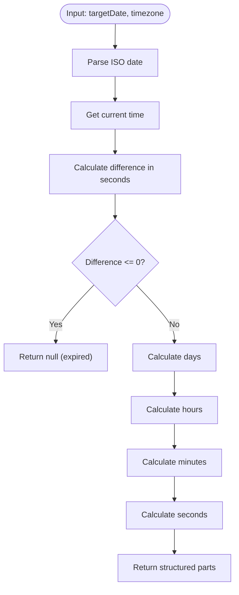
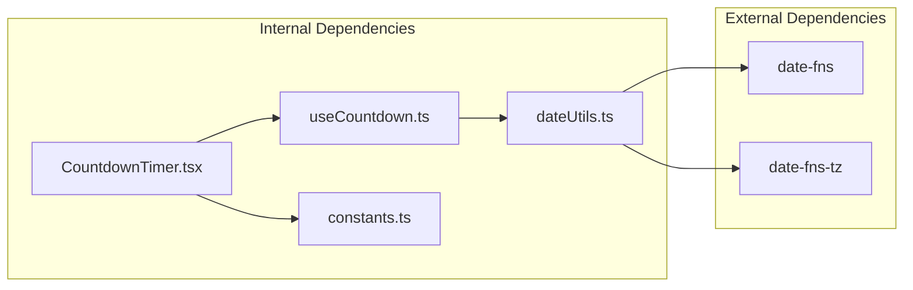

# useCountdown Hook

<cite>
**Referenced Files in This Document**
- [useCountdown.ts](file://app/hooks/useCountdown.ts)
- [CountdownTimer.tsx](file://app/components/match/CountdownTimer.tsx)
- [dateUtils.ts](file://app/utils/dateUtils.ts)
- [constants.ts](file://app/utils/constants.ts)
- [match.ts](file://app/types/match.ts)
</cite>

## Table of Contents
1. [Introduction](#introduction)
2. [Project Structure](#project-structure)
3. [Core Components](#core-components)
4. [Architecture Overview](#architecture-overview)
5. [Detailed Component Analysis](#detailed-component-analysis)
6. [Dependency Analysis](#dependency-analysis)
7. [Performance Considerations](#performance-considerations)
8. [Troubleshooting Guide](#troubleshooting-guide)
9. [Conclusion](#conclusion)

## Introduction
The useCountdown hook is a React hook designed to manage timer state for countdown displays in sports applications. It calculates time differences between a target date and the current time, handles interval updates efficiently, and provides formatted display strings for various time units. The hook is specifically used in the CountdownTimer component to show match countdowns and handle expiration states.

## Project Structure
The useCountdown hook follows a modular architecture with clear separation of concerns:



**Diagram sources**
- [useCountdown.ts](file://app/hooks/useCountdown.ts#L1-L54)
- [dateUtils.ts](file://app/utils/dateUtils.ts#L1-L64)
- [CountdownTimer.tsx](file://app/components/match/CountdownTimer.tsx#L1-L43)

**Section sources**
- [useCountdown.ts](file://app/hooks/useCountdown.ts#L1-L54)
- [dateUtils.ts](file://app/utils/dateUtils.ts#L1-L64)
- [CountdownTimer.tsx](file://app/components/match/CountdownTimer.tsx#L1-L43)

## Core Components

### Hook Interface Definition
The useCountdown hook implements a comprehensive interface with three main return values:

```typescript
interface CountdownResult {
  display: string;           // Formatted countdown string
  isExpired: boolean;        // Expiration state flag
  parts: {                  // Individual time units
    days: number;
    hours: number;
    minutes: number;
    seconds: number;
  } | null;                  // Null when expired
}
```

**Section sources**
- [useCountdown.ts](file://app/hooks/useCountdown.ts#L4-L8)

### Parameter Configuration
The hook accepts two parameters with sensible defaults:
- `targetDate: string` - ISO 8601 formatted date string representing the countdown target
- `timezone: string` - IANA timezone identifier with default 'Australia/Sydney'

**Section sources**
- [useCountdown.ts](file://app/hooks/useCountdown.ts#L10-L10)

### Return Value Structure
The hook returns an object containing:
- `display`: Human-readable formatted countdown string
- `isExpired`: Boolean indicating if target time has passed
- `parts`: Structured time breakdown or null when expired

**Section sources**
- [useCountdown.ts](file://app/hooks/useCountdown.ts#L52-L52)

## Architecture Overview



**Diagram sources**
- [useCountdown.ts](file://app/hooks/useCountdown.ts#L17-L40)
- [dateUtils.ts](file://app/utils/dateUtils.ts#L22-L41)

## Detailed Component Analysis

### useCountdown Hook Implementation

#### State Management
The hook maintains three critical state variables:
- `display`: Current formatted countdown string
- `isExpired`: Expiration state tracking
- `parts`: Structured time breakdown object



**Diagram sources**
- [useCountdown.ts](file://app/hooks/useCountdown.ts#L11-L13)
- [useCountdown.ts](file://app/hooks/useCountdown.ts#L23-L31)

#### Animation Frame Strategy
The hook uses requestAnimationFrame for efficient updates:



**Diagram sources**
- [useCountdown.ts](file://app/hooks/useCountdown.ts#L17-L40)

**Section sources**
- [useCountdown.ts](file://app/hooks/useCountdown.ts#L1-L54)

### CountdownTimer Component Integration

#### Component Props Interface
The CountdownTimer component expects:
- `targetDate: string` - ISO date string for countdown target
- `timezone: string` - IANA timezone identifier
- `matchStatus: string` - Current match status for live detection

**Section sources**
- [CountdownTimer.tsx](file://app/components/match/CountdownTimer.tsx#L7-L11)

#### Conditional Rendering Logic
The component implements sophisticated conditional rendering:



**Diagram sources**
- [CountdownTimer.tsx](file://app/components/match/CountdownTimer.tsx#L16-L29)

**Section sources**
- [CountdownTimer.tsx](file://app/components/match/CountdownTimer.tsx#L1-L43)

### Date Calculation Utilities

#### Countdown Parts Calculation
The `getCountdownParts` function performs precise time calculations:



**Diagram sources**
- [dateUtils.ts](file://app/utils/dateUtils.ts#L22-L41)

**Section sources**
- [dateUtils.ts](file://app/utils/dateUtils.ts#L22-L41)

#### Display Formatting Strategy
The `formatCountdown` function provides hierarchical formatting:
- Days format: `{days}d {hours}h {minutes}m`
- Hours format: `{hours}h {minutes}m {seconds}s`
- Minutes format: `{minutes}m {seconds}s`

**Section sources**
- [dateUtils.ts](file://app/utils/dateUtils.ts#L43-L51)

## Dependency Analysis



**Diagram sources**
- [useCountdown.ts](file://app/hooks/useCountdown.ts#L1-L2)
- [dateUtils.ts](file://app/utils/dateUtils.ts#L1-L2)
- [CountdownTimer.tsx](file://app/components/match/CountdownTimer.tsx#L3-L5)

### Internal Dependencies
- **useCountdown.ts** depends on **dateUtils.ts** for calculation logic
- **CountdownTimer.tsx** depends on **useCountdown.ts** for state management
- **CountdownTimer.tsx** depends on **constants.ts** for color theming

**Section sources**
- [useCountdown.ts](file://app/hooks/useCountdown.ts#L1-L2)
- [CountdownTimer.tsx](file://app/components/match/CountdownTimer.tsx#L3-L5)

## Performance Considerations

### Animation Frame Optimization
The hook implements several performance optimizations:

1. **requestAnimationFrame Usage**: Ensures smooth 60fps updates
2. **Debounced Updates**: Limits calculations to approximately 1-second intervals
3. **Memory Leak Prevention**: Automatic cleanup of animation frames
4. **Efficient State Updates**: Minimal re-renders through selective state updates

### Memory Management
The hook includes comprehensive cleanup mechanisms:
- Animation frame cancellation on component unmount
- Proper cleanup of recursive frame scheduling
- Reference cleanup for all internal state

**Section sources**
- [useCountdown.ts](file://app/hooks/useCountdown.ts#L42-L50)

### Performance Best Practices
- Use memoization for expensive calculations
- Implement proper cleanup in useEffect return functions
- Minimize unnecessary re-renders through selective state updates
- Consider debouncing for frequently changing props

## Troubleshooting Guide

### Common Issues and Solutions

#### Timezone Handling
- **Issue**: Incorrect time calculations across different timezones
- **Solution**: Ensure proper IANA timezone identifiers are used
- **Validation**: Test with known timezone boundaries and DST transitions

#### Expiration Edge Cases
- **Issue**: Countdown not transitioning to expired state
- **Solution**: Verify negative difference handling in `getCountdownParts`
- **Debug**: Check boundary conditions around midnight and DST changes

#### Animation Frame Issues
- **Issue**: Stuttering or inconsistent updates
- **Solution**: Verify requestAnimationFrame scheduling
- **Prevention**: Implement proper cleanup on component unmount

#### Component Re-rendering
- **Issue**: Excessive re-renders causing performance problems
- **Solution**: Use React.memo for the CountdownTimer component
- **Optimization**: Implement proper prop comparisons

**Section sources**
- [useCountdown.ts](file://app/hooks/useCountdown.ts#L17-L40)
- [dateUtils.ts](file://app/utils/dateUtils.ts#L22-L41)

## Conclusion

The useCountdown hook provides a robust, efficient solution for managing countdown timers in React Native applications. Its implementation demonstrates several key patterns:

1. **Efficient Animation Frame Usage**: Leverages requestAnimationFrame for optimal performance
2. **Comprehensive State Management**: Handles display formatting, expiration detection, and time parts
3. **Memory Leak Prevention**: Implements proper cleanup mechanisms
4. **Type Safety**: Uses TypeScript interfaces for strong typing
5. **Modular Design**: Separates concerns between calculation, formatting, and presentation

The hook is particularly well-suited for sports applications where real-time countdown displays are essential. Its design allows for easy integration with existing components while maintaining performance and reliability.

Key strengths include:
- Smooth 60fps animations through requestAnimationFrame
- Comprehensive error handling and edge case management
- Clean separation of concerns between calculation and presentation
- Efficient memory management with automatic cleanup
- Flexible timezone support for international deployments

The implementation serves as an excellent example of React hooks best practices and can be adapted for various countdown scenarios beyond sports applications.