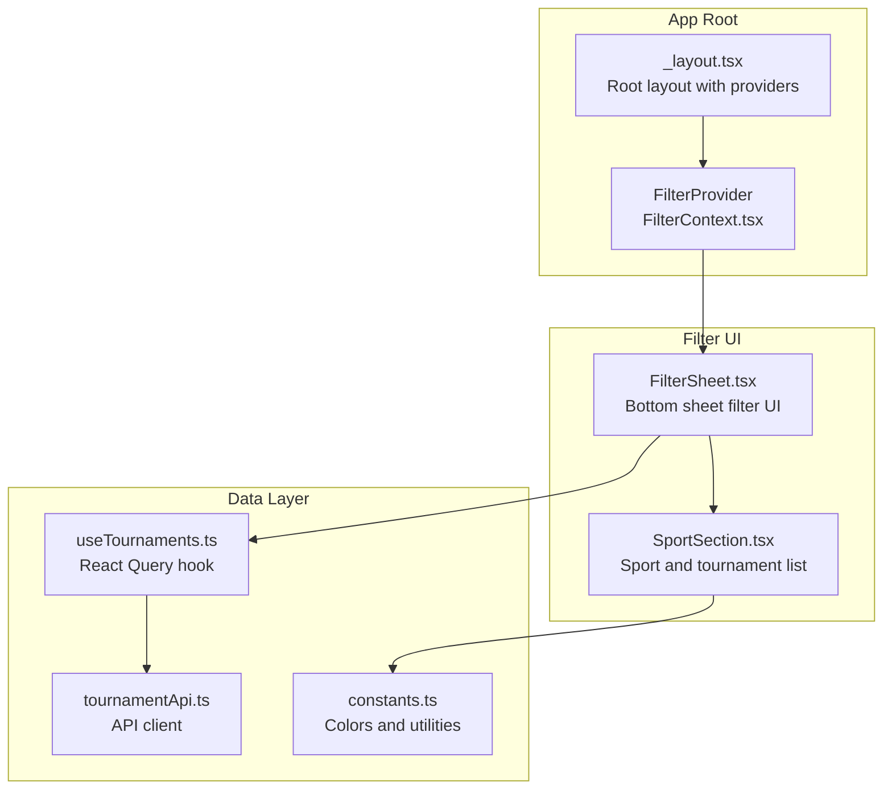
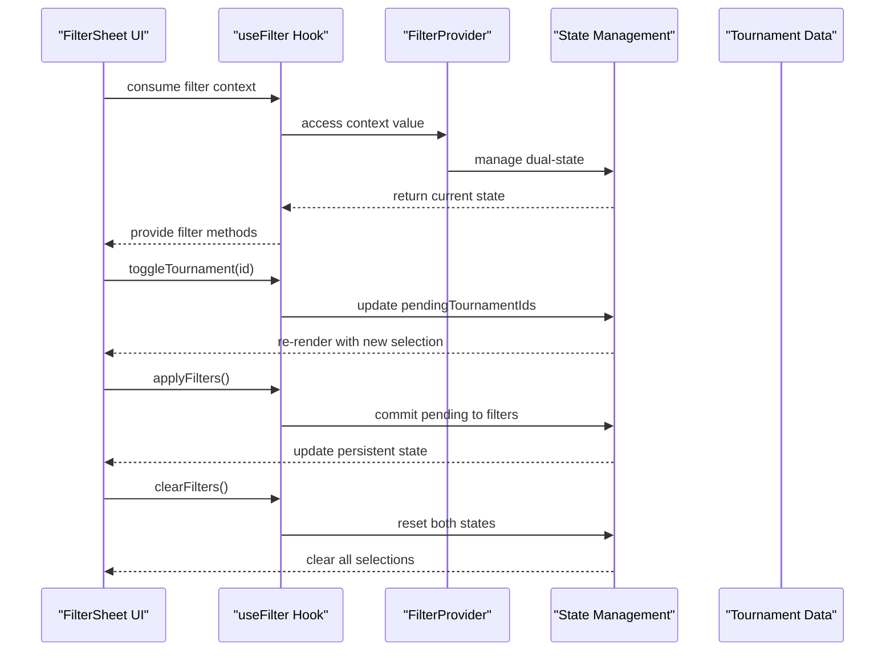
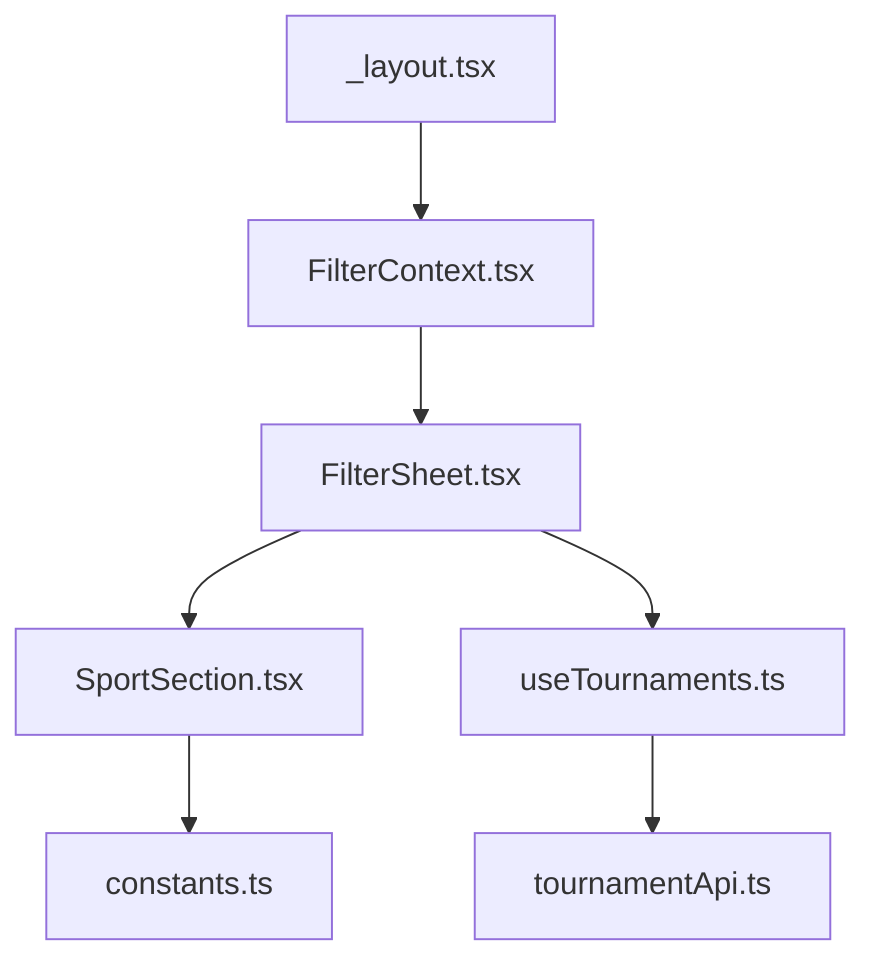

# Filter Context Provider

<cite>
**Referenced Files in This Document**
- [FilterContext.tsx](file://app/context/FilterContext.tsx)
- [FilterSheet.tsx](file://app/components/filter/FilterSheet.tsx)
- [SportSection.tsx](file://app/components/filter/SportSection.tsx)
- [_layout.tsx](file://app/_layout.tsx)
- [useTournaments.ts](file://app/hooks/useTournaments.ts)
- [tournamentApi.ts](file://app/services/tournamentApi.ts)
- [constants.ts](file://app/utils/constants.ts)
</cite>

## Table of Contents
1. [Introduction](#introduction)
2. [Project Structure](#project-structure)
3. [Core Components](#core-components)
4. [Architecture Overview](#architecture-overview)
5. [Detailed Component Analysis](#detailed-component-analysis)
6. [Dependency Analysis](#dependency-analysis)
7. [Performance Considerations](#performance-considerations)
8. [Troubleshooting Guide](#troubleshooting-guide)
9. [Conclusion](#conclusion)

## Introduction
This document provides comprehensive technical documentation for the FilterContext provider implementation. It explains the dual-state filtering mechanism using both persistent and pending tournament selections, the context interface contracts, provider structure, and practical usage patterns. The implementation enables immediate UI feedback during filtering while maintaining a clean separation between temporary selections and committed state.

## Project Structure
The filter functionality is organized around a React Context provider that manages tournament filtering state. The provider is integrated at the application root level and consumed by filter UI components.

**Diagram sources**
- [_layout.tsx](file://app/_layout.tsx#L19-L34)
- [FilterContext.tsx](file://app/context/FilterContext.tsx#L20-L63)
- [FilterSheet.tsx](file://app/components/filter/FilterSheet.tsx#L16-L50)
- [SportSection.tsx](file://app/components/filter/SportSection.tsx#L15-L76)
- [useTournaments.ts](file://app/hooks/useTournaments.ts#L11-L44)
- [tournamentApi.ts](file://app/services/tournamentApi.ts#L4-L34)
- [constants.ts](file://app/utils/constants.ts#L23-L37)

**Section sources**
- [_layout.tsx](file://app/_layout.tsx#L19-L34)

## Core Components
This section documents the FilterContext provider and its associated interfaces, focusing on the dual-state management approach and context methods.

### FilterState Interface
The FilterState interface defines the persistent filtering state:
- selectedTournamentIds: number[] - Array containing the IDs of currently selected tournaments

This represents the committed filter state that persists across UI interactions until explicitly applied or cleared.

### FilterContextType Interface
The FilterContextType interface exposes the complete filtering API:

- filters: FilterState - Current persistent state object
- selectedTournamentIds: number[] - Convenience property mirroring persistent selection
- toggleTournament(id: number): void - Toggle a single tournament selection in pending state
- selectTournaments(ids: number[]): void - Bulk select tournaments for pending state
- clearFilters(): void - Reset both pending and persistent states
- applyFilters(): void - Commit pending selections to persistent state
- isFilterActive: boolean - Boolean flag indicating if any filters are active
- pendingTournamentIds: number[] - Temporary selection buffer for immediate UI feedback

### Dual-State Management Pattern
The provider implements a sophisticated dual-state approach:
- Pending State: Immediate UI feedback using pendingTournamentIds
- Persistent State: Committed selections stored in filters.selectedTournamentIds

This separation ensures users see instant visual feedback when toggling selections while maintaining clean state boundaries.

**Section sources**
- [FilterContext.tsx](file://app/context/FilterContext.tsx#L3-L16)
- [FilterContext.tsx](file://app/context/FilterContext.tsx#L20-L63)

## Architecture Overview
The filter architecture follows a layered approach with clear separation of concerns:

**Diagram sources**
- [FilterSheet.tsx](file://app/components/filter/FilterSheet.tsx#L16-L50)
- [FilterContext.tsx](file://app/context/FilterContext.tsx#L20-L63)

## Detailed Component Analysis

### FilterProvider Implementation
The FilterProvider component creates and manages the filtering context:

#### State Initialization
- Filters state initialized with empty selectedTournamentIds array
- Pending state initialized as empty array for immediate selection feedback

#### Method Implementations
- toggleTournament: Uses functional updates to add/remove tournament IDs from pending state
- selectTournaments: Replaces pending state with provided ID array
- clearFilters: Resets both pending and persistent states to empty arrays
- applyFilters: Commits pending selections to persistent state atomically
- isFilterActive: Computes active state from persistent selection count

#### Context Value Construction
The provider constructs a context object with:
- filters object for persistent state
- selectedTournamentIds alias for convenience
- All filter manipulation methods
- isFilterActive boolean flag
- pendingTournamentIds array for immediate feedback

### FilterSheet Component Integration
The FilterSheet demonstrates practical context consumption:

#### Data Fetching
Uses useTournaments hook to fetch sport and tournament data with caching and pagination support.

#### Context Consumption
Consumes pendingTournamentIds, toggleTournament, clearFilters, applyFilters, and selectedTournamentIds from the filter context.

#### UI Behavior
- Displays loading states during data fetch
- Shows error states with retry capability
- Renders sport sections with tournament lists
- Provides apply and reset buttons with dynamic state

### SportSection Component
The SportSection component handles individual tournament selection:

#### Selection Logic
- Uses selectedIds prop to determine visual selection state
- Calls onToggleTournament callback when a tournament is pressed
- Implements visual feedback with checkmarks and color indicators

#### Performance Optimizations
- Uses React.memo for component memoization
- Implements useCallback for event handlers
- Maintains stable references for efficient re-renders

### Error Handling in useFilter Hook
The useFilter hook provides robust error handling:
- Throws descriptive error when used outside FilterProvider
- Ensures type safety through TypeScript context typing
- Prevents runtime errors through context validation

**Section sources**
- [FilterContext.tsx](file://app/context/FilterContext.tsx#L20-L71)
- [FilterSheet.tsx](file://app/components/filter/FilterSheet.tsx#L16-L125)
- [SportSection.tsx](file://app/components/filter/SportSection.tsx#L15-L81)
- [useTournaments.ts](file://app/hooks/useTournaments.ts#L11-L44)

## Dependency Analysis
The filter context has minimal external dependencies and clear internal relationships:

**Diagram sources**
- [FilterContext.tsx](file://app/context/FilterContext.tsx#L1-L72)
- [FilterSheet.tsx](file://app/components/filter/FilterSheet.tsx#L1-L128)
- [SportSection.tsx](file://app/components/filter/SportSection.tsx#L1-L82)
- [useTournaments.ts](file://app/hooks/useTournaments.ts#L1-L45)
- [tournamentApi.ts](file://app/services/tournamentApi.ts#L1-L35)
- [_layout.tsx](file://app/_layout.tsx#L1-L35)

### Internal Dependencies
- FilterContext depends on React's createContext and useState
- FilterSheet consumes FilterContext and useTournaments
- SportSection depends on FilterContext and constants
- useTournaments depends on React Query and tournamentApi

### External Dependencies
- React (core)
- @gorhom/bottom-sheet (UI components)
- @tanstack/react-query (data fetching)
- Expo vector icons (UI icons)

**Section sources**
- [FilterContext.tsx](file://app/context/FilterContext.tsx#L1-L72)
- [FilterSheet.tsx](file://app/components/filter/FilterSheet.tsx#L1-L128)
- [SportSection.tsx](file://app/components/filter/SportSection.tsx#L1-L82)
- [useTournaments.ts](file://app/hooks/useTournaments.ts#L1-L45)
- [tournamentApi.ts](file://app/services/tournamentApi.ts#L1-L35)
- [_layout.tsx](file://app/_layout.tsx#L1-L35)

## Performance Considerations
The filter implementation incorporates several performance optimizations:

### State Management Efficiency
- Separate pending and persistent states prevent unnecessary re-renders
- Functional state updates ensure atomic operations
- Memoized callbacks reduce component re-renders

### UI Responsiveness
- Immediate visual feedback through pending state updates
- Efficient list rendering with FlatList components
- Optimized component memoization with React.memo

### Data Fetching Optimization
- React Query caching reduces network requests
- Configurable staleTime prevents excessive refetching
- Pagination support limits initial payload size

## Troubleshooting Guide

### Common Issues and Solutions

#### useFilter Hook Error
**Problem**: Using useFilter outside FilterProvider
**Solution**: Ensure all components consuming the hook are wrapped in FilterProvider

#### State Synchronization Issues
**Problem**: UI not reflecting filter changes
**Solution**: Verify that applyFilters is called to commit pending changes

#### Performance Problems
**Problem**: Slow filter interactions
**Solution**: Check for unnecessary re-renders and ensure proper memoization

#### Data Loading States
**Problem**: Filter sheet not showing loading states
**Solution**: Verify useTournaments hook is properly configured with enabled flag

### Debugging Tips
- Monitor pendingTournamentIds vs selectedTournamentIds arrays
- Use React DevTools to inspect context value updates
- Check network requests for tournament data fetching
- Verify sport color mapping in constants

**Section sources**
- [FilterContext.tsx](file://app/context/FilterContext.tsx#L65-L71)
- [FilterSheet.tsx](file://app/components/filter/FilterSheet.tsx#L73-L91)

## Conclusion
The FilterContext provider implementation demonstrates a robust dual-state filtering system that balances immediate user feedback with clean state management. The architecture separates concerns effectively, with clear boundaries between pending and persistent states, comprehensive error handling, and optimized performance patterns. The implementation serves as a model for complex state management in React applications, particularly for scenarios requiring immediate UI feedback alongside persisted state changes.