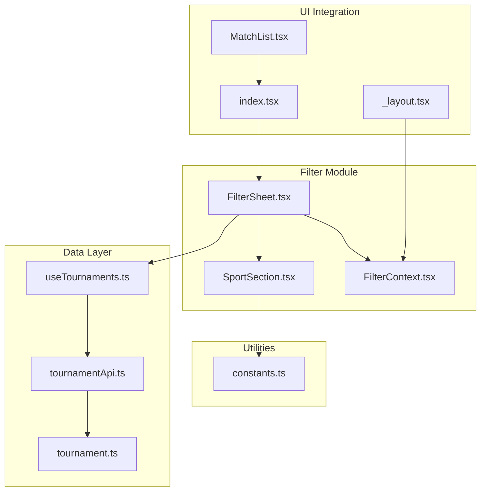
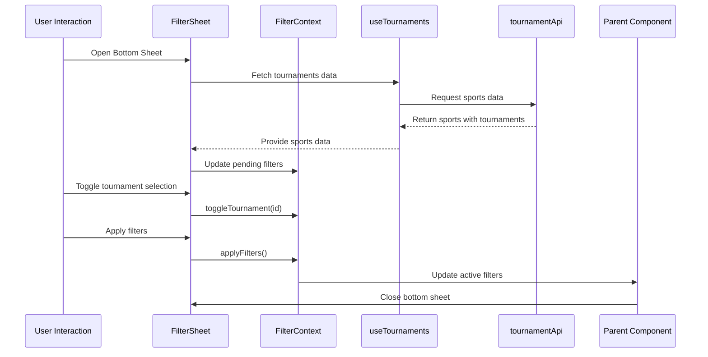
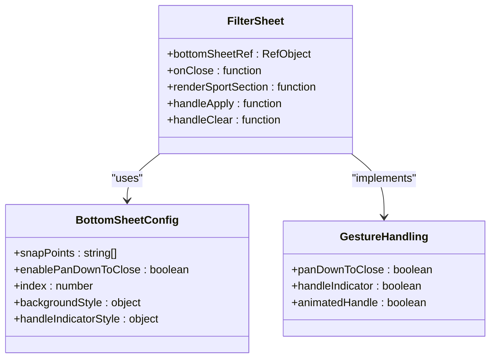
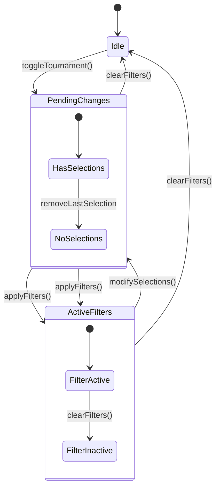
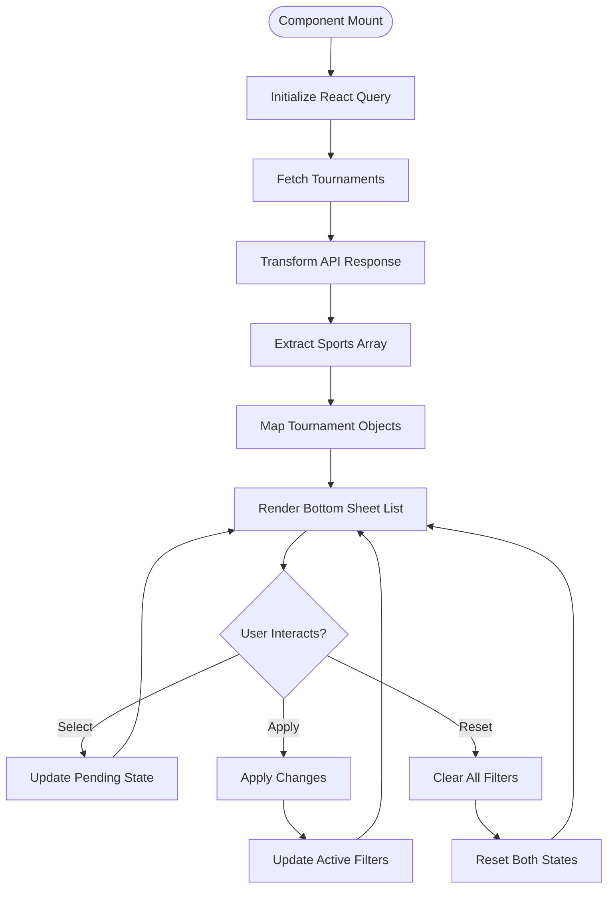
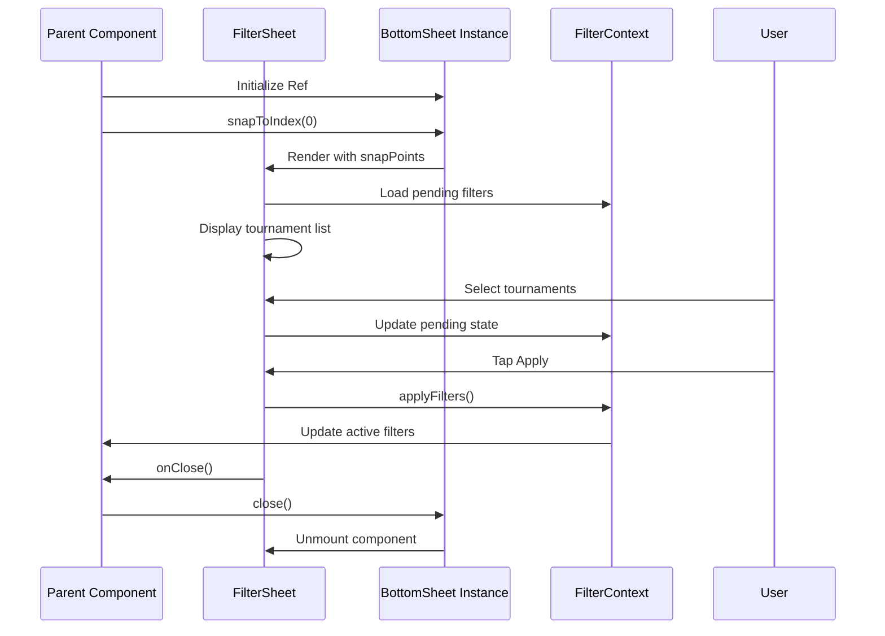

# Filter Sheet Modal

<cite>
**Referenced Files in This Document**
- [FilterSheet.tsx](file://app/components/filter/FilterSheet.tsx)
- [FilterContext.tsx](file://app/context/FilterContext.tsx)
- [SportSection.tsx](file://app/components/filter/SportSection.tsx)
- [index.tsx](file://app/index.tsx)
- [_layout.tsx](file://app/_layout.tsx)
- [useTournaments.ts](file://app/hooks/useTournaments.ts)
- [tournamentApi.ts](file://app/services/tournamentApi.ts)
- [constants.ts](file://app/utils/constants.ts)
- [tournament.ts](file://app/types/tournament.ts)
- [MatchList.tsx](file://app/components/match/MatchList.tsx)
</cite>

## Table of Contents
1. [Introduction](#introduction)
2. [Project Structure](#project-structure)
3. [Core Components](#core-components)
4. [Architecture Overview](#architecture-overview)
5. [Detailed Component Analysis](#detailed-component-analysis)
6. [Dependency Analysis](#dependency-analysis)
7. [Performance Considerations](#performance-considerations)
8. [Troubleshooting Guide](#troubleshooting-guide)
9. [Conclusion](#conclusion)

## Introduction
This document provides comprehensive documentation for the FilterSheet component implementation. The FilterSheet is a bottom sheet modal built with the @gorhom/bottom-sheet library that enables users to filter matches by tournament categories. It integrates with FilterContext for state management, uses React Query for data fetching, and provides a responsive, gesture-driven interface with smooth animations and backdrop interactions.

The component serves as a central hub for tournament filtering, allowing users to:
- Browse tournaments organized by sport categories
- Toggle individual tournament selections
- Apply or reset filters
- Navigate through loading and error states
- Experience smooth bottom sheet animations and gestures

## Project Structure
The FilterSheet implementation spans several key files that demonstrate a clean separation of concerns:



**Diagram sources**
- [FilterSheet.tsx](file://app/components/filter/FilterSheet.tsx#L1-L128)
- [FilterContext.tsx](file://app/context/FilterContext.tsx#L1-L72)
- [SportSection.tsx](file://app/components/filter/SportSection.tsx#L1-L82)
- [useTournaments.ts](file://app/hooks/useTournaments.ts#L1-L45)
- [tournamentApi.ts](file://app/services/tournamentApi.ts#L1-L35)
- [index.tsx](file://app/index.tsx#L1-L108)
- [MatchList.tsx](file://app/components/match/MatchList.tsx#L1-L117)
- [_layout.tsx](file://app/_layout.tsx#L1-L35)

**Section sources**
- [FilterSheet.tsx](file://app/components/filter/FilterSheet.tsx#L1-L128)
- [FilterContext.tsx](file://app/context/FilterContext.tsx#L1-L72)
- [index.tsx](file://app/index.tsx#L1-L108)

## Core Components
The FilterSheet implementation consists of three primary components working together:

### FilterSheet Component
The main bottom sheet container that manages:
- Bottom sheet configuration and gesture handling
- Tournament data loading and display
- Filter application and clearing
- Header, content, and footer layouts

### SportSection Component
Individual sport category renderer that:
- Displays sport metadata with color coding
- Renders tournament lists with selection indicators
- Handles individual tournament toggling
- Provides visual feedback for selected items

### FilterContext Provider
State management system that:
- Maintains both active and pending filter states
- Provides filter manipulation functions
- Exposes filter activity status
- Supports undo/apply patterns for filter changes

**Section sources**
- [FilterSheet.tsx](file://app/components/filter/FilterSheet.tsx#L16-L125)
- [SportSection.tsx](file://app/components/filter/SportSection.tsx#L15-L76)
- [FilterContext.tsx](file://app/context/FilterContext.tsx#L20-L62)

## Architecture Overview
The FilterSheet follows a unidirectional data flow pattern with clear separation between presentation, state management, and data fetching:



**Diagram sources**
- [FilterSheet.tsx](file://app/components/filter/FilterSheet.tsx#L17-L39)
- [FilterContext.tsx](file://app/context/FilterContext.tsx#L26-L43)
- [useTournaments.ts](file://app/hooks/useTournaments.ts#L14-L28)
- [tournamentApi.ts](file://app/services/tournamentApi.ts#L4-L34)
- [index.tsx](file://app/index.tsx#L27-L33)

## Detailed Component Analysis

### Bottom Sheet Configuration and Behavior
The FilterSheet utilizes @gorhom/bottom-sheet with carefully configured gesture handling and animation parameters:



**Diagram sources**
- [FilterSheet.tsx](file://app/components/filter/FilterSheet.tsx#L26-L62)

Key configuration aspects:
- **Snap Points**: Uses percentage-based sizing ('50%' and '85%') for adaptive height
- **Gesture Handling**: Enables pan-down-to-close functionality
- **Animation**: Leverages native bottom sheet animations
- **Visual Indicators**: Custom handle indicator styling for better UX

### Filter State Management
The FilterContext implements a dual-state pattern for seamless filter operations:



**Diagram sources**
- [FilterContext.tsx](file://app/context/FilterContext.tsx#L21-L43)

The state management provides:
- **Pending State**: Temporary state for filter modifications
- **Active State**: Finalized filter application
- **Toggle Operations**: Add/remove individual tournament selections
- **Bulk Operations**: Clear all filters or apply pending changes

### Tournament Data Integration
The component integrates with a sophisticated data fetching system:



**Diagram sources**
- [useTournaments.ts](file://app/hooks/useTournaments.ts#L14-L43)
- [tournamentApi.ts](file://app/services/tournamentApi.ts#L4-L34)

**Section sources**
- [FilterSheet.tsx](file://app/components/filter/FilterSheet.tsx#L16-L125)
- [FilterContext.tsx](file://app/context/FilterContext.tsx#L20-L62)
- [SportSection.tsx](file://app/components/filter/SportSection.tsx#L15-L76)

### User Interaction Patterns
The FilterSheet implements comprehensive user interaction patterns:

#### Gesture-Based Navigation
- **Swipe-to-Dismantle**: Pan down gesture closes the sheet
- **Drag Handle**: Visual handle indicator for intuitive dragging
- **Edge Cases**: Prevents accidental dismissals during content interaction

#### Selection Feedback
- **Visual Indicators**: Checkmark icons for selected tournaments
- **Color Coding**: Sport-specific colors for better categorization
- **Haptic Feedback**: Light haptic responses for tactile feedback
- **State Persistence**: Maintains selection state across interactions

#### Responsive Design Adaptations
- **Dynamic Sizing**: Percentage-based snap points adapt to screen sizes
- **Content Padding**: Bottom padding accommodates floating action buttons
- **Scroll Behavior**: Optimized FlatList for large tournament datasets
- **Loading States**: Graceful loading indicators with retry capabilities

**Section sources**
- [FilterSheet.tsx](file://app/components/filter/FilterSheet.tsx#L55-L100)
- [SportSection.tsx](file://app/components/filter/SportSection.tsx#L45-L71)

### Modal Lifecycle Management
The FilterSheet participates in a complete modal lifecycle managed by the parent component:



**Diagram sources**
- [index.tsx](file://app/index.tsx#L11-L33)
- [FilterSheet.tsx](file://app/components/filter/FilterSheet.tsx#L28-L31)

**Section sources**
- [index.tsx](file://app/index.tsx#L27-L33)
- [FilterSheet.tsx](file://app/components/filter/FilterSheet.tsx#L28-L31)

## Dependency Analysis
The FilterSheet implementation demonstrates excellent dependency management with clear boundaries:

```mermaid
graph LR
subgraph "External Dependencies"
BS[@gorhom/bottom-sheet]
RQ[React Query]
RN[React Native]
end
subgraph "Internal Dependencies"
FC[FilterContext]
UT[useTournaments]
TA[tournamentApi]
TT[tournament types]
CTS[constants]
end
subgraph "UI Components"
FS[FilterSheet]
SS[SportSection]
ML[MatchList]
end
FS --> BS
FS --> FC
FS --> UT
FS --> SS
SS --> CTS
UT --> RQ
UT --> TA
TA --> TT
ML --> FS
FC --> FS
```

**Diagram sources**
- [FilterSheet.tsx](file://app/components/filter/FilterSheet.tsx#L1-L9)
- [FilterContext.tsx](file://app/context/FilterContext.tsx#L1-L1)
- [useTournaments.ts](file://app/hooks/useTournaments.ts#L1-L3)
- [tournamentApi.ts](file://app/services/tournamentApi.ts#L1-L2)
- [constants.ts](file://app/utils/constants.ts#L1-L38)

Key dependency characteristics:
- **External Libraries**: Minimal external dependencies focused on specific functionality
- **Internal Cohesion**: Strong internal cohesion within the filter module
- **Type Safety**: Comprehensive TypeScript typing throughout the implementation
- **Hook Integration**: Seamless integration with React Query for data management

**Section sources**
- [FilterSheet.tsx](file://app/components/filter/FilterSheet.tsx#L1-L9)
- [FilterContext.tsx](file://app/context/FilterContext.tsx#L1-L1)
- [useTournaments.ts](file://app/hooks/useTournaments.ts#L1-L3)

## Performance Considerations
The implementation incorporates several performance optimizations:

### Memory Management
- **Component Memoization**: SportSection uses React.memo to prevent unnecessary re-renders
- **Callback Optimization**: useCallback hooks prevent function recreation on each render
- **State Management**: Efficient state updates minimize re-render cycles

### Data Fetching Optimization
- **Query Caching**: React Query provides intelligent caching with configurable stale times
- **Pagination Support**: Built-in support for pagination and infinite scrolling
- **Background Updates**: Automatic background refetching for fresh data

### UI Performance
- **FlatList Optimization**: Efficient list rendering with virtualization
- **Conditional Rendering**: Loading and error states prevent unnecessary DOM updates
- **CSS-in-JS**: Tailwind classes provide efficient styling without runtime overhead

## Troubleshooting Guide
Common issues and their solutions:

### Bottom Sheet Not Opening
**Symptoms**: Clicking filter button does nothing
**Causes**: 
- BottomSheet ref not properly initialized
- Parent component not wrapped with BottomSheetModalProvider
- Snap points configuration issues

**Solutions**:
- Verify BottomSheet ref initialization in parent component
- Ensure _layout.tsx wraps the app with BottomSheetModalProvider
- Check snapPoints array format and values

### Filters Not Applying
**Symptoms**: Selected tournaments don't affect match list
**Causes**:
- Pending filters not properly applied
- FilterContext provider not properly configured
- State synchronization issues

**Solutions**:
- Verify applyFilters() is called before closing
- Ensure FilterProvider wraps the application
- Check useFilter hook usage in parent component

### Data Loading Issues
**Symptoms**: Loading spinner stuck or error state not showing
**Causes**:
- Network connectivity problems
- API endpoint changes
- Data transformation errors

**Solutions**:
- Verify API endpoint accessibility
- Check network permissions
- Review data transformation logic

**Section sources**
- [index.tsx](file://app/index.tsx#L11-L33)
- [_layout.tsx](file://app/_layout.tsx#L23-L30)
- [FilterContext.tsx](file://app/context/FilterContext.tsx#L65-L71)

## Conclusion
The FilterSheet component represents a well-architected solution for tournament filtering in a React Native application. Its implementation demonstrates:

- **Clean Architecture**: Clear separation of concerns between UI, state, and data layers
- **User Experience**: Thoughtful gesture handling, visual feedback, and responsive design
- **Technical Excellence**: Robust state management, efficient data fetching, and performance optimizations
- **Maintainability**: Well-structured code with comprehensive type safety and testing considerations

The component successfully integrates multiple libraries and patterns while maintaining simplicity and reliability. Its modular design allows for easy extension and modification, making it a solid foundation for future enhancements such as advanced filtering options, search functionality, or additional sport categories.