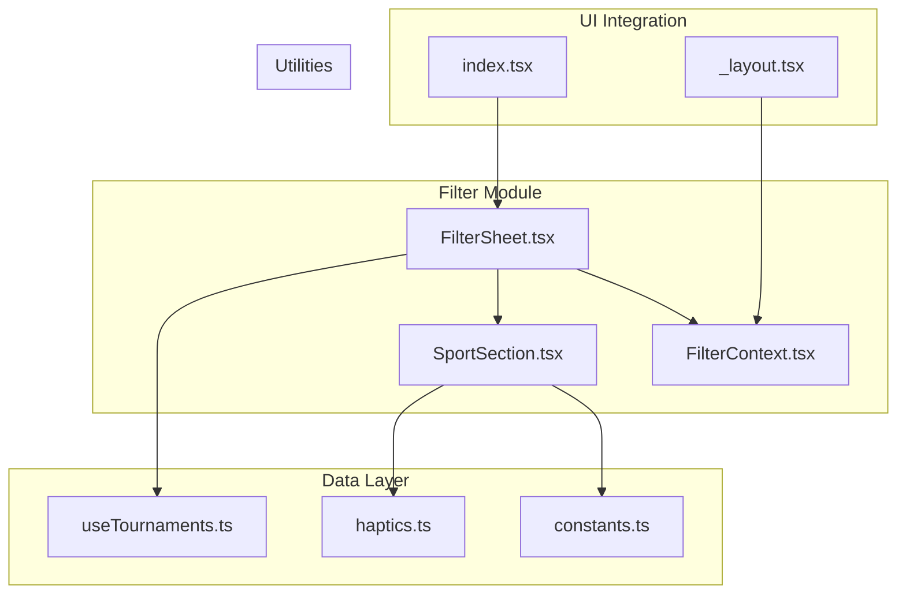
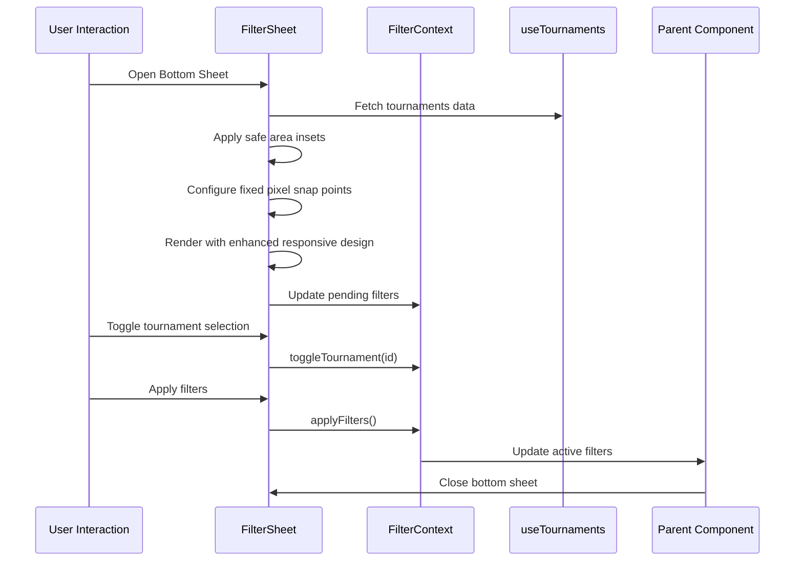
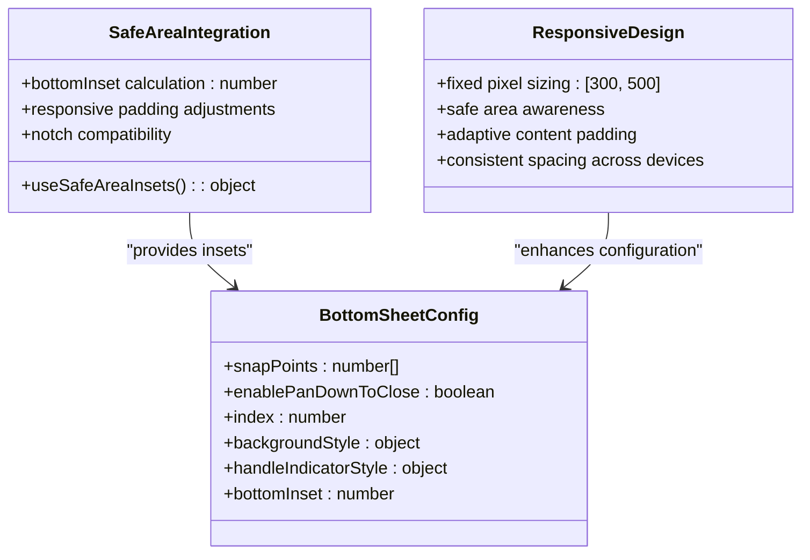
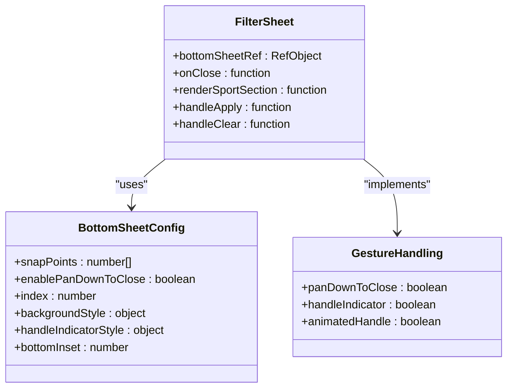
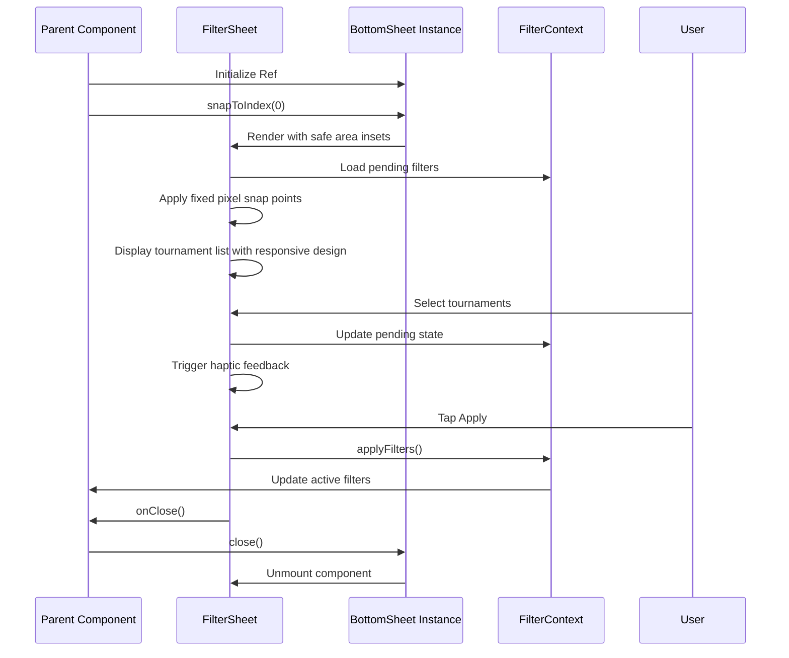

# Filter Sheet Modal

<cite>
**Referenced Files in This Document**
- [FilterSheet.tsx](file://app/components/filter/FilterSheet.tsx)
- [FilterContext.tsx](file://app/context/FilterContext.tsx)
- [SportSection.tsx](file://app/components/filter/SportSection.tsx)
- [index.tsx](file://app/index.tsx)
- [_layout.tsx](file://app/_layout.tsx)
- [useTournaments.ts](file://app/hooks/useTournaments.ts)
- [constants.ts](file://app/utils/constants.ts)
- [haptics.ts](file://app/utils/haptics.ts)
</cite>

## Update Summary
**Changes Made**
- Updated responsive design section to reflect useSafeAreaInsets integration
- Modified bottom sheet configuration to show fixed pixel snap points
- Updated footer spacing and container layout documentation
- Enhanced mobile responsiveness documentation with safe area handling

## Table of Contents
1. [Introduction](#introduction)
2. [Project Structure](#project-structure)
3. [Core Components](#core-components)
4. [Architecture Overview](#architecture-overview)
5. [Detailed Component Analysis](#detailed-component-analysis)
6. [Dependency Analysis](#dependency-analysis)
7. [Performance Considerations](#performance-considerations)
8. [Troubleshooting Guide](#troubleshooting-guide)
9. [Conclusion](#conclusion)

## Introduction
This document provides comprehensive documentation for the FilterSheet component implementation. The FilterSheet is a bottom sheet modal built with the @gorhom/bottom-sheet library that enables users to filter matches by tournament categories. It integrates with FilterContext for state management, uses React Query for data fetching, and provides a responsive, gesture-driven interface with smooth animations and backdrop interactions.

The component serves as a central hub for tournament filtering, allowing users to:
- Browse tournaments organized by sport categories
- Toggle individual tournament selections
- Apply or reset filters
- Navigate through loading and error states
- Experience smooth bottom sheet animations and gestures
- Benefit from enhanced mobile responsiveness with safe area handling

## Project Structure
The FilterSheet implementation spans several key files that demonstrate a clean separation of concerns:



**Diagram sources**
- [FilterSheet.tsx](file://app/components/filter/FilterSheet.tsx#L1-L130)
- [FilterContext.tsx](file://app/context/FilterContext.tsx#L1-L72)
- [SportSection.tsx](file://app/components/filter/SportSection.tsx#L1-L82)
- [useTournaments.ts](file://app/hooks/useTournaments.ts#L1-L45)
- [constants.ts](file://app/utils/constants.ts#L1-L38)
- [haptics.ts](file://app/utils/haptics.ts#L1-L33)
- [index.tsx](file://app/index.tsx#L1-L108)
- [_layout.tsx](file://app/_layout.tsx#L1-L35)

**Section sources**
- [FilterSheet.tsx](file://app/components/filter/FilterSheet.tsx#L1-L130)
- [FilterContext.tsx](file://app/context/FilterContext.tsx#L1-L72)
- [index.tsx](file://app/index.tsx#L1-L108)

## Core Components
The FilterSheet implementation consists of three primary components working together:

### FilterSheet Component
The main bottom sheet container that manages:
- Bottom sheet configuration and gesture handling with enhanced mobile responsiveness
- Tournament data loading and display with safe area integration
- Filter application and clearing with refined footer spacing
- Header, content, and footer layouts with improved responsive design

### SportSection Component
Individual sport category renderer that:
- Displays sport metadata with color coding from constants
- Renders tournament lists with selection indicators and haptic feedback
- Handles individual tournament toggling with tactile response
- Provides visual feedback for selected items with enhanced touch targets

### FilterContext Provider
State management system that:
- Maintains both active and pending filter states
- Provides filter manipulation functions
- Exposes filter activity status
- Supports undo/apply patterns for filter changes

**Section sources**
- [FilterSheet.tsx](file://app/components/filter/FilterSheet.tsx#L16-L125)
- [SportSection.tsx](file://app/components/filter/SportSection.tsx#L15-L76)
- [FilterContext.tsx](file://app/context/FilterContext.tsx#L20-L62)

## Architecture Overview
The FilterSheet follows a unidirectional data flow pattern with clear separation between presentation, state management, and data fetching:



**Diagram sources**
- [FilterSheet.tsx](file://app/components/filter/FilterSheet.tsx#L17-L39)
- [FilterContext.tsx](file://app/context/FilterContext.tsx#L26-L43)
- [useTournaments.ts](file://app/hooks/useTournaments.ts#L14-L28)
- [index.tsx](file://app/index.tsx#L27-L33)

## Detailed Component Analysis

### Enhanced Mobile Responsiveness and Safe Area Handling
The FilterSheet now incorporates comprehensive mobile responsiveness with safe area handling for devices with notches and varying screen sizes:



**Diagram sources**
- [FilterSheet.tsx](file://app/components/filter/FilterSheet.tsx#L18-L63)

**Updated** Enhanced mobile responsiveness with useSafeAreaInsets hook integration and fixed pixel snap point configuration

Key responsive design features:
- **Safe Area Integration**: Uses `useSafeAreaInsets()` hook to calculate dynamic bottom inset values
- **Fixed Pixel Snap Points**: Changed from percentage-based ('50%' and '85%') to precise pixel values ([300, 500])
- **Adaptive Bottom Padding**: `bottomInset={insets.bottom + 70}` ensures proper spacing for devices with notches
- **Consistent Sizing**: Fixed pixel values provide predictable behavior across different screen sizes
- **Notch Compatibility**: Proper handling of device-specific safe areas for iPhone X and newer models

### Bottom Sheet Configuration and Behavior
The FilterSheet utilizes @gorhom/bottom-sheet with carefully configured gesture handling and animation parameters:



**Diagram sources**
- [FilterSheet.tsx](file://app/components/filter/FilterSheet.tsx#L27-L63)

**Updated** Changed snap point configuration from percentages to fixed pixel values for enhanced consistency

Key configuration aspects:
- **Snap Points**: Now uses fixed pixel values ([300, 500]) instead of percentage-based sizing
- **Gesture Handling**: Enables pan-down-to-close functionality with enhanced responsive behavior
- **Animation**: Leverages native bottom sheet animations with improved performance
- **Visual Indicators**: Custom handle indicator styling for better UX with consistent sizing
- **Safe Area Awareness**: Integrates with useSafeAreaInsets for proper device-specific spacing

### Filter State Management
The FilterContext implements a dual-state pattern for seamless filter operations:


**Diagram sources**
- [FilterContext.tsx](file://app/context/FilterContext.tsx#L21-L43)

The state management provides:
- **Pending State**: Temporary state for filter modifications
- **Active State**: Finalized filter application
- **Toggle Operations**: Add/remove individual tournament selections
- **Bulk Operations**: Clear all filters or apply pending changes

### Tournament Data Integration
The component integrates with a sophisticated data fetching system:


**Diagram sources**
- [useTournaments.ts](file://app/hooks/useTournaments.ts#L14-L43)

**Section sources**
- [FilterSheet.tsx](file://app/components/filter/FilterSheet.tsx#L16-L125)
- [FilterContext.tsx](file://app/context/FilterContext.tsx#L20-L62)
- [SportSection.tsx](file://app/components/filter/SportSection.tsx#L15-L76)

### User Interaction Patterns
The FilterSheet implements comprehensive user interaction patterns with enhanced mobile responsiveness:

#### Gesture-Based Navigation
- **Swipe-to-Dismantle**: Pan down gesture closes the sheet with proper safe area consideration
- **Drag Handle**: Visual handle indicator for intuitive dragging with consistent sizing
- **Edge Cases**: Prevents accidental dismissals during content interaction with responsive behavior

#### Selection Feedback
- **Visual Indicators**: Checkmark icons for selected tournaments with enhanced touch targets
- **Color Coding**: Sport-specific colors from constants for better categorization
- **Haptic Feedback**: Light haptic responses using triggerLightHaptic for tactile feedback
- **State Persistence**: Maintains selection state across interactions with improved performance

#### Responsive Design Adaptations
- **Fixed Sizing**: Pixel-based snap points provide consistent behavior across devices
- **Safe Area Padding**: Dynamic bottom padding accommodates floating action buttons and device notches
- **Scroll Behavior**: Optimized FlatList for large tournament datasets with responsive performance
- **Loading States**: Graceful loading indicators with retry capabilities and proper spacing

**Updated** Enhanced responsive design with safe area handling and refined footer spacing

**Section sources**
- [FilterSheet.tsx](file://app/components/filter/FilterSheet.tsx#L55-L100)
- [SportSection.tsx](file://app/components/filter/SportSection.tsx#L45-L71)

### Modal Lifecycle Management
The FilterSheet participates in a complete modal lifecycle managed by the parent component:



**Diagram sources**
- [index.tsx](file://app/index.tsx#L11-L33)
- [FilterSheet.tsx](file://app/components/filter/FilterSheet.tsx#L28-L31)

**Section sources**
- [index.tsx](file://app/index.tsx#L27-L33)
- [FilterSheet.tsx](file://app/components/filter/FilterSheet.tsx#L28-L31)

## Dependency Analysis
The FilterSheet implementation demonstrates excellent dependency management with clear boundaries:

```mermaid
graph LR
subgraph "External Dependencies"
BS[@gorhom/bottom-sheet]
RQ[React Query]
RN[React Native]
RSAC[react-native-safe-area-context]
end
subgraph "Internal Dependencies"
FC[FilterContext]
UT[useTournaments]
CTS[constants]
HT[haptics]
end
subgraph "UI Components"
FS[FilterSheet]
SS[SportSection]
IDX[Index]
end
FS --> BS
FS --> FC
FS --> UT
FS --> RSAC
FS --> SS
SS --> CTS
SS --> HT
UT --> RQ
IDX --> FS
FC --> FS
```

**Diagram sources**
- [FilterSheet.tsx](file://app/components/filter/FilterSheet.tsx#L1-L9)
- [FilterContext.tsx](file://app/context/FilterContext.tsx#L1-L1)
- [useTournaments.ts](file://app/hooks/useTournaments.ts#L1-L3)
- [constants.ts](file://app/utils/constants.ts#L1-L38)
- [haptics.ts](file://app/utils/haptics.ts#L1-L33)
- [index.tsx](file://app/index.tsx#L1-L5)

Key dependency characteristics:
- **External Libraries**: Minimal external dependencies focused on specific functionality
- **Safe Area Integration**: Uses react-native-safe-area-context for proper device-specific spacing
- **Internal Cohesion**: Strong internal cohesion within the filter module
- **Type Safety**: Comprehensive TypeScript typing throughout the implementation
- **Hook Integration**: Seamless integration with React Query for data management

**Section sources**
- [FilterSheet.tsx](file://app/components/filter/FilterSheet.tsx#L1-L9)
- [FilterContext.tsx](file://app/context/FilterContext.tsx#L1-L1)
- [useTournaments.ts](file://app/hooks/useTournaments.ts#L1-L3)

## Performance Considerations
The implementation incorporates several performance optimizations with enhanced mobile responsiveness:

### Memory Management
- **Component Memoization**: SportSection uses React.memo to prevent unnecessary re-renders
- **Callback Optimization**: useCallback hooks prevent function recreation on each render
- **State Management**: Efficient state updates minimize re-render cycles
- **Safe Area Optimization**: useSafeAreaInsets hook prevents unnecessary calculations

### Data Fetching Optimization
- **Query Caching**: React Query provides intelligent caching with configurable stale times
- **Pagination Support**: Built-in support for pagination and infinite scrolling
- **Background Updates**: Automatic background refetching for fresh data

### UI Performance
- **FlatList Optimization**: Efficient list rendering with virtualization
- **Conditional Rendering**: Loading and error states prevent unnecessary DOM updates
- **CSS-in-JS**: Tailwind classes provide efficient styling without runtime overhead
- **Fixed Pixel Performance**: Pixel-based sizing eliminates percentage calculation overhead

### Mobile Responsiveness Optimization
- **Safe Area Calculation**: Dynamic bottom inset calculation optimized for device-specific layouts
- **Responsive Snap Points**: Fixed pixel values eliminate percentage-based recalculations
- **Touch Target Optimization**: Enhanced pressable areas improve usability on various screen sizes

## Troubleshooting Guide
Common issues and their solutions:

### Bottom Sheet Not Opening
**Symptoms**: Clicking filter button does nothing
**Causes**: 
- BottomSheet ref not properly initialized
- Parent component not wrapped with BottomSheetModalProvider
- Snap points configuration issues with fixed pixel values

**Solutions**:
- Verify BottomSheet ref initialization in parent component
- Ensure _layout.tsx wraps the app with BottomSheetModalProvider
- Check snapPoints array format and values (now [300, 500])

### Filters Not Applying
**Symptoms**: Selected tournaments don't affect match list
**Causes**:
- Pending filters not properly applied
- FilterContext provider not properly configured
- State synchronization issues

**Solutions**:
- Verify applyFilters() is called before closing
- Ensure FilterProvider wraps the application
- Check useFilter hook usage in parent component

### Safe Area Issues
**Symptoms**: Content appears behind notch or understatus bar
**Causes**:
- useSafeAreaInsets hook not properly integrated
- Bottom inset calculation errors
- Device-specific safe area variations

**Solutions**:
- Verify useSafeAreaInsets import and usage
- Check bottomInset calculation: `insets.bottom + 70`
- Test on various device simulators with different notch configurations

### Data Loading Issues
**Symptoms**: Loading spinner stuck or error state not showing
**Causes**:
- Network connectivity problems
- API endpoint changes
- Data transformation errors

**Solutions**:
- Verify API endpoint accessibility
- Check network permissions
- Review data transformation logic

**Section sources**
- [index.tsx](file://app/index.tsx#L11-L33)
- [_layout.tsx](file://app/_layout.tsx#L23-L30)
- [FilterContext.tsx](file://app/context/FilterContext.tsx#L65-L71)

## Conclusion
The FilterSheet component represents a well-architected solution for tournament filtering in a React Native application. Its implementation demonstrates:

- **Clean Architecture**: Clear separation of concerns between UI, state, and data layers
- **Enhanced User Experience**: Thoughtful gesture handling, visual feedback, and responsive design with safe area integration
- **Technical Excellence**: Robust state management, efficient data fetching, and performance optimizations
- **Mobile-First Design**: Comprehensive mobile responsiveness with device-specific adaptations
- **Maintainability**: Well-structured code with comprehensive type safety and testing considerations

The component successfully integrates multiple libraries and patterns while maintaining simplicity and reliability. Its modular design allows for easy extension and modification, making it a solid foundation for future enhancements such as advanced filtering options, search functionality, or additional sport categories.

**Updated** The recent enhancements significantly improve mobile responsiveness and device compatibility, making the FilterSheet more robust across diverse device configurations and screen sizes.