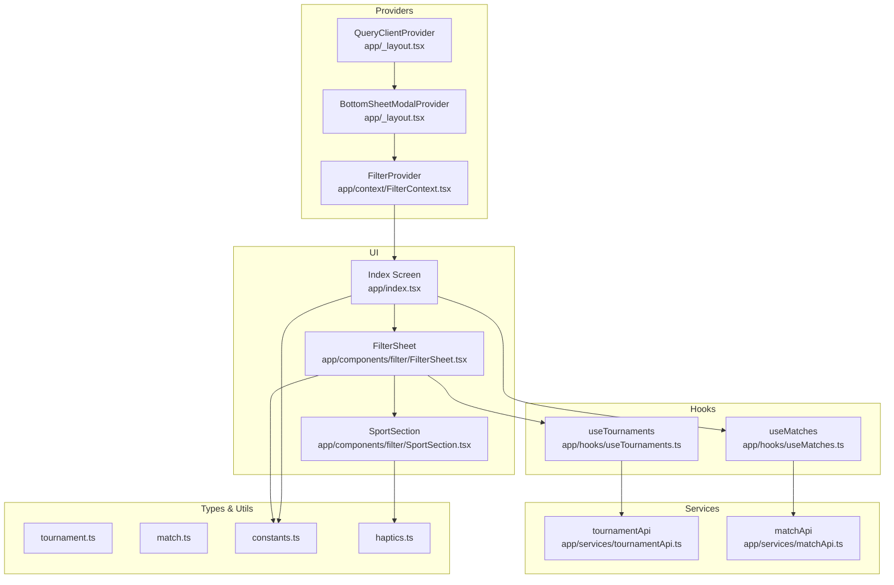
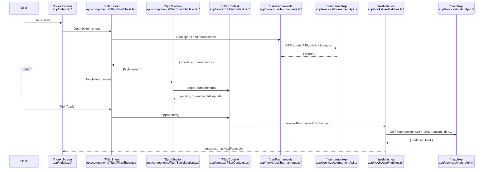
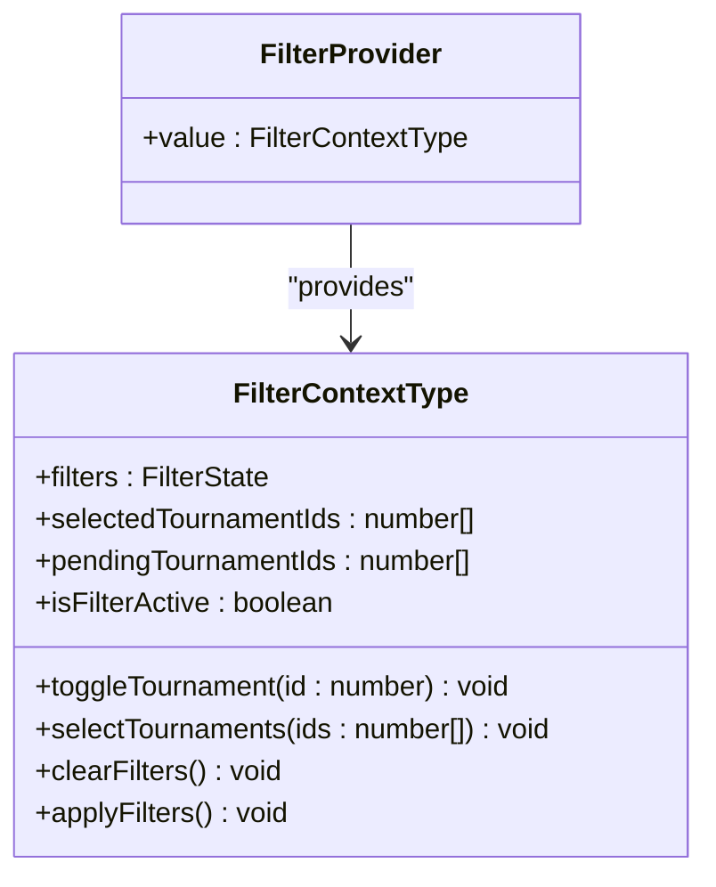
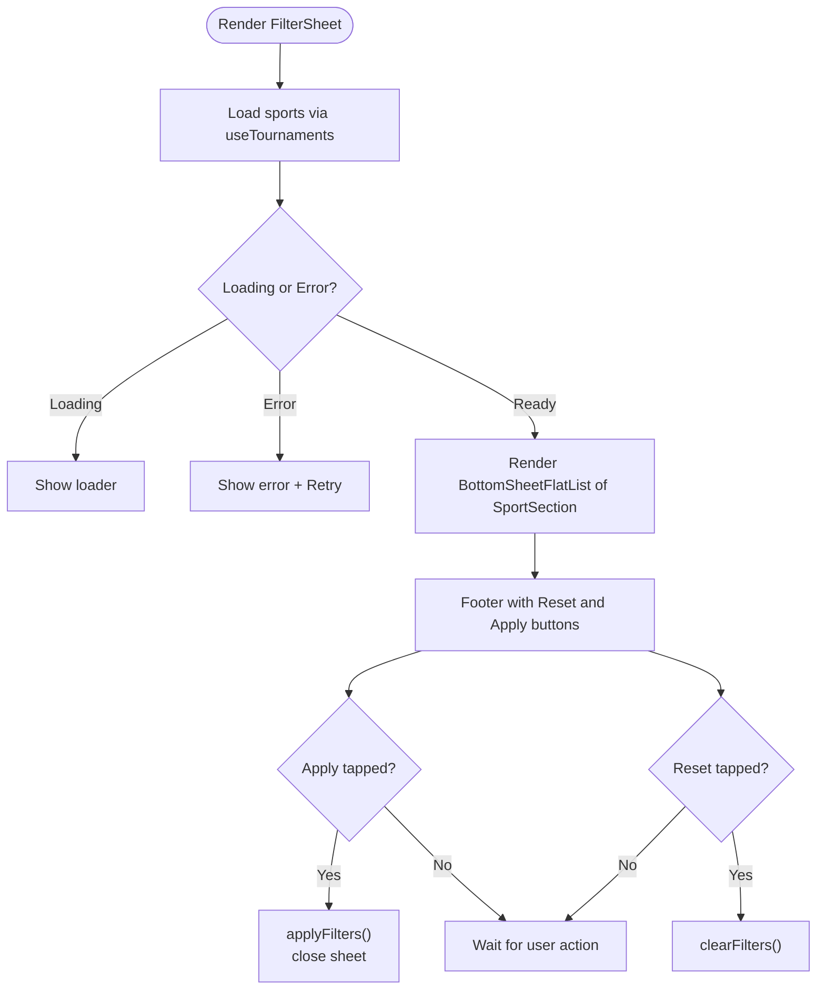
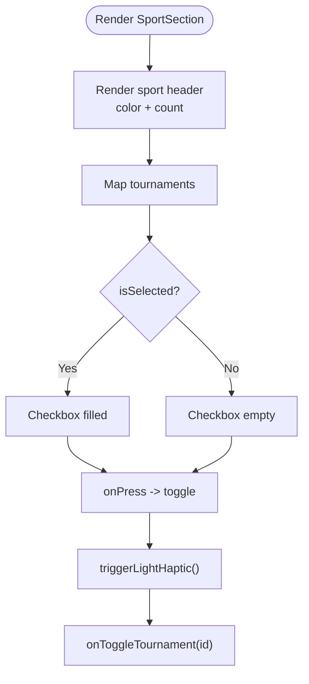
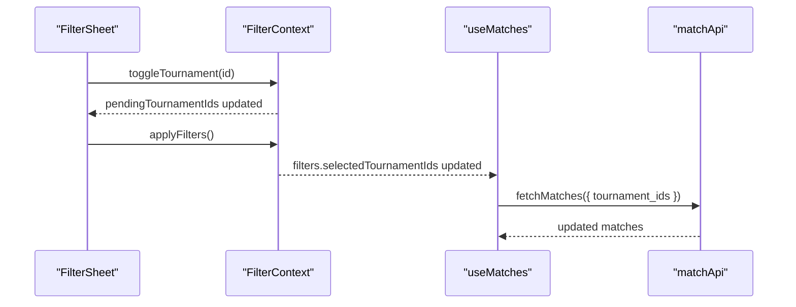
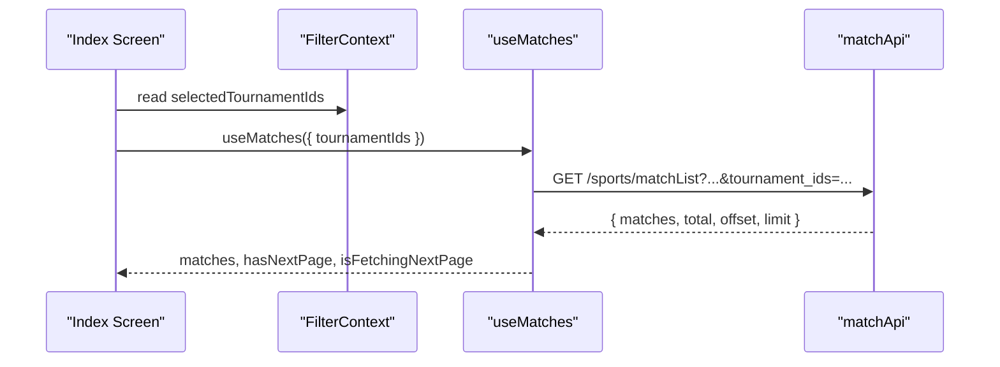
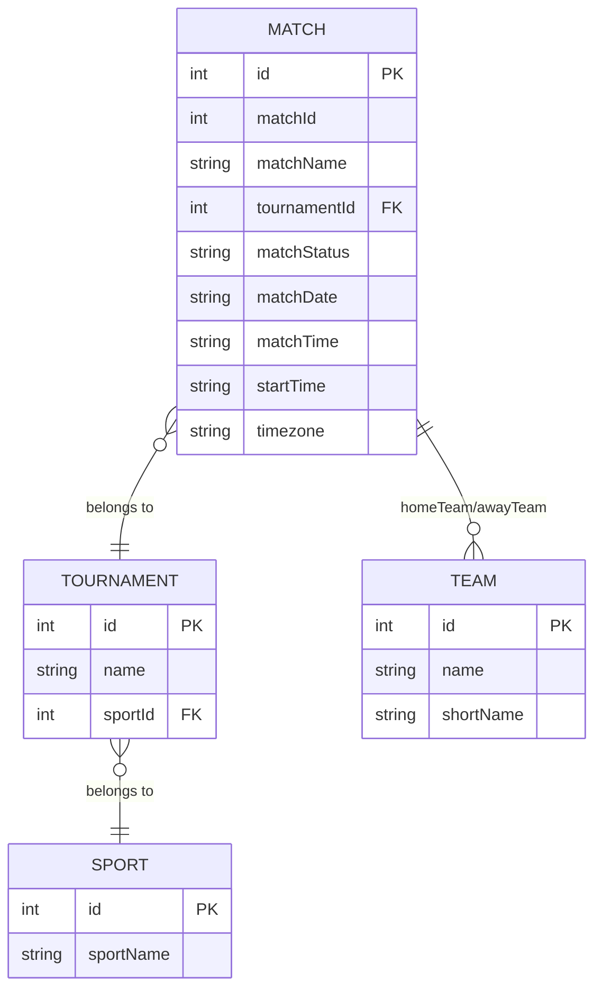
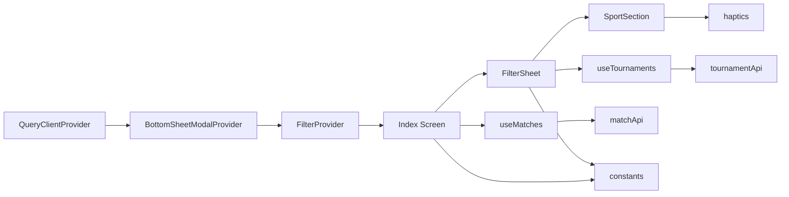

# Filtering System

<cite>
**Referenced Files in This Document**
- [FilterContext.tsx](file://app/context/FilterContext.tsx)
- [FilterSheet.tsx](file://app/components/filter/FilterSheet.tsx)
- [SportSection.tsx](file://app/components/filter/SportSection.tsx)
- [_layout.tsx](file://app/_layout.tsx)
- [index.tsx](file://app/index.tsx)
- [useTournaments.ts](file://app/hooks/useTournaments.ts)
- [useMatches.ts](file://app/hooks/useMatches.ts)
- [tournamentApi.ts](file://app/services/tournamentApi.ts)
- [matchApi.ts](file://app/services/matchApi.ts)
- [tournament.ts](file://app/types/tournament.ts)
- [match.ts](file://app/types/match.ts)
- [constants.ts](file://app/utils/constants.ts)
- [haptics.ts](file://app/utils/haptics.ts)
</cite>

## Table of Contents
1. [Introduction](#introduction)
2. [Project Structure](#project-structure)
3. [Core Components](#core-components)
4. [Architecture Overview](#architecture-overview)
5. [Detailed Component Analysis](#detailed-component-analysis)
6. [Dependency Analysis](#dependency-analysis)
7. [Performance Considerations](#performance-considerations)
8. [Troubleshooting Guide](#troubleshooting-guide)
9. [Conclusion](#conclusion)

## Introduction
This document explains the tournament filtering system with multi-select capabilities. It covers the FilterContext provider for state management and context propagation, the FilterSheet bottom sheet modal behavior and gestures, the SportSection component for organizing tournaments by sport categories and managing multi-select interactions, and the integration with match data fetching. It also addresses user experience considerations such as filter persistence across sessions, clear filters functionality, and responsive design for different screen sizes.

## Project Structure
The filtering system spans context providers, UI components, hooks, and services:
- Provider and context: FilterContext manages filter state and exposes actions.
- UI components: FilterSheet renders the bottom sheet; SportSection renders sport groups and tournament items.
- Hooks: useTournaments loads sports and tournaments; useMatches loads matches filtered by selected tournament IDs.
- Services: tournamentApi and matchApi fetch data from the backend.
- Types: define data structures for tournaments and matches.
- Utilities: constants and haptics enhance UX.

**Diagram sources**
- [FilterContext.tsx](file://app/context/FilterContext.tsx#L20-L63)
- [_layout.tsx](file://app/_layout.tsx#L19-L34)
- [index.tsx](file://app/index.tsx#L11-L107)
- [FilterSheet.tsx](file://app/components/filter/FilterSheet.tsx#L16-L125)
- [SportSection.tsx](file://app/components/filter/SportSection.tsx#L15-L77)
- [useTournaments.ts](file://app/hooks/useTournaments.ts#L11-L44)
- [useMatches.ts](file://app/hooks/useMatches.ts#L13-L55)
- [tournamentApi.ts](file://app/services/tournamentApi.ts#L4-L34)
- [matchApi.ts](file://app/services/matchApi.ts#L4-L35)
- [constants.ts](file://app/utils/constants.ts#L1-L38)
- [haptics.ts](file://app/utils/haptics.ts#L3-L9)

**Section sources**
- [_layout.tsx](file://app/_layout.tsx#L1-L35)
- [index.tsx](file://app/index.tsx#L1-L108)

## Core Components
- FilterContext: Provides filter state, pending selection buffer, and actions to toggle, select, clear, and apply filters. Exposes isFilterActive and selectedTournamentIds for UI feedback.
- FilterSheet: Bottom sheet container that loads sports and tournaments, displays multi-select controls, and handles apply/reset actions.
- SportSection: Renders a sport group with a list of tournaments and manages individual toggles with haptic feedback.
- useTournaments: Loads sports and tournaments via tournamentApi with caching and pagination parameters.
- useMatches: Loads matches with infinite pagination and applies selected tournament IDs as a filter.
- tournamentApi/matchApi: Fetches data from backend endpoints and normalizes responses.

**Section sources**
- [FilterContext.tsx](file://app/context/FilterContext.tsx#L3-L71)
- [FilterSheet.tsx](file://app/components/filter/FilterSheet.tsx#L11-L125)
- [SportSection.tsx](file://app/components/filter/SportSection.tsx#L8-L77)
- [useTournaments.ts](file://app/hooks/useTournaments.ts#L11-L44)
- [useMatches.ts](file://app/hooks/useMatches.ts#L13-L55)
- [tournamentApi.ts](file://app/services/tournamentApi.ts#L4-L34)
- [matchApi.ts](file://app/services/matchApi.ts#L4-L35)

## Architecture Overview
The filtering system follows a unidirectional data flow:
- FilterContext maintains two buffers: filters (committed) and pendingTournamentIds (draft).
- FilterSheet reads sports and tournaments via useTournaments and updates pendingTournamentIds through SportSection selections.
- Applying filters commits pendingTournamentIds to filters, which drives useMatches to re-fetch filtered match data.
- Clearing filters resets both buffers and removes active filters from useMatches.

**Diagram sources**
- [index.tsx](file://app/index.tsx#L11-L107)
- [FilterSheet.tsx](file://app/components/filter/FilterSheet.tsx#L16-L125)
- [SportSection.tsx](file://app/components/filter/SportSection.tsx#L15-L77)
- [FilterContext.tsx](file://app/context/FilterContext.tsx#L20-L63)
- [useTournaments.ts](file://app/hooks/useTournaments.ts#L11-L44)
- [tournamentApi.ts](file://app/services/tournamentApi.ts#L4-L34)
- [useMatches.ts](file://app/hooks/useMatches.ts#L13-L55)
- [matchApi.ts](file://app/services/matchApi.ts#L4-L35)

## Detailed Component Analysis

### FilterContext Provider
- Responsibilities:
  - Manages committed filters and a pending selection buffer.
  - Exposes actions: toggleTournament, selectTournaments, clearFilters, applyFilters.
  - Computes isFilterActive based on committed filters.
- State model:
  - filters: selectedTournamentIds (committed).
  - pendingTournamentIds: draft selection buffer.
- Behavior:
  - toggleTournament flips the presence of an ID in the pending buffer.
  - selectTournaments replaces the pending buffer.
  - clearFilters clears both buffers.
  - applyFilters commits pendingTournamentIds to filters.
- Propagation:
  - Wrapped by FilterProvider at the root layout to make useFilter available anywhere in the tree.

**Diagram sources**
- [FilterContext.tsx](file://app/context/FilterContext.tsx#L3-L16)
- [FilterContext.tsx](file://app/context/FilterContext.tsx#L20-L63)

**Section sources**
- [FilterContext.tsx](file://app/context/FilterContext.tsx#L3-L71)
- [_layout.tsx](file://app/_layout.tsx#L19-L34)

### FilterSheet Component
- Responsibilities:
  - Renders the bottom sheet UI with header, content area, and footer.
  - Loads sports and tournaments using useTournaments.
  - Displays loading/error states and retry behavior.
  - Provides Apply and Reset actions bound to FilterContext.
  - Renders SportSection entries for each sport.
- Bottom sheet configuration:
  - Snap points define intermediate and expanded positions.
  - Pan-down-to-close is enabled.
  - Background and handle styles are customized.
- Interaction:
  - Apply commits pending selections and closes the sheet.
  - Reset clears pending and committed selections.
  - Individual tournament toggles update pending selections.

**Diagram sources**
- [FilterSheet.tsx](file://app/components/filter/FilterSheet.tsx#L16-L125)
- [useTournaments.ts](file://app/hooks/useTournaments.ts#L11-L44)
- [FilterContext.tsx](file://app/context/FilterContext.tsx#L36-L43)

**Section sources**
- [FilterSheet.tsx](file://app/components/filter/FilterSheet.tsx#L11-L125)
- [constants.ts](file://app/utils/constants.ts#L6-L21)

### SportSection Component
- Responsibilities:
  - Renders a sport header with color indicator and tournament count.
  - Renders a list of tournaments with multi-select checkboxes.
  - Applies haptic feedback on selection.
- Selection behavior:
  - Uses selectedIds (pendingTournamentIds) to determine checked state.
  - Calls onToggleTournament to update the pending buffer.
- Visual design:
  - Uses sport-specific colors from constants.
  - Responsive typography and active states for interactions.

**Diagram sources**
- [SportSection.tsx](file://app/components/filter/SportSection.tsx#L15-L77)
- [haptics.ts](file://app/utils/haptics.ts#L3-L9)
- [constants.ts](file://app/utils/constants.ts#L23-L29)

**Section sources**
- [SportSection.tsx](file://app/components/filter/SportSection.tsx#L8-L77)
- [constants.ts](file://app/utils/constants.ts#L23-L29)
- [haptics.ts](file://app/utils/haptics.ts#L3-L9)

### Filter State Synchronization and Apply/Cancel
- Pending vs committed:
  - pendingTournamentIds reflects current user selections in the sheet.
  - filters.selectedTournamentIds reflects the last applied filter set.
- Apply:
  - applyFilters copies pendingTournamentIds into filters.
  - useMatches picks up the change in queryKey and refetches data.
- Cancel/Reset:
  - clearFilters resets both buffers without changing committed filters until apply is called.
- Active filter indicator:
  - isFilterActive and selectedTournamentIds drive the header badge and button styling.

**Diagram sources**
- [FilterSheet.tsx](file://app/components/filter/FilterSheet.tsx#L28-L31)
- [FilterContext.tsx](file://app/context/FilterContext.tsx#L41-L43)
- [useMatches.ts](file://app/hooks/useMatches.ts#L21-L33)
- [matchApi.ts](file://app/services/matchApi.ts#L14-L17)

**Section sources**
- [FilterContext.tsx](file://app/context/FilterContext.tsx#L36-L43)
- [FilterSheet.tsx](file://app/components/filter/FilterSheet.tsx#L28-L35)
- [index.tsx](file://app/index.tsx#L11-L43)

### Integration with Match Data Fetching
- useMatches builds queryKey with timezone, status, and tournamentIds.
- When tournamentIds is present, it is serialized as a comma-separated string and sent as tournament_ids.
- Infinite pagination is supported with getNextPageParam and initialPageParam.
- The Index screen passes selectedTournamentIds from FilterContext to useMatches.

**Diagram sources**
- [index.tsx](file://app/index.tsx#L13-L25)
- [useMatches.ts](file://app/hooks/useMatches.ts#L13-L55)
- [matchApi.ts](file://app/services/matchApi.ts#L4-L35)

**Section sources**
- [index.tsx](file://app/index.tsx#L13-L25)
- [useMatches.ts](file://app/hooks/useMatches.ts#L13-L55)
- [matchApi.ts](file://app/services/matchApi.ts#L4-L35)

### Data Models
- Tournament data:
  - SportWithTournaments includes id, sportName, and tournaments array.
  - TournamentItem includes id and name.
- Match data:
  - Match includes teams, tournament, status, and timing metadata.
  - MatchListParams supports timezone, status, todate, tournament_ids, limit, offset.
- Constants:
  - COLORS and SPORT_COLORS define theme and sport-specific colors.
  - SPORT_ICONS define icon identifiers per sport.

**Diagram sources**
- [tournament.ts](file://app/types/tournament.ts#L6-L10)
- [match.ts](file://app/types/match.ts#L9-L29)
- [constants.ts](file://app/utils/constants.ts#L23-L37)

**Section sources**
- [tournament.ts](file://app/types/tournament.ts#L1-L31)
- [match.ts](file://app/types/match.ts#L1-L46)
- [constants.ts](file://app/utils/constants.ts#L23-L37)

## Dependency Analysis
- Provider stack:
  - QueryClientProvider wraps the app to enable caching and retries for data fetching.
  - BottomSheetModalProvider enables bottom sheet modals.
  - FilterProvider supplies filter context to the entire component tree.
- Component dependencies:
  - FilterSheet depends on FilterContext, useTournaments, and SportSection.
  - SportSection depends on FilterContext and haptics.
  - Index screen depends on FilterContext and useMatches.
  - Hooks depend on services and types.
- External libraries:
  - @gorhom/bottom-sheet for modal behavior.
  - @tanstack/react-query for caching and pagination.

**Diagram sources**
- [_layout.tsx](file://app/_layout.tsx#L19-L34)
- [FilterContext.tsx](file://app/context/FilterContext.tsx#L20-L63)
- [index.tsx](file://app/index.tsx#L11-L107)
- [FilterSheet.tsx](file://app/components/filter/FilterSheet.tsx#L16-L125)
- [SportSection.tsx](file://app/components/filter/SportSection.tsx#L15-L77)
- [useTournaments.ts](file://app/hooks/useTournaments.ts#L11-L44)
- [useMatches.ts](file://app/hooks/useMatches.ts#L13-L55)
- [tournamentApi.ts](file://app/services/tournamentApi.ts#L4-L34)
- [matchApi.ts](file://app/services/matchApi.ts#L4-L35)
- [constants.ts](file://app/utils/constants.ts#L1-L38)
- [haptics.ts](file://app/utils/haptics.ts#L3-L9)

**Section sources**
- [_layout.tsx](file://app/_layout.tsx#L1-L35)
- [FilterContext.tsx](file://app/context/FilterContext.tsx#L20-L63)
- [FilterSheet.tsx](file://app/components/filter/FilterSheet.tsx#L16-L125)
- [SportSection.tsx](file://app/components/filter/SportSection.tsx#L15-L77)
- [useTournaments.ts](file://app/hooks/useTournaments.ts#L11-L44)
- [useMatches.ts](file://app/hooks/useMatches.ts#L13-L55)
- [tournamentApi.ts](file://app/services/tournamentApi.ts#L4-L34)
- [matchApi.ts](file://app/services/matchApi.ts#L4-L35)
- [constants.ts](file://app/utils/constants.ts#L1-L38)
- [haptics.ts](file://app/utils/haptics.ts#L3-L9)

## Performance Considerations
- Caching and staleTime:
  - useTournaments sets staleTime and gcTime to balance freshness and performance.
  - useMatches sets staleTime and gcTime for efficient pagination.
- Infinite pagination:
  - useMatches paginates with getNextPageParam and initialPageParam to avoid loading large datasets at once.
- Bottom sheet rendering:
  - BottomSheetFlatList optimizes list rendering inside the sheet.
- Haptics:
  - Triggered only on selection to minimize overhead while enhancing feedback.

[No sources needed since this section provides general guidance]

## Troubleshooting Guide
- Bottom sheet does not open:
  - Ensure BottomSheetModalProvider is present at the root and FilterProvider wraps the app.
- Filters not applying:
  - Verify applyFilters is called and selectedTournamentIds is passed to useMatches.
  - Confirm queryKey includes tournamentIds so react-query refetches automatically.
- No matches after filtering:
  - Check that tournament_ids parameter is correctly formatted as a comma-separated string.
  - Validate that the backend endpoint supports the parameter.
- Sports not loading:
  - Confirm network connectivity and that tournamentApi returns sports data.
  - Use the retry UI in FilterSheet to reload.
- Haptics not working:
  - Device may not support haptics; code gracefully falls back.

**Section sources**
- [_layout.tsx](file://app/_layout.tsx#L19-L34)
- [FilterSheet.tsx](file://app/components/filter/FilterSheet.tsx#L78-L91)
- [useMatches.ts](file://app/hooks/useMatches.ts#L21-L33)
- [matchApi.ts](file://app/services/matchApi.ts#L14-L17)
- [tournamentApi.ts](file://app/services/tournamentApi.ts#L4-L34)
- [haptics.ts](file://app/utils/haptics.ts#L3-L9)

## Conclusion
The filtering system leverages a robust provider pattern with a pending-selection buffer to deliver a smooth multi-select experience. FilterSheet and SportSection provide an intuitive interface for browsing and selecting tournaments, while useTournaments and useMatches integrate seamlessly with the backend to display filtered match lists. The architecture supports responsive design, gesture-driven interactions, and performance-conscious caching and pagination.