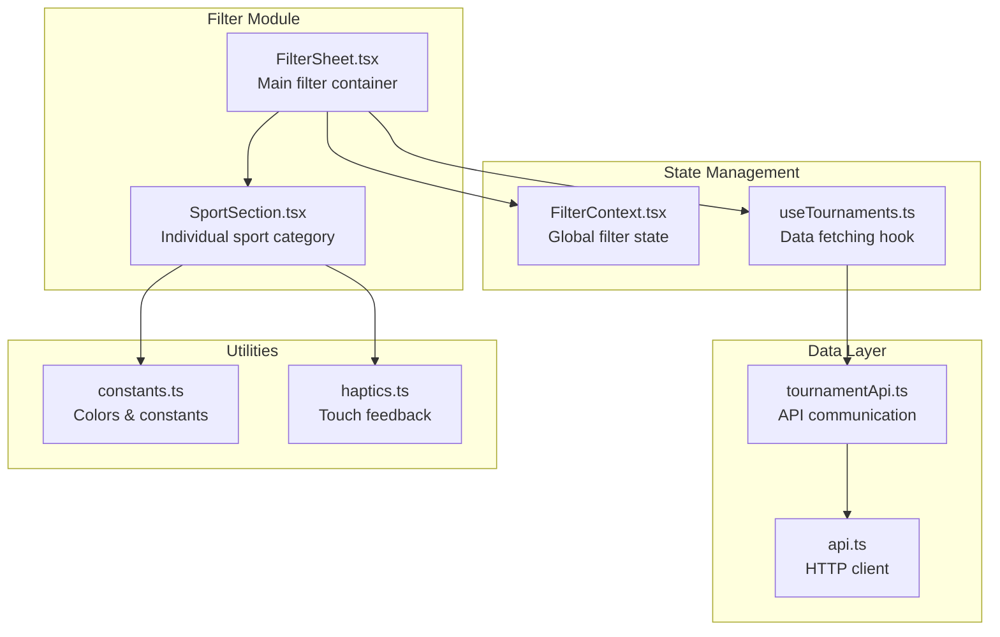
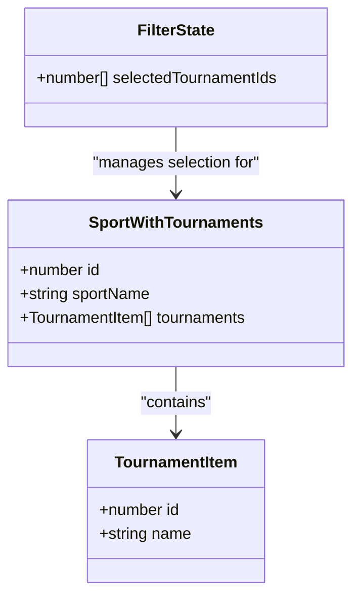
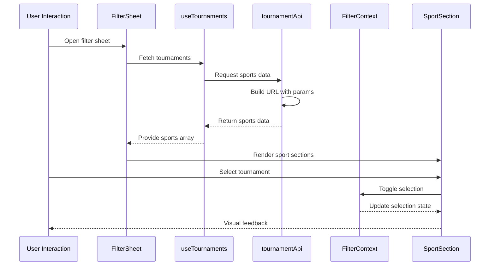
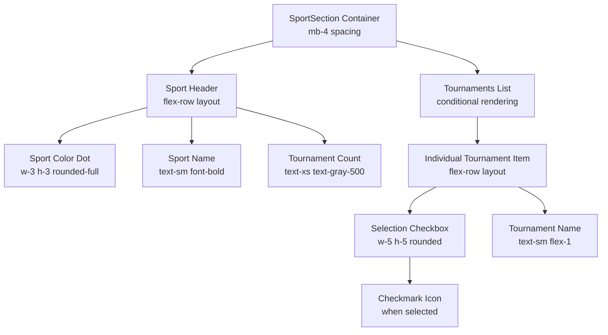
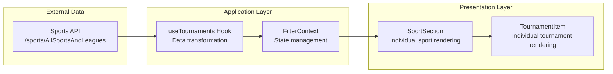
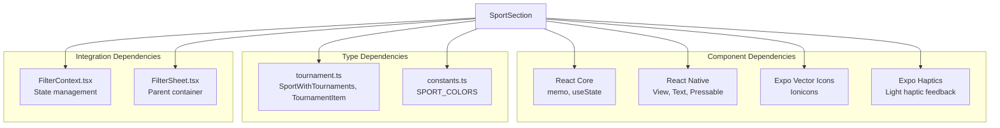

# Sport Section Component

<cite>
**Referenced Files in This Document**
- [SportSection.tsx](file://app/components/filter/SportSection.tsx)
- [FilterSheet.tsx](file://app/components/filter/FilterSheet.tsx)
- [FilterContext.tsx](file://app/context/FilterContext.tsx)
- [useTournaments.ts](file://app/hooks/useTournaments.ts)
- [tournamentApi.ts](file://app/services/tournamentApi.ts)
- [constants.ts](file://app/utils/constants.ts)
- [haptics.ts](file://app/utils/haptics.ts)
- [api.ts](file://app/services/api.ts)
</cite>

## Table of Contents
1. [Introduction](#introduction)
2. [Project Structure](#project-structure)
3. [Core Components](#core-components)
4. [Architecture Overview](#architecture-overview)
5. [Detailed Component Analysis](#detailed-component-analysis)
6. [Dependency Analysis](#dependency-analysis)
7. [Performance Considerations](#performance-considerations)
8. [Accessibility and UX Guidelines](#accessibility-and-ux-guidelines)
9. [Troubleshooting Guide](#troubleshooting-guide)
10. [Conclusion](#conclusion)

## Introduction

The SportSection component is a specialized UI component designed to organize and display tournaments grouped by sport categories in a mobile-first filtering interface. This component serves as a crucial building block for the tournament filtering system, providing users with an intuitive way to browse and select multiple tournaments across different sports.

The component implements a hierarchical visual structure that clearly separates sports by category while maintaining efficient interaction patterns for multi-selection scenarios. It integrates seamlessly with the broader filtering ecosystem through React Context patterns and follows modern React Native best practices for performance and accessibility.

## Project Structure

The SportSection component is part of a larger filtering system within the application's filter module. The component works in conjunction with several supporting files that handle data fetching, state management, and presentation logic.



**Diagram sources**
- [FilterSheet.tsx](file://app/components/filter/FilterSheet.tsx#L1-L128)
- [SportSection.tsx](file://app/components/filter/SportSection.tsx#L1-L82)
- [FilterContext.tsx](file://app/context/FilterContext.tsx#L1-L72)
- [useTournaments.ts](file://app/hooks/useTournaments.ts#L1-L45)
- [tournamentApi.ts](file://app/services/tournamentApi.ts#L1-L35)

**Section sources**
- [SportSection.tsx](file://app/components/filter/SportSection.tsx#L1-L82)
- [FilterSheet.tsx](file://app/components/filter/FilterSheet.tsx#L1-L128)

## Core Components

### SportSection Component Architecture

The SportSection component is a pure functional component that renders a single sport category with its associated tournaments. It implements several key design patterns:

- **Memoization**: Uses React.memo() to prevent unnecessary re-renders when props remain unchanged
- **Visual Hierarchy**: Implements a two-tier structure with sport headers and tournament lists
- **Interactive Elements**: Provides clear visual feedback for selection states
- **Responsive Design**: Adapts to different screen sizes and orientations

### Data Structure Requirements

The component expects a specific data structure for optimal operation:



**Diagram sources**
- [tournament.ts](file://app/types/tournament.ts#L6-L10)
- [tournament.ts](file://app/types/tournament.ts#L1-L4)

The data structure requirements include:
- **Sport identification**: Unique numeric ID for sport categorization
- **Sport metadata**: Human-readable sport name for display
- **Tournament collection**: Array of tournament objects with ID and name
- **Selection tracking**: Array of currently selected tournament IDs

**Section sources**
- [tournament.ts](file://app/types/tournament.ts#L1-L31)
- [SportSection.tsx](file://app/components/filter/SportSection.tsx#L8-L13)

## Architecture Overview

The SportSection component participates in a sophisticated filtering architecture that combines data fetching, state management, and presentation logic:



**Diagram sources**
- [FilterSheet.tsx](file://app/components/filter/FilterSheet.tsx#L16-L50)
- [useTournaments.ts](file://app/hooks/useTournaments.ts#L11-L28)
- [tournamentApi.ts](file://app/services/tournamentApi.ts#L4-L34)
- [FilterContext.tsx](file://app/context/FilterContext.tsx#L26-L43)

The architecture ensures:
- **Separation of concerns**: Data fetching, state management, and presentation are distinct
- **Performance optimization**: Memoization and selective re-rendering
- **State consistency**: Centralized state management prevents data inconsistencies
- **User experience**: Immediate visual feedback for all interactions

**Section sources**
- [FilterSheet.tsx](file://app/components/filter/FilterSheet.tsx#L1-L128)
- [FilterContext.tsx](file://app/context/FilterContext.tsx#L1-L72)

## Detailed Component Analysis

### SportSection Implementation Details

The SportSection component implements a sophisticated rendering system that balances visual appeal with functional efficiency:

#### Visual Hierarchy Structure

The component creates a clear visual hierarchy through its layered design:



**Diagram sources**
- [SportSection.tsx](file://app/components/filter/SportSection.tsx#L24-L76)

#### Multi-Select Interaction Pattern

The component implements an efficient multi-select pattern through its integration with the FilterContext:

```mermaid
stateDiagram-v2
[*] --> Unselected
Unselected --> Selected : "User taps checkbox"
Selected --> Unselected : "User taps checkbox"
note right of Selected : "Visual indicators : <br/>• Green border<br/>• Green background<br/>• White checkmark"
note right of Unselected : "Visual indicators : <br/>• Gray border<br/>• No background<br/>• No checkmark"
```

**Diagram sources**
- [SportSection.tsx](file://app/components/filter/SportSection.tsx#L42-L72)

#### Touch Target Sizing and Accessibility

The component adheres to accessibility guidelines through strategic sizing and positioning:

- **Checkbox size**: 20x20 pixels (minimum 44x44 pixels recommended)
- **Touch targets**: Individual tournament items serve as touch targets
- **Visual feedback**: Active state highlighting during press
- **Color contrast**: Sufficient contrast between selected/unselected states

**Section sources**
- [SportSection.tsx](file://app/components/filter/SportSection.tsx#L1-L82)

### Data Flow and State Management

The component participates in a well-defined data flow that ensures consistency and predictability:



**Diagram sources**
- [useTournaments.ts](file://app/hooks/useTournaments.ts#L30-L43)
- [FilterContext.tsx](file://app/context/FilterContext.tsx#L20-L62)

The data flow ensures:
- **Consistent state**: All selections are managed centrally
- **Real-time updates**: Changes propagate immediately to all components
- **Performance optimization**: Only affected components re-render
- **Error handling**: Graceful degradation when data is unavailable

**Section sources**
- [useTournaments.ts](file://app/hooks/useTournaments.ts#L1-L45)
- [FilterContext.tsx](file://app/context/FilterContext.tsx#L1-L72)

## Dependency Analysis

The SportSection component has a focused set of dependencies that support its specific functionality:



**Diagram sources**
- [SportSection.tsx](file://app/components/filter/SportSection.tsx#L1-L7)
- [tournament.ts](file://app/types/tournament.ts#L1-L10)
- [constants.ts](file://app/utils/constants.ts#L23-L29)

### Coupling and Cohesion Analysis

The component demonstrates strong internal cohesion around its core responsibility of rendering sport categories:

- **High cohesion**: All functionality related to sport section rendering is contained within the component
- **Low coupling**: Minimal external dependencies reduce maintenance overhead
- **Single responsibility**: Focuses exclusively on rendering and interaction within sport categories

**Section sources**
- [SportSection.tsx](file://app/components/filter/SportSection.tsx#L1-L82)

## Performance Considerations

### Rendering Optimization Strategies

The component implements several optimization techniques for handling large datasets efficiently:

#### Memoization Implementation

The component uses React.memo() to prevent unnecessary re-renders when props remain constant. This is particularly important given the potential for large tournament collections.

#### Conditional Rendering

The component implements conditional rendering for the tournament list, allowing users to expand/collapse sport categories to reduce DOM complexity.

#### Efficient Selection Checking

The component uses a simple array lookup (`selectedIds.includes()`) for determining selection state, which is efficient for typical tournament counts.

### Memory Management

The component follows React best practices for memory management:
- Proper cleanup of event handlers
- Efficient key assignment for list items
- Minimal state storage within the component

### Scalability Considerations

For very large datasets, consider these enhancements:
- Virtualized lists for infinite scrolling
- Pagination or lazy loading
- Debounced search functionality
- Optimized selection algorithms for large arrays

**Section sources**
- [SportSection.tsx](file://app/components/filter/SportSection.tsx#L15-L20)
- [FilterSheet.tsx](file://app/components/filter/FilterSheet.tsx#L93-L100)

## Accessibility and UX Guidelines

### Touch Target Accessibility

The component adheres to accessibility guidelines for touch interactions:

- **Minimum touch target size**: 44x44 pixels for optimal finger interaction
- **Proper spacing**: Adequate padding between interactive elements
- **Visual feedback**: Clear indication of pressed states
- **Focus management**: Proper keyboard navigation support

### Color and Contrast Standards

The component maintains accessibility through:
- **WCAG 2.1 AA compliance**: Sufficient color contrast ratios
- **Color-blind friendly**: Distinct visual indicators beyond color alone
- **Consistent patterns**: Standardized visual cues across the interface

### Responsive Design Adaptations

The component adapts to various screen sizes:
- **Flexible layouts**: Percentage-based widths for different screen densities
- **Scalable typography**: Relative font sizing for readability
- **Adaptive spacing**: Consistent margins and padding across devices

### Haptic Feedback Integration

The component provides tactile feedback for user interactions:
- **Light haptic**: Subtle confirmation for selections
- **Contextual feedback**: Different haptic patterns for different actions
- **Graceful degradation**: Works without haptic capabilities

**Section sources**
- [constants.ts](file://app/utils/constants.ts#L23-L29)
- [haptics.ts](file://app/utils/haptics.ts#L1-L34)

## Troubleshooting Guide

### Common Issues and Solutions

#### Selection State Not Updating

**Symptoms**: Tournaments appear unselected despite user interaction
**Causes**: 
- Incorrect prop passing from parent component
- State management conflicts in FilterContext
- Missing callback function implementation

**Solutions**:
- Verify `selectedIds` prop contains current selection state
- Check that `onToggleTournament` callback is properly bound
- Ensure FilterContext provider is correctly configured

#### Performance Issues with Large Datasets

**Symptoms**: Slow rendering or jank during interactions
**Causes**:
- Excessive re-renders due to prop changes
- Inefficient selection checking algorithms
- Memory leaks from event listeners

**Solutions**:
- Implement proper memoization patterns
- Consider virtualized lists for large collections
- Optimize selection state management

#### Visual Display Problems

**Symptoms**: Incorrect colors, missing icons, or layout issues
**Causes**:
- Missing sport color mapping
- Incorrect icon names or sizes
- CSS class conflicts

**Solutions**:
- Verify SPORT_COLORS mapping includes all supported sports
- Check icon availability in Ionicons library
- Review Tailwind CSS class combinations

### Debugging Strategies

#### State Inspection

Use React DevTools to inspect component props and state:
- Verify `selectedIds` array contents
- Check `expanded` prop state
- Monitor component re-render frequency

#### Network Troubleshooting

Monitor API requests and responses:
- Verify endpoint URL construction
- Check request parameters and headers
- Inspect response data structure

#### Performance Profiling

Profile component performance:
- Measure render times for different dataset sizes
- Identify bottlenecks in selection algorithms
- Monitor memory usage patterns

**Section sources**
- [FilterContext.tsx](file://app/context/FilterContext.tsx#L26-L43)
- [tournamentApi.ts](file://app/services/tournamentApi.ts#L4-L34)

## Conclusion

The SportSection component represents a well-architected solution for organizing and displaying tournament data within sport categories. Its implementation demonstrates several key strengths:

**Technical Excellence**:
- Clean separation of concerns with proper state management
- Efficient rendering patterns suitable for mobile environments
- Comprehensive accessibility and UX considerations
- Robust error handling and performance optimization

**Integration Strength**:
- Seamless integration with the broader filtering ecosystem
- Consistent data flow through React Context patterns
- Flexible architecture supporting future enhancements

**User Experience**:
- Intuitive multi-select interaction patterns
- Immediate visual feedback for all user actions
- Accessible design meeting modern standards
- Responsive adaptation to various device configurations

The component serves as a solid foundation for the tournament filtering system while maintaining flexibility for future enhancements and scalability improvements. Its modular design ensures maintainability and extensibility as the application evolves.