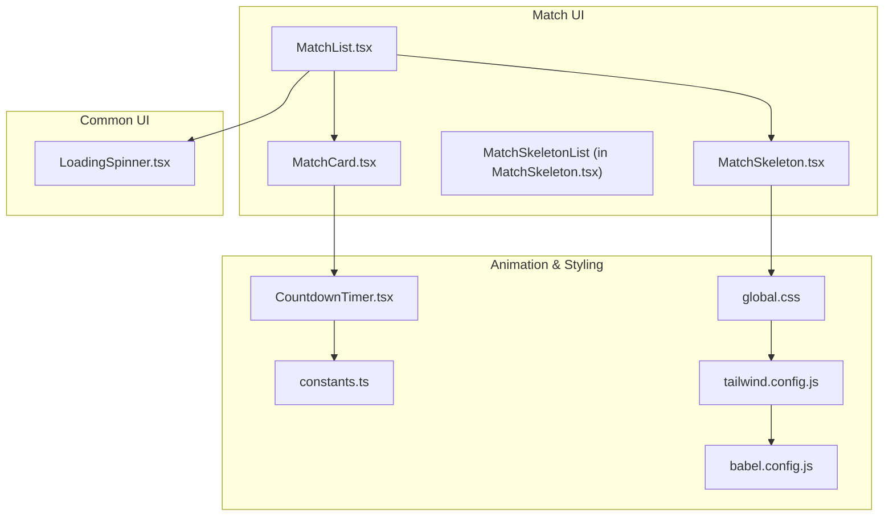
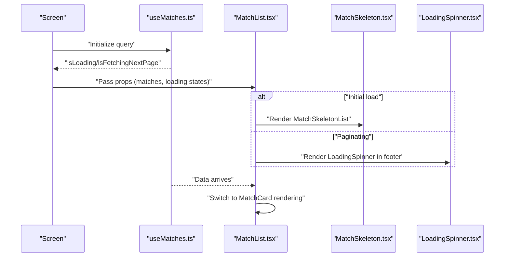
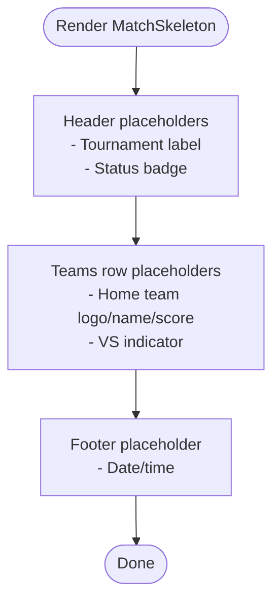
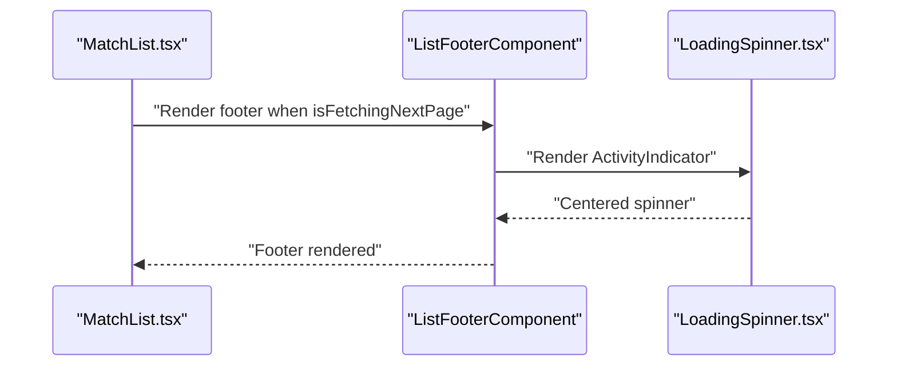
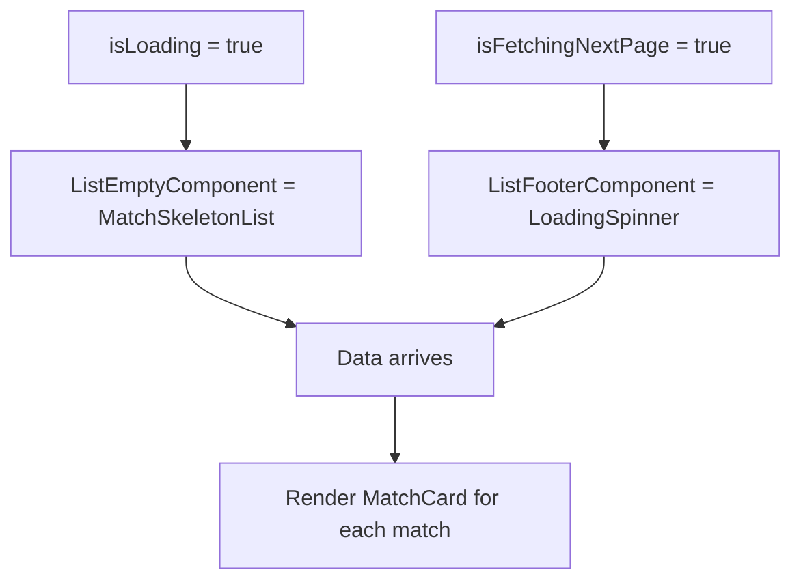
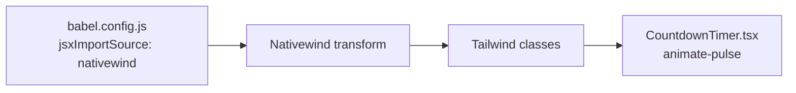
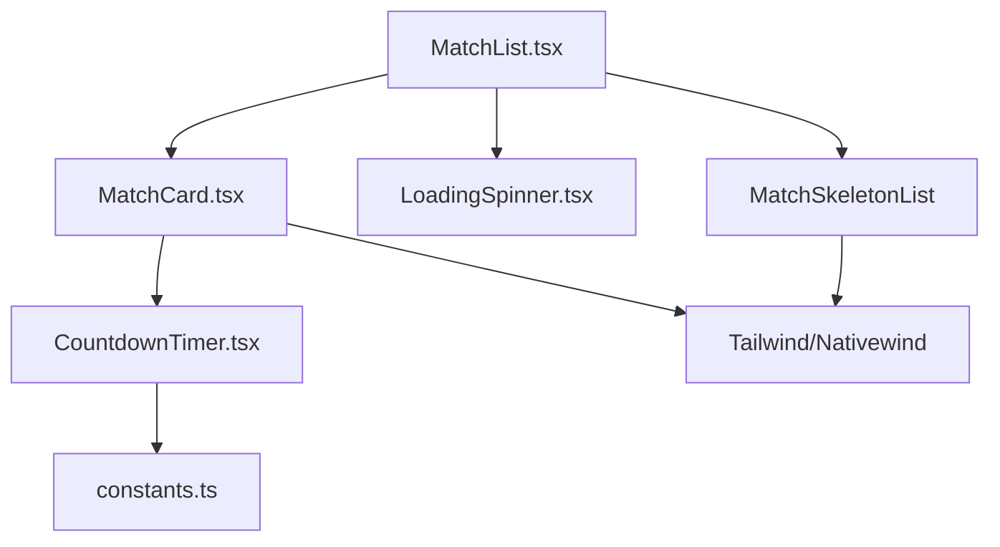

# Loading Skeleton System

<cite>
**Referenced Files in This Document**
- [MatchSkeleton.tsx](file://app/components/match/MatchSkeleton.tsx)
- [MatchList.tsx](file://app/components/match/MatchList.tsx)
- [MatchCard.tsx](file://app/components/match/MatchCard.tsx)
- [LoadingSpinner.tsx](file://app/components/common/LoadingSpinner.tsx)
- [CountdownTimer.tsx](file://app/components/match/CountdownTimer.tsx)
- [useMatches.ts](file://app/hooks/useMatches.ts)
- [constants.ts](file://app/utils/constants.ts)
- [global.css](file://global.css)
- [tailwind.config.js](file://tailwind.config.js)
- [babel.config.js](file://babel.config.js)
</cite>

## Table of Contents
1. [Introduction](#introduction)
2. [Project Structure](#project-structure)
3. [Core Components](#core-components)
4. [Architecture Overview](#architecture-overview)
5. [Detailed Component Analysis](#detailed-component-analysis)
6. [Dependency Analysis](#dependency-analysis)
7. [Performance Considerations](#performance-considerations)
8. [Troubleshooting Guide](#troubleshooting-guide)
9. [Conclusion](#conclusion)

## Introduction
This document explains the loading skeleton system used to provide realistic, animated placeholders while match data loads. It covers the MatchSkeleton component design, the LoadingSpinner integration, and how skeletons transition to real content. It also documents animation techniques via Tailwind classes, timing considerations for optimal user experience, layout examples across orientations and sizes, and performance implications with optimization strategies.

## Project Structure
The skeleton system spans three main areas:
- Skeleton placeholders: MatchSkeleton and MatchSkeletonList
- Content list: MatchList renders either skeletons, content, or empty/error states
- Supporting UI: LoadingSpinner for full-screen loading and CountdownTimer for live indicators

**Diagram sources**
- [MatchSkeleton.tsx](file://app/components/match/MatchSkeleton.tsx#L1-L56)
- [MatchList.tsx](file://app/components/match/MatchList.tsx#L1-L117)
- [MatchCard.tsx](file://app/components/match/MatchCard.tsx#L1-L142)
- [LoadingSpinner.tsx](file://app/components/common/LoadingSpinner.tsx#L1-L22)
- [CountdownTimer.tsx](file://app/components/match/CountdownTimer.tsx#L1-L43)
- [constants.ts](file://app/utils/constants.ts#L1-L38)
- [global.css](file://global.css#L1-L4)
- [tailwind.config.js](file://tailwind.config.js#L1-L21)
- [babel.config.js](file://babel.config.js#L1-L9)

**Section sources**
- [MatchSkeleton.tsx](file://app/components/match/MatchSkeleton.tsx#L1-L56)
- [MatchList.tsx](file://app/components/match/MatchList.tsx#L1-L117)
- [MatchCard.tsx](file://app/components/match/MatchCard.tsx#L1-L142)
- [LoadingSpinner.tsx](file://app/components/common/LoadingSpinner.tsx#L1-L22)
- [CountdownTimer.tsx](file://app/components/match/CountdownTimer.tsx#L1-L43)
- [constants.ts](file://app/utils/constants.ts#L1-L38)
- [global.css](file://global.css#L1-L4)
- [tailwind.config.js](file://tailwind.config.js#L1-L21)
- [babel.config.js](file://babel.config.js#L1-L9)

## Core Components
- MatchSkeleton: A lightweight, memoized skeleton card with header, teams row, and footer placeholders using gray backgrounds and rounded shapes.
- MatchSkeletonList: Renders multiple skeleton cards for initial load scenarios.
- MatchList: Orchestrates loading states, empty states, and pagination. It conditionally renders skeletons during initial load and a spinner during infinite scroll.
- LoadingSpinner: A centered activity indicator with configurable size and color, integrated into the list footer during pagination.
- CountdownTimer: Provides live indicators and animated pulse dots for live matches.

**Section sources**
- [MatchSkeleton.tsx](file://app/components/match/MatchSkeleton.tsx#L1-L56)
- [MatchList.tsx](file://app/components/match/MatchList.tsx#L1-L117)
- [LoadingSpinner.tsx](file://app/components/common/LoadingSpinner.tsx#L1-L22)
- [CountdownTimer.tsx](file://app/components/match/CountdownTimer.tsx#L1-L43)

## Architecture Overview
The skeleton system integrates with the data-fetching hook and the list renderer to provide seamless transitions from placeholders to content.

**Diagram sources**
- [useMatches.ts](file://app/hooks/useMatches.ts#L1-L56)
- [MatchList.tsx](file://app/components/match/MatchList.tsx#L1-L117)
- [MatchSkeleton.tsx](file://app/components/match/MatchSkeleton.tsx#L1-L56)
- [LoadingSpinner.tsx](file://app/components/common/LoadingSpinner.tsx#L1-L22)

## Detailed Component Analysis

### MatchSkeleton Component Design
- Purpose: Provide animated, realistic placeholders for match cards during loading.
- Structure:
  - Header: Tournament label and status badge placeholders.
  - Teams row: Circular placeholders for team logos and name/text placeholders.
  - VS placeholder: Center indicator.
  - Footer: Date/time placeholder.
- Animation technique: Uses Tailwind classes for styling and relies on the underlying animation framework configured via Babel/Nativewind. The skeleton itself does not define explicit animations; it leverages the broader animation pipeline established in the project.

**Diagram sources**
- [MatchSkeleton.tsx](file://app/components/match/MatchSkeleton.tsx#L1-L56)

**Section sources**
- [MatchSkeleton.tsx](file://app/components/match/MatchSkeleton.tsx#L1-L56)

### MatchSkeletonList Rendering Pattern
- Renders a fixed number of skeleton cards during initial load.
- Uses memoization to avoid unnecessary re-renders.
- Integrates cleanly with FlatList’s ListEmptyComponent.

**Section sources**
- [MatchSkeleton.tsx](file://app/components/match/MatchSkeleton.tsx#L45-L56)
- [MatchList.tsx](file://app/components/match/MatchList.tsx#L52-L54)

### LoadingSpinner Integration
- Positioned in the FlatList footer during pagination.
- Uses the primary color from constants for visual consistency.
- Provides clear feedback that more data is being fetched.

**Diagram sources**
- [MatchList.tsx](file://app/components/match/MatchList.tsx#L46-L49)
- [LoadingSpinner.tsx](file://app/components/common/LoadingSpinner.tsx#L1-L22)

**Section sources**
- [MatchList.tsx](file://app/components/match/MatchList.tsx#L46-L49)
- [LoadingSpinner.tsx](file://app/components/common/LoadingSpinner.tsx#L1-L22)

### Skeleton-to-Content Transition Patterns
- Initial load: MatchList renders skeletons via ListEmptyComponent while isLoading is true.
- Pagination: MatchList renders LoadingSpinner in ListFooterComponent while isFetchingNextPage is true.
- Completion: When data arrives, MatchList switches to rendering MatchCard for each match.

**Diagram sources**
- [MatchList.tsx](file://app/components/match/MatchList.tsx#L52-L81)
- [MatchList.tsx](file://app/components/match/MatchList.tsx#L46-L49)

**Section sources**
- [MatchList.tsx](file://app/components/match/MatchList.tsx#L52-L81)
- [MatchList.tsx](file://app/components/match/MatchList.tsx#L46-L49)

### Animation Techniques and Opacity Transitions
- Tailwind classes: The project uses Tailwind CSS with Nativewind for styling. Classes like animate-pulse are applied directly in components.
- Example: CountdownTimer applies animate-pulse to a small dot to indicate live status.
- Babel/Nativewind pipeline: Tailwind classes are processed via Babel and Nativewind, enabling responsive and animated styles on React Native components.

**Diagram sources**
- [babel.config.js](file://babel.config.js#L1-L9)
- [tailwind.config.js](file://tailwind.config.js#L1-L21)
- [CountdownTimer.tsx](file://app/components/match/CountdownTimer.tsx#L1-L43)

**Section sources**
- [CountdownTimer.tsx](file://app/components/match/CountdownTimer.tsx#L16-L22)
- [babel.config.js](file://babel.config.js#L4-L6)
- [tailwind.config.js](file://tailwind.config.js#L11-L11)

### Layout Examples Across Orientations and Sizes
- Portrait orientation: MatchSkeleton maintains consistent spacing and widths; the teams row adapts to narrower widths.
- Landscape orientation: The teams row distributes horizontally; skeleton widths remain proportional.
- Small devices: Skeleton heights and paddings keep content readable; long lists still benefit from skeleton placeholders.
- Large devices: More items can be rendered per batch; skeleton count can be increased for perceived performance.

[No sources needed since this section provides conceptual layout guidance]

### Timing Considerations for Optimal UX
- Initial skeleton duration: Keep skeleton rendering visible until data is reasonably close to arrival to avoid jarring transitions.
- Pagination spinner: Show spinner while isFetchingNextPage is true; avoid premature dismissal to prevent UI flicker.
- Refresh control: Tie refresh indicator to isLoading to reflect network activity accurately.

**Section sources**
- [MatchList.tsx](file://app/components/match/MatchList.tsx#L96-L103)
- [MatchList.tsx](file://app/components/match/MatchList.tsx#L83-L87)

## Dependency Analysis
- MatchList depends on:
  - MatchSkeletonList for initial load placeholders
  - LoadingSpinner for pagination
  - MatchCard for content rendering
- MatchSkeleton relies on Tailwind classes and Nativewind for styling.
- CountdownTimer contributes live-state animations used within MatchCard.

**Diagram sources**
- [MatchList.tsx](file://app/components/match/MatchList.tsx#L1-L117)
- [MatchSkeleton.tsx](file://app/components/match/MatchSkeleton.tsx#L1-L56)
- [LoadingSpinner.tsx](file://app/components/common/LoadingSpinner.tsx#L1-L22)
- [MatchCard.tsx](file://app/components/match/MatchCard.tsx#L1-L142)
- [CountdownTimer.tsx](file://app/components/match/CountdownTimer.tsx#L1-L43)
- [constants.ts](file://app/utils/constants.ts#L1-L38)

**Section sources**
- [MatchList.tsx](file://app/components/match/MatchList.tsx#L1-L117)
- [MatchSkeleton.tsx](file://app/components/match/MatchSkeleton.tsx#L1-L56)
- [LoadingSpinner.tsx](file://app/components/common/LoadingSpinner.tsx#L1-L22)
- [MatchCard.tsx](file://app/components/match/MatchCard.tsx#L1-L142)
- [CountdownTimer.tsx](file://app/components/match/CountdownTimer.tsx#L1-L43)
- [constants.ts](file://app/utils/constants.ts#L1-L38)

## Performance Considerations
- Skeleton rendering cost:
  - Lightweight views with minimal nesting reduce layout overhead.
  - Memoization prevents re-rendering of skeleton components.
- FlatList optimizations:
  - removeClippedSubviews improves offscreen performance.
  - maxToRenderPerBatch, windowSize, and initialNumToRender tune rendering cadence.
- Network and cache:
  - useMatches sets staleTime and garbage collection time to balance freshness and performance.
- Memory usage:
  - Skeletons are simple views; prefer fewer, larger batches during initial load.
  - Avoid excessive skeleton counts to prevent memory pressure on low-end devices.

**Section sources**
- [MatchSkeleton.tsx](file://app/components/match/MatchSkeleton.tsx#L1-L56)
- [MatchList.tsx](file://app/components/match/MatchList.tsx#L108-L112)
- [useMatches.ts](file://app/hooks/useMatches.ts#L39-L41)

## Troubleshooting Guide
- Skeletons not visible:
  - Verify isLoading is true during initial load and ListEmptyComponent is rendering MatchSkeletonList.
- Pagination spinner not showing:
  - Ensure isFetchingNextPage is true when loading more pages; confirm onEndReached logic.
- Live indicator animation not pulsing:
  - Confirm Tailwind classes and Nativewind are configured correctly in Babel and Tailwind config.
- Color inconsistencies:
  - Use the primary color from constants for spinners and live indicators.

**Section sources**
- [MatchList.tsx](file://app/components/match/MatchList.tsx#L52-L54)
- [MatchList.tsx](file://app/components/match/MatchList.tsx#L83-L87)
- [LoadingSpinner.tsx](file://app/components/common/LoadingSpinner.tsx#L10-L13)
- [CountdownTimer.tsx](file://app/components/match/CountdownTimer.tsx#L16-L22)
- [constants.ts](file://app/utils/constants.ts#L6-L21)

## Conclusion
The skeleton system delivers a smooth, predictable loading experience by combining lightweight placeholders with efficient list rendering and clear pagination feedback. With Tailwind and Nativewind, animations like animate-pulse enhance perceived responsiveness. Proper timing and FlatList tuning ensure optimal performance across devices and orientations.