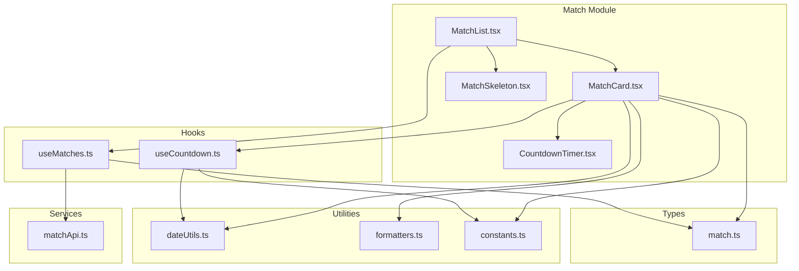
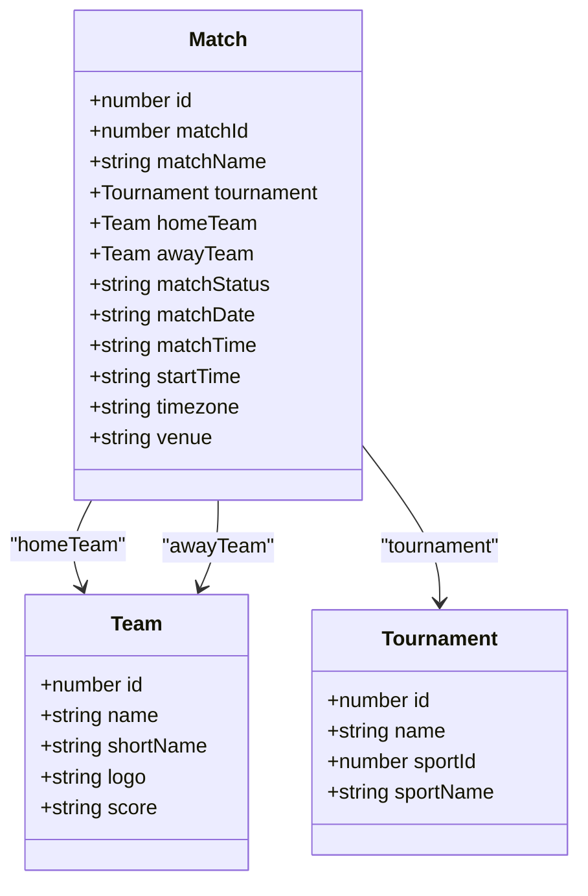
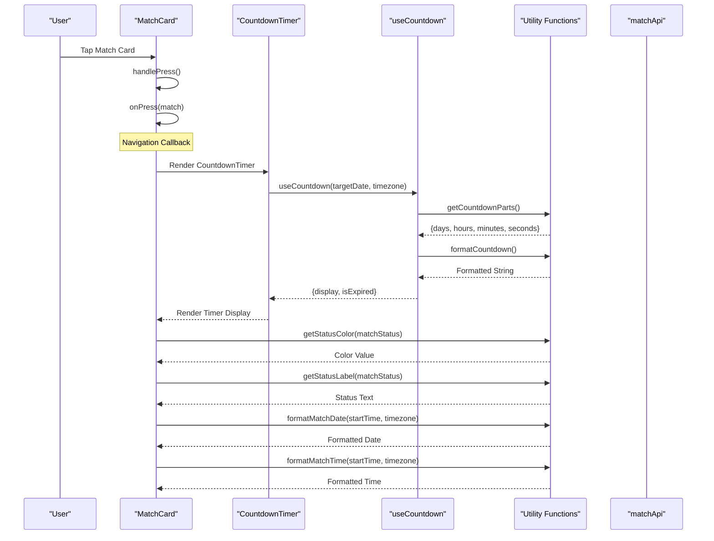
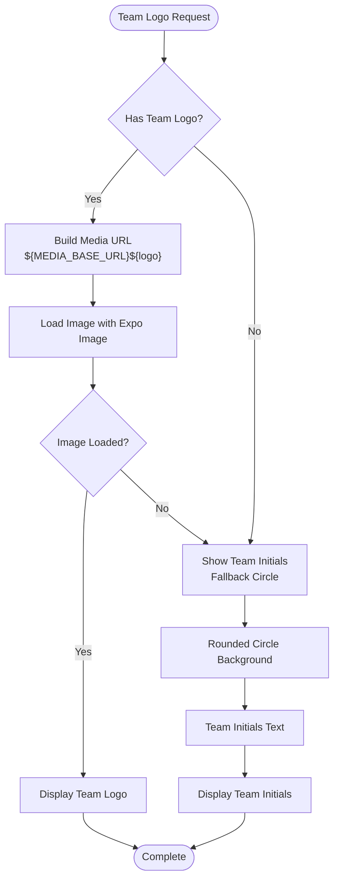
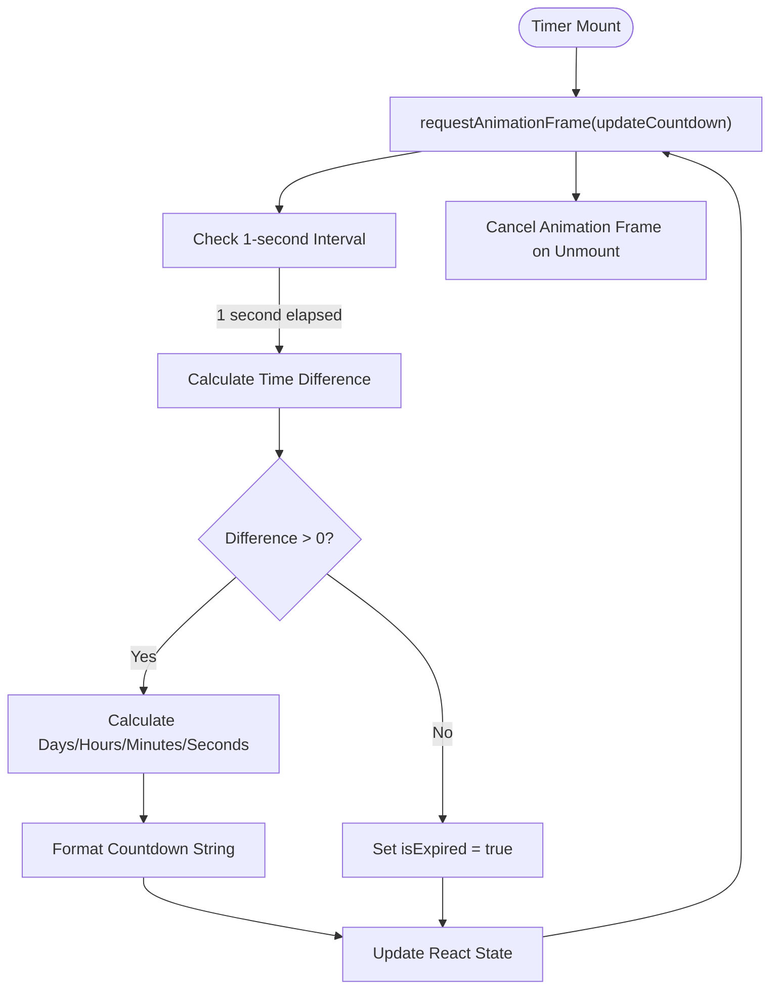
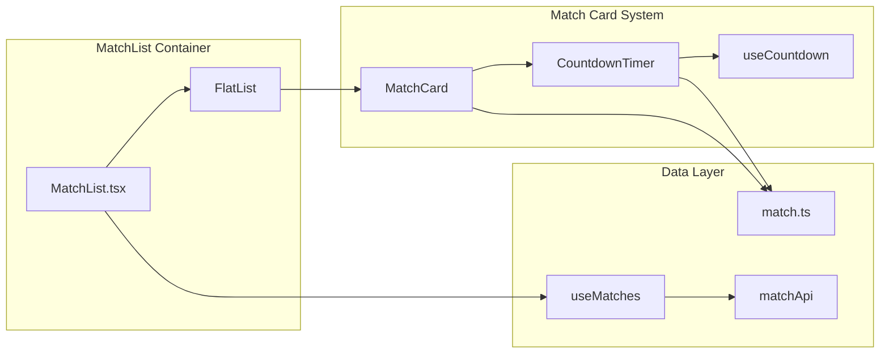
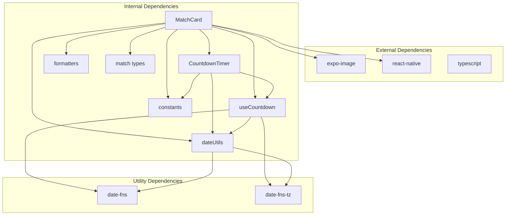

# Match Card Component

<cite>
**Referenced Files in This Document**
- [MatchCard.tsx](file://app/components/match/MatchCard.tsx)
- [CountdownTimer.tsx](file://app/components/match/CountdownTimer.tsx)
- [useCountdown.ts](file://app/hooks/useCountdown.ts)
- [match.ts](file://app/types/match.ts)
- [constants.ts](file://app/utils/constants.ts)
- [dateUtils.ts](file://app/utils/dateUtils.ts)
- [formatters.ts](file://app/utils/formatters.ts)
- [MatchList.tsx](file://app/components/match/MatchList.tsx)
- [MatchSkeleton.tsx](file://app/components/match/MatchSkeleton.tsx)
- [matchApi.ts](file://app/services/matchApi.ts)
- [useMatches.ts](file://app/hooks/useMatches.ts)
</cite>

## Table of Contents
1. [Introduction](#introduction)
2. [Project Structure](#project-structure)
3. [Core Components](#core-components)
4. [Architecture Overview](#architecture-overview)
5. [Detailed Component Analysis](#detailed-component-analysis)
6. [Dependency Analysis](#dependency-analysis)
7. [Performance Considerations](#performance-considerations)
8. [Troubleshooting Guide](#troubleshooting-guide)
9. [Conclusion](#conclusion)

## Introduction

The Match Card component is a core UI element designed to display individual match information in a visually appealing and responsive layout. It presents team information with logos, match status indicators, and integrates a live countdown timer for upcoming matches. The component follows modern React Native patterns with memoization for performance optimization and comprehensive TypeScript typing for type safety.

## Project Structure

The Match Card component is part of a larger sports match tracking application with the following key architectural patterns:

**Diagram sources**
- [MatchCard.tsx](file://app/components/match/MatchCard.tsx#L1-L142)
- [CountdownTimer.tsx](file://app/components/match/CountdownTimer.tsx#L1-L43)
- [useCountdown.ts](file://app/hooks/useCountdown.ts#L1-L54)
- [match.ts](file://app/types/match.ts#L1-L46)

**Section sources**
- [MatchCard.tsx](file://app/components/match/MatchCard.tsx#L1-L142)
- [MatchList.tsx](file://app/components/match/MatchList.tsx#L1-L117)

## Core Components

### MatchCard Component Structure

The MatchCard component is implemented as a memoized functional component that renders a complete match display interface. It utilizes Tailwind CSS classes for styling and React Native's built-in components for layout and interaction.

#### Component Props Interface

The component accepts a strongly-typed interface with the following properties:

| Property | Type | Required | Description |
|----------|------|----------|-------------|
| `match` | `Match` | Yes | Complete match data object containing teams, status, and timing information |
| `onPress` | `(match: Match) => void` | No | Optional callback function for handling card press events |

#### Match Data Structure

The `Match` interface defines the complete match information structure:

**Diagram sources**
- [match.ts](file://app/types/match.ts#L16-L29)

**Section sources**
- [MatchCard.tsx](file://app/components/match/MatchCard.tsx#L10-L13)
- [match.ts](file://app/types/match.ts#L1-L46)

## Architecture Overview

The Match Card component integrates with several supporting systems to provide a complete match viewing experience:

**Diagram sources**
- [MatchCard.tsx](file://app/components/match/MatchCard.tsx#L15-L137)
- [CountdownTimer.tsx](file://app/components/match/CountdownTimer.tsx#L13-L38)
- [useCountdown.ts](file://app/hooks/useCountdown.ts#L10-L53)
- [dateUtils.ts](file://app/utils/dateUtils.ts#L22-L51)

## Detailed Component Analysis

### Card Layout Design

The Match Card implements a responsive three-section layout designed for optimal mobile viewing:

#### Header Section
- **Tournament Information**: Displays tournament name with truncation support for long names
- **Status Indicator**: Dynamic badge showing match status with color-coded background and text
- **Responsive Typography**: Uses `text-xs` for compact display on small screens

#### Main Content Area
- **Team Layout**: Two-column design with centered team information
- **Team Display**: Each team shows logo or initials with score display when available
- **Versus/Countdown**: Dynamic content switching between "VS" during live matches and countdown timer otherwise

#### Footer Section
- **Date and Time**: Shows formatted date and time with timezone consideration
- **Separator Dot**: Visual divider between date and time components

### Team Logo Loading and Fallback Mechanisms

The component implements robust fallback mechanisms for team logos:

**Diagram sources**
- [MatchCard.tsx](file://app/components/match/MatchCard.tsx#L20-L79)
- [constants.ts](file://app/utils/constants.ts#L2-L2)

#### Logo Loading Features
- **Base URL Integration**: Uses `MEDIA_BASE_URL` constant for consistent media loading
- **Expo Image Optimization**: Implements smooth transitions and placeholder support
- **Fallback Strategy**: Automatic initials display when images fail to load
- **Performance Optimization**: Memoization prevents unnecessary re-renders

### Countdown Timer Integration

The CountdownTimer component provides real-time match scheduling information:

#### Timer States and Behavior

| State | Condition | Display |
|-------|-----------|---------|
| Live | `isMatchLive(matchStatus)` | Red pulsing dot + "LIVE" text |
| Expired | `isExpired` | "Started" text |
| Active | Countdown > 0 | Formatted countdown display |

#### Timer Update Mechanism

**Diagram sources**
- [useCountdown.ts](file://app/hooks/useCountdown.ts#L17-L40)
- [CountdownTimer.tsx](file://app/components/match/CountdownTimer.tsx#L13-L38)

**Section sources**
- [MatchCard.tsx](file://app/components/match/MatchCard.tsx#L83-L92)
- [CountdownTimer.tsx](file://app/components/match/CountdownTimer.tsx#L13-L38)
- [useCountdown.ts](file://app/hooks/useCountdown.ts#L1-L54)

### Responsive Design Patterns

The component implements comprehensive responsive design for various screen sizes and orientations:

#### Screen Size Adaptations
- **Mobile First**: Base styles optimized for small screens
- **Flexible Layout**: Uses flexbox for adaptive team positioning
- **Typography Scaling**: Responsive text sizing with `text-sm` and `text-xs`
- **Padding Adjustments**: Consistent spacing with `mx-4 my-2` margins

#### Orientation Considerations
- **Portrait Mode**: Optimized for vertical scrolling
- **Landscape Mode**: Maintains readable text sizes and logo proportions
- **Safe Area Support**: Automatic margin adjustments for device notches

### Accessibility Implementation

The component incorporates several accessibility features:

#### Touch Target Sizing
- **Minimum 44px**: Pressable area ensures adequate touch targets
- **Visual Feedback**: Shadow and elevation provide tactile indication
- **Focus Management**: Proper component hierarchy for screen readers

#### Visual Accessibility
- **Color Contrast**: Sufficient contrast ratios for text and backgrounds
- **Text Truncation**: Prevents overflow with ellipsis for long team names
- **Alternative Text**: Team initials serve as accessible fallback

### Integration with MatchList Component

The Match Card works seamlessly within the broader match listing system:

**Diagram sources**
- [MatchList.tsx](file://app/components/match/MatchList.tsx#L27-L40)
- [MatchCard.tsx](file://app/components/match/MatchCard.tsx#L15-L18)
- [useMatches.ts](file://app/hooks/useMatches.ts#L13-L55)

**Section sources**
- [MatchList.tsx](file://app/components/match/MatchList.tsx#L27-L40)
- [MatchSkeleton.tsx](file://app/components/match/MatchSkeleton.tsx#L4-L56)

## Dependency Analysis

The Match Card component has well-defined dependencies that promote maintainability and testability:

**Diagram sources**
- [MatchCard.tsx](file://app/components/match/MatchCard.tsx#L1-L8)
- [CountdownTimer.tsx](file://app/components/match/CountdownTimer.tsx#L1-L5)
- [useCountdown.ts](file://app/hooks/useCountdown.ts#L1-L2)

### Component Coupling Analysis

The component maintains low coupling through:
- **Interface-based Prop Passing**: Strongly typed props minimize direct implementation dependencies
- **Utility Function Separation**: Business logic isolated in dedicated utility modules
- **Hook Abstraction**: Complex state management encapsulated in reusable hooks
- **Constant Centralization**: Configuration values managed in single constants file

**Section sources**
- [MatchCard.tsx](file://app/components/match/MatchCard.tsx#L1-L8)
- [CountdownTimer.tsx](file://app/components/match/CountdownTimer.tsx#L1-L5)
- [useCountdown.ts](file://app/hooks/useCountdown.ts#L1-L2)

## Performance Considerations

### Optimization Strategies

The component implements several performance optimization techniques:

#### Memoization
- **Component Level**: `React.memo()` prevents unnecessary re-renders
- **Callback Optimization**: `useCallback` in parent components reduces prop changes
- **Stable References**: Consistent key extraction prevents list item remounting

#### Rendering Efficiency
- **FlatList Integration**: Efficient virtualized rendering for large match lists
- **Skeleton Loading**: Placeholder components improve perceived performance
- **Conditional Rendering**: Dynamic content switching based on match status

#### Memory Management
- **Animation Cleanup**: Proper cancellation of animation frames on unmount
- **Query Caching**: React Query manages data caching and garbage collection
- **Image Optimization**: Expo Image handles efficient image loading and caching

### Best Practices for Implementation

1. **Prop Stability**: Ensure match objects maintain stable references when possible
2. **Key Extraction**: Use unique combination keys for match list items
3. **State Management**: Leverage React Query for efficient data fetching
4. **Error Boundaries**: Implement proper error handling for network failures

## Troubleshooting Guide

### Common Issues and Solutions

#### Team Logo Loading Failures
**Problem**: Team logos not displaying despite valid URLs
**Solution**: Verify `MEDIA_BASE_URL` configuration and network connectivity
**Prevention**: Implement proper error boundaries and fallback mechanisms

#### Countdown Timer Synchronization
**Problem**: Timer displays incorrect time or stops updating
**Solution**: Check timezone configuration and ensure proper date parsing
**Prevention**: Validate target dates and implement proper cleanup in hooks

#### Performance Degradation
**Problem**: Slow rendering in large match lists
**Solution**: Optimize FlatList configuration and implement proper pagination
**Prevention**: Use memoization and avoid unnecessary prop drilling

#### Accessibility Issues
**Problem**: Poor touch target sizing or insufficient color contrast
**Solution**: Review component dimensions and color contrast ratios
**Prevention**: Test with accessibility tools and screen readers

**Section sources**
- [MatchCard.tsx](file://app/components/match/MatchCard.tsx#L54-L60)
- [useCountdown.ts](file://app/hooks/useCountdown.ts#L42-L50)
- [MatchList.tsx](file://app/components/match/MatchList.tsx#L89-L113)

## Conclusion

The Match Card component represents a well-architected solution for displaying match information in a mobile-first environment. Its implementation demonstrates excellent separation of concerns through utility functions, hooks, and TypeScript interfaces. The component successfully balances visual appeal with performance optimization while maintaining accessibility standards.

Key strengths include:
- **Type Safety**: Comprehensive TypeScript implementation prevents runtime errors
- **Performance**: Strategic memoization and efficient rendering patterns
- **Accessibility**: Thoughtful design considerations for diverse user needs
- **Maintainability**: Clear separation of concerns and modular architecture

The component serves as an excellent foundation for sports applications requiring dynamic match display with real-time updates and responsive design capabilities.