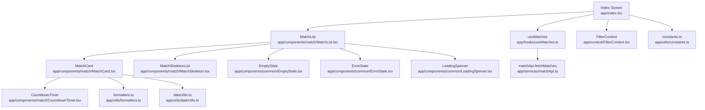
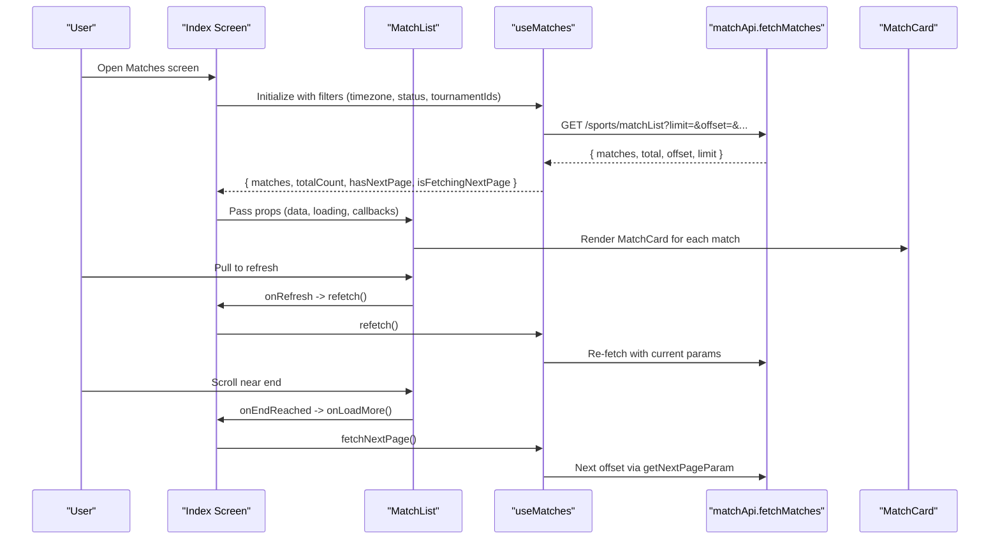
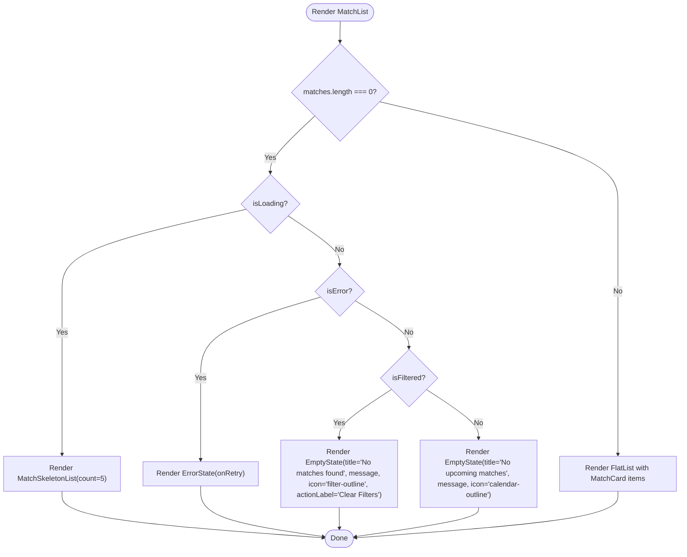
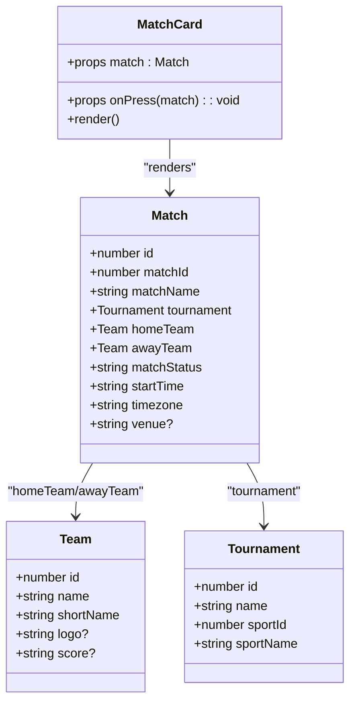
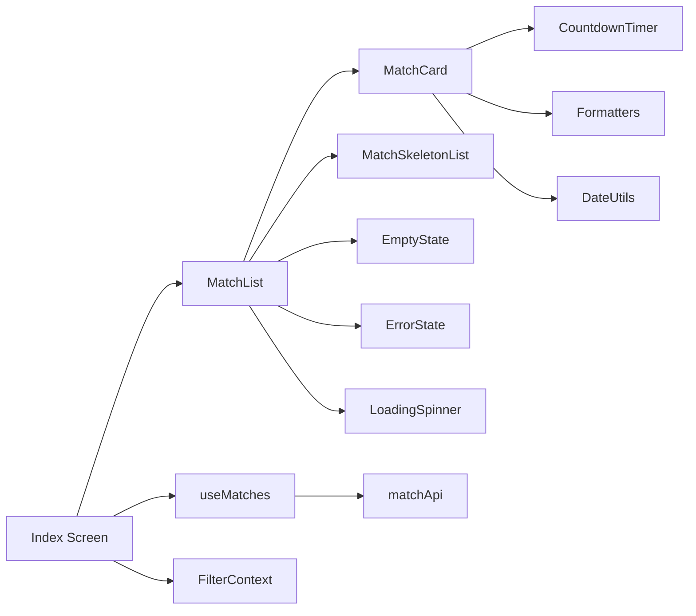

# Match Display System

<cite>
**Referenced Files in This Document**
- [app/index.tsx](file://app/index.tsx)
- [app/components/match/MatchList.tsx](file://app/components/match/MatchList.tsx)
- [app/components/match/MatchCard.tsx](file://app/components/match/MatchCard.tsx)
- [app/components/match/MatchSkeleton.tsx](file://app/components/match/MatchSkeleton.tsx)
- [app/components/match/CountdownTimer.tsx](file://app/components/match/CountdownTimer.tsx)
- [app/components/common/EmptyState.tsx](file://app/components/common/EmptyState.tsx)
- [app/components/common/ErrorState.tsx](file://app/components/common/ErrorState.tsx)
- [app/components/common/LoadingSpinner.tsx](file://app/components/common/LoadingSpinner.tsx)
- [app/hooks/useMatches.ts](file://app/hooks/useMatches.ts)
- [app/hooks/useCountdown.ts](file://app/hooks/useCountdown.ts)
- [app/services/matchApi.ts](file://app/services/matchApi.ts)
- [app/types/match.ts](file://app/types/match.ts)
- [app/utils/formatters.ts](file://app/utils/formatters.ts)
- [app/utils/dateUtils.ts](file://app/utils/dateUtils.ts)
- [app/context/FilterContext.tsx](file://app/context/FilterContext.tsx)
- [app/utils/constants.ts](file://app/utils/constants.ts)
</cite>

## Table of Contents
1. [Introduction](#introduction)
2. [Project Structure](#project-structure)
3. [Core Components](#core-components)
4. [Architecture Overview](#architecture-overview)
5. [Detailed Component Analysis](#detailed-component-analysis)
6. [Dependency Analysis](#dependency-analysis)
7. [Performance Considerations](#performance-considerations)
8. [Troubleshooting Guide](#troubleshooting-guide)
9. [Conclusion](#conclusion)

## Introduction
This document explains the match display system, focusing on the MatchList component’s infinite scroll pagination, FlatList optimization techniques, and loading state management. It also documents the MatchCard component structure, skeleton loading system, empty/error states, pull-to-refresh, pagination thresholds, and performance strategies such as windowSize and maxToRenderPerBatch. Finally, it covers component composition patterns and state management integration.

## Project Structure
The match display system is organized around a top-level screen that composes the MatchList component with filtering and data-fetching hooks. Supporting components include MatchCard, skeleton loaders, countdown timers, and reusable state placeholders.

**Diagram sources**
- [app/index.tsx](file://app/index.tsx#L11-L107)
- [app/components/match/MatchList.tsx](file://app/components/match/MatchList.tsx#L1-L117)
- [app/components/match/MatchCard.tsx](file://app/components/match/MatchCard.tsx#L1-L142)
- [app/components/match/MatchSkeleton.tsx](file://app/components/match/MatchSkeleton.tsx#L1-L56)
- [app/components/common/EmptyState.tsx](file://app/components/common/EmptyState.tsx#L1-L52)
- [app/components/common/ErrorState.tsx](file://app/components/common/ErrorState.tsx#L1-L49)
- [app/components/common/LoadingSpinner.tsx](file://app/components/common/LoadingSpinner.tsx#L1-L22)
- [app/hooks/useMatches.ts](file://app/hooks/useMatches.ts#L1-L56)
- [app/services/matchApi.ts](file://app/services/matchApi.ts#L1-L36)
- [app/context/FilterContext.tsx](file://app/context/FilterContext.tsx#L1-L72)
- [app/utils/formatters.ts](file://app/utils/formatters.ts#L1-L47)
- [app/utils/dateUtils.ts](file://app/utils/dateUtils.ts#L1-L64)
- [app/utils/constants.ts](file://app/utils/constants.ts#L1-L38)

**Section sources**
- [app/index.tsx](file://app/index.tsx#L11-L107)
- [app/components/match/MatchList.tsx](file://app/components/match/MatchList.tsx#L1-L117)

## Core Components
- MatchList: Renders a paginated list of matches using FlatList, handles pull-to-refresh, infinite scroll footer, and empty/error/loading states.
- MatchCard: Displays a single match with tournament info, team logos/silhouettes, scores, vs/countdown/live indicator, and formatted date/time.
- MatchSkeleton: Lightweight skeleton UI for initial loading.
- CountdownTimer: Live/expired/upcoming countdown rendering with animation and status-aware display.
- EmptyState/ErrorState/LoadingSpinner: Reusable state placeholders for empty, error, and loading conditions.
- useMatches: Infinite query hook integrating with the backend API and managing pagination.
- matchApi: Fetches match lists with timezone, status, tournament filters, limit, and offset.
- Types: Strongly typed match, team, tournament, and API parameters/responses.
- Utilities: Formatters for status colors/labels and team initials; date/time helpers and countdown logic.

**Section sources**
- [app/components/match/MatchList.tsx](file://app/components/match/MatchList.tsx#L15-L117)
- [app/components/match/MatchCard.tsx](file://app/components/match/MatchCard.tsx#L10-L142)
- [app/components/match/MatchSkeleton.tsx](file://app/components/match/MatchSkeleton.tsx#L4-L56)
- [app/components/match/CountdownTimer.tsx](file://app/components/match/CountdownTimer.tsx#L13-L43)
- [app/components/common/EmptyState.tsx](file://app/components/common/EmptyState.tsx#L14-L52)
- [app/components/common/ErrorState.tsx](file://app/components/common/ErrorState.tsx#L12-L49)
- [app/components/common/LoadingSpinner.tsx](file://app/components/common/LoadingSpinner.tsx#L10-L22)
- [app/hooks/useMatches.ts](file://app/hooks/useMatches.ts#L13-L55)
- [app/services/matchApi.ts](file://app/services/matchApi.ts#L4-L35)
- [app/types/match.ts](file://app/types/match.ts#L16-L45)
- [app/utils/formatters.ts](file://app/utils/formatters.ts#L22-L46)
- [app/utils/dateUtils.ts](file://app/utils/dateUtils.ts#L22-L63)

## Architecture Overview
The system follows a composition pattern:
- The Index screen orchestrates filters via FilterContext and data via useMatches.
- MatchList receives props for data, loading, pagination, and callbacks.
- MatchCard renders individual matches and delegates countdown logic to CountdownTimer.
- Skeletons improve perceived performance during initial loads.
- EmptyState and ErrorState provide user-friendly feedback for no-data and error scenarios.
- useMatches integrates with matchApi to fetch paginated data using offset/limit and exposes hasNextPage/isFetchingNextPage.

**Diagram sources**
- [app/index.tsx](file://app/index.tsx#L15-L43)
- [app/hooks/useMatches.ts](file://app/hooks/useMatches.ts#L21-L41)
- [app/services/matchApi.ts](file://app/services/matchApi.ts#L4-L35)
- [app/components/match/MatchList.tsx](file://app/components/match/MatchList.tsx#L83-L107)
- [app/components/match/MatchCard.tsx](file://app/components/match/MatchCard.tsx#L15-L137)

## Detailed Component Analysis

### MatchList Component
Responsibilities:
- Paginate matches using FlatList with infinite scroll threshold.
- Manage loading states: initial skeleton, footer spinner, and pull-to-refresh.
- Render empty state when no matches and error state when fetching fails.
- Compose MatchCard for each item and provide key extraction.

Key behaviors:
- onEndReached triggers onLoadMore only when hasNextPage and not fetching.
- onRefresh triggers refetch via onRefresh prop.
- ListFooterComponent shows LoadingSpinner while fetching next page.
- ListEmptyComponent switches between skeleton (initial loading), error state, or empty state.

Optimizations:
- removeClippedSubviews improves rendering performance.
- maxToRenderPerBatch limits per-frame render work.
- windowSize controls virtualized window size.
- initialNumToRender reduces startup cost.
- onEndReachedThreshold set to 0.5 to trigger early for smoother UX.

**Section sources**
- [app/components/match/MatchList.tsx](file://app/components/match/MatchList.tsx#L27-L117)

#### MatchList Rendering Flow

**Diagram sources**
- [app/components/match/MatchList.tsx](file://app/components/match/MatchList.tsx#L51-L81)
- [app/components/match/MatchSkeleton.tsx](file://app/components/match/MatchSkeleton.tsx#L45-L56)
- [app/components/common/EmptyState.tsx](file://app/components/common/EmptyState.tsx#L14-L52)
- [app/components/common/ErrorState.tsx](file://app/components/common/ErrorState.tsx#L12-L49)

### MatchCard Component
Structure:
- Header: Tournament name and status badge with color-coded label.
- Teams: Home/Away sections with optional logos or fallback initials badges.
- Center: VS text for live matches or CountdownTimer for upcoming.
- Footer: Formatted date and time using timezone-aware helpers.

Rendering decisions:
- Uses expo-image for logos with placeholder and transition.
- Fallback initials derived from team names via formatters.
- Scores shown when present.
- CountdownTimer adapts to live/expired/upcoming states.

**Section sources**
- [app/components/match/MatchCard.tsx](file://app/components/match/MatchCard.tsx#L15-L137)
- [app/utils/formatters.ts](file://app/utils/formatters.ts#L15-L46)
- [app/utils/dateUtils.ts](file://app/utils/dateUtils.ts#L4-L20)

#### MatchCard Class Diagram

**Diagram sources**
- [app/components/match/MatchCard.tsx](file://app/components/match/MatchCard.tsx#L10-L13)
- [app/types/match.ts](file://app/types/match.ts#L1-L29)

### Skeleton Loading System
- MatchSkeleton defines a lightweight card layout with gray placeholders.
- MatchSkeletonList renders N copies for initial loading.
- Used when isLoading is true and matches array is empty.

Benefits:
- Reduces perceived latency and maintains scroll continuity.
- Keeps UI responsive while data loads.

**Section sources**
- [app/components/match/MatchSkeleton.tsx](file://app/components/match/MatchSkeleton.tsx#L4-L56)
- [app/components/match/MatchList.tsx](file://app/components/match/MatchList.tsx#L52-L54)

### Empty State and Error State Handling
- EmptyState: Provides friendly messaging and optional action button (e.g., clear filters).
- ErrorState: Offers retry action with icon and call-to-action.
- Controlled by isLoading, isError, and matches.length in MatchList.

**Section sources**
- [app/components/common/EmptyState.tsx](file://app/components/common/EmptyState.tsx#L14-L52)
- [app/components/common/ErrorState.tsx](file://app/components/common/ErrorState.tsx#L12-L49)
- [app/components/match/MatchList.tsx](file://app/components/match/MatchList.tsx#L56-L81)

### Pull-to-Refresh and Pagination Thresholds
- Pull-to-refresh: RefreshControl bound to isLoading and onRefresh callback.
- Infinite scroll: onEndReachedThreshold at 0.5 triggers onLoadMore when hasNextPage and not fetching.
- Pagination: useMatches computes next offset via getNextPageParam and exposes isFetchingNextPage.

**Section sources**
- [app/components/match/MatchList.tsx](file://app/components/match/MatchList.tsx#L96-L107)
- [app/hooks/useMatches.ts](file://app/hooks/useMatches.ts#L34-L41)
- [app/index.tsx](file://app/index.tsx#L35-L43)

### Countdown Timer Integration
- CountdownTimer uses useCountdown to compute display and expiration.
- Live matches show animated “LIVE” indicator.
- Expired targets show “Started”; otherwise formatted countdown.

**Section sources**
- [app/components/match/CountdownTimer.tsx](file://app/components/match/CountdownTimer.tsx#L13-L43)
- [app/hooks/useCountdown.ts](file://app/hooks/useCountdown.ts#L10-L53)
- [app/utils/dateUtils.ts](file://app/utils/dateUtils.ts#L22-L51)

### State Management Integration
- FilterContext manages selected tournament IDs and applies/clears filters.
- Index screen reads filters and passes them to useMatches.
- MatchList receives isFiltered to adjust empty state messaging.

**Section sources**
- [app/context/FilterContext.tsx](file://app/context/FilterContext.tsx#L20-L63)
- [app/index.tsx](file://app/index.tsx#L13-L25)

## Dependency Analysis
- MatchList depends on:
  - MatchCard for rendering items
  - MatchSkeletonList for initial loading
  - EmptyState/ErrorState for state placeholders
  - LoadingSpinner for pagination footer
  - Constants for colors and base URLs
- MatchCard depends on:
  - Expo Image for logos
  - Formatters for status and initials
  - DateUtils for formatting and live detection
  - CountdownTimer for countdown display
- useMatches depends on:
  - matchApi for fetching
  - Constants for defaults
- Index screen composes:
  - useMatches and FilterContext
  - MatchList and FilterSheet

**Diagram sources**
- [app/index.tsx](file://app/index.tsx#L11-L107)
- [app/components/match/MatchList.tsx](file://app/components/match/MatchList.tsx#L1-L117)
- [app/components/match/MatchCard.tsx](file://app/components/match/MatchCard.tsx#L1-L142)
- [app/components/match/MatchSkeleton.tsx](file://app/components/match/MatchSkeleton.tsx#L1-L56)
- [app/components/common/EmptyState.tsx](file://app/components/common/EmptyState.tsx#L1-L52)
- [app/components/common/ErrorState.tsx](file://app/components/common/ErrorState.tsx#L1-L49)
- [app/components/common/LoadingSpinner.tsx](file://app/components/common/LoadingSpinner.tsx#L1-L22)
- [app/hooks/useMatches.ts](file://app/hooks/useMatches.ts#L1-L56)
- [app/services/matchApi.ts](file://app/services/matchApi.ts#L1-L36)
- [app/context/FilterContext.tsx](file://app/context/FilterContext.tsx#L1-L72)
- [app/utils/formatters.ts](file://app/utils/formatters.ts#L1-L47)
- [app/utils/dateUtils.ts](file://app/utils/dateUtils.ts#L1-L64)

**Section sources**
- [app/index.tsx](file://app/index.tsx#L11-L107)
- [app/hooks/useMatches.ts](file://app/hooks/useMatches.ts#L1-L56)
- [app/services/matchApi.ts](file://app/services/matchApi.ts#L1-L36)

## Performance Considerations
- FlatList optimizations in MatchList:
  - removeClippedSubviews: Improves rendering performance by clipping off-screen views.
  - maxToRenderPerBatch: Limits per-frame render work to keep scrolling smooth.
  - windowSize: Controls the virtualized window size for efficient rendering.
  - initialNumToRender: Reduces startup cost by limiting initial render count.
  - onEndReachedThreshold: 0.5 ensures prefetching starts before reaching the end.
- Memoization:
  - MatchCard and child components use memo to prevent unnecessary re-renders.
- Image optimization:
  - expo-image with placeholder and transition improves perceived performance.
- Countdown updates:
  - useCountdown leverages requestAnimationFrame and throttles updates to 1 second.

Recommendations:
- Keep pageSize aligned with DEFAULT_PAGE_SIZE for consistent pagination.
- Avoid heavy computations inside renderItem; extract helpers to utils.
- Consider adaptive windowSize/maxToRenderPerBatch based on device capabilities if needed.

**Section sources**
- [app/components/match/MatchList.tsx](file://app/components/match/MatchList.tsx#L108-L112)
- [app/components/match/MatchCard.tsx](file://app/components/match/MatchCard.tsx#L15-L137)
- [app/hooks/useCountdown.ts](file://app/hooks/useCountdown.ts#L17-L40)
- [app/utils/constants.ts](file://app/utils/constants.ts#L4)

## Troubleshooting Guide
Common issues and resolutions:
- No matches displayed:
  - Verify filters: isFiltered affects empty state messaging; clear filters if needed.
  - Confirm API params: timezone, status, tournament_ids are passed correctly.
- Infinite scroll not triggering:
  - Ensure hasNextPage is true and isFetchingNextPage is false.
  - Check onEndReachedThreshold and that data.total/limit logic is correct.
- Pull-to-refresh not working:
  - Ensure onRefresh is bound to refetch and isLoading reflects ongoing fetch.
- Skeleton not appearing:
  - Confirm isLoading is true and matches array is empty at initial load.
- Countdown not updating:
  - Validate targetDate and timezone correctness; ensure useCountdown runs and RAF cleanup occurs.

**Section sources**
- [app/components/match/MatchList.tsx](file://app/components/match/MatchList.tsx#L51-L87)
- [app/hooks/useMatches.ts](file://app/hooks/useMatches.ts#L34-L41)
- [app/hooks/useCountdown.ts](file://app/hooks/useCountdown.ts#L42-L50)
- [app/services/matchApi.ts](file://app/services/matchApi.ts#L4-L35)

## Conclusion
The match display system combines a robust data-fetching layer with a performant, user-friendly UI. MatchList leverages FlatList optimizations and a clear state machine for loading, empty, and error scenarios. MatchCard encapsulates match presentation with responsive visuals and countdown logic. Skeletons, placeholders, and memoization contribute to a smooth user experience. The integration with useMatches and FilterContext enables scalable filtering and pagination.