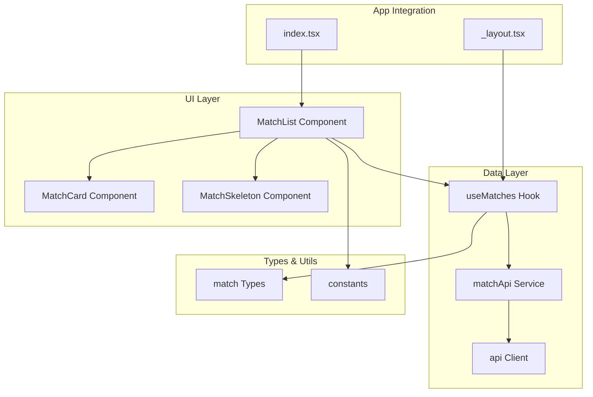
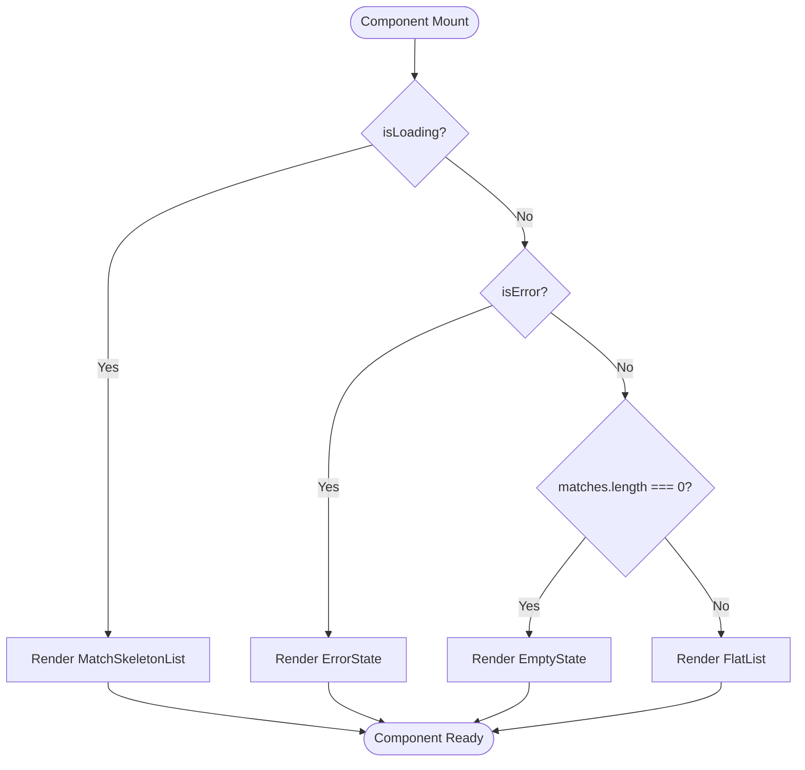
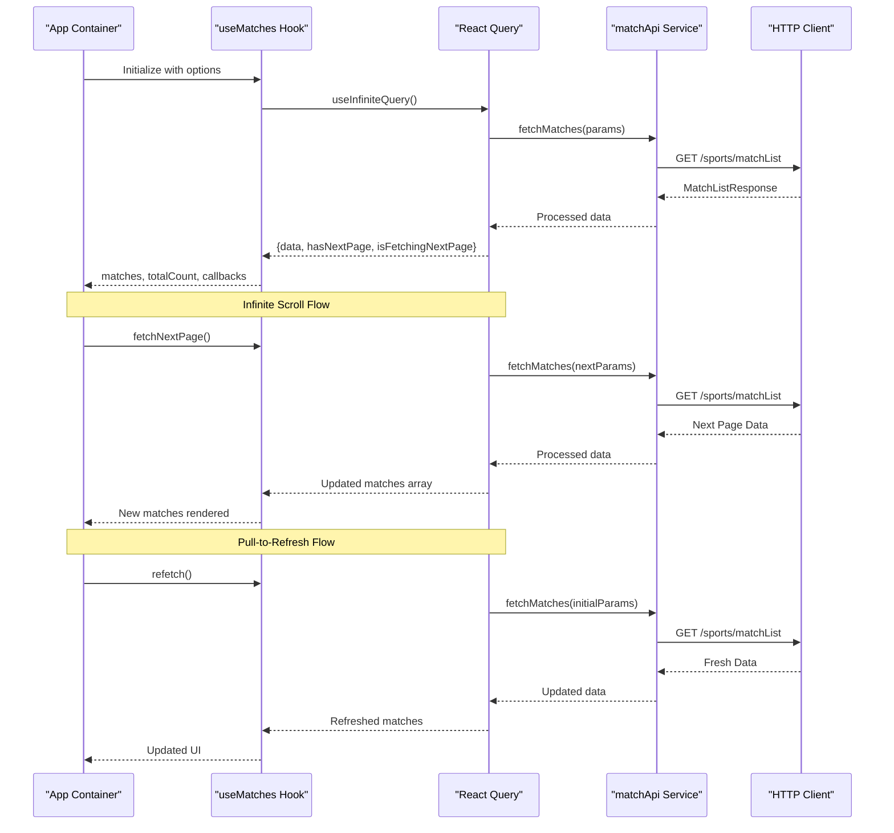
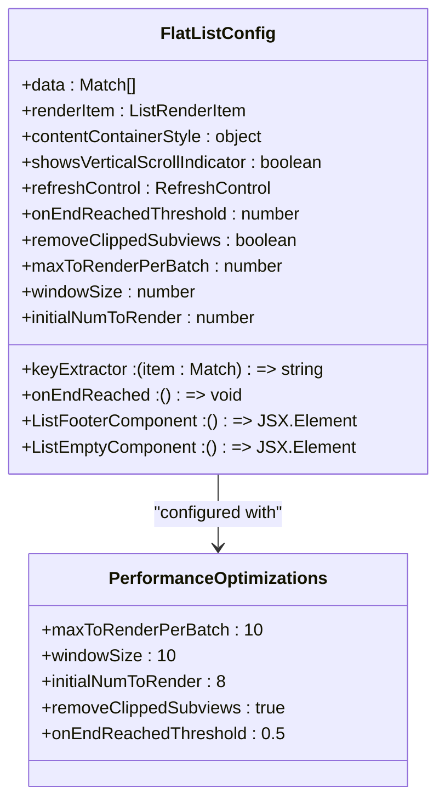
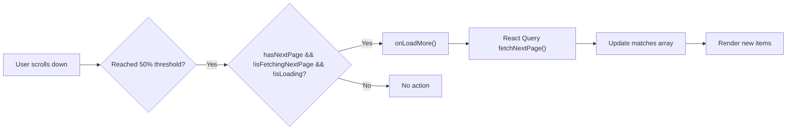
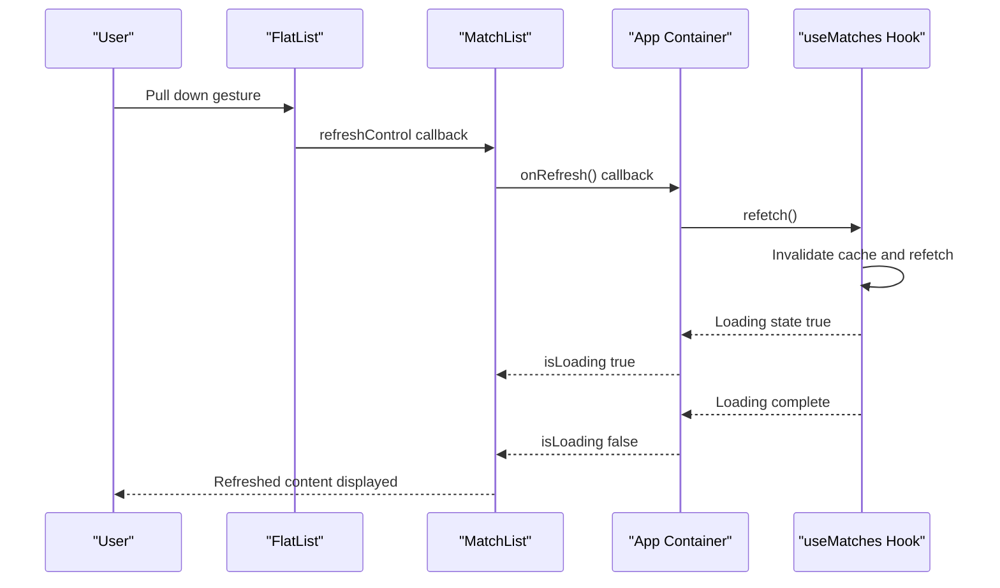
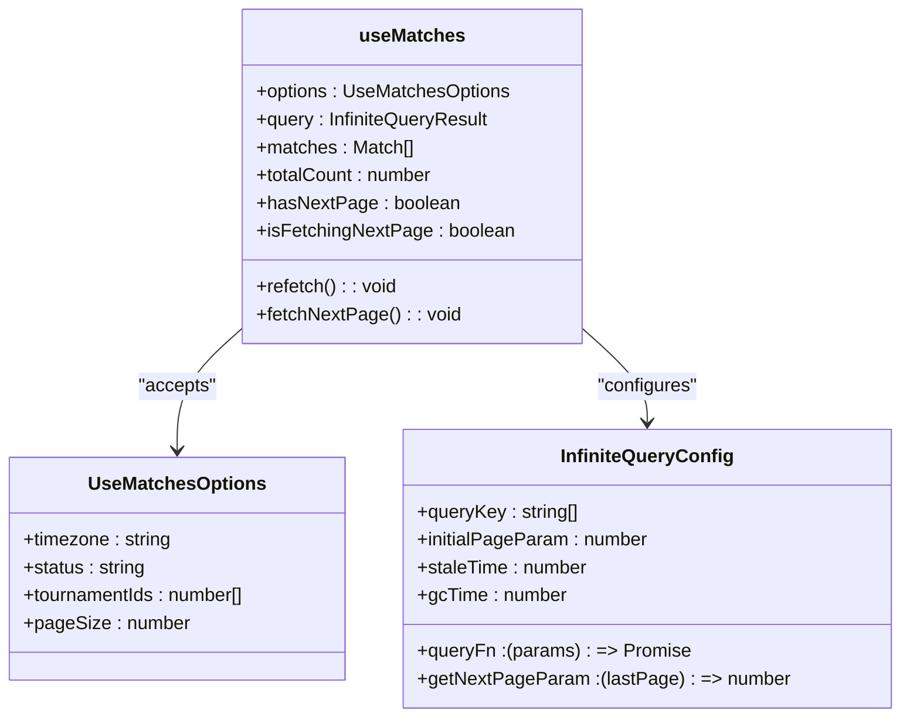
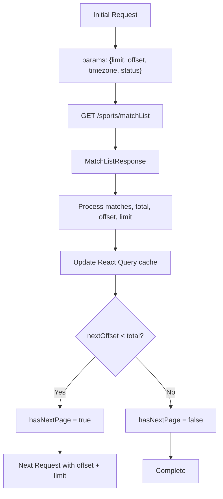
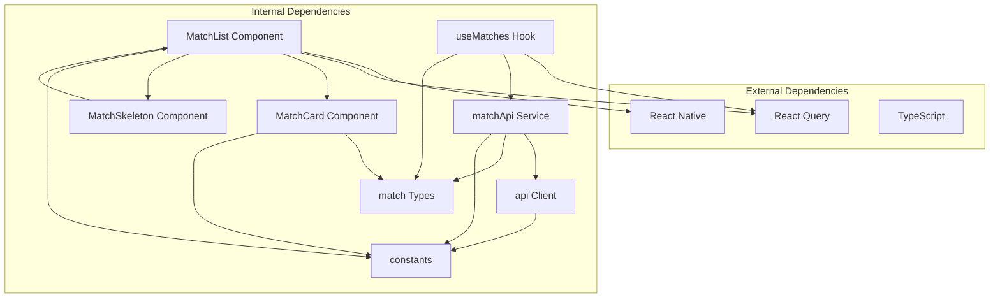
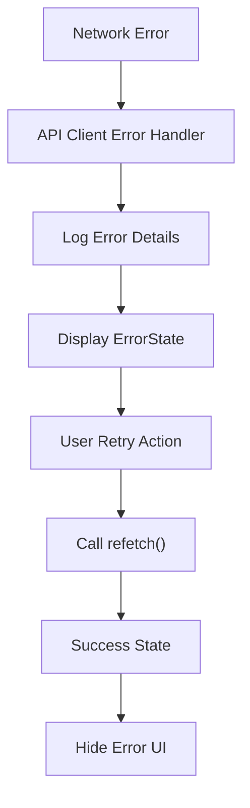

# Match List Component

<cite>
**Referenced Files in This Document**
- [MatchList.tsx](file://app/components/match/MatchList.tsx)
- [useMatches.ts](file://app/hooks/useMatches.ts)
- [matchApi.ts](file://app/services/matchApi.ts)
- [match.ts](file://app/types/match.ts)
- [index.tsx](file://app/index.tsx)
- [_layout.tsx](file://app/_layout.tsx)
- [constants.ts](file://app/utils/constants.ts)
- [MatchCard.tsx](file://app/components/match/MatchCard.tsx)
- [MatchSkeleton.tsx](file://app/components/match/MatchSkeleton.tsx)
- [api.ts](file://app/services/api.ts)
</cite>

## Table of Contents
1. [Introduction](#introduction)
2. [Project Structure](#project-structure)
3. [Core Components](#core-components)
4. [Architecture Overview](#architecture-overview)
5. [Detailed Component Analysis](#detailed-component-analysis)
6. [Dependency Analysis](#dependency-analysis)
7. [Performance Considerations](#performance-considerations)
8. [Troubleshooting Guide](#troubleshooting-guide)
9. [Conclusion](#conclusion)

## Introduction
The Match List component is a core UI component responsible for displaying paginated match data in a scrollable list format. It integrates with React Query for data fetching, implements infinite scrolling, provides pull-to-refresh functionality, and manages loading states efficiently. The component demonstrates modern React Native patterns for handling large datasets with optimal performance characteristics.

## Project Structure
The Match List implementation follows a modular architecture with clear separation of concerns:

**Diagram sources**
- [MatchList.tsx](file://app/components/match/MatchList.tsx#L1-L117)
- [useMatches.ts](file://app/hooks/useMatches.ts#L1-L56)
- [matchApi.ts](file://app/services/matchApi.ts#L1-L36)
- [index.tsx](file://app/index.tsx#L1-L108)

**Section sources**
- [MatchList.tsx](file://app/components/match/MatchList.tsx#L1-L117)
- [index.tsx](file://app/index.tsx#L1-L108)

## Core Components
The Match List component serves as the primary interface for displaying match data with comprehensive pagination and state management capabilities.

### Component Props Interface
The component accepts a well-defined set of props for flexible integration:

| Prop | Type | Required | Description |
|------|------|----------|-------------|
| `matches` | `Match[]` | Yes | Array of match objects to display |
| `isLoading` | `boolean` | Yes | Loading state indicator |
| `isError` | `boolean` | Yes | Error state indicator |
| `isFetchingNextPage` | `boolean` | Yes | Next page loading state |
| `hasNextPage` | `boolean` | Yes | Indicates if more pages exist |
| `onRefresh` | `() => void` | Yes | Callback for pull-to-refresh |
| `onLoadMore` | `() => void` | Yes | Callback for infinite scroll |
| `onClearFilters` | `() => void` | No | Clear filter action handler |
| `isFiltered` | `boolean` | No | Filter application status |

### Rendering Strategies
The component implements multiple rendering strategies based on application state:

**Diagram sources**
- [MatchList.tsx](file://app/components/match/MatchList.tsx#L51-L81)

**Section sources**
- [MatchList.tsx](file://app/components/match/MatchList.tsx#L15-L37)

## Architecture Overview
The Match List component integrates with a sophisticated data fetching architecture built on React Query's infinite query capabilities.

**Diagram sources**
- [useMatches.ts](file://app/hooks/useMatches.ts#L21-L41)
- [matchApi.ts](file://app/services/matchApi.ts#L4-L35)
- [index.tsx](file://app/index.tsx#L15-L43)

## Detailed Component Analysis

### FlatList Configuration and Performance Optimizations
The Match List component implements several key performance optimizations for smooth scrolling:

#### Virtualization Settings

**Diagram sources**
- [MatchList.tsx](file://app/components/match/MatchList.tsx#L90-L112)

#### Key Performance Parameters:
- **maxToRenderPerBatch (10)**: Controls batch rendering size for efficient memory usage
- **windowSize (10)**: Defines the visible window around the viewport for virtualization
- **initialNumToRender (8)**: Initial items to render for fast first paint
- **removeClippedSubviews (true)**: Enables clipping optimization for off-screen views
- **onEndReachedThreshold (0.5)**: Triggers load more when 50% from bottom reached

#### Infinite Scroll Implementation
The component handles infinite scrolling through a combination of FlatList's `onEndReached` callback and React Query's pagination:

**Diagram sources**
- [MatchList.tsx](file://app/components/match/MatchList.tsx#L83-L87)
- [index.tsx](file://app/index.tsx#L35-L39)

**Section sources**
- [MatchList.tsx](file://app/components/match/MatchList.tsx#L83-L112)

### Pull-to-Refresh Implementation
The component provides robust pull-to-refresh functionality through React Native's RefreshControl:

**Diagram sources**
- [MatchList.tsx](file://app/components/match/MatchList.tsx#L96-L103)
- [index.tsx](file://app/index.tsx#L97-L98)

**Section sources**
- [MatchList.tsx](file://app/components/match/MatchList.tsx#L96-L103)

### State Management and Conditional Rendering
The component implements sophisticated state management for different UI scenarios:

#### Loading States
- **Skeleton Loading**: Renders animated placeholders while initial data loads
- **Progressive Loading**: Shows spinner at footer when fetching next page
- **Empty States**: Handles empty results with contextual messaging

#### Error Handling
- **Error State**: Displays retryable error interface with automatic retry
- **Network Error**: Integrates with API client error handling
- **Graceful Degradation**: Maintains usability during network failures

**Section sources**
- [MatchList.tsx](file://app/components/match/MatchList.tsx#L46-L81)

### Integration with useMatches Hook
The component seamlessly integrates with the custom `useMatches` hook that provides React Query integration:

**Diagram sources**
- [useMatches.ts](file://app/hooks/useMatches.ts#L6-L41)

**Section sources**
- [useMatches.ts](file://app/hooks/useMatches.ts#L13-L55)

### Data Flow and Pagination Logic
The pagination system implements a cursor-based approach with React Query's infinite query pattern:

**Diagram sources**
- [useMatches.ts](file://app/hooks/useMatches.ts#L34-L37)
- [matchApi.ts](file://app/services/matchApi.ts#L4-L35)

**Section sources**
- [useMatches.ts](file://app/hooks/useMatches.ts#L34-L37)
- [matchApi.ts](file://app/services/matchApi.ts#L4-L35)

## Dependency Analysis
The Match List component has well-defined dependencies that contribute to its modularity and maintainability.

**Diagram sources**
- [MatchList.tsx](file://app/components/match/MatchList.tsx#L1-L14)
- [useMatches.ts](file://app/hooks/useMatches.ts#L1-L3)
- [matchApi.ts](file://app/services/matchApi.ts#L1-L2)

**Section sources**
- [MatchList.tsx](file://app/components/match/MatchList.tsx#L1-L14)
- [useMatches.ts](file://app/hooks/useMatches.ts#L1-L3)

## Performance Considerations

### Virtualization Benefits
The FlatList implementation leverages React Native's virtualization for optimal performance:

#### Memory Management
- **Window-based Rendering**: Only renders items within the visible window plus buffer
- **Batch Updates**: Limits simultaneous re-renders to 10 items per batch
- **Clipping Optimization**: Removes off-screen views from layout calculations

#### Layout Measurement
- **Stable Keys**: Uses composite key extraction combining match id and internal id
- **Memoized Renderers**: Prevents unnecessary re-renders of unchanged items
- **FlatList Optimization**: Built-in virtualization reduces memory footprint significantly

### Network Performance
- **Pagination Strategy**: Cursor-based pagination prevents loading excessive data
- **Cache Management**: React Query's intelligent caching reduces redundant requests
- **Stale Time Configuration**: Balances freshness with performance (2-minute stale time)

### UI Responsiveness
- **Non-blocking Operations**: Background data fetching doesn't block UI updates
- **Progressive Enhancement**: Content appears incrementally as pages load
- **Smooth Scrolling**: Optimized FlatList parameters ensure buttery scroll performance

## Troubleshooting Guide

### Common Issues and Solutions

#### Infinite Scroll Not Triggering
**Symptoms**: Users scroll to bottom but no new items load
**Causes**:
- `hasNextPage` incorrectly returns false
- `isFetchingNextPage` remains true
- `onEndReachedThreshold` too small

**Solutions**:
- Verify `hasNextPage` calculation in `useMatches` hook
- Check for network errors preventing page advancement
- Adjust `onEndReachedThreshold` if needed

#### Pull-to-Refresh Not Working
**Symptoms**: Refresh gesture doesn't update content
**Causes**:
- `onRefresh` callback not properly bound
- `refetch()` not called from parent component
- Loading state not managed correctly

**Solutions**:
- Ensure `onRefresh` prop is passed correctly from parent
- Verify `refetch()` is called when `onRefresh` is triggered
- Check that loading state transitions properly

#### Performance Issues
**Symptoms**: Slow scrolling or jank during pagination
**Causes**:
- Excessive re-renders in MatchCard component
- Large images without proper sizing
- Memory leaks from unmounted components

**Solutions**:
- Use `memo` for MatchCard component (already implemented)
- Optimize image loading with proper sizing
- Monitor for memory leaks using React DevTools

### Error Handling Patterns
The component implements comprehensive error handling strategies:

**Diagram sources**
- [api.ts](file://app/services/api.ts#L24-L36)

**Section sources**
- [MatchList.tsx](file://app/components/match/MatchList.tsx#L56-L61)
- [api.ts](file://app/services/api.ts#L24-L36)

## Conclusion
The Match List component demonstrates excellent implementation of modern React Native patterns for handling large datasets with optimal performance. Its integration with React Query provides robust pagination, while the FlatList configuration ensures smooth scrolling performance. The component's modular design, comprehensive error handling, and thoughtful state management make it a solid foundation for scalable applications.

Key strengths include:
- Efficient virtualization with optimized FlatList parameters
- Robust infinite scroll implementation with proper loading states
- Comprehensive error handling and user feedback mechanisms
- Clean separation of concerns through custom hooks and services
- Performance-conscious design with memory and network optimization

The component serves as an excellent example of how to build performant, maintainable React Native components that handle real-world data challenges effectively.