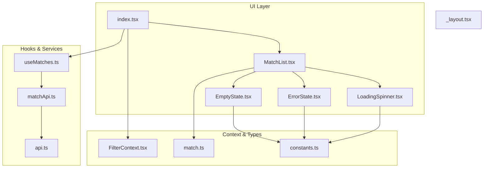
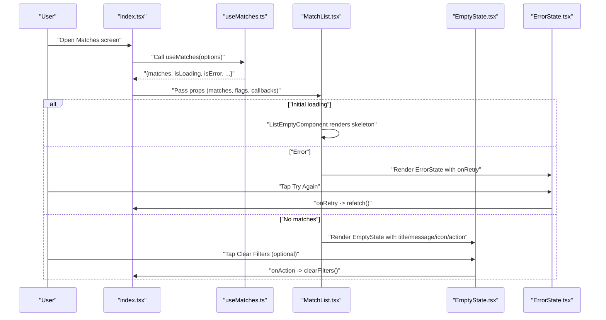
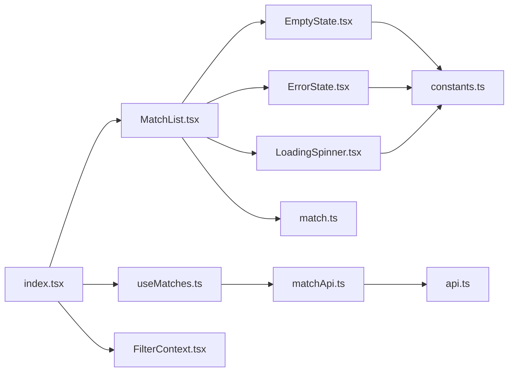
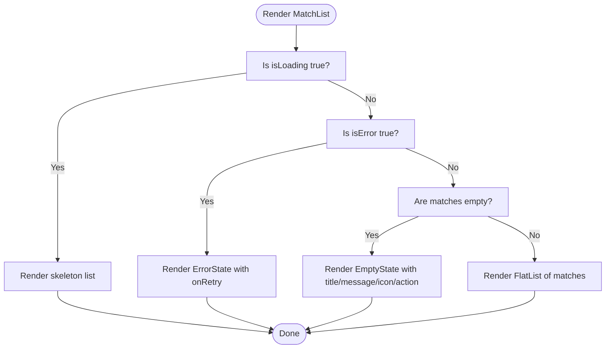

# State Management Components

<cite>
**Referenced Files in This Document**
- [EmptyState.tsx](file://app/components/common/EmptyState.tsx)
- [ErrorState.tsx](file://app/components/common/ErrorState.tsx)
- [LoadingSpinner.tsx](file://app/components/common/LoadingSpinner.tsx)
- [MatchList.tsx](file://app/components/match/MatchList.tsx)
- [useMatches.ts](file://app/hooks/useMatches.ts)
- [index.tsx](file://app/index.tsx)
- [_layout.tsx](file://app/_layout.tsx)
- [constants.ts](file://app/utils/constants.ts)
- [matchApi.ts](file://app/services/matchApi.ts)
- [api.ts](file://app/services/api.ts)
- [match.ts](file://app/types/match.ts)
- [FilterContext.tsx](file://app/context/FilterContext.tsx)
- [MatchSkeleton.tsx](file://app/components/match/MatchSkeleton.tsx)
</cite>

## Table of Contents
1. [Introduction](#introduction)
2. [Project Structure](#project-structure)
3. [Core Components](#core-components)
4. [Architecture Overview](#architecture-overview)
5. [Detailed Component Analysis](#detailed-component-analysis)
6. [Dependency Analysis](#dependency-analysis)
7. [Performance Considerations](#performance-considerations)
8. [Troubleshooting Guide](#troubleshooting-guide)
9. [Conclusion](#conclusion)
10. [Appendices](#appendices)

## Introduction
This document explains the state management components responsible for handling empty and error states in the application. It covers:
- EmptyState component: messaging, call-to-action buttons, and visual design for zero-results scenarios
- ErrorState component: error message display, retry functionality, and user guidance patterns
- Integration with React Query error and loading states via the useMatches hook
- Conditional rendering logic based on data availability and error conditions
- Examples of custom error messages, retry mechanisms, and navigation options for state transitions
- Accessibility considerations for state change announcements and keyboard navigation support

## Project Structure
The state management components are organized under the common components and match components folders, with integration points in the main index and layout files. React Query manages data fetching and caching, while the FilterContext provides filtering state that influences empty-state messaging.

**Diagram sources**
- [EmptyState.tsx](file://app/components/common/EmptyState.tsx#L1-L52)
- [ErrorState.tsx](file://app/components/common/ErrorState.tsx#L1-L49)
- [LoadingSpinner.tsx](file://app/components/common/LoadingSpinner.tsx#L1-L22)
- [MatchList.tsx](file://app/components/match/MatchList.tsx#L1-L117)
- [useMatches.ts](file://app/hooks/useMatches.ts#L1-L56)
- [matchApi.ts](file://app/services/matchApi.ts#L1-L36)
- [api.ts](file://app/services/api.ts#L1-L40)
- [index.tsx](file://app/index.tsx#L1-L108)
- [_layout.tsx](file://app/_layout.tsx#L1-L35)
- [FilterContext.tsx](file://app/context/FilterContext.tsx#L1-L72)
- [match.ts](file://app/types/match.ts#L1-L46)
- [constants.ts](file://app/utils/constants.ts#L1-L38)

**Section sources**
- [index.tsx](file://app/index.tsx#L1-L108)
- [_layout.tsx](file://app/_layout.tsx#L1-L35)

## Core Components
- EmptyState: Renders a centered message with an icon and optional action button for zero-results scenarios. Supports customizable title, message, icon, and action handler.
- ErrorState: Displays an error message with a retry button and icon, triggering a retry callback.
- LoadingSpinner: Provides a simple activity indicator with configurable size and color.
- MatchList: Orchestrates conditional rendering among skeleton loading, error state, empty state, and the list of matches. Integrates pagination and pull-to-refresh.
- useMatches: React Query hook returning paginated matches, loading, error, and pagination flags.

**Section sources**
- [EmptyState.tsx](file://app/components/common/EmptyState.tsx#L6-L52)
- [ErrorState.tsx](file://app/components/common/ErrorState.tsx#L6-L49)
- [LoadingSpinner.tsx](file://app/components/common/LoadingSpinner.tsx#L5-L22)
- [MatchList.tsx](file://app/components/match/MatchList.tsx#L15-L117)
- [useMatches.ts](file://app/hooks/useMatches.ts#L6-L56)

## Architecture Overview
The application uses React Query for data fetching and caching. The index page composes the useMatches hook and passes state flags to MatchList. MatchList decides which state component to render based on isLoading, isError, and matches length. EmptyState and ErrorState receive callbacks to trigger refetch or clear filters.

**Diagram sources**
- [index.tsx](file://app/index.tsx#L15-L25)
- [useMatches.ts](file://app/hooks/useMatches.ts#L13-L55)
- [MatchList.tsx](file://app/components/match/MatchList.tsx#L51-L81)
- [EmptyState.tsx](file://app/components/common/EmptyState.tsx#L14-L49)
- [ErrorState.tsx](file://app/components/common/ErrorState.tsx#L12-L46)

## Detailed Component Analysis

### EmptyState Component
Purpose:
- Display a friendly, actionable message when no matches are available.
- Provide a call-to-action button when applicable (e.g., clear filters).

Key behaviors:
- Uses a primary-colored circular container with an icon from Ionicons.
- Renders a title and message with neutral gray typography.
- Conditionally renders an action button with a press handler and label.
- Defaults are provided for title, message, and icon.

Accessibility considerations:
- Uses semantic text and pressable components suitable for touch targets.
- Consider adding accessibility labels for the action button to announce state changes.

Customization examples:
- title: e.g., "No matches found" or "No upcoming matches"
- message: e.g., "Try adjusting your filters to see more matches."
- icon: e.g., "filter-outline" or "calendar-outline"
- actionLabel and onAction: e.g., "Clear Filters" and a handler to reset filters

Integration points:
- Consumed by MatchList’s ListEmptyComponent during loading and empty states.

**Section sources**
- [EmptyState.tsx](file://app/components/common/EmptyState.tsx#L6-L52)
- [constants.ts](file://app/utils/constants.ts#L6-L21)

### ErrorState Component
Purpose:
- Inform users about failures and provide a retry mechanism.
- Encourage users to check connectivity and try again.

Key behaviors:
- Displays an error icon and message with a primary-colored retry button.
- The retry button triggers the onRetry callback passed from parent.
- Uses a dedicated error color from constants.

Accessibility considerations:
- Ensure the retry button is keyboard-focusable and announces state changes.
- Consider adding an accessibility hint indicating retry action.

Customization examples:
- title: e.g., "Something went wrong"
- message: e.g., "We couldn't load the matches. Please check your connection and try again."
- onRetry: e.g., a refetch function from the parent

Integration points:
- Rendered by MatchList when isError is true.

**Section sources**
- [ErrorState.tsx](file://app/components/common/ErrorState.tsx#L6-L49)
- [constants.ts](file://app/utils/constants.ts#L6-L21)

### LoadingSpinner Component
Purpose:
- Provide a lightweight spinner during loading states.

Key behaviors:
- Configurable size and color, defaults to small and primary color.

Integration points:
- Used by MatchList as ListFooterComponent during pagination loading.

**Section sources**
- [LoadingSpinner.tsx](file://app/components/common/LoadingSpinner.tsx#L5-L22)
- [constants.ts](file://app/utils/constants.ts#L6-L21)

### MatchList Component
Purpose:
- Manage conditional rendering of loading, error, empty, and list views.
- Integrate pagination and pull-to-refresh.

Conditional rendering logic:
- Initial loading: renders skeleton list while isLoading is true.
- Error: renders ErrorState with onRetry bound to onRefresh.
- Empty: renders EmptyState with contextual title, message, icon, and optional action based on isFiltered.
- Otherwise: renders the FlatList with MatchCard items.

Pagination and refresh:
- Pull-to-refresh uses RefreshControl with onRefresh mapped to refetch.
- onLoadMore triggers fetchNextPage when hasNextPage and not fetching.
- renderFooter shows LoadingSpinner when isFetchingNextPage.

Keyboard and accessibility:
- FlatList supports keyboard navigation via default scroll behavior.
- Retry button and optional action button are touch-friendly; consider adding accessibility labels for screen readers.

**Section sources**
- [MatchList.tsx](file://app/components/match/MatchList.tsx#L15-L117)
- [MatchSkeleton.tsx](file://app/components/match/MatchSkeleton.tsx#L45-L56)

### useMatches Hook
Purpose:
- Fetch paginated matches using React Query Infinite Query.
- Expose loading, error, pagination flags, and transformed data.

Key behaviors:
- Accepts timezone, status, tournamentIds, and pageSize options.
- Builds queryKey and queryFn for infinite pagination.
- Computes matches array and total count from pages.
- Sets staleTime and gcTime for caching.

Integration points:
- Consumed by index.tsx to pass props to MatchList.
- Provides refetch and fetchNextPage to parent.

**Section sources**
- [useMatches.ts](file://app/hooks/useMatches.ts#L6-L56)
- [matchApi.ts](file://app/services/matchApi.ts#L4-L35)

### Integration with React Query and Filtering
- React Query configuration sets default retry and staleTime in _layout.tsx.
- useMatches returns isLoading, isError, hasNextPage, isFetchingNextPage, refetch, and fetchNextPage.
- FilterContext controls selectedTournamentIds and applies filters; index.tsx passes them to useMatches.
- MatchList uses isFiltered to customize EmptyState messaging and action.

**Section sources**
- [_layout.tsx](file://app/_layout.tsx#L10-L17)
- [useMatches.ts](file://app/hooks/useMatches.ts#L13-L55)
- [FilterContext.tsx](file://app/context/FilterContext.tsx#L20-L72)
- [index.tsx](file://app/index.tsx#L15-L25)

### API Layer and Error Propagation
- api.ts intercepts responses and enriches error objects with message, status, and code.
- matchApi.ts constructs query parameters and calls the API client.
- useMatches relies on React Query to surface errors as isError and to trigger retries.

**Section sources**
- [api.ts](file://app/services/api.ts#L22-L37)
- [matchApi.ts](file://app/services/matchApi.ts#L4-L35)
- [useMatches.ts](file://app/hooks/useMatches.ts#L21-L41)

## Dependency Analysis
The following diagram shows how state components depend on shared utilities and services.

**Diagram sources**
- [EmptyState.tsx](file://app/components/common/EmptyState.tsx#L1-L52)
- [ErrorState.tsx](file://app/components/common/ErrorState.tsx#L1-L49)
- [LoadingSpinner.tsx](file://app/components/common/LoadingSpinner.tsx#L1-L22)
- [MatchList.tsx](file://app/components/match/MatchList.tsx#L1-L117)
- [index.tsx](file://app/index.tsx#L1-L108)
- [useMatches.ts](file://app/hooks/useMatches.ts#L1-L56)
- [matchApi.ts](file://app/services/matchApi.ts#L1-L36)
- [api.ts](file://app/services/api.ts#L1-L40)
- [FilterContext.tsx](file://app/context/FilterContext.tsx#L1-L72)
- [match.ts](file://app/types/match.ts#L1-L46)
- [constants.ts](file://app/utils/constants.ts#L1-L38)

**Section sources**
- [EmptyState.tsx](file://app/components/common/EmptyState.tsx#L1-L52)
- [ErrorState.tsx](file://app/components/common/ErrorState.tsx#L1-L49)
- [LoadingSpinner.tsx](file://app/components/common/LoadingSpinner.tsx#L1-L22)
- [MatchList.tsx](file://app/components/match/MatchList.tsx#L1-L117)
- [index.tsx](file://app/index.tsx#L1-L108)
- [useMatches.ts](file://app/hooks/useMatches.ts#L1-L56)
- [matchApi.ts](file://app/services/matchApi.ts#L1-L36)
- [api.ts](file://app/services/api.ts#L1-L40)
- [FilterContext.tsx](file://app/context/FilterContext.tsx#L1-L72)
- [match.ts](file://app/types/match.ts#L1-L46)
- [constants.ts](file://app/utils/constants.ts#L1-L38)

## Performance Considerations
- Infinite pagination reduces memory footprint by limiting rendered items.
- Stale and garbage collection times in useMatches balance freshness and performance.
- FlatList optimizations (windowSize, initialNumToRender, maxToRenderPerBatch) improve scrolling performance.
- Skeleton loading prevents layout shifts and improves perceived performance during initial load.

[No sources needed since this section provides general guidance]

## Troubleshooting Guide
Common issues and resolutions:
- EmptyState not appearing:
  - Verify matches length is zero and isLoading is false.
  - Confirm isFiltered flag is correctly derived from FilterContext.
- ErrorState not triggered:
  - Ensure API errors propagate to React Query; check api.ts interceptor.
  - Confirm refetch is bound to onRefresh in MatchList.
- Retry does nothing:
  - Ensure onRetry callback is passed down from index.tsx to MatchList and then to ErrorState.
- Pagination not loading more:
  - Check hasNextPage and isFetchingNextPage flags.
  - Ensure onLoadMore calls fetchNextPage appropriately.

Accessibility improvements:
- Add accessibilityLabel to action buttons in EmptyState and ErrorState.
- Ensure Retry button receives focus and can be activated via keyboard.
- Announce state changes (e.g., “No matches found”, “Error loading matches”) to assistive technologies.

**Section sources**
- [MatchList.tsx](file://app/components/match/MatchList.tsx#L51-L81)
- [ErrorState.tsx](file://app/components/common/ErrorState.tsx#L12-L46)
- [EmptyState.tsx](file://app/components/common/EmptyState.tsx#L14-L49)
- [api.ts](file://app/services/api.ts#L22-L37)

## Conclusion
The state management components provide a cohesive user experience for loading, empty, and error scenarios. They integrate tightly with React Query for robust data handling and with filtering context for contextual messaging. The design emphasizes clarity, actionability, and performance, with room for accessibility enhancements.

[No sources needed since this section summarizes without analyzing specific files]

## Appendices

### Conditional Rendering Flowchart

**Diagram sources**
- [MatchList.tsx](file://app/components/match/MatchList.tsx#L51-L81)
- [MatchSkeleton.tsx](file://app/components/match/MatchSkeleton.tsx#L45-L56)
- [ErrorState.tsx](file://app/components/common/ErrorState.tsx#L12-L46)
- [EmptyState.tsx](file://app/components/common/EmptyState.tsx#L14-L49)

### Example Scenarios and Callbacks
- Custom error message:
  - Provide a tailored message in ErrorState title and message props.
  - Trigger retry via onRetry bound to refetch.
- Navigation options:
  - EmptyState actionLabel and onAction enable clearing filters.
  - Pass onClearFilters from index.tsx to MatchList and then to EmptyState.
- State transitions:
  - From loading to error: isLoading false, isError true.
  - From error to success: onRetry resolves, data arrives, isError becomes false.
  - From filtered empty to populated: onClearFilters clears filters, refetch loads data.

**Section sources**
- [index.tsx](file://app/index.tsx#L41-L43)
- [MatchList.tsx](file://app/components/match/MatchList.tsx#L64-L77)
- [ErrorState.tsx](file://app/components/common/ErrorState.tsx#L12-L46)
- [EmptyState.tsx](file://app/components/common/EmptyState.tsx#L14-L49)