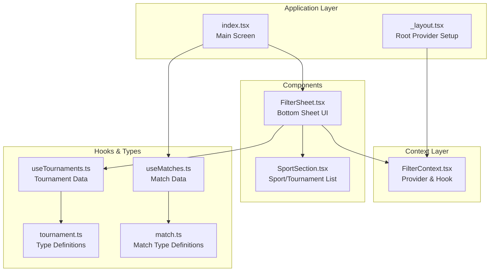
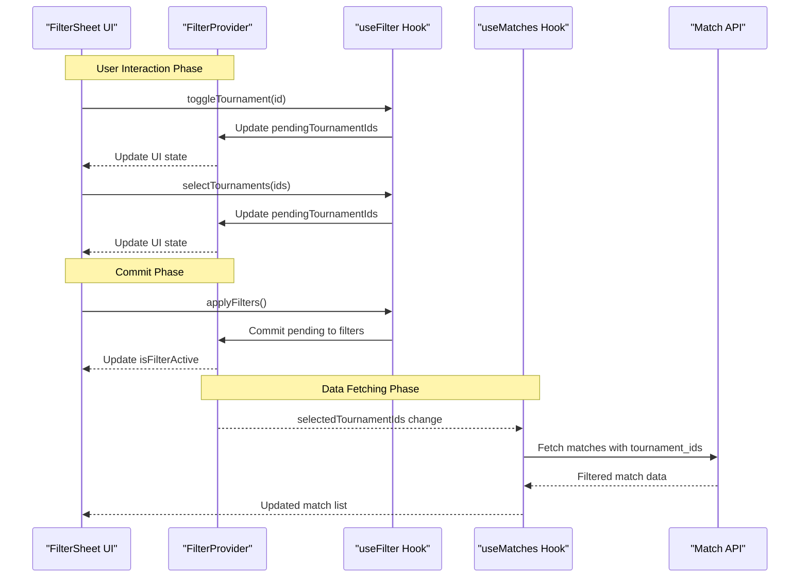
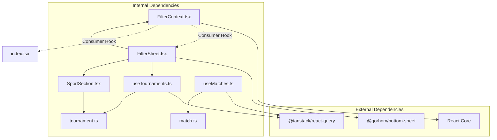

# Filter Context

<cite>
**Referenced Files in This Document**
- [FilterContext.tsx](file://app/context/FilterContext.tsx)
- [FilterSheet.tsx](file://app/components/filter/FilterSheet.tsx)
- [SportSection.tsx](file://app/components/filter/SportSection.tsx)
- [_layout.tsx](file://app/_layout.tsx)
- [index.tsx](file://app/index.tsx)
- [useTournaments.ts](file://app/hooks/useTournaments.ts)
- [useMatches.ts](file://app/hooks/useMatches.ts)
- [tournament.ts](file://app/types/tournament.ts)
- [match.ts](file://app/types/match.ts)
</cite>

## Table of Contents
1. [Introduction](#introduction)
2. [Project Structure](#project-structure)
3. [Core Components](#core-components)
4. [Architecture Overview](#architecture-overview)
5. [Detailed Component Analysis](#detailed-component-analysis)
6. [Dependency Analysis](#dependency-analysis)
7. [Performance Considerations](#performance-considerations)
8. [Troubleshooting Guide](#troubleshooting-guide)
9. [Conclusion](#conclusion)

## Introduction
This document provides comprehensive documentation for the FilterContext implementation, focusing on the dual-state architecture for managing tournament filters. The system implements a provider pattern with two distinct states:
- Committed filters (filters): Persisted state that affects data fetching
- Pending draft state (pendingTournamentIds): Temporary state for UI interactions before applying changes

The implementation enables interactive filtering through a bottom sheet UI, with methods for toggling individual selections, bulk operations, clearing filters, and committing changes.

## Project Structure
The filter context is organized within the application's context and components structure:

**Diagram sources**
- [_layout.tsx](file://app/_layout.tsx#L1-L35)
- [FilterContext.tsx](file://app/context/FilterContext.tsx#L1-L72)
- [FilterSheet.tsx](file://app/components/filter/FilterSheet.tsx#L1-L128)
- [SportSection.tsx](file://app/components/filter/SportSection.tsx#L1-L82)
- [useTournaments.ts](file://app/hooks/useTournaments.ts#L1-L45)
- [useMatches.ts](file://app/hooks/useMatches.ts#L1-L56)
- [tournament.ts](file://app/types/tournament.ts#L1-L31)
- [match.ts](file://app/types/match.ts#L1-L46)

**Section sources**
- [_layout.tsx](file://app/_layout.tsx#L1-L35)
- [FilterContext.tsx](file://app/context/FilterContext.tsx#L1-L72)

## Core Components
The FilterContext provides a comprehensive filtering system with the following key components:

### FilterState Interface
The committed state interface defines the persistent filter configuration:
- `selectedTournamentIds`: Array of currently selected tournament identifiers
- Purpose: Controls which tournaments are actively filtering match data

### FilterContextType Interface
The context provides comprehensive state and action methods:
- `filters`: Complete FilterState object
- `selectedTournamentIds`: Current selection array for convenience
- `toggleTournament(id: number)`: Individual tournament selection toggle
- `selectTournaments(ids: number[])`: Bulk tournament selection
- `clearFilters()`: Reset both committed and pending states
- `applyFilters()`: Commit pending changes to committed state
- `isFilterActive`: Boolean flag indicating active filters
- `pendingTournamentIds`: Draft selection array for UI interactions

### Provider Pattern Implementation
The FilterProvider establishes the dual-state architecture:
- Initializes both committed and pending states
- Manages state transitions through callback methods
- Exposes a custom hook for consumer access
- Implements error handling for missing provider context

**Section sources**
- [FilterContext.tsx](file://app/context/FilterContext.tsx#L3-L16)
- [FilterContext.tsx](file://app/context/FilterContext.tsx#L20-L63)

## Architecture Overview
The filter system follows a provider pattern with clear separation between UI interactions and data persistence:

**Diagram sources**
- [FilterSheet.tsx](file://app/components/filter/FilterSheet.tsx#L16-L50)
- [FilterContext.tsx](file://app/context/FilterContext.tsx#L20-L63)
- [useMatches.ts](file://app/hooks/useMatches.ts#L13-L41)

## Detailed Component Analysis

### FilterContext Implementation
The FilterProvider manages the dual-state architecture with sophisticated state management:

#### State Initialization
- Committed state: `selectedTournamentIds: []` - empty array by default
- Pending state: `pendingTournamentIds: []` - separate draft state
- Both states initialized in the provider component

#### Method Implementations
Each method maintains the dual-state pattern:

**toggleTournament Method**
- Toggles individual tournament selection in pending state
- Uses functional updates for atomic state changes
- Maintains immutability through spread operators

**selectTournaments Method**
- Bulk selection replacement for pending state
- Replaces entire selection array atomically
- Enables programmatic filter setting

**clearFilters Method**
- Resets both committed and pending states
- Clears all tournament selections
- Returns to base filter state

**applyFilters Method**
- Commits pending state to committed state
- Atomic state transition operation
- Triggers downstream data re-fetching

#### Error Handling
The custom hook implements runtime validation:
- Throws descriptive error when used outside provider
- Prevents accidental misuse of context
- Ensures proper provider wrapping

**Section sources**
- [FilterContext.tsx](file://app/context/FilterContext.tsx#L20-L72)

### Bottom Sheet Filter Integration
The FilterSheet component demonstrates comprehensive context usage:

#### UI State Management
- Displays loading states during tournament fetch
- Handles error states with retry functionality
- Shows filtered count in footer actions
- Integrates with bottom sheet navigation

#### Action Handlers
- `handleApply`: Commits filters and closes sheet
- `handleClear`: Resets all filters
- `handleToggleTournament`: Individual selection toggle
- `renderSportSection`: Dynamic sport rendering with pending state

#### Data Integration
- Uses `useTournaments` hook for tournament data
- Passes `pendingTournamentIds` for real-time selection feedback
- Integrates with `SportSection` for individual tournament selection

**Section sources**
- [FilterSheet.tsx](file://app/components/filter/FilterSheet.tsx#L16-L125)

### Sport Section Component
The SportSection component handles individual tournament selection:

#### Selection Feedback
- Visual indicators for selected tournaments
- Color-coded sport headers
- Active state highlighting
- Haptic feedback for user interactions

#### Integration Points
- Receives `selectedIds` from context
- Calls `onToggleTournament` callback
- Supports expandable sport sections
- Handles tournament list rendering

**Section sources**
- [SportSection.tsx](file://app/components/filter/SportSection.tsx#L15-L82)

### Main Application Integration
The index.tsx demonstrates complete filter integration:

#### Header Integration
- Filter button with active state indication
- Badge showing selected tournament count
- Conditional styling based on filter state
- Clear filters functionality

#### Data Fetching
- Passes `selectedTournamentIds` to useMatches
- Handles infinite scrolling with pagination
- Manages loading and error states
- Supports manual refresh functionality

#### Bottom Sheet Integration
- Opens filter sheet on demand
- Manages sheet lifecycle
- Coordinates with filter context

**Section sources**
- [index.tsx](file://app/index.tsx#L11-L107)

## Dependency Analysis
The filter context has well-defined dependencies and integration points:

**Diagram sources**
- [FilterContext.tsx](file://app/context/FilterContext.tsx#L1-L72)
- [FilterSheet.tsx](file://app/components/filter/FilterSheet.tsx#L1-L128)
- [SportSection.tsx](file://app/components/filter/SportSection.tsx#L1-L82)
- [useTournaments.ts](file://app/hooks/useTournaments.ts#L1-L45)
- [useMatches.ts](file://app/hooks/useMatches.ts#L1-L56)

### Integration Patterns
The filter context integrates with several key systems:

**Provider Setup**: Configured in root layout with proper dependency providers
**Data Fetching**: Seamless integration with React Query for caching and pagination
**UI Navigation**: Works with bottom sheet modal provider for smooth UX
**Type Safety**: Comprehensive TypeScript definitions for all components

**Section sources**
- [_layout.tsx](file://app/_layout.tsx#L1-L35)
- [FilterContext.tsx](file://app/context/FilterContext.tsx#L1-L72)

## Performance Considerations
The filter context implementation includes several performance optimizations:

### State Management Efficiency
- **Immutability**: All state updates use immutable patterns
- **Functional Updates**: Prevents stale closure issues
- **Callback Memoization**: useCallback prevents unnecessary re-renders
- **Atomic Operations**: Single state transitions minimize re-renders

### Data Fetching Optimization
- **Caching Strategy**: React Query provides intelligent caching
- **Stale Time Configuration**: Optimized cache invalidation timing
- **Pagination Support**: Infinite scroll with efficient data loading
- **Conditional Fetching**: Tournament data only fetched when needed

### UI Performance
- **Component Memoization**: SportSection uses React.memo for list rendering
- **Lazy Loading**: Bottom sheet content loads on demand
- **Efficient Rendering**: Minimal DOM updates during filter operations

## Troubleshooting Guide

### Common Issues and Solutions

**Missing Provider Error**
- **Problem**: Using `useFilter` outside FilterProvider
- **Solution**: Ensure FilterProvider wraps the application root
- **Prevention**: Wrap application with FilterProvider in layout

**Filter Not Applying**
- **Problem**: Changes not reflected in match data
- **Solution**: Call `applyFilters()` to commit changes
- **Verification**: Check `isFilterActive` and `selectedTournamentIds`

**Empty Results After Filtering**
- **Problem**: No matches returned after filter application
- **Solution**: Verify tournament IDs exist in database
- **Debugging**: Check API response and tournament availability

**Performance Issues**
- **Problem**: Slow filter interactions or UI lag
- **Solution**: Verify useCallback usage and component memoization
- **Optimization**: Consider debouncing filter operations

### Error Handling Patterns
The implementation includes robust error handling:

**Runtime Validation**: Custom hook throws descriptive errors
**API Error States**: Bottom sheet displays error states with retry
**Loading States**: Graceful loading indicators throughout
**Fallback Behavior**: Graceful degradation when filters fail

**Section sources**
- [FilterContext.tsx](file://app/context/FilterContext.tsx#L65-L71)
- [FilterSheet.tsx](file://app/components/filter/FilterSheet.tsx#L78-L91)

## Conclusion
The FilterContext implementation provides a robust, scalable solution for tournament filtering with the following key strengths:

### Architectural Excellence
- **Dual-State Design**: Separates UI interactions from data persistence
- **Provider Pattern**: Clean separation of concerns and easy testing
- **Type Safety**: Comprehensive TypeScript integration
- **Error Handling**: Runtime validation and graceful error states

### User Experience
- **Real-time Feedback**: Immediate visual feedback for selections
- **Intuitive Workflow**: Clear filter application and reset mechanisms
- **Performance**: Optimized rendering and data fetching
- **Accessibility**: Proper state indicators and feedback

### Integration Capabilities
- **Flexible API**: Easy integration with various data sources
- **Extensible Design**: Can accommodate additional filter criteria
- **Testing Ready**: Well-structured components support unit testing
- **Documentation**: Clear patterns for future maintenance

The implementation serves as a model for complex state management in React Native applications, demonstrating best practices for provider patterns, dual-state architectures, and seamless UI-data integration.