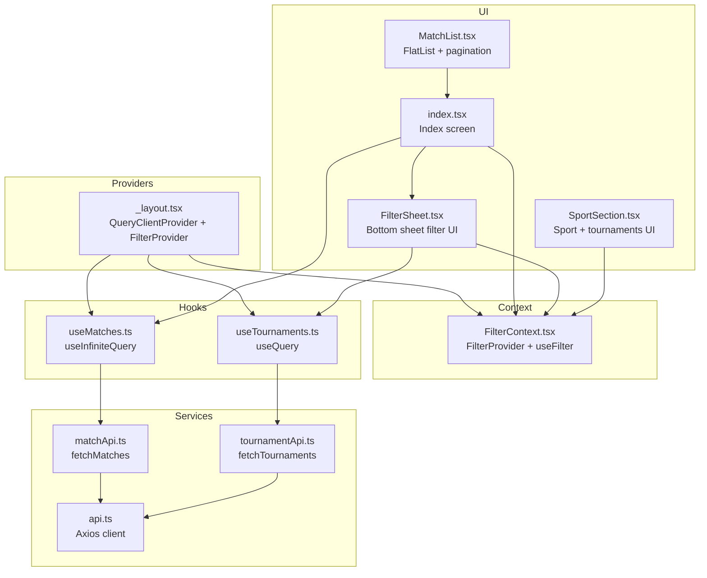
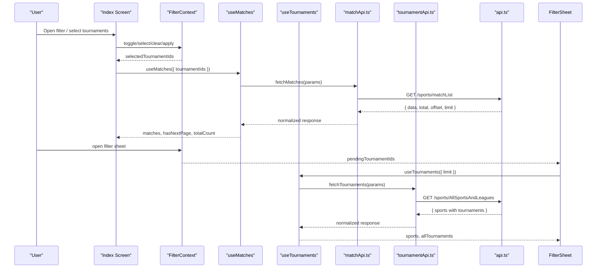
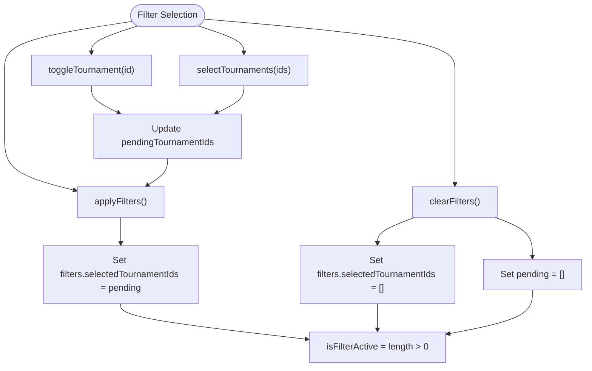
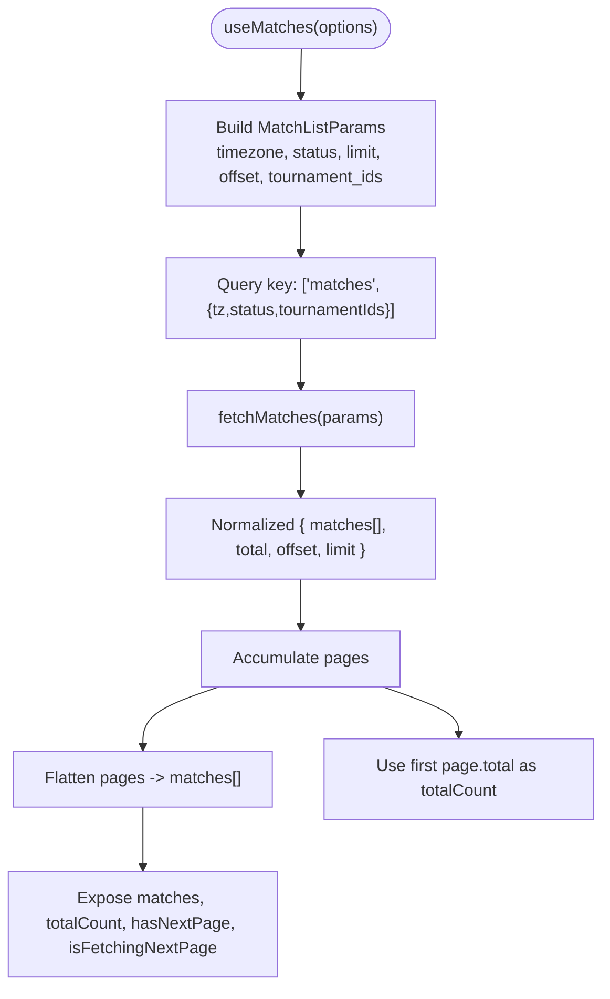
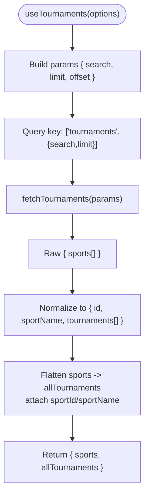
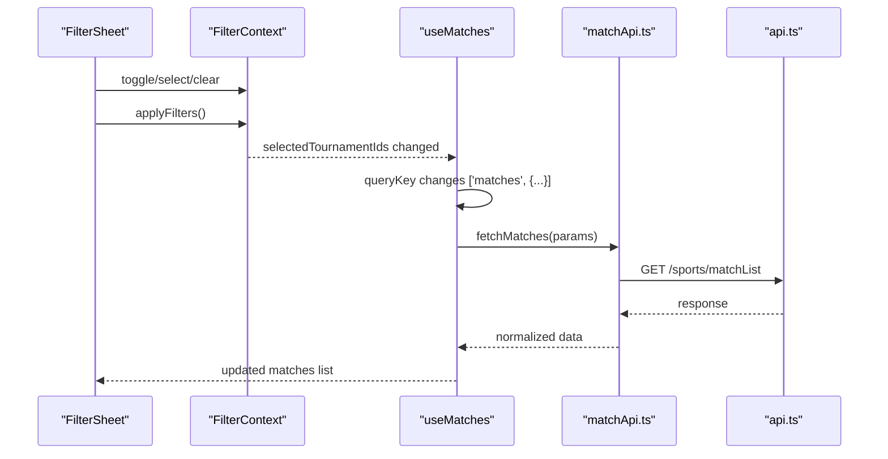
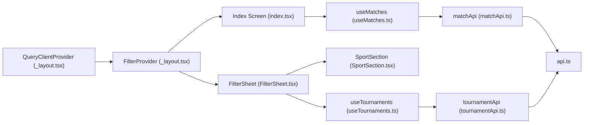

# State Management

<cite>
**Referenced Files in This Document**
- [FilterContext.tsx](file://app/context/FilterContext.tsx)
- [useMatches.ts](file://app/hooks/useMatches.ts)
- [useTournaments.ts](file://app/hooks/useTournaments.ts)
- [matchApi.ts](file://app/services/matchApi.ts)
- [tournamentApi.ts](file://app/services/tournamentApi.ts)
- [api.ts](file://app/services/api.ts)
- [index.tsx](file://app/index.tsx)
- [_layout.tsx](file://app/_layout.tsx)
- [FilterSheet.tsx](file://app/components/filter/FilterSheet.tsx)
- [SportSection.tsx](file://app/components/filter/SportSection.tsx)
- [MatchList.tsx](file://app/components/match/MatchList.tsx)
- [constants.ts](file://app/utils/constants.ts)
- [match.ts](file://app/types/match.ts)
- [tournament.ts](file://app/types/tournament.ts)
</cite>

## Table of Contents
1. [Introduction](#introduction)
2. [Project Structure](#project-structure)
3. [Core Components](#core-components)
4. [Architecture Overview](#architecture-overview)
5. [Detailed Component Analysis](#detailed-component-analysis)
6. [Dependency Analysis](#dependency-analysis)
7. [Performance Considerations](#performance-considerations)
8. [Troubleshooting Guide](#troubleshooting-guide)
9. [Conclusion](#conclusion)

## Introduction
This document explains the state management architecture that combines React Context API and React Query. It focuses on:
- FilterContext for tournament filtering state, including selection, persistence, and updates
- useMatches hook pattern for infinite query management, pagination, and caching
- useTournaments hook for fetching and managing tournament metadata with automatic refetching and error handling
- Integration patterns between context state and query state, optimistic updates, and cache invalidation strategies
- Performance optimizations such as query deduplication, background refetching, and memory management for large datasets

## Project Structure
The state management spans three layers:
- Providers and Context: Application-wide filter state via a React Context provider
- Hooks and Queries: TanStack React Query hooks encapsulating data fetching, pagination, and caching
- Services and Types: API clients and typed models for requests and responses

**Diagram sources**
- [_layout.tsx](file://app/_layout.tsx#L1-L35)
- [FilterContext.tsx](file://app/context/FilterContext.tsx#L1-L72)
- [useMatches.ts](file://app/hooks/useMatches.ts#L1-L56)
- [useTournaments.ts](file://app/hooks/useTournaments.ts#L1-L45)
- [matchApi.ts](file://app/services/matchApi.ts#L1-L36)
- [tournamentApi.ts](file://app/services/tournamentApi.ts#L1-L35)
- [api.ts](file://app/services/api.ts#L1-L40)
- [index.tsx](file://app/index.tsx#L1-L108)
- [FilterSheet.tsx](file://app/components/filter/FilterSheet.tsx#L1-L128)
- [SportSection.tsx](file://app/components/filter/SportSection.tsx#L1-L82)
- [MatchList.tsx](file://app/components/match/MatchList.tsx#L1-L117)

**Section sources**
- [_layout.tsx](file://app/_layout.tsx#L1-L35)
- [FilterContext.tsx](file://app/context/FilterContext.tsx#L1-L72)
- [useMatches.ts](file://app/hooks/useMatches.ts#L1-L56)
- [useTournaments.ts](file://app/hooks/useTournaments.ts#L1-L45)
- [matchApi.ts](file://app/services/matchApi.ts#L1-L36)
- [tournamentApi.ts](file://app/services/tournamentApi.ts#L1-L35)
- [api.ts](file://app/services/api.ts#L1-L40)
- [index.tsx](file://app/index.tsx#L1-L108)
- [FilterSheet.tsx](file://app/components/filter/FilterSheet.tsx#L1-L128)
- [SportSection.tsx](file://app/components/filter/SportSection.tsx#L1-L82)
- [MatchList.tsx](file://app/components/match/MatchList.tsx#L1-L117)

## Core Components
- FilterContext: Manages tournament filter selection with a two-stage pipeline (pending vs applied) and exposes actions to toggle, select, clear, and apply filters. It also exposes whether filters are active.
- useMatches: Implements infinite pagination with React Query’s useInfiniteQuery, deriving flattened matches and total counts from paginated responses. It supports timezone, status, tournament filters, and configurable page size.
- useTournaments: Fetches tournament metadata grouped by sport, enabling the filter UI. It supports search, limit, and lazy enabling via an option flag.
- API Layer: Centralized Axios client with interceptors for unified error handling and base URL configuration. Services translate typed parameters into query strings and normalize responses.

**Section sources**
- [FilterContext.tsx](file://app/context/FilterContext.tsx#L1-L72)
- [useMatches.ts](file://app/hooks/useMatches.ts#L1-L56)
- [useTournaments.ts](file://app/hooks/useTournaments.ts#L1-L45)
- [matchApi.ts](file://app/services/matchApi.ts#L1-L36)
- [tournamentApi.ts](file://app/services/tournamentApi.ts#L1-L35)
- [api.ts](file://app/services/api.ts#L1-L40)

## Architecture Overview
The architecture pairs a Context provider with React Query:
- Context holds UI-driven filter state (pending) and exposes actions to mutate it
- React Query manages server-backed data (matches, tournaments) with caching, pagination, and refetching
- UI components subscribe to both contexts and queries to render filtered lists and manage pagination

**Diagram sources**
- [index.tsx](file://app/index.tsx#L11-L108)
- [FilterContext.tsx](file://app/context/FilterContext.tsx#L20-L71)
- [useMatches.ts](file://app/hooks/useMatches.ts#L13-L55)
- [useTournaments.ts](file://app/hooks/useTournaments.ts#L11-L44)
- [matchApi.ts](file://app/services/matchApi.ts#L4-L35)
- [tournamentApi.ts](file://app/services/tournamentApi.ts#L4-L34)
- [api.ts](file://app/services/api.ts#L1-L40)

## Detailed Component Analysis

### FilterContext Implementation
FilterContext maintains:
- filters: Applied filter state (selected tournament IDs)
- pendingTournamentIds: UI staging area for selections before applying
- Actions:
  - toggleTournament: Add/remove a tournament ID from pending
  - selectTournaments: Replace pending with a provided list
  - clearFilters: Reset both pending and applied filters
  - applyFilters: Commit pending to applied filters
- Derived:
  - isFilterActive: Boolean indicating if any filters are applied
  - selectedTournamentIds: Alias for current applied filters

Integration points:
- Index screen reads selectedTournamentIds and passes them to useMatches
- FilterSheet reads pendingTournamentIds and toggles selections; applies when confirmed

**Diagram sources**
- [FilterContext.tsx](file://app/context/FilterContext.tsx#L26-L45)

**Section sources**
- [FilterContext.tsx](file://app/context/FilterContext.tsx#L1-L72)
- [index.tsx](file://app/index.tsx#L13-L25)
- [FilterSheet.tsx](file://app/components/filter/FilterSheet.tsx#L16-L50)

### useMatches Hook Pattern
Purpose:
- Infinite pagination for match listings with configurable filters and timezone/status
- Caching and background refetching via React Query

Key behaviors:
- Query key: ['matches', { timezone, status, tournamentIds }]
- Query function builds MatchListParams and calls matchApi.fetchMatches
- Pagination:
  - getNextPageParam computes next offset based on last page’s offset/limit/total
  - initialPageParam starts at 0
- Derived data:
  - matches: Flattened array from pages
  - totalCount: From first page’s total
  - hasNextPage/isFetchingNextPage: Control UI pagination
- Caching:
  - staleTime and gcTime configured per query
  - defaultOptions.staleTime configured globally

**Diagram sources**
- [useMatches.ts](file://app/hooks/useMatches.ts#L13-L55)
- [matchApi.ts](file://app/services/matchApi.ts#L4-L35)
- [match.ts](file://app/types/match.ts#L31-L45)

**Section sources**
- [useMatches.ts](file://app/hooks/useMatches.ts#L1-L56)
- [matchApi.ts](file://app/services/matchApi.ts#L1-L36)
- [match.ts](file://app/types/match.ts#L1-L46)
- [_layout.tsx](file://app/_layout.tsx#L10-L17)

### useTournaments Hook
Purpose:
- Fetch tournament metadata grouped by sport for the filter UI
- Support search, limit, and lazy enabling

Key behaviors:
- Query key: ['tournaments', { search, limit }]
- Query function builds AllSportsAndLeaguesParams and calls tournamentApi.fetchTournaments
- Post-processing:
  - Flattens sports -> tournaments into allTournaments
  - Attaches sport metadata (id, name) to each tournament
- Options:
  - enabled: Controls whether the query runs
  - limit: Defaults to 50; increased in UI to 100 for filter sheet
- Caching:
  - staleTime and gcTime configured per query
  - defaultOptions.staleTime configured globally

**Diagram sources**
- [useTournaments.ts](file://app/hooks/useTournaments.ts#L11-L44)
- [tournamentApi.ts](file://app/services/tournamentApi.ts#L4-L34)
- [tournament.ts](file://app/types/tournament.ts#L6-L20)

**Section sources**
- [useTournaments.ts](file://app/hooks/useTournaments.ts#L1-L45)
- [tournamentApi.ts](file://app/services/tournamentApi.ts#L1-L35)
- [tournament.ts](file://app/types/tournament.ts#L1-L31)
- [FilterSheet.tsx](file://app/components/filter/FilterSheet.tsx#L17-L24)

### Integration Patterns Between Context and Query State
- Context-to-Query:
  - Index screen reads selectedTournamentIds from FilterContext and passes it to useMatches
  - useMatches automatically refetches when the query key changes (due to tournamentIds)
- Query-to-Context:
  - FilterSheet reads pendingTournamentIds from FilterContext and toggles selections
  - On apply, FilterContext commits pending to applied filters, causing useMatches to refetch
- Optimistic Updates:
  - No explicit optimistic mutations are present; selections are staged in Context and committed on apply
- Cache Invalidation:
  - Changing tournamentIds in the query key triggers React Query to re-fetch and update cache entries
  - Global defaultOptions.staleTime and per-query staleTime/gcTime control cache lifecycle

**Diagram sources**
- [FilterSheet.tsx](file://app/components/filter/FilterSheet.tsx#L28-L31)
- [FilterContext.tsx](file://app/context/FilterContext.tsx#L41-L43)
- [useMatches.ts](file://app/hooks/useMatches.ts#L21-L41)
- [matchApi.ts](file://app/services/matchApi.ts#L4-L35)
- [api.ts](file://app/services/api.ts#L1-L40)

**Section sources**
- [index.tsx](file://app/index.tsx#L13-L25)
- [FilterSheet.tsx](file://app/components/filter/FilterSheet.tsx#L16-L50)
- [FilterContext.tsx](file://app/context/FilterContext.tsx#L20-L63)
- [useMatches.ts](file://app/hooks/useMatches.ts#L13-L55)

### Pagination Handling and Data Caching Strategies
- Pagination:
  - useInfiniteQuery with getNextPageParam computes next offset until total is reached
  - UI triggers fetchNextPage when user scrolls to end
- Caching:
  - Per-query staleTime and gcTime tune freshness and GC
  - Global defaultOptions.staleTime reduces unnecessary refetches
- Memory Management:
  - gcTime limits cache retention for inactive queries
  - FlatList optimizations in MatchList reduce rendering overhead

**Section sources**
- [useMatches.ts](file://app/hooks/useMatches.ts#L34-L41)
- [MatchList.tsx](file://app/components/match/MatchList.tsx#L83-L112)
- [_layout.tsx](file://app/_layout.tsx#L10-L17)

## Dependency Analysis
- Provider stack:
  - QueryClientProvider wraps the app with defaultOptions controlling retries and staleness
  - BottomSheetModalProvider enables bottom sheets
  - FilterProvider supplies filter state to components
- Hook dependencies:
  - useMatches depends on matchApi and types
  - useTournaments depends on tournamentApi and types
- UI dependencies:
  - Index screen composes FilterSheet and MatchList
  - FilterSheet composes SportSection and uses useTournaments and FilterContext

**Diagram sources**
- [_layout.tsx](file://app/_layout.tsx#L19-L34)
- [index.tsx](file://app/index.tsx#L11-L108)
- [FilterSheet.tsx](file://app/components/filter/FilterSheet.tsx#L16-L50)
- [SportSection.tsx](file://app/components/filter/SportSection.tsx#L15-L82)
- [useMatches.ts](file://app/hooks/useMatches.ts#L1-L56)
- [useTournaments.ts](file://app/hooks/useTournaments.ts#L1-L45)
- [matchApi.ts](file://app/services/matchApi.ts#L1-L36)
- [tournamentApi.ts](file://app/services/tournamentApi.ts#L1-L35)
- [api.ts](file://app/services/api.ts#L1-L40)

**Section sources**
- [_layout.tsx](file://app/_layout.tsx#L1-L35)
- [index.tsx](file://app/index.tsx#L1-L108)
- [FilterSheet.tsx](file://app/components/filter/FilterSheet.tsx#L1-L128)
- [SportSection.tsx](file://app/components/filter/SportSection.tsx#L1-L82)
- [useMatches.ts](file://app/hooks/useMatches.ts#L1-L56)
- [useTournaments.ts](file://app/hooks/useTournaments.ts#L1-L45)
- [matchApi.ts](file://app/services/matchApi.ts#L1-L36)
- [tournamentApi.ts](file://app/services/tournamentApi.ts#L1-L35)
- [api.ts](file://app/services/api.ts#L1-L40)

## Performance Considerations
- Query Deduplication:
  - Same query keys avoid duplicate network requests; changing tournamentIds ensures fresh data
- Background Refetching:
  - Global defaultOptions.staleTime prevents frequent refetches during normal usage
- Memory Management:
  - gcTime controls cache retention for inactive queries
  - FlatList optimizations (windowSize, maxToRenderPerBatch, initialNumToRender) improve rendering performance
- Network Efficiency:
  - API client centralizes headers and timeouts; services build minimal query strings
- UI Responsiveness:
  - Infinite pagination defers loading until near the end; loading indicators prevent redundant work

[No sources needed since this section provides general guidance]

## Troubleshooting Guide
- API Errors:
  - api.ts interceptor logs error details and rejects with structured error shape
- Tournament Load Failures:
  - FilterSheet displays an error state with a retry button that calls refetch
- Match List Errors:
  - MatchList renders an ErrorState with a retry action bound to onRefresh
- Filter Persistence:
  - If filters appear reset unexpectedly, verify that applyFilters is called after selection and that the query key includes tournamentIds

**Section sources**
- [api.ts](file://app/services/api.ts#L22-L37)
- [FilterSheet.tsx](file://app/components/filter/FilterSheet.tsx#L78-L91)
- [MatchList.tsx](file://app/components/match/MatchList.tsx#L56-L61)
- [FilterContext.tsx](file://app/context/FilterContext.tsx#L41-L43)

## Conclusion
The application combines React Context and React Query to deliver a responsive, efficient state management solution:
- FilterContext stages user selections and exposes a clean API to commit changes
- useMatches handles infinite pagination and caching with robust defaults
- useTournaments supplies metadata for the filter UI with controlled enabling and caching
- The integration leverages query keys for cache invalidation and refetching, while UI components coordinate pagination and error handling