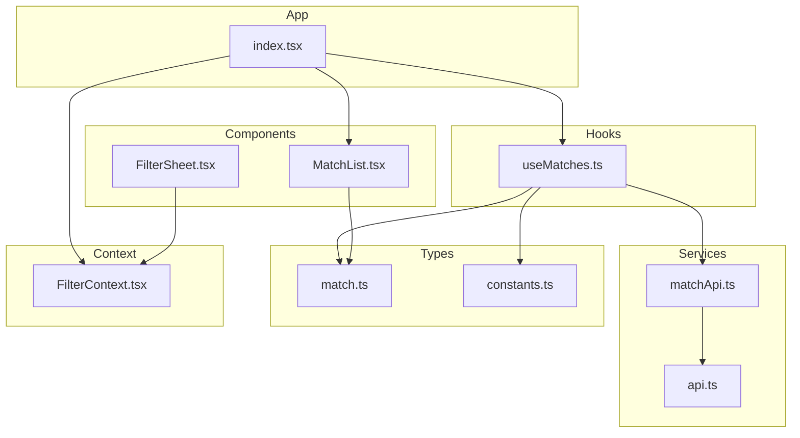
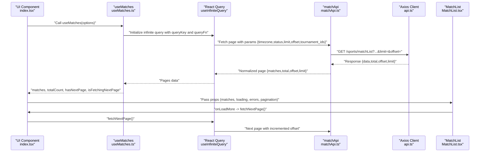
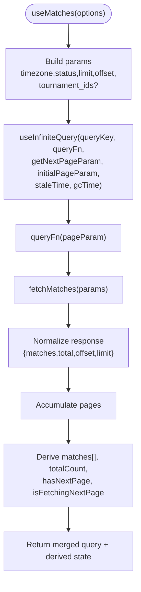
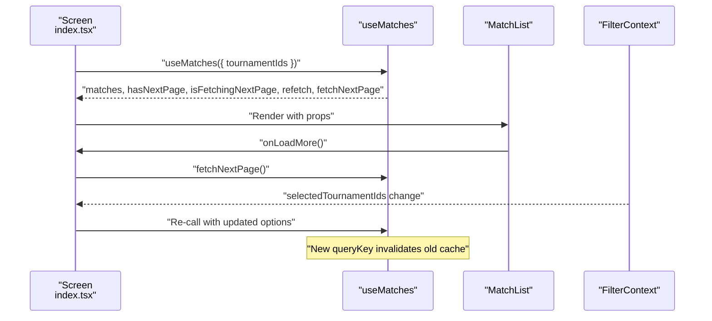
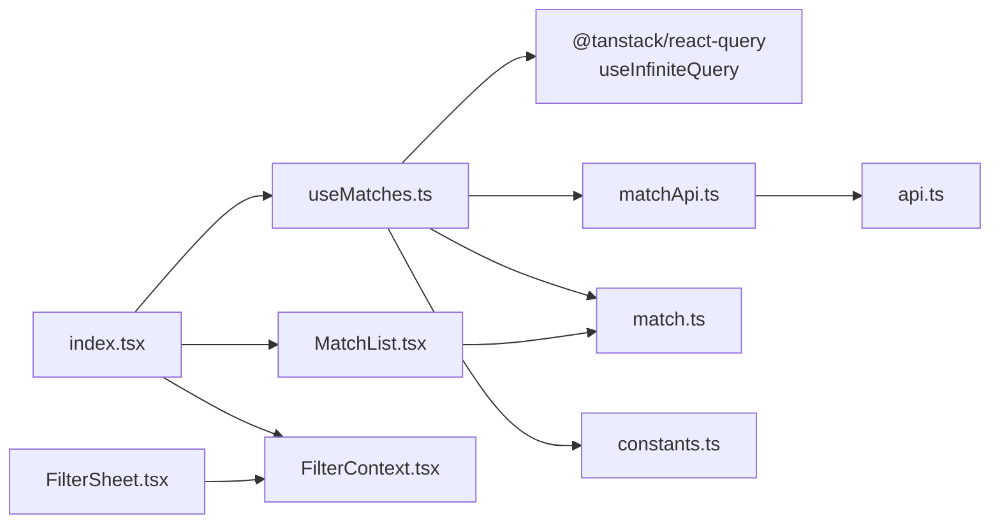

# Use Matches Hook

<cite>
**Referenced Files in This Document**
- [useMatches.ts](file://app/hooks/useMatches.ts)
- [matchApi.ts](file://app/services/matchApi.ts)
- [match.ts](file://app/types/match.ts)
- [constants.ts](file://app/utils/constants.ts)
- [api.ts](file://app/services/api.ts)
- [index.tsx](file://app/index.tsx)
- [MatchList.tsx](file://app/components/match/MatchList.tsx)
- [FilterContext.tsx](file://app/context/FilterContext.tsx)
- [FilterSheet.tsx](file://app/components/filter/FilterSheet.tsx)
</cite>

## Table of Contents
1. [Introduction](#introduction)
2. [Project Structure](#project-structure)
3. [Core Components](#core-components)
4. [Architecture Overview](#architecture-overview)
5. [Detailed Component Analysis](#detailed-component-analysis)
6. [Dependency Analysis](#dependency-analysis)
7. [Performance Considerations](#performance-considerations)
8. [Troubleshooting Guide](#troubleshooting-guide)
9. [Conclusion](#conclusion)

## Introduction
This document provides comprehensive documentation for the useMatches hook, which implements React Query’s infinite query pattern to fetch paginated match data. It explains the hook’s role in fetching paginated match data with automatic caching and pagination handling, details the query key structure and parameter handling, and describes the cursor-based pagination implementation. It also covers data transformation, error handling strategies, loading state management, examples of hook usage in components, cache invalidation patterns, integration with the match list UI, and performance optimizations such as query deduplication, background refetching, and memory management for large match datasets.

## Project Structure
The useMatches hook is part of a React Native application that organizes code by feature and layer:
- Hooks: Custom React Query hooks for data fetching
- Services: API clients and service functions
- Types: TypeScript interfaces for data models
- Components: UI components for rendering lists and cards
- Context: Global state for filters
- Utils: Constants and shared utilities

**Diagram sources**
- [useMatches.ts](file://app/hooks/useMatches.ts#L1-L56)
- [matchApi.ts](file://app/services/matchApi.ts#L1-L36)
- [api.ts](file://app/services/api.ts#L1-L40)
- [match.ts](file://app/types/match.ts#L1-L46)
- [constants.ts](file://app/utils/constants.ts#L1-L38)
- [index.tsx](file://app/index.tsx#L1-L108)
- [MatchList.tsx](file://app/components/match/MatchList.tsx#L1-L117)
- [FilterContext.tsx](file://app/context/FilterContext.tsx#L1-L72)
- [FilterSheet.tsx](file://app/components/filter/FilterSheet.tsx#L1-L128)

**Section sources**
- [useMatches.ts](file://app/hooks/useMatches.ts#L1-L56)
- [matchApi.ts](file://app/services/matchApi.ts#L1-L36)
- [match.ts](file://app/types/match.ts#L1-L46)
- [constants.ts](file://app/utils/constants.ts#L1-L38)
- [api.ts](file://app/services/api.ts#L1-L40)
- [index.tsx](file://app/index.tsx#L1-L108)
- [MatchList.tsx](file://app/components/match/MatchList.tsx#L1-L117)
- [FilterContext.tsx](file://app/context/FilterContext.tsx#L1-L72)
- [FilterSheet.tsx](file://app/components/filter/FilterSheet.tsx#L1-L128)

## Core Components
- useMatches: Implements infinite query pattern for match data, handles pagination, caching, and exposes derived state and helpers.
- matchApi: Translates typed parameters into URL query strings and performs HTTP requests.
- MatchList: Renders the match list with loading, empty, and error states, and triggers pagination.
- FilterContext and FilterSheet: Manage tournament filters that influence the query key and thus cache separation.

Key responsibilities:
- Infinite pagination with cursor-based offsets
- Automatic caching and staleness management
- Data transformation from pages to flat arrays
- Integration with UI components for loading and pagination

**Section sources**
- [useMatches.ts](file://app/hooks/useMatches.ts#L13-L55)
- [matchApi.ts](file://app/services/matchApi.ts#L4-L35)
- [MatchList.tsx](file://app/components/match/MatchList.tsx#L27-L113)
- [FilterContext.tsx](file://app/context/FilterContext.tsx#L20-L62)
- [FilterSheet.tsx](file://app/components/filter/FilterSheet.tsx#L16-L124)

## Architecture Overview
The useMatches hook orchestrates data fetching and caching using React Query’s infinite query. It builds a query key from timezone, status, and tournament filters, then fetches pages with offset-based pagination. The UI composes the hook’s state into a scrollable list with pull-to-refresh and infinite scrolling.

**Diagram sources**
- [index.tsx](file://app/index.tsx#L15-L43)
- [useMatches.ts](file://app/hooks/useMatches.ts#L21-L41)
- [matchApi.ts](file://app/services/matchApi.ts#L4-L35)
- [api.ts](file://app/services/api.ts#L4-L11)
- [MatchList.tsx](file://app/components/match/MatchList.tsx#L83-L87)

## Detailed Component Analysis

### useMatches Hook
Implements an infinite query for match data with:
- Query key: ['matches', { timezone, status, tournamentIds }]
- Parameter handling: timezone, status, limit, offset, optional tournament_ids
- Cursor-based pagination: getNextPageParam computes next offset until total is reached
- Derived state: flat matches array, total count, hasNextPage, isFetchingNextPage
- Caching: staleTime and gcTime configured for efficient memory usage

**Diagram sources**
- [useMatches.ts](file://app/hooks/useMatches.ts#L13-L55)
- [matchApi.ts](file://app/services/matchApi.ts#L4-L35)

**Section sources**
- [useMatches.ts](file://app/hooks/useMatches.ts#L13-L55)

### matchApi Service
Converts typed parameters into URL query strings and performs HTTP GET to the backend endpoint. Normalizes the response into a shape suitable for React Query’s infinite query.

Key behaviors:
- Builds URLSearchParams from timezone, status, todate, tournament_ids, limit, offset
- Calls apiClient.get('/sports/matchList?...')
- Normalizes response to include matches, total, offset, limit

**Section sources**
- [matchApi.ts](file://app/services/matchApi.ts#L4-L35)
- [api.ts](file://app/services/api.ts#L4-L11)

### Types and Data Model
Defines the shape of match data and query parameters.

- Match: includes identifiers, team info, tournament, status, and timing fields
- MatchListParams: typed parameters for the API call
- MatchListResponse: normalized response shape for pagination

**Section sources**
- [match.ts](file://app/types/match.ts#L16-L45)

### UI Integration and Pagination
The main screen integrates the hook with a FlatList:
- Pull-to-refresh triggers refetch
- Infinite scroll triggers fetchNextPage when near the end
- Loading, empty, and error states are handled by MatchList
- Filter changes update the query key, causing cache separation

**Diagram sources**
- [index.tsx](file://app/index.tsx#L15-L43)
- [MatchList.tsx](file://app/components/match/MatchList.tsx#L83-L87)
- [FilterContext.tsx](file://app/context/FilterContext.tsx#L20-L62)

**Section sources**
- [index.tsx](file://app/index.tsx#L15-L43)
- [MatchList.tsx](file://app/components/match/MatchList.tsx#L27-L113)
- [FilterContext.tsx](file://app/context/FilterContext.tsx#L20-L62)
- [FilterSheet.tsx](file://app/components/filter/FilterSheet.tsx#L16-L124)

## Dependency Analysis
The hook depends on:
- React Query for infinite query lifecycle and caching
- matchApi for network requests
- constants for defaults (timezone, page size)
- types for parameter and response shapes

**Diagram sources**
- [useMatches.ts](file://app/hooks/useMatches.ts#L1-L56)
- [matchApi.ts](file://app/services/matchApi.ts#L1-L36)
- [api.ts](file://app/services/api.ts#L1-L40)
- [match.ts](file://app/types/match.ts#L1-L46)
- [constants.ts](file://app/utils/constants.ts#L1-L38)
- [index.tsx](file://app/index.tsx#L1-L108)
- [MatchList.tsx](file://app/components/match/MatchList.tsx#L1-L117)
- [FilterContext.tsx](file://app/context/FilterContext.tsx#L1-L72)
- [FilterSheet.tsx](file://app/components/filter/FilterSheet.tsx#L1-L128)

**Section sources**
- [useMatches.ts](file://app/hooks/useMatches.ts#L1-L56)
- [matchApi.ts](file://app/services/matchApi.ts#L1-L36)
- [api.ts](file://app/services/api.ts#L1-L40)
- [match.ts](file://app/types/match.ts#L1-L46)
- [constants.ts](file://app/utils/constants.ts#L1-L38)
- [index.tsx](file://app/index.tsx#L1-L108)
- [MatchList.tsx](file://app/components/match/MatchList.tsx#L1-L117)
- [FilterContext.tsx](file://app/context/FilterContext.tsx#L1-L72)
- [FilterSheet.tsx](file://app/components/filter/FilterSheet.tsx#L1-L128)

## Performance Considerations
- Query deduplication: React Query automatically deduplicates identical queries by query key. Changing tournament filters updates the query key, ensuring separate caches per filter combination.
- Background refetching: React Query refetches stale data in the background when the screen becomes active or when focus returns, improving perceived performance.
- Memory management:
  - staleTime controls how long data remains fresh in memory before being considered stale.
  - gcTime controls how long inactive cache entries remain before garbage collection.
  - The hook flattens pages into a single matches array for rendering, while keeping pages cached for pagination.
- Rendering optimizations:
  - MatchList uses removeClippedSubviews, maxToRenderPerBatch, windowSize, and initialNumToRender to optimize FlatList rendering for large datasets.
  - Skeleton loaders improve perceived performance during initial load.

Recommendations:
- Adjust staleTime and gcTime based on data volatility and device memory constraints.
- Consider increasing pageSize for fewer network calls at the cost of larger payloads.
- Use enabled flags to prevent unnecessary queries when filters are empty.

**Section sources**
- [useMatches.ts](file://app/hooks/useMatches.ts#L39-L41)
- [MatchList.tsx](file://app/components/match/MatchList.tsx#L108-L112)
- [constants.ts](file://app/utils/constants.ts#L3-L4)

## Troubleshooting Guide
Common issues and resolutions:
- Network errors:
  - The API client intercepts errors and logs details including status and URL. Ensure the base URL and endpoint are correct.
  - Verify that the timezone and status parameters are valid according to the backend contract.
- Pagination not advancing:
  - Confirm that the backend returns total, offset, and limit in the response so getNextPageParam can compute the next offset.
  - Ensure tournamentIds are passed as a comma-separated string when present.
- Cache not updating after filter changes:
  - The query key includes tournamentIds, so changing filters should trigger a new cache. If not, verify that the hook receives updated options and that the UI re-renders with new props.
- UI not reflecting loading state:
  - Ensure isLoading and isFetchingNextPage are passed to MatchList and that onLoadMore and onRefresh handlers are wired to fetchNextPage and refetch respectively.

**Section sources**
- [api.ts](file://app/services/api.ts#L22-L37)
- [matchApi.ts](file://app/services/matchApi.ts#L25-L35)
- [useMatches.ts](file://app/hooks/useMatches.ts#L21-L41)
- [MatchList.tsx](file://app/components/match/MatchList.tsx#L89-L103)

## Conclusion
The useMatches hook provides a robust, efficient solution for infinite pagination of match data. By leveraging React Query’s infinite query, it offers automatic caching, background refetching, and seamless integration with UI components. The hook’s query key structure ensures cache separation for different filters, while the cursor-based pagination model simplifies data fetching. With thoughtful performance tuning and clear error handling, it scales effectively for large datasets and delivers a smooth user experience.