# Use Tournaments Hook

<cite>
**Referenced Files in This Document**
- [useTournaments.ts](file://app/hooks/useTournaments.ts)
- [tournamentApi.ts](file://app/services/tournamentApi.ts)
- [tournament.ts](file://app/types/tournament.ts)
- [FilterContext.tsx](file://app/context/FilterContext.tsx)
- [FilterSheet.tsx](file://app/components/filter/FilterSheet.tsx)
- [SportSection.tsx](file://app/components/filter/SportSection.tsx)
- [_layout.tsx](file://app/_layout.tsx)
- [index.tsx](file://app/index.tsx)
- [api.ts](file://app/services/api.ts)
- [constants.ts](file://app/utils/constants.ts)
- [ErrorState.tsx](file://app/components/common/ErrorState.tsx)
- [LoadingSpinner.tsx](file://app/components/common/LoadingSpinner.tsx)
</cite>

## Table of Contents
1. [Introduction](#introduction)
2. [Project Structure](#project-structure)
3. [Core Components](#core-components)
4. [Architecture Overview](#architecture-overview)
5. [Detailed Component Analysis](#detailed-component-analysis)
6. [Dependency Analysis](#dependency-analysis)
7. [Performance Considerations](#performance-considerations)
8. [Troubleshooting Guide](#troubleshooting-guide)
9. [Conclusion](#conclusion)

## Introduction
This document provides comprehensive documentation for the useTournaments hook, which manages tournament metadata fetching and caching in a React Native application. The hook integrates with React Query for data fetching, implements intelligent caching strategies, and provides seamless integration with the filtering system and tournament selection UI. It handles automatic refetching, error management, and data normalization patterns while maintaining optimal performance characteristics.

## Project Structure
The useTournaments hook is part of a modular architecture that separates concerns across several layers:

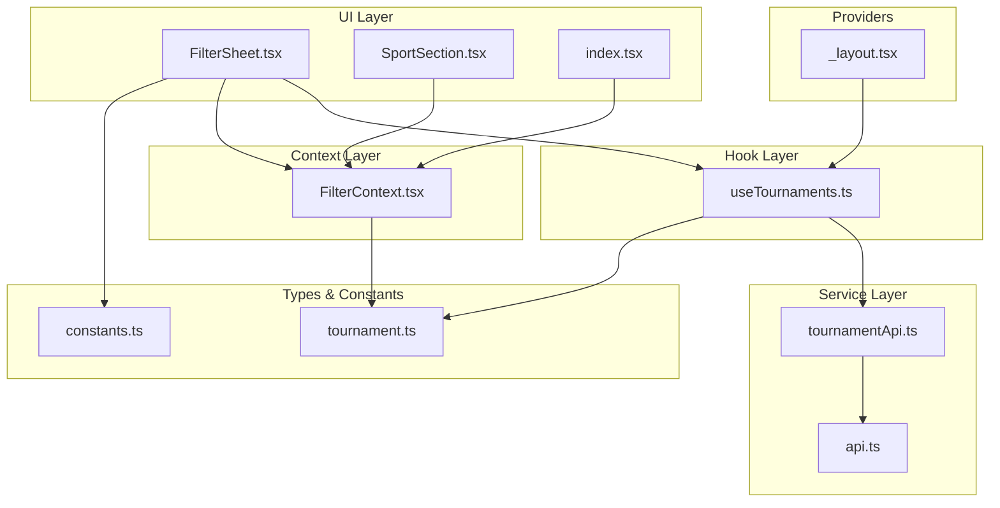

**Diagram sources**
- [useTournaments.ts](file://app/hooks/useTournaments.ts#L1-L45)
- [tournamentApi.ts](file://app/services/tournamentApi.ts#L1-L35)
- [FilterContext.tsx](file://app/context/FilterContext.tsx#L1-L72)
- [FilterSheet.tsx](file://app/components/filter/FilterSheet.tsx#L1-L128)

**Section sources**
- [useTournaments.ts](file://app/hooks/useTournaments.ts#L1-L45)
- [tournamentApi.ts](file://app/services/tournamentApi.ts#L1-L35)
- [FilterContext.tsx](file://app/context/FilterContext.tsx#L1-L72)

## Core Components
The useTournaments hook serves as the central data management component for tournament metadata. It provides:

### Hook Implementation Features
- **Automatic Data Fetching**: Uses React Query's useQuery for efficient data fetching
- **Intelligent Caching**: Implements stale-time and garbage collection policies
- **Search Functionality**: Supports dynamic search parameter updates
- **Pagination Control**: Manages limit and offset parameters for data pagination
- **Data Normalization**: Transforms nested tournament data into flat structures
- **Filter Integration**: Seamlessly integrates with the filtering system

### Key Data Structures
The hook operates on normalized tournament data structures:

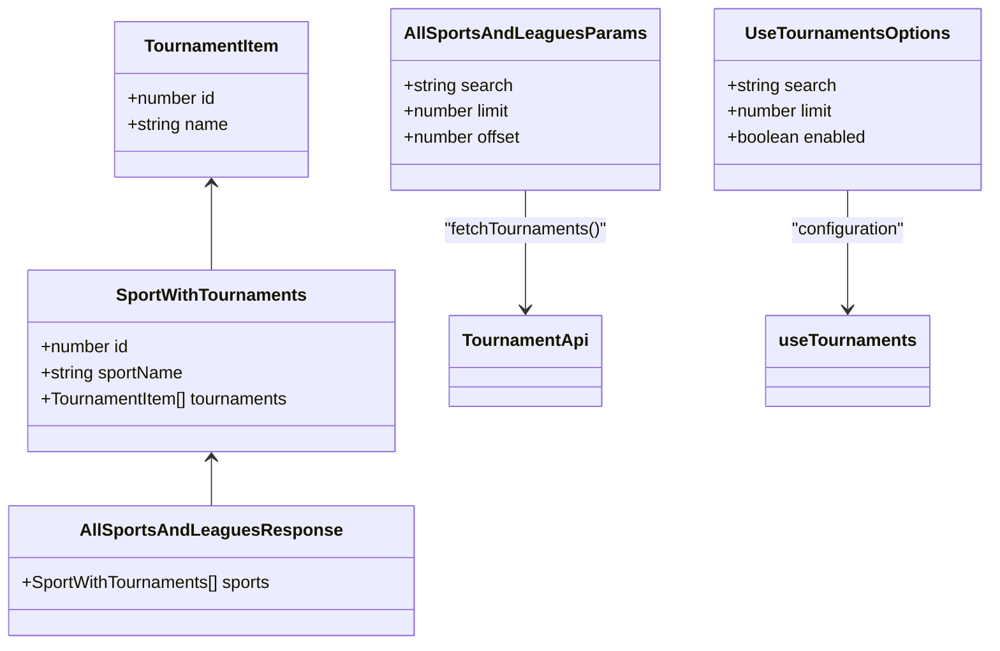

**Diagram sources**
- [tournament.ts](file://app/types/tournament.ts#L1-L31)
- [useTournaments.ts](file://app/hooks/useTournaments.ts#L5-L9)

**Section sources**
- [useTournaments.ts](file://app/hooks/useTournaments.ts#L1-L45)
- [tournament.ts](file://app/types/tournament.ts#L1-L31)

## Architecture Overview
The useTournaments hook follows a layered architecture pattern that ensures separation of concerns and maintainability:

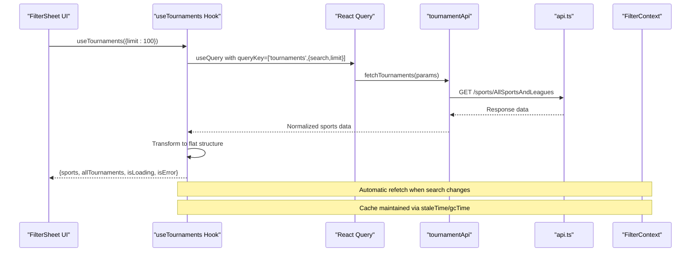

**Diagram sources**
- [FilterSheet.tsx](file://app/components/filter/FilterSheet.tsx#L17-L17)
- [useTournaments.ts](file://app/hooks/useTournaments.ts#L14-L28)
- [tournamentApi.ts](file://app/services/tournamentApi.ts#L4-L34)

The architecture implements several key patterns:

### Caching Strategy
- **Stale Time**: 10 minutes (1000 * 60 * 10 ms) for data freshness
- **Garbage Collection**: 30 minutes (1000 * 60 * 30 ms) for cache cleanup
- **Query Key Management**: Dynamic keys based on search and limit parameters
- **Automatic Refetch**: React Query automatically refetches when query keys change

### Error Handling
- **Network Error Propagation**: API errors are caught and rethrown with structured data
- **UI Error States**: Comprehensive error handling in FilterSheet component
- **Retry Mechanism**: Built-in retry support through React Query

**Section sources**
- [useTournaments.ts](file://app/hooks/useTournaments.ts#L25-L28)
- [tournamentApi.ts](file://app/services/tournamentApi.ts#L4-L34)
- [FilterSheet.tsx](file://app/components/filter/FilterSheet.tsx#L78-L91)

## Detailed Component Analysis

### useTournaments Hook Implementation
The hook provides a comprehensive solution for tournament data management:

#### Query Configuration
The hook configures React Query with specific parameters for optimal performance:

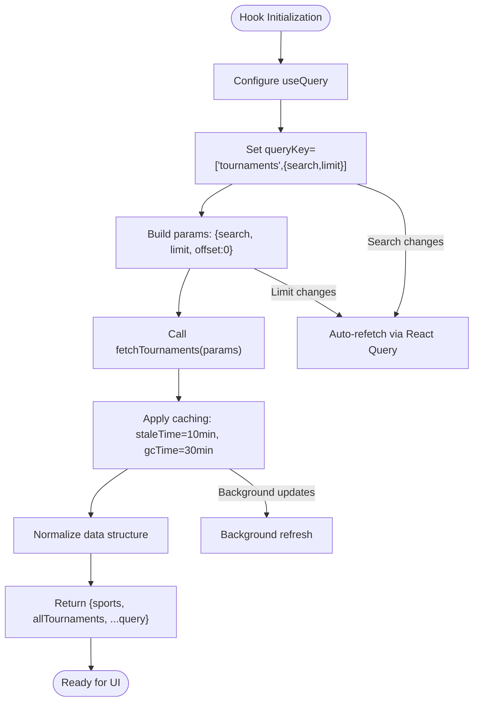

**Diagram sources**
- [useTournaments.ts](file://app/hooks/useTournaments.ts#L14-L28)

#### Data Normalization Pattern
The hook implements an efficient normalization strategy:

```mermaid
graph LR
subgraph "Raw Data"
A[SportWithTournaments[]]
A --> B{id, sportName, tournaments[]}
B --> C{TournamentItem[]}
C --> D{id, name}
end
subgraph "Normalized Output"
E[sports: SportWithTournaments[]]
F[allTournaments: TournamentItem[]]
end
A --> E
A --> F
subgraph "Enhanced Fields"
G[sportId: number]
H[sportName: string]
end
F --> G
F --> H
```

**Diagram sources**
- [useTournaments.ts](file://app/hooks/useTournaments.ts#L31-L37)

#### Integration with Filter System
The hook seamlessly integrates with the filtering context:

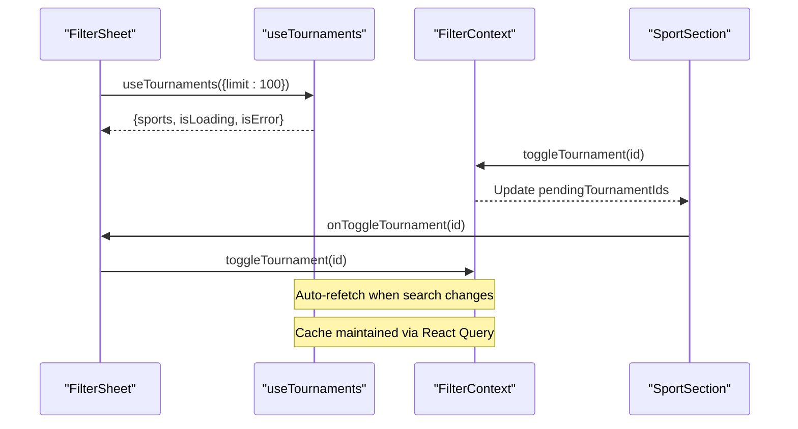

**Diagram sources**
- [FilterSheet.tsx](file://app/components/filter/FilterSheet.tsx#L17-L24)
- [FilterContext.tsx](file://app/context/FilterContext.tsx#L26-L43)

**Section sources**
- [useTournaments.ts](file://app/hooks/useTournaments.ts#L1-L45)
- [FilterSheet.tsx](file://app/components/filter/FilterSheet.tsx#L1-L128)
- [FilterContext.tsx](file://app/context/FilterContext.tsx#L1-L72)

### API Service Layer
The tournament API service provides robust data fetching capabilities:

#### Request Construction
The service builds dynamic query parameters based on provided options:

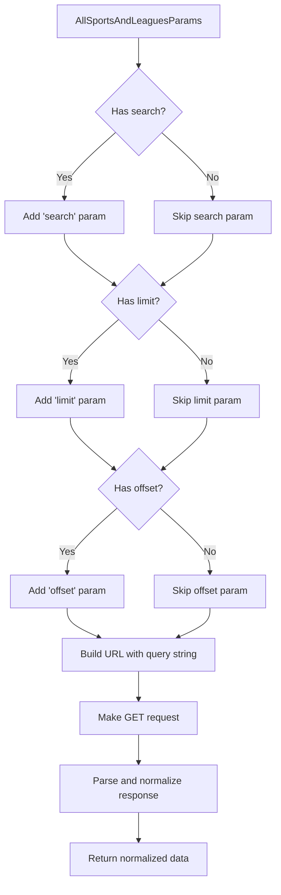

**Diagram sources**
- [tournamentApi.ts](file://app/services/tournamentApi.ts#L5-L18)

#### Response Normalization
The API service transforms raw API responses into structured data:

```mermaid
graph TD
RawAPI["Raw API Response"] --> ExtractData["Extract data array"]
ExtractData --> MapSports["Map sports with tournaments"]
MapSports --> CleanFields["Clean field names (id, name)"]
CleanFields --> BuildStructure["Build SportWithTournaments structure"]
BuildStructure --> Return["Return normalized response"]
subgraph "Field Mapping"
A[id -> id]
B[sportName -> sportName]
C[tournaments -> tournaments[]]
D[name -> name]
end
MapSports --> A
MapSports --> B
MapSports --> C
C --> D
```

**Diagram sources**
- [tournamentApi.ts](file://app/services/tournamentApi.ts#L24-L33)

**Section sources**
- [tournamentApi.ts](file://app/services/tournamentApi.ts#L1-L35)

### UI Integration Components
The hook integrates with several UI components for a cohesive user experience:

#### Filter Sheet Integration
The FilterSheet component demonstrates comprehensive hook usage:

```mermaid
classDiagram
class FilterSheet {
+React.FC<FilterSheetProps>
+useTournaments({limit : 100})
+useFilter()
+renderSportSection()
+handleApply()
+handleClear()
+handleToggleTournament()
}
class useTournaments {
+UseTournamentsOptions
+sports : SportWithTournaments[]
+allTournaments : TournamentItem[]
+isLoading : boolean
+isError : boolean
+refetch() : void
}
class FilterContext {
+selectedTournamentIds : number[]
+pendingTournamentIds : number[]
+toggleTournament(id : number) : void
+selectTournaments(ids : number[]) : void
+applyFilters() : void
+clearFilters() : void
}
FilterSheet --> useTournaments : "uses"
FilterSheet --> FilterContext : "uses"
useTournaments --> FilterContext : "integrates with"
```

**Diagram sources**
- [FilterSheet.tsx](file://app/components/filter/FilterSheet.tsx#L16-L24)
- [useTournaments.ts](file://app/hooks/useTournaments.ts#L11-L44)
- [FilterContext.tsx](file://app/context/FilterContext.tsx#L1-L72)

#### Sport Section Component
The SportSection component handles individual tournament selection:

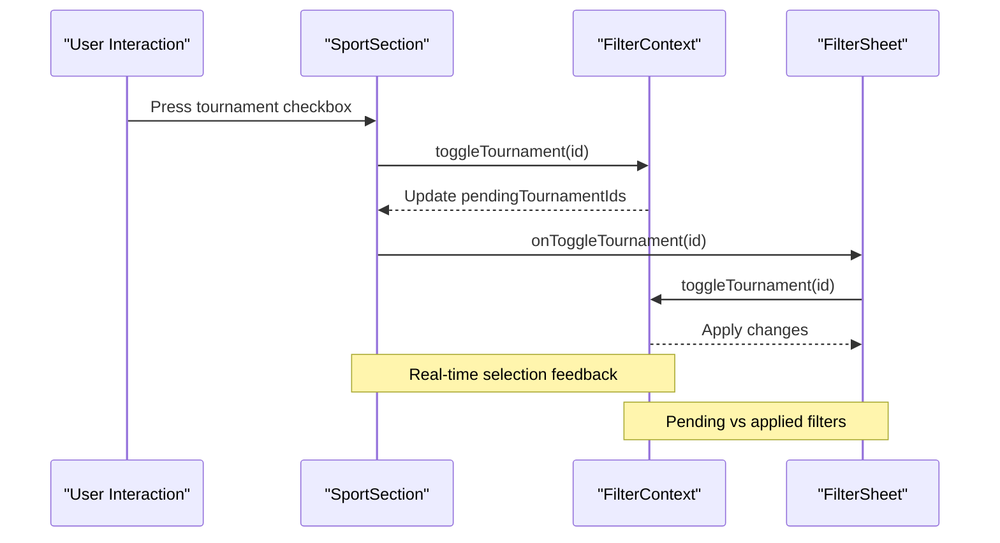

**Diagram sources**
- [SportSection.tsx](file://app/components/filter/SportSection.tsx#L47-L49)
- [FilterContext.tsx](file://app/context/FilterContext.tsx#L26-L43)

**Section sources**
- [FilterSheet.tsx](file://app/components/filter/FilterSheet.tsx#L1-L128)
- [SportSection.tsx](file://app/components/filter/SportSection.tsx#L1-L82)

## Dependency Analysis
The useTournaments hook has well-defined dependencies that ensure modularity and maintainability:

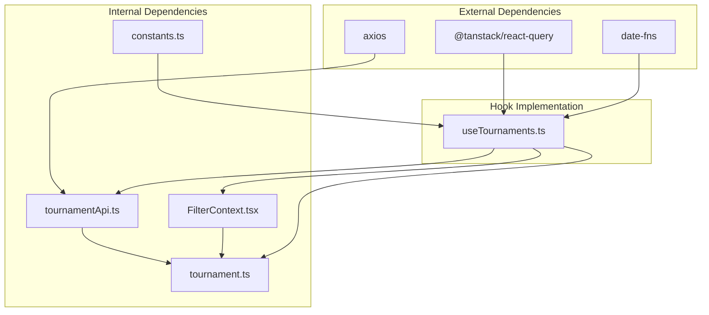

**Diagram sources**
- [useTournaments.ts](file://app/hooks/useTournaments.ts#L1-L3)
- [tournamentApi.ts](file://app/services/tournamentApi.ts#L1-L2)
- [FilterContext.tsx](file://app/context/FilterContext.tsx#L1-L1)

### Coupling and Cohesion Analysis
- **Low Coupling**: The hook depends only on the tournament API service and React Query
- **High Cohesion**: All tournament-related functionality is encapsulated within the hook
- **Interface Contracts**: Clear type definitions ensure type safety across boundaries
- **Separation of Concerns**: Data fetching, normalization, and UI integration are separate concerns

**Section sources**
- [useTournaments.ts](file://app/hooks/useTournaments.ts#L1-L45)
- [tournamentApi.ts](file://app/services/tournamentApi.ts#L1-L35)
- [FilterContext.tsx](file://app/context/FilterContext.tsx#L1-L72)

## Performance Considerations

### Query Optimization Strategies
The hook implements several performance optimization techniques:

#### Caching Strategy
- **Stale Time**: 10-minute stale period balances freshness with performance
- **Garbage Collection**: 30-minute GC time prevents memory leaks
- **Automatic Refetch**: React Query's intelligent refetching minimizes redundant requests
- **Query Key Management**: Dynamic keys ensure cache invalidation when parameters change

#### Background Updates
The hook supports background data updates through React Query's built-in mechanisms:

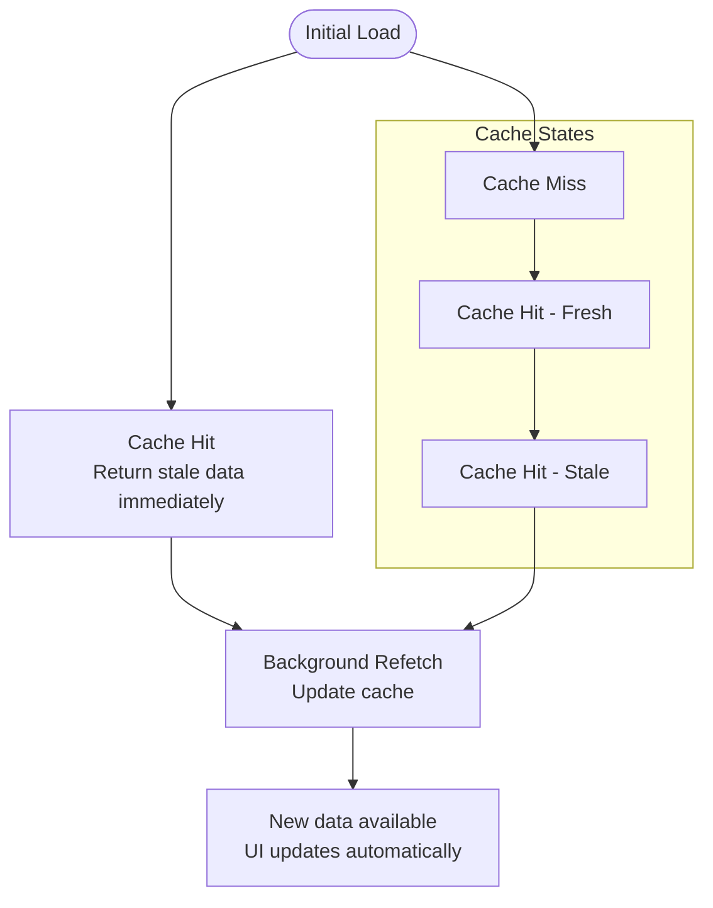

#### Memory Management
- **Limited Data Size**: Default limit of 50 tournaments prevents excessive memory usage
- **Selective Field Extraction**: Only essential fields are stored in normalized structures
- **Automatic Cleanup**: React Query handles cache cleanup based on GC time settings

### Cache Warming and Preloading
The application implements cache warming strategies:

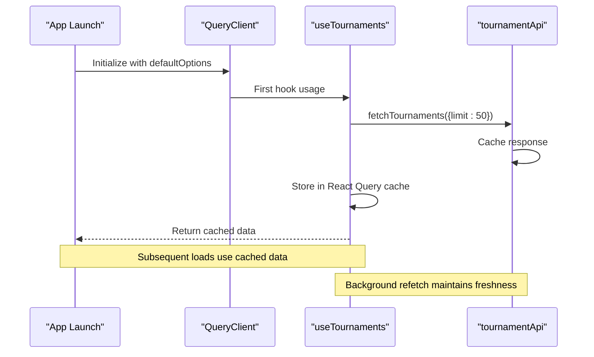

**Section sources**
- [useTournaments.ts](file://app/hooks/useTournaments.ts#L25-L28)
- [_layout.tsx](file://app/_layout.tsx#L10-L17)

## Troubleshooting Guide

### Common Issues and Solutions

#### Network Connectivity Problems
The system provides comprehensive error handling:

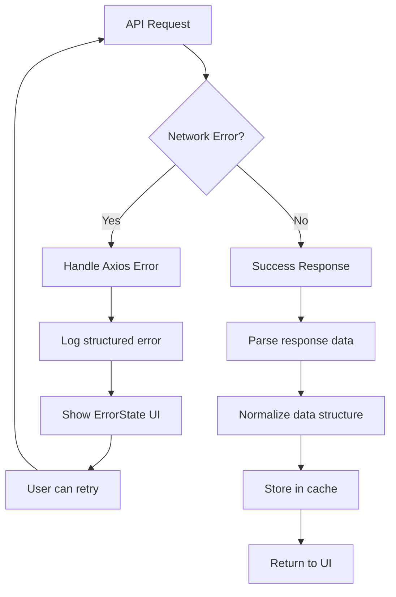

**Diagram sources**
- [tournamentApi.ts](file://app/services/tournamentApi.ts#L22-L36)
- [ErrorState.tsx](file://app/components/common/ErrorState.tsx#L12-L45)

#### Loading State Management
The hook provides granular loading state information:

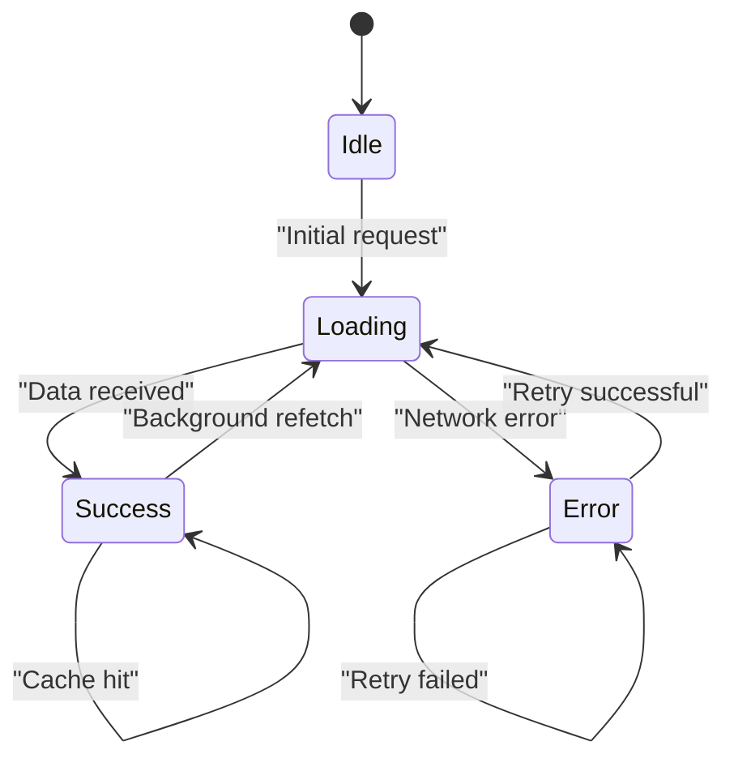

#### Performance Monitoring
Key metrics to monitor:
- **Query Cache Hits**: Measure cache effectiveness
- **Network Latency**: Track API response times
- **Memory Usage**: Monitor cache size growth
- **UI Responsiveness**: Track rendering performance

**Section sources**
- [tournamentApi.ts](file://app/services/tournamentApi.ts#L22-L36)
- [ErrorState.tsx](file://app/components/common/ErrorState.tsx#L1-L49)
- [LoadingSpinner.tsx](file://app/components/common/LoadingSpinner.tsx#L1-L22)

## Conclusion
The useTournaments hook provides a robust, performant solution for managing tournament metadata in the application. Its implementation demonstrates best practices in React Query usage, data normalization, and UI integration. The hook's caching strategy ensures optimal performance while maintaining data freshness, and its integration with the filtering system creates a seamless user experience.

Key strengths of the implementation include:
- **Efficient Caching**: Intelligent stale-time and garbage collection policies
- **Automatic Refetching**: Seamless updates when search parameters change
- **Comprehensive Error Handling**: Structured error propagation and user-friendly error states
- **Type Safety**: Strongly typed interfaces ensure reliability
- **Modular Design**: Clear separation of concerns enables maintainability

The hook serves as an excellent example of modern React Native data management patterns and provides a solid foundation for extending tournament-related functionality in the application.