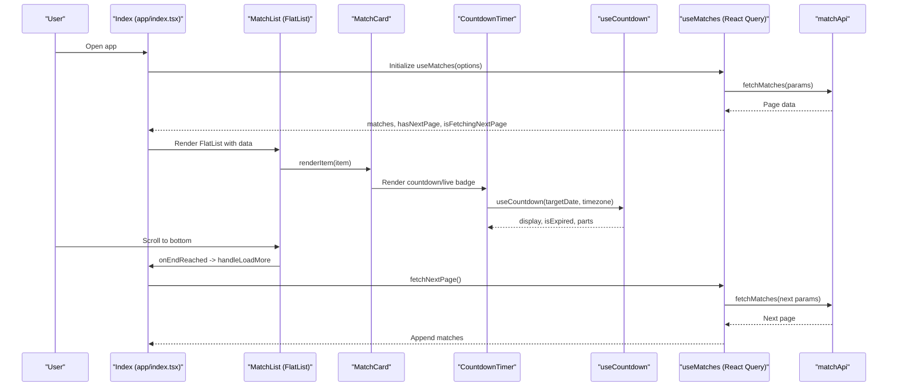
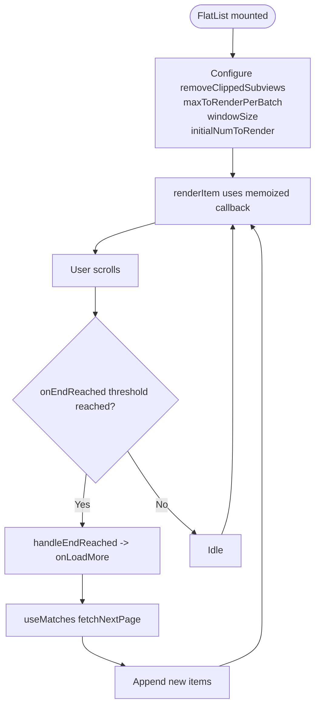
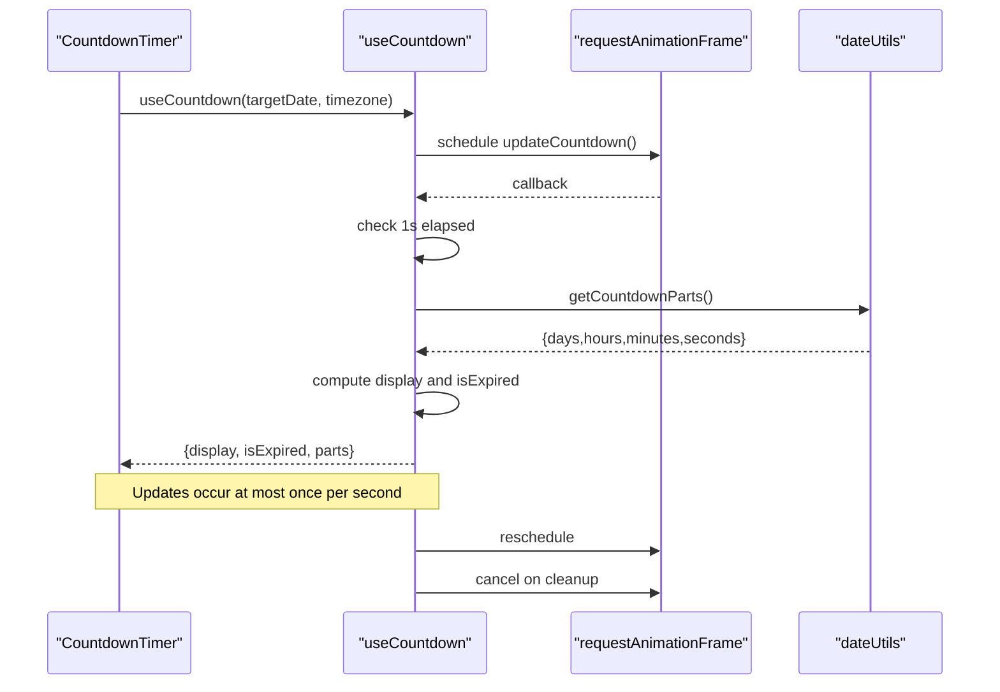
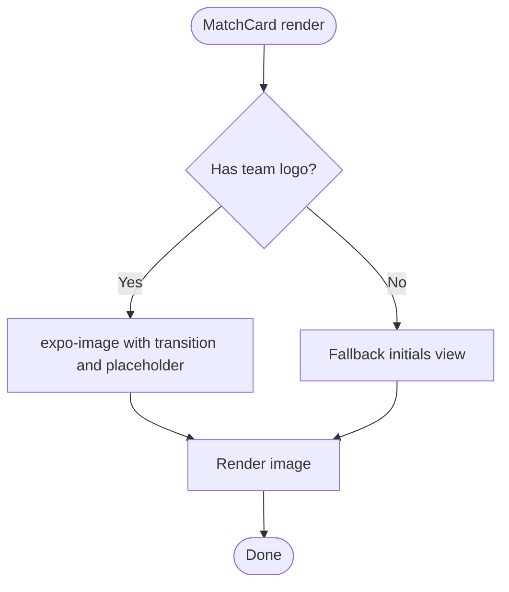
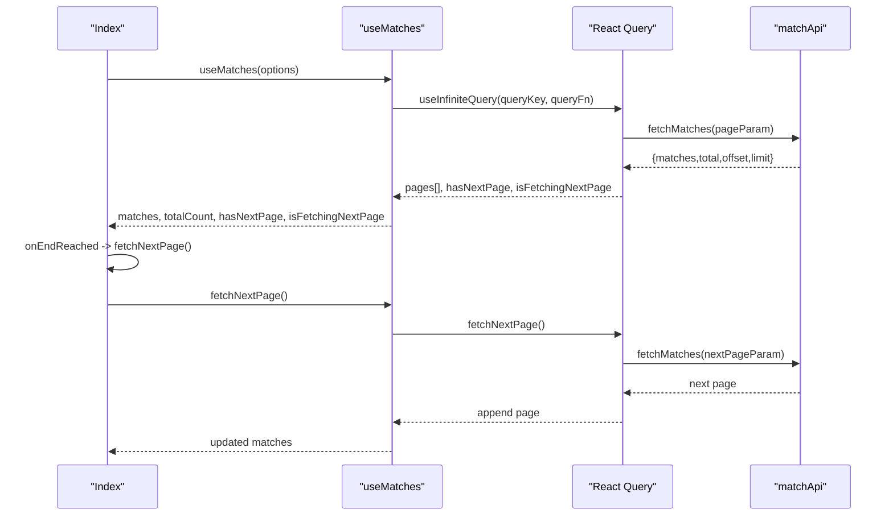
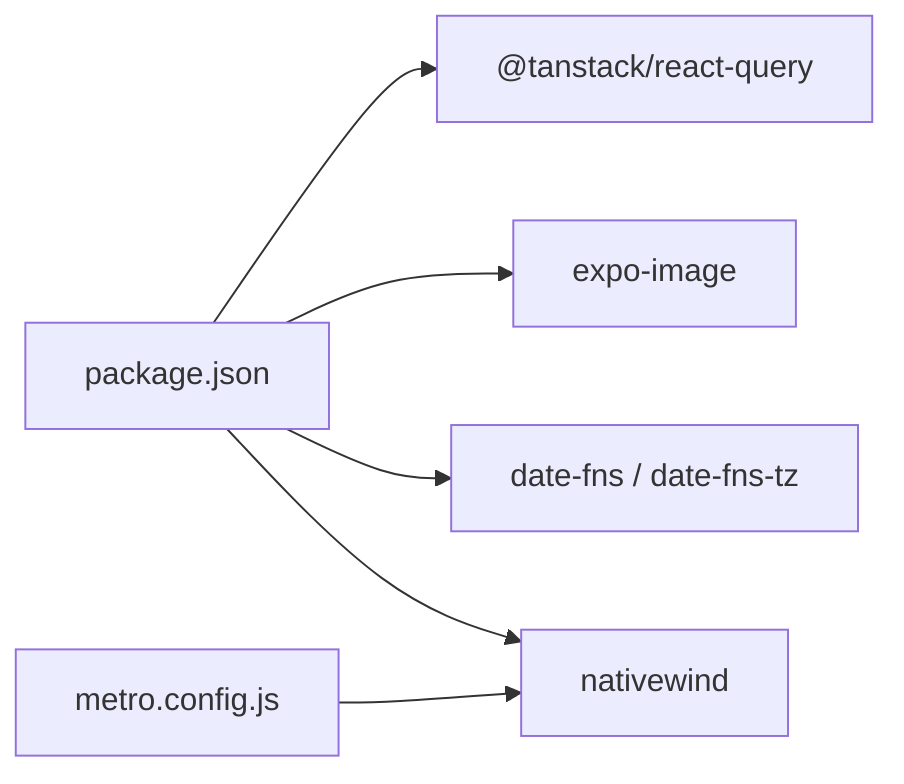

# Performance Optimization

<cite>
**Referenced Files in This Document**
- [app/components/match/MatchList.tsx](file://app/components/match/MatchList.tsx)
- [app/components/match/MatchCard.tsx](file://app/components/match/MatchCard.tsx)
- [app/components/match/CountdownTimer.tsx](file://app/components/match/CountdownTimer.tsx)
- [app/hooks/useCountdown.ts](file://app/hooks/useCountdown.ts)
- [app/hooks/useMatches.ts](file://app/hooks/useMatches.ts)
- [app/utils/dateUtils.ts](file://app/utils/dateUtils.ts)
- [app/utils/formatters.ts](file://app/utils/formatters.ts)
- [app/utils/constants.ts](file://app/utils/constants.ts)
- [app/components/match/MatchSkeleton.tsx](file://app/components/match/MatchSkeleton.tsx)
- [app/services/matchApi.ts](file://app/services/matchApi.ts)
- [app/types/match.ts](file://app/types/match.ts)
- [app/_layout.tsx](file://app/_layout.tsx)
- [app/index.tsx](file://app/index.tsx)
- [package.json](file://package.json)
- [metro.config.js](file://metro.config.js)
</cite>

## Table of Contents
1. [Introduction](#introduction)
2. [Project Structure](#project-structure)
3. [Core Components](#core-components)
4. [Architecture Overview](#architecture-overview)
5. [Detailed Component Analysis](#detailed-component-analysis)
6. [Dependency Analysis](#dependency-analysis)
7. [Performance Considerations](#performance-considerations)
8. [Troubleshooting Guide](#troubleshooting-guide)
9. [Conclusion](#conclusion)
10. [Appendices](#appendices)

## Introduction
This document provides a comprehensive performance optimization guide for the React Native sports match application. It focuses on FlatList virtualization and rendering optimization, memoization patterns, efficient countdown timers, image loading and caching, skeleton loading for perceived performance, infinite scrolling with React Query, and practical monitoring and benchmarking strategies. The goal is to deliver smooth, responsive experiences across a wide range of devices while maintaining clean, maintainable code.

## Project Structure
The application follows a feature-based structure with clear separation of concerns:
- UI components under app/components/match for match list, cards, timers, and skeletons
- Hooks under app/hooks for reusable logic (countdown, matches)
- Utilities under app/utils for formatting, constants, and date/time helpers
- Services under app/services for API interactions
- Types under app/types for TypeScript contracts
- Application bootstrap under app/_layout.tsx and app/index.tsx
- Build and bundling configuration under metro.config.js and package.json

```mermaid
graph TB
subgraph "UI Layer"
Index["Index (app/index.tsx)"]
MatchList["MatchList (app/components/match/MatchList.tsx)"]
MatchCard["MatchCard (app/components/match/MatchCard.tsx)"]
Countdown["CountdownTimer (app/components/match/CountdownTimer.tsx)"]
Skeleton["MatchSkeleton (app/components/match/MatchSkeleton.tsx)"]
end
subgraph "Logic Layer"
UseMatches["useMatches (app/hooks/useMatches.ts)"]
UseCountdown["useCountdown (app/hooks/useCountdown.ts)"]
DateUtils["dateUtils (app/utils/dateUtils.ts)"]
Formatters["formatters (app/utils/formatters.ts)"]
Constants["constants (app/utils/constants.ts)"]
end
subgraph "Services"
MatchApi["matchApi (app/services/matchApi.ts)"]
end
subgraph "Types"
Types["match.ts (app/types/match.ts)"]
end
subgraph "App Shell"
Layout["_layout.tsx"]
Metro["metro.config.js"]
Package["package.json"]
end
Index --> MatchList
MatchList --> MatchCard
MatchCard --> Countdown
MatchList --> Skeleton
Index --> UseMatches
UseMatches --> MatchApi
MatchCard --> Formatters
MatchCard --> Constants
Countdown --> UseCountdown
UseCountdown --> DateUtils
MatchApi --> Types
Layout --> Package
Layout --> Metro
```

**Diagram sources**
- [app/index.tsx](file://app/index.tsx#L1-L108)
- [app/components/match/MatchList.tsx](file://app/components/match/MatchList.tsx#L1-L117)
- [app/components/match/MatchCard.tsx](file://app/components/match/MatchCard.tsx#L1-L142)
- [app/components/match/CountdownTimer.tsx](file://app/components/match/CountdownTimer.tsx#L1-L43)
- [app/components/match/MatchSkeleton.tsx](file://app/components/match/MatchSkeleton.tsx#L1-L56)
- [app/hooks/useMatches.ts](file://app/hooks/useMatches.ts#L1-L56)
- [app/hooks/useCountdown.ts](file://app/hooks/useCountdown.ts#L1-L54)
- [app/utils/dateUtils.ts](file://app/utils/dateUtils.ts#L1-L64)
- [app/utils/formatters.ts](file://app/utils/formatters.ts#L1-L47)
- [app/utils/constants.ts](file://app/utils/constants.ts#L1-L38)
- [app/services/matchApi.ts](file://app/services/matchApi.ts#L1-L36)
- [app/types/match.ts](file://app/types/match.ts#L1-L46)
- [app/_layout.tsx](file://app/_layout.tsx#L1-L35)
- [metro.config.js](file://metro.config.js#L1-L7)
- [package.json](file://package.json#L1-L59)

**Section sources**
- [app/index.tsx](file://app/index.tsx#L1-L108)
- [app/_layout.tsx](file://app/_layout.tsx#L1-L35)
- [metro.config.js](file://metro.config.js#L1-L7)
- [package.json](file://package.json#L1-L59)

## Core Components
This section highlights the core performance-critical components and their optimization strategies.

- FlatList and Virtualization
  - FlatList is configured with removeClippedSubviews, maxToRenderPerBatch, windowSize, and initialNumToRender to minimize overdraw and improve scroll performance.
  - keyExtractor and renderItem are memoized via useCallback to prevent unnecessary re-renders of MatchCard.
  - onEndReached and ListEmptyComponent/ListFooterComponent manage pagination and loading states efficiently.

- Memoization Patterns
  - MatchCard and child components (CountdownTimer, MatchSkeleton) use React.memo to avoid re-rendering when props are shallow-equal.
  - displayName is set on memo-wrapped components to aid debugging.

- Countdown Timer
  - useCountdown leverages requestAnimationFrame to schedule updates at ~60fps, updating only once per second to balance smoothness and CPU usage.
  - Cleanup via cancelAnimationFrame prevents leaks.

- Image Loading and Caching
  - expo-image is used for optimized image rendering with transition and placeholder support.
  - Lazy loading is implicit through FlatList virtualization; images load as they come on-screen.

- Skeleton Loading
  - MatchSkeletonList provides lightweight placeholders during initial load, improving perceived performance.

- Infinite Scrolling and Caching
  - useMatches integrates @tanstack/react-query with infinite queries, staleTime, and gcTime to cache data efficiently and reduce network requests.

**Section sources**
- [app/components/match/MatchList.tsx](file://app/components/match/MatchList.tsx#L1-L117)
- [app/components/match/MatchCard.tsx](file://app/components/match/MatchCard.tsx#L1-L142)
- [app/components/match/CountdownTimer.tsx](file://app/components/match/CountdownTimer.tsx#L1-L43)
- [app/hooks/useCountdown.ts](file://app/hooks/useCountdown.ts#L1-L54)
- [app/components/match/MatchSkeleton.tsx](file://app/components/match/MatchSkeleton.tsx#L1-L56)
- [app/hooks/useMatches.ts](file://app/hooks/useMatches.ts#L1-L56)

## Architecture Overview
The application architecture emphasizes separation of concerns and performance:
- UI components are thin and rely on memoization and virtualization.
- Hooks encapsulate data fetching and timers.
- Services abstract API interactions.
- Utilities centralize formatting and constants.
- The app shell configures React Query defaults and build pipeline.



**Diagram sources**
- [app/index.tsx](file://app/index.tsx#L1-L108)
- [app/components/match/MatchList.tsx](file://app/components/match/MatchList.tsx#L1-L117)
- [app/components/match/MatchCard.tsx](file://app/components/match/MatchCard.tsx#L1-L142)
- [app/components/match/CountdownTimer.tsx](file://app/components/match/CountdownTimer.tsx#L1-L43)
- [app/hooks/useCountdown.ts](file://app/hooks/useCountdown.ts#L1-L54)
- [app/hooks/useMatches.ts](file://app/hooks/useMatches.ts#L1-L56)
- [app/services/matchApi.ts](file://app/services/matchApi.ts#L1-L36)

## Detailed Component Analysis

### FlatList Optimization (MatchList)
Key optimizations implemented:
- removeClippedSubviews: Reduces overdraw by clipping offscreen views.
- maxToRenderPerBatch: Limits batch size to control work per frame.
- windowSize: Controls the visible window around the viewport for pre-rendering.
- initialNumToRender: Starts with a small initial render to improve perceived performance.
- keyExtractor and renderItem: Memoized via useCallback to avoid recreating functions on each render.
- onEndReached threshold: Triggers load more at 50% from the end.
- ListEmptyComponent and ListFooterComponent: Efficiently show skeleton/loading/error states without extra renders.



**Diagram sources**
- [app/components/match/MatchList.tsx](file://app/components/match/MatchList.tsx#L83-L112)
- [app/hooks/useMatches.ts](file://app/hooks/useMatches.ts#L34-L41)

**Section sources**
- [app/components/match/MatchList.tsx](file://app/components/match/MatchList.tsx#L89-L112)
- [app/hooks/useMatches.ts](file://app/hooks/useMatches.ts#L13-L55)

### Memoization Patterns (MatchCard, CountdownTimer, MatchSkeleton)
- MatchCard: Wrapped with React.memo and displayName set to improve DevTools debugging and prevent re-renders when props are unchanged.
- CountdownTimer: Memoized to avoid re-rendering when targetDate, timezone, and matchStatus remain constant.
- MatchSkeleton: Memoized to reduce overhead during skeleton list rendering.

```mermaid
classDiagram
class MatchCard {
+props : MatchCardProps
+memo()
+displayName : "MatchCard"
}
class CountdownTimer {
+props : CountdownTimerProps
+memo()
+displayName : "CountdownTimer"
}
class MatchSkeleton {
+memo()
+displayName : "MatchSkeleton"
}
class MatchSkeletonList {
+props : { count? : number }
+memo()
+displayName : "MatchSkeletonList"
}
MatchCard --> CountdownTimer : "renders"
MatchSkeletonList --> MatchSkeleton : "maps"
```

**Diagram sources**
- [app/components/match/MatchCard.tsx](file://app/components/match/MatchCard.tsx#L15-L139)
- [app/components/match/CountdownTimer.tsx](file://app/components/match/CountdownTimer.tsx#L13-L40)
- [app/components/match/MatchSkeleton.tsx](file://app/components/match/MatchSkeleton.tsx#L4-L55)

**Section sources**
- [app/components/match/MatchCard.tsx](file://app/components/match/MatchCard.tsx#L15-L139)
- [app/components/match/CountdownTimer.tsx](file://app/components/match/CountdownTimer.tsx#L13-L40)
- [app/components/match/MatchSkeleton.tsx](file://app/components/match/MatchSkeleton.tsx#L4-L55)

### Countdown Timer Optimization (useCountdown)
- Uses requestAnimationFrame to schedule updates at ~60fps.
- Throttles actual state updates to once per second to minimize re-renders.
- Cancels animation frames on unmount to prevent leaks.
- Delegates formatting to dateUtils for consistency.



**Diagram sources**
- [app/hooks/useCountdown.ts](file://app/hooks/useCountdown.ts#L17-L50)
- [app/utils/dateUtils.ts](file://app/utils/dateUtils.ts#L22-L51)
- [app/components/match/CountdownTimer.tsx](file://app/components/match/CountdownTimer.tsx#L13-L38)

**Section sources**
- [app/hooks/useCountdown.ts](file://app/hooks/useCountdown.ts#L1-L54)
- [app/utils/dateUtils.ts](file://app/utils/dateUtils.ts#L1-L64)
- [app/components/match/CountdownTimer.tsx](file://app/components/match/CountdownTimer.tsx#L1-L43)

### Image Loading Optimizations (MatchCard)
- Uses expo-image for optimized rendering with transition and placeholder.
- Lazy loading is handled by FlatList virtualization; images load as they enter the viewport.
- Fallback initials are shown when logos are missing, reducing layout thrash.



**Diagram sources**
- [app/components/match/MatchCard.tsx](file://app/components/match/MatchCard.tsx#L20-L122)

**Section sources**
- [app/components/match/MatchCard.tsx](file://app/components/match/MatchCard.tsx#L1-L142)

### Infinite Scrolling and Caching (useMatches)
- Integrates @tanstack/react-query with infinite queries.
- Configures staleTime and gcTime to balance freshness and memory usage.
- Exposes hasNextPage and isFetchingNextPage to coordinate pagination with FlatList.



**Diagram sources**
- [app/hooks/useMatches.ts](file://app/hooks/useMatches.ts#L21-L41)
- [app/services/matchApi.ts](file://app/services/matchApi.ts#L4-L35)
- [app/index.tsx](file://app/index.tsx#L35-L39)

**Section sources**
- [app/hooks/useMatches.ts](file://app/hooks/useMatches.ts#L1-L56)
- [app/services/matchApi.ts](file://app/services/matchApi.ts#L1-L36)
- [app/types/match.ts](file://app/types/match.ts#L31-L45)

## Dependency Analysis
External libraries and their roles:
- @tanstack/react-query: Provides caching, pagination, and stale data management.
- expo-image: Optimizes image rendering, transitions, and placeholders.
- date-fns and date-fns-tz: Efficient date parsing and timezone formatting.
- nativewind/metro: Tailwind CSS integration for styling with Metro.



**Diagram sources**
- [package.json](file://package.json#L13-L49)
- [metro.config.js](file://metro.config.js#L1-L7)

**Section sources**
- [package.json](file://package.json#L1-L59)
- [metro.config.js](file://metro.config.js#L1-L7)

## Performance Considerations
- FlatList virtualization
  - Keep renderItem pure and memoized.
  - Use removeClippedSubviews, adjust maxToRenderPerBatch and windowSize based on device class.
  - Prefer deterministic keyExtractor to avoid unnecessary remounts.

- Memoization
  - Wrap leaf components with React.memo and set displayName.
  - Ensure props passed to memoized components are stable (use callbacks and useMemo where appropriate).

- Timers and animations
  - Use requestAnimationFrame for smooth updates; throttle state updates to once per second.
  - Cancel animation frames on unmount.

- Images
  - Use expo-image with transition and placeholder for smoother loads.
  - Avoid overly large images; leverage platform-specific assets.

- Skeleton loading
  - Use lightweight skeleton components during initial load to improve perceived performance.

- Infinite scrolling and caching
  - Tune staleTime and gcTime to balance freshness and memory usage.
  - Paginate aggressively to keep the list manageable.

- Bundle size and runtime
  - Prefer tree-shaking-friendly libraries.
  - Use Metro’s built-in optimizations and avoid importing heavy modules conditionally.

[No sources needed since this section provides general guidance]

## Troubleshooting Guide
Common performance bottlenecks and remedies:
- Jank during scroll
  - Verify removeClippedSubviews is enabled and windowSize/maxToRenderPerBatch are tuned.
  - Ensure renderItem does not allocate closures inside render; use useCallback.

- Excessive re-renders
  - Confirm memoization is applied to MatchCard and child components.
  - Check that props passed down are stable; avoid inline object/array creation in render.

- High CPU usage in timers
  - Ensure requestAnimationFrame is used and updates are throttled to once per second.
  - Cancel RAF on unmount.

- Memory growth with long lists
  - Adjust React Query staleTime and gcTime; consider smaller page sizes.
  - Use skeleton loading to reduce layout thrash during initial load.

- Large bundle size
  - Audit imports; ensure only necessary modules are included.
  - Leverage Metro’s minification and platform-specific builds.

**Section sources**
- [app/components/match/MatchList.tsx](file://app/components/match/MatchList.tsx#L89-L112)
- [app/components/match/MatchCard.tsx](file://app/components/match/MatchCard.tsx#L15-L139)
- [app/hooks/useCountdown.ts](file://app/hooks/useCountdown.ts#L14-L50)
- [app/hooks/useMatches.ts](file://app/hooks/useMatches.ts#L39-L41)

## Conclusion
The application employs proven performance strategies: FlatList virtualization with sensible defaults, aggressive memoization, efficient countdown timers using requestAnimationFrame, optimized image rendering with expo-image, skeleton loading, and robust infinite scrolling with React Query caching. By tuning parameters per device capability and following the troubleshooting steps, smooth performance can be achieved across a wide range of hardware.

[No sources needed since this section summarizes without analyzing specific files]

## Appendices

### Benchmarking Methodologies and Profiling Tools
- Use Flipper with Perfetto or React DevTools Profiler to record render cycles.
- Measure TTFB and FP (First Paint) using Flipper Network and Device Logs.
- Track FPS during scroll using Flipper’s Performance panel.
- Use React Query Devtools to inspect cache hits and stale data behavior.
- Profile on-device using React Native Debugger or Flipper’s React DevTools.

[No sources needed since this section provides general guidance]

### Performance Measurement Techniques
- Frame rate: Monitor average and dropped frames during scroll.
- Memory: Track RSS and JS heap growth during pagination.
- Network: Measure latency and throughput for paginated requests.
- Bundle size: Use Metro bundle analyzer and RN packager stats.

[No sources needed since this section provides general guidance]