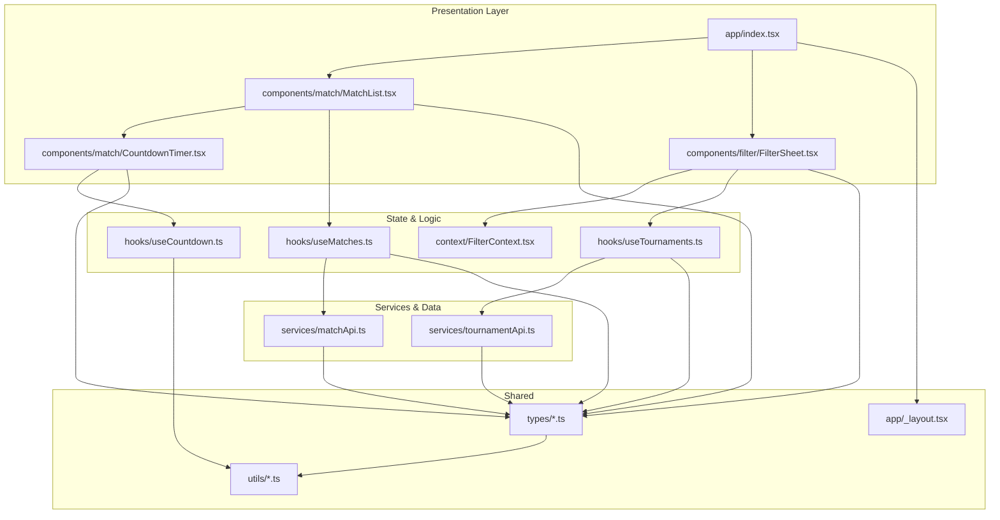
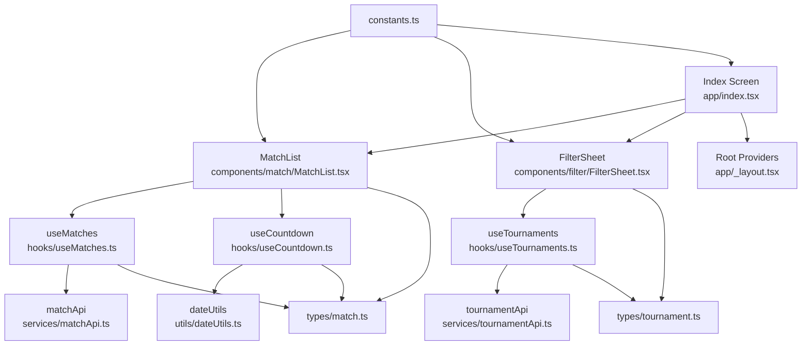
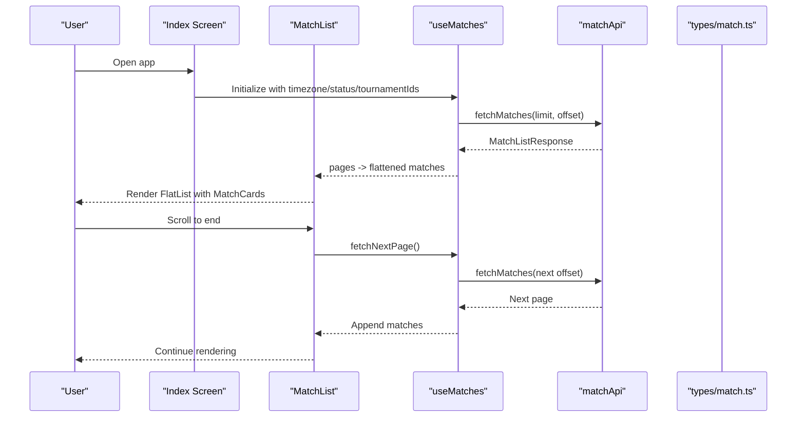
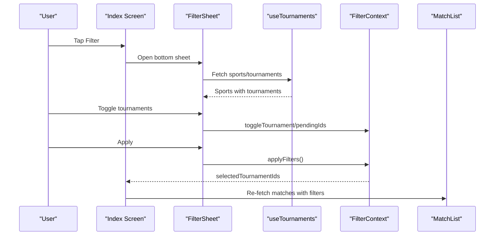
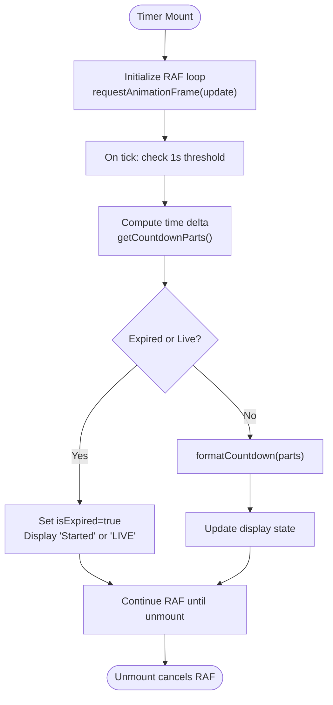
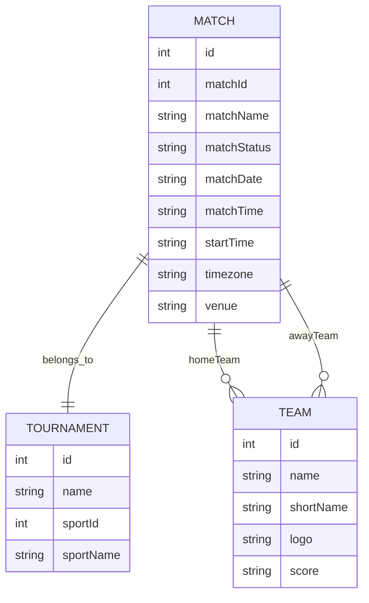
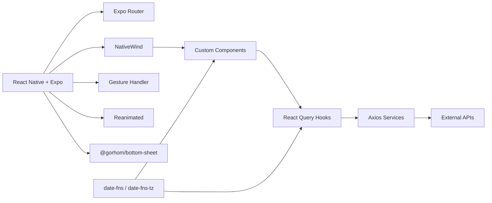

# Project Overview

<cite>
**Referenced Files in This Document**
- [README.md](file://README.md)
- [package.json](file://package.json)
- [app/_layout.tsx](file://app/_layout.tsx)
- [app/index.tsx](file://app/index.tsx)
- [app/components/match/MatchList.tsx](file://app/components/match/MatchList.tsx)
- [app/components/match/CountdownTimer.tsx](file://app/components/match/CountdownTimer.tsx)
- [app/components/filter/FilterSheet.tsx](file://app/components/filter/FilterSheet.tsx)
- [app/context/FilterContext.tsx](file://app/context/FilterContext.tsx)
- [app/hooks/useMatches.ts](file://app/hooks/useMatches.ts)
- [app/hooks/useTournaments.ts](file://app/hooks/useTournaments.ts)
- [app/hooks/useCountdown.ts](file://app/hooks/useCountdown.ts)
- [app/services/matchApi.ts](file://app/services/matchApi.ts)
- [app/services/tournamentApi.ts](file://app/services/tournamentApi.ts)
- [app/types/match.ts](file://app/types/match.ts)
- [app/types/tournament.ts](file://app/types/tournament.ts)
- [app/utils/constants.ts](file://app/utils/constants.ts)
- [app/utils/dateUtils.ts](file://app/utils/dateUtils.ts)
</cite>

## Table of Contents
1. [Introduction](#introduction)
2. [Project Structure](#project-structure)
3. [Core Components](#core-components)
4. [Architecture Overview](#architecture-overview)
5. [Detailed Component Analysis](#detailed-component-analysis)
6. [Dependency Analysis](#dependency-analysis)
7. [Performance Considerations](#performance-considerations)
8. [Troubleshooting Guide](#troubleshooting-guide)
9. [Conclusion](#conclusion)

## Introduction
This React Native sports match listing application is a mobile-first platform designed to deliver a seamless live sports experience. Its core purpose is to centralize match schedules, provide real-time countdowns, and enable efficient discovery through intelligent filtering. The app targets sports fans who want quick access to upcoming and live matches across supported sports, with a focus on smooth performance and intuitive navigation.

Key value propositions:
- Real-time engagement: Live countdown timers and “LIVE” indicators keep users informed about match timing.
- Efficient discovery: Multi-select tournament filtering allows users to focus on their favorite competitions.
- Scalable browsing: Infinite scroll ensures a continuous stream of matches without manual pagination.
- Reliable performance: Optimized rendering and caching reduce latency and improve responsiveness.

Target audience:
- Casual and die-hard sports fans
- Commuters and users seeking quick match updates
- Viewers who prefer mobile-first consumption of sports content

## Project Structure
The application follows a modular, feature-driven structure with clear separation of concerns:
- Components: Reusable UI elements for matches, filters, and loading states
- Hooks: Custom React Query and utility hooks encapsulating data fetching and countdown logic
- Services: API clients for match and tournament data
- Types: Strongly typed interfaces for data contracts
- Utils: Constants, date/time helpers, and formatters
- Context: Filter state management for multi-select tournament selection
- Layout: Root providers for React Query, gesture handling, and bottom sheet modals

**Diagram sources**
- [app/index.tsx](file://app/index.tsx#L1-L108)
- [app/components/match/MatchList.tsx](file://app/components/match/MatchList.tsx#L1-L117)
- [app/components/match/CountdownTimer.tsx](file://app/components/match/CountdownTimer.tsx#L1-L43)
- [app/components/filter/FilterSheet.tsx](file://app/components/filter/FilterSheet.tsx#L1-L128)
- [app/hooks/useMatches.ts](file://app/hooks/useMatches.ts#L1-L56)
- [app/hooks/useTournaments.ts](file://app/hooks/useTournaments.ts#L1-L45)
- [app/hooks/useCountdown.ts](file://app/hooks/useCountdown.ts#L1-L54)
- [app/context/FilterContext.tsx](file://app/context/FilterContext.tsx#L1-L72)
- [app/services/matchApi.ts](file://app/services/matchApi.ts#L1-L36)
- [app/services/tournamentApi.ts](file://app/services/tournamentApi.ts#L1-L35)
- [app/types/match.ts](file://app/types/match.ts#L1-L46)
- [app/types/tournament.ts](file://app/types/tournament.ts#L1-L31)
- [app/utils/constants.ts](file://app/utils/constants.ts#L1-L38)
- [app/utils/dateUtils.ts](file://app/utils/dateUtils.ts#L1-L64)
- [app/_layout.tsx](file://app/_layout.tsx#L1-L35)

**Section sources**
- [README.md](file://README.md#L54-L92)
- [app/_layout.tsx](file://app/_layout.tsx#L1-L35)

## Core Components
- Match List Screen: Presents matches with team branding, match metadata, and countdown timers. Implements pull-to-refresh, infinite scroll, and responsive layouts.
- Countdown Timer: Provides live countdowns for upcoming matches and “LIVE” indicators for ongoing matches using optimized animation frames.
- Tournament Filter: Bottom sheet with multi-select filters grouped by sport, enabling users to narrow down matches by competition.
- Data Fetching: React Query-powered hooks manage pagination, caching, and stale-while-revalidate behavior for match and tournament lists.
- Filter Context: Manages temporary selections and applies filters to the match list via controlled state transitions.

Practical examples:
- Viewing upcoming matches in a specific tournament: Open filter, select desired tournaments, apply, and browse the filtered list.
- Monitoring match countdowns: Navigate to the match list and observe the countdown timer updating every second until kickoff.
- Discovering live matches: Switch to “live” status via filters or rely on automatic “LIVE” indicators for ongoing matches.

**Section sources**
- [README.md](file://README.md#L7-L13)
- [app/index.tsx](file://app/index.tsx#L11-L107)
- [app/components/match/MatchList.tsx](file://app/components/match/MatchList.tsx#L27-L114)
- [app/components/match/CountdownTimer.tsx](file://app/components/match/CountdownTimer.tsx#L13-L42)
- [app/components/filter/FilterSheet.tsx](file://app/components/filter/FilterSheet.tsx#L16-L125)
- [app/hooks/useMatches.ts](file://app/hooks/useMatches.ts#L13-L55)
- [app/hooks/useTournaments.ts](file://app/hooks/useTournaments.ts#L11-L44)
- [app/context/FilterContext.tsx](file://app/context/FilterContext.tsx#L20-L71)

## Architecture Overview
The app employs a layered architecture:
- Presentation layer: Screens and components render UI and orchestrate user interactions.
- Domain layer: Hooks encapsulate business logic for data fetching, filtering, and countdown calculations.
- Data layer: Services abstract HTTP requests and normalize API responses.
- Shared layer: Types, constants, and utilities provide cross-cutting concerns.

**Diagram sources**
- [app/index.tsx](file://app/index.tsx#L11-L107)
- [app/components/match/MatchList.tsx](file://app/components/match/MatchList.tsx#L27-L114)
- [app/components/filter/FilterSheet.tsx](file://app/components/filter/FilterSheet.tsx#L16-L125)
- [app/hooks/useMatches.ts](file://app/hooks/useMatches.ts#L21-L41)
- [app/hooks/useTournaments.ts](file://app/hooks/useTournaments.ts#L14-L28)
- [app/hooks/useCountdown.ts](file://app/hooks/useCountdown.ts#L10-L53)
- [app/services/matchApi.ts](file://app/services/matchApi.ts#L4-L35)
- [app/services/tournamentApi.ts](file://app/services/tournamentApi.ts#L4-L34)
- [app/utils/dateUtils.ts](file://app/utils/dateUtils.ts#L22-L63)
- [app/_layout.tsx](file://app/_layout.tsx#L19-L34)
- [app/types/match.ts](file://app/types/match.ts#L16-L45)
- [app/types/tournament.ts](file://app/types/tournament.ts#L6-L20)
- [app/utils/constants.ts](file://app/utils/constants.ts#L1-L38)

## Detailed Component Analysis

### Match List and Infinite Scroll
The match list integrates React Query’s infinite scroll with a FlatList to provide smooth, memory-efficient rendering. It supports:
- Pull-to-refresh for immediate data reload
- End-of-list detection triggering incremental loads
- Loading skeletons during initial fetch
- Empty/error states with actionable messages

**Diagram sources**
- [app/index.tsx](file://app/index.tsx#L15-L25)
- [app/components/match/MatchList.tsx](file://app/components/match/MatchList.tsx#L83-L107)
- [app/hooks/useMatches.ts](file://app/hooks/useMatches.ts#L21-L41)
- [app/services/matchApi.ts](file://app/services/matchApi.ts#L4-L35)
- [app/types/match.ts](file://app/types/match.ts#L40-L45)

**Section sources**
- [app/components/match/MatchList.tsx](file://app/components/match/MatchList.tsx#L27-L114)
- [app/hooks/useMatches.ts](file://app/hooks/useMatches.ts#L13-L55)
- [app/services/matchApi.ts](file://app/services/matchApi.ts#L1-L36)
- [app/types/match.ts](file://app/types/match.ts#L31-L45)

### Tournament Filtering Workflow
The filter sheet enables multi-select tournament filtering with a bottom sheet UI:
- Loads sports and tournaments via useTournaments
- Maintains pending selections until applied
- Applies filters to the match list via FilterContext

**Diagram sources**
- [app/index.tsx](file://app/index.tsx#L13-L25)
- [app/components/filter/FilterSheet.tsx](file://app/components/filter/FilterSheet.tsx#L17-L50)
- [app/hooks/useTournaments.ts](file://app/hooks/useTournaments.ts#L14-L28)
- [app/context/FilterContext.tsx](file://app/context/FilterContext.tsx#L26-L43)
- [app/components/match/MatchList.tsx](file://app/components/match/MatchList.tsx#L83-L107)

**Section sources**
- [app/components/filter/FilterSheet.tsx](file://app/components/filter/FilterSheet.tsx#L16-L125)
- [app/hooks/useTournaments.ts](file://app/hooks/useTournaments.ts#L11-L44)
- [app/context/FilterContext.tsx](file://app/context/FilterContext.tsx#L20-L71)

### Countdown Timer Logic
The countdown timer updates every second using requestAnimationFrame and switches to “LIVE” when appropriate:
- Calculates time differences using date-fns and timezone-aware formatting
- Formats display based on remaining time (days/hours/minutes/seconds)
- Handles expired states and live match indicators

**Diagram sources**
- [app/hooks/useCountdown.ts](file://app/hooks/useCountdown.ts#L17-L50)
- [app/utils/dateUtils.ts](file://app/utils/dateUtils.ts#L22-L51)
- [app/components/match/CountdownTimer.tsx](file://app/components/match/CountdownTimer.tsx#L13-L38)

**Section sources**
- [app/hooks/useCountdown.ts](file://app/hooks/useCountdown.ts#L10-L53)
- [app/utils/dateUtils.ts](file://app/utils/dateUtils.ts#L22-L63)
- [app/components/match/CountdownTimer.tsx](file://app/components/match/CountdownTimer.tsx#L13-L42)

### Data Models Overview
The application relies on strongly typed contracts for matches and tournaments:
- Match: Includes identifiers, team info, tournament linkage, status, and scheduling metadata
- Tournament: Sport association and tournament metadata
- Query Params/Responses: Consistent pagination and filtering parameters

**Diagram sources**
- [app/types/match.ts](file://app/types/match.ts#L16-L29)
- [app/types/match.ts](file://app/types/match.ts#L9-L14)
- [app/types/tournament.ts](file://app/types/tournament.ts#L1-L10)

**Section sources**
- [app/types/match.ts](file://app/types/match.ts#L1-L46)
- [app/types/tournament.ts](file://app/types/tournament.ts#L1-L31)

## Dependency Analysis
External libraries and their roles:
- React Query: Server state management, caching, pagination, and stale-while-revalidate
- Expo Router: File-based routing and navigation
- NativeWind/Tailwind: Utility-first styling for responsive UI
- Bottom Sheet: Modal-like filter UI with gesture support
- date-fns/date-fns-tz: Robust date parsing and timezone formatting
- Axios: HTTP client for API communication

**Diagram sources**
- [package.json](file://package.json#L13-L49)
- [app/_layout.tsx](file://app/_layout.tsx#L1-L35)

**Section sources**
- [package.json](file://package.json#L13-L49)
- [README.md](file://README.md#L14-L22)

## Performance Considerations
- Rendering optimizations: FlatList with removeClippedSubviews, maxToRenderPerBatch, windowSize, and initialNumToRender tuned for smooth scrolling
- Memory efficiency: React Query garbage collection and staleTime/gcTime configurations
- Network efficiency: Limit/offset pagination and controlled re-fetch triggers
- Visual responsiveness: requestAnimationFrame-based countdown updates and haptic feedback integration
- Asset delivery: Image caching and fallbacks for team logos

[No sources needed since this section provides general guidance]

## Troubleshooting Guide
Common issues and resolutions:
- Infinite scroll not triggering: Verify hasNextPage and isFetchingNextPage flags and ensure onEndReached threshold is appropriate
- Filters not applying: Confirm selectedTournamentIds propagation from FilterContext to useMatches and that queryKey includes filter parameters
- Countdown not updating: Ensure requestAnimationFrame loop runs and date parsing succeeds; check timezone parameter alignment
- API failures: Inspect error states and implement retry actions; validate endpoint URLs and query parameters

**Section sources**
- [app/components/match/MatchList.tsx](file://app/components/match/MatchList.tsx#L83-L107)
- [app/context/FilterContext.tsx](file://app/context/FilterContext.tsx#L41-L43)
- [app/hooks/useCountdown.ts](file://app/hooks/useCountdown.ts#L17-L50)
- [app/services/matchApi.ts](file://app/services/matchApi.ts#L4-L35)
- [app/services/tournamentApi.ts](file://app/services/tournamentApi.ts#L4-L34)

## Conclusion
This React Native sports match listing application delivers a modern, performant, and user-centric mobile experience for discovering and following live sports events. By combining robust data fetching, intelligent filtering, and real-time countdowns, it enhances engagement and accessibility for sports fans. The modular architecture and strong typing ensure maintainability and scalability for future enhancements.