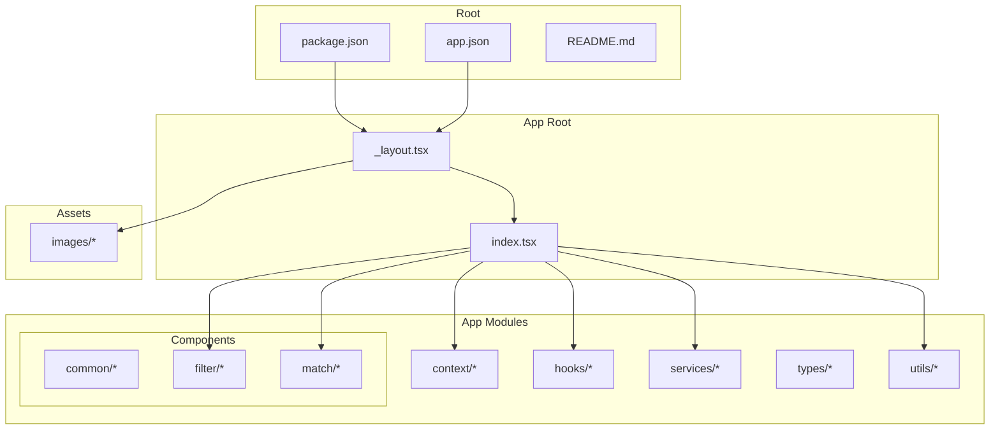
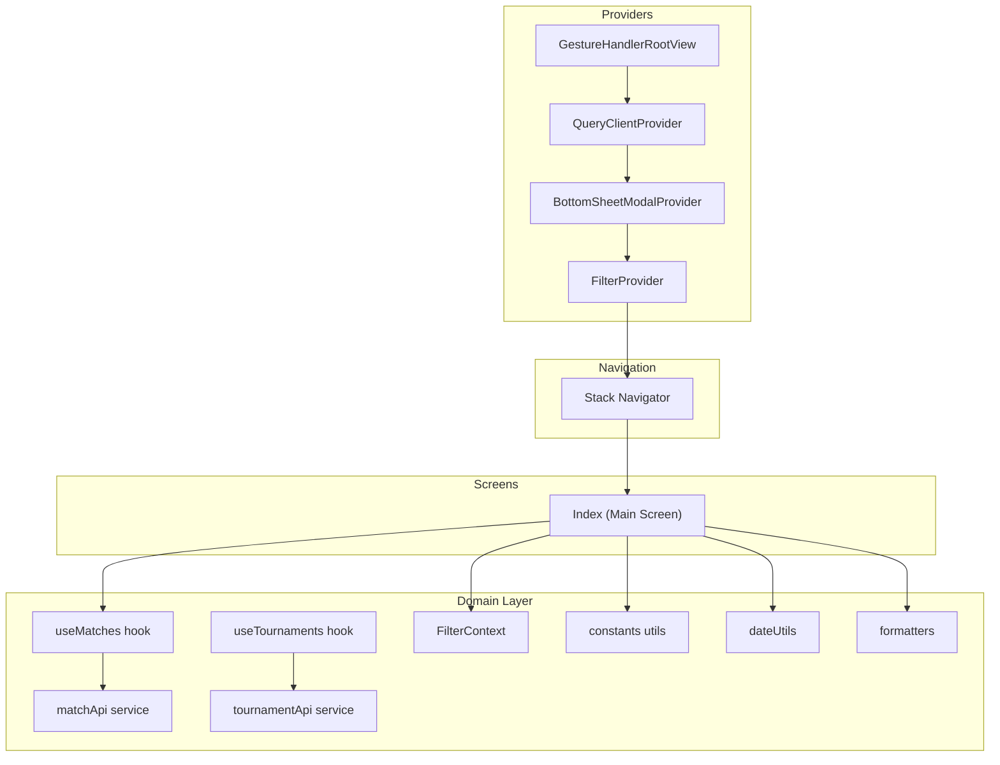
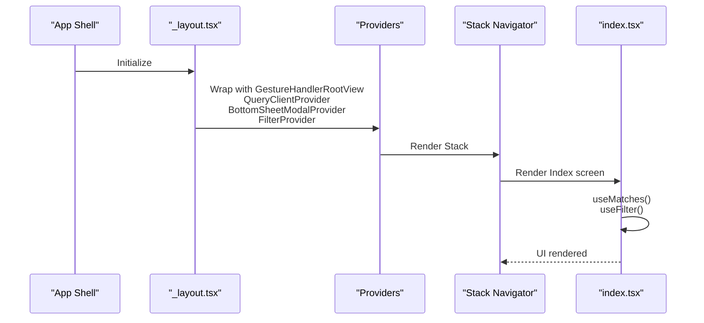
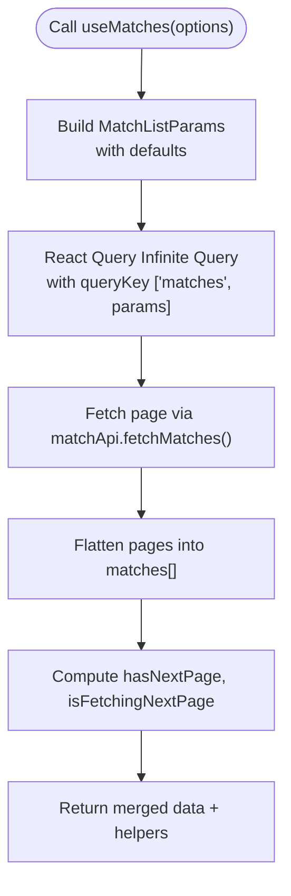
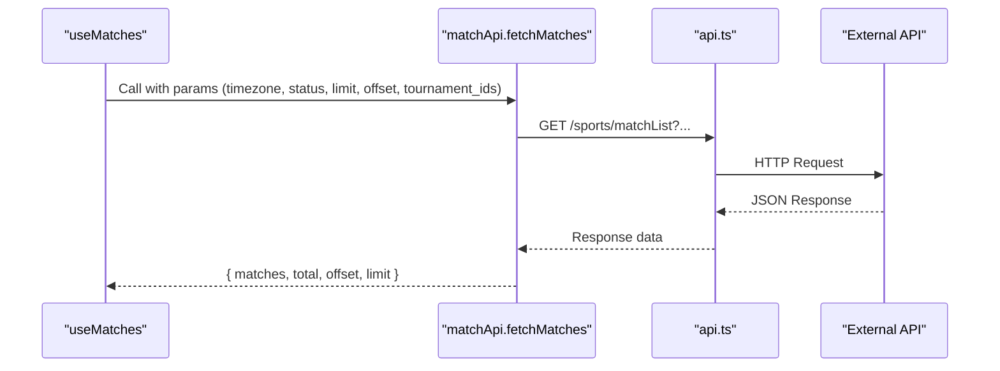
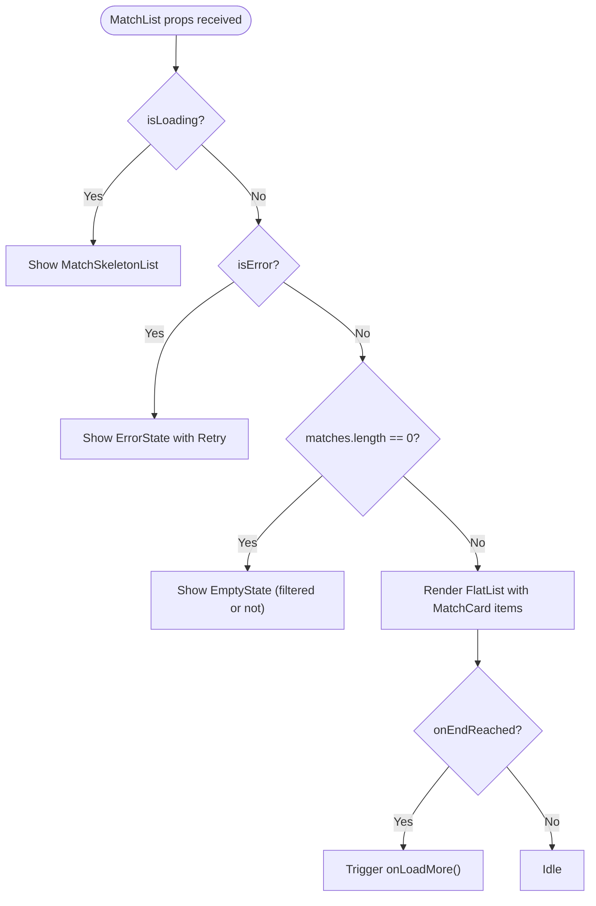
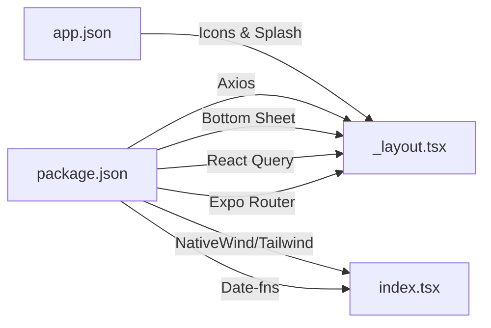

# Project Structure

<cite>
**Referenced Files in This Document**
- [README.md](file://README.md)
- [package.json](file://package.json)
- [app.json](file://app.json)
- [app/_layout.tsx](file://app/_layout.tsx)
- [app/index.tsx](file://app/index.tsx)
- [app/context/FilterContext.tsx](file://app/context/FilterContext.tsx)
- [app/hooks/useMatches.ts](file://app/hooks/useMatches.ts)
- [app/hooks/useTournaments.ts](file://app/hooks/useTournaments.ts)
- [app/services/api.ts](file://app/services/api.ts)
- [app/services/matchApi.ts](file://app/services/matchApi.ts)
- [app/services/tournamentApi.ts](file://app/services/tournamentApi.ts)
- [app/types/match.ts](file://app/types/match.ts)
- [app/types/tournament.ts](file://app/types/tournament.ts)
- [app/utils/constants.ts](file://app/utils/constants.ts)
- [app/utils/dateUtils.ts](file://app/utils/dateUtils.ts)
- [app/utils/formatters.ts](file://app/utils/formatters.ts)
- [app/components/match/MatchList.tsx](file://app/components/match/MatchList.tsx)
- [assets/images/icon.png](file://assets/images/icon.png)
- [assets/images/splash-icon.png](file://assets/images/splash-icon.png)
</cite>

## Table of Contents
1. [Introduction](#introduction)
2. [Project Structure](#project-structure)
3. [Core Components](#core-components)
4. [Architecture Overview](#architecture-overview)
5. [Detailed Component Analysis](#detailed-component-analysis)
6. [Dependency Analysis](#dependency-analysis)
7. [Performance Considerations](#performance-considerations)
8. [Troubleshooting Guide](#troubleshooting-guide)
9. [Conclusion](#conclusion)
10. [Appendices](#appendices)

## Introduction
This document explains the project structure of a React Native sports match application built with Expo. It focuses on the app/ directory organization, module separation strategy, and how the file-based routing system with Expo Router composes the root layout and main entry point. It also outlines the purpose of each major directory and provides guidance for adding new features while maintaining consistency with existing patterns.

## Project Structure
The repository follows a clear, layered structure centered around the app/ directory. The top-level configuration files define the runtime and build behavior, while app/ encapsulates the entire application logic and UI.

**Diagram sources**
- [package.json](file://package.json#L1-L59)
- [app.json](file://app.json#L1-L50)
- [app/_layout.tsx](file://app/_layout.tsx#L1-L35)
- [app/index.tsx](file://app/index.tsx#L1-L108)

Key characteristics:
- app/ is the single source of truth for the application’s UI, logic, and configuration.
- Expo Router drives file-based routing; the root layout wraps providers and renders the Stack navigator.
- Static assets are centralized under assets/images/.
- TypeScript types, services, hooks, and utilities are grouped by responsibility for modularity and discoverability.

**Section sources**
- [README.md](file://README.md#L54-L92)
- [package.json](file://package.json#L1-L59)
- [app.json](file://app.json#L1-L50)

## Core Components
This section documents the purpose and responsibilities of each major directory within app/.

- app/components/
  - Purpose: Reusable UI elements organized by feature area.
  - Subfolders:
    - common/: Shared components like loading, empty, and error states.
    - filter/: UI for selecting tournaments and applying filters.
    - match/: Components for rendering match cards, lists, skeletons, and countdown timers.
  - Rationale: Keeps UI modular and testable; encourages reuse across screens.

- app/context/
  - Purpose: React Context providers for cross-cutting concerns.
  - Example: FilterContext manages selected and pending tournament filters.

- app/hooks/
  - Purpose: Custom React Query hooks for data fetching and caching.
  - Examples: useMatches for paginated match lists; useTournaments for tournament data.

- app/services/
  - Purpose: API clients and service functions for backend communication.
  - Examples: api.ts base client; matchApi.ts and tournamentApi.ts for specific endpoints.

- app/types/
  - Purpose: TypeScript interfaces and types for API responses and domain models.
  - Examples: match.ts and tournament.ts define shapes for matches and tournaments.

- app/utils/
  - Purpose: Shared utilities for constants, formatting, dates, and haptics.
  - Examples: constants.ts for API base URLs and colors; dateUtils.ts and formatters.ts for presentation logic.

- app/assets/
  - Purpose: Static resources such as icons, images, and splash screens referenced by app.json.

**Section sources**
- [README.md](file://README.md#L58-L91)
- [app/context/FilterContext.tsx](file://app/context/FilterContext.tsx#L1-L72)
- [app/hooks/useMatches.ts](file://app/hooks/useMatches.ts#L1-L56)
- [app/hooks/useTournaments.ts](file://app/hooks/useTournaments.ts#L1-L45)
- [app/services/matchApi.ts](file://app/services/matchApi.ts#L1-L36)
- [app/services/tournamentApi.ts](file://app/services/tournamentApi.ts#L1-L35)
- [app/types/match.ts](file://app/types/match.ts#L1-L46)
- [app/utils/constants.ts](file://app/utils/constants.ts#L1-L38)
- [app/utils/dateUtils.ts](file://app/utils/dateUtils.ts#L1-L64)
- [app/utils/formatters.ts](file://app/utils/formatters.ts#L1-L47)
- [app.json](file://app.json#L7-L42)

## Architecture Overview
The app composes a root layout with providers and exposes a single entry screen. Providers include gesture handling, React Query cache, bottom sheet modal provider, and the filter context. The main screen orchestrates data fetching via hooks, renders a match list with infinite scroll, and integrates a bottom sheet filter.

**Diagram sources**
- [app/_layout.tsx](file://app/_layout.tsx#L1-L35)
- [app/index.tsx](file://app/index.tsx#L1-L108)
- [app/hooks/useMatches.ts](file://app/hooks/useMatches.ts#L1-L56)
- [app/hooks/useTournaments.ts](file://app/hooks/useTournaments.ts#L1-L45)
- [app/context/FilterContext.tsx](file://app/context/FilterContext.tsx#L1-L72)
- [app/services/matchApi.ts](file://app/services/matchApi.ts#L1-L36)
- [app/services/tournamentApi.ts](file://app/services/tournamentApi.ts#L1-L35)
- [app/utils/constants.ts](file://app/utils/constants.ts#L1-L38)
- [app/utils/dateUtils.ts](file://app/utils/dateUtils.ts#L1-L64)
- [app/utils/formatters.ts](file://app/utils/formatters.ts#L1-L47)

## Detailed Component Analysis

### Root Layout and Entry Point
- Root layout (_layout.tsx):
  - Wraps the app with providers for gesture handling, React Query, bottom sheet modals, and filter context.
  - Renders a Stack navigator with hidden headers.
  - Configures React Query defaults (retry attempts and stale time).
- Main entry (index.tsx):
  - Uses FilterContext to manage selected tournament filters.
  - Uses useMatches to fetch paginated match data with React Query.
  - Renders a header with filter button and match list.
  - Integrates a bottom sheet filter panel.

**Diagram sources**
- [app/_layout.tsx](file://app/_layout.tsx#L1-L35)
- [app/index.tsx](file://app/index.tsx#L1-L108)

**Section sources**
- [app/_layout.tsx](file://app/_layout.tsx#L1-L35)
- [app/index.tsx](file://app/index.tsx#L11-L107)

### Data Fetching Hooks
- useMatches:
  - Implements infinite pagination with React Query.
  - Accepts timezone, status, tournament filters, and page size.
  - Returns combined matches array, pagination flags, and refetch handlers.
- useTournaments:
  - Fetches sports and tournaments with configurable search and limit.
  - Flattens sports into a list of tournaments with sport metadata.

**Diagram sources**
- [app/hooks/useMatches.ts](file://app/hooks/useMatches.ts#L1-L56)
- [app/services/matchApi.ts](file://app/services/matchApi.ts#L1-L36)

**Section sources**
- [app/hooks/useMatches.ts](file://app/hooks/useMatches.ts#L13-L55)
- [app/hooks/useTournaments.ts](file://app/hooks/useTournaments.ts#L11-L44)

### Services and API Communication
- api.ts (base client):
  - Centralized HTTP client configuration for API requests.
- matchApi.ts:
  - Builds query parameters and calls the match list endpoint.
- tournamentApi.ts:
  - Builds query parameters and calls the tournaments endpoint, shaping the response into sports with tournaments.

**Diagram sources**
- [app/hooks/useMatches.ts](file://app/hooks/useMatches.ts#L1-L56)
- [app/services/matchApi.ts](file://app/services/matchApi.ts#L1-L36)
- [app/services/api.ts](file://app/services/api.ts)

**Section sources**
- [app/services/matchApi.ts](file://app/services/matchApi.ts#L4-L35)
- [app/services/tournamentApi.ts](file://app/services/tournamentApi.ts#L4-L34)

### Types and Utilities
- Types:
  - match.ts defines Team, Tournament, Match, MatchListParams, and MatchListResponse.
  - tournament.ts defines related tournament and sports structures.
- Utils:
  - constants.ts centralizes API base URLs, media base URL, default timezone, page size, and theme colors.
  - dateUtils.ts handles time formatting, countdown calculations, and status checks.
  - formatters.ts provides text truncation, capitalization, ID formatting, initials extraction, and status formatting.

**Section sources**
- [app/types/match.ts](file://app/types/match.ts#L1-L46)
- [app/utils/constants.ts](file://app/utils/constants.ts#L1-L38)
- [app/utils/dateUtils.ts](file://app/utils/dateUtils.ts#L1-L64)
- [app/utils/formatters.ts](file://app/utils/formatters.ts#L1-L47)

### UI Components and State Management
- MatchList:
  - Renders a FlatList with pull-to-refresh, infinite scroll footer, and empty/error/loading states.
  - Uses skeleton loaders during initial load and integrates with parent handlers for refresh and pagination.
- FilterContext:
  - Manages pending and applied filters separately to support a “preview” before applying.
  - Provides toggle, selection, clear, and apply actions.

**Diagram sources**
- [app/components/match/MatchList.tsx](file://app/components/match/MatchList.tsx#L1-L117)

**Section sources**
- [app/components/match/MatchList.tsx](file://app/components/match/MatchList.tsx#L27-L113)
- [app/context/FilterContext.tsx](file://app/context/FilterContext.tsx#L20-L63)

## Dependency Analysis
The project relies on Expo Router for file-based routing, React Query for server state, and several UI libraries. The app.json configures the app metadata, icons, scheme, and plugins including Expo Router and splash screen.

**Diagram sources**
- [package.json](file://package.json#L13-L49)
- [app.json](file://app.json#L1-L50)
- [app/_layout.tsx](file://app/_layout.tsx#L1-L35)
- [app/index.tsx](file://app/index.tsx#L1-L108)

**Section sources**
- [package.json](file://package.json#L13-L49)
- [app.json](file://app.json#L1-L50)

## Performance Considerations
- FlatList optimizations:
  - removeClippedSubviews, maxToRenderPerBatch, windowSize, initialNumToRender reduce rendering overhead.
- React Query:
  - Stale and garbage collection times configured to balance freshness and performance.
- Image handling:
  - Expo Image recommended for caching and performance.
- Haptics:
  - Haptic feedback integrated for smoother interactions.

[No sources needed since this section provides general guidance]

## Troubleshooting Guide
- Provider order:
  - Ensure providers wrap the Stack navigator in the correct order: GestureHandlerRootView → QueryClientProvider → BottomSheetModalProvider → FilterProvider.
- Navigation:
  - Verify that the main screen is exported as default from index.tsx and that the Stack navigator is rendered in _layout.tsx.
- API connectivity:
  - Confirm API base URL and endpoints in constants and services.
- Assets:
  - Validate asset paths in app.json and ensure assets exist in assets/images/.

**Section sources**
- [app/_layout.tsx](file://app/_layout.tsx#L19-L33)
- [app/index.tsx](file://app/index.tsx#L11-L107)
- [app.json](file://app.json#L7-L42)

## Conclusion
The project’s structure cleanly separates concerns across components, hooks, services, types, and utilities, enabling scalable development. The root layout composes providers and navigation, while Expo Router organizes routes by file naming. Following the established patterns ensures consistency when adding new features.

[No sources needed since this section summarizes without analyzing specific files]

## Appendices

### File Naming Conventions
- Components: PascalCase (e.g., MatchCard.tsx, FilterSheet.tsx).
- Hooks: useXxx pattern (e.g., useMatches.ts, useTournaments.ts).
- Services: XxxApi.ts suffix (e.g., matchApi.ts, tournamentApi.ts).
- Types: Xxx.ts suffix (e.g., match.ts, tournament.ts).
- Utilities: descriptive nouns (e.g., constants.ts, dateUtils.ts, formatters.ts).
- Context: XxxContext.tsx suffix (e.g., FilterContext.tsx).

**Section sources**
- [README.md](file://README.md#L58-L91)

### Module Separation Strategy
- Components: Feature-based grouping (match, filter, common) to keep UI cohesive.
- Hooks: Domain-specific hooks for data fetching and caching.
- Services: Encapsulate HTTP logic and parameter building.
- Types: Strong typing for API responses and domain models.
- Utils: Pure functions for formatting, constants, and helpers.
- Context: Minimal, focused providers for cross-cutting state.

**Section sources**
- [README.md](file://README.md#L58-L91)

### Adding New Features: Where to Place Files
- New screens:
  - Add a new file under app/ with a descriptive name (e.g., app/profile.tsx) and export default from app/index.tsx if needed.
- UI components:
  - Place reusable components under app/components/<feature>/ (e.g., app/components/team/TeamAvatar.tsx).
- Hooks:
  - Add new hooks under app/hooks/ (e.g., app/hooks/useTeamStats.ts).
- Services:
  - Add new service files under app/services/ (e.g., app/services/teamApi.ts).
- Types:
  - Extend or add new type files under app/types/ (e.g., app/types/team.ts).
- Utilities:
  - Add new utility files under app/utils/ (e.g., app/utils/validation.ts).
- Context:
  - Add new context providers under app/context/ (e.g., app/context/AuthContext.tsx).

**Section sources**
- [README.md](file://README.md#L58-L91)
- [app/_layout.tsx](file://app/_layout.tsx#L1-L35)
- [app/index.tsx](file://app/index.tsx#L1-L108)