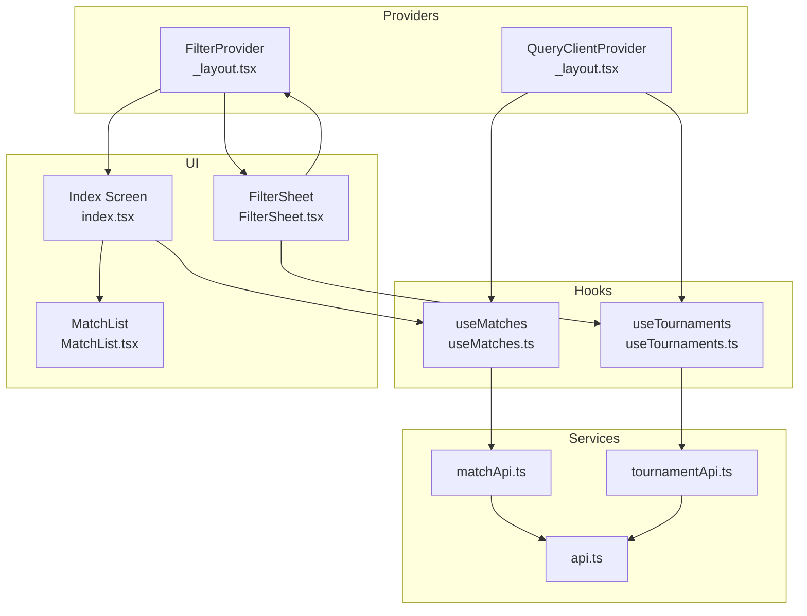
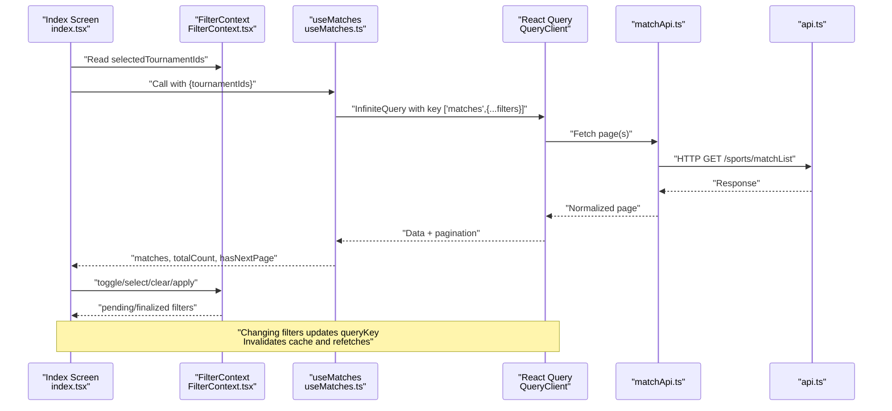
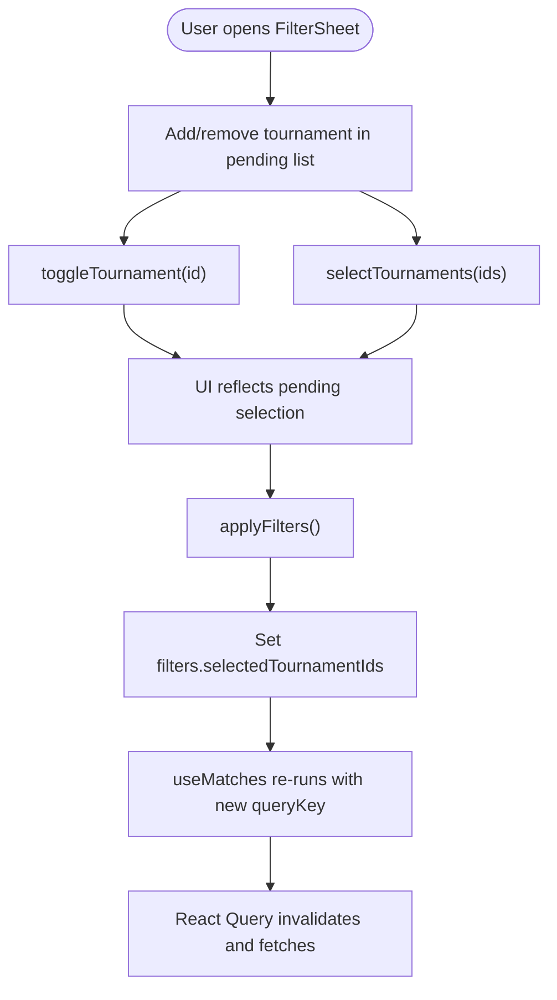
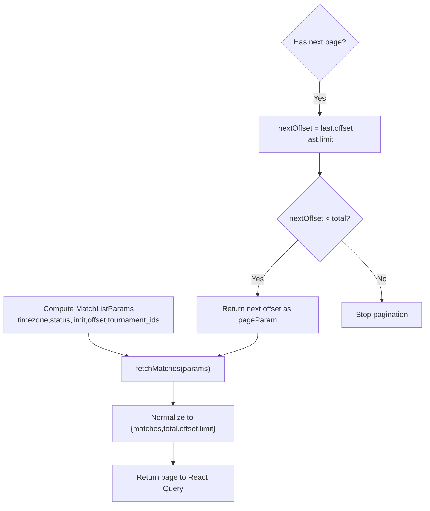
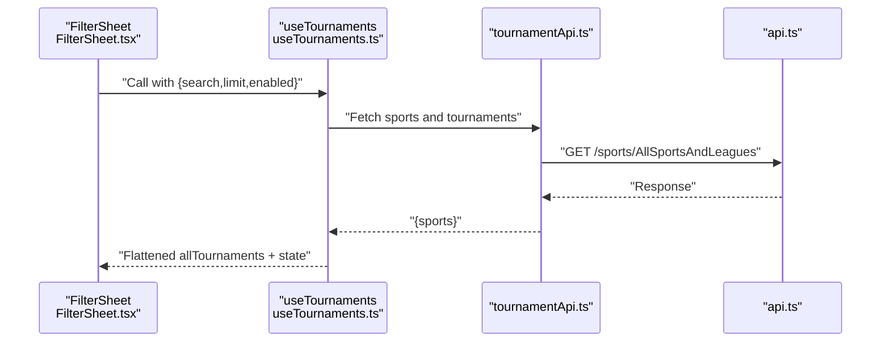
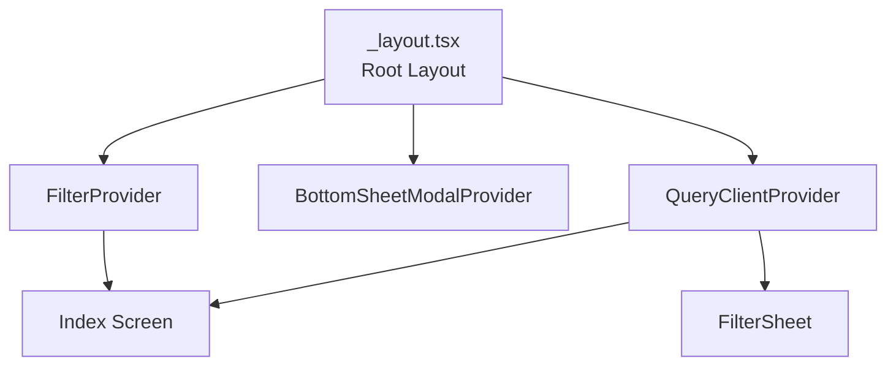
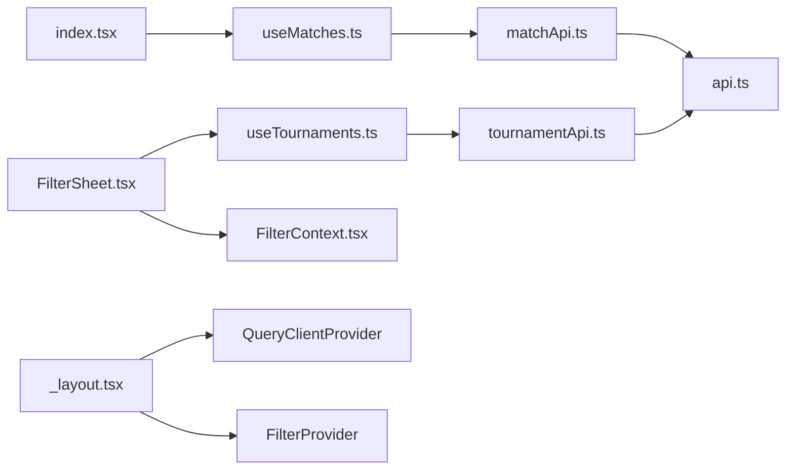

# State Management

<cite>
**Referenced Files in This Document**
- [FilterContext.tsx](file://app/context/FilterContext.tsx)
- [useMatches.ts](file://app/hooks/useMatches.ts)
- [useTournaments.ts](file://app/hooks/useTournaments.ts)
- [_layout.tsx](file://app/_layout.tsx)
- [index.tsx](file://app/index.tsx)
- [FilterSheet.tsx](file://app/components/filter/FilterSheet.tsx)
- [MatchList.tsx](file://app/components/match/MatchList.tsx)
- [matchApi.ts](file://app/services/matchApi.ts)
- [tournamentApi.ts](file://app/services/tournamentApi.ts)
- [api.ts](file://app/services/api.ts)
- [constants.ts](file://app/utils/constants.ts)
- [match.ts](file://app/types/match.ts)
- [tournament.ts](file://app/types/tournament.ts)
</cite>

## Table of Contents
1. [Introduction](#introduction)
2. [Project Structure](#project-structure)
3. [Core Components](#core-components)
4. [Architecture Overview](#architecture-overview)
5. [Detailed Component Analysis](#detailed-component-analysis)
6. [Dependency Analysis](#dependency-analysis)
7. [Performance Considerations](#performance-considerations)
8. [Troubleshooting Guide](#troubleshooting-guide)
9. [Conclusion](#conclusion)

## Introduction
This document explains the state management architecture of the sports match application. It covers a dual-state strategy:
- Local state for UI filters managed via React Context API
- Remote server state for match and tournament data cached via React Query

It details how FilterContext manages tournament selections, how custom hooks useMatches and useTournaments fetch and cache data, and how local and remote states synchronize. It also outlines update patterns, subscriptions, persistence considerations, error handling, and debugging strategies.

## Project Structure
The state management spans context providers, custom hooks, service clients, and UI components:
- Provider setup wraps the app with React Query and FilterContext
- Custom hooks encapsulate data fetching, caching, and pagination
- Services define API requests and normalize responses
- UI components subscribe to state and trigger updates

**Diagram sources**
- [_layout.tsx](file://app/_layout.tsx#L10-L34)
- [useMatches.ts](file://app/hooks/useMatches.ts#L1-L56)
- [useTournaments.ts](file://app/hooks/useTournaments.ts#L1-L45)
- [matchApi.ts](file://app/services/matchApi.ts#L1-L36)
- [tournamentApi.ts](file://app/services/tournamentApi.ts#L1-L35)
- [api.ts](file://app/services/api.ts#L1-L40)
- [index.tsx](file://app/index.tsx#L1-L108)
- [FilterSheet.tsx](file://app/components/filter/FilterSheet.tsx#L1-L128)
- [MatchList.tsx](file://app/components/match/MatchList.tsx#L1-L117)

**Section sources**
- [_layout.tsx](file://app/_layout.tsx#L1-L35)
- [index.tsx](file://app/index.tsx#L1-L108)

## Core Components
- FilterContext: Manages local filter state (selected and pending tournament IDs), exposes actions to toggle, select, clear, and apply filters, and signals whether filters are active.
- useMatches: Infinite query for match lists with timezone, status, and tournament filtering; provides pagination and totals.
- useTournaments: Query for sports and tournaments with optional search and limits; flattens nested data for UI consumption.
- API services: Encapsulate HTTP requests and normalize responses for typed consumption.
- UI integration: Index screen subscribes to filtered matches; FilterSheet subscribes to tournaments and pending filters; MatchList renders paginated results.

**Section sources**
- [FilterContext.tsx](file://app/context/FilterContext.tsx#L1-L72)
- [useMatches.ts](file://app/hooks/useMatches.ts#L1-L56)
- [useTournaments.ts](file://app/hooks/useTournaments.ts#L1-L45)
- [matchApi.ts](file://app/services/matchApi.ts#L1-L36)
- [tournamentApi.ts](file://app/services/tournamentApi.ts#L1-L35)
- [index.tsx](file://app/index.tsx#L1-L108)
- [FilterSheet.tsx](file://app/components/filter/FilterSheet.tsx#L1-L128)
- [MatchList.tsx](file://app/components/match/MatchList.tsx#L1-L117)

## Architecture Overview
The system uses React Query for server state caching and React Context for local UI state. The provider stack ensures both contexts are available globally. Hooks compute query keys from current filters and options, enabling automatic cache invalidation and refetching when filters change.

**Diagram sources**
- [index.tsx](file://app/index.tsx#L11-L25)
- [FilterContext.tsx](file://app/context/FilterContext.tsx#L20-L63)
- [useMatches.ts](file://app/hooks/useMatches.ts#L13-L41)
- [matchApi.ts](file://app/services/matchApi.ts#L4-L35)
- [api.ts](file://app/services/api.ts#L1-L40)

## Detailed Component Analysis

### FilterContext: Local Filter State
FilterContext maintains two pieces of state:
- filters: Finalized selection used by data queries
- pendingTournamentIds: Draft selection shown in the filter UI

Actions:
- toggleTournament: Adds or removes a tournament ID from pending
- selectTournaments: Replaces pending with a provided list
- clearFilters: Resets both pending and finalized selections
- applyFilters: Commits pending to finalized filters
- isFilterActive: Indicates if any filters are applied

State synchronization:
- UI components read pendingTournamentIds for immediate feedback
- useMatches reads selectedTournamentIds to compute query keys
- Applying filters updates the query key, triggering cache invalidation and refetch

**Diagram sources**
- [FilterContext.tsx](file://app/context/FilterContext.tsx#L26-L43)
- [FilterSheet.tsx](file://app/components/filter/FilterSheet.tsx#L28-L31)
- [useMatches.ts](file://app/hooks/useMatches.ts#L21-L41)

**Section sources**
- [FilterContext.tsx](file://app/context/FilterContext.tsx#L1-L72)
- [FilterSheet.tsx](file://app/components/filter/FilterSheet.tsx#L1-L128)

### useMatches: Infinite Query for Matches
Responsibilities:
- Build queryKey from timezone, status, and tournament IDs
- Paginate via pageParam (offset) and compute next page param from total
- Expose matches array, total count, pagination booleans, and refetch/fetchNextPage
- Configure staleTime and garbage collection for efficient caching

Integration:
- Consumed by Index screen; passes selectedTournamentIds from FilterContext
- Triggers refetch automatically when queryKey changes due to filter updates

**Diagram sources**
- [useMatches.ts](file://app/hooks/useMatches.ts#L21-L41)
- [matchApi.ts](file://app/services/matchApi.ts#L4-L35)
- [match.ts](file://app/types/match.ts#L31-L45)

**Section sources**
- [useMatches.ts](file://app/hooks/useMatches.ts#L1-L56)
- [matchApi.ts](file://app/services/matchApi.ts#L1-L36)
- [match.ts](file://app/types/match.ts#L1-L46)

### useTournaments: Query for Sports and Tournaments
Responsibilities:
- Build queryKey from search and limit
- Fetch sports and tournaments, flatten nested structure into allTournaments
- Expose enabled flag to conditionally run the query
- Configure staleTime and garbage collection

Integration:
- Consumed by FilterSheet to populate the filter UI
- Supports retry and refetch on error

**Diagram sources**
- [FilterSheet.tsx](file://app/components/filter/FilterSheet.tsx#L17-L17)
- [useTournaments.ts](file://app/hooks/useTournaments.ts#L11-L28)
- [tournamentApi.ts](file://app/services/tournamentApi.ts#L4-L34)
- [api.ts](file://app/services/api.ts#L1-L40)

**Section sources**
- [useTournaments.ts](file://app/hooks/useTournaments.ts#L1-L45)
- [tournamentApi.ts](file://app/services/tournamentApi.ts#L1-L35)
- [tournament.ts](file://app/types/tournament.ts#L1-L31)

### Provider Setup and Global State
- QueryClientProvider initializes React Query with default options (retry, staleTime)
- FilterProvider wraps the app to make filter state available to all screens
- Both providers are initialized at the root layout level

**Diagram sources**
- [_layout.tsx](file://app/_layout.tsx#L19-L34)

**Section sources**
- [_layout.tsx](file://app/_layout.tsx#L1-L35)

### UI Integration Patterns
- Index screen:
  - Subscribes to selectedTournamentIds and isFilterActive
  - Calls useMatches with tournamentIds derived from FilterContext
  - Handles pagination via fetchNextPage and manual refresh via refetch
- FilterSheet:
  - Subscribes to useTournaments for sports and tournaments
  - Uses pendingTournamentIds to reflect immediate selections
  - Applies filters and closes the sheet
- MatchList:
  - Renders loading, empty, and error states
  - Triggers onLoadMore when nearing the end

**Section sources**
- [index.tsx](file://app/index.tsx#L11-L108)
- [FilterSheet.tsx](file://app/components/filter/FilterSheet.tsx#L1-L128)
- [MatchList.tsx](file://app/components/match/MatchList.tsx#L1-L117)

## Dependency Analysis
- Providers: Root layout composes QueryClientProvider and FilterProvider
- Hooks depend on services and constants for query construction
- Services depend on the shared API client for HTTP transport
- UI components depend on hooks and context for state and actions

**Diagram sources**
- [index.tsx](file://app/index.tsx#L1-L108)
- [FilterSheet.tsx](file://app/components/filter/FilterSheet.tsx#L1-L128)
- [useMatches.ts](file://app/hooks/useMatches.ts#L1-L56)
- [useTournaments.ts](file://app/hooks/useTournaments.ts#L1-L45)
- [FilterContext.tsx](file://app/context/FilterContext.tsx#L1-L72)
- [matchApi.ts](file://app/services/matchApi.ts#L1-L36)
- [tournamentApi.ts](file://app/services/tournamentApi.ts#L1-L35)
- [api.ts](file://app/services/api.ts#L1-L40)
- [_layout.tsx](file://app/_layout.tsx#L1-L35)

**Section sources**
- [index.tsx](file://app/index.tsx#L1-L108)
- [FilterSheet.tsx](file://app/components/filter/FilterSheet.tsx#L1-L128)
- [useMatches.ts](file://app/hooks/useMatches.ts#L1-L56)
- [useTournaments.ts](file://app/hooks/useTournaments.ts#L1-L45)
- [FilterContext.tsx](file://app/context/FilterContext.tsx#L1-L72)
- [matchApi.ts](file://app/services/matchApi.ts#L1-L36)
- [tournamentApi.ts](file://app/services/tournamentApi.ts#L1-L35)
- [api.ts](file://app/services/api.ts#L1-L40)
- [_layout.tsx](file://app/_layout.tsx#L1-L35)

## Performance Considerations
- Caching and staleness:
  - useMatches sets staleTime and garbage collection for pages
  - useTournaments sets longer staleness for static-like data
  - Changing filters updates queryKey, causing automatic invalidation and refetch
- Pagination:
  - Infinite query computes next page param from total and limit
  - UI triggers fetchNextPage only when hasNextPage is true and not fetching
- Rendering:
  - MatchList uses FlatList optimizations (windowing, batch rendering)
- Network:
  - Shared API client with interceptors for unified error logging

[No sources needed since this section provides general guidance]

## Troubleshooting Guide
Common issues and resolutions:
- Filters not applying:
  - Ensure applyFilters is called after toggling selections
  - Verify selectedTournamentIds is passed to useMatches
- No data after filter change:
  - Confirm queryKey includes tournamentIds; changing filters should update it
  - Trigger refetch manually if needed
- Infinite loading:
  - Check hasNextPage and isFetchingNextPage flags
  - Ensure getNextPageParam returns undefined when done
- API errors:
  - Inspect error logs from the API interceptor
  - Use refetch to retry failed requests
- UI not reflecting selections:
  - Use pendingTournamentIds for immediate UI feedback
  - Apply filters to commit changes

**Section sources**
- [FilterContext.tsx](file://app/context/FilterContext.tsx#L41-L43)
- [useMatches.ts](file://app/hooks/useMatches.ts#L34-L41)
- [api.ts](file://app/services/api.ts#L22-L37)
- [FilterSheet.tsx](file://app/components/filter/FilterSheet.tsx#L78-L91)

## Conclusion
The application employs a clean separation of concerns: React Context for local UI filters and React Query for remote data caching. FilterContext provides a simple, predictable way to manage selections and synchronize with data queries. The custom hooks encapsulate pagination and normalization, while the API client centralizes HTTP concerns. Together, these patterns yield responsive UI, efficient caching, and maintainable state flows.