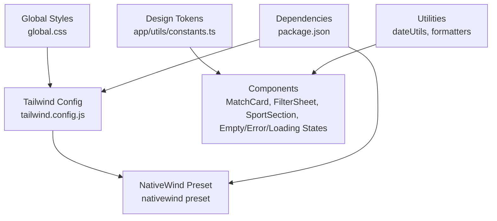
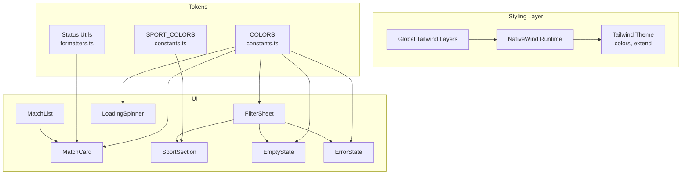
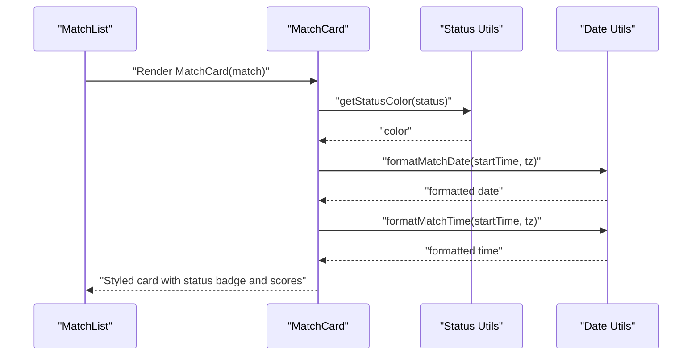
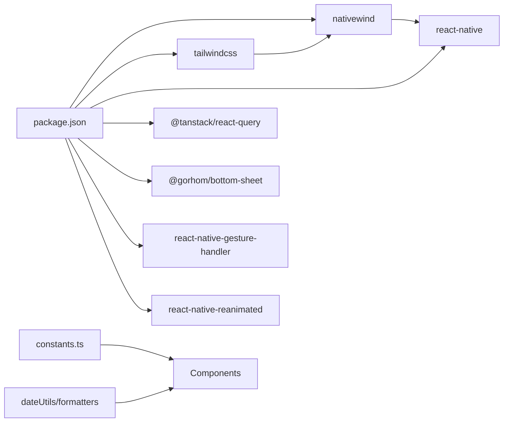

# Styling and Theming

<cite>
**Referenced Files in This Document**
- [tailwind.config.js](file://tailwind.config.js)
- [global.css](file://global.css)
- [nativewind-env.d.ts](file://nativewind-env.d.ts)
- [package.json](file://package.json)
- [app/utils/constants.ts](file://app/utils/constants.ts)
- [app/utils/dateUtils.ts](file://app/utils/dateUtils.ts)
- [app/utils/formatters.ts](file://app/utils/formatters.ts)
- [app/context/FilterContext.tsx](file://app/context/FilterContext.tsx)
- [app/components/common/EmptyState.tsx](file://app/components/common/EmptyState.tsx)
- [app/components/common/ErrorState.tsx](file://app/components/common/ErrorState.tsx)
- [app/components/common/LoadingSpinner.tsx](file://app/components/common/LoadingSpinner.tsx)
- [app/components/match/MatchCard.tsx](file://app/components/match/MatchCard.tsx)
- [app/components/match/MatchList.tsx](file://app/components/match/MatchList.tsx)
- [app/components/filter/FilterSheet.tsx](file://app/components/filter/FilterSheet.tsx)
- [app/components/filter/SportSection.tsx](file://app/components/filter/SportSection.tsx)
</cite>

## Table of Contents
1. [Introduction](#introduction)
2. [Project Structure](#project-structure)
3. [Core Components](#core-components)
4. [Architecture Overview](#architecture-overview)
5. [Detailed Component Analysis](#detailed-component-analysis)
6. [Dependency Analysis](#dependency-analysis)
7. [Performance Considerations](#performance-considerations)
8. [Troubleshooting Guide](#troubleshooting-guide)
9. [Conclusion](#conclusion)
10. [Appendices](#appendices)

## Introduction
This document explains the styling and theming system for the React Native sports match application. It covers how Tailwind CSS via NativeWind is configured and used across components, the color scheme and tokens, typography and spacing conventions, dark/light mode readiness, platform-specific styling considerations, accessibility-friendly patterns, component styling approaches, animation and interactive state styling, performance optimization strategies, and guidelines for extending the design system.

## Project Structure
The styling pipeline is built around:
- Tailwind CSS configuration for React Native via NativeWind
- Global Tailwind layers applied at the root
- Design tokens centralized in constants
- Component-level styling using Tailwind utility classes and inline styles for dynamic values
- Utility modules for status and date/time formatting

**Diagram sources**
- [tailwind.config.js](file://tailwind.config.js#L1-L21)
- [global.css](file://global.css#L1-L4)
- [nativewind-env.d.ts](file://nativewind-env.d.ts#L1-L2)
- [package.json](file://package.json#L13-L49)
- [app/utils/constants.ts](file://app/utils/constants.ts#L6-L21)
- [app/utils/dateUtils.ts](file://app/utils/dateUtils.ts#L1-L64)
- [app/utils/formatters.ts](file://app/utils/formatters.ts#L1-L47)

**Section sources**
- [tailwind.config.js](file://tailwind.config.js#L1-L21)
- [global.css](file://global.css#L1-L4)
- [nativewind-env.d.ts](file://nativewind-env.d.ts#L1-L2)
- [package.json](file://package.json#L13-L49)

## Core Components
- Color system: Centralized palette and sport-specific colors are defined as immutable tokens and consumed by components and utilities.
- Typography: Consistent use of semantic font sizes and weights across components.
- Spacing: Standardized padding and margin via Tailwind utilities; dynamic spacing handled with inline styles when needed.
- Interactive states: Pressables and active states use Tailwind utilities; haptic feedback complements touch interactions.

Key token and utility locations:
- Color tokens and sport colors: [app/utils/constants.ts](file://app/utils/constants.ts#L6-L29)
- Status color mapping and labels: [app/utils/formatters.ts](file://app/utils/formatters.ts#L22-L46)
- Date/time formatting helpers: [app/utils/dateUtils.ts](file://app/utils/dateUtils.ts#L4-L20)

**Section sources**
- [app/utils/constants.ts](file://app/utils/constants.ts#L6-L29)
- [app/utils/formatters.ts](file://app/utils/formatters.ts#L22-L46)
- [app/utils/dateUtils.ts](file://app/utils/dateUtils.ts#L4-L20)

## Architecture Overview
The styling architecture integrates Tailwind via NativeWind with React Native primitives. Components apply Tailwind classes for layout and static styles, while dynamic values (like colors derived from tokens or statuses) are applied via inline styles. Utilities encapsulate status and date formatting, ensuring consistent presentation.

**Diagram sources**
- [tailwind.config.js](file://tailwind.config.js#L12-L18)
- [global.css](file://global.css#L1-L4)
- [app/utils/constants.ts](file://app/utils/constants.ts#L6-L29)
- [app/utils/formatters.ts](file://app/utils/formatters.ts#L22-L46)
- [app/components/match/MatchCard.tsx](file://app/components/match/MatchCard.tsx#L1-L142)
- [app/components/match/MatchList.tsx](file://app/components/match/MatchList.tsx#L1-L117)
- [app/components/filter/FilterSheet.tsx](file://app/components/filter/FilterSheet.tsx#L1-L128)
- [app/components/filter/SportSection.tsx](file://app/components/filter/SportSection.tsx#L1-L82)
- [app/components/common/EmptyState.tsx](file://app/components/common/EmptyState.tsx#L1-L52)
- [app/components/common/ErrorState.tsx](file://app/components/common/ErrorState.tsx#L1-L49)
- [app/components/common/LoadingSpinner.tsx](file://app/components/common/LoadingSpinner.tsx#L1-L22)

## Detailed Component Analysis

### NativeWind and Tailwind Integration
- Configuration: Tailwind content scanning includes app directories and the preset is enabled for React Native.
- Global layers: Base, components, and utilities are included globally to ensure consistent styling across the app.
- Type safety: A declaration file references NativeWind types for improved DX.

Implementation references:
- [tailwind.config.js](file://tailwind.config.js#L3-L10)
- [tailwind.config.js](file://tailwind.config.js#L11-L11)
- [global.css](file://global.css#L1-L4)
- [nativewind-env.d.ts](file://nativewind-env.d.ts#L1-L2)

**Section sources**
- [tailwind.config.js](file://tailwind.config.js#L3-L10)
- [tailwind.config.js](file://tailwind.config.js#L11-L11)
- [global.css](file://global.css#L1-L4)
- [nativewind-env.d.ts](file://nativewind-env.d.ts#L1-L2)

### Color Scheme and Design Tokens
- Centralized tokens define primary, secondary, backgrounds, surfaces, text, borders, and status colors.
- Sport-specific colors are mapped per sport ID for visual consistency in lists and sections.
- Dynamic colors (e.g., status badges) derive from tokens and status labels.

References:
- [app/utils/constants.ts](file://app/utils/constants.ts#L6-L21)
- [app/utils/constants.ts](file://app/utils/constants.ts#L23-L29)
- [app/utils/formatters.ts](file://app/utils/formatters.ts#L22-L33)

**Section sources**
- [app/utils/constants.ts](file://app/utils/constants.ts#L6-L21)
- [app/utils/constants.ts](file://app/utils/constants.ts#L23-L29)
- [app/utils/formatters.ts](file://app/utils/formatters.ts#L22-L33)

### Typography System
- Semantic font sizes and weights are used consistently across components (e.g., bold headers, medium labels, small captions).
- Text truncation and capitalization utilities support readable content in constrained spaces.

References:
- [app/utils/formatters.ts](file://app/utils/formatters.ts#L1-L9)

**Section sources**
- [app/utils/formatters.ts](file://app/utils/formatters.ts#L1-L9)

### Spacing Conventions
- Padding and margins are applied using Tailwind utilities for consistent rhythm.
- Dynamic spacing is handled via inline styles when component props require it (e.g., container padding in lists).

References:
- [app/components/match/MatchList.tsx](file://app/components/match/MatchList.tsx#L90-L112)
- [app/components/common/EmptyState.tsx](file://app/components/common/EmptyState.tsx#L22-L28)

**Section sources**
- [app/components/match/MatchList.tsx](file://app/components/match/MatchList.tsx#L90-L112)
- [app/components/common/EmptyState.tsx](file://app/components/common/EmptyState.tsx#L22-L28)

### Dark/Light Mode Support
- Current implementation uses light-mode tokens and explicit color values.
- To add dark mode:
  - Extend the Tailwind theme with a dark variant and map tokens to dark equivalents.
  - Use a system preference hook to toggle a theme class on the root element.
  - Update components to consume theme-aware tokens.

References:
- [tailwind.config.js](file://tailwind.config.js#L12-L18)

**Section sources**
- [tailwind.config.js](file://tailwind.config.js#L12-L18)

### Platform-Specific Styling Considerations
- Android elevation shadows are applied via inline styles for depth cues.
- Platform differences are managed by React Native’s style engine; keep platform-specific overrides minimal and centralized.

References:
- [app/components/match/MatchCard.tsx](file://app/components/match/MatchCard.tsx#L27-L27)

**Section sources**
- [app/components/match/MatchCard.tsx](file://app/components/match/MatchCard.tsx#L27-L27)

### Accessibility-Friendly Patterns
- Sufficient color contrast between foreground and background tokens.
- Touch targets sized appropriately using padding utilities.
- Focus and active states indicated via pressed backgrounds and haptic feedback.

References:
- [app/components/filter/SportSection.tsx](file://app/components/filter/SportSection.tsx#L51-L51)
- [app/utils/constants.ts](file://app/utils/constants.ts#L6-L21)

**Section sources**
- [app/components/filter/SportSection.tsx](file://app/components/filter/SportSection.tsx#L51-L51)
- [app/utils/constants.ts](file://app/utils/constants.ts#L6-L21)

### Component Styling Approaches
- Static layout and spacing via Tailwind classes.
- Dynamic colors and sizes via inline styles using tokens and computed values.
- Interactive states via active classes and pressable backgrounds.

References:
- [app/components/common/EmptyState.tsx](file://app/components/common/EmptyState.tsx#L22-L46)
- [app/components/common/ErrorState.tsx](file://app/components/common/ErrorState.tsx#L18-L43)
- [app/components/filter/FilterSheet.tsx](file://app/components/filter/FilterSheet.tsx#L63-L121)
- [app/components/filter/SportSection.tsx](file://app/components/filter/SportSection.tsx#L40-L74)

**Section sources**
- [app/components/common/EmptyState.tsx](file://app/components/common/EmptyState.tsx#L22-L46)
- [app/components/common/ErrorState.tsx](file://app/components/common/ErrorState.tsx#L18-L43)
- [app/components/filter/FilterSheet.tsx](file://app/components/filter/FilterSheet.tsx#L63-L121)
- [app/components/filter/SportSection.tsx](file://app/components/filter/SportSection.tsx#L40-L74)

### Animation Systems and Interactive State Styling
- Animated loading spinner uses a token-derived color.
- Bottom sheet overlays and list interactions leverage Reanimated/Gesture Handler for smooth animations.
- Haptic feedback enhances tactile response for selections.

References:
- [app/components/common/LoadingSpinner.tsx](file://app/components/common/LoadingSpinner.tsx#L10-L19)
- [package.json](file://package.json#L42-L47)
- [app/components/filter/SportSection.tsx](file://app/components/filter/SportSection.tsx#L47-L49)

**Section sources**
- [app/components/common/LoadingSpinner.tsx](file://app/components/common/LoadingSpinner.tsx#L10-L19)
- [package.json](file://package.json#L42-L47)
- [app/components/filter/SportSection.tsx](file://app/components/filter/SportSection.tsx#L47-L49)

### Responsive Design Patterns
- Tailwind utilities are used for responsive layouts (e.g., flex directions, text sizing).
- Lists adapt to viewport with padding and scroll indicators.
- No media queries are used; responsiveness is achieved via utility-first classes.

References:
- [app/components/match/MatchCard.tsx](file://app/components/match/MatchCard.tsx#L30-L47)
- [app/components/match/MatchList.tsx](file://app/components/match/MatchList.tsx#L90-L112)

**Section sources**
- [app/components/match/MatchCard.tsx](file://app/components/match/MatchCard.tsx#L30-L47)
- [app/components/match/MatchList.tsx](file://app/components/match/MatchList.tsx#L90-L112)

### Status and Date Formatting Styling
- Status badges use dynamic colors and labels derived from status utilities.
- Date/time formatting ensures consistent display across timezones.

References:
- [app/utils/formatters.ts](file://app/utils/formatters.ts#L22-L46)
- [app/utils/dateUtils.ts](file://app/utils/dateUtils.ts#L4-L20)

**Section sources**
- [app/utils/formatters.ts](file://app/utils/formatters.ts#L22-L46)
- [app/utils/dateUtils.ts](file://app/utils/dateUtils.ts#L4-L20)

### Example: Match Card Rendering Flow

**Diagram sources**
- [app/components/match/MatchList.tsx](file://app/components/match/MatchList.tsx#L38-L40)
- [app/components/match/MatchCard.tsx](file://app/components/match/MatchCard.tsx#L15-L136)
- [app/utils/formatters.ts](file://app/utils/formatters.ts#L22-L46)
- [app/utils/dateUtils.ts](file://app/utils/dateUtils.ts#L4-L20)

## Dependency Analysis
- NativeWind and Tailwind CSS are declared as dependencies and integrated via the preset.
- Components depend on design tokens and utilities for consistent styling.
- Bottom sheet and list components rely on gesture and animation libraries for smooth interactions.

**Diagram sources**
- [package.json](file://package.json#L13-L49)
- [app/utils/constants.ts](file://app/utils/constants.ts#L6-L29)
- [app/utils/dateUtils.ts](file://app/utils/dateUtils.ts#L1-L64)
- [app/utils/formatters.ts](file://app/utils/formatters.ts#L1-L47)

**Section sources**
- [package.json](file://package.json#L13-L49)

## Performance Considerations
- Prefer Tailwind utilities for static styles to reduce inline style overhead.
- Memoize rendering callbacks in lists to avoid unnecessary re-renders.
- Use skeleton loaders and placeholders to maintain perceived performance.
- Keep inline styles minimal; reserve for dynamic values only.
- Batch list rendering and adjust window sizes for large lists.

References:
- [app/components/match/MatchList.tsx](file://app/components/match/MatchList.tsx#L38-L44)
- [app/components/match/MatchList.tsx](file://app/components/match/MatchList.tsx#L108-L112)

**Section sources**
- [app/components/match/MatchList.tsx](file://app/components/match/MatchList.tsx#L38-L44)
- [app/components/match/MatchList.tsx](file://app/components/match/MatchList.tsx#L108-L112)

## Troubleshooting Guide
- Tailwind classes not applying:
  - Verify content paths in the Tailwind config include all component directories.
  - Ensure the global Tailwind layers are imported at the root.
- Dynamic colors not updating:
  - Confirm tokens and status utilities are returning expected values.
  - Check inline style usage for dynamic colors.
- Dark mode visuals:
  - Add a dark variant in the Tailwind theme and toggle a theme class on the root element.

References:
- [tailwind.config.js](file://tailwind.config.js#L3-L10)
- [global.css](file://global.css#L1-L4)
- [app/utils/formatters.ts](file://app/utils/formatters.ts#L22-L33)

**Section sources**
- [tailwind.config.js](file://tailwind.config.js#L3-L10)
- [global.css](file://global.css#L1-L4)
- [app/utils/formatters.ts](file://app/utils/formatters.ts#L22-L33)

## Conclusion
The application employs a clean, utility-first styling approach powered by Tailwind via NativeWind. Design tokens ensure consistency, while utilities and inline styles handle dynamic needs. The system is structured to support future enhancements like dark mode, improved accessibility, and scalable component styling patterns.

## Appendices

### Extending the Design System
- Add new tokens to the centralized constants file.
- Extend Tailwind theme for additional colors or spacing scales.
- Introduce new status categories and update status utilities accordingly.
- Create reusable component wrappers that encapsulate common styling patterns.

References:
- [app/utils/constants.ts](file://app/utils/constants.ts#L6-L29)
- [tailwind.config.js](file://tailwind.config.js#L12-L18)
- [app/utils/formatters.ts](file://app/utils/formatters.ts#L22-L46)

**Section sources**
- [app/utils/constants.ts](file://app/utils/constants.ts#L6-L29)
- [tailwind.config.js](file://tailwind.config.js#L12-L18)
- [app/utils/formatters.ts](file://app/utils/formatters.ts#L22-L46)