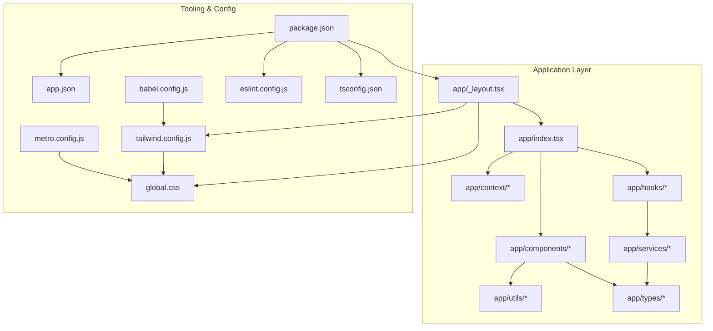
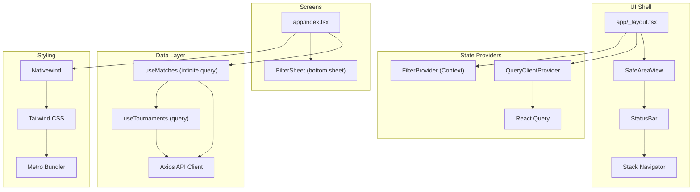
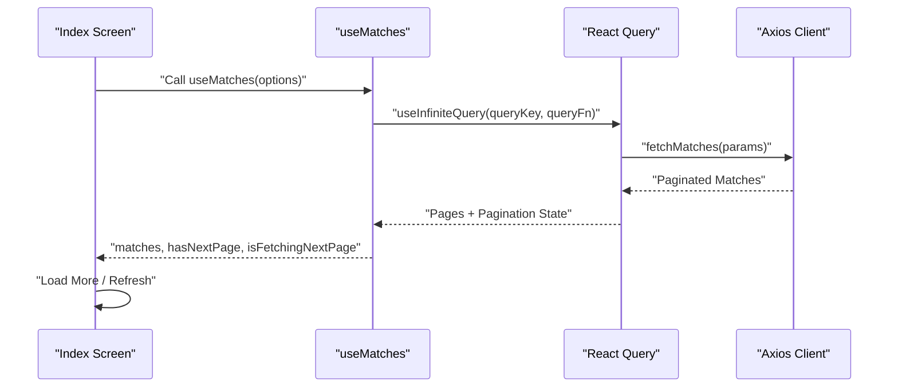
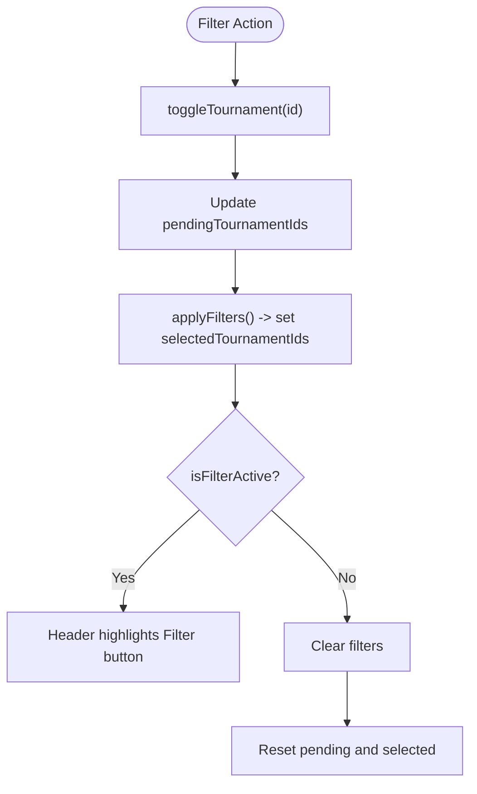
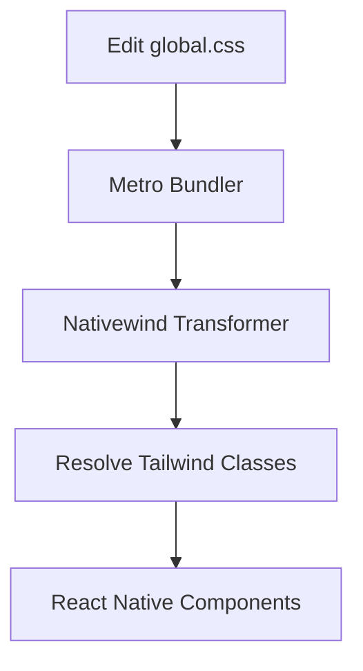
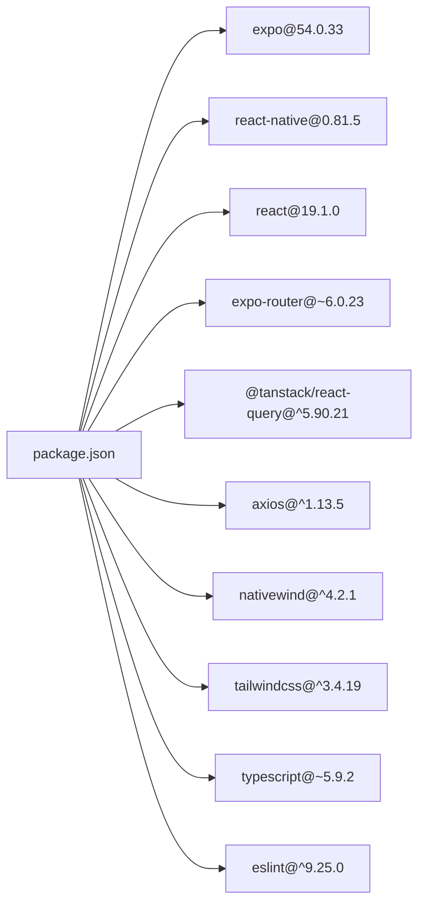

# Technology Stack

<cite>
**Referenced Files in This Document**
- [package.json](file://package.json)
- [app.json](file://app.json)
- [babel.config.js](file://babel.config.js)
- [metro.config.js](file://metro.config.js)
- [tailwind.config.js](file://tailwind.config.js)
- [eslint.config.js](file://eslint.config.js)
- [tsconfig.json](file://tsconfig.json)
- [global.css](file://global.css)
- [app/_layout.tsx](file://app/_layout.tsx)
- [app/index.tsx](file://app/index.tsx)
- [app/context/FilterContext.tsx](file://app/context/FilterContext.tsx)
- [app/hooks/useMatches.ts](file://app/hooks/useMatches.ts)
- [app/hooks/useTournaments.ts](file://app/hooks/useTournaments.ts)
- [app/services/api.ts](file://app/services/api.ts)
- [app/utils/constants.ts](file://app/utils/constants.ts)
- [app/utils/formatters.ts](file://app/utils/formatters.ts)
- [app/types/match.ts](file://app/types/match.ts)
- [app/types/tournament.ts](file://app/types/tournament.ts)
</cite>

## Table of Contents
1. [Introduction](#introduction)
2. [Project Structure](#project-structure)
3. [Core Components](#core-components)
4. [Architecture Overview](#architecture-overview)
5. [Detailed Component Analysis](#detailed-component-analysis)
6. [Dependency Analysis](#dependency-analysis)
7. [Performance Considerations](#performance-considerations)
8. [Troubleshooting Guide](#troubleshooting-guide)
9. [Conclusion](#conclusion)
10. [Appendices](#appendices)

## Introduction
This document provides comprehensive technology stack documentation for the React Native sports match application. It covers the framework foundation (React Native 0.81.5 with Expo 54.0.33), state management (React Query for server state caching and Context API for local state), styling (NativeWind/Tailwind CSS for React Native), and developer tooling (TypeScript, Babel, Metro bundler, ESLint). It also includes version compatibility insights, dependency relationships, platform-specific considerations for iOS and Android, and practical guidance for maintainability and performance.

## Project Structure
The project follows an Expo Router-based structure with a clear separation of concerns:
- Application entry and routing are configured via app/_layout.tsx and app.json.
- UI components are organized under app/components, with feature-based grouping (match, filter, common).
- State management is split between React Query (server state) and React Context (local UI state).
- Services encapsulate HTTP requests using Axios.
- Utilities and types define constants, formatters, and shared TypeScript interfaces.
- Styling is powered by Tailwind CSS via NativeWind, with a global CSS entry and Metro integration.

**Diagram sources**
- [app/_layout.tsx](file://app/_layout.tsx#L1-L35)
- [app/index.tsx](file://app/index.tsx#L1-L108)
- [app.json](file://app.json#L1-L50)
- [tailwind.config.js](file://tailwind.config.js#L1-L21)
- [global.css](file://global.css#L1-L4)
- [metro.config.js](file://metro.config.js#L1-L7)
- [babel.config.js](file://babel.config.js#L1-L10)
- [eslint.config.js](file://eslint.config.js#L1-L11)
- [tsconfig.json](file://tsconfig.json#L1-L18)
- [package.json](file://package.json#L1-L59)

**Section sources**
- [package.json](file://package.json#L1-L59)
- [app.json](file://app.json#L1-L50)
- [app/_layout.tsx](file://app/_layout.tsx#L1-L35)

## Core Components
- React Native 0.81.5 with Expo 54.0.33: Provides cross-platform runtime, navigation, device APIs, and build tooling. Expo Router enables file-based routing, while app.json configures platform-specific settings and experiments.
- React Query (@tanstack/react-query): Implements server state caching, pagination, retries, and stale-while-revalidate behavior for match and tournament lists.
- Context API (React Context): Manages local UI state for filters with a dedicated provider and hook.
- NativeWind/Tailwind CSS: Enables utility-first styling on React Native via Tailwind directives and Metro/Nativewind integration.
- TypeScript: Ensures type safety across services, hooks, and UI components.
- Babel: Transpiles JSX and integrates Nativewind for Tailwind class support.
- Metro Bundler: Resolves modules and integrates with Nativewind for CSS processing.
- ESLint: Enforces code quality and consistency aligned with Expo’s recommended configuration.

**Section sources**
- [package.json](file://package.json#L13-L49)
- [app/_layout.tsx](file://app/_layout.tsx#L10-L17)
- [app/context/FilterContext.tsx](file://app/context/FilterContext.tsx#L1-L72)
- [babel.config.js](file://babel.config.js#L1-L10)
- [metro.config.js](file://metro.config.js#L1-L7)
- [tailwind.config.js](file://tailwind.config.js#L1-L21)
- [eslint.config.js](file://eslint.config.js#L1-L11)
- [tsconfig.json](file://tsconfig.json#L1-L18)

## Architecture Overview
The application architecture centers around a single-screen layout that hosts a match list and a bottom sheet filter. React Query manages server state, while Context API handles local UI state. Styling is applied via Tailwind classes processed by Nativewind during Metro bundling.

**Diagram sources**
- [app/_layout.tsx](file://app/_layout.tsx#L1-L35)
- [app/index.tsx](file://app/index.tsx#L1-L108)
- [app/hooks/useMatches.ts](file://app/hooks/useMatches.ts#L1-L56)
- [app/hooks/useTournaments.ts](file://app/hooks/useTournaments.ts#L1-L45)
- [app/services/api.ts](file://app/services/api.ts#L1-L40)
- [babel.config.js](file://babel.config.js#L1-L10)
- [metro.config.js](file://metro.config.js#L1-L7)
- [tailwind.config.js](file://tailwind.config.js#L1-L21)

## Detailed Component Analysis

### React Native + Expo Runtime
- Version alignment: React Native 0.81.5 paired with Expo 54.0.33 ensures compatibility with modern React features and Expo ecosystem tooling.
- Routing: Expo Router is configured as the entry point and used for file-based routing.
- Platform configuration: app.json defines orientation, icons, scheme, user interface style, and platform-specific options such as adaptive icons, edge-to-edge behavior, and web bundler selection.

**Section sources**
- [package.json](file://package.json#L25-L31)
- [app.json](file://app.json#L1-L50)

### State Management: React Query (Server State)
- Provider setup: A QueryClient with default retry and staleTime is initialized in the root layout.
- Infinite pagination: useMatches implements infinite scrolling with getNextPageParam and controlled query keys.
- Query defaults: staleTime and garbage collection time are tuned for efficient cache reuse.
- Related query: useTournaments fetches static lists with configurable staleTime and lazy enablement.

**Diagram sources**
- [app/index.tsx](file://app/index.tsx#L15-L39)
- [app/hooks/useMatches.ts](file://app/hooks/useMatches.ts#L21-L41)
- [app/services/api.ts](file://app/services/api.ts#L1-L40)

**Section sources**
- [app/_layout.tsx](file://app/_layout.tsx#L10-L17)
- [app/hooks/useMatches.ts](file://app/hooks/useMatches.ts#L1-L56)
- [app/hooks/useTournaments.ts](file://app/hooks/useTournaments.ts#L1-L45)
- [app/services/api.ts](file://app/services/api.ts#L1-L40)

### Local State: Context API
- Provider: FilterProvider maintains two sets of tournament selections: current filters and pending changes.
- Actions: toggleTournament, selectTournaments, clearFilters, and applyFilters manage UI-driven filtering.
- Consumption: useFilter exposes state and actions to components, enforcing provider presence with a guard hook.

**Diagram sources**
- [app/context/FilterContext.tsx](file://app/context/FilterContext.tsx#L20-L63)

**Section sources**
- [app/context/FilterContext.tsx](file://app/context/FilterContext.tsx#L1-L72)

### Styling: NativeWind + Tailwind CSS
- Global CSS: global.css imports Tailwind base, components, and utilities.
- Metro integration: metro.config.js wraps the default config with withNativeWind and specifies the input CSS file.
- Babel integration: babel.config.js configures babel-preset-expo with jsxImportSource pointing to nativewind and adds nativewind/babel.
- Tailwind configuration: tailwind.config.js includes app directories and applies the Nativewind preset with a custom primary color extension.

**Diagram sources**
- [global.css](file://global.css#L1-L4)
- [metro.config.js](file://metro.config.js#L1-L7)
- [babel.config.js](file://babel.config.js#L1-L10)
- [tailwind.config.js](file://tailwind.config.js#L1-L21)

**Section sources**
- [global.css](file://global.css#L1-L4)
- [metro.config.js](file://metro.config.js#L1-L7)
- [babel.config.js](file://babel.config.js#L1-L10)
- [tailwind.config.js](file://tailwind.config.js#L1-L21)

### Developer Tooling
- TypeScript: Strict mode enabled; path aliases configured for clean imports; included TS/TSX files plus Expo and Nativewind env typings.
- ESLint: Flat config extends eslint-config-expo with project ignores.
- Babel: Uses babel-preset-expo with Nativewind JSX import source and Nativewind Babel plugin.
- Metro: Integrates with Nativewind for CSS processing and supports web bundler selection.

**Section sources**
- [tsconfig.json](file://tsconfig.json#L1-L18)
- [eslint.config.js](file://eslint.config.js#L1-L11)
- [babel.config.js](file://babel.config.js#L1-L10)
- [metro.config.js](file://metro.config.js#L1-L7)
- [app.json](file://app.json#L24-L28)

### Data Types and Utilities
- Types: Strongly typed match and tournament interfaces define API contracts and UI rendering expectations.
- Constants: Centralized API base URL, media base URL, default timezone, page size, and color palettes.
- Formatters: Utility functions for truncation, capitalization, team initials, and status mapping.

**Section sources**
- [app/types/match.ts](file://app/types/match.ts#L1-L46)
- [app/types/tournament.ts](file://app/types/tournament.ts#L1-L31)
- [app/utils/constants.ts](file://app/utils/constants.ts#L1-L38)
- [app/utils/formatters.ts](file://app/utils/formatters.ts#L1-L47)

## Dependency Analysis
The following diagram outlines major dependencies and their roles in the application stack.

**Diagram sources**
- [package.json](file://package.json#L13-L49)

**Section sources**
- [package.json](file://package.json#L1-L59)

## Performance Considerations
- React Query caching: Configure staleTime and gcTime to balance freshness and memory usage. Infinite queries should leverage getNextPageParam to avoid unnecessary re-fetches.
- Network timeouts: Set appropriate request timeouts in the Axios client to prevent hanging requests.
- Metro/Nativewind: Keep content globs in Tailwind configuration minimal to reduce rebuild scope; ensure only necessary files include Tailwind classes.
- Platform optimizations: Enable edge-to-edge on Android and tablet support on iOS as configured to improve UX and reduce layout workarounds.
- Type safety: Strict TypeScript settings help catch performance-related regressions early.

[No sources needed since this section provides general guidance]

## Troubleshooting Guide
- API errors: Centralized Axios interceptor logs structured error info including status and URL; surface user-friendly messages from the response payload.
- ESLint issues: Use the provided flat config; resolve ignores and ensure editor integration aligns with the project’s ESLint setup.
- Metro/Nativewind: If styles do not apply, verify Metro is configured with withNativeWind and the global CSS input path; ensure Tailwind content globs include component files.
- TypeScript diagnostics: Enable strict mode and path aliases to catch type mismatches early; include generated env typings in the TS include list.

**Section sources**
- [app/services/api.ts](file://app/services/api.ts#L22-L37)
- [eslint.config.js](file://eslint.config.js#L1-L11)
- [metro.config.js](file://metro.config.js#L1-L7)
- [tailwind.config.js](file://tailwind.config.js#L4-L10)
- [tsconfig.json](file://tsconfig.json#L3-L17)

## Conclusion
The application leverages a modern, cohesive React Native + Expo stack with robust tooling. React Query and Context API provide complementary state management strengths—server caching and local UI state—while NativeWind/Tailwind CSS delivers a scalable, responsive styling system. TypeScript, Babel, Metro, and ESLint collectively ensure type safety, efficient builds, and code quality. Platform-specific configurations in app.json tailor the experience for iOS and Android.

[No sources needed since this section summarizes without analyzing specific files]

## Appendices

### Version Compatibility Matrix
- React Native: 0.81.5
- Expo: 54.0.33
- Expo Router: ~6.0.23
- React Query: ^5.90.21
- NativeWind: ^4.2.1
- Tailwind CSS: ^3.4.19
- TypeScript: ~5.9.2
- ESLint: ^9.25.0

**Section sources**
- [package.json](file://package.json#L25-L49)
- [app.json](file://app.json#L1-L50)

### Platform-Specific Considerations
- iOS: Supports tablet; user interface style is automatic; scheme and orientation configured centrally.
- Android: Adaptive icons enabled; edge-to-edge enabled; predictive back gesture disabled; splash screen plugin configured.
- Web: Static output with Metro bundler; suitable for development and deployment scenarios.

**Section sources**
- [app.json](file://app.json#L11-L28)