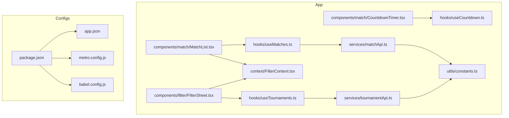
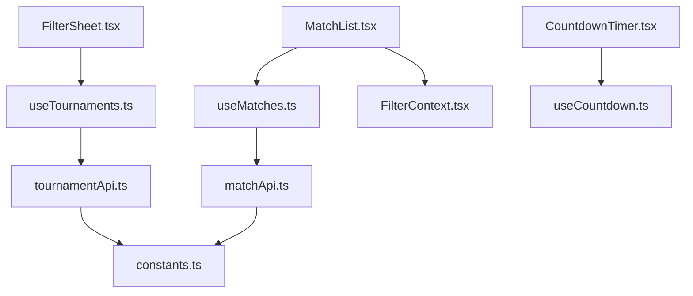

# Testing and Deployment

<cite>
**Referenced Files in This Document**
- [package.json](file://package.json)
- [app.json](file://app.json)
- [README.md](file://README.md)
- [metro.config.js](file://metro.config.js)
- [babel.config.js](file://babel.config.js)
- [app/hooks/useMatches.ts](file://app/hooks/useMatches.ts)
- [app/hooks/useTournaments.ts](file://app/hooks/useTournaments.ts)
- [app/hooks/useCountdown.ts](file://app/hooks/useCountdown.ts)
- [app/services/matchApi.ts](file://app/services/matchApi.ts)
- [app/services/tournamentApi.ts](file://app/services/tournamentApi.ts)
- [app/context/FilterContext.tsx](file://app/context/FilterContext.tsx)
- [app/components/match/MatchList.tsx](file://app/components/match/MatchList.tsx)
- [app/components/filter/FilterSheet.tsx](file://app/components/filter/FilterSheet.tsx)
- [app/components/match/CountdownTimer.tsx](file://app/components/match/CountdownTimer.tsx)
- [app/utils/constants.ts](file://app/utils/constants.ts)
</cite>

## Table of Contents
1. [Introduction](#introduction)
2. [Project Structure](#project-structure)
3. [Core Components](#core-components)
4. [Architecture Overview](#architecture-overview)
5. [Manual Testing Checklist](#manual-testing-checklist)
6. [API Testing Procedures](#api-testing-procedures)
7. [Build and Distribution](#build-and-distribution)
8. [Production Optimization](#production-optimization)
9. [Continuous Integration and Automated Testing](#continuous-integration-and-automated-testing)
10. [Troubleshooting Guide](#troubleshooting-guide)
11. [Conclusion](#conclusion)

## Introduction
This document provides comprehensive testing and deployment guidance for the React Native sports match application. It covers manual testing procedures for infinite scroll, countdown timer accuracy, filter application, pull-to-refresh, and responsive design validation. It also documents API testing using curl commands, the build process for Android APK and iOS using EAS CLI, production optimization strategies, bundle analysis, performance profiling, CI setup, and troubleshooting common issues.

## Project Structure
The project follows an Expo Router-based file structure with feature-based organization:
- app/components: Reusable UI components (match list, countdown timer, filter sheet)
- app/hooks: Custom hooks for data fetching and timers
- app/services: API clients and service functions
- app/types: TypeScript type definitions
- app/utils: Constants, formatters, and helpers
- app/context: React Context for filter state
- Root configuration files define app metadata, bundler, and plugins

**Diagram sources**
- [app/components/match/MatchList.tsx](file://app/components/match/MatchList.tsx#L1-L117)
- [app/components/match/CountdownTimer.tsx](file://app/components/match/CountdownTimer.tsx#L1-L43)
- [app/components/filter/FilterSheet.tsx](file://app/components/filter/FilterSheet.tsx#L1-L128)
- [app/hooks/useMatches.ts](file://app/hooks/useMatches.ts#L1-L56)
- [app/hooks/useTournaments.ts](file://app/hooks/useTournaments.ts#L1-L45)
- [app/hooks/useCountdown.ts](file://app/hooks/useCountdown.ts#L1-L54)
- [app/services/matchApi.ts](file://app/services/matchApi.ts#L1-L36)
- [app/services/tournamentApi.ts](file://app/services/tournamentApi.ts#L1-L35)
- [app/context/FilterContext.tsx](file://app/context/FilterContext.tsx#L1-L72)
- [app/utils/constants.ts](file://app/utils/constants.ts#L1-L38)
- [package.json](file://package.json#L1-L59)
- [app.json](file://app.json#L1-L50)
- [metro.config.js](file://metro.config.js#L1-L7)
- [babel.config.js](file://babel.config.js#L1-L10)

**Section sources**
- [README.md](file://README.md#L54-L92)
- [package.json](file://package.json#L1-L59)
- [app.json](file://app.json#L1-L50)
- [metro.config.js](file://metro.config.js#L1-L7)
- [babel.config.js](file://babel.config.js#L1-L10)

## Core Components
This section highlights the key components and their roles in testing and deployment.

- MatchList: Renders the list of matches with infinite scroll, pull-to-refresh, loading, empty, and error states. It uses FlatList with performance optimizations and exposes callbacks for refresh and load-more.
- CountdownTimer: Displays live or upcoming countdown using a hook that leverages requestAnimationFrame and timezone-aware calculations.
- FilterSheet: Provides a bottom-sheet interface to select tournaments, manage pending selections, and apply filters.
- useMatches: Implements infinite pagination via React Query with limit/offset and handles next-page computation.
- useTournaments: Fetches sports and tournaments for filtering with configurable stale/gc times.
- useCountdown: Computes countdown display and expiration with periodic updates.
- APIs: matchApi and tournamentApi construct query parameters and return normalized responses.

**Section sources**
- [app/components/match/MatchList.tsx](file://app/components/match/MatchList.tsx#L1-L117)
- [app/components/match/CountdownTimer.tsx](file://app/components/match/CountdownTimer.tsx#L1-L43)
- [app/components/filter/FilterSheet.tsx](file://app/components/filter/FilterSheet.tsx#L1-L128)
- [app/hooks/useMatches.ts](file://app/hooks/useMatches.ts#L1-L56)
- [app/hooks/useTournaments.ts](file://app/hooks/useTournaments.ts#L1-L45)
- [app/hooks/useCountdown.ts](file://app/hooks/useCountdown.ts#L1-L54)
- [app/services/matchApi.ts](file://app/services/matchApi.ts#L1-L36)
- [app/services/tournamentApi.ts](file://app/services/tournamentApi.ts#L1-L35)

## Architecture Overview
The app architecture integrates UI components, hooks for data fetching, API services, and context for filters. The build system uses Metro with NativeWind and Babel preset for JSX transform.

**Diagram sources**
- [app/components/match/MatchList.tsx](file://app/components/match/MatchList.tsx#L1-L117)
- [app/components/match/CountdownTimer.tsx](file://app/components/match/CountdownTimer.tsx#L1-L43)
- [app/components/filter/FilterSheet.tsx](file://app/components/filter/FilterSheet.tsx#L1-L128)
- [app/hooks/useMatches.ts](file://app/hooks/useMatches.ts#L1-L56)
- [app/hooks/useTournaments.ts](file://app/hooks/useTournaments.ts#L1-L45)
- [app/hooks/useCountdown.ts](file://app/hooks/useCountdown.ts#L1-L54)
- [app/context/FilterContext.tsx](file://app/context/FilterContext.tsx#L1-L72)
- [app/services/matchApi.ts](file://app/services/matchApi.ts#L1-L36)
- [app/services/tournamentApi.ts](file://app/services/tournamentApi.ts#L1-L35)
- [app/utils/constants.ts](file://app/utils/constants.ts#L1-L38)

## Manual Testing Checklist
Perform the following checks on device/emulator after building locally:

- Infinite scroll
  - Open the app and scroll down until the list triggers the next page.
  - Verify the loader appears while fetching and the list grows.
  - Confirm pagination uses limit/offset and total count logic.
  - Validate that the list stops when reaching the end.

- Countdown timer accuracy
  - Observe countdown updates every second for upcoming matches.
  - Verify “LIVE” indicator appears when match status indicates live.
  - Confirm “Started” is shown when the target time has passed.
  - Test across different timezones to ensure correct display.

- Filter application
  - Open the filter sheet and toggle multiple tournaments.
  - Apply filters and confirm the list updates immediately.
  - Clear filters and verify the original list is restored.
  - Test reset button and selection persistence.

- Pull-to-refresh behavior
  - Pull down to refresh and verify the list reloads data.
  - While refreshing, ensure the UI reflects loading state.
  - On error, verify the error state displays and retry works.

- Responsive design validation
  - Rotate device and resize simulator windows.
  - Confirm layout adapts to portrait/tablet modes.
  - Check spacing, typography scaling, and touch targets remain usable.

- Edge cases
  - Empty state: With filters applied or no matches, verify appropriate messaging.
  - Error state: Simulate network failure and confirm error UI and retry.
  - Large lists: Ensure smooth scrolling and memory usage remain acceptable.

**Section sources**
- [app/components/match/MatchList.tsx](file://app/components/match/MatchList.tsx#L83-L113)
- [app/components/match/CountdownTimer.tsx](file://app/components/match/CountdownTimer.tsx#L13-L38)
- [app/components/filter/FilterSheet.tsx](file://app/components/filter/FilterSheet.tsx#L28-L50)
- [app/hooks/useMatches.ts](file://app/hooks/useMatches.ts#L34-L41)
- [app/hooks/useCountdown.ts](file://app/hooks/useCountdown.ts#L17-L40)
- [app/context/FilterContext.tsx](file://app/context/FilterContext.tsx#L41-L62)

## API Testing Procedures
Use the following curl commands to test the backend endpoints documented in the project:

- Match List API
  - Endpoint: GET https://au.testing.smartb.com.au/api/sports/matchList
  - Parameters: timezone, status, tournament_ids, limit, offset
  - Example command:
    - curl "https://au.testing.smartb.com.au/api/sports/matchList?timezone=Australia/Sydney&status=all&limit=20&offset=0"

- Tournaments API
  - Endpoint: GET https://au.testing.smartb.com.au/api/sports/AllSportsAndLeagues
  - Parameters: search, limit, offset
  - Example command:
    - curl "https://au.testing.smartb.com.au/api/sports/AllSportsAndLeagues?limit=10&offset=0"

Validation tips:
- Verify response shape matches expected fields (data, total, offset, limit).
- Test with different statuses and tournament filters.
- Confirm pagination correctness by requesting consecutive pages.

**Section sources**
- [README.md](file://README.md#L96-L102)
- [README.md](file://README.md#L175-L182)
- [app/services/matchApi.ts](file://app/services/matchApi.ts#L4-L35)
- [app/services/tournamentApi.ts](file://app/services/tournamentApi.ts#L4-L34)

## Build and Distribution
The project supports building native apps using EAS CLI. Follow these steps:

- Prerequisites
  - Install EAS CLI globally.
  - Configure build profiles and credentials per platform.

- Android APK
  - Configure build: eas build:configure
  - Build APK: eas build --platform android --profile preview

- iOS
  - Requires Apple Developer account and credentials configured.
  - Build: eas build --platform ios

- Platform-specific requirements
  - Android: adaptive icons, edge-to-edge settings, and permissions configured in app.json.
  - iOS: tablet support enabled and proper signing.

- Distribution strategies
  - Store internal builds for QA using EAS Build artifacts.
  - Release to stores via EAS Submit after successful builds.

Notes:
- The project uses Expo Router, Metro bundler, and NativeWind. Ensure bundler and plugin configurations align with EAS expectations.

**Section sources**
- [README.md](file://README.md#L139-L163)
- [app.json](file://app.json#L11-L23)
- [package.json](file://package.json#L5-L11)
- [metro.config.js](file://metro.config.js#L1-L7)
- [babel.config.js](file://babel.config.js#L1-L10)

## Production Optimization
Focus areas for production builds:

- Bundle analysis
  - Use Metro’s built-in analyzer or external tools to inspect bundle composition.
  - Identify large dependencies and optimize imports.

- Performance profiling
  - Enable Flipper profiler during development.
  - Use React DevTools Profiler to detect expensive renders.
  - Monitor memory usage and avoid unnecessary re-renders.

- UI and rendering
  - Keep FlatList optimizations (removeClippedSubviews, maxToRenderPerBatch, windowSize).
  - Use memoization for components and stable callbacks.
  - Minimize heavy computations in render paths.

- Network and caching
  - Tune staleTime and gcTime for React Query to balance freshness and performance.
  - Implement exponential backoff and retry policies where applicable.

- Assets and images
  - Prefer vector icons and optimized image assets.
  - Use expo-image for efficient image loading and caching.

- Build-time optimizations
  - Enable minification and tree shaking in production builds.
  - Remove unused dependencies and code branches.

[No sources needed since this section provides general guidance]

## Continuous Integration and Automated Testing
Recommended CI setup:

- Automated testing
  - Unit tests: Jest with Expo preset for hooks and utilities.
  - Component tests: Render components with test renderer and assert behavior (e.g., loading states, empty states).
  - API tests: Validate service functions with mocked HTTP responses.

- Linting and formatting
  - Integrate ESLint and Prettier in CI to enforce code quality.

- Build pipeline
  - Trigger builds on PRs and main branch with separate profiles for preview and release.
  - Upload artifacts for QA review.

- EAS Build and Submit
  - Configure build profiles in EAS and automate submission to stores post-successful builds.

[No sources needed since this section provides general guidance]

## Troubleshooting Guide
Common build and runtime issues:

- Android build fails
  - Ensure SDK/NDK/build-tools versions meet Expo requirements.
  - Verify keystore configuration and signing settings.
  - Clean Gradle cache and rebuild.

- iOS build fails
  - Validate Xcode version compatibility.
  - Ensure provisioning profiles and certificates are configured.
  - Clean derived data and reinstall pods if needed.

- Metro bundler errors
  - Clear Metro cache and reinstall dependencies.
  - Check babel.config.js and metro.config.js for conflicts.
  - Validate NativeWind integration and Tailwind setup.

- EAS Build configuration
  - Confirm eas.json exists and profiles are defined.
  - Verify credentials and secrets are present in EAS Build settings.

- Runtime UI issues
  - Infinite scroll not triggering: verify hasNextPage and onEndReachedThreshold.
  - Countdown not updating: check timezone and requestAnimationFrame loop.
  - Filters not applying: ensure applyFilters updates the query key and refetches data.

**Section sources**
- [README.md](file://README.md#L139-L163)
- [babel.config.js](file://babel.config.js#L1-L10)
- [metro.config.js](file://metro.config.js#L1-L7)
- [app/components/match/MatchList.tsx](file://app/components/match/MatchList.tsx#L83-L113)
- [app/hooks/useCountdown.ts](file://app/hooks/useCountdown.ts#L17-L40)
- [app/context/FilterContext.tsx](file://app/context/FilterContext.tsx#L41-L62)

## Conclusion
This guide consolidates manual testing, API verification, build processes, optimization strategies, CI practices, and troubleshooting for the React Native sports match application. By following the outlined procedures and leveraging the provided references, teams can ensure reliable releases and a smooth user experience across platforms.