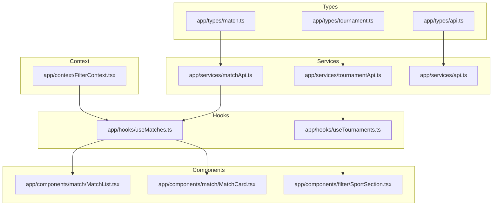
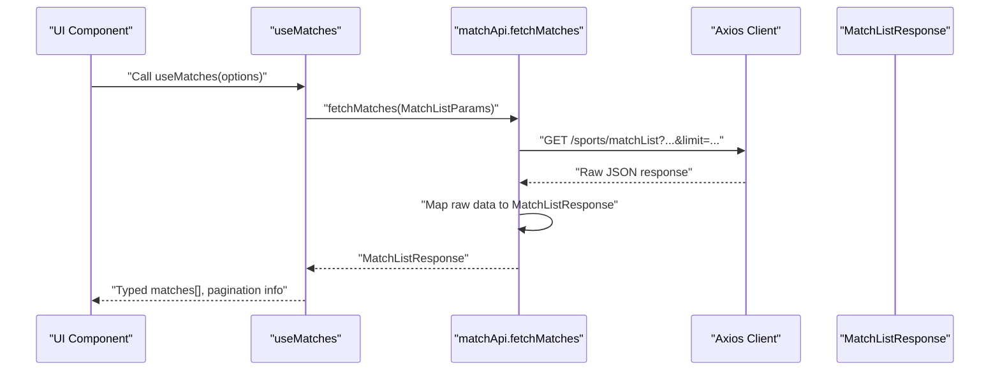
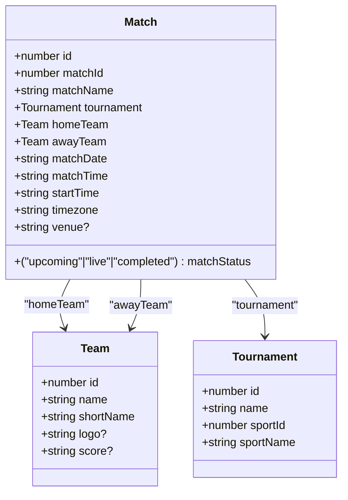
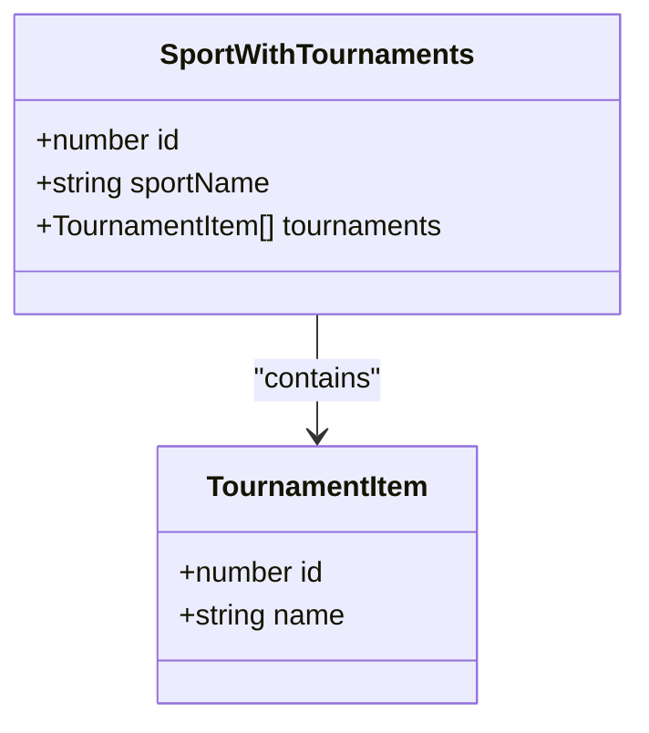
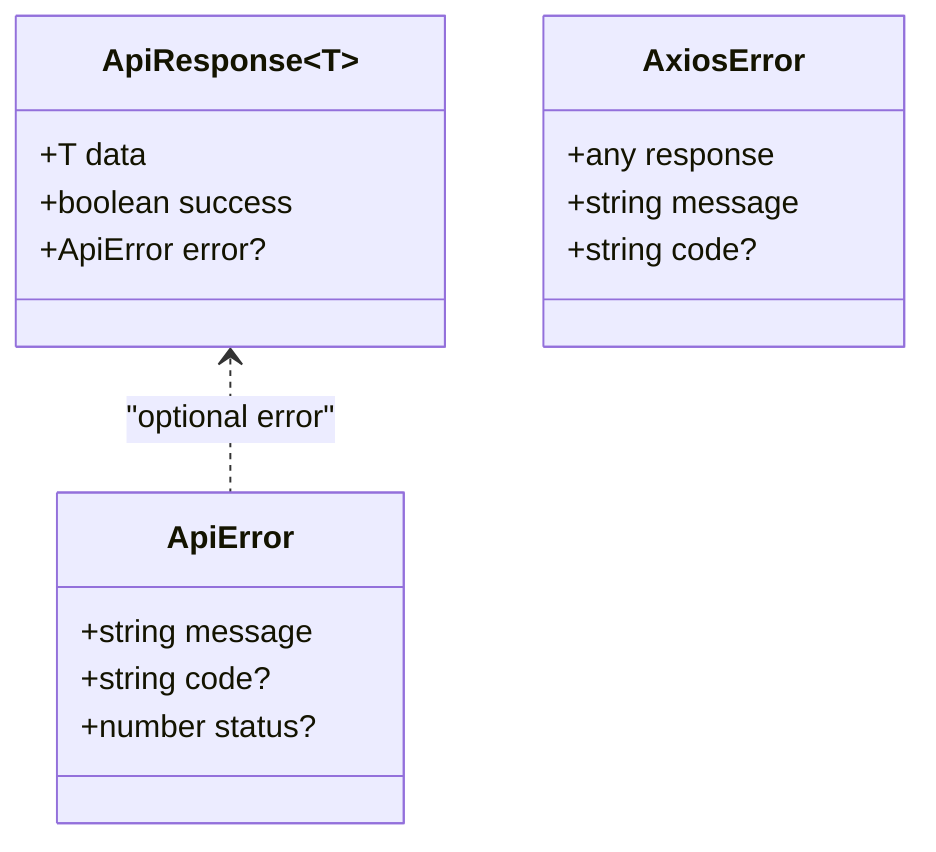
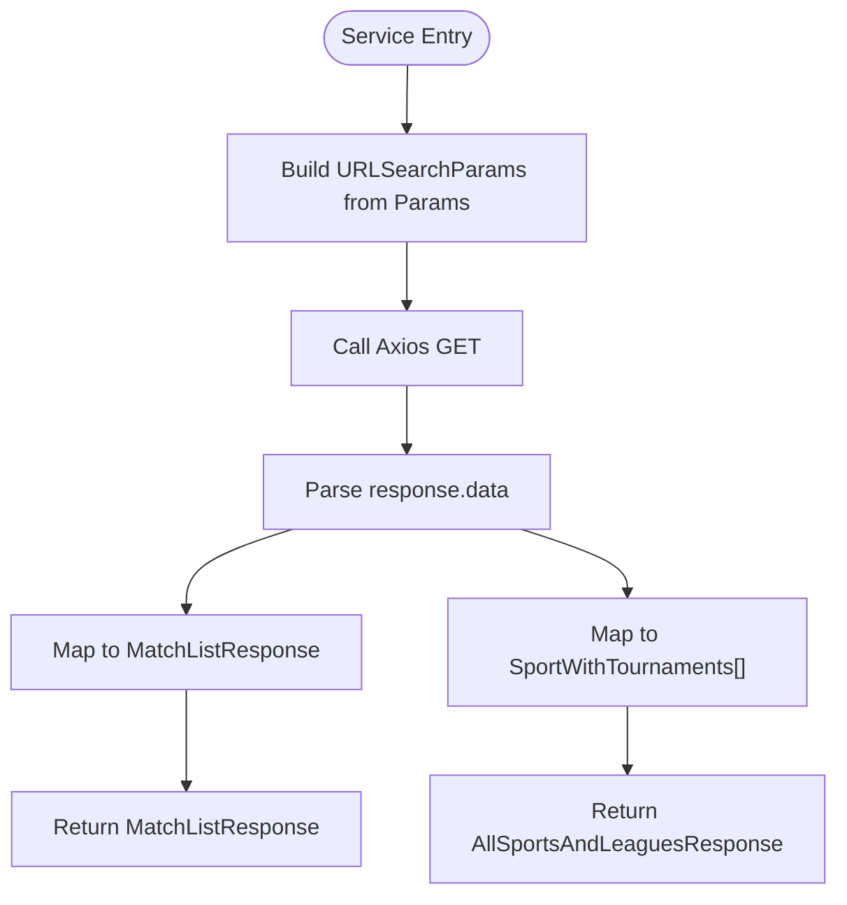
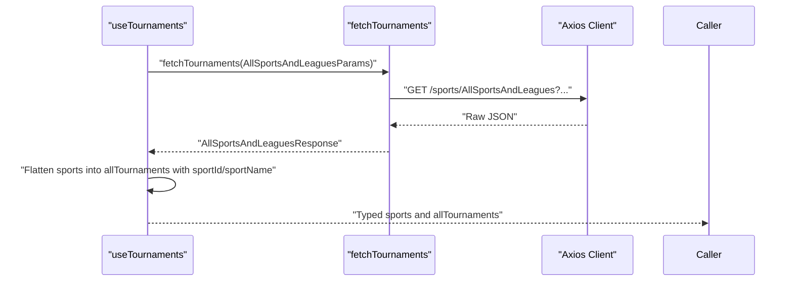
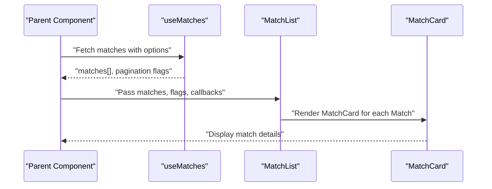
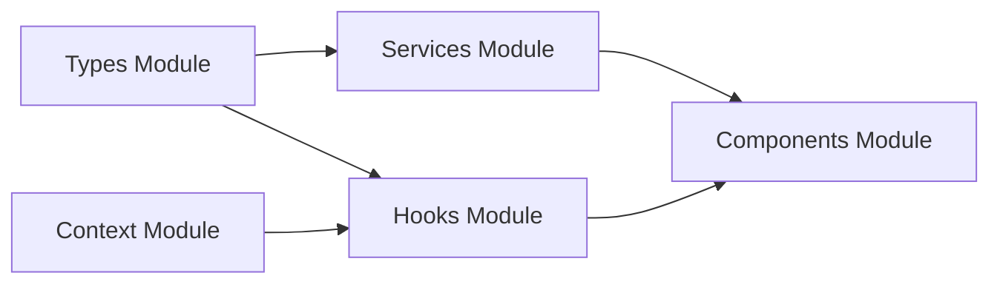

# Types and Interfaces

<cite>
**Referenced Files in This Document**
- [app/types/match.ts](file://app/types/match.ts)
- [app/types/tournament.ts](file://app/types/tournament.ts)
- [app/types/api.ts](file://app/types/api.ts)
- [app/services/matchApi.ts](file://app/services/matchApi.ts)
- [app/services/tournamentApi.ts](file://app/services/tournamentApi.ts)
- [app/services/api.ts](file://app/services/api.ts)
- [app/hooks/useMatches.ts](file://app/hooks/useMatches.ts)
- [app/hooks/useTournaments.ts](file://app/hooks/useTournaments.ts)
- [app/components/match/MatchList.tsx](file://app/components/match/MatchList.tsx)
- [app/components/match/MatchCard.tsx](file://app/components/match/MatchCard.tsx)
- [app/components/filter/SportSection.tsx](file://app/components/filter/SportSection.tsx)
- [app/context/FilterContext.tsx](file://app/context/FilterContext.tsx)
- [app/utils/constants.ts](file://app/utils/constants.ts)
- [app/utils/dateUtils.ts](file://app/utils/dateUtils.ts)
- [app/_layout.tsx](file://app/_layout.tsx)
- [app/index.tsx](file://app/index.tsx)
</cite>

## Table of Contents
1. [Introduction](#introduction)
2. [Project Structure](#project-structure)
3. [Core Components](#core-components)
4. [Architecture Overview](#architecture-overview)
5. [Detailed Component Analysis](#detailed-component-analysis)
6. [Dependency Analysis](#dependency-analysis)
7. [Performance Considerations](#performance-considerations)
8. [Troubleshooting Guide](#troubleshooting-guide)
9. [Conclusion](#conclusion)
10. [Appendices](#appendices)

## Introduction
This document provides comprehensive types and interfaces documentation for the React Native sports match application. It focuses on the TypeScript type definitions for matches, teams, tournaments, and API responses, along with type safety patterns, union types, optional properties, and generic usage. It also explains how API responses map to TypeScript interfaces, how components and hooks consume these types, and how to extend types safely while maintaining consistency across the codebase.

## Project Structure
The type system is organized under a dedicated types folder and consumed by services, hooks, and components. Services encapsulate API calls and transform raw server responses into strongly typed structures. Hooks orchestrate data fetching and pagination, returning typed results to components. Components receive typed props and render accordingly.

**Diagram sources**
- [app/types/match.ts](file://app/types/match.ts#L1-L46)
- [app/types/tournament.ts](file://app/types/tournament.ts#L1-L31)
- [app/types/api.ts](file://app/types/api.ts#L1-L24)
- [app/services/matchApi.ts](file://app/services/matchApi.ts#L1-L36)
- [app/services/tournamentApi.ts](file://app/services/tournamentApi.ts#L1-L35)
- [app/services/api.ts](file://app/services/api.ts#L1-L40)
- [app/hooks/useMatches.ts](file://app/hooks/useMatches.ts#L1-L56)
- [app/hooks/useTournaments.ts](file://app/hooks/useTournaments.ts#L1-L45)
- [app/components/match/MatchList.tsx](file://app/components/match/MatchList.tsx#L1-L117)
- [app/components/match/MatchCard.tsx](file://app/components/match/MatchCard.tsx#L1-L142)
- [app/components/filter/SportSection.tsx](file://app/components/filter/SportSection.tsx#L1-L82)
- [app/context/FilterContext.tsx](file://app/context/FilterContext.tsx#L1-L72)

**Section sources**
- [app/types/match.ts](file://app/types/match.ts#L1-L46)
- [app/types/tournament.ts](file://app/types/tournament.ts#L1-L31)
- [app/types/api.ts](file://app/types/api.ts#L1-L24)
- [app/services/matchApi.ts](file://app/services/matchApi.ts#L1-L36)
- [app/services/tournamentApi.ts](file://app/services/tournamentApi.ts#L1-L35)
- [app/services/api.ts](file://app/services/api.ts#L1-L40)
- [app/hooks/useMatches.ts](file://app/hooks/useMatches.ts#L1-L56)
- [app/hooks/useTournaments.ts](file://app/hooks/useTournaments.ts#L1-L45)
- [app/components/match/MatchList.tsx](file://app/components/match/MatchList.tsx#L1-L117)
- [app/components/match/MatchCard.tsx](file://app/components/match/MatchCard.tsx#L1-L142)
- [app/components/filter/SportSection.tsx](file://app/components/filter/SportSection.tsx#L1-L82)
- [app/context/FilterContext.tsx](file://app/context/FilterContext.tsx#L1-L72)

## Core Components
This section documents the primary TypeScript interfaces and their relationships, focusing on type safety, optionality, unions, and generics.

- Team
  - Purpose: Represents a participating team in a match.
  - Notable properties: id, name, shortName; optional logo and score.
  - Optional fields: logo, score.
  - Usage: Used within Match for homeTeam and awayTeam.

- Tournament
  - Purpose: Associates a match with a sport category and tournament.
  - Notable properties: id, name, sportId, sportName.
  - Usage: Included in Match as tournament.

- Match
  - Purpose: Describes a single match with teams, timing, venue, and status.
  - Notable properties: id, matchId, matchName, tournament, homeTeam, awayTeam, matchStatus (union), matchDate, matchTime, startTime, timezone, optional venue.
  - Union type: matchStatus is a literal union of upcoming, live, completed.
  - Optional fields: venue.
  - Usage: Returned by services and consumed by hooks and components.

- MatchListParams
  - Purpose: Encapsulates query parameters for match listing.
  - Notable properties: timezone (required), status, todate, tournament_ids, limit, offset.
  - Optional fields: status, todate, tournament_ids, limit, offset.

- MatchListResponse
  - Purpose: Encapsulates paginated match data returned by the API.
  - Notable properties: matches (Match[]), total, offset, limit.
  - Usage: Returned by matchApi.fetchMatches.

- TournamentItem
  - Purpose: Lightweight representation of a tournament.
  - Notable properties: id, name.

- SportWithTournaments
  - Purpose: Groups a sport with its associated tournaments.
  - Notable properties: id, sportName, tournaments (TournamentItem[]).
  - Usage: Returned by tournamentApi.fetchTournaments.

- AllSportsAndLeaguesParams
  - Purpose: Encapsulates query parameters for retrieving sports and tournaments.
  - Notable properties: search, limit, offset.
  - Optional fields: search, limit, offset.

- AllSportsAndLeaguesResponse
  - Purpose: Encapsulates the list of sports with nested tournaments.
  - Notable properties: sports (SportWithTournaments[]).
  - Usage: Returned by tournamentApi.fetchTournaments.

- SUPPORTED_SPORTS and SportId
  - Purpose: Defines a closed set of supported sports and derives a discriminated union-like SportId type from the values.
  - Pattern: SUPPORTED_SPORTS is declared as const; SportId is computed via indexed access to extract numeric ids.

- ApiError and ApiResponse<T>
  - Purpose: Standardized error and response envelope for API calls.
  - Notable properties: ApiError includes message, code, status; ApiResponse<T> includes data, success, optional error.
  - Generic usage: ApiResponse<T> allows typing the payload generically.

- PaginationParams and PaginationInfo
  - Purpose: Encapsulates pagination metadata and parameters.
  - Notable properties: limit, offset; total, hasMore derived from data.

**Section sources**
- [app/types/match.ts](file://app/types/match.ts#L1-L46)
- [app/types/tournament.ts](file://app/types/tournament.ts#L1-L31)
- [app/types/api.ts](file://app/types/api.ts#L1-L24)

## Architecture Overview
The type system enforces strong contracts between services, hooks, and components. Services accept typed parameters and return typed responses. Hooks convert service responses into convenient, typed shapes for components. Components consume typed props and render accordingly.

**Diagram sources**
- [app/hooks/useMatches.ts](file://app/hooks/useMatches.ts#L1-L56)
- [app/services/matchApi.ts](file://app/services/matchApi.ts#L1-L36)
- [app/services/api.ts](file://app/services/api.ts#L1-L40)
- [app/types/match.ts](file://app/types/match.ts#L31-L46)

## Detailed Component Analysis

### Match Type Safety and Usage
- Match interface defines a union for matchStatus, ensuring exhaustive handling of statuses downstream.
- Optional properties (venue, team logo, team score) are guarded in components to prevent runtime errors.
- Components like MatchCard and MatchList rely on Match being strongly typed to render accurate UI and to avoid unsafe property access.

**Diagram sources**
- [app/types/match.ts](file://app/types/match.ts#L1-L29)

**Section sources**
- [app/types/match.ts](file://app/types/match.ts#L1-L29)
- [app/components/match/MatchCard.tsx](file://app/components/match/MatchCard.tsx#L1-L142)
- [app/components/match/MatchList.tsx](file://app/components/match/MatchList.tsx#L1-L117)

### Tournament Types and Supported Sports
- TournamentItem and SportWithTournaments define lightweight and grouped representations respectively.
- SUPPORTED_SPORTS is a const object, and SportId is derived from it to constrain sport identifiers at compile-time.
- Tournament APIs return nested structures that are mapped into SportWithTournaments for consumption.

**Diagram sources**
- [app/types/tournament.ts](file://app/types/tournament.ts#L1-L10)

**Section sources**
- [app/types/tournament.ts](file://app/types/tournament.ts#L1-L31)
- [app/services/tournamentApi.ts](file://app/services/tournamentApi.ts#L1-L35)
- [app/components/filter/SportSection.tsx](file://app/components/filter/SportSection.tsx#L1-L82)

### API Envelope and Error Handling
- ApiResponse<T> provides a generic envelope for all API responses, enabling consistent error handling and data extraction.
- ApiError standardizes error payloads, including optional code and status.
- The Axios interceptor normalizes error responses and attaches status codes for robust error reporting.

**Diagram sources**
- [app/types/api.ts](file://app/types/api.ts#L1-L11)
- [app/services/api.ts](file://app/services/api.ts#L22-L37)

**Section sources**
- [app/types/api.ts](file://app/types/api.ts#L1-L24)
- [app/services/api.ts](file://app/services/api.ts#L1-L40)

### Service Layer Mapping
- matchApi.fetchMatches transforms MatchListParams into query strings and maps the raw response into MatchListResponse.
- tournamentApi.fetchTournaments builds query strings, fetches data, and maps it into SportWithTournaments arrays.

**Diagram sources**
- [app/services/matchApi.ts](file://app/services/matchApi.ts#L1-L36)
- [app/services/tournamentApi.ts](file://app/services/tournamentApi.ts#L1-L35)

**Section sources**
- [app/services/matchApi.ts](file://app/services/matchApi.ts#L1-L36)
- [app/services/tournamentApi.ts](file://app/services/tournamentApi.ts#L1-L35)

### Hook-Level Type Usage
- useMatches composes MatchListParams, invokes fetchMatches, and flattens pages into a typed matches array with pagination metadata.
- useTournaments composes AllSportsAndLeaguesParams, invokes fetchTournaments, and flattens sports into a typed allTournaments array with sport metadata attached.

**Diagram sources**
- [app/hooks/useTournaments.ts](file://app/hooks/useTournaments.ts#L1-L45)
- [app/services/tournamentApi.ts](file://app/services/tournamentApi.ts#L1-L35)

**Section sources**
- [app/hooks/useMatches.ts](file://app/hooks/useMatches.ts#L1-L56)
- [app/hooks/useTournaments.ts](file://app/hooks/useTournaments.ts#L1-L45)

### Component-Level Type Usage
- MatchList consumes Match[] and renders MatchCard instances, ensuring type-safe rendering of match data.
- MatchCard consumes a single Match and renders team logos, scores, status, and formatted date/time.
- SportSection consumes SportWithTournaments and renders toggles for tournaments, using sport metadata for styling.

**Diagram sources**
- [app/index.tsx](file://app/index.tsx#L1-L108)
- [app/hooks/useMatches.ts](file://app/hooks/useMatches.ts#L1-L56)
- [app/components/match/MatchList.tsx](file://app/components/match/MatchList.tsx#L1-L117)
- [app/components/match/MatchCard.tsx](file://app/components/match/MatchCard.tsx#L1-L142)

**Section sources**
- [app/components/match/MatchList.tsx](file://app/components/match/MatchList.tsx#L1-L117)
- [app/components/match/MatchCard.tsx](file://app/components/match/MatchCard.tsx#L1-L142)
- [app/components/filter/SportSection.tsx](file://app/components/filter/SportSection.tsx#L1-L82)
- [app/context/FilterContext.tsx](file://app/context/FilterContext.tsx#L1-L72)

## Dependency Analysis
The type system exhibits low coupling and high cohesion:
- Types are self-contained and imported only where needed.
- Services depend on types to enforce input/output contracts.
- Hooks depend on services and types to expose typed data to components.
- Components depend on types to render safely.

**Diagram sources**
- [app/types/match.ts](file://app/types/match.ts#L1-L46)
- [app/types/tournament.ts](file://app/types/tournament.ts#L1-L31)
- [app/types/api.ts](file://app/types/api.ts#L1-L24)
- [app/services/matchApi.ts](file://app/services/matchApi.ts#L1-L36)
- [app/services/tournamentApi.ts](file://app/services/tournamentApi.ts#L1-L35)
- [app/hooks/useMatches.ts](file://app/hooks/useMatches.ts#L1-L56)
- [app/hooks/useTournaments.ts](file://app/hooks/useTournaments.ts#L1-L45)
- [app/context/FilterContext.tsx](file://app/context/FilterContext.tsx#L1-L72)

**Section sources**
- [app/_layout.tsx](file://app/_layout.tsx#L1-L35)
- [app/index.tsx](file://app/index.tsx#L1-L108)

## Performance Considerations
- Prefer optional chaining and nullish coalescing when accessing optional properties to avoid unnecessary checks.
- Use memoization in components (as seen with memo) to minimize re-renders when props are unchanged.
- Keep pagination parameters explicit and defaulted to reduce accidental over-fetching.
- Normalize data early in services to avoid repeated transformations in components.

## Troubleshooting Guide
Common type-related issues and resolutions:
- Unexpected undefined or null values
  - Cause: Optional properties not guarded.
  - Resolution: Use optional chaining and provide fallbacks in components and utilities.
  - Example: Accessing optional venue or team logo should check presence before rendering.

- Mismatch between API response and TypeScript interface
  - Cause: API shape differs from declared interface.
  - Resolution: Align service mapping with declared interfaces; add defensive parsing and logging.
  - Example: Ensure matchApi and tournamentApi map raw data to declared interfaces.

- Literal union type mismatch
  - Cause: matchStatus compared against a string that is not part of the union.
  - Resolution: Use helper utilities or strict equality checks aligned with the union values.
  - Example: Use dateUtils helpers to compare against known literals.

- Generic response typing
  - Cause: Not specifying the generic type for ApiResponse<T>.
  - Resolution: Specify T when consuming API responses to enable proper inference.
  - Example: Use ApiResponse<MatchListResponse> to type the payload.

- Type assertions
  - Guidance: Avoid excessive type assertions. Prefer narrowing via guards and validation.
  - Example: Instead of asserting unknown as Match, validate shape and use a guard function.

**Section sources**
- [app/services/matchApi.ts](file://app/services/matchApi.ts#L24-L35)
- [app/services/tournamentApi.ts](file://app/services/tournamentApi.ts#L24-L31)
- [app/utils/dateUtils.ts](file://app/utils/dateUtils.ts#L53-L63)

## Conclusion
The application’s type system establishes strong contracts across services, hooks, and components. Union types, optional properties, and generics ensure predictable behavior and safer code. By adhering to the established patterns—mapping raw responses to declared interfaces, guarding optional properties, and leveraging helper utilities—you can extend the system reliably while maintaining type consistency.

## Appendices

### Type Usage Examples Across the Codebase
- Components
  - MatchList receives Match[] and renders MatchCard for each item.
  - MatchCard expects a single Match and renders team information and status.
  - SportSection expects SportWithTournaments and renders toggles for tournaments.

- Hooks
  - useMatches composes MatchListParams and returns typed matches, pagination flags, and fetch functions.
  - useTournaments composes AllSportsAndLeaguesParams and returns typed sports and flattened allTournaments.

- Services
  - matchApi.fetchMatches accepts MatchListParams and returns MatchListResponse.
  - tournamentApi.fetchTournaments accepts AllSportsAndLeaguesParams and returns AllSportsAndLeaguesResponse.

- Utilities
  - dateUtils provides helpers to determine match status and format dates/times, aligning with Match.matchStatus.

**Section sources**
- [app/components/match/MatchList.tsx](file://app/components/match/MatchList.tsx#L15-L25)
- [app/components/match/MatchCard.tsx](file://app/components/match/MatchCard.tsx#L10-L13)
- [app/components/filter/SportSection.tsx](file://app/components/filter/SportSection.tsx#L8-L13)
- [app/hooks/useMatches.ts](file://app/hooks/useMatches.ts#L13-L11)
- [app/hooks/useTournaments.ts](file://app/hooks/useTournaments.ts#L11-L9)
- [app/services/matchApi.ts](file://app/services/matchApi.ts#L4-L35)
- [app/services/tournamentApi.ts](file://app/services/tournamentApi.ts#L4-L34)
- [app/utils/dateUtils.ts](file://app/utils/dateUtils.ts#L53-L63)