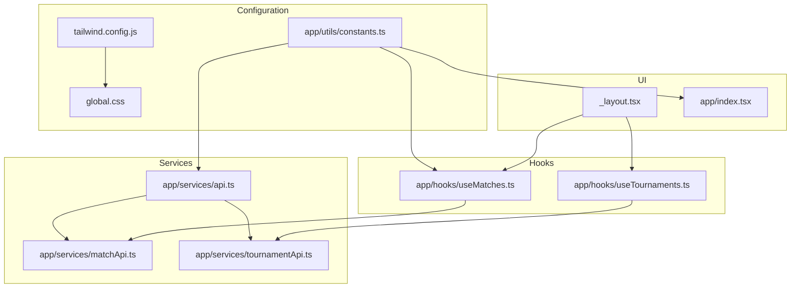
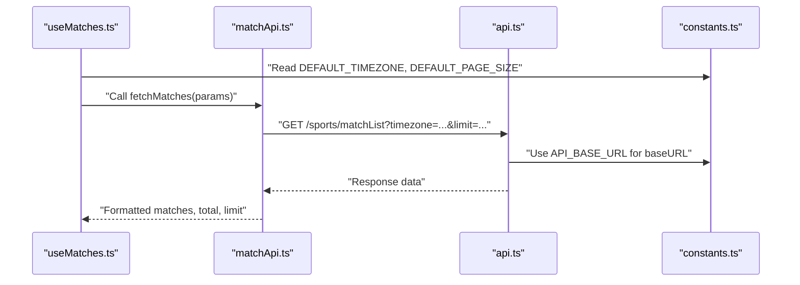
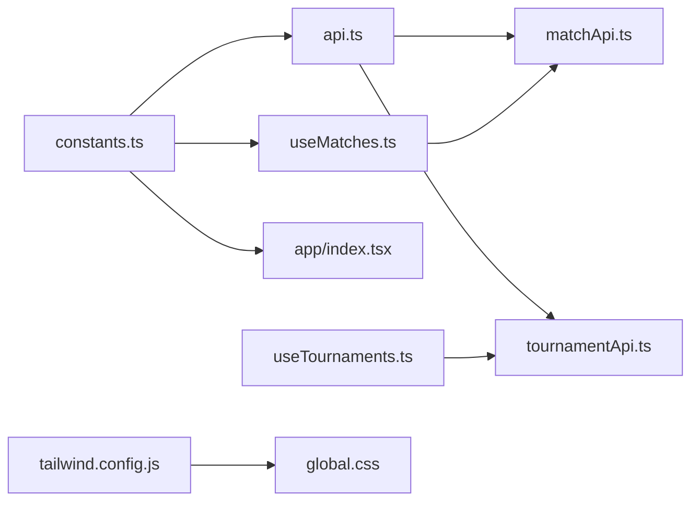

# Constants and Configuration

<cite>
**Referenced Files in This Document**
- [constants.ts](file://app/utils/constants.ts)
- [dateUtils.ts](file://app/utils/dateUtils.ts)
- [formatters.ts](file://app/utils/formatters.ts)
- [tailwind.config.js](file://tailwind.config.js)
- [global.css](file://global.css)
- [api.ts](file://app/services/api.ts)
- [matchApi.ts](file://app/services/matchApi.ts)
- [tournamentApi.ts](file://app/services/tournamentApi.ts)
- [useMatches.ts](file://app/hooks/useMatches.ts)
- [useTournaments.ts](file://app/hooks/useTournaments.ts)
- [_layout.tsx](file://app/_layout.tsx)
- [index.tsx](file://app/index.tsx)
</cite>

## Table of Contents
1. [Introduction](#introduction)
2. [Project Structure](#project-structure)
3. [Core Components](#core-components)
4. [Architecture Overview](#architecture-overview)
5. [Detailed Component Analysis](#detailed-component-analysis)
6. [Dependency Analysis](#dependency-analysis)
7. [Performance Considerations](#performance-considerations)
8. [Troubleshooting Guide](#troubleshooting-guide)
9. [Conclusion](#conclusion)

## Introduction
This document explains the constants and configuration utilities used across the application. It covers:
- API base URLs and media base URLs
- Default timezone and page size defaults
- Color palette system (primary, semantic status colors, and theme color extension)
- Sport-specific configurations (colors and icons mapping)
- How these constants are imported and used throughout the app
- Best practices and guidance for extending the configuration system for new sports or themes

## Project Structure
The configuration and constants are centralized in a single module and consumed by services, hooks, and UI utilities. Tailwind CSS is configured to extend the theme with a primary color derived from the constants.

**Diagram sources**
- [constants.ts](file://app/utils/constants.ts#L1-L38)
- [tailwind.config.js](file://tailwind.config.js#L1-L21)
- [global.css](file://global.css#L1-L4)
- [api.ts](file://app/services/api.ts#L1-L40)
- [matchApi.ts](file://app/services/matchApi.ts#L1-L36)
- [tournamentApi.ts](file://app/services/tournamentApi.ts#L1-L35)
- [useMatches.ts](file://app/hooks/useMatches.ts#L1-L56)
- [useTournaments.ts](file://app/hooks/useTournaments.ts#L1-L45)
- [_layout.tsx](file://app/_layout.tsx#L1-L15)
- [index.tsx](file://app/index.tsx#L1-L9)

**Section sources**
- [constants.ts](file://app/utils/constants.ts#L1-L38)
- [tailwind.config.js](file://tailwind.config.js#L1-L21)
- [global.css](file://global.css#L1-L4)

## Core Components
- API base URL and media base URL: Centralized for all service requests and media asset resolution.
- Default timezone and page size: Used by hooks to configure data fetching defaults.
- Color palette: Includes primary, semantic status colors, and theme extension for Tailwind.
- Sport configuration: Maps sport identifiers to colors and icons for consistent UI rendering.

**Section sources**
- [constants.ts](file://app/utils/constants.ts#L1-L38)

## Architecture Overview
The configuration system is a shared module consumed by services and hooks. Services build on top of the base URL constants, while hooks use defaults for timezone and pagination. Utilities derive status colors and labels from the central color definitions.

**Diagram sources**
- [useMatches.ts](file://app/hooks/useMatches.ts#L13-L41)
- [matchApi.ts](file://app/services/matchApi.ts#L4-L35)
- [api.ts](file://app/services/api.ts#L4-L11)
- [constants.ts](file://app/utils/constants.ts#L1-L4)

## Detailed Component Analysis

### API Base URLs and Media Base URLs
- API base URL: Provides the root endpoint for all HTTP requests.
- Media base URL: Supplies the base path for media assets.

Usage highlights:
- The HTTP client is initialized with the API base URL.
- Media assets are resolved using the media base URL elsewhere in the app.

Best practices:
- Keep the base URLs consistent across environments via environment variables if needed.
- Prefer relative paths for assets when possible; otherwise, ensure trailing slashes are handled consistently.

**Section sources**
- [constants.ts](file://app/utils/constants.ts#L1-L2)
- [api.ts](file://app/services/api.ts#L4-L11)

### Default Timezone and Page Size Defaults
- Default timezone: Used by hooks to pass timezone to backend APIs.
- Default page size: Controls the limit parameter for paginated lists.

Usage highlights:
- Hooks construct query parameters using these defaults.
- Pagination logic computes the next offset based on returned limit and total.

**Section sources**
- [constants.ts](file://app/utils/constants.ts#L3-L4)
- [useMatches.ts](file://app/hooks/useMatches.ts#L14-L18)
- [matchApi.ts](file://app/services/matchApi.ts#L18-L23)

### Color Palette System
- Primary palette: Includes primary, secondary, background, surface, text, borders, and feedback colors.
- Semantic status colors: Live, upcoming, and completed status colors.
- Theme extension: Tailwind is extended with a primary color matching the palette.

Usage highlights:
- UI components import the color palette for consistent theming.
- Status utilities derive status colors from the palette.

**Section sources**
- [constants.ts](file://app/utils/constants.ts#L6-L21)
- [tailwind.config.js](file://tailwind.config.js#L14-L16)
- [formatters.ts](file://app/utils/formatters.ts#L22-L33)

### Sport-Specific Configurations
- Sport colors mapping: Links sport identifiers to brand colors.
- Sport icons mapping: Links sport identifiers to icon keys for rendering.

Usage highlights:
- These mappings enable consistent visual identity per sport across the UI.
- Extend mappings by adding new sport IDs and associated values.

**Section sources**
- [constants.ts](file://app/utils/constants.ts#L23-L37)

### Timezone and Date Utilities
- Timezone-aware formatting: Converts ISO dates to localized time and date strings.
- Countdown calculation: Computes days/hours/minutes/seconds until a target time.
- Status helpers: Determine whether a match is live, upcoming, or completed.

Usage highlights:
- Hooks and components rely on these utilities for display formatting.
- The default timezone is used when none is provided.

**Section sources**
- [dateUtils.ts](file://app/utils/dateUtils.ts#L4-L20)
- [dateUtils.ts](file://app/utils/dateUtils.ts#L22-L41)
- [dateUtils.ts](file://app/utils/dateUtils.ts#L53-L63)

### Tailwind Theme Extension
- Tailwind is configured to extend colors with a primary value aligned with the palette.
- Global CSS imports Tailwind directives to generate styles.

Usage highlights:
- Components can use theme-derived colors via Tailwind classes.
- Keep Tailwind extension synchronized with the color palette.

**Section sources**
- [tailwind.config.js](file://tailwind.config.js#L12-L18)
- [global.css](file://global.css#L1-L4)

### How Constants Are Imported and Used Throughout the Application
- Services: Import the API base URL to initialize the HTTP client.
- Hooks: Import defaults for timezone and page size to build request parameters.
- UI: Import the color palette for consistent theming and status indicators.

Examples of imports and usage:
- API client initialization uses the API base URL constant.
- The matches hook reads the default timezone and page size to configure queries.
- The index screen imports the color palette for styling.

**Section sources**
- [api.ts](file://app/services/api.ts#L2-L2)
- [useMatches.ts](file://app/hooks/useMatches.ts#L4-L4)
- [index.tsx](file://app/index.tsx#L9-L9)

### Extending the Configuration System
- Adding a new sport:
  - Add a new sport identifier and its color to the sport colors mapping.
  - Add a corresponding icon key to the sport icons mapping.
- Adding a new theme color:
  - Add the color to the palette in the constants module.
  - Extend Tailwind’s theme colors to expose the new color in Tailwind classes.
- Environment-specific URLs:
  - Introduce environment variables and conditionally export URLs based on the environment.

Guidelines:
- Maintain a single source of truth for constants.
- Keep mappings aligned across sport colors and icons.
- Ensure Tailwind extension mirrors the palette for consistent design tokens.

**Section sources**
- [constants.ts](file://app/utils/constants.ts#L23-L37)
- [tailwind.config.js](file://tailwind.config.js#L14-L16)

## Dependency Analysis
The configuration module is a foundational dependency for services and hooks. The following diagram shows the dependency flow:

**Diagram sources**
- [constants.ts](file://app/utils/constants.ts#L1-L38)
- [api.ts](file://app/services/api.ts#L1-L40)
- [matchApi.ts](file://app/services/matchApi.ts#L1-L36)
- [tournamentApi.ts](file://app/services/tournamentApi.ts#L1-L35)
- [useMatches.ts](file://app/hooks/useMatches.ts#L1-L56)
- [useTournaments.ts](file://app/hooks/useTournaments.ts#L1-L45)
- [tailwind.config.js](file://tailwind.config.js#L1-L21)
- [global.css](file://global.css#L1-L4)

**Section sources**
- [constants.ts](file://app/utils/constants.ts#L1-L38)
- [api.ts](file://app/services/api.ts#L1-L40)
- [matchApi.ts](file://app/services/matchApi.ts#L1-L36)
- [tournamentApi.ts](file://app/services/tournamentApi.ts#L1-L35)
- [useMatches.ts](file://app/hooks/useMatches.ts#L1-L56)
- [useTournaments.ts](file://app/hooks/useTournaments.ts#L1-L45)
- [tailwind.config.js](file://tailwind.config.js#L1-L21)
- [global.css](file://global.css#L1-L4)

## Performance Considerations
- Centralize constants to avoid duplication and reduce bundle size.
- Use Tailwind classes for styling to leverage JIT compilation and minimize runtime overhead.
- Keep sport mappings compact and immutable to avoid unnecessary re-renders.

## Troubleshooting Guide
- API requests failing:
  - Verify the API base URL is correct and reachable.
  - Confirm the HTTP client is initialized with the base URL.
- Incorrect time or date display:
  - Ensure the timezone passed to formatting functions matches the intended region.
  - Validate that ISO date strings are correctly parsed.
- Status colors not applied:
  - Confirm Tailwind theme extension includes the primary color.
  - Ensure the status utilities return the expected color values.

**Section sources**
- [api.ts](file://app/services/api.ts#L4-L11)
- [dateUtils.ts](file://app/utils/dateUtils.ts#L4-L20)
- [tailwind.config.js](file://tailwind.config.js#L14-L16)
- [formatters.ts](file://app/utils/formatters.ts#L22-L33)

## Conclusion
The constants and configuration utilities provide a centralized, maintainable foundation for API endpoints, timezone defaults, pagination, color palettes, and sport-specific mappings. By adhering to the established patterns and extending the configuration systematically, teams can introduce new sports, themes, and environment-specific settings with minimal disruption.