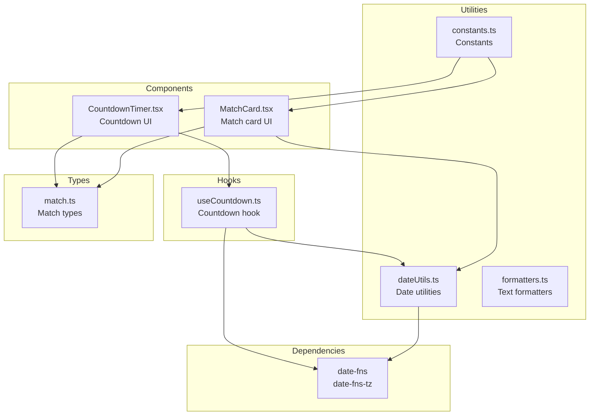
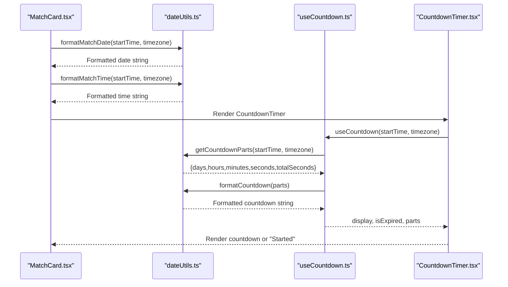
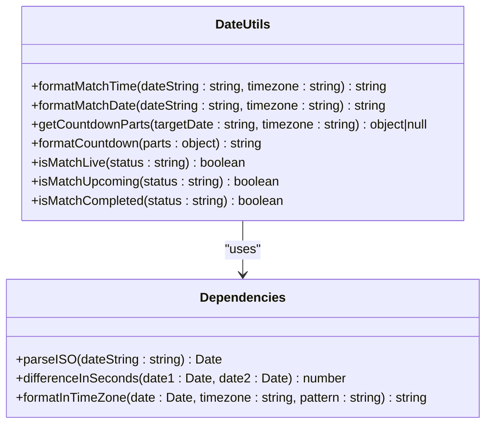
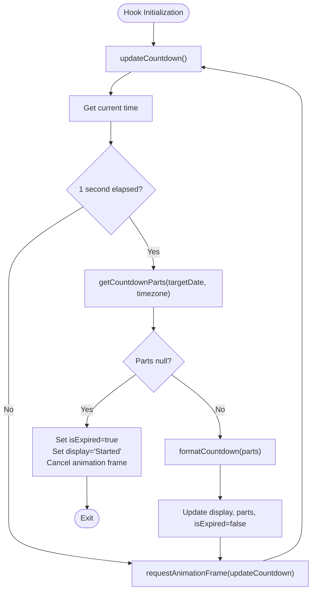
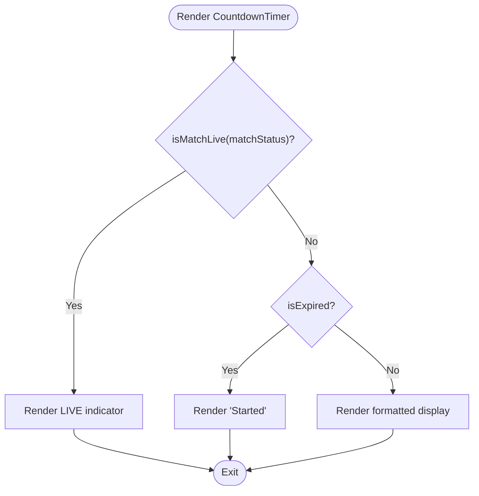
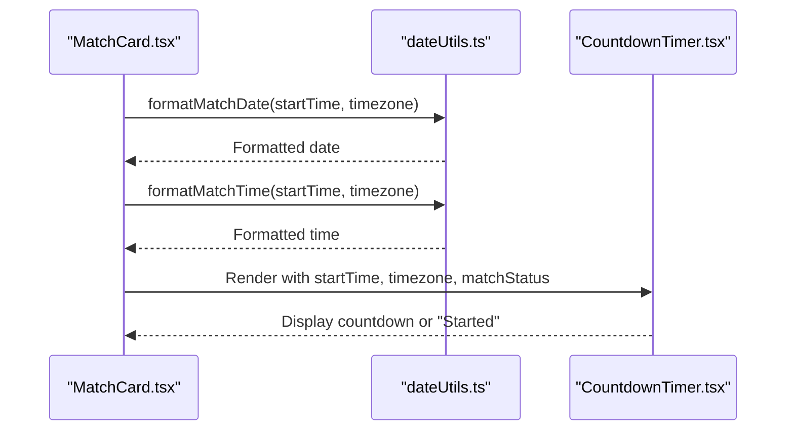
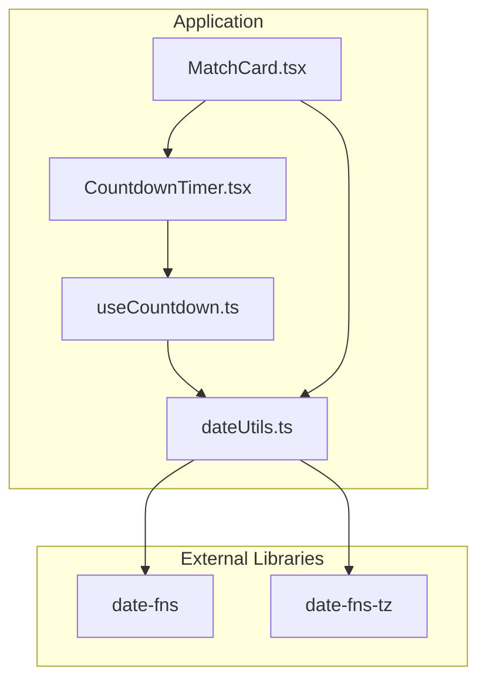

# Date and Time Handling

<cite>
**Referenced Files in This Document**
- [dateUtils.ts](file://app/utils/dateUtils.ts)
- [useCountdown.ts](file://app/hooks/useCountdown.ts)
- [CountdownTimer.tsx](file://app/components/match/CountdownTimer.tsx)
- [MatchCard.tsx](file://app/components/match/MatchCard.tsx)
- [match.ts](file://app/types/match.ts)
- [constants.ts](file://app/utils/constants.ts)
- [package.json](file://package.json)
</cite>

## Table of Contents
1. [Introduction](#introduction)
2. [Project Structure](#project-structure)
3. [Core Components](#core-components)
4. [Architecture Overview](#architecture-overview)
5. [Detailed Component Analysis](#detailed-component-analysis)
6. [Dependency Analysis](#dependency-analysis)
7. [Performance Considerations](#performance-considerations)
8. [Troubleshooting Guide](#troubleshooting-guide)
9. [Conclusion](#conclusion)

## Introduction
This document provides comprehensive documentation for the date and time utility functions used throughout the application. It covers timezone handling mechanisms, date parsing and formatting functions, and match timing calculations. The documentation explains the implementation of date difference calculations for countdown timers, timezone conversion utilities, and locale-specific date formatting. It documents function signatures, parameter requirements, return value formats, and error handling patterns. Practical examples of date comparisons, time remaining calculations, and integration with the countdown timer components are included. Edge cases such as daylight saving time changes, international users, and performance considerations for frequent date operations are addressed.

## Project Structure
The date and time functionality is primarily implemented in the utilities and hooks modules, with components consuming these utilities for rendering match information and countdown timers.

**Diagram sources**
- [dateUtils.ts](file://app/utils/dateUtils.ts#L1-L64)
- [useCountdown.ts](file://app/hooks/useCountdown.ts#L1-L54)
- [CountdownTimer.tsx](file://app/components/match/CountdownTimer.tsx#L1-L43)
- [MatchCard.tsx](file://app/components/match/MatchCard.tsx#L1-L142)
- [match.ts](file://app/types/match.ts#L1-L46)
- [constants.ts](file://app/utils/constants.ts#L1-L38)
- [package.json](file://package.json#L23-L24)

**Section sources**
- [dateUtils.ts](file://app/utils/dateUtils.ts#L1-L64)
- [useCountdown.ts](file://app/hooks/useCountdown.ts#L1-L54)
- [CountdownTimer.tsx](file://app/components/match/CountdownTimer.tsx#L1-L43)
- [MatchCard.tsx](file://app/components/match/MatchCard.tsx#L1-L142)
- [match.ts](file://app/types/match.ts#L1-L46)
- [constants.ts](file://app/utils/constants.ts#L1-L38)
- [package.json](file://package.json#L23-L24)

## Core Components
This section documents the core date and time utility functions, their parameters, return values, and error handling behavior.

- formatMatchTime(dateString: string, timezone: string = 'Australia/Sydney'): string
  - Purpose: Formats a match time in a localized format.
  - Parameters:
    - dateString: ISO 8601 formatted datetime string.
    - timezone: IANA timezone identifier (default: 'Australia/Sydney').
  - Returns: Formatted time string or empty string on error.
  - Error handling: Catches exceptions during parsing and returns empty string.

- formatMatchDate(dateString: string, timezone: string = 'Australia/Sydney'): string
  - Purpose: Formats a match date in a localized format.
  - Parameters:
    - dateString: ISO 8601 formatted datetime string.
    - timezone: IANA timezone identifier (default: 'Australia/Sydney').
  - Returns: Formatted date string or empty string on error.
  - Error handling: Catches exceptions during parsing and returns empty string.

- getCountdownParts(targetDate: string, timezone: string = 'Australia/Sydney'): { days: number; hours: number; minutes: number; seconds: number; totalSeconds: number } | null
  - Purpose: Calculates the time remaining until a target date.
  - Parameters:
    - targetDate: ISO 8601 formatted datetime string.
    - timezone: IANA timezone identifier (default: 'Australia/Sydney').
  - Returns: Object containing days, hours, minutes, seconds, and totalSeconds, or null if expired or on error.
  - Error handling: Returns null on invalid input or parsing errors.

- formatCountdown(parts: { days: number; hours: number; minutes: number; seconds: number }): string
  - Purpose: Formats countdown parts into a human-readable string.
  - Parameters:
    - parts: Object containing days, hours, minutes, and seconds.
  - Returns: Formatted countdown string (e.g., "Xd Yh Zm", "Yh Zm As", or "Zm As").
  - Error handling: No explicit error handling; expects valid numeric inputs.

- isMatchLive(matchStatus: string): boolean
  - Purpose: Checks if a match is currently live.
  - Parameters:
    - matchStatus: Match status string.
  - Returns: Boolean indicating live status.
  - Error handling: No explicit error handling; compares against literal string.

- isMatchUpcoming(matchStatus: string): boolean
  - Purpose: Checks if a match is upcoming.
  - Parameters:
    - matchStatus: Match status string.
  - Returns: Boolean indicating upcoming status.
  - Error handling: No explicit error handling; compares against literal string.

- isMatchCompleted(matchStatus: string): boolean
  - Purpose: Checks if a match has completed.
  - Parameters:
    - matchStatus: Match status string.
  - Returns: Boolean indicating completed status.
  - Error handling: No explicit error handling; compares against literal string.

**Section sources**
- [dateUtils.ts](file://app/utils/dateUtils.ts#L4-L63)

## Architecture Overview
The date and time architecture consists of utility functions for parsing and formatting dates, a countdown hook that updates UI components, and components that render match information with localized dates and countdown timers.

**Diagram sources**
- [MatchCard.tsx](file://app/components/match/MatchCard.tsx#L86-L91)
- [dateUtils.ts](file://app/utils/dateUtils.ts#L13-L51)
- [useCountdown.ts](file://app/hooks/useCountdown.ts#L10-L53)
- [CountdownTimer.tsx](file://app/components/match/CountdownTimer.tsx#L13-L38)

## Detailed Component Analysis

### Date Utilities Analysis
The date utilities module provides functions for parsing ISO 8601 strings, formatting dates and times in specific timezones, calculating countdowns, and determining match statuses.

**Diagram sources**
- [dateUtils.ts](file://app/utils/dateUtils.ts#L1-L63)

**Section sources**
- [dateUtils.ts](file://app/utils/dateUtils.ts#L1-L63)

### Countdown Hook Analysis
The countdown hook manages real-time updates for countdown displays, using requestAnimationFrame to optimize rendering and throttling updates to once per second.

**Diagram sources**
- [useCountdown.ts](file://app/hooks/useCountdown.ts#L17-L40)

**Section sources**
- [useCountdown.ts](file://app/hooks/useCountdown.ts#L1-L54)

### Countdown Timer Component Analysis
The countdown timer component renders either a live indicator, a "Started" message, or a formatted countdown display based on match status and expiration state.

**Diagram sources**
- [CountdownTimer.tsx](file://app/components/match/CountdownTimer.tsx#L13-L38)

**Section sources**
- [CountdownTimer.tsx](file://app/components/match/CountdownTimer.tsx#L1-L43)

### Match Card Integration Analysis
The match card integrates date utilities for displaying match date and time, and uses the countdown timer for non-live matches.

**Diagram sources**
- [MatchCard.tsx](file://app/components/match/MatchCard.tsx#L86-L91)
- [MatchCard.tsx](file://app/components/match/MatchCard.tsx#L127-L133)
- [dateUtils.ts](file://app/utils/dateUtils.ts#L13-L20)

**Section sources**
- [MatchCard.tsx](file://app/components/match/MatchCard.tsx#L1-L142)
- [dateUtils.ts](file://app/utils/dateUtils.ts#L13-L20)

## Dependency Analysis
The date and time utilities depend on external libraries for robust date parsing, timezone-aware formatting, and precise time difference calculations.

**Diagram sources**
- [dateUtils.ts](file://app/utils/dateUtils.ts#L1-L2)
- [useCountdown.ts](file://app/hooks/useCountdown.ts#L1-L2)
- [package.json](file://package.json#L23-L24)

**Section sources**
- [dateUtils.ts](file://app/utils/dateUtils.ts#L1-L2)
- [useCountdown.ts](file://app/hooks/useCountdown.ts#L1-L2)
- [package.json](file://package.json#L23-L24)

## Performance Considerations
- Throttled Updates: The countdown hook throttles updates to approximately once per second using a timestamp comparison, reducing unnecessary re-renders.
- Animation Frame Optimization: Uses requestAnimationFrame for smooth updates while avoiding excessive CPU usage.
- Error Handling: Utility functions return safe defaults (empty strings or null) on parsing errors, preventing crashes and enabling graceful degradation.
- Timezone Efficiency: Uses timezone-aware formatting to avoid repeated timezone conversions and ensure accurate local time display.
- Internationalization: Supports various IANA timezone identifiers, accommodating users across different regions and handling daylight saving transitions automatically.

## Troubleshooting Guide
Common issues and their resolutions:

- Invalid Date Strings
  - Symptom: Empty string returned for formatted date/time.
  - Cause: Malformed ISO 8601 string or unsupported timezone.
  - Resolution: Validate input strings and ensure they conform to ISO 8601 format.

- Countdown Expiration
  - Symptom: "Started" displayed instead of countdown.
  - Cause: Target date is in the past or current time equals target time.
  - Resolution: Verify target date is in the future and timezone is correctly specified.

- Timezone Mismatch
  - Symptom: Incorrect time displayed for users in different regions.
  - Cause: Using default timezone instead of user's local timezone.
  - Resolution: Pass user's timezone identifier to formatting functions.

- Performance Issues
  - Symptom: UI lag during countdown updates.
  - Cause: Excessive re-renders or inefficient calculations.
  - Resolution: Confirm throttling is active and avoid unnecessary state updates.

**Section sources**
- [dateUtils.ts](file://app/utils/dateUtils.ts#L5-L10)
- [dateUtils.ts](file://app/utils/dateUtils.ts#L14-L19)
- [dateUtils.ts](file://app/utils/dateUtils.ts#L23-L40)
- [useCountdown.ts](file://app/hooks/useCountdown.ts#L17-L40)

## Conclusion
The date and time handling system provides robust, timezone-aware date parsing and formatting capabilities with efficient countdown calculations. The modular design separates concerns between utilities, hooks, and components, enabling maintainable and extensible functionality. The implementation handles international users effectively through timezone-aware formatting and gracefully manages edge cases such as expired countdowns and invalid date strings. Performance optimizations ensure smooth user experiences even with frequent date operations.