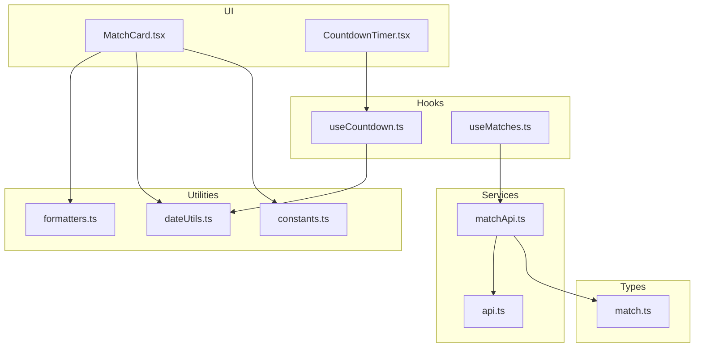
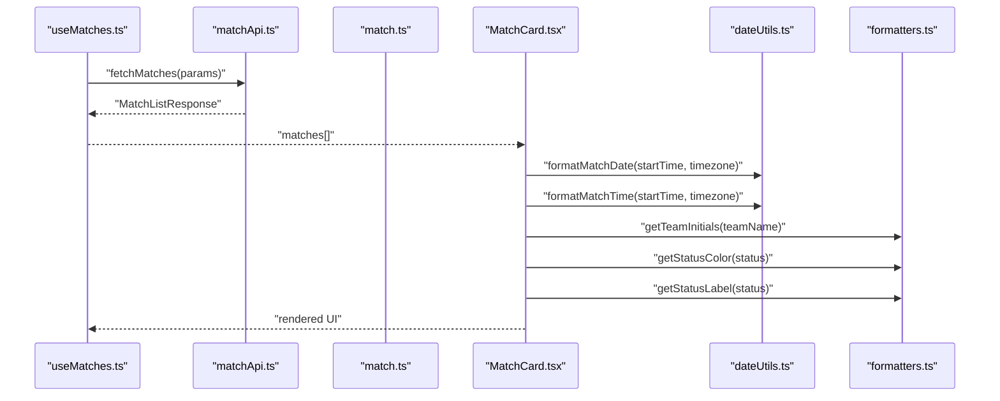
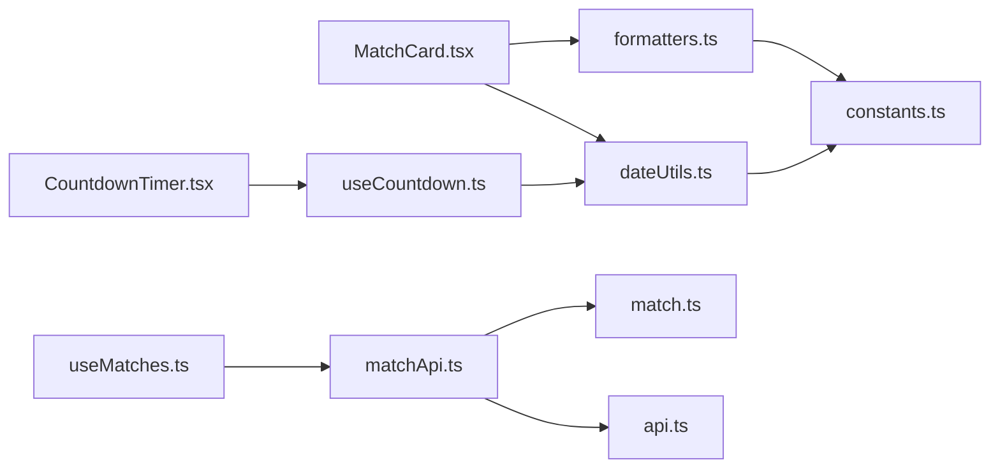

# Formatting Utilities

<cite>
**Referenced Files in This Document**
- [formatters.ts](file://app/utils/formatters.ts)
- [dateUtils.ts](file://app/utils/dateUtils.ts)
- [constants.ts](file://app/utils/constants.ts)
- [match.ts](file://app/types/match.ts)
- [MatchCard.tsx](file://app/components/match/MatchCard.tsx)
- [CountdownTimer.tsx](file://app/components/match/CountdownTimer.tsx)
- [useCountdown.ts](file://app/hooks/useCountdown.ts)
- [matchApi.ts](file://app/services/matchApi.ts)
- [api.ts](file://app/services/api.ts)
- [useMatches.ts](file://app/hooks/useMatches.ts)
</cite>

## Table of Contents
1. [Introduction](#introduction)
2. [Project Structure](#project-structure)
3. [Core Components](#core-components)
4. [Architecture Overview](#architecture-overview)
5. [Detailed Component Analysis](#detailed-component-analysis)
6. [Dependency Analysis](#dependency-analysis)
7. [Performance Considerations](#performance-considerations)
8. [Troubleshooting Guide](#troubleshooting-guide)
9. [Conclusion](#conclusion)
10. [Appendices](#appendices)

## Introduction
This document explains the formatting utilities used across the application to present match data in a user-friendly way. It covers:
- Human-readable time formats and countdown logic
- Score and team display helpers
- Status labels and colors
- Data normalization for UI consumption
- Accessibility considerations for screen readers
- Performance optimization strategies
- Guidelines for extending the formatting system

## Project Structure
The formatting utilities are organized under a dedicated utilities module and consumed by UI components and hooks that render match lists and details.

**Diagram sources**
- [formatters.ts](file://app/utils/formatters.ts#L1-L47)
- [dateUtils.ts](file://app/utils/dateUtils.ts#L1-L64)
- [constants.ts](file://app/utils/constants.ts#L1-L38)
- [match.ts](file://app/types/match.ts#L1-L46)
- [MatchCard.tsx](file://app/components/match/MatchCard.tsx#L1-L142)
- [CountdownTimer.tsx](file://app/components/match/CountdownTimer.tsx#L1-L43)
- [useCountdown.ts](file://app/hooks/useCountdown.ts#L1-L54)
- [matchApi.ts](file://app/services/matchApi.ts#L1-L36)
- [api.ts](file://app/services/api.ts#L1-L40)
- [useMatches.ts](file://app/hooks/useMatches.ts#L1-L56)

**Section sources**
- [formatters.ts](file://app/utils/formatters.ts#L1-L47)
- [dateUtils.ts](file://app/utils/dateUtils.ts#L1-L64)
- [constants.ts](file://app/utils/constants.ts#L1-L38)
- [match.ts](file://app/types/match.ts#L1-L46)
- [MatchCard.tsx](file://app/components/match/MatchCard.tsx#L1-L142)
- [CountdownTimer.tsx](file://app/components/match/CountdownTimer.tsx#L1-L43)
- [useCountdown.ts](file://app/hooks/useCountdown.ts#L1-L54)
- [matchApi.ts](file://app/services/matchApi.ts#L1-L36)
- [api.ts](file://app/services/api.ts#L1-L40)
- [useMatches.ts](file://app/hooks/useMatches.ts#L1-L56)

## Core Components
This section documents the formatting functions and their roles.

- Text and label helpers
  - Truncate text with an ellipsis
  - Capitalize first letter of a word
  - Join tournament IDs into a comma-separated string
  - Compute team initials from a full name
- Status presentation
  - Map status to a color string
  - Map status to a localized label
- Time and countdown
  - Parse ISO date and format time/date in a given timezone
  - Compute countdown parts (days, hours, minutes, seconds)
  - Format countdown display string
  - Boolean predicates to test match status

**Section sources**
- [formatters.ts](file://app/utils/formatters.ts#L1-L47)
- [dateUtils.ts](file://app/utils/dateUtils.ts#L4-L64)

## Architecture Overview
The formatting pipeline connects data types, formatting utilities, and UI components.

**Diagram sources**
- [useMatches.ts](file://app/hooks/useMatches.ts#L13-L55)
- [matchApi.ts](file://app/services/matchApi.ts#L4-L35)
- [match.ts](file://app/types/match.ts#L16-L29)
- [MatchCard.tsx](file://app/components/match/MatchCard.tsx#L15-L137)
- [dateUtils.ts](file://app/utils/dateUtils.ts#L4-L20)
- [formatters.ts](file://app/utils/formatters.ts#L15-L46)

## Detailed Component Analysis

### Text and Label Formatting
- truncateText(text: string, maxLength: number): string
  - Purpose: Shorten long strings with an ellipsis.
  - Parameters:
    - text: Input string to truncate.
    - maxLength: Maximum allowed length.
  - Returns: Original string if length ≤ maxLength; otherwise truncated string plus "...".

- capitalizeFirst(text: string): string
  - Purpose: Uppercase the first character and lowercase the rest.
  - Parameters:
    - text: Input string.
  - Returns: Transformed string.

- formatTournamentIds(ids: number[]): string
  - Purpose: Normalize tournament IDs for query parameters.
  - Parameters:
    - ids: Array of numeric IDs.
  - Returns: Comma-separated string of IDs.

- getTeamInitials(name: string): string
  - Purpose: Generate up to three-letter initials from a team name.
  - Parameters:
    - name: Full team name.
  - Returns: Uppercased initials; handles single-word and multi-word names.

**Section sources**
- [formatters.ts](file://app/utils/formatters.ts#L1-L47)

### Status Presentation
- getStatusColor(status: string): string
  - Purpose: Map match status to a semantic color.
  - Parameters:
    - status: One of "live", "upcoming", "completed".
  - Returns: Hex color string.

- getStatusLabel(status: string): string
  - Purpose: Convert status to a display label.
  - Parameters:
    - status: One of "live", "upcoming", "completed".
  - Returns: Uppercase "LIVE", capitalized "Upcoming", capitalized "Completed", or the original status.

**Section sources**
- [formatters.ts](file://app/utils/formatters.ts#L22-L46)

### Time and Countdown Formatting
- formatMatchTime(dateString: string, timezone?: string): string
  - Purpose: Human-readable time in 12-hour format.
  - Parameters:
    - dateString: ISO date string.
    - timezone: Optional timezone identifier; defaults to a constant.
  - Returns: Formatted time string or empty on error.

- formatMatchDate(dateString: string, timezone?: string): string
  - Purpose: Human-readable date format.
  - Parameters:
    - dateString: ISO date string.
    - timezone: Optional timezone identifier; defaults to a constant.
  - Returns: Formatted date string or empty on error.

- getCountdownParts(targetDate: string, timezone?: string): { days, hours, minutes, seconds, totalSeconds } | null
  - Purpose: Compute time remaining until a target date.
  - Parameters:
    - targetDate: ISO date string.
    - timezone: Optional timezone identifier.
  - Returns: Object with countdown parts or null if expired.

- formatCountdown(parts: { days, hours, minutes, seconds }): string
  - Purpose: Compact human-readable countdown string.
  - Parameters:
    - parts: Countdown parts computed by getCountdownParts.
  - Returns: String in the format "Xd Yh Zm", "Xh Ym Zs", or "Xm Ys".

- isMatchLive(status: string): boolean
- isMatchUpcoming(status: string): boolean
- isMatchCompleted(status: string): boolean
  - Purpose: Predicate helpers for status checks.

**Section sources**
- [dateUtils.ts](file://app/utils/dateUtils.ts#L4-L64)

### UI Integration Examples
- MatchCard displays:
  - Tournament name and status badge using status label and color.
  - Team logos or initials computed via getTeamInitials.
  - Date and time using formatMatchDate and formatMatchTime.
  - Score fields when present.

- CountdownTimer shows:
  - Live indicator when status is live.
  - Countdown display via useCountdown hook.
  - Fallback text when countdown expires.

**Section sources**
- [MatchCard.tsx](file://app/components/match/MatchCard.tsx#L15-L137)
- [CountdownTimer.tsx](file://app/components/match/CountdownTimer.tsx#L13-L38)
- [useCountdown.ts](file://app/hooks/useCountdown.ts#L10-L53)

### Data Normalization and API Consumption
- useMatches composes query parameters and normalizes results:
  - Uses DEFAULT_TIMEZONE and DEFAULT_PAGE_SIZE.
  - Converts tournament IDs array to a comma-separated string for the API.
  - Flattens paginated results into a single matches array.

- matchApi builds query parameters and returns normalized MatchListResponse.

**Section sources**
- [useMatches.ts](file://app/hooks/useMatches.ts#L13-L55)
- [matchApi.ts](file://app/services/matchApi.ts#L4-L35)
- [constants.ts](file://app/utils/constants.ts#L3-L4)

## Dependency Analysis
The following diagram shows how formatting utilities depend on each other and on shared constants and types.

**Diagram sources**
- [dateUtils.ts](file://app/utils/dateUtils.ts#L1-L64)
- [formatters.ts](file://app/utils/formatters.ts#L1-L47)
- [constants.ts](file://app/utils/constants.ts#L1-L38)
- [MatchCard.tsx](file://app/components/match/MatchCard.tsx#L1-L142)
- [CountdownTimer.tsx](file://app/components/match/CountdownTimer.tsx#L1-L43)
- [useCountdown.ts](file://app/hooks/useCountdown.ts#L1-L54)
- [useMatches.ts](file://app/hooks/useMatches.ts#L1-L56)
- [matchApi.ts](file://app/services/matchApi.ts#L1-L36)
- [api.ts](file://app/services/api.ts#L1-L40)
- [match.ts](file://app/types/match.ts#L1-L46)

**Section sources**
- [dateUtils.ts](file://app/utils/dateUtils.ts#L1-L64)
- [formatters.ts](file://app/utils/formatters.ts#L1-L47)
- [constants.ts](file://app/utils/constants.ts#L1-L38)
- [match.ts](file://app/types/match.ts#L1-L46)
- [MatchCard.tsx](file://app/components/match/MatchCard.tsx#L1-L142)
- [CountdownTimer.tsx](file://app/components/match/CountdownTimer.tsx#L1-L43)
- [useCountdown.ts](file://app/hooks/useCountdown.ts#L1-L54)
- [useMatches.ts](file://app/hooks/useMatches.ts#L1-L56)
- [matchApi.ts](file://app/services/matchApi.ts#L1-L36)
- [api.ts](file://app/services/api.ts#L1-L40)

## Performance Considerations
- Memoization in UI components
  - MatchCard uses memoization to avoid re-rendering when props are unchanged.
  - CountdownTimer uses memoization to prevent unnecessary renders.

- Efficient countdown updates
  - useCountdown updates display at most once per second and leverages requestAnimationFrame for smoothness.

- Avoid repeated parsing
  - dateUtils parses ISO dates once per update cycle; keep targetDate stable to minimize work.

- Batch rendering
  - useMatches flattens pages efficiently; avoid re-computing derived data inside render loops.

- Minimize allocations
  - Prefer returning primitives and small objects from formatters.
  - Reuse constants (colors, icons) from constants.ts.

[No sources needed since this section provides general guidance]

## Troubleshooting Guide
Common issues and resolutions:
- Empty or blank time/date
  - Cause: Malformed or missing date string.
  - Resolution: Ensure dateString is a valid ISO string and timezone is recognized.

- Countdown shows "Started"
  - Cause: Target date is in the past.
  - Resolution: The hook sets isExpired and stops further updates.

- Status color/label mismatch
  - Cause: Unexpected status value.
  - Resolution: Extend formatters to handle new statuses gracefully.

- Tournament IDs not applied
  - Cause: Not joined into a comma-separated string.
  - Resolution: Use formatTournamentIds or join manually before sending to the API.

**Section sources**
- [dateUtils.ts](file://app/utils/dateUtils.ts#L4-L64)
- [useCountdown.ts](file://app/hooks/useCountdown.ts#L17-L40)
- [formatters.ts](file://app/utils/formatters.ts#L22-L46)
- [matchApi.ts](file://app/services/matchApi.ts#L15-L17)

## Conclusion
The formatting utilities provide a cohesive foundation for displaying match data consistently across the UI. They separate concerns between time formatting, status labeling, and data normalization, while supporting performance-sensitive scenarios like countdown rendering. Extending the system involves adding new formatters, updating status mappings, and ensuring constants remain aligned with UI needs.

[No sources needed since this section summarizes without analyzing specific files]

## Appendices

### Parameter and Return Value Specifications
- truncateText(text: string, maxLength: number): string
  - Parameters: text (string), maxLength (number)
  - Returns: string

- capitalizeFirst(text: string): string
  - Parameters: text (string)
  - Returns: string

- formatTournamentIds(ids: number[]): string
  - Parameters: ids (number[])
  - Returns: string

- getTeamInitials(name: string): string
  - Parameters: name (string)
  - Returns: string

- getStatusColor(status: string): string
  - Parameters: status (string)
  - Returns: string (hex color)

- getStatusLabel(status: string): string
  - Parameters: status (string)
  - Returns: string

- formatMatchTime(dateString: string, timezone?: string): string
  - Parameters: dateString (string), timezone? (string)
  - Returns: string

- formatMatchDate(dateString: string, timezone?: string): string
  - Parameters: dateString (string), timezone? (string)
  - Returns: string

- getCountdownParts(targetDate: string, timezone?: string): { days: number; hours: number; minutes: number; seconds: number; totalSeconds: number } | null
  - Parameters: targetDate (string), timezone? (string)
  - Returns: object or null

- formatCountdown(parts: { days, hours, minutes, seconds }): string
  - Parameters: parts (object)
  - Returns: string

- isMatchLive(status: string): boolean
- isMatchUpcoming(status: string): boolean
- isMatchCompleted(status: string): boolean
  - Parameters: status (string)
  - Returns: boolean

**Section sources**
- [formatters.ts](file://app/utils/formatters.ts#L1-L47)
- [dateUtils.ts](file://app/utils/dateUtils.ts#L4-L64)

### Accessibility Guidelines
- Screen reader-friendly labels
  - Use concise labels for status badges and countdowns.
  - Combine readable labels with semantic roles where appropriate in higher-level components.

- Color contrast
  - Ensure status colors meet contrast ratios against backgrounds.

- Predictable updates
  - Keep countdown updates minimal and predictable to avoid auditory confusion.

[No sources needed since this section provides general guidance]

### Localization Considerations
- Current state
  - Time formatting uses fixed patterns and a default timezone constant.
  - Status labels are English.

- Recommendations
  - Introduce locale-aware formatting via libraries such as date-fns locales or Intl.DateTimeFormat.
  - Centralize status labels and use a mapping keyed by locale.
  - Allow timezone to be derived from device settings or user preferences.

[No sources needed since this section provides general guidance]

### Extending the Formatting System
- Adding a new formatter
  - Define a pure function in formatters.ts or dateUtils.ts.
  - Export and document parameters and return values.
  - Add tests to validate behavior across inputs.

- Supporting a new status
  - Extend getStatusColor and getStatusLabel switches.
  - Update constants.ts if new semantic colors are introduced.

- Adding a new data type
  - Define a type in match.ts or a new types file.
  - Create a formatter in formatters.ts or dateUtils.ts.
  - Consume the formatter in UI components and hooks.

- Multi-language support
  - Introduce a locale parameter to formatting functions.
  - Provide fallbacks for unknown locales.

[No sources needed since this section provides general guidance]