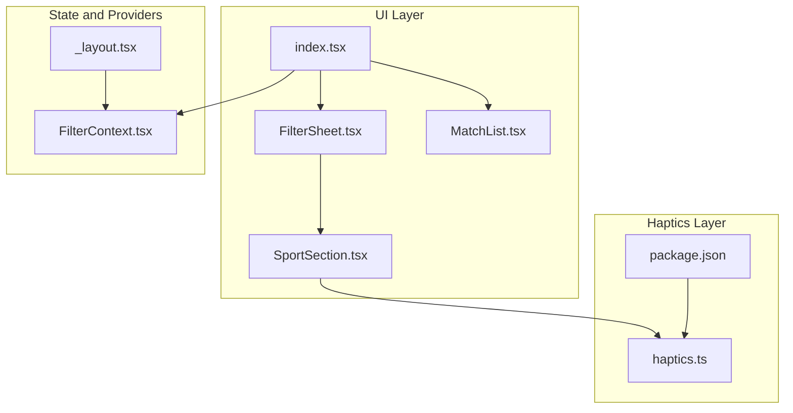
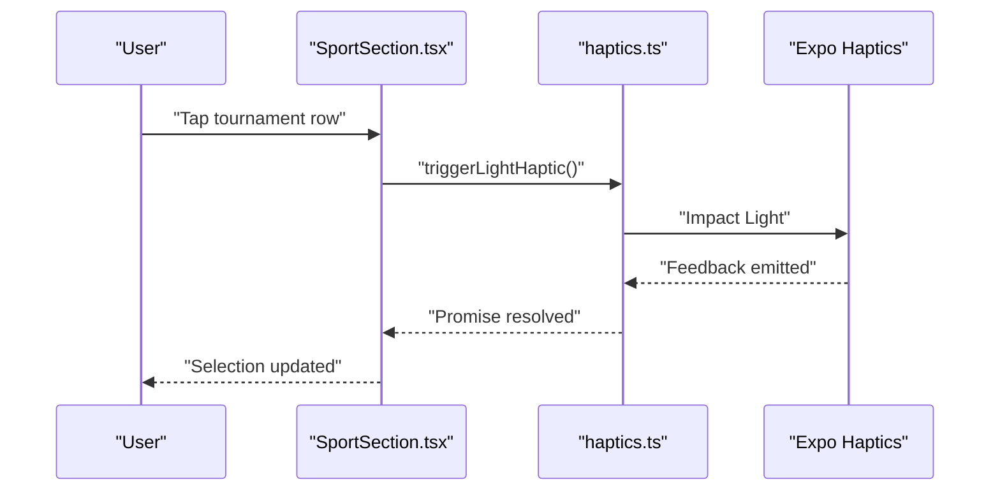
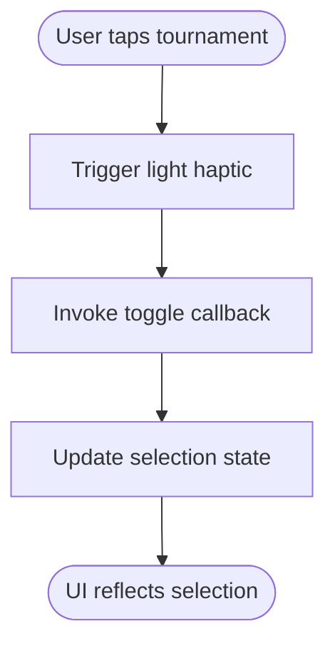
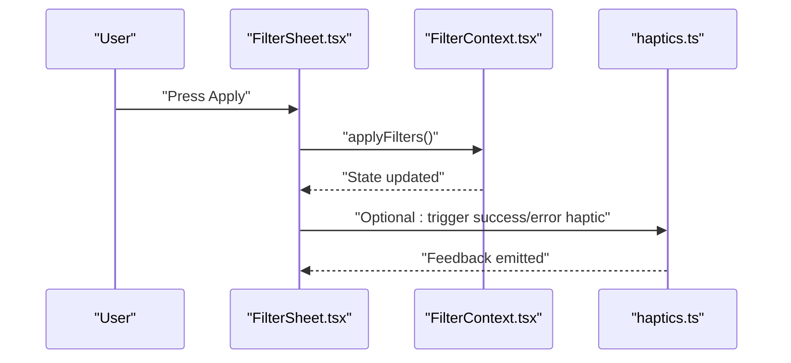
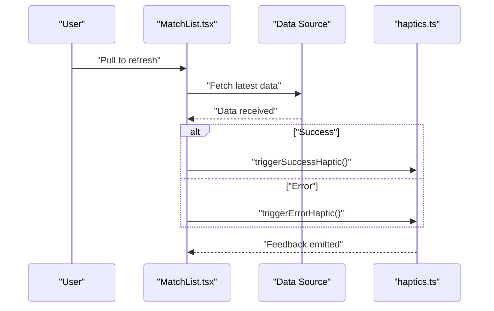
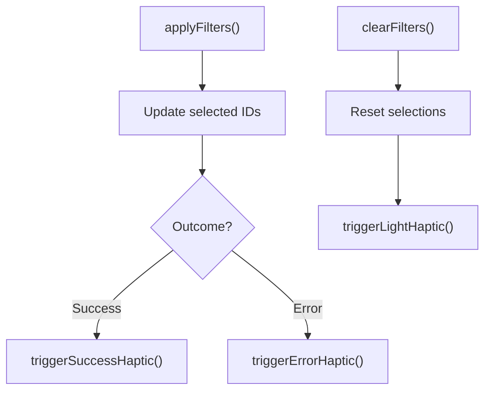
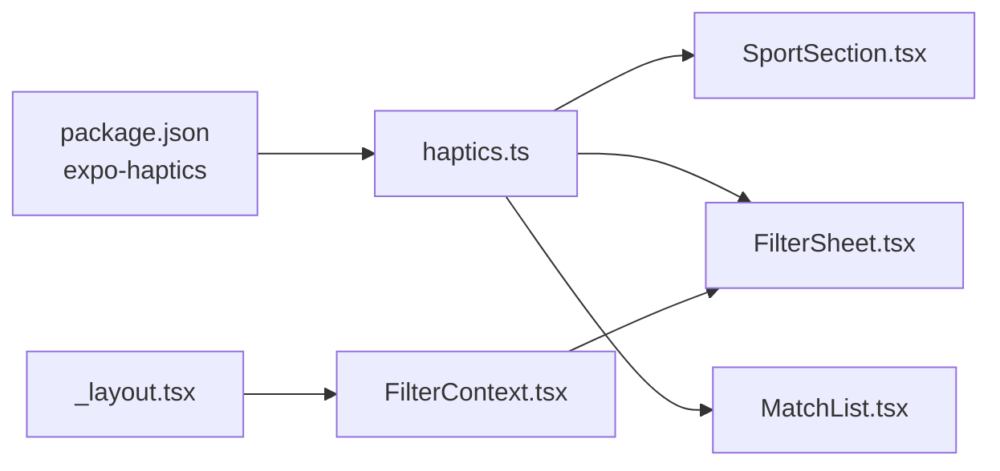

# Haptics and Feedback

<cite>
**Referenced Files in This Document**
- [haptics.ts](file://app/utils/haptics.ts)
- [package.json](file://package.json)
- [SportSection.tsx](file://app/components/filter/SportSection.tsx)
- [FilterSheet.tsx](file://app/components/filter/FilterSheet.tsx)
- [MatchList.tsx](file://app/components/match/MatchList.tsx)
- [_layout.tsx](file://app/_layout.tsx)
- [index.tsx](file://app/index.tsx)
- [FilterContext.tsx](file://app/context/FilterContext.tsx)
</cite>

## Table of Contents
1. [Introduction](#introduction)
2. [Project Structure](#project-structure)
3. [Core Components](#core-components)
4. [Architecture Overview](#architecture-overview)
5. [Detailed Component Analysis](#detailed-component-analysis)
6. [Dependency Analysis](#dependency-analysis)
7. [Performance Considerations](#performance-considerations)
8. [Troubleshooting Guide](#troubleshooting-guide)
9. [Conclusion](#conclusion)

## Introduction
This document explains the haptic feedback and user interaction utilities implemented in the project. It focuses on how haptic patterns are integrated with React Native’s haptics API via Expo, how different user actions trigger feedback, and how the system handles platform differences. It also covers usage examples for filter application, pull-to-refresh, and match selection, along with accessibility considerations, customization options, and performance implications.

## Project Structure
Haptic feedback is centralized in a dedicated utility module and consumed by UI components and contexts. The main integration points are:
- A haptics utility module exporting lightweight wrappers around Expo haptics.
- UI components that trigger haptic feedback on user interactions.
- A provider that manages filter state and exposes actions that can be paired with haptic feedback.
- The application layout that wires providers and navigation.

**Diagram sources**
- [haptics.ts](file://app/utils/haptics.ts#L1-L34)
- [package.json](file://package.json#L28-L28)
- [SportSection.tsx](file://app/components/filter/SportSection.tsx#L6-L48)
- [FilterSheet.tsx](file://app/components/filter/FilterSheet.tsx#L1-L128)
- [MatchList.tsx](file://app/components/match/MatchList.tsx#L1-L117)
- [_layout.tsx](file://app/_layout.tsx#L1-L35)
- [index.tsx](file://app/index.tsx#L1-L108)
- [FilterContext.tsx](file://app/context/FilterContext.tsx#L1-L72)

**Section sources**
- [haptics.ts](file://app/utils/haptics.ts#L1-L34)
- [package.json](file://package.json#L28-L28)
- [SportSection.tsx](file://app/components/filter/SportSection.tsx#L1-L82)
- [FilterSheet.tsx](file://app/components/filter/FilterSheet.tsx#L1-L128)
- [MatchList.tsx](file://app/components/match/MatchList.tsx#L1-L117)
- [_layout.tsx](file://app/_layout.tsx#L1-L35)
- [index.tsx](file://app/index.tsx#L1-L108)
- [FilterContext.tsx](file://app/context/FilterContext.tsx#L1-L72)

## Core Components
- Haptics utility module: Provides four haptic triggers:
  - Light impact feedback
  - Medium impact feedback
  - Success notification feedback
  - Error notification feedback
- UI components:
  - SportSection: Triggers light haptic on tournament selection toggles.
  - FilterSheet: Presents filter controls; haptic feedback is wired to selection actions.
  - MatchList: Uses a native RefreshControl for pull-to-refresh; haptic feedback is not currently integrated here.
- Providers:
  - FilterContext: Manages filter state and exposes actions like apply/clear filters; haptic feedback can be added to these actions.

Each haptic function wraps the underlying API call in a try/catch block to gracefully handle environments where haptics are unavailable.

**Section sources**
- [haptics.ts](file://app/utils/haptics.ts#L3-L33)
- [SportSection.tsx](file://app/components/filter/SportSection.tsx#L47-L48)
- [FilterSheet.tsx](file://app/components/filter/FilterSheet.tsx#L28-L31)
- [FilterContext.tsx](file://app/context/FilterContext.tsx#L41-L43)

## Architecture Overview
The haptic feedback architecture follows a thin utility layer pattern:
- UI components call haptic functions from the utility module.
- The utility module delegates to Expo haptics.
- Providers orchestrate user actions; haptic feedback can be inserted at key interaction points.

**Diagram sources**
- [SportSection.tsx](file://app/components/filter/SportSection.tsx#L47-L48)
- [haptics.ts](file://app/utils/haptics.ts#L3-L8)

## Detailed Component Analysis

### Haptics Utility Module
- Purpose: Centralized haptic triggers for consistent feedback across the app.
- Implementation:
  - Light and medium impact haptics use impact feedback with distinct styles.
  - Success and error haptics use notification feedback types.
  - All functions are asynchronous and wrapped in try/catch to avoid crashes on unsupported devices.
- Platform considerations:
  - The module depends on the Expo haptics package. Availability varies by device and OS version.
  - Fallback behavior is handled by silently catching errors.

Usage examples:
- Selection toggling in SportSection triggers light haptic.
- Filter application action can trigger success/error haptic depending on outcome.

**Section sources**
- [haptics.ts](file://app/utils/haptics.ts#L1-L34)
- [package.json](file://package.json#L28-L28)

### SportSection Component
- Role: Renders a sport category and its tournaments, allowing selection.
- Interaction with haptics:
  - On pressing a tournament row, the component triggers a light haptic feedback before invoking the parent’s toggle handler.
- Accessibility note:
  - Visual selection indicators complement the haptic feedback for users who rely on visual cues.

**Diagram sources**
- [SportSection.tsx](file://app/components/filter/SportSection.tsx#L47-L50)

**Section sources**
- [SportSection.tsx](file://app/components/filter/SportSection.tsx#L47-L50)

### FilterSheet Component
- Role: Presents a bottom sheet with filter options and footer controls.
- Interaction with haptics:
  - The apply button invokes the apply action; haptic feedback can be added here to confirm successful application.
  - The reset button clears filters; haptic feedback can be added to confirm the reset.
- Current state:
  - Apply and reset actions are wired but do not currently trigger haptic feedback.

**Diagram sources**
- [FilterSheet.tsx](file://app/components/filter/FilterSheet.tsx#L28-L31)
- [FilterContext.tsx](file://app/context/FilterContext.tsx#L41-L43)
- [haptics.ts](file://app/utils/haptics.ts#L19-L33)

**Section sources**
- [FilterSheet.tsx](file://app/components/filter/FilterSheet.tsx#L28-L31)
- [FilterContext.tsx](file://app/context/FilterContext.tsx#L41-L43)

### MatchList Component and Pull-to-Refresh
- Role: Displays a scrollable list of matches with infinite loading and pull-to-refresh.
- Interaction with haptics:
  - The current implementation uses a native RefreshControl for pull-to-refresh. There is no haptic feedback associated with refresh actions.
- Recommendation:
  - Integrate success/error haptic feedback after refresh completes to signal outcomes to users.

**Diagram sources**
- [MatchList.tsx](file://app/components/match/MatchList.tsx#L96-L103)
- [haptics.ts](file://app/utils/haptics.ts#L19-L33)

**Section sources**
- [MatchList.tsx](file://app/components/match/MatchList.tsx#L96-L103)

### Provider Integration and Filter Actions
- Role: FilterContext manages filter state and exposes actions such as applying and clearing filters.
- Integration points for haptics:
  - applyFilters: Can trigger success haptic upon successful application.
  - clearFilters: Can trigger a neutral confirmation haptic when resetting selections.

**Diagram sources**
- [FilterContext.tsx](file://app/context/FilterContext.tsx#L41-L43)
- [haptics.ts](file://app/utils/haptics.ts#L19-L33)

**Section sources**
- [FilterContext.tsx](file://app/context/FilterContext.tsx#L41-L43)

## Dependency Analysis
- External dependency: The project relies on the Expo haptics package for feedback generation.
- Internal dependency: UI components depend on the haptics utility module.
- Provider dependency: Filter actions are orchestrated by the FilterContext provider.

**Diagram sources**
- [package.json](file://package.json#L28-L28)
- [haptics.ts](file://app/utils/haptics.ts#L1-L34)
- [SportSection.tsx](file://app/components/filter/SportSection.tsx#L6-L6)
- [FilterSheet.tsx](file://app/components/filter/FilterSheet.tsx#L1-L14)
- [MatchList.tsx](file://app/components/match/MatchList.tsx#L1-L14)
- [FilterContext.tsx](file://app/context/FilterContext.tsx#L1-L18)
- [_layout.tsx](file://app/_layout.tsx#L1-L8)

**Section sources**
- [package.json](file://package.json#L28-L28)
- [haptics.ts](file://app/utils/haptics.ts#L1-L34)
- [SportSection.tsx](file://app/components/filter/SportSection.tsx#L6-L6)
- [FilterSheet.tsx](file://app/components/filter/FilterSheet.tsx#L1-L14)
- [MatchList.tsx](file://app/components/match/MatchList.tsx#L1-L14)
- [FilterContext.tsx](file://app/context/FilterContext.tsx#L1-L18)
- [_layout.tsx](file://app/_layout.tsx#L1-L8)

## Performance Considerations
- Frequency of haptic calls:
  - Haptic feedback is asynchronous and lightweight. However, frequent haptic calls can still impact perceived responsiveness and battery life.
- Recommendations:
  - Batch rapid selections (e.g., multiple tournament toggles) and emit a single haptic after the batch completes.
  - Debounce or throttle haptic triggers in tight loops.
  - Prefer lighter haptic styles for frequent interactions and reserve stronger feedback for significant actions.

## Troubleshooting Guide
- Haptics do not trigger:
  - Verify that the Expo haptics package is installed and linked.
  - Ensure the haptic functions are called within a user interaction handler (e.g., press handlers).
  - Confirm that the device supports haptics; the utility catches errors and falls back silently.
- Integration points to review:
  - Ensure haptic triggers are placed at key actions (selection, apply, clear, refresh completion).
  - Validate that provider actions (apply/clear filters) are wired to trigger appropriate haptic feedback.

**Section sources**
- [haptics.ts](file://app/utils/haptics.ts#L3-L8)
- [package.json](file://package.json#L28-L28)

## Conclusion
The project implements a clean, modular haptics utility that integrates with Expo haptics to deliver immediate tactile feedback for user interactions. Current usage focuses on selection toggles within the filter interface, while other key interactions—such as filter application, reset, and pull-to-refresh—can be extended to include success/error haptic feedback. By following the recommendations for batching, throttling, and accessibility, the haptic system can enhance usability without compromising performance or inclusivity.