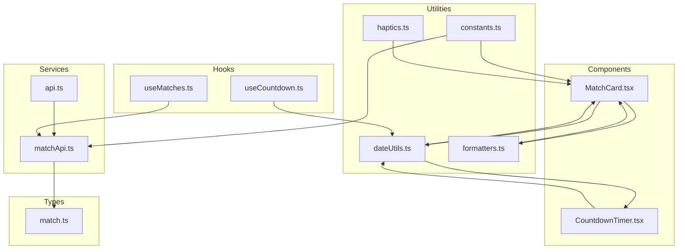
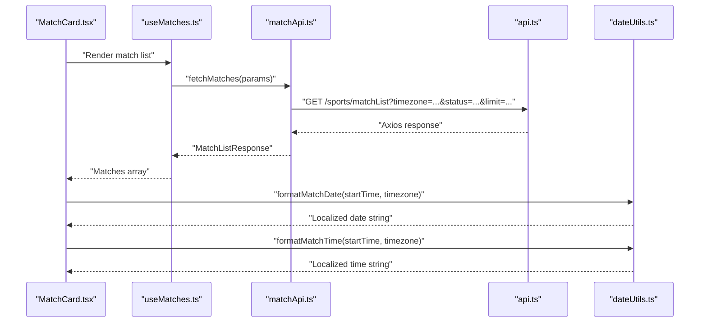
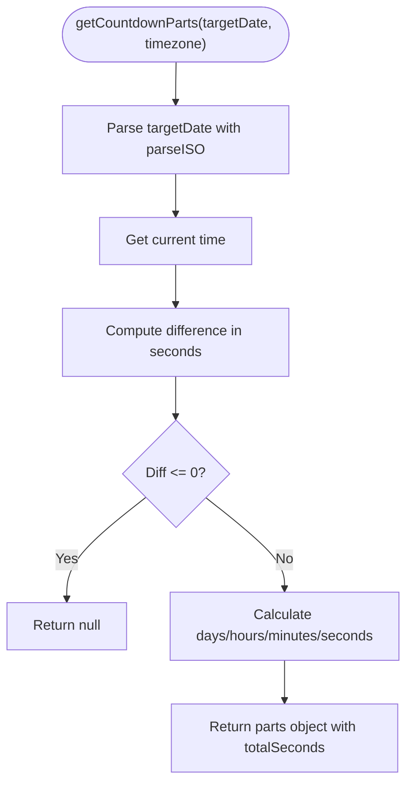
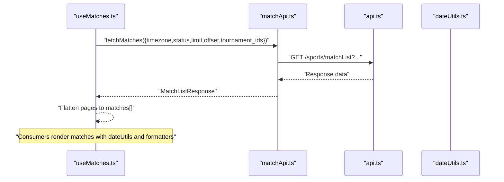
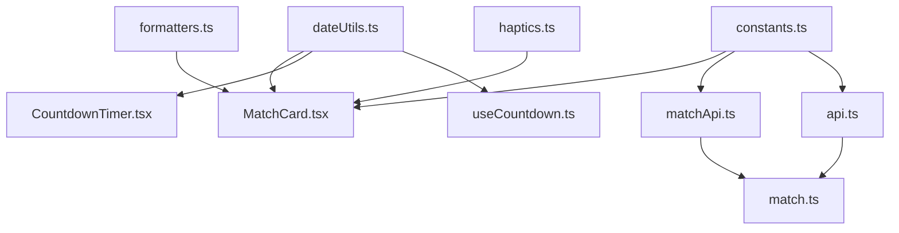

# Utilities and Helpers

<cite>
**Referenced Files in This Document**
- [constants.ts](file://app/utils/constants.ts)
- [dateUtils.ts](file://app/utils/dateUtils.ts)
- [formatters.ts](file://app/utils/formatters.ts)
- [haptics.ts](file://app/utils/haptics.ts)
- [matchApi.ts](file://app/services/matchApi.ts)
- [api.ts](file://app/services/api.ts)
- [useMatches.ts](file://app/hooks/useMatches.ts)
- [useCountdown.ts](file://app/hooks/useCountdown.ts)
- [MatchCard.tsx](file://app/components/match/MatchCard.tsx)
- [CountdownTimer.tsx](file://app/components/match/CountdownTimer.tsx)
- [match.ts](file://app/types/match.ts)
- [package.json](file://package.json)
</cite>

## Table of Contents
1. [Introduction](#introduction)
2. [Project Structure](#project-structure)
3. [Core Components](#core-components)
4. [Architecture Overview](#architecture-overview)
5. [Detailed Component Analysis](#detailed-component-analysis)
6. [Dependency Analysis](#dependency-analysis)
7. [Performance Considerations](#performance-considerations)
8. [Troubleshooting Guide](#troubleshooting-guide)
9. [Conclusion](#conclusion)
10. [Appendices](#appendices)

## Introduction
This document provides comprehensive documentation for the utility and helper modules used across the React Native sports match application. It focuses on four core utility categories:
- Constants and configuration values for API endpoints, media URLs, default timezone, page size, and theme tokens
- Date and time utilities for formatting match times/dates, calculating countdowns, and determining match status
- Formatting helpers for text truncation, capitalization, team initials, and status labels/colors
- Haptics integration for user interaction feedback

The documentation explains implementation patterns, parameter specifications, return value formats, usage examples, edge case handling, performance considerations, internationalization support, locale-specific formatting, and accessibility considerations.

## Project Structure
The utilities are organized under the app/utils directory and are consumed by services, hooks, and components. The following diagram shows the high-level structure and relationships:

**Diagram sources**
- [constants.ts](file://app/utils/constants.ts#L1-L38)
- [dateUtils.ts](file://app/utils/dateUtils.ts#L1-L64)
- [formatters.ts](file://app/utils/formatters.ts#L1-L47)
- [haptics.ts](file://app/utils/haptics.ts#L1-L34)
- [api.ts](file://app/services/api.ts#L1-L40)
- [matchApi.ts](file://app/services/matchApi.ts#L1-L36)
- [useMatches.ts](file://app/hooks/useMatches.ts#L1-L56)
- [useCountdown.ts](file://app/hooks/useCountdown.ts#L1-L54)
- [MatchCard.tsx](file://app/components/match/MatchCard.tsx#L1-L142)
- [CountdownTimer.tsx](file://app/components/match/CountdownTimer.tsx#L1-L43)
- [match.ts](file://app/types/match.ts#L1-L46)

**Section sources**
- [constants.ts](file://app/utils/constants.ts#L1-L38)
- [dateUtils.ts](file://app/utils/dateUtils.ts#L1-L64)
- [formatters.ts](file://app/utils/formatters.ts#L1-L47)
- [haptics.ts](file://app/utils/haptics.ts#L1-L34)
- [api.ts](file://app/services/api.ts#L1-L40)
- [matchApi.ts](file://app/services/matchApi.ts#L1-L36)
- [useMatches.ts](file://app/hooks/useMatches.ts#L1-L56)
- [useCountdown.ts](file://app/hooks/useCountdown.ts#L1-L54)
- [MatchCard.tsx](file://app/components/match/MatchCard.tsx#L1-L142)
- [CountdownTimer.tsx](file://app/components/match/CountdownTimer.tsx#L1-L43)
- [match.ts](file://app/types/match.ts#L1-L46)

## Core Components
This section documents each utility module, including purpose, parameters, return values, and usage patterns.

- constants.ts
  - Purpose: Centralized configuration values for API base URLs, media base URL, default timezone, default page size, color palette, sport-specific colors, and sport icons.
  - Key exports:
    - API_BASE_URL: Base URL for API requests
    - MEDIA_BASE_URL: Base URL for media assets
    - DEFAULT_TIMEZONE: Default timezone used for date/time operations
    - DEFAULT_PAGE_SIZE: Default pagination limit
    - COLORS: Theme tokens for UI
    - SPORT_COLORS: Mapping sport IDs to brand colors
    - SPORT_ICONS: Mapping sport IDs to icon identifiers
  - Usage patterns:
    - Services consume API_BASE_URL and MEDIA_BASE_URL
    - Components consume COLORS, SPORT_COLORS, and SPORT_ICONS for styling and icons
    - Hooks use DEFAULT_TIMEZONE and DEFAULT_PAGE_SIZE for defaults

- dateUtils.ts
  - Purpose: Date/time formatting and countdown calculation utilities with timezone support.
  - Functions:
    - formatMatchTime(dateString, timezone='Australia/Sydney'): string
      - Formats a UTC ISO date string into a localized time string (e.g., "10:30 AM")
      - Returns empty string on invalid input
    - formatMatchDate(dateString, timezone='Australia/Sydney'): string
      - Formats a UTC ISO date string into a localized date string (e.g., "Fri, Oct 11")
      - Returns empty string on invalid input
    - getCountdownParts(targetDate, timezone='Australia/Sydney'): {days,hours,minutes,seconds,totalSeconds} | null
      - Computes time remaining until targetDate; returns null if expired
      - Uses date-fns and date-fns-tz for timezone-aware calculations
    - formatCountdown(parts): string
      - Human-readable countdown string; shows days/hours/minutes/seconds depending on magnitude
    - isMatchLive(status): boolean
    - isMatchUpcoming(status): boolean
    - isMatchCompleted(status): boolean
  - Edge cases:
    - Invalid ISO dates return empty strings or null
    - Expired countdowns return null and mark as expired
  - Internationalization:
    - Uses date-fns-tz with timezone identifiers (e.g., "Australia/Sydney") for locale-aware formatting

- formatters.ts
  - Purpose: String formatting helpers for UI presentation.
  - Functions:
    - truncateText(text, maxLength): string
      - Truncates text at maxLength and appends "..."
    - capitalizeFirst(text): string
      - Capitalizes first letter and lowercases the rest
    - formatTournamentIds(ids): string
      - Joins numeric tournament IDs with commas
    - getTeamInitials(name): string
      - Extracts up to 3 initials from team name
    - getStatusColor(status): string
      - Returns color hex based on match status
    - getStatusLabel(status): string
      - Returns uppercase label for status (e.g., "LIVE", "Upcoming", "Completed")

- haptics.ts
  - Purpose: Haptic feedback integration using Expo Haptics.
  - Functions:
    - triggerLightHaptic(): Promise<void>
    - triggerMediumHaptic(): Promise<void>
    - triggerSuccessHaptic(): Promise<void>
    - triggerErrorHaptic(): Promise<void>
  - Behavior:
    - Wrapped in try/catch to gracefully handle devices without haptic capability
    - Light/Medium impact styles; Success/Error notification styles

**Section sources**
- [constants.ts](file://app/utils/constants.ts#L1-L38)
- [dateUtils.ts](file://app/utils/dateUtils.ts#L1-L64)
- [formatters.ts](file://app/utils/formatters.ts#L1-L47)
- [haptics.ts](file://app/utils/haptics.ts#L1-L34)

## Architecture Overview
The utilities integrate with services, hooks, and components to deliver a cohesive user experience. The following sequence diagram illustrates how match data flows from the API to the UI, including date/time formatting and countdown rendering:

**Diagram sources**
- [MatchCard.tsx](file://app/components/match/MatchCard.tsx#L1-L142)
- [useMatches.ts](file://app/hooks/useMatches.ts#L1-L56)
- [matchApi.ts](file://app/services/matchApi.ts#L1-L36)
- [api.ts](file://app/services/api.ts#L1-L40)
- [dateUtils.ts](file://app/utils/dateUtils.ts#L1-L64)

## Detailed Component Analysis

### Constants Module
- Purpose: Provide centralized configuration values used across the app.
- Implementation patterns:
  - Exports immutable constants using "as const" for type safety
  - Uses Record<number,string> for sport-to-color/icon mappings
- Parameter specifications:
  - No parameters; exported values are used directly
- Return value formats:
  - Strings for URLs and colors
  - Numeric keys for sport mappings
- Usage examples:
  - Components use COLORS for styling and SPORT_COLORS/SPORT_ICONS for branding
  - Services use API_BASE_URL and MEDIA_BASE_URL for asset resolution
- Edge case handling:
  - Mappings assume known sport IDs; unknown IDs fall back to defaults in consumers
- Accessibility considerations:
  - Color tokens are contrast-aware; ensure sufficient contrast in UI

**Section sources**
- [constants.ts](file://app/utils/constants.ts#L1-L38)

### Date and Time Utilities
- Purpose: Provide timezone-aware date formatting and countdown calculations.
- Implementation patterns:
  - Uses date-fns and date-fns-tz for robust parsing and formatting
  - Implements safe fallbacks returning empty strings or null on errors
  - Uses requestAnimationFrame in hooks for efficient updates
- Parameter specifications:
  - formatMatchTime(dateString, timezone?): string
  - formatMatchDate(dateString, timezone?): string
  - getCountdownParts(targetDate, timezone?): {days,hours,minutes,seconds,totalSeconds} | null
  - formatCountdown(parts): string
  - isMatchLive/upcoming/completed(status): boolean
- Return value formats:
  - Formatted time/date strings
  - Countdown parts object or null
  - Boolean flags for match status
- Usage examples:
  - MatchCard displays formatted date/time using formatMatchDate/formatMatchTime
  - CountdownTimer renders countdown via useCountdown hook consuming dateUtils
- Edge case handling:
  - Invalid ISO dates handled gracefully
  - Expired countdowns return null and mark as expired
- Internationalization support:
  - Timezone parameter enables locale-aware formatting
  - DEFAULT_TIMEZONE ensures sensible defaults
- Accessibility considerations:
  - Ensure readable time formats and sufficient color contrast for status indicators

**Diagram sources**
- [dateUtils.ts](file://app/utils/dateUtils.ts#L22-L41)

**Section sources**
- [dateUtils.ts](file://app/utils/dateUtils.ts#L1-L64)
- [useCountdown.ts](file://app/hooks/useCountdown.ts#L1-L54)
- [MatchCard.tsx](file://app/components/match/MatchCard.tsx#L1-L142)
- [CountdownTimer.tsx](file://app/components/match/CountdownTimer.tsx#L1-L43)

### Formatting Helpers
- Purpose: Provide UI-friendly string transformations.
- Implementation patterns:
  - Defensive checks for empty or missing inputs
  - Consistent return types (strings)
- Parameter specifications:
  - truncateText(text, maxLength): number
  - capitalizeFirst(text): string
  - formatTournamentIds(ids): number[]
  - getTeamInitials(name): string
  - getStatusColor(status): string
  - getStatusLabel(status): string
- Return value formats:
  - Strings for transformed text and labels
  - Hex color strings for status colors
- Usage examples:
  - MatchCard uses getTeamInitials for placeholder avatars and getStatusLabel for status badges
- Edge case handling:
  - Empty or null inputs return empty strings or defaults
- Accessibility considerations:
  - Ensure labels are concise and screen-reader friendly

**Section sources**
- [formatters.ts](file://app/utils/formatters.ts#L1-L47)
- [MatchCard.tsx](file://app/components/match/MatchCard.tsx#L1-L142)

### Haptics Integration
- Purpose: Provide tactile feedback for user interactions.
- Implementation patterns:
  - Uses Expo Haptics with explicit try/catch blocks
  - Exposes distinct functions for light/medium impacts and success/error notifications
- Parameter specifications:
  - No parameters; functions are fire-and-forget
- Return value formats:
  - Promise<void>; errors are swallowed
- Usage examples:
  - Components can trigger haptics on press events using triggerLightHaptic or triggerSuccessHaptic
- Edge case handling:
  - Devices without haptic capability silently fail
- Accessibility considerations:
  - Respect user preferences; avoid excessive haptic feedback

**Section sources**
- [haptics.ts](file://app/utils/haptics.ts#L1-L34)

### API Integration and Data Flow
- Purpose: Demonstrate how utilities integrate with services and hooks.
- Implementation patterns:
  - Services append timezone to API requests
  - Hooks manage pagination and caching with React Query
  - Types define shape of match data
- Parameter specifications:
  - matchApi.fetchMatches(params: MatchListParams)
  - useMatches(options: UseMatchesOptions)
- Return value formats:
  - MatchListResponse with matches, total, offset, limit
  - Infinite query result with paginated matches
- Usage examples:
  - MatchCard consumes formatted date/time and status labels
  - CountdownTimer consumes countdown parts and status

**Diagram sources**
- [useMatches.ts](file://app/hooks/useMatches.ts#L1-L56)
- [matchApi.ts](file://app/services/matchApi.ts#L1-L36)
- [api.ts](file://app/services/api.ts#L1-L40)
- [dateUtils.ts](file://app/utils/dateUtils.ts#L1-L64)
- [formatters.ts](file://app/utils/formatters.ts#L1-L47)

**Section sources**
- [matchApi.ts](file://app/services/matchApi.ts#L1-L36)
- [api.ts](file://app/services/api.ts#L1-L40)
- [useMatches.ts](file://app/hooks/useMatches.ts#L1-L56)
- [match.ts](file://app/types/match.ts#L1-L46)

## Dependency Analysis
The following diagram shows the dependency relationships among utility modules and their consumers:

**Diagram sources**
- [dateUtils.ts](file://app/utils/dateUtils.ts#L1-L64)
- [formatters.ts](file://app/utils/formatters.ts#L1-L47)
- [constants.ts](file://app/utils/constants.ts#L1-L38)
- [haptics.ts](file://app/utils/haptics.ts#L1-L34)
- [MatchCard.tsx](file://app/components/match/MatchCard.tsx#L1-L142)
- [CountdownTimer.tsx](file://app/components/match/CountdownTimer.tsx#L1-L43)
- [useCountdown.ts](file://app/hooks/useCountdown.ts#L1-L54)
- [matchApi.ts](file://app/services/matchApi.ts#L1-L36)
- [api.ts](file://app/services/api.ts#L1-L40)
- [match.ts](file://app/types/match.ts#L1-L46)

**Section sources**
- [package.json](file://package.json#L13-L49)

## Performance Considerations
- Date/time formatting:
  - Use timezone-aware formatting to avoid unnecessary conversions
  - Memoize components that render frequently (already using React.memo)
- Countdown updates:
  - useCountdown throttles updates to once per second using requestAnimationFrame
  - Cancels animation frame on unmount to prevent leaks
- Network requests:
  - React Query caching reduces redundant API calls
  - DEFAULT_PAGE_SIZE balances performance and UX
- Rendering:
  - Avoid re-computing formatters inside render; pass precomputed values
  - Use minimal re-renders by keeping props stable

[No sources needed since this section provides general guidance]

## Troubleshooting Guide
- Invalid date strings:
  - Symptoms: Empty time/date strings or null countdown parts
  - Resolution: Ensure backend sends valid ISO date strings; handle nulls in UI
- Timezone mismatches:
  - Symptoms: Incorrect time display
  - Resolution: Pass correct timezone; use DEFAULT_TIMEZONE as fallback
- Haptic failures:
  - Symptoms: Silent failures on unsupported devices
  - Resolution: Functions already wrapped in try/catch; no action needed
- API errors:
  - Symptoms: Console errors and rejected promises
  - Resolution: API interceptors log detailed error info; surface messages to users

**Section sources**
- [dateUtils.ts](file://app/utils/dateUtils.ts#L4-L11)
- [dateUtils.ts](file://app/utils/dateUtils.ts#L13-L20)
- [dateUtils.ts](file://app/utils/dateUtils.ts#L22-L41)
- [haptics.ts](file://app/utils/haptics.ts#L3-L9)
- [api.ts](file://app/services/api.ts#L22-L37)

## Conclusion
The utility modules provide a solid foundation for date/time handling, formatting, configuration, and haptic feedback. They are designed with error resilience, timezone awareness, and performance in mind. Integrating these utilities across services, hooks, and components ensures consistent behavior and a responsive user experience.

[No sources needed since this section summarizes without analyzing specific files]

## Appendices

### API Definitions and Usage Notes
- API base URL and media base URL are configured centrally and used by services and components.
- Match list endpoint accepts timezone, status, todate, tournament_ids, limit, and offset parameters.
- Match data includes timezone, enabling accurate local formatting.

**Section sources**
- [constants.ts](file://app/utils/constants.ts#L1-L3)
- [matchApi.ts](file://app/services/matchApi.ts#L4-L25)
- [match.ts](file://app/types/match.ts#L16-L29)

### Internationalization and Locale-Specific Formatting
- Timezone support:
  - dateUtils functions accept a timezone parameter; DEFAULT_TIMEZONE is used when omitted
  - date-fns-tz ensures correct DST and locale-aware formatting
- Status labels:
  - getStatusLabel returns uppercase labels suitable for most locales
- Recommendations:
  - Consider adding locale-aware formatting for dates/times if broader localization is required

**Section sources**
- [dateUtils.ts](file://app/utils/dateUtils.ts#L4-L20)
- [formatters.ts](file://app/utils/formatters.ts#L35-L46)

### Accessibility Considerations
- Color contrast:
  - Use STATUS_COLOR values with sufficient contrast against backgrounds
- Screen reader compatibility:
  - Ensure labels and status indicators are announced clearly
- Haptic feedback:
  - Respect user preferences; avoid excessive haptic triggers

**Section sources**
- [formatters.ts](file://app/utils/formatters.ts#L22-L33)
- [haptics.ts](file://app/utils/haptics.ts#L1-L34)